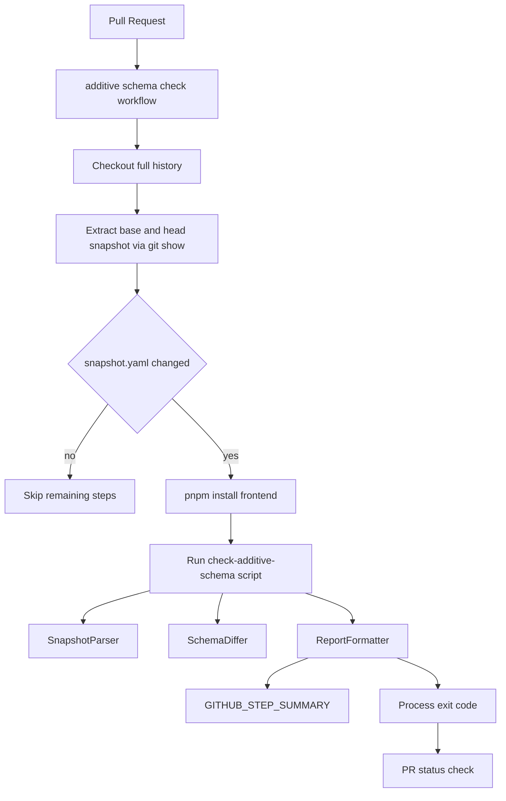
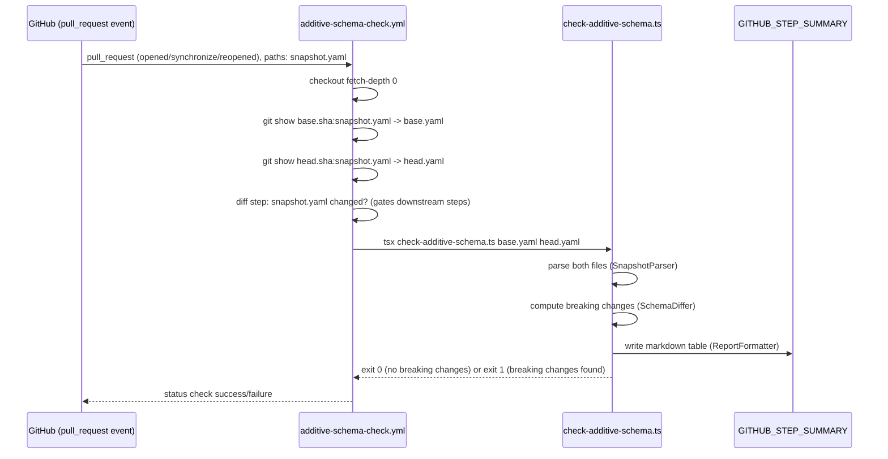

# Technical Design: additive-only-schema-check

## Overview

**Purpose**: This feature delivers automatic, machine-enforced detection of destructive `directus/schema/snapshot.yaml` changes to PR authors and reviewers, replacing the current visual-inspection-only enforcement of the additive-only rule documented in CLAUDE.md.

**Users**: フロントエンド/インフラ開発者 who open PRs touching `directus/schema/snapshot.yaml`, and PR reviewers who currently must manually diff the YAML to spot collection/field deletions or type changes.

**Impact**: Adds a new PR-triggered GitHub Actions workflow and a new diff-logic script under `frontend/`. Does not modify `directus-schema-sync.yml` (push-to-main sync flow) or any existing workflow's trigger/behavior.

### Goals
- Detect collection deletions, field deletions, `type`/`schema.data_type` changes, and `schema.is_nullable: true → false` changes between a PR's base and head `snapshot.yaml`.
- Report detected breaking changes in a human-readable form in the GitHub Actions run, and fail the PR's status check when any are found.
- Pass additive-only PRs (new collections/fields, meta-only edits) without false positives.

### Non-Goals
- Validating `directus/migrations/**` script contents (out of scope per Boundary Context).
- Detecting relation-level (`relations:` section) breaking changes.
- Auto-repairing or auto-reverting detected breaking changes.
- Providing a label/comment-based mechanism to force the check back to success — sanctioned breaking changes still require a repo admin's branch-protection override, unchanged from today's implicit process (see [[Decision: No automated "reviewer approved" bypass signal for R6.3]] in research.md).
- Flagging changes to `schema.*` attributes other than `data_type`/`is_nullable` (e.g. `default_value`, `is_indexed`, `foreign_key_table`) or to any `meta.*` key — these are explicitly non-breaking per 5.2.

## Boundary Commitments

### This Spec Owns
- A new workflow file `.github/workflows/additive-schema-check.yml` and its trigger/gating logic.
- A new pure diff-logic module `frontend/scripts/check-additive-schema.ts` (types, comparison, report formatting, CLI entrypoint).
- The definition of what counts as a "breaking change" for `snapshot.yaml` (collection delete, field delete, type/data_type change, is_nullable true→false).
- The PR status check outcome (success/failure) for this specific check.

### Out of Boundary
- `directus-schema-sync.yml` (push-to-main → infra ConfigMap sync) — untouched, continues to own its own trigger and behavior.
- `directus/migrations/**` content validation — deferred, no spec owns this yet.
- Actual `directus schema apply` execution against any environment — remains owned by the existing ArgoCD/K8s Job flow described in CLAUDE.md.
- Branch protection configuration (marking this check as "required") — a one-time repo-admin action outside this spec's code changes; noted as a rollout prerequisite.

### Allowed Dependencies
- `frontend/` existing devDependencies: `yaml` (parsing), `vitest` (tests). New devDependency: `tsx` (script execution).
- GitHub Actions built-ins: `actions/checkout@v4`, `actions/setup-node@v4`, `pnpm/action-setup@v4`, `$GITHUB_STEP_SUMMARY`.
- Must not depend on `directus-schema-sync.yml` or any infra-repo secret/token — this check only reads repo-local files.

### Revalidation Triggers
- Changes to the `snapshot.yaml` top-level structure (`collections:`/`fields:`/`relations:` keys or the `fields[].schema` shape) must re-validate the type definitions in `frontend/scripts/check-additive-schema.ts`.
- Changes to how GitHub populates `pull_request` event `base.sha`/`head.sha` (unlikely, but any GitHub Actions behavior change here) must re-validate the extraction step.
- Any future spec adding a bypass/override mechanism must re-check the Non-Goal decision recorded above.

## Architecture

### Existing Architecture Analysis
- `.github/workflows/` currently holds one PR-triggered workflow (`frontend-ci.yml`, gated on `frontend/**` paths) and one push-triggered workflow (`directus-schema-sync.yml`, gated on `directus/schema/snapshot.yaml` + `directus/migrations/**` paths). Neither currently does base/head content comparison — `directus-schema-sync.yml` only diffs `HEAD^` vs `HEAD` on a linear push history.
- Workflow-structure tests live in `frontend/*.workflow.test.ts` regardless of the workflow's domain (established by `frontend/directus-schema-sync.workflow.test.ts` testing a directus-domain workflow). This spec follows that precedent.
- `frontend/package.json` has no standalone-script execution tool (`tsx`/`ts-node`); this spec introduces `tsx` as the minimal addition (see research.md).

### Architecture Pattern & Boundary Map



**Architecture Integration**:
- Selected pattern: Linear CI pipeline (extract → parse → diff → report), mirroring the existing `directus-schema-sync.yml` step-gating style (`if: steps.diff.outputs.changed == 'true'`).
- Domain/feature boundaries: All comparison logic lives in one pure TypeScript module (`check-additive-schema.ts`) with no GitHub Actions-specific code inside it — the workflow YAML only handles extraction/gating/invocation, keeping the logic independently testable (per `design-principles.md` §7 Contract First).
- Existing patterns preserved: `pull_request: types: [opened, synchronize, reopened]` trigger style from `frontend-ci.yml`; step-id + `if:`-gating style from `directus-schema-sync.yml`; workflow-structure test convention from `frontend/*.workflow.test.ts`.
- New components rationale: `SnapshotParser`/`SchemaDiffer`/`ReportFormatter` are separated so each has one responsibility (parse untyped YAML → typed model; compute breaking changes; format for humans) and each can be unit-tested without invoking git or GitHub Actions.
- Steering compliance: No `.kiro/steering/` files exist in this repo (confirmed empty); this design instead aligns to observable conventions in `.github/workflows/` and `frontend/` as the closest available project memory.

### Technology Stack

| Layer | Choice / Version | Role in Feature | Notes |
|-------|------------------|-----------------|-------|
| CI / Workflow | GitHub Actions, `actions/checkout@v4` (`fetch-depth: 0`) | Fetches full history so both base/head commit SHAs are resolvable | New workflow file, does not modify existing ones |
| Script Runtime | Node 22 (`actions/setup-node@v4`), `tsx` (new devDependency) | Executes the TypeScript checker without a separate compile step | `tsx` chosen over `--experimental-strip-types` for version stability (research.md) |
| Parsing | `yaml@^2.9.0` (existing devDependency) | Parses base/head `snapshot.yaml` into JS objects | Already used by other workflow tests |
| Test | `vitest@^3.0.0` (existing devDependency) | Unit tests for `SchemaDiffer`/`SnapshotParser` and workflow-structure test | Follows existing `*.workflow.test.ts` convention |

## File Structure Plan

### Directory Structure
```
.github/workflows/
└── additive-schema-check.yml   # New: PR-triggered breaking-change check

frontend/
├── scripts/
│   ├── check-additive-schema.ts        # New: types, parser, differ, reporter, CLI entrypoint
│   └── check-additive-schema.test.ts   # New: unit tests for parser/differ/reporter (fixtures inline)
├── additive-schema-check.workflow.test.ts  # New: workflow YAML structure test (follows existing *.workflow.test.ts pattern)
└── package.json                         # Modified: add `tsx` devDependency
```

### Modified Files
- `frontend/package.json` — add `tsx` to `devDependencies`.

> No existing workflow or script is modified; all changes are additive new files plus one devDependency line.

## System Flows



Key decisions not obvious from the diagram: the "snapshot.yaml changed?" gate re-checks the diff between `base.sha` and `head.sha` (not the workflow's path-filter alone) so that a PR touching multiple files but reverting `snapshot.yaml` back to identical-to-base content still skips cleanly (satisfies 1.2 exactly, not just at trigger level).

## Requirements Traceability

| Requirement | Summary | Components | Interfaces | Flows |
|-------------|---------|------------|------------|-------|
| 1.1 | Run diff check on snapshot.yaml PRs | Workflow, SnapshotParser | CLI entrypoint | Extraction → parse |
| 1.2 | Skip when snapshot.yaml unchanged | Workflow (diff gate step) | Step output `changed` | Gate step |
| 1.3 | Trigger on opened/synchronize/reopened | Workflow (`on.pull_request.types`) | — | — |
| 2.1, 2.2 | Detect + fail on collection deletion | SchemaDiffer | `diffSchemas()` | Diff step |
| 3.1, 3.2 | Detect + fail on field deletion | SchemaDiffer | `diffSchemas()` | Diff step |
| 4.1, 4.2, 4.3 | Detect + fail on type/data_type/is_nullable(true→false) change | SchemaDiffer | `diffSchemas()` | Diff step |
| 5.1, 5.2 | Additive-only PRs pass; meta-only changes ignored | SchemaDiffer (ignore-list) | `diffSchemas()` | Diff step |
| 6.1 | List breaking changes in Actions output | ReportFormatter | `formatSummary()` | Report step |
| 6.2 | Fail PR status check | Workflow (script exit code) | Process exit code | Report step |
| 6.3 | No auto-recovery to success without sanctioned change | Workflow (no bypass mechanism) | — | Non-Goal, see research.md |

## Components and Interfaces

| Component | Domain/Layer | Intent | Req Coverage | Key Dependencies (P0/P1) | Contracts |
|-----------|--------------|--------|---------------|--------------------------|-----------|
| additive-schema-check.yml | CI/Workflow | Trigger, extract, gate, invoke checker, surface result | 1.1, 1.2, 1.3, 6.2 | check-additive-schema.ts (P0) | Batch |
| SnapshotParser | Script/Domain | Parse raw YAML text into typed `ParsedSnapshot` | 1.1 | `yaml` (P0) | Service |
| SchemaDiffer | Script/Domain | Compute breaking/non-breaking changes between two `ParsedSnapshot`s | 2.1, 2.2, 3.1, 3.2, 4.1, 4.2, 4.3, 5.1, 5.2 | SnapshotParser types (P0) | Service |
| ReportFormatter | Script/Domain | Render `SchemaDiffResult` as Markdown summary + decide exit code | 6.1, 6.2 | SchemaDiffer output (P0) | Service |
| CLI entrypoint | Script/Runtime | Wire parser→differ→reporter, read file args, write `$GITHUB_STEP_SUMMARY`, set exit code | 1.1, 6.1, 6.2 | Node `fs`/`process` (P0) | Batch |

### Script / Domain

#### SnapshotParser

| Field | Detail |
|-------|--------|
| Intent | Parse a `snapshot.yaml` file's text content into a typed, minimal structural model |
| Requirements | 1.1 |

**Responsibilities & Constraints**
- Parses only the `collections:` (collection names) and `fields:` (per-field `collection`/`field`/`type`/`schema.data_type`/`schema.is_nullable`) sections needed for comparison; ignores `relations:` and all other `meta.*`/`schema.*` keys (Out of Boundary).
- Must not throw on a field whose `schema` is `null` (alias/relational field with no physical column) — represents it as `schema: null` in the typed model rather than crashing.

**Dependencies**
- External: `yaml` (`parse()`) — P0.

**Contracts**: Service [x]

##### Service Interface
```typescript
interface SnapshotField {
  collection: string;
  field: string;
  type: string | null;
  schema: { data_type: string | null; is_nullable: boolean } | null;
}

interface ParsedSnapshot {
  collections: string[];
  fields: SnapshotField[];
}

interface SnapshotParser {
  parse(yamlText: string): ParsedSnapshot;
}
```
- Preconditions: `yamlText` is valid YAML matching Directus's snapshot shape (`collections[].collection`, `fields[].collection/field/type/schema`).
- Postconditions: Returns a `ParsedSnapshot` with `collections` deduplicated and `fields` in source order.
- Invariants: Never mutates its input string; never returns `undefined` for a field present in the source `fields:` array.

#### SchemaDiffer

| Field | Detail |
|-------|--------|
| Intent | Compare two `ParsedSnapshot`s and classify every difference as breaking or non-breaking |
| Requirements | 2.1, 2.2, 3.1, 3.2, 4.1, 4.2, 4.3, 5.1, 5.2 |

**Responsibilities & Constraints**
- Collection-level: any `base.collections` entry absent from `head.collections` is a `collection-deleted` breaking change (2.1).
- Field-level, keyed by `(collection, field)`: any base field absent from head is `field-deleted` (3.1); a present field with `type` or `schema.data_type` differing is `type-changed` (4.1); a present field with `schema.is_nullable` transitioning `true → false` is `not-null-added` (4.2) — the reverse (`false → true`) is not flagged.
- Fields where either side's `schema` is `null` are excluded from `type-changed`/`not-null-added` checks (only participate in add/delete detection) — see research.md alias-field finding.
- New collections/fields present only in head, and any `meta.*`/other-`schema.*`-only differences, produce no breaking entries (5.1, 5.2).
- Pure function: no I/O, no GitHub Actions references — enables direct unit testing.

**Dependencies**
- Inbound: CLI entrypoint — invokes with two `ParsedSnapshot`s (P0).

**Contracts**: Service [x]

##### Service Interface
```typescript
type BreakingChangeKind =
  | 'collection-deleted'
  | 'field-deleted'
  | 'type-changed'
  | 'not-null-added';

interface BreakingChange {
  kind: BreakingChangeKind;
  collection: string;
  field?: string;
  detail: string;
}

interface SchemaDiffResult {
  breakingChanges: BreakingChange[];
  isAdditiveOnly: boolean;
}

interface SchemaDiffer {
  diff(base: ParsedSnapshot, head: ParsedSnapshot): SchemaDiffResult;
}
```
- Preconditions: `base` and `head` are well-formed `ParsedSnapshot` values (from `SnapshotParser`).
- Postconditions: `isAdditiveOnly === (breakingChanges.length === 0)`.
- Invariants: Determinism — same inputs always produce the same `breakingChanges` (same order: collections first, then fields in `head.fields` order).

#### ReportFormatter

| Field | Detail |
|-------|--------|
| Intent | Render a `SchemaDiffResult` as a Markdown table for `$GITHUB_STEP_SUMMARY` and decide the process exit code |
| Requirements | 6.1, 6.2 |

**Responsibilities & Constraints**
- When `breakingChanges` is empty, emits a short "additive-only, no breaking changes" summary and signals exit code `0`.
- When non-empty, emits a Markdown table (columns: Collection, Field, Change Type, Detail) listing every entry from `breakingChanges`, and signals exit code `1`.

**Dependencies**
- Inbound: CLI entrypoint (P0).

**Contracts**: Batch [x]

##### Batch / Job Contract
- Trigger: Invoked once per CLI run, after `SchemaDiffer.diff()` completes.
- Input / validation: A `SchemaDiffResult`; no further validation (already a valid typed value from `SchemaDiffer`).
- Output / destination: Markdown string appended to `$GITHUB_STEP_SUMMARY`; numeric exit code returned to the CLI entrypoint.
- Idempotency & recovery: Pure formatting, safe to re-run; no side effects beyond the summary file append.

### CI / Workflow

#### additive-schema-check.yml

| Field | Detail |
|-------|--------|
| Intent | Trigger on PRs touching `snapshot.yaml`, extract base/head file content, invoke the checker, surface pass/fail |
| Requirements | 1.1, 1.2, 1.3, 6.2 |

**Responsibilities & Constraints**
- Trigger: `pull_request: types: [opened, synchronize, reopened], paths: [directus/schema/snapshot.yaml]` (mirrors `frontend-ci.yml`'s trigger style; 1.3).
- `permissions: contents: read` at workflow level — this check never needs write access or secrets (no infra repo interaction, unlike `directus-schema-sync.yml`).
- Steps: checkout (`fetch-depth: 0`) → diff-gate step (`id: diff`, compares `base.sha`...`head.sha` for `snapshot.yaml`, sets `changed` output) → extraction step (`git show` both SHAs to temp files, gated on `changed`) → pnpm/node setup + install (gated on `changed`) → run `pnpm exec tsx scripts/check-additive-schema.ts <base> <head>` (gated on `changed`) — mirrors the `if: steps.diff.outputs.changed == 'true'` gating style already established in `directus-schema-sync.yml`.
- The job's overall pass/fail is exactly the checker script's exit code; no separate pass/fail logic in YAML (keeps the breaking-change decision entirely inside the tested `SchemaDiffer`, not duplicated in shell).

**Dependencies**
- Outbound: `frontend/scripts/check-additive-schema.ts` — invoked as a CLI (P0).
- External: `actions/checkout@v4`, `actions/setup-node@v4`, `pnpm/action-setup@v4` — P0.

**Contracts**: Batch [x]

##### Batch / Job Contract
- Trigger: `pull_request` event (opened/synchronize/reopened) touching `directus/schema/snapshot.yaml`.
- Input / validation: Base/head commit SHAs from the event payload; both must contain `directus/schema/snapshot.yaml` (if the file is newly added in the PR, base extraction yields "collection: [], fields: []" via `git show` failing — handled by treating a missing base file as an empty snapshot, itself fully additive).
- Output / destination: `$GITHUB_STEP_SUMMARY` Markdown table; process/job exit code drives the PR status check.
- Idempotency & recovery: Re-running the workflow (e.g. `synchronize` on a new push) re-computes from scratch; no persisted state between runs.

**Implementation Notes**
- Integration: Does not touch `directus-schema-sync.yml`, does not require any secret — purely reads repo file content already available after checkout.
- Validation: Workflow-structure test (`frontend/additive-schema-check.workflow.test.ts`) asserts trigger config, `fetch-depth: 0`, the `if:`-gating pattern, and that no `secrets.*` reference exists in the file (this check must remain safe to run on fork PRs, matching `frontend-ci.yml`'s `validate` job posture).
- Risks: `fetch-depth: 0` cost — accepted (see research.md Risks).

## Testing Strategy

- **Unit Tests** (`frontend/scripts/check-additive-schema.test.ts`):
  1. `SchemaDiffer` flags a deleted collection.
  2. `SchemaDiffer` flags a deleted field within a still-existing collection.
  3. `SchemaDiffer` flags a `type`/`schema.data_type` change on an unchanged field.
  4. `SchemaDiffer` flags `schema.is_nullable: true → false` but not the reverse.
  5. `SchemaDiffer` reports `isAdditiveOnly: true` for a diff containing only new collections/fields and `meta.*`-only edits.
  6. `SnapshotParser`/`SchemaDiffer` do not crash when a field's `schema` is `null` on either side.
- **Integration Tests** (`frontend/additive-schema-check.workflow.test.ts`, following the existing `*.workflow.test.ts` pattern):
  1. Trigger config matches `pull_request: types: [opened, synchronize, reopened]` with the `directus/schema/snapshot.yaml` path filter.
  2. Checkout step sets `fetch-depth: 0`.
  3. Downstream steps are gated on `steps.diff.outputs.changed == 'true'`.
  4. Workflow references no `secrets.*` (safe for fork PRs).
  5. The script-invocation step calls `check-additive-schema.ts` with two file arguments.

## Error Handling

### Error Strategy
- Malformed YAML in either base or head file: `SnapshotParser.parse()` lets the `yaml` library's parse error propagate; the CLI entrypoint catches it, writes a clear "failed to parse snapshot.yaml: <message>" line to `$GITHUB_STEP_SUMMARY`, and exits `1` (fails closed — an unparsable schema file must not silently pass as additive-only).
- Missing base file (new file added in this PR): treated as an empty `ParsedSnapshot` (`{ collections: [], fields: [] }`), which by construction can only produce additive changes.

### Monitoring
- No new monitoring infrastructure; failures are visible via the GitHub Actions run log and `$GITHUB_STEP_SUMMARY`, consistent with how `frontend-ci.yml`/`directus-schema-sync.yml` surface failures today.

## Supporting References

- Ignore-list of `schema.*`/`meta.*` keys excluded from breaking-change comparison: see research.md, Decision "Ignore-list for non-breaking attribute changes".
