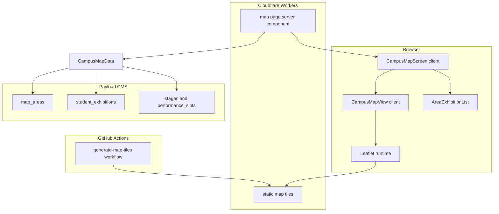
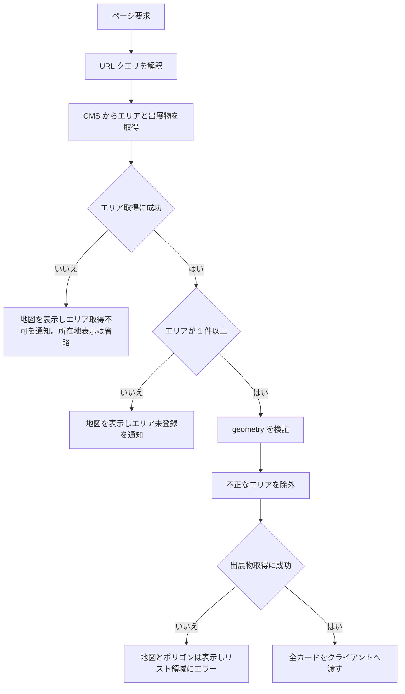
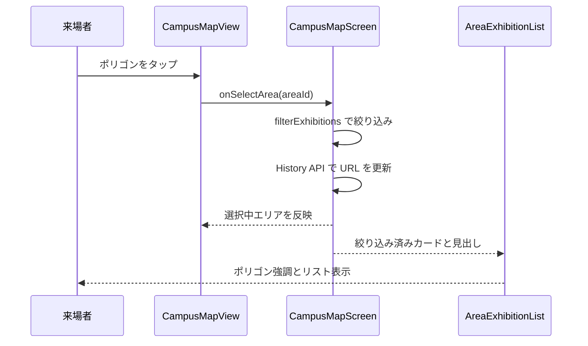
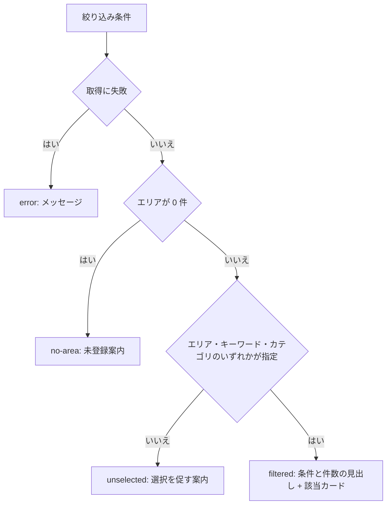
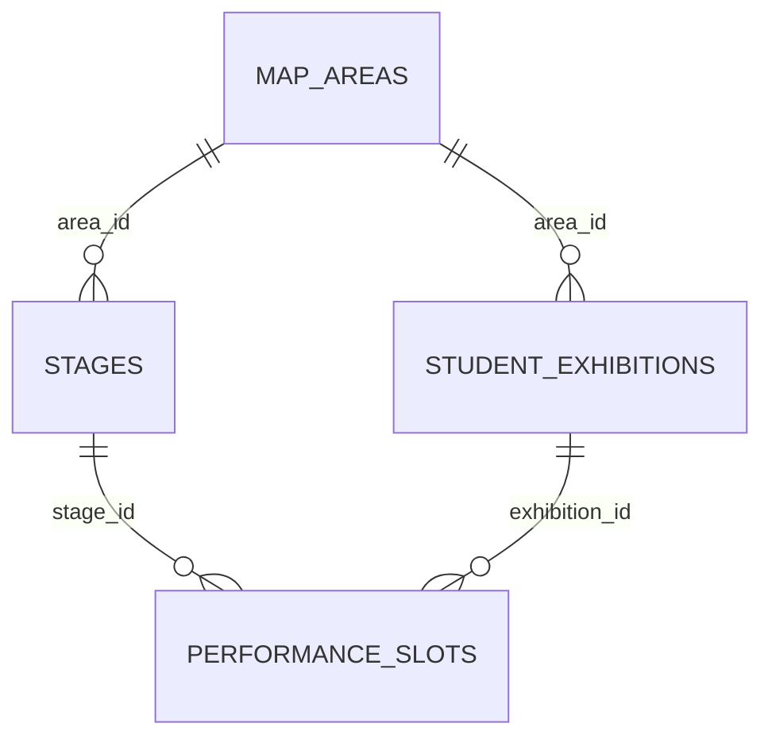
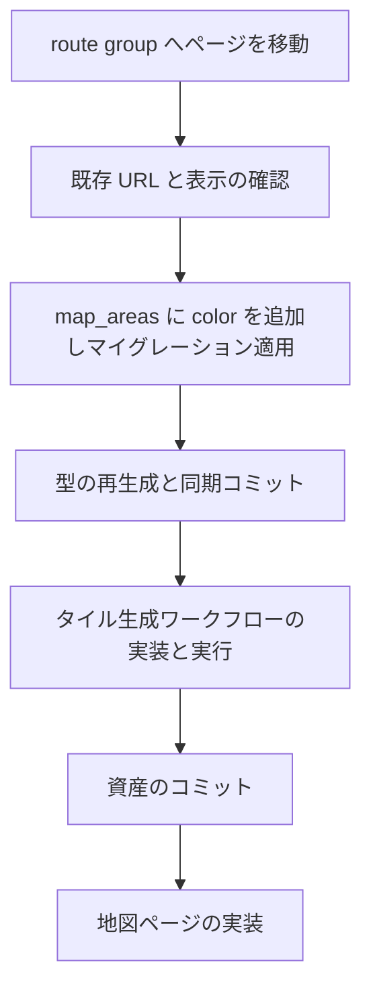

# Technical Design: campus-map

## Overview

構内マップページは、荒牧キャンパスの地図を画面全体に表示し、`map_areas` のポリゴンを重ねて「どこで何をやっているか」を位置から辿れるようにする。エリアを選ぶとそのエリアに紐づく出展物が一覧され、企画詳細ページへ遷移できる。キーワード検索とカテゴリ絞り込みも同じリスト領域で行う。

来場者は会場でスマートフォンからこのページを開く。回線が細る時間帯でも使えることが求められるため、2 つの設計判断を置いた。第一に、地図タイルは OpenStreetMap のデータから会場周辺の範囲だけを自前でレンダリングして生成し、自サイトから配信する。第二に、エリア選択と絞り込みは初回に取得したデータをクライアント側で処理し、操作のたびにサーバーへ往復しない。

既存システムへの影響は 2 つある。第一に `app/layout.tsx` が持っていたサイト共通ヘッダー・フッターを route group に移し、シェルを持つページと持たないページを構造で分ける。第二に `map_areas` に表示色フィールドを追加する。いずれも既存ページの URL を変えない。

### Goals

- `map_areas` のポリゴンから、そのエリアの出展物を辿れる導線を提供する
- 企画一覧ページの絞り込みロジックとカードデザインを再利用し、二重実装を作らない
- 地図タイルを規約上問題のない経路で自前生成し、`pwa-offline` がオフライン対応を積める土台を用意する
- エリア選択と絞り込みの操作がサーバーへの往復を伴わないようにする
- 成功基準: 要件 1〜10 の受入基準をすべて満たし、既存ページの URL と表示に変化がないこと

### Non-Goals

- Service Worker によるオフライン動作 — `pwa-offline` が所有する
- 管理画面上での GeoJSON 作図 UI — `geometry` はテキストとして入力する現状の運用を維持する
- 協賛企業 (`sponsors.area_id`) のリスト表示
- 企画詳細ページ本体とタイムテーブル — それぞれ `exhibition-pages` / `timetable-page` が所有する
- 企画詳細ページへのマップ埋め込み — 別 spec として起票する
- ベクタタイルへの移行と、ズーム 19 を超える拡大
- 来場者の現在地表示 — 屋外 GPS の精度ではブース単位を指せず、本ページの縮尺では役に立たない

## Boundary Commitments

### This Spec Owns

- 構内マップページ (`/map`) の表示・操作・状態遷移
- 会場周辺の地図タイル資産と、その生成ワークフロー
- エリアポリゴンの描画規則 (不透明度、枠線、選択状態の表現) とエリア名ラベル
- `map_areas.color` フィールドの定義と、色の解決規則 (未設定時の既定色を含む)
- `map_areas.geometry` の保存時検証
- 地図の初期表示中心・ズーム範囲・表示範囲の上限を定める定数
- GeoJSON Polygon のランタイム検証規則
- ページシェルの有無を分けるレイアウト構造 (route group)
- `frontend/src/lib/exhibitions.ts` の `buildJoinContext` / `toCards` への `export` 追加

### Out of Boundary

- Service Worker の登録、キャッシュ戦略、オフライン時の表示 — `pwa-offline`
- 出展物カードの内部デザイン、所在地表記の規則、企画詳細ページの URL 構造 — `exhibition-pages`
- `student_exhibitions` / `stages` / `performance_slots` のスキーマ
- 下部ナビゲーションの実装 — `responsive-navigation`
- サイネージ向けの表示調整 — `digital-signage`

route group を所有する立場から、`(fullscreen)` 配下には下部ナビゲーションを置かないことを本 spec が定める。`responsive-navigation` は `(site)/layout.tsx` にのみ下部ナビゲーションを配置する。これにより本ページのボトムシートと下部ナビゲーションが画面下部で衝突しない。

### Allowed Dependencies

- `frontend/src/lib/exhibitions.ts` の絞り込み・クエリ解釈ロジック。`filterExhibitions` / `parseExhibitionQuery` / `buildExhibitionsHref` / `normalizeText` は既存 export をそのまま再利用する。加えて `buildJoinContext` / `toCards` は private のため、本 spec がこれらに `export` を追加する
- `frontend/src/lib/cms.ts` の CMS クライアント
- `frontend/src/components/exhibition-card.tsx` (props を変更せずインスタンス化する)
- `frontend/src/components/exhibition-filters.tsx` (デバウンス時間の参照元として読む。コンポーネント自体は流用しない)
- `frontend/tailwind.config.ts` のカラートークン
- Payload の `map_areas` / `student_exhibitions` / `stages` / `performance_slots` の公開 READ

制約: `exhibitions.ts` の既存 export のシグネチャを変更しない。`buildJoinContext` / `toCards` への `export` 追加のみを行い、引数・返り値の型は変えない。マップ専用の集約が必要な場合は新しい関数を追加する形で行う。

`fetchJoinSources` は export しない。`map_areas` を内包しており、本 spec が求める「エリア取得の失敗と出展物取得の失敗を独立した結果として扱う」を満たせないため、取得そのものは `campus-map lib` 側で組む。

### Revalidation Triggers

- `map_areas` のフィールド追加・削除・型変更 → `pwa-offline` / `digital-signage` がキャッシュ対象と表示内容を再確認する
- タイル資産の配信パス (`/map-tiles/{z}/{x}/{y}.webp`)、ズーム範囲、地理範囲、総容量の変更 → `pwa-offline` がキャッシュ対象一覧と容量見積もりを再生成する
- `exhibitions.ts` の `filterExhibitions` / `parseExhibitionQuery` / `buildExhibitionsHref` のシグネチャ変更 → 本 spec と `exhibition-pages` の双方が再検証を要する
- `exhibitions.ts` への `export` 追加 (`buildJoinContext` / `toCards`) → `exhibition-pages` が同モジュールの内部構造を前提にしていないか再確認する
- `exhibition-pages` の `resolveLocationForCategory` の仕様変更 → 要件 7.2 が参照する所在地表記が変わるため、本 spec のテストを再確認する
- route group の構成変更 → シェルなしページを持つ全 spec が配置を再確認する
- `responsive-navigation` が下部ナビゲーションの配置先を `(site)` 以外に広げる場合 → 本ページのボトムシートとの重なりを再検討する
- 企画詳細ページの URL 構造の変更 → 本 spec のリンク生成を再確認する

## Architecture

### Existing Architecture Analysis

- **データ取得**: Server Component が `cms.findMany()` で全件取得 (`limit: 0`) し、メモリ上で絞り込む。CMS 側の `where` は使わない。本設計もこの規約に従う。
- **キャッシュの不在**: `lib/cms.ts` の `request()` は `fetch` にキャッシュオプションを指定していない。Next.js 15 の既定は非キャッシュであり、Server Component が再レンダリングされるたびに CMS への実リクエストが発生する。本設計はこの前提に立ち、操作のたびの再レンダリングを避ける。
- **絞り込みの所在**: `filterExhibitions` / `paginate` は純粋関数で `exhibitions.ts` に集約されている。純粋関数であるためクライアント側でも同じものを使える。
- **アクセス制御**: `collections/index.ts` の `withAccess()` が全コレクションに `accessFor(slug)` を付与する。`student_exhibitions` は `status === 'published'` で絞られ、`map_areas` / `stages` は未認証でも全件読める。要件 3.7 はこの仕組みで満たされる。
- **Edge Runtime 制約**: `frontend/` は Cloudflare Workers 上で動く。Node.js 専用 API は使えない。地図ライブラリはブラウザで動くため制約に抵触しない。タイル生成は GitHub Actions 上の独立したワークフローであり、この制約の外にある。
- **技術的負債として扱う点**: `RootLayout` がシェルを無条件に描画している構造を、本 spec で route group に分解する。

### Architecture Pattern & Boundary Map



**Architecture Integration**:

- **Selected pattern**: Server Component が初回の取得だけを担い、以降の絞り込みと選択を Client Component が保持する。企画一覧ページ (URL 駆動で毎回サーバーが絞り込む) とは異なる構造を採るが、その理由は Design Decision に記す。
- **Domain/feature boundaries**: 定数は `lib/campus-map-config.ts`、データ取得は `lib/campus-map.ts`、地図描画は `components/campus-map/` 配下、既存の絞り込みロジックは `lib/exhibitions.ts` に据え置く。
- **Existing patterns preserved**: 全件取得 + メモリ内絞り込み、`CmsResult` の判別可能ユニオンによるエラー伝播、URL による状態の共有。
- **New components rationale**: 地図は DOM を直接操作するライブラリを抱えるため独立した Client Component が要る。`CampusMapScreen` は絞り込み状態のオーナーであり、地図・ペイン・シート・検索部が同じ状態を共有するために必要になる。
- **Steering compliance**: `process.env` を直接参照せず `env.ts` を経由する。型は `payload generate:types` の出力から導出する。CI ロジックはワークフロー YAML ではなくスクリプトに置く。

**Dependency direction**: `config → geometry → data → view components → page`。各層は左側の層のみを import する。`components/campus-map/` は `lib/` に依存してよいが、`lib/` は `components/` を import しない。`lib/campus-map-config.ts` は `lib/cms.ts` にも `env.ts` にも依存しない純粋な定数モジュールとし、ビルドパイプライン外のスクリプトからも読めるようにする。

### Technology Stack

| Layer | Choice / Version | Role in Feature | Notes |
|-------|------------------|-----------------|-------|
| Frontend | Next.js 15 (App Router) / React 19 | ページとレイアウト | 既存。route group を新規導入する |
| Frontend | `leaflet` 1.9.4 | 地図の描画・操作・GeoJSON レイヤー | 新規依存。WebGL 不要 |
| Frontend | `react-leaflet` 5.0.0 | Leaflet の React ラッパー | 新規依存。peerDeps が `react: ^19.0.0` を要求し既存構成と一致する |
| Frontend | `@types/leaflet` | Leaflet の型定義 | 新規 devDependency。react-leaflet の型が参照する |
| Frontend | `leaflet/dist/leaflet.css` | 地図の既定スタイル | Client Component から import する。省くとタイル配置とコントロールが崩れる |
| Frontend | `zod` (既存) | `geometry` のランタイム検証 | `env.ts` で使用済み |
| Data / Storage | 静的 webp タイル (`public/map-tiles/`) | 地図タイルの配信 | z16–19、1454 枚・約 3.83MB。リポジトリに資産としてコミットする |
| Tooling | GitHub Actions + `Overv/openstreetmap-tile-server` | タイルの生成 | `workflow_dispatch` の手動実行。成果物は artifact 経由で受け取る |
| Tooling | `cwebp` (libwebp) | レンダリング結果 (PNG) の webp への変換 | GitHub Actions ランナーへインストールして使う。品質設定は変換スクリプト内の 1 箇所に集約する |
| Backend | Payload 3 | `map_areas.color` の追加と `geometry` の検証 | 既存。マイグレーション 1 本 |
| Infrastructure | Cloudflare Workers + OpenNext | 静的アセットとして CDN 配信 | 既存。追加設定なし |

地図ライブラリ・タイルの入手元・配信形式の比較検討は `research.md` の Architecture Pattern Evaluation を参照する。

## File Structure Plan

### Directory Structure

```
.github/workflows/
└── generate-map-tiles.yml              # workflow_dispatch。タイル生成と artifact 出力

frontend/
├── public/
│   └── map-tiles/                      # 生成済みラスタタイル (z16-19)
│       └── {z}/{x}/{y}.webp
├── scripts/
│   ├── map-tile-bounds.ts              # 設定値からタイル座標範囲と枚数を算出。ワークフローが読む
│   └── verify-map-tiles.ts             # 生成後の枚数と総容量を検証
└── src/
    ├── app/
    │   ├── layout.tsx                  # html/body/フォント/generateMetadata のみ
    │   ├── global-error.tsx            # root layout ごと置き換えるため root 直下に残す
    │   ├── not-found.tsx               # どの route group にも属さない URL の 404
    │   ├── globals.css                 # root に残す
    │   ├── (site)/                     # サイト共通シェルを持つページ群
    │   │   ├── layout.tsx              # Header と Footer
    │   │   ├── layout.test.tsx         # Footer 配線と SNS リンクの検証
    │   │   ├── not-found.tsx           # シェル付きの 404
    │   │   ├── error.tsx               # (site) 配下のエラー境界
    │   │   └── ...                     # 既存ページをディレクトリ単位で移動 (URL は不変)
    │   └── (fullscreen)/               # シェルを持たない全画面ページ群
    │       ├── layout.tsx              # 余白なしのコンテナ。高さを画面いっぱいに確保する
    │       ├── error.tsx               # (fullscreen) 配下のエラー境界
    │       └── map/
    │           ├── page.tsx            # Server Component。初回のデータ取得のみ
    │           └── page.test.tsx
    ├── components/
    │   └── campus-map/
    │       ├── campus-map-screen.tsx   # Client。絞り込み状態のオーナー。地図を dynamic で読む
    │       ├── campus-map-view.tsx     # Client。Leaflet の初期化とレイヤー構成
    │       ├── area-polygon-layer.tsx  # Client。GeoJSON 描画・選択状態・クリック
    │       ├── area-label-marker.tsx   # Client。ポリゴン中央のエリア名ラベル
    │       ├── map-zoom-control.tsx    # Client。拡大縮小コントロール
    │       ├── map-menu-button.tsx     # Client。サイト内導線への入口
    │       ├── area-exhibition-list.tsx # ペインとシートで共有するリスト本体
    │       ├── map-side-panel.tsx      # デスクトップの左ペイン
    │       ├── map-bottom-sheet.tsx    # Client。スマートフォンのボトムシート
    │       ├── map-search-panel.tsx    # Client。デスクトップのペイン上部検索部
    │       ├── map-search-overlay.tsx  # Client。スマートフォンの浮動検索部
    │       └── use-map-filters.ts      # 絞り込み状態と URL 同期のフック
    └── lib/
        ├── campus-map-config.ts        # 定数のみ。cms.ts / env.ts に依存しない
        ├── campus-map.ts               # データ取得・集約・色解決・クエリ解釈
        └── campus-map-geometry.ts      # GeoJSON の zod スキーマと座標ユーティリティ

cms/src/
├── collections/
│   ├── map-areas.ts                    # color フィールド追加、geometry に validate 追加
│   └── map-areas.test.ts               # 新規。フィールド定義のユニットテスト
└── migrations/
    ├── <timestamp>_map_areas_color.ts  # 新規
    └── index.ts                        # 登録を 1 行追記
```

各コンポーネントには対応する `*.test.tsx` を同階層に置く。上の図では省略している。

`lib/campus-map-config.ts` を `lib/campus-map.ts` から分離するのは、タイル生成の補助スクリプトが同じ設定値を読む必要があるため。`lib/campus-map.ts` は `lib/cms.ts` を経由して `env.ts` を import し、`env.ts` はモジュール評価時に環境変数を zod で検証して失敗すると例外を投げる。ビルドパイプライン外で走るスクリプトからは読めないため、定数だけを依存のないモジュールに切り出す。

### app/ 直下の特殊ファイルの移動先

`frontend/src/app/` 直下には route group 導入前から特殊ファイルが存在する。それぞれの移動先を個別に判断する。

| ファイル | 移動先 | 理由 |
|---------|--------|------|
| `layout.tsx` | root に残す (内容変更) | `<html>` / `<body>` / フォント読み込み / `generateMetadata` は root layout の責務。`<Header />` / `<Footer />` の描画のみ `(site)/layout.tsx` へ移す |
| `layout.test.tsx` | root に残す (内容変更) | `generateMetadata` の検証のみ残す。Footer 配線と SNS リンクの検証は `(site)/layout.test.tsx` へ移す |
| `globals.css` | root に残す | root layout が読み込むグローバルスタイル |
| `global-error.tsx` | root 直下に残す | root layout ごと置き換えるコンポーネントであり、route group 配下には置けない |
| `not-found.tsx` | root 直下に残す | どの route group にも属さない URL の 404 を担う。シェルを持たない |
| `not-found.test.tsx` | root 直下に残す | `not-found.tsx` と同じ場所に置く |
| `(site)/not-found.tsx` | 新規作成 | `(site)` 配下の `notFound()` 呼び出しがシェル付きで 404 を返すようにする。内容は root の `not-found.tsx` と同じ |
| `error.tsx` | `(site)/` へ移す | サイト共通シェルの中でエラーを表示する |
| `error.test.tsx` | `(site)/` へ移す | `error.tsx` と同じ場所に置く |
| `(fullscreen)/error.tsx` | 新規作成 | 置かない場合、`/map` のエラーが `global-error.tsx` まで抜けて `<html>` ごと差し替わる。シェルなしのエラー表示を置く |
| `page.tsx` | `(site)/` へ移す | トップページはサイト共通シェルを持つ |
| `page.test.tsx` | `(site)/` へ移す | `page.tsx` と同じ場所に置く |
| `[slug]/`, `announcements/`, `topics/`, `exhibitions/` | `(site)/` へディレクトリ単位で移す | いずれもサイト共通シェルを持つ既存ページ。`announcements/[id]/` / `topics/[id]/` / `exhibitions/[id]/[category]/` の詳細ページを含む |

各 `*.test.tsx` は対応する本体ファイルと常に同じ場所へ移す。ディレクトリ単位で移すことで、詳細ページの取り残しを防ぐ。

`app/layout.test.tsx` は `RootLayout` の返り値から `body.props.children` を辿って `child.type === Footer` を探す `findFooterElement()` を持ち、見つからなければ例外を投げる。`<Footer />` を `(site)/layout.tsx` へ移した時点でこのテストは必ず失敗するため、移動と同じ変更の中で書き換える。

### Modified Files

- `frontend/src/app/layout.tsx` — `<Header />` / `<Footer />` の描画を `(site)/layout.tsx` へ移す。`generateMetadata` と `<html>` / `<body>` の定義は残す
- `frontend/src/app/layout.test.tsx` — Footer 配線の検証を除き、`generateMetadata` の検証のみ残す
- `frontend/src/lib/exhibitions.ts` — `buildJoinContext` と `toCards` に `export` を追加。既存 export のシグネチャは変更しない
- `frontend/package.json` — `leaflet` / `react-leaflet` を dependencies に、`@types/leaflet` を devDependencies に追加
- `frontend/src/env.ts` — 変更なし (タイルは同一オリジン配信のため新規環境変数は不要)
- `cms/src/collections/map-areas.ts` — `color` フィールドを追加し、`geometry` に `validate` を追加
- `cms/src/migrations/index.ts` — 新規マイグレーションを配列末尾に追記
- `cms/src/payload-types.ts` / `frontend/src/cms-types.ts` — `payload generate:types` による再生成

## System Flows

### 初期表示とデータ欠損時の分岐



エリア取得の失敗と出展物取得の失敗を独立に扱うことで、片方が落ちてももう片方の機能が残る (要件 8.1 / 8.2)。ただし所在地の解決には `map_areas` が要るため、エリア取得に失敗した場合はカードの所在地表示のみを省略してリスト自体は表示する (要件 8.4)。タイルの読み込み失敗はブラウザ側で起きるため、ポリゴンとリストの描画には影響しない (要件 8.3)。

### エリア選択とリスト更新



サーバーへの往復は発生しない (要件 3.10 / 4.9)。選択中のエリアを再度タップした場合、選択を解除して未選択状態へ戻る。検索とカテゴリの条件は保持されるため、要件 4.6 の併用が成立する。

### リスト表示状態の決定



見出しの表記は `filtered` の中で条件の組み合わせから組み立てる。エリアのみならエリア名、キーワードやカテゴリが加わればそれらを併記する。要件 3.4 と要件 4.8 の双方をこの 1 つの状態で扱うため、両者が衝突しない。

## Requirements Traceability

| Requirement | Summary | Components | Interfaces | Flows |
|-------------|---------|------------|------------|-------|
| 1.1, 1.3 | 自前タイルを全画面表示 | CampusMapView, generate-map-tiles | `CAMPUS_MAP_CONFIG`, タイル配信パス | 初期表示 |
| 1.2, 1.7, 1.8 | 表示範囲とズーム境界 | CampusMapView | `CampusMapConfig` | — |
| 1.4 | シェル非表示とメニュー集約 | `(fullscreen)/layout.tsx`, MapMenuButton | — | — |
| 1.5 | 出典表記の常時表示 | CampusMapView | `MAP_ATTRIBUTION` | — |
| 1.6 | 拡大縮小操作 | MapZoomControl | — | — |
| 1.9 | 引き伸ばし表示を行わない | CampusMapView, generate-map-tiles | `CampusMapConfig.maxZoom` | — |
| 1.10 | タイルの自前レンダリング | generate-map-tiles | ワークフロー定義 | — |
| 1.11 | 読み込み中の表示 | CampusMapScreen | `dynamic` の `loading` | 初期表示 |
| 1.12 | メニューの内容 | MapMenuButton | `MapMenuButtonProps` | — |
| 1.13 | 範囲外タイル要求の抑止 | CampusMapView | TileLayer の `bounds` | — |
| 1.14 | ズーム下限 16 | CampusMapView, generate-map-tiles | `CampusMapConfig.minZoom` | — |
| 1.15 | タイル配信形式は webp | CampusMapView, generate-map-tiles | `CampusMapConfig.tileUrlTemplate` | — |
| 1.16 | タイル生成時に webp へ変換 | generate-map-tiles | ワークフロー定義 | — |
| 2.1, 2.7 | ポリゴン描画と不正データ除外 | AreaPolygonLayer, campus-map-geometry | `parsePolygonGeometry` | 初期表示 |
| 2.2 | エリア名ラベル | AreaLabelMarker | `AreaLabelProps` | — |
| 2.3 | 描画順と sort 未設定の扱い | campus-map lib, AreaPolygonLayer | `getCampusMapData` の Postconditions | 初期表示 |
| 2.4, 2.5, 2.6 | 選択と解除、選択中の強調 | AreaPolygonLayer, CampusMapScreen | `onSelectArea` | エリア選択 |
| 2.8 | 不正 geometry の保存拒否 | map-areas collection | `geometry` の `validate` | — |
| 3.1 | 未選択時の案内 | AreaExhibitionList | `AreaExhibitionListState` | リスト表示状態 |
| 3.2, 3.3 | エリア単位の出展物集約 | campus-map lib | `getCampusMapData` | 初期表示 |
| 3.4 | 見出しとタイル枚数 | AreaExhibitionList | `buildListHeading` | リスト表示状態 |
| 3.5, 3.6 | カードの再利用とカテゴリ展開 | AreaExhibitionList, ExhibitionCard | `ExhibitionCardSummary` | — |
| 3.7 | 非公開の除外 | CMS access policy | — | — |
| 3.8 | 0 件時の表示 | AreaExhibitionList | `AreaExhibitionListState` | リスト表示状態 |
| 3.9 | エリア未登録時の表示 | AreaExhibitionList | `AreaExhibitionListState` | 初期表示 |
| 3.10 | 選択時にサーバー往復なし | CampusMapScreen | `useMapFilters` | エリア選択 |
| 4.1 | 検索部の表示 | MapSearchPanel, MapSearchOverlay | `MapSearchProps` | — |
| 4.2 | カテゴリ選択肢 | MapSearchPanel, MapSearchOverlay | `ExhibitionCategory` | — |
| 4.3, 4.4 | キーワード照合とデバウンス | CampusMapScreen | `filterExhibitions`, `normalizeText` 再利用 | — |
| 4.5 | カテゴリ絞り込み | CampusMapScreen | `filterExhibitions` 再利用 | — |
| 4.6 | 複数条件の同時適用 | CampusMapScreen | `CampusMapFilters` | エリア選択 |
| 4.7 | 0 件時の案内 | AreaExhibitionList | `AreaExhibitionListState` | リスト表示状態 |
| 4.8 | 条件に応じた見出し | AreaExhibitionList | `buildListHeading` | リスト表示状態 |
| 4.9 | 条件変更時にサーバー往復なし | CampusMapScreen | `useMapFilters` | エリア選択 |
| 5.1, 5.4 | デスクトップの配置 | MapSidePanel, MapSearchPanel | `AreaExhibitionListProps` | — |
| 5.2, 5.3 | ボトムシートと高さ可変 | MapBottomSheet | `MapBottomSheetProps` | — |
| 5.10, 5.11 | グラバーのドラッグとキーボードによる高さ変更 | MapBottomSheet | `MapBottomSheetProps` | — |
| 5.12, 5.13 | 展開/たたみ込みのトグルと状態の通知 | MapBottomSheet | `aria-*` | — |
| 5.5, 5.6 | スマートフォンの検索部 | MapSearchOverlay | `MapSearchProps` | — |
| 5.7 | コントロールの重なり回避 | CampusMapScreen | — | — |
| 5.8 | 単一ブレークポイント | campus-map-config | `MAP_BREAKPOINT` | — |
| 5.9 | 非表示側の除外 | MapSearchPanel, MapSearchOverlay | `inert` / `aria-hidden` | — |
| 6.1, 6.2, 6.5 | 表示色フィールドとマイグレーション | map-areas collection | `MAP_AREA_COLORS` | — |
| 6.3, 6.4 | 色の反映と既定色 | AreaPolygonLayer, campus-map lib | `resolveAreaColor` | — |
| 6.6 | ラベルの判読性 | AreaLabelMarker | `AreaLabelProps` | — |
| 7.1 | 詳細ページへの遷移 | ExhibitionCard | 既存 | — |
| 7.2 | 所在地表記の委譲 | campus-map lib | `toCards` 再利用 | — |
| 8.1 | エリア取得失敗 | map page, AreaExhibitionList | `CampusMapDataResult` | 初期表示 |
| 8.2 | 出展物取得失敗 | map page, AreaExhibitionList | `CampusMapDataResult` | 初期表示 |
| 8.3 | タイル読み込み失敗 | CampusMapView | `errorTileUrl` | — |
| 8.4 | エリア失敗時の所在地省略 | campus-map lib | `getCampusMapData` | 初期表示 |
| 9.1, 9.2 | URL への反映と復元 | CampusMapScreen, campus-map lib | `useMapFilters`, `parseCampusMapQuery` | エリア選択 |
| 9.3 | 戻る操作 | CampusMapScreen | `useMapFilters` | — |
| 9.4 | 企画一覧との共有 | campus-map lib | `buildCampusMapHref` | — |
| 9.5 | 複数エリア指定時 | campus-map lib | `parseCampusMapQuery` | — |
| 10.1 | キーボードでのエリア選択 | AreaPolygonLayer | `attachKeyboardSelection` | — |
| 10.2 | リスト更新の通知 | AreaExhibitionList | `aria-live` | — |
| 10.3 | メニューのフォーカス管理 | MapMenuButton | — | — |
| 10.4 | 領域間のフォーカス移動 | CampusMapScreen | — | — |

## Components and Interfaces

| Component | Domain/Layer | Intent | Req Coverage | Key Dependencies (P0/P1) | Contracts |
|-----------|--------------|--------|--------------|--------------------------|-----------|
| campus-map-config | Data | 地図の定数とブレークポイント | 1.2, 1.14, 1.15, 5.8 | — | Service |
| campus-map lib | Data | エリアと出展物の取得・集約 | 2.3, 3, 7.2, 8 | cms client (P0), exhibitions lib (P0) | Service |
| campus-map-geometry | Data | GeoJSON Polygon の検証と重心算出 | 2.1, 2.7 | zod (P0) | Service |
| map page | Routing | 初回取得と Client への受け渡し | 1, 3, 8, 9.2 | campus-map lib (P0) | State |
| CampusMapScreen | UI | 絞り込み状態の保持と配置 | 3.10, 4, 5.7, 9, 10.4 | useMapFilters (P0) | State |
| CampusMapView | UI | Leaflet の初期化とレイヤー構成 | 1, 2 | react-leaflet (P0) | State |
| AreaPolygonLayer | UI | ポリゴン描画・選択状態・クリック | 2, 6.3, 6.4, 10.1 | CampusMapView (P0) | State |
| AreaLabelMarker | UI | エリア名ラベルの表示 | 2.2, 2.5, 6.6 | AreaPolygonLayer (P1) | — |
| AreaExhibitionList | UI | 出展物リスト本体 (5 状態) | 3, 4.7, 4.8, 10.2 | ExhibitionCard (P0) | — |
| MapSidePanel | UI | デスクトップの左ペイン | 5.1, 5.4 | AreaExhibitionList (P0) | — |
| MapBottomSheet | UI | スマートフォンのボトムシート | 5.2, 5.3, 5.10, 5.11, 5.12, 5.13 | AreaExhibitionList (P0) | State |
| MapSearchPanel | UI | デスクトップの検索部 | 4.1, 5.4, 5.9 | useMapFilters (P0) | — |
| MapSearchOverlay | UI | スマートフォンの浮動検索部 | 4.1, 5.5, 5.6, 5.9 | useMapFilters (P0) | — |
| MapZoomControl | UI | 拡大縮小コントロール | 1.6 | CampusMapView (P0) | — |
| MapMenuButton | UI | サイト内導線への入口 | 1.4, 1.12, 10.3 | — | State |
| useMapFilters | UI | 絞り込み状態と URL 同期 | 3.10, 4.9, 9 | exhibitions lib (P0) | State |
| map-areas collection | CMS | 表示色と geometry 検証 | 2.8, 6.1, 6.2, 6.5 | Payload (P0) | State |
| generate-map-tiles | Tooling | タイル資産の生成 | 1.1, 1.10, 1.16 | — | Batch |

### Data Layer

#### campus-map-config

| Field | Detail |
|-------|--------|
| Intent | 地図の表示設定とブレークポイントを単一の出所として持つ |
| Requirements | 1.2, 1.14, 1.15, 5.8 |

**Responsibilities & Constraints**

- 地図の初期中心・初期ズーム・ズーム上下限・表示範囲の上限を定数として持つ
- デスクトップとスマートフォンの境界となるブレークポイントを 1 箇所で定義する
- タイル配信パスのテンプレートと attribution の文言を持つ
- **他のモジュールを import しない。** `cms.ts` / `env.ts` に依存させない

**Dependencies**

- なし

**Contracts**: Service [x] / API [ ] / Event [ ] / Batch [ ] / State [ ]

##### Service Interface

```typescript
export interface CampusMapConfig {
  /** 初期表示の中心。[緯度, 経度] の順 (Leaflet の LatLng に合わせる) */
  readonly center: readonly [latitude: number, longitude: number];
  readonly initialZoom: number;
  readonly minZoom: number;
  readonly maxZoom: number;
  /** 表示範囲およびタイル要求範囲の上限。[[南, 西], [北, 東]] */
  readonly bounds: readonly [
    readonly [latitude: number, longitude: number],
    readonly [latitude: number, longitude: number],
  ];
  readonly tileUrlTemplate: string;
}

export const CAMPUS_MAP_CONFIG: CampusMapConfig;

/** 出典表記。Tile Usage Policy と Attribution Guidelines が要求する形式 */
export const MAP_ATTRIBUTION: string;

/** デスクトップとスマートフォンの境界。Tailwind のブレークポイントと対応させる */
export const MAP_BREAKPOINT: 'md';
```

**Implementation Notes**

- 統合: `MAP_ATTRIBUTION` は `© <a href="https://www.openstreetmap.org/copyright">OpenStreetMap</a> contributors` の形とする。Leaflet の attribution はこの文字列を HTML として解釈するため、文言とリンクの双方を満たせる (要件 1.5)
- 検証: `bounds` はタイル生成の対象範囲と同一でなければならない。ズーム範囲も同じ。両者がずれるとタイルの抜けか無駄な生成が発生する
- リスク: `MAP_BREAKPOINT` は Tailwind のクラス名プレフィックスとして使うため、値を変える場合は該当クラスを一括で置き換える必要がある

#### campus-map lib

| Field | Detail |
|-------|--------|
| Intent | エリアと出展物を取得し、クライアントが絞り込める形に集約する |
| Requirements | 2.3, 3.2, 3.3, 7.2, 8.1, 8.2, 8.4, 9.1, 9.4, 9.5 |

**Responsibilities & Constraints**

- `map_areas` と、企画一覧と同じ結合済みカード配列を取得する
- 絞り込みは行わない。全カードを返し、絞り込みはクライアント側が `filterExhibitions` で行う
- ページングは行わない
- `map_areas` の取得失敗と出展物の取得失敗を独立した結果として表現する
- `map_areas` の取得は 1 回のみ。結果をポリゴン描画と所在地解決の双方に使う

**Dependencies**

- Outbound: `lib/cms.ts` — コレクション取得 (P0)
- Outbound: `lib/exhibitions.ts` — `buildJoinContext` / `toCards` / `parseExhibitionQuery` / `buildExhibitionsHref` (P0)
- Outbound: `lib/campus-map-geometry.ts` — `geometry` の検証 (P0)
- Outbound: `lib/campus-map-config.ts` — 定数 (P0)

**Contracts**: Service [x] / API [ ] / Event [ ] / Batch [ ] / State [ ]

##### Service Interface

```typescript
import type { ExhibitionCardSummary, ExhibitionCategory } from '@/lib/exhibitions';
import type { CmsFetchError } from '@/lib/cms';
import type { PolygonGeometry } from '@/lib/campus-map-geometry';

/** マップ表示色。tailwind.config.ts のカラートークン名と一致し、DB の enum 値とも一致する */
export type MapAreaColor =
  | 'primary'
  | 'secondary'
  | 'accent'
  | 'accent-alt'
  | 'info'
  | 'success'
  | 'warning';

/** 描画可能と判定済みのエリア。geometry は検証済みで型が確定している */
export interface CampusMapArea {
  readonly id: number;
  readonly name: string;
  readonly geometry: PolygonGeometry;
  readonly color: MapAreaColor;
  /** CMS 側が nullable。未設定のエリアは描画順の末尾に置く */
  readonly sort: number | null;
}

/** 構内マップの絞り込み条件。エリアは単一選択 */
export interface CampusMapFilters {
  readonly q: string;
  readonly categories: readonly ExhibitionCategory[];
  readonly selectedAreaId: number | null;
}

/** エリア取得と出展物取得の成否を独立して表現する */
export type CampusMapDataResult = {
  readonly areas:
    | { readonly kind: 'loaded'; readonly value: readonly CampusMapArea[] }
    | { readonly kind: 'error'; readonly error: CmsFetchError };
  readonly exhibitions:
    | { readonly kind: 'loaded'; readonly value: readonly ExhibitionCardSummary[] }
    | { readonly kind: 'error'; readonly error: CmsFetchError };
};

/**
 * searchParams を構内マップの条件に解釈する。
 * area が複数指定された場合は最小の ID を採用する
 * (`parseExhibitionQuery` が昇順ソート済みで返すため、その先頭)。
 */
export function parseCampusMapQuery(
  params: Readonly<Record<string, string | readonly string[] | undefined>>,
): CampusMapFilters;

/** 構内マップの条件から URL を組み立てる。企画一覧と同じクエリ形式を共有する */
export function buildCampusMapHref(filters: CampusMapFilters): string;

/** エリアと全出展物カードを取得する。例外を投げず結果型で返す */
export function getCampusMapData(): Promise<CampusMapDataResult>;

/** トークン名を CSS 色値に解決する。未設定・未知の値は既定色を返す */
export function resolveAreaColor(color: string | null | undefined): string;
```

- Preconditions: なし。`getCampusMapData` は引数を取らない
- Postconditions: `areas` は `sort` の昇順で、`sort` が `null` のエリアは末尾に置かれる。`geometry` の検証に失敗したエリアは配列に含まれない。`exhibitions` は企画 ID 昇順 × カテゴリ定義順で並ぶ
- Invariants: `areas` が `error` の場合でも `exhibitions` は取得を試み、カードの `location` のみが欠落した状態で返る

**Implementation Notes**

- 統合: 取得は `cms.findMany` の並列呼び出しで 4 本 (`map_areas` / `student_exhibitions` / `stages` / `performance_slots`)。`student_exhibitions` は `where: { status: { equals: 'published' } }` と `sort: ['id']` を付ける。この 2 つは `getExhibitionListData` と同じ条件であり、要件 3.6 のカード順の前提になる
- 統合: 結合は `exhibitions.ts` の `buildJoinContext` に `map_areas` / `stages` / `performance_slots` の取得結果を渡し、`toCards` でカードを組み立てる。`fetchJoinSources` は使わない (`map_areas` を内包しており、独立した結果表現と両立しないため)
- 統合: `map_areas` の取得に失敗した場合、`buildJoinContext` には空のエリア配列を渡す。`resolveLocationForCategory` がエリア名を解決できず `location` を `null` にするため、要件 8.4 の「所在地表示を省略」が自動的に成立する
- 検証: `color` が未設定または既知の値でない場合、既定色 `secondary` に解決する (要件 6.4)
- 検証: `resolveAreaColor` の色値は `tailwind.config.ts` から import して導出し、hex を二重に持たない。Leaflet の GeoJSON `style` は `color` / `fillColor` に CSS 色値を取るため、Tailwind のクラス名は使えない
- 統合: `buildCampusMapHref` は `buildExhibitionsHref` と同じ正規化 (カテゴリとエリア ID の昇順ソート、カンマ区切り、`%2C` の復元) を行う必要がある。`buildExhibitionsHref` はパスに `/exhibitions` をハードコードしているため直接は流用できない。`exhibitions.ts` にパスを引数に取る関数を新設し、`buildExhibitionsHref` をその薄いラッパーにする

#### campus-map-geometry

| Field | Detail |
|-------|--------|
| Intent | Payload の `json` 型から GeoJSON Polygon を安全に取り出す |
| Requirements | 2.1, 2.7 |

**Responsibilities & Constraints**

- GeoJSON Polygon のスキーマを定義し、検証に失敗した値を明示的に拒否する
- ポリゴンの重心を算出する。エリア名ラベルの配置に使う
- 座標系は WGS84 (経度, 緯度) の順。GeoJSON の仕様に従う
- CMS 側の `validate` と同じスキーマを共有できる形にする

**Dependencies**

- External: `zod` — スキーマ定義 (P0)

**Contracts**: Service [x] / API [ ] / Event [ ] / Batch [ ] / State [ ]

##### Service Interface

```typescript
/**
 * GeoJSON の座標。[経度, 緯度] または [経度, 緯度, 高度]。
 * `@types/geojson` の `Position` (可変配列) と代入互換にするため readonly にしない。
 * react-leaflet の `<GeoJSON data>` がその型を要求する。
 */
export type Position = number[];

/** 外環と 0 個以上の内環からなる Polygon */
export interface PolygonGeometry {
  readonly type: 'Polygon';
  readonly coordinates: Position[][];
}

/** 検証結果。失敗理由は呼び出し側のログに使う */
export type GeometryParseResult =
  | { readonly kind: 'valid'; readonly value: PolygonGeometry }
  | { readonly kind: 'invalid'; readonly reason: string };

/** Payload の json 値を Polygon として解釈する */
export function parsePolygonGeometry(value: unknown): GeometryParseResult;

/** ラベル配置用の重心。外環から算出する。[緯度, 経度] を返す (Leaflet の順) */
export function polygonCentroid(
  geometry: PolygonGeometry,
): readonly [latitude: number, longitude: number];
```

- Preconditions: `value` は Payload が返す任意の JSON 値
- Postconditions: `valid` の場合、`coordinates` の外環は 4 点以上を持ち、始点と終点が一致する
- Invariants: `polygonCentroid` は外環がポリゴンの内側に重心を持つ凸形状を前提としない。凹形状で重心が外に出る場合があるため、ラベル位置としての妥当性は描画時に確認する

**Implementation Notes**

- 統合: `campus-map lib` から呼ばれ、検証に失敗したエリアは描画対象から除かれる。同じスキーマを `cms/src/collections/map-areas.ts` の `validate` でも使えるよう、スキーマ定義を独立した export にする
- 検証: 経度は -180〜180、緯度は -90〜90 の範囲を要求する。リングの閉包 (始点と終点の一致) も検証する。座標の第 3 要素 (高度) は GeoJSON 仕様が許すため受け入れ、無視する
- 検証: 型を `readonly` にすると `@types/geojson` の `Position = number[]` / `Polygon['coordinates']: Position[][]` へ代入できず、`<GeoJSON data>` に渡す時点で `as` が必要になる。型安全を保つため可変配列で定義する
- リスク: 重心が凹形状の外に出る場合、ラベルがポリゴンの外に置かれる。運用上のエリア形状は矩形に近いため当面は許容し、問題が出た場合に内部点の算出へ切り替える

### Routing Layer

#### map page

| Field | Detail |
|-------|--------|
| Intent | 初回のデータ取得を行い、Client Component に渡す |
| Requirements | 1.1, 3.1, 8.1, 8.2, 9.2 |

**Responsibilities & Constraints**

- Server Component として `searchParams` を受け取り、`parseCampusMapQuery` で初期条件に解釈する
- `getCampusMapData()` の結果をそのまま `CampusMapScreen` に渡す。ページ側でエラーを握り潰さない
- 絞り込みは行わない。全カードをクライアントへ渡す
- レイアウトの分岐 (ペインかボトムシートか) は行わない。`CampusMapScreen` に委ねる

**Dependencies**

- Inbound: Next.js ルーター — `searchParams` (P0)
- Outbound: `campus-map lib` — データ取得 (P0)
- Outbound: `CampusMapScreen` — 表示 (P0)

**Contracts**: Service [ ] / API [ ] / Event [ ] / Batch [ ] / State [x]

##### State Management

- State model: ページ自身は状態を持たない。`searchParams` を初期値として渡すのみ
- Persistence & consistency: 初回の URL が初期状態を決める。以降の状態はクライアントが持つ
- Concurrency strategy: 取得は並列。片方の失敗が他方を巻き込まない

**Implementation Notes**

- 統合: `searchParams` を使うため常に動的レンダリングになる。1 ページビューあたり CMS への取得が 4 本発生する。エリア選択や絞り込みでは再レンダリングされないため、この 4 本は初回のみ
- リスク: 全カードをクライアントへ渡すため初回ペイロードが増える。出展物が数百件規模であることを前提としており、増えた場合はカードの項目を表示に必要な最小限へ絞る

### Map UI Layer

#### CampusMapScreen

| Field | Detail |
|-------|--------|
| Intent | 絞り込み状態を保持し、地図・ペイン・シート・検索部を配置する |
| Requirements | 3.10, 4.3, 4.5, 4.6, 4.9, 5.7, 9, 10.4 |

**Responsibilities & Constraints**

- Client Component。`'use client'` を持つ
- `useMapFilters` で絞り込み状態を保持し、`filterExhibitions` で絞り込んだ結果を子へ渡す
- `CampusMapView` を `next/dynamic` の `ssr: false` で読み込む。読み込み中は `loading` で地図領域に読み込み中の表示を出す (要件 1.11)
- ペインとボトムシートの双方をレンダリングし、表示の出し分けは CSS で行う
- 拡大縮小コントロールと出典表記が、ペインとボトムシートに重ならない配置を保証する (要件 5.7)

**Dependencies**

- Inbound: map page — エリア一覧・全カード・初期条件 (P0)
- Outbound: `useMapFilters` — 状態と URL 同期 (P0)
- Outbound: `lib/exhibitions.ts` の `filterExhibitions` (P0)
- Outbound: `CampusMapView` (動的読み込み) / `MapSidePanel` / `MapBottomSheet` / `MapSearchPanel` / `MapSearchOverlay` (P0)

**Contracts**: Service [ ] / API [ ] / Event [ ] / Batch [ ] / State [x]

##### State Management

- State model: `CampusMapFilters` を `useMapFilters` が保持する。絞り込み結果は `useMemo` で導出し、状態として二重に持たない
- Persistence & consistency: URL と状態を双方向に同期する。`popstate` で URL 側の変化を状態へ反映する
- Concurrency strategy: キーワード入力はデバウンスして確定値のみを状態と URL へ反映する

**Implementation Notes**

- 統合: `CampusMapView` の動的読み込みは本コンポーネント (Client Component) の中で行う。Next.js 15 では Server Component 内の `dynamic(..., { ssr: false })` がビルドエラーになるため、ページから直接呼んではならない
- 統合: `filterExhibitions(items, query)` は `ExhibitionQuery` を要求し、`areaIds: readonly number[]` と `page: number` を必須で持つ。`CampusMapFilters` から `{ ...filters, areaIds: selectedAreaId === null ? [] : [selectedAreaId], page: 1 }` を組んで渡す
- 検証: エリア選択・検索・カテゴリのいずれの操作でも、ネットワークリクエストが発生しないことを確認する (要件 3.10 / 4.9)
- 検証: 拡大縮小コントロールと出典表記の余白は、ボトムシートの実高さを観測して追従させる。シートがグラバー操作で 3 段のスナップ位置を行き来するため、固定値で最大展開時の高さぶんを確保する方式は取らない
- リスク: 地図の読み込み前でもペインとシートは描画されるため、リストは先に読める

#### CampusMapView

| Field | Detail |
|-------|--------|
| Intent | Leaflet を初期化し、タイル・ポリゴン・コントロールを配置する |
| Requirements | 1.1, 1.2, 1.5, 1.6, 1.7, 1.8, 1.9, 1.13, 1.14, 1.15, 2.4, 2.6, 8.3 |

**Responsibilities & Constraints**

- Client Component。`leaflet/dist/leaflet.css` を import する
- タイルレイヤーの URL テンプレート、表示範囲の上限、ズームの上限と下限を `CAMPUS_MAP_CONFIG` から受け取る
- 出典表記を Leaflet の attribution 機構で常時表示する
- エリア選択の結果を `onSelectArea` コールバックで親へ通知する。URL の書き換えは行わない
- 地図コンテナに明示的な高さを与える

**Dependencies**

- Inbound: CampusMapScreen — エリア一覧と選択状態 (P0)
- Outbound: `react-leaflet` — 地図の描画 (P0)
- Outbound: `lib/campus-map-config.ts` — 設定値 (P0)

**Contracts**: Service [ ] / API [ ] / Event [ ] / Batch [ ] / State [x]

##### State Management

- State model: 地図の中心・ズームは Leaflet が保持する。選択中エリアは props 経由で渡る
- Persistence & consistency: 選択状態は親が保持する。地図の中心とズームは保持しない
- Concurrency strategy: なし。クリックはコールバックで親へ渡すのみ

**Implementation Notes**

- 統合: 地図の設定値は `lib/campus-map-config.ts` の定数から受け取り、コンポーネント内にハードコードしない
- 統合: URL を直接書き換えず `onSelectArea` に留めることで、将来 `digital-signage` などが URL を持たない文脈で再利用できる
- 検証: `maxBounds` に加えて `maxBoundsViscosity: 1.0` を指定する。既定値 `0.0` では境界外へのドラッグが可能で、その間に範囲外のタイルが要求される
- 検証: TileLayer に `bounds` を指定し、タイル要求そのものを生成範囲内に限定する (要件 1.13)。`maxBounds` はビューの制限であってタイル要求の制限ではない。範囲外のタイルは静的アセットとして解決されず Worker 呼び出しになるため、要求を発生させないことが前提になる
- 検証: `minZoom` / `maxZoom` を `CAMPUS_MAP_CONFIG` の値で指定する (要件 1.7 / 1.8)。`maxZoom` が 19 であれば 19 より上のズーム自体が存在しないため、要件 1.9 は `maxZoom` 単体で満たされる。`maxNativeZoom` は `maxZoom` と同値では効果を持たないため指定しない
- 検証: `errorTileUrl` に透明タイルを指定し、読み込みに失敗したタイルが破損画像として表示されないようにする (要件 8.3)
- 検証: 地図コンテナの高さは `h-dvh` 等で明示する。高さが決まらないと Leaflet のコンテナが 0px になる
- リスク: Tailwind v4 の preflight と `leaflet.css` の競合の有無を実装初期に確認する

#### AreaPolygonLayer

| Field | Detail |
|-------|--------|
| Intent | エリアポリゴンを描画し、選択状態を表現してクリックを通知する |
| Requirements | 2.1, 2.3, 2.4, 2.5, 6.3, 6.4, 10.1 |

**Responsibilities & Constraints**

- `sort` の昇順で描画する。後から描いたポリゴンが上に重なる。`sort` が `null` のエリアは末尾
- `color` を CSS 色値に解決し、塗りと枠線に適用する
- 通常時の塗りの不透明度を 55%、選択中を 72% とし、選択中は枠線を太くする
- 選択の可否とクリック時の通知のみを担い、URL の書き換えは親に委ねる
- ポリゴンをキーボードでフォーカス可能にし、Enter / Space で選択できるようにする (要件 10.1)

**Dependencies**

- Inbound: CampusMapView — エリア一覧と選択中 ID (P0)
- Outbound: `react-leaflet` の `<GeoJSON>` (P0)

**Contracts**: Service [ ] / API [ ] / Event [ ] / Batch [ ] / State [x]

##### State Management

- State model: 自身は状態を持たない。選択中 ID は props で受け取る
- Persistence & consistency: なし
- Concurrency strategy: なし

**Implementation Notes**

- 統合: 色の解決は `campus-map lib` の `resolveAreaColor(color)` に委ねる
- 統合: 選択状態の反映は mutable な `style` prop で行う。`<GeoJSON>` の `data` prop は immutable であり、変更しても Leaflet 側に反映されない。`data` を差し替える必要がある場合は `key` による remount が要る
- 統合: クリックの購読は `eventHandlers` prop で行う。react-leaflet v5 に `onEachFeature` は存在しない
- 検証: `geometry` は `campus-map lib` の時点で検証済みのため、本コンポーネントでは再検証しない
- 検証: キーボード操作は Leaflet のベクタパスが既定でフォーカス可能でないため、`pathOptions` の `interactive` に加えて描画される SVG 要素への `tabindex` 付与が要る。実装が困難な場合は、`MapSidePanel` 側にエリア一覧からの選択 UI を置く経路で要件 10.1 を満たす
- リスク: エリア数が 7 を超えると色が重複する。選択状態の強調とラベルで識別性を確保する

#### AreaLabelMarker

| Field | Detail |
|-------|--------|
| Intent | ポリゴン中央にエリア名を重ねる |
| Requirements | 2.2, 2.5, 6.6 |

**Responsibilities & Constraints**

- `polygonCentroid` が返す座標にラベルを配置する
- 選択中は primary で塗った表現に切り替える
- ポリゴンの塗り色と地図タイルの絵柄のいずれに重なっても判読できる表現にする

**Dependencies**

- Inbound: AreaPolygonLayer — エリアと選択状態 (P1)
- Outbound: `react-leaflet` の `<Marker>` と `divIcon` (P0)

**Contracts**: Service [ ] / API [ ] / Event [ ] / Batch [ ] / State [ ]

**Implementation Notes**

- 統合: ラベルは `L.divIcon` で HTML として描画し、Tailwind のクラスを適用する
- 検証: 7 色のパレットには `warning` や `accent-alt` のように明度の高い色が含まれ、不透明度 55% で地図タイルと混ざる。ラベルには背景 (白の半透明ピルまたは縁取り) を与え、塗り色によらず判読できるようにする (要件 6.6)。`frontend/src/lib/exhibition-color.contrast.test.ts` に倣い、7 色すべてに対するコントラストを検証する
- リスク: ラベル同士が近接するエリアで重なる。エリア数が数十件であり当面は許容する

#### AreaExhibitionList

| Field | Detail |
|-------|--------|
| Intent | リストの表示状態を単一のコンポーネントで表現する |
| Requirements | 3.1, 3.2, 3.4, 3.5, 3.6, 3.8, 3.9, 4.7, 4.8, 10.2 |

**Responsibilities & Constraints**

- 見出しと件数、出展物タイルの縦並びを描画する
- 未選択時・0 件時・エリア未登録時・エラー時の案内を出し分ける
- タイルは `ExhibitionCard` をそのまま使う。カードの内部デザインには関与しない
- 自身はデータ取得も絞り込みも行わない。渡された配列をそのまま並べる
- リストの内容が変わったことを支援技術へ通知する (要件 10.2)

**Dependencies**

- Inbound: MapSidePanel / MapBottomSheet — 表示内容 (P0)
- Outbound: `components/exhibition-card.tsx` — タイルの描画 (P0)

**Contracts**: Service [ ] / API [ ] / Event [ ] / Batch [ ] / State [ ]

```typescript
import type { ExhibitionCardSummary, ExhibitionCategory } from '@/lib/exhibitions';

/**
 * リストの表示状態。
 * `filtered` はエリア・キーワード・カテゴリの任意の組み合わせを表す。
 * 条件が 1 つも指定されていない場合は `unselected` になる。
 */
export type AreaExhibitionListState =
  | { readonly kind: 'unselected' }
  | { readonly kind: 'no-area' }
  | {
      readonly kind: 'filtered';
      /** 選択中のエリア名。エリアが選ばれていなければ null */
      readonly areaName: string | null;
      readonly keyword: string;
      readonly categories: readonly ExhibitionCategory[];
      readonly items: readonly ExhibitionCardSummary[];
    }
  | { readonly kind: 'error'; readonly message: string };

export interface AreaExhibitionListProps {
  readonly state: AreaExhibitionListState;
}

/** 適用中の条件と件数から見出し文を組み立てる */
export function buildListHeading(
  state: Extract<AreaExhibitionListState, { kind: 'filtered' }>,
): string;
```

**Implementation Notes**

- 統合: 件数は `items.length` から導く。カードは企画 × カテゴリ単位であるため、これはタイルの枚数と一致する (要件 3.4)
- 統合: `buildListHeading` の規則 — エリアのみなら「<エリア名> (<件数>件)」、キーワードやカテゴリが加わる場合はそれらを併記する。これにより要件 3.4 と要件 4.8 が単一の実装で満たされ、両者が衝突しない
- 統合: カードの `key` は `${id}-${category}` とする。`ExhibitionCardSummary` は企画 × カテゴリ単位であり、`id` だけでは重複しうる
- 検証: `kind: 'filtered'` かつ `items` が空の場合、条件の種類に応じて「このエリアに出展物がない」(要件 3.8) か「条件の変更を促す」(要件 4.7) を出し分ける
- 検証: リスト本体を `aria-live="polite"` の領域に置き、更新を通知する (要件 10.2)
- リスク: なし

#### MapSidePanel

| Field | Detail |
|-------|--------|
| Intent | デスクトップでリストを地図の左に重ねる |
| Requirements | 5.1, 5.4 |

**Responsibilities & Constraints**

- 地図の上に浮かぶ固定幅のペインとして表示する。地図が隠れきらない幅に収める
- 上部に `MapSearchPanel` を、その下に `AreaExhibitionList` を置く

**Dependencies**

- Inbound: CampusMapScreen — 表示内容と条件 (P0)
- Outbound: AreaExhibitionList / MapSearchPanel (P0)

**Contracts**: Service [ ] / API [ ] / Event [ ] / Batch [ ] / State [ ]

**Implementation Notes**

- 統合: 幅は Figma のデザインに従う。地図が隠れきらないことを保証するため、画面幅に対する上限を併せて指定する
- 検証: `MAP_BREAKPOINT` 未満では非表示にし、`aria-hidden` と `inert` を付けて支援技術とキーボードの対象から外す (要件 5.9)
- リスク: なし

#### MapBottomSheet

| Field | Detail |
|-------|--------|
| Intent | スマートフォンでリストを画面下部のシートとして表示する |
| Requirements | 5.2, 5.3, 5.10, 5.11, 5.12, 5.13 |

**Responsibilities & Constraints**

- 高さは `collapsed` (内容の高さに合わせて縮んだ状態。条件が 1 つも指定されていないときの既定) / 中 (380px 相当) / 最大 (55vh) の 3 段のスナップ位置を持つ
- `collapsed` へ到達できるのは、条件が 1 つも指定されていない状態 (`unselected`) のときのみ。エリア選択時と検索結果表示時はリストが実コンテンツを持ち、内容の高さまで縮めても折りたたみとして意味をなさず長いリストがそのまま露出して破綻するため、下限を中 (380px) に固定する。すなわち `unselected` は collapsed ⇔ 中 ⇔ 最大 の 3 段、エリア選択時・検索結果表示時は 中 ⇔ 最大 の 2 段となる
- ドラッグの開始点はグラバー領域に限定する。シート本体はリストのスクロール領域であり、そこでドラッグを取るとスクロールおよび地図のパン操作と競合する
- ドラッグ中はポインタの移動に連続して追従し、離したときに最も近いスナップ位置へ移動する
- グラバーはキーボードでも操作できる。上下の矢印キーでスナップ位置を 1 段ずつ移動し、Enter / Space で展開とたたみ込みをトグルする
- 地図の操作を妨げないよう、シートの外側はポインタイベントを透過させる

**Dependencies**

- Inbound: CampusMapScreen — 表示内容 (P0)
- Outbound: AreaExhibitionList — リスト本体 (P0)

**Contracts**: Service [ ] / API [ ] / Event [ ] / Batch [ ] / State [x]

##### State Management

- State model: 現在のスナップ位置 (`collapsed` / 中 / 最大) をローカルに持つ。条件が 1 つも指定されていないときの既定は `collapsed` とする。エリア選択時・検索結果表示時は `collapsed` を取り得ず、下限は中に固定する
- Persistence & consistency: なし。URL には含めない
- Concurrency strategy: ドラッグ中はポインタの移動に連続して追従させ、離した時点で最も近いスナップ位置に確定する

**Implementation Notes**

- 統合: グラバーは Pointer Events で実装し、タッチとマウスの双方で動作させる。ドラッグの起点はグラバー領域に限定し、シート本体 (スクロール領域) では発火させない
- 検証: `MAP_BREAKPOINT` 以上では非表示にし、`aria-hidden` と `inert` を付ける (要件 5.9)
- 検証: グラバーはキーボード操作の対象にし、現在のスナップ位置を支援技術に伝える (要件 5.13)
- リスク: なし

#### MapSearchPanel / MapSearchOverlay

| Field | Detail |
|-------|--------|
| Intent | キーワード検索欄とカテゴリ絞り込みを提供する |
| Requirements | 4.1, 4.2, 5.4, 5.5, 5.6, 5.9 |

**Responsibilities & Constraints**

- `MapSearchPanel` はデスクトップでペイン上部に、`MapSearchOverlay` はスマートフォンで地図の上に浮かせる
- 双方とも `useMapFilters` が返す値と更新関数のみを使う。状態を自前で持たない
- `MapSearchOverlay` はカテゴリチップを 1 行に保ち、収まらない分は横スクロールで辿れるようにする

**Dependencies**

- Inbound: CampusMapScreen / MapSidePanel — 現在の条件 (P0)
- Outbound: `useMapFilters` — 条件の更新 (P0)

**Contracts**: Service [ ] / API [ ] / Event [ ] / Batch [ ] / State [ ]

**Implementation Notes**

- 統合: 両者はデザインが異なるため別コンポーネントとするが、状態と URL 同期は `useMapFilters` に集約し、デバウンスや正規化を二重に実装しない
- 検証: 両方が同時に DOM に存在するため、入力要素の `id` を重複させない。非表示側には `aria-hidden` と `inert` を付け、スクリーンリーダーの二重読み上げとタブ順の重複を防ぐ (要件 5.9)
- 検証: デバウンス時間は既存の `ExhibitionFilters` と揃える
- リスク: `MapSearchOverlay` とメニューボタンが画面上部で横に並ぶ。狭い画面での折り返しを確認する

#### MapMenuButton

| Field | Detail |
|-------|--------|
| Intent | サイト共通ヘッダーの導線を画面右上に集約する |
| Requirements | 1.4, 1.12, 10.3 |

**Responsibilities & Constraints**

- 画面右上に固定表示する
- 開いたときに、サイト共通ヘッダー (`components/header.tsx`) と同じ遷移先の一覧を表示する
- 開いている間はキーボードのフォーカスをメニュー内に保ち、Esc キーで閉じられるようにする
- 開いている間は地図の操作を受け付けない

**Dependencies**

- Inbound: CampusMapScreen — 配置 (P0)
- Outbound: `components/header.tsx` の導線定義 (P1)

**Contracts**: Service [ ] / API [ ] / Event [ ] / Batch [ ] / State [x]

##### State Management

- State model: 開閉状態をローカルに持つ。URL には含めない
- Persistence & consistency: なし
- Concurrency strategy: なし

**Implementation Notes**

- 統合: 掲載項目は `components/header.tsx` が持つ導線の定義を参照し、二重に列挙しない。定義が配列として取り出せない場合は、本 spec で共有可能な定数へ切り出す
- 検証: 開いている間、メニュー外の領域にオーバーレイを敷いて地図へのポインタイベントを遮る
- リスク: `responsive-navigation` が導線の構成を変えた場合、本メニューの内容も追随する必要がある

#### useMapFilters

| Field | Detail |
|-------|--------|
| Intent | 絞り込み状態の保持と URL 同期を 1 箇所に集約する |
| Requirements | 3.10, 4.3, 4.9, 9.1, 9.2, 9.3 |

**Responsibilities & Constraints**

- `CampusMapFilters` を state として保持する
- 状態の変更を URL へ反映する。ページ遷移 (サーバーへの再取得) を発生させない
- `popstate` を購読し、戻る操作で状態を URL に合わせる (要件 9.3)
- キーワード入力はデバウンスし、確定値のみを状態と URL に反映する

**Dependencies**

- Outbound: `campus-map lib` の `buildCampusMapHref` (P0)
- Outbound: History API (P0)

**Contracts**: Service [ ] / API [ ] / Event [ ] / Batch [ ] / State [x]

##### State Management

- State model: `CampusMapFilters` 1 つ。派生値 (絞り込み結果、見出し) は保持しない
- Persistence & consistency: URL が共有可能な表現であり、state が実体。`popstate` で URL → state の方向も同期する
- Concurrency strategy: デバウンス中の入力は state に即時反映し (入力欄の応答性のため)、URL への反映とフィルタの適用のみを遅らせる

**Implementation Notes**

- 統合: URL の更新は `history.pushState` を使い、Next.js のルーターを経由しない。`router.replace` / `router.push` は Server Component の再レンダリングを誘発し、CMS への再取得が走る
- 統合: エリアの選択・解除とカテゴリの変更は履歴に積む。キーワードはデバウンス後の確定値を 1 エントリとして積む (Design Decision 参照)
- 検証: 操作のたびにネットワークリクエストが発生しないことをテストで固定する

### Tooling Layer

#### generate-map-tiles

| Field | Detail |
|-------|--------|
| Intent | OSM データから会場周辺のタイルをレンダリングし、配信用の資産として出力する |
| Requirements | 1.1, 1.10, 1.16 |

**Responsibilities & Constraints**

- GitHub Actions のワークフローとして実行する。開発者の手元に PostGIS と 30GB のディスクを要求しない
- `CAMPUS_MAP_CONFIG` の中心座標・範囲・ズーム幅からタイル座標を算出する
- OpenStreetMap のデータからレンダリングする。他者が運用するタイル配信サービスから画像を取得しない
- レンダリング結果 (PNG) を `cwebp` で webp に変換してから出力する
- 生成した枚数と総容量を出力する

**Dependencies**

- External: Geofabrik の OSM extract (群馬県) — ODbL (P0)
- External: `Overv/openstreetmap-tile-server` の Docker イメージ (P0)

**Contracts**: Service [ ] / API [ ] / Event [ ] / Batch [x] / State [ ]

##### Batch / Job Contract

- Trigger: `.github/workflows/generate-map-tiles.yml` の `workflow_dispatch` による手動実行
- Input / validation: `frontend/src/lib/campus-map-config.ts` の中心座標・範囲・ズーム幅。`scripts/map-tile-bounds.ts` が算出した枚数が想定 (z16〜19 合計。実測はタスク 11.1 のドライランで確定させる) の 1.5 倍を超える場合、レンダリング前に停止する
- Output / destination: `frontend/public/map-tiles/{z}/{x}/{y}.webp` の構造を持つ artifact。開発者がダウンロードしてリポジトリへコミットする
- Idempotency & recovery: ワークフローは毎回まっさらなランナーで走る。中断した場合は再実行する

**Implementation Notes**

- 統合: 設定値は `lib/campus-map-config.ts` から import する。このモジュールは `cms.ts` / `env.ts` に依存しないため、Next のビルドパイプライン外からも読める
- 統合: ワークフローの手順は (1) Geofabrik から群馬県の `.osm.pbf` を取得、(2) 対象範囲に切り出し、(3) tile-server コンテナへインポート、(4) z16〜19 をレンダリング、(5) `cwebp` で webp へ変換、(6) artifact として出力。ロジックは YAML ではなくスクリプトに置く
- 検証: 生成後に `scripts/verify-map-tiles.ts` が、設定されたズーム範囲のすべてのタイルが存在すること、総容量が想定から大きく外れていないことを確認する
- 検証: 日本語ラベルが正しく描画されることを目視で確認する。使用するイメージはフォントを同梱している
- リスク: ランナーのディスク容量が足りない場合、不要なプリインストールソフトを削除して空きを作る
- リスク: 範囲を狭める方向に変更した場合、リポジトリ側に古いタイルが残る。コミット前に `public/map-tiles/` を一度削除してから展開する

### CMS Layer

#### map-areas collection

| Field | Detail |
|-------|--------|
| Intent | エリアにマップ表示色を持たせ、不正な `geometry` の保存を防ぐ |
| Requirements | 2.8, 6.1, 6.2, 6.5 |

**Responsibilities & Constraints**

- `color` フィールドを `select` として追加する。選択肢はデザイントークン名に限定する
- `required` を付けない。既存レコードに既定値を埋める必要がなく、破壊的変更にもならない
- `geometry` に `validate` を追加し、GeoJSON Polygon として解釈できない値を拒否する
- access の設定は `collections/index.ts` の `withAccess()` に委ねる。コレクション定義には書かない

**Dependencies**

- Inbound: Payload 管理画面 (P0)
- Outbound: なし

**Contracts**: Service [ ] / API [ ] / Event [ ] / Batch [ ] / State [x]

##### State Management

- State model: `map_areas.color` は `enum_map_areas_color` 型のカラムとして永続化される
- Persistence & consistency: マイグレーションで `CREATE TYPE ... AS ENUM(...)` の後にカラムを追加する。`down` は逆順で型を削除する
- Concurrency strategy: なし

**Implementation Notes**

- 統合: 選択肢は定数配列から `.map(({ name, label }) => ({ label, value: name }))` で生成する。`student_exhibitions.categories` と同じ書き方に揃える
- 統合: `geometry` の `validate` は `campus-map-geometry` と同じ検証規則を用いる。`cms/` と `frontend/` は別パッケージのため直接 import できない。検証規則を両者で重複させるか、共有モジュールとして切り出すかを実装時に決める
- 検証: `cms/src/collections/map-areas.test.ts` でフィールドの `type` / `options` / `required` と、`validate` が不正な値を拒否することを検証する
- リスク: `cms-schema-check.yml` は加算のみの変更を破壊的と判定しないため、通常のフローでマージできる

## Data Models

### Domain Model

- **MapArea (集約ルート)**: `id` / `name` / `geometry` / `color` / `sort`。地図上の一区画を表す。出展物を直接保持せず、逆方向の参照 (`student_exhibitions.area_id` と `stages.area_id`) でのみ結びつく
- **エリアと出展物の関係**: 多対多に見えるが、実体は 2 本の一方向参照。企画は直接エリアを指す経路と、出演ステージを介してエリアに属する経路の両方を持ちうる。両者の和が「そのエリアの出展物」である
- **不変条件**: `geometry` は GeoJSON Polygon として解釈できなければ描画対象にならない。`color` が未設定または未知の値の場合は既定色に解決される。`sort` が未設定の場合は描画順の末尾に置かれる



### Physical Data Model

`map_areas` に追加するカラムのみを示す。

| Column | Type | Nullable | Notes |
|--------|------|----------|-------|
| `color` | `enum_map_areas_color` | YES | `primary` / `secondary` / `accent` / `accent-alt` / `info` / `success` / `warning` |

- PostgreSQL の enum ラベルは識別子ではなく文字列リテラルであり、文字種の制限がない。`accent-alt` をそのまま値として使えるため、フロントエンドのトークン名との変換層は不要
- 既存の `sort` カラムは NULL を許容する。フロントエンド側の型も `number | null` とし、未設定を描画順の末尾として扱う
- インデックスは追加しない。エリア数が数十件であり、色による検索も行わない

### Data Contracts & Integration

**タイル配信**

- パス: `/map-tiles/{z}/{x}/{y}.webp`
- 形式: webp。レンダリング結果 (PNG) を `cwebp` で変換する。品質設定は変換スクリプト内の 1 箇所に集約する。Web メルカトル (EPSG:3857) の標準的な z/x/y タイル座標系
- 提供範囲: `CAMPUS_MAP_CONFIG.bounds` が定める会場周辺の矩形、ズーム 16〜19
- 範囲外の要求: 404。静的アセットとして解決されず Worker スクリプトに回るため、Workers の課金対象になる。クライアント側で TileLayer の `bounds` を指定し、要求そのものを発生させないことが前提 (要件 1.13)
- ライセンス: OpenStreetMap のデータに由来する Produced Work であり ODbL 1.0。`© OpenStreetMap contributors` の表示とライセンス情報ページへのリンクが必要
- このパスは `pwa-offline` がキャッシュ対象として参照する契約である。変更する場合は Revalidation Triggers に従う

**URL クエリ**

| Parameter | Type | Notes |
|-----------|------|-------|
| `q` | string | キーワード。企画名と団体名を照合する |
| `category` | カンマ区切り | `stage` / `exhibit` / `vendor` / `other` |
| `area` | number | マップでは単一選択。複数指定された場合は最小の ID を採用する |

企画一覧ページと同じクエリ形式を共有するが、解釈には非対称がある。企画一覧は `?area=` を複数エリアの絞り込みとして扱い、マップは単一選択として最小の ID のみを採用する。`?page=` はマップでは扱わない。この非対称は要件 9.5 として明示している。

## Error Handling

### Error Strategy

CMS からの取得は `CmsResult` の判別可能ユニオンで返り、例外を投げない。本 spec はこれを踏襲し、エリアと出展物の取得結果を独立して保持する。

### Error Categories and Responses

- **エリア取得の失敗 (要件 8.1 / 8.4)**: 地図とタイルは表示したまま、ポリゴンを描画せず、エリア情報を取得できない旨をリスト領域に表示する。出展物カードの `location` は解決できないため省略されるが、リスト自体は表示する。地図のパン・ズームは操作できる
- **エリアが 0 件 (要件 3.9)**: 取得には成功しているため、エリア未登録である旨を表示する。取得失敗とは区別する
- **出展物取得の失敗 (要件 8.2)**: ポリゴンは描画する。リスト領域にエラーを表示する。ポリゴンの選択操作自体は受け付けるが、リストにはエラーが出続ける
- **`geometry` の検証失敗 (要件 2.7)**: 該当エリアのみを描画対象から除外し、残りを描画する。来場者への通知は行わない。要件 2.8 の `validate` により、管理画面経由では新規に発生しない
- **タイル読み込みの失敗 (要件 8.3)**: ブラウザ側で発生する。`errorTileUrl` の透明タイルに置き換わる。ポリゴンとリストの機能は影響を受けない
- **存在しないエリア ID の指定**: エラーとせず、該当する出展物 0 件として扱う

### Monitoring

本 spec は独自の監視機構を追加しない。CMS 取得の失敗は既存の `CmsFetchError` に含まれる情報で判別できる。`geometry` の不正は要件 2.8 の `validate` で入力時に弾かれるため、ランタイムの除外は既存レコードと管理画面外からの書き込みに対する保険として働く。

## Accessibility

- **キーボードでのエリア選択 (要件 10.1)**: 地図上のポリゴンをフォーカス可能にする。Leaflet のベクタパスは既定でフォーカス可能ではないため、`AreaPolygonLayer` が描画後の SVG 要素へ `tabindex="0"` / `role="button"` / `aria-label` と Enter・Space の `keydown` ハンドラを付与する (`attachKeyboardSelection`)
- **リスト更新の通知 (要件 10.2)**: `AreaExhibitionList` の本体を `aria-live="polite"` の領域に置く。見出しに件数を含めることで、更新内容が音声でも伝わる
- **メニューのフォーカス管理 (要件 10.3)**: `MapMenuButton` が開いている間はフォーカスをメニュー内に保ち、Esc で閉じてトリガーへフォーカスを戻す
- **領域間の移動 (要件 10.4)**: タブ順は メニューボタン → 検索部 → リスト → 地図 とする。地図は操作対象が多いため後段に置く
- **二重の検索部 (要件 5.9)**: `MapSearchPanel` と `MapSearchOverlay` は同時に DOM へ存在する。非表示側に `aria-hidden` と `inert` を付け、`id` を重複させない
- **ラベルのコントラスト (要件 6.6)**: `AreaLabelMarker` は塗り色によらず判読できる表現を持つ。7 色すべてに対するコントラストをユニットテストで検証する

## Testing Strategy

### Unit Tests

- `parsePolygonGeometry` が、正当な Polygon・座標範囲外・リング未閉包・配列でない値・高度付き座標をそれぞれ正しく判定する
- `parseCampusMapQuery` が `?area=` の複数値から最小の ID を採用し、`?q=` と `?category=` を既存の解釈規則どおりに扱う
- `buildCampusMapHref` が、同じ条件に対して企画一覧と同じ正規化 (昇順ソート、カンマ区切り) を行う
- `resolveAreaColor` が未設定と未知の値の双方で既定色を返し、7 色すべてを `tailwind.config.ts` の値に解決する
- `buildListHeading` が、エリアのみ・キーワードのみ・カテゴリのみ・併用の各組み合わせで期待どおりの見出しを返す
- `polygonCentroid` が矩形ポリゴンに対して中心を返す
- エリア名ラベルのコントラストが 7 色すべてで基準を満たす (`exhibition-color.contrast.test.ts` に倣う)
- `map-areas.test.ts` が `color` フィールドの `type` / `options` / `required` と、`geometry` の `validate` が不正な値を拒否することを検証する

### Integration Tests

- `getCampusMapData` が、エリア取得の失敗と出展物取得の成功が同時に起きたとき、`areas` を `error`、`exhibitions` を `loaded` として返し、カードの `location` が `null` になる
- `getCampusMapData` が、直接参照の企画とステージ経由の企画の双方を含むカード配列を返す
- `getCampusMapData` が返す `areas` が、`sort` の昇順かつ `sort` が `null` のエリアを末尾に置く
- `geometry` が不正なエリアが含まれる場合、そのエリアだけが除外され残りが返る
- `CampusMapScreen` が、エリア選択・キーワード・カテゴリを同時に適用したとき、すべての条件を満たすカードのみを表示する

Leaflet に依存するコンポーネント (`CampusMapView` / `AreaPolygonLayer` / `AreaLabelMarker` / `MapZoomControl`) は、jsdom 上での実描画を前提としない。react-leaflet をモックし、props の受け渡しと `onSelectArea` の発火のみを検証する。実際の描画と操作は E2E に委ねる。

### E2E/UI Tests

`frontend/e2e/README.md` の規約に従い、依存コレクションを冒頭コメントに明記し、`scripts/cms-check.ts` の `checkCmsReachable` で疎通確認を行う。`map_areas` に有効な `geometry` を持つレコードが存在しない場合はスキップする。

- 構内マップページを開くとヘッダーとフッターが表示されないこと
- 既存ページ (トップ・企画一覧・企画詳細・お知らせ・トピック) の URL が route group への移動後も変わらず、ヘッダーとフッターが表示されること
- 存在しない URL で 404 が返り、シェル付きで表示されること
- 地図上に `© OpenStreetMap contributors` が表示され、ライセンス情報ページへのリンクを持つこと
- ポリゴンをクリックすると `?area=` が URL に付き、リストにそのエリアの出展物が出ること。その際にドキュメントの再読み込みが発生しないこと
- 選択中のポリゴンを再度クリックすると `?area=` が外れ、エリア選択を促す案内に戻ること
- エリアを選択した後にブラウザの戻る操作を行うと、選択前の状態に戻ること
- 出展物タイルをクリックすると対応する企画詳細ページへ遷移すること
- タイルの読み込みを失敗させた状態でも、ポリゴンの選択とリストの表示が機能すること
- スマートフォン幅で、拡大縮小コントロールと出典表記がボトムシートおよび浮動検索部と重ならないこと

### Performance

- 初回ペイロード (全カードを含む) のサイズを計測する
- タイル資産の総容量と枚数 (z16〜19 で 1454 枚・約 3.83MB) を生成後の検証スクリプトで確認する
- エリア選択と絞り込みの操作でネットワークリクエストが発生しないことを E2E で確認する

## Security Considerations

- 地図タイルは同一オリジンから配信され、外部への通信は発生しない。新規の環境変数もシークレットも追加しない
- `geometry` は CMS 由来のデータだが、CMS 側の `validate` と zod による検証を経て数値の配列としてのみ扱う。文字列として DOM に挿入する経路はない
- エリア名は CMS 由来の文字列であり、React の既定のエスケープを通じて描画する。ただし `AreaLabelMarker` が `L.divIcon` の HTML としてラベルを描画する場合、エリア名をそのまま HTML 文字列に埋め込まず、DOM 要素として構築するか明示的にエスケープする
- `MAP_ATTRIBUTION` は Leaflet が HTML として解釈するが、CMS 由来ではなく定数として定義する
- タイル生成ワークフローは `workflow_dispatch` の手動実行であり、本番のデプロイ経路には含まれない

## Performance & Scalability

- エリア数は数十件、企画数は数百件を想定する。全件取得とメモリ内絞り込みで十分であり、既存の企画一覧と同じ規模
- **CMS への負荷**: `lib/cms.ts` はキャッシュ指定を持たず、Server Component の再レンダリングは CMS への実リクエストを伴う。本設計はエリア選択と絞り込みをクライアント側で完結させるため、1 ページビューあたりの CMS 取得は初回の 4 本のみ。当日の負荷の主たる所在はタイル配信ではなく CMS であり、ここを抑えることが設計の目的の 1 つ
- タイルは静的アセットとして Cloudflare の CDN に乗る。静的アセットへのリクエストは無料かつ無制限。ただし範囲外のタイル要求は 404 として Worker 呼び出しになるため、TileLayer の `bounds` で要求を抑止する
- ズーム範囲は z16〜19。2304×1792px を覆う z17 のタイル範囲 (9×7 = 63 枚) を基準に余白を持たせた結果、z16 は 25 枚、z17 は 80 枚、z18 は 285 枚、z19 は 1064 枚となり、合計 1454 枚・約 3.83MB (webp) になる。`pwa-offline` はこの容量をキャッシュ対象として引き継ぐ
- 地図本体は Client Component であり初期 JS が増える。ペインとシートは地図の読み込み前でも読める

## Migration Strategy



- **Phase 1 (route group)**: 既存ページ・テストのディレクトリ単位の `git mv` に加え、`layout.tsx` から `<Header />` / `<Footer />` の描画を切り出して `(site)/layout.tsx` へ移す変更、`layout.test.tsx` の書き換え、`(site)/not-found.tsx` と `(fullscreen)/error.tsx` の新設を伴う。ファイル単位の移動先は File Structure Plan の表のとおり。他の作業と同時進行させない
- **Phase 2 (CMS)**: `color` の追加と `geometry` の `validate` 追加。加算のみで既存レコードへの既定値埋め込みを必要としない。ロールバックは `down` によるカラムと型の削除
- **Phase 3 (タイル)**: ワークフローの実装と初回実行、資産のコミット。フロントエンドの実装より先に行い、実装時にタイルが存在する状態にする
- **Phase 4 (実装)**: 地図ページ本体
- **ロールバックの契機**: Phase 3 でタイル生成が成立しない場合 (ランナーのディスク不足など)、Phase 1〜2 の成果はそのまま残る。地図ページの実装を保留し、生成手段を再検討する
