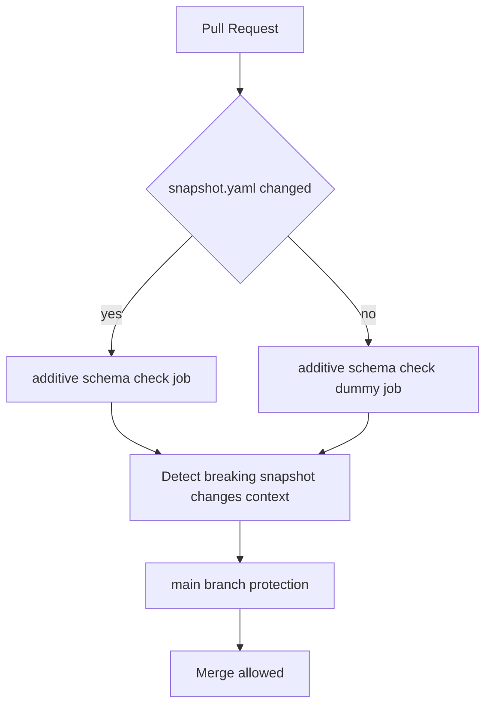
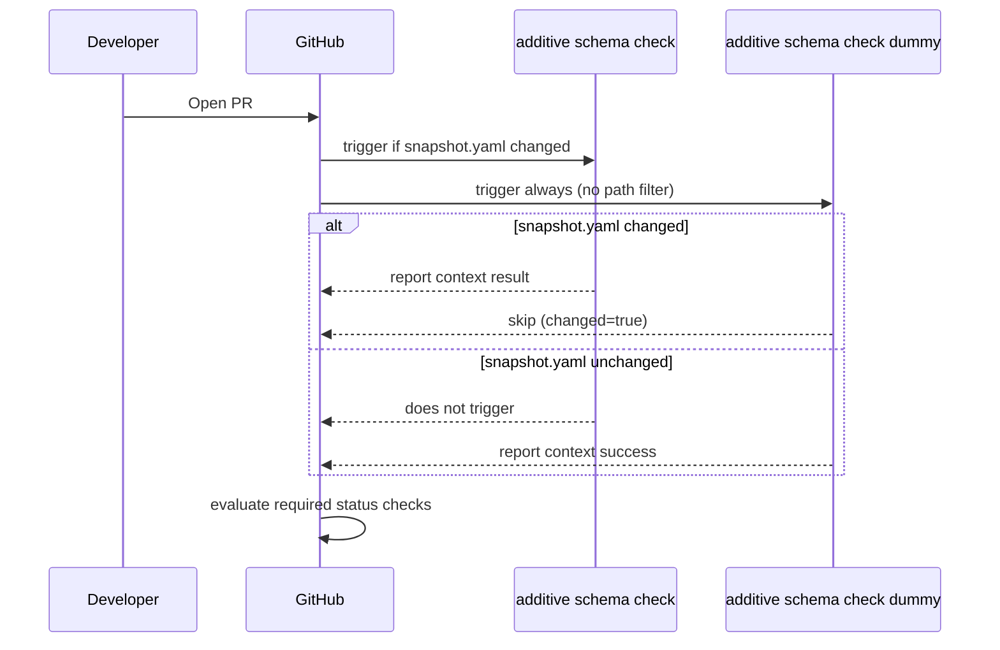

# Technical Design: ci-pipeline-audit

## Overview

**Purpose**: 本機能は `aramakisai-web` リポジトリの既存 CI/CD 実装（`cicd-pipeline` spec, `repo-governance` spec）に対する事後監査を完了させ、監査で発見した唯一の実害あるギャップ — `additive-schema-check.yml` が `main` の branch protection の required status check に含まれておらず、破壊的スキーマ変更検知が失敗してもレビュー承認さえあればマージ可能な状態 — を是正する。

**Users**: リポジトリ管理者・開発者は、この監査結果（何が既に安全で何がギャップだったかの一覧）と、ギャップ是正後の branch protection 設定を通じて、additive-only ルール（CLAUDE.md）が CI によって実際に強制されることの保証を得る。

**Impact**: `main` の `required_status_checks.contexts` が2件から3件に増える。新規 workflow `additive-schema-check-dummy.yml` が追加され、`additive-schema-check.yml` に `branches: [main]` フィルタが追加される。既存の `frontend-ci.yml`/`directus-schema-sync.yml` 本体・`frontend-ci-dummy.yml` は変更しない。

### Goals
- Requirement 1–5 の全 Acceptance Criteria を検証し、検証結果（ギャップの有無）を本ドキュメントの Requirements Traceability に記録する
- 発見した唯一の実害あるギャップ（additive-schema-check が required status check でない）を是正する
- 是正の際、`frontend-ci.yml` で過去に発生した「path filter 非該当 PR での required check 永久 pending」問題を再発させない
- 是正必須ではない副次的リスク（SHA pinning 不在、`required_status_checks.strict: false`、Infisical マシンアイデンティティの env 分離）を Risk Register として文書化する

### Non-Goals
- `aramakisai-infra` 側のワークフロー・ArgoCD・K8s Job の変更（`cicd-pipeline` spec の範囲）
- `frontend-ci-dummy.yml` パターンの reusable workflow / composite action への共通化（gap-analysis.md の Option C。過剰設計と判断し見送り）
- SHA pinning の適用、`required_status_checks.strict` の変更、Infisical プロジェクトの環境別権限再設計（実害のあるギャップではないため本 spec では実施せず、Risk Register に記録するに留める）
- pre-commit / gitleaks 関連の変更（`repo-governance` spec の範囲）

## Boundary Commitments

### This Spec Owns
- `main` ブランチ保護設定のうち `required_status_checks.contexts` への `additive-schema-check.yml` の job 追加
- 新規 workflow `additive-schema-check-dummy.yml`（`directus/schema/snapshot.yaml` を触らない PR での required check 永久 pending 防止）
- `additive-schema-check.yml` への `branches: [main]` トリガー条件追加（既存 workflow の他 workflow との一貫性是正）
- Requirements 1–5 全項目の監査結果（検証済み/ギャップ/文書化のみ）の記録

### Out of Boundary
- `aramakisai-infra` 側のあらゆる変更
- Infisical プロジェクトの環境（staging/prod）ごとの read 権限設定 — 本リポジトリの外部状態であり、変更も確認もこの spec の実装だけでは完結しない
- `frontend-ci.yml`/`frontend-ci-dummy.yml`/`directus-schema-sync.yml` 本体のロジック変更（監査の結果、実害あるギャップが見つからなかったため対象外）
- 新規 CI/CD 機能（例: 新しい検証項目の追加、通知連携等）

### Allowed Dependencies
- `.github/workflows/frontend-ci-dummy.yml` の実装パターン（diff検出 → 条件付き success 報告という構造をそのまま踏襲）
- `.github/workflows/additive-schema-check.yml` の既存 job 名（`Detect breaking snapshot.yaml changes`）
- `gh api` / `gh` CLI（branch protection 設定の読み取り・更新）
- 既存の vitest + `yaml` パッケージによる workflow 構造テストの慣習（`frontend/*.workflow.test.ts`）

### Revalidation Triggers
- `additive-schema-check.yml` の job 名（`Detect breaking snapshot.yaml changes`）を変更する場合、`additive-schema-check-dummy.yml` の対応する job 名と `main` branch protection の `required_status_checks.contexts` の両方を同時に更新すること
- `additive-schema-check.yml` の `paths:` フィルタ（対象ファイル）を変更する場合、`additive-schema-check-dummy.yml` の diff 検出ロジックが同じファイル集合を参照しているか再確認すること
- Infisical マシンアイデンティティのスコープ（`INFISICAL_CLIENT_ID`/`SECRET` が読める環境）が変更された場合、Risk Register の Infisical 分離項目を再評価すること

## Architecture

### Existing Architecture Analysis

`cicd-pipeline`/`repo-governance` 両 spec が確立した既存パターンをそのまま踏襲する:

- **required-check + dummy workflow パターン**: path filter を持つ workflow を branch protection の required status check にする際、同名 job を無条件トリガーの別 workflow で success 報告することで「非該当 PR での永久 pending」を防ぐ（`frontend-ci.yml` ⇔ `frontend-ci-dummy.yml` で確立済み）。本 spec はこのパターンを `additive-schema-check.yml` に対して複製する。
- **workflow 構造の静的テスト**: `frontend/*.workflow.test.ts` が YAML をパースして trigger・permissions・job 依存関係をアサートする慣習。新設する dummy workflow にも同パターンのテストを追加する。
- **branch protection の外部設定変更手順**: `repo-governance` design.md が確立した「新しい job を先にマージして GitHub 側に context 名を一度登録させてから、`required_status_checks.contexts` を更新する」という順序制約（存在しない context 名を指定すると `gh api` が 422 を返すため）。

### Architecture Pattern & Boundary Map



**Architecture Integration**:
- 選択パターン: 既存の required-check + dummy workflow パターンをそのまま複製（新規パターンの導入なし）
- ドメイン境界: 「スキーマ差分検知ロジック」（`additive-schema-check.yml`、変更なし）と「required check 充足の保証」（新設 `additive-schema-check-dummy.yml` + branch protection 設定）を分離し、既存の `frontend-ci.yml`/`frontend-ci-dummy.yml` の境界分離と対称にする
- 保持する既存パターン: `git diff --name-only <base_sha> <head_sha>` による diff 検出、`permissions: contents: read` のみの最小権限、secrets 非参照
- 新規コンポーネントの根拠: 単一 job の dummy workflow のみを追加。既存 `additive-schema-check.yml` 自体は変更しない（`branches: [main]` 追加を除く）
- Steering 準拠: `.kiro/steering/` 未整備のため準拠確認不可（Requirements 生成時と同じ制約）。`CLAUDE.md` の additive-only ルールを CI で強制するという目的には合致

### Technology Stack

| Layer | Choice / Version | Role in Feature | Notes |
|-------|------------------|-----------------|-------|
| CI/CD | GitHub Actions | 新規 dummy workflow の実行基盤 | 既存 `frontend-ci-dummy.yml` と同一ランタイム（`ubuntu-latest`） |
| Repository Governance | GitHub REST API (`gh api`) | `main` branch protection の `required_status_checks.contexts` 更新 | Terraform 不使用（`repo-governance` の既定方針を踏襲） |
| Test Harness | vitest + `yaml` (frontend/ 配下, 既存) | 新設 workflow の構造検証 | 新規依存追加なし、既存 devDependency を再利用 |

## File Structure Plan

### Directory Structure
```
.github/workflows/
├── additive-schema-check.yml          # 既存: branches: [main] を追加(唯一の本体変更)
├── additive-schema-check-dummy.yml    # 新規: frontend-ci-dummy.yml と同型のダミー
frontend/
├── additive-schema-check.workflow.test.ts        # 既存: branches アサーション追加
├── additive-schema-check-dummy.workflow.test.ts  # 新規: frontend-ci-dummy.workflow.test.ts と同型
└── pipeline-integration.test.ts                  # 既存: dummy/real job名一致の統合アサーション追加
```

### Modified Files
- `.github/workflows/additive-schema-check.yml` — `on.pull_request.branches: [main]` を追加（他 workflow との trigger 一貫性是正、Requirement 1 の副次発見）
- `frontend/additive-schema-check.workflow.test.ts` — 上記に対応するアサーションを追加
- `frontend/pipeline-integration.test.ts` — dummy workflow と実 workflow の job 名一致を検証するケースを追加（`frontend-ci-dummy.yml` に対する既存の同種テストと対称）

## System Flows



**ロールアウト順序**（422 回避のため厳守）:
1. `additive-schema-check-dummy.yml` と `additive-schema-check.yml` の `branches` 修正を `main` にマージする
2. `.kiro/**` のみを変更するテスト PR を作成し、`Detect breaking snapshot.yaml changes` context が dummy 経由で success 報告されることを確認する（GitHub 側に context 名を登録させる）
3. `gh api` で `main` branch protection の `required_status_checks.contexts` に同 context を追加する
4. 追加後、再度 `gh api .../protection` を取得し `contexts` に3件揃っていることを確認する

## Requirements Traceability

| Requirement | Summary | Components | Verdict |
|-------------|---------|------------|---------|
| 1.1 | frontend-ci.yml の paths フィルタ網羅性 | 既存実装のみ | 検証済み・ギャップなし |
| 1.2 | dummy workflow の job名一致 | 既存実装のみ（frontend-ci-dummy.workflow.test.ts） | 検証済み・ギャップなし |
| 1.3 | schema diff 検出ロジックの整合 | 既存実装のみ | 検証済み・ギャップなし |
| 1.4 | 参照切れスクリプトの検出 | 既存実装のみ | 該当なし（`check-additive-schema.ts` 存在確認済み） |
| 1.5 | 必須ステータスチェック棚卸し表 | Audit Findings Inventory（本表） | 本表で充足 |
| 1.x (副次) | additive-schema-check.yml の branches 欠落 | Additive Schema Check Trigger Fix | ギャップ発見・是正 |
| 2.1, 2.2 | branch protection contexts と失敗ブロックの整合 | Branch Protection Configuration | ギャップ発見・是正 |
| 2.3 | bypass allowance と status check の独立性 | Audit Findings Inventory | 文書化のみ（GitHub 仕様上、実害なし） |
| 2.4 | `strict: false` の影響評価 | Risk Register | 文書化のみ・是正見送り |
| 2.5 | conversation resolution とdummy の非干渉 | Audit Findings Inventory | 検証済み・ギャップなし |
| 3.1–3.5 | fork PR secret非露出 | 既存実装 + 既存テスト（frontend-ci.workflow.test.ts, additive-schema-check.workflow.test.ts, pipeline-integration.test.ts） | 検証済み・ギャップなし |
| 4.1, 4.2, 4.5 | preview/prod trigger分離・permissions最小権限・GitHub App スコープ | 既存実装 + 既存テスト（frontend-ci-deploy.workflow.test.ts, generated-manifests.test.ts） | 検証済み・ギャップなし |
| 4.3, 4.4 | Infisical env 分離の実効性 | Risk Register | 文書化のみ（本リポジトリ外部の情報、是正対象外） |
| 5.1 | Action の SHA pinning | Risk Register | 文書化のみ・是正見送り |
| 5.2 | ブランチ/PR重複防止 | 既存実装 + 既存テスト（directus-schema-sync.workflow.test.ts, pipeline-integration.test.ts） | 検証済み・ギャップなし |
| 5.3 | additive-check と schema-sync のタイミング window | Branch Protection Configuration + Additive Schema Check Dummy Workflow | ギャップ発見・是正（2.1/2.2と同一ギャップ） |
| 5.4 | dummy workflow のなりすまし耐性 | 既存実装 + 既存テスト（frontend-ci-dummy.workflow.test.ts） | 検証済み・ギャップなし（base/head SHAはGitHub確定値のためfork側で改ざん不可） |
| 5.5 | 是正項目の具体化 | 本 design.md 全体 | 本ドキュメントで充足 |

## Components and Interfaces

| Component | Domain/Layer | Intent | Req Coverage | Key Dependencies (P0/P1) | Contracts |
|-----------|--------------|--------|---------------|--------------------------|-----------|
| Branch Protection Configuration | Repository Governance | additive-schema-check を required status check に追加 | 2.1, 2.2, 5.3 | Additive Schema Check Dummy Workflow (P0) | API |
| Additive Schema Check Dummy Workflow | CI/CD | snapshot.yaml 非該当PRで同名contextをsuccess報告 | 1.2 (対称), 2.1, 2.2, 5.3, 5.4 | additive-schema-check.yml の job名 (P0) | Event |
| Additive Schema Check Trigger Fix | CI/CD | additive-schema-check.yml に branches:[main] を追加 | 1.x (副次発見) | — | Event |
| Audit Findings Inventory & Risk Register | Documentation | Requirements 1–5 の検証結果と非是正項目の記録 | 1.5, 2.3, 2.4, 2.5, 4.3, 4.4, 5.1, 5.5 | — | — |

### Repository Governance

#### Branch Protection Configuration

| Field | Detail |
|-------|--------|
| Intent | `main` の `required_status_checks.contexts` に `Detect breaking snapshot.yaml changes` を追加し、additive-only ルール違反を機械的にマージブロックする |
| Requirements | 2.1, 2.2, 5.3 |

**Responsibilities & Constraints**
- 既存2件の context（`type-check / lint / test / build`, `deploy preview (Workers)`）を維持したまま1件追加する（既存設定を破壊しない）
- 追加対象の context 名は GitHub 側に一度登録されている状態（Additive Schema Check Dummy Workflow のマージ・テストPR実行後）でなければ 422 になる

**Dependencies**
- Inbound: なし（外部設定）
- Outbound: なし
- External: GitHub REST API（`gh api`） — 権限不足時 403、存在しない context 指定時 422（Criticality: P0）

**Contracts**: Service [ ] / API [x] / Event [ ] / Batch [ ] / State [ ]

##### API Contract
| Method | Endpoint | Request | Response | Errors |
|--------|----------|---------|----------|--------|
| PUT | `/repos/aramakisai/aramakisai-web/branches/main/protection` | `required_status_checks: {strict: false, contexts: ["type-check / lint / test / build", "deploy preview (Workers)", "Detect breaking snapshot.yaml changes"]}`, 既存の `enforce_admins: true`, `required_pull_request_reviews` をそのまま維持 | 更新後の protection オブジェクト | 403（権限不足）, 422（context名が未登録） |

**Implementation Notes**
- Integration: Additive Schema Check Dummy Workflow のマージ・テストPR確認完了後に実行する（System Flows のロールアウト順序参照）
- Validation: 適用後に同エンドポイントを GET し、`contexts` が3件・`enforce_admins.enabled: true` のままであることを再確認する
- Risks: 順序を誤ると（dummy workflow マージ前に protection を更新すると）422 になる、または dummy 無しで有効化すると非該当 PR が永久 pending になる

### CI/CD

#### Additive Schema Check Dummy Workflow

| Field | Detail |
|-------|--------|
| Intent | `directus/schema/snapshot.yaml` を変更しない PR でも `Detect breaking snapshot.yaml changes` context を success 報告し、required 化後の永久 pending を防ぐ |
| Requirements | 2.1, 2.2, 5.3, 5.4 |

**Responsibilities & Constraints**
- `additive-schema-check.yml` と同一の job 名（`Detect breaking snapshot.yaml changes`）を報告する（context 名はこの文字列で一致判定されるため）
- `directus/schema/snapshot.yaml` が変更されている PR では自身の `check` job を `if` でスキップし、本物の `additive-schema-check.yml` 側の結果のみが同名 context を上書き報告する（`frontend-ci-dummy.yml` と対称の排他関係）
- secrets を一切参照せず、`permissions: contents: read` のみを付与する（fork PR 安全性、Requirement 3 の既存方針を踏襲）

**Dependencies**
- Inbound: GitHub `pull_request` イベント（opened/synchronize/reopened, `branches: [main]`）
- Outbound: なし
- External: `additive-schema-check.yml` の job 名（P0、変更時は同時更新が必要）

**Contracts**: Service [ ] / API [ ] / Event [x] / Batch [ ] / State [ ]

##### Event Contract
- Published events: なし（GitHub Actions のジョブステータスのみ）
- Subscribed events: `pull_request`（`opened`, `synchronize`, `reopened`、`branches: [main]`、path filter なし = 無条件トリガー）
- Ordering / delivery guarantees: GitHub の「同一 context 名を報告した最後の run が有効」という挙動に依存。`additive-schema-check.yml`（path filter あり）と本 dummy（無条件）が同一 PR で同時に走った場合、実際に snapshot.yaml が変更されていれば dummy 側は自身の `check` job を skip するため競合しない

**Implementation Notes**
- Integration: `.github/workflows/additive-schema-check-dummy.yml` として新規作成。`detect` job で `git diff --name-only <base> <head>` により `directus/schema/snapshot.yaml` の変更有無を判定し、`check` job（`needs: detect`, `if: needs.detect.outputs.changed == 'false'`）が同名 context を success 報告する
- Validation: `frontend/additive-schema-check-dummy.workflow.test.ts` で `frontend-ci-dummy.workflow.test.ts` と同型のアサーション（trigger、job名一致、secrets非参照、permissions最小化、diffロジック）を追加する
- Risks: `additive-schema-check.yml` の job 名変更時にこの workflow の更新を忘れると、branch protection の context が永久に片方からしか報告されなくなる（Revalidation Triggers 参照）

## Testing Strategy

- **Unit（workflow構造）**: `frontend/additive-schema-check-dummy.workflow.test.ts` を新規作成し、`frontend-ci-dummy.workflow.test.ts` と同型に (1) trigger が `branches: [main]` かつ path filter なし、(2) job 名が `additive-schema-check.yml` と完全一致、(3) secrets 非参照、(4) `permissions: contents: read` のみ、(5) diff ロジックが `directus/schema/snapshot.yaml` を対象にしている、を検証する
- **Unit（既存修正）**: `frontend/additive-schema-check.workflow.test.ts` に `on.pull_request.branches` が `['main']` であることを追加検証する
- **Integration**: `frontend/pipeline-integration.test.ts` に、`additive-schema-check.yml` と `additive-schema-check-dummy.yml` の job 名が一致することを検証するケースを追加する（`frontend-ci.yml`/`frontend-ci-dummy.yml` に対する既存の同種検証と対称）
- **E2E（手動、ロールアウト検証）**: System Flows のロールアウト順序に従い、(1) dummy workflow マージ後に `.kiro/**` のみのテスト PR で `Detect breaking snapshot.yaml changes` context が success 報告されることを確認、(2) 実際に `directus/schema/snapshot.yaml` に破壊的変更を含むテスト PR を作成し、`additive-schema-check.yml` 側が failure を報告し dummy 側が skip されることを確認、(3) branch protection 更新後、この failure PR がマージ不能になることを確認する

## Security Considerations

- 新規 `additive-schema-check-dummy.yml` は secrets を一切参照せず `permissions: contents: read` のみを付与する。fork PR から実行されても既存の `additive-schema-check.yml`/`frontend-ci-dummy.yml` と同水準の安全性を保つ（Requirement 3 の既存方針を新規 workflow にも適用）
- branch protection の変更は `gh api` を直接実行するリポジトリ管理者の手動操作であり、この spec のコード変更だけでは自動適用されない（`repo-governance` design.md と同様、外部状態変更として tasks フェーズで明示する）

## Optional: Risk Register（是正しない発見事項の記録）

| 発見事項 | Requirement | リスク評価 | 対応方針 |
|---|---|---|---|
| `bypass_pull_request_allowances.users` に `tom1022` が設定されている | 2.3 | Low（GitHub仕様上レビュー承認要件のみをbypassし、`required_status_checks`には影響しない） | 是正不要、仕様として文書化のみ |
| `required_status_checks.strict: false` | 2.4 | Medium（古いbase commitでのcheck合格のままマージ可能） | 是正見送り。PRマージ頻度次第で`true`化を検討するようチームに提起 |
| 全 Action がタグ参照（`@v4`等）、SHA pin無し。`sha_pinning_required: false` | 5.1 | Medium（サードパーティAction侵害時のサプライチェーンリスク） | 是正見送り。Renovate/Dependabot等の更新運用整備とセットで別途検討 |
| Infisical マシンアイデンティティが staging/prod 両環境を読める可能性 | 4.3, 4.4 | Unknown（本リポジトリの情報のみでは判定不可、Infisicalダッシュボード確認が必要） | 本spec対象外。Infisicalプロジェクト管理者に確認を委ねる |
