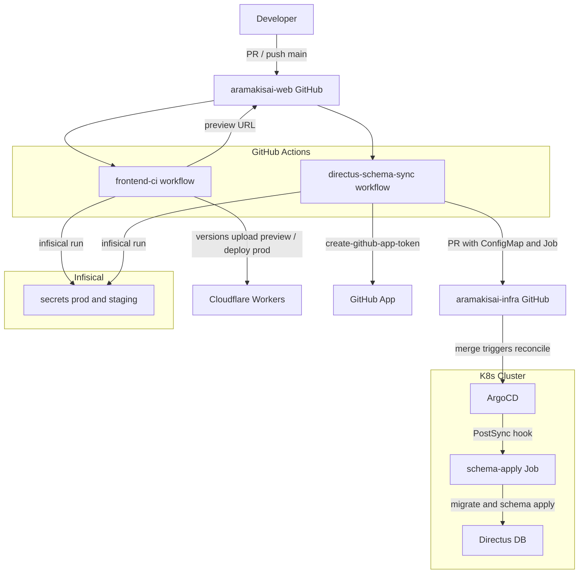
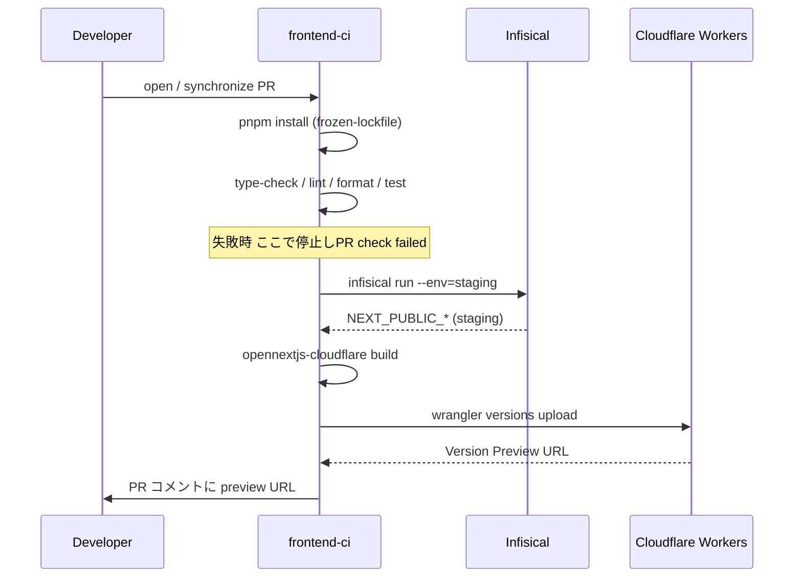
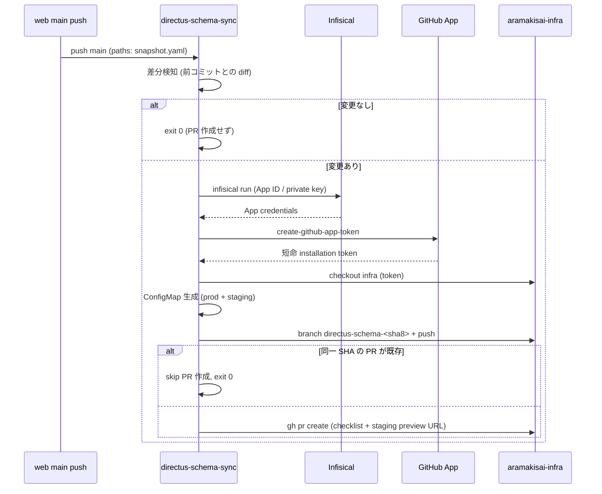
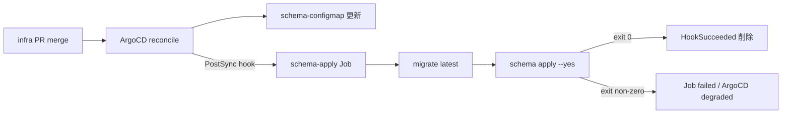
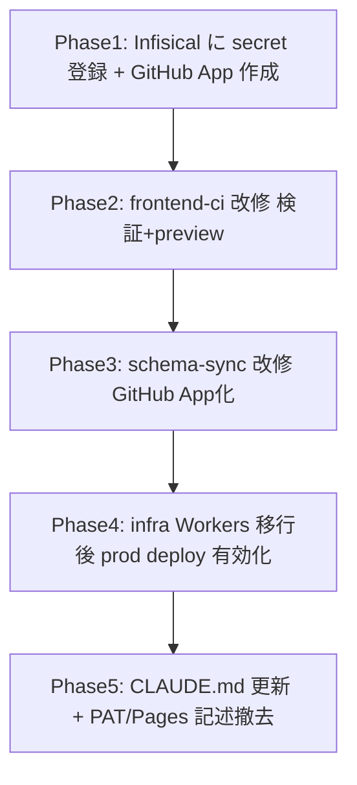

# Design Document — cicd-pipeline

## Overview

本設計は、荒牧祭ホームページ (`aramakisai-web`) の CI/CD パイプラインをゼロから構築する。GitHub Actions を唯一の CI/CD トリガーとし、(1) PR 検証 + Cloudflare Workers preview デプロイ、(2) main への Directus スキーマ変更検知 → `aramakisai-infra` への GitOps PR 自動生成、(3) main の本番 Workers デプロイ、の 3 系統を提供する。

**Purpose**: 型チェック・ビルドを通過したコードのみを Cloudflare Workers へ配信し、Directus スキーマ変更を GitOps 経由で安全に本番反映する。
**Users**: 荒牧祭実行委員会の開発者（PR 検証・preview 確認）とインフラ管理者（ArgoCD 経由のスキーマ適用）。
**Impact**: 現状 CI は検証のみ（`frontend-ci.yml`）、スキーマ同期は PAT 認証の暫定実装（`directus-schema-sync.yml`）。本設計でデプロイ自動化・GitHub App 認証・Infisical SSoT・staging gate を追加し、両 workflow を仕様準拠に再構築する。

> **重要な設計前提（要レビュー）**: コミット済み frontend scaffold が `@opennextjs/cloudflare`（Cloudflare **Workers**）を採用しているため、本設計は requirements.md の Cloudflare **Pages** 文言を **Workers** に読み替える。読み替えの根拠と対応表は `research.md`（「requirements.md → 設計の読み替え表」「Decision: デプロイ先を Cloudflare Workers に確定」）を参照。

### Goals

- 全 PR で `pnpm type-check` / `pnpm build` を実行し、失敗時はブランチ保護でマージ阻止（1.1–1.3）。
- PR ごとに Cloudflare Workers の **Version Preview URL** を発行し PR コメント（staging Directus 向けビルド）（1.6, 6.2）。
- `directus/schema/snapshot.yaml` 変更を main で検知し、`aramakisai-infra` へ GitHub App 認証で自動 PR（2.x, 3.x）。
- staging/prod 双方の K8s Job + ConfigMap を同一 infra PR に生成、staging 検証を prod マージ必須条件化（4.x, 5.x）。
- Secret を Infisical に集約、GH secrets は Infisical machine identity のみ（7.x）。

### Non-Goals

- Terraform / Ansible の自動実行、Directus コンテナイメージのバージョン管理。
- Next.js アプリケーションコード実装。
- Cloudflare Workers/Pages プロジェクトの provisioning（infra `cloudflare-pages-project` spec 所有）。
- staging Directus 基盤（DB/ESO/Service）の構築（infra 側で完了済み前提、5.3）。

## Boundary Commitments

### This Spec Owns

- `aramakisai-web/.github/workflows/frontend-ci.yml` — PR 検証 + preview + prod デプロイ（型チェック/lint/test/build/deploy）。
- `aramakisai-web/.github/workflows/directus-schema-sync.yml` — スキーマ差分検知 + infra PR 自動生成。
- infra PR 内に書き込む K8s マニフェスト生成ロジック（ConfigMap + Job、prod/staging 双方）。
- `aramakisai-web/frontend/.infisical.json` — frontend 用 Infisical プロジェクト/環境マッピング。
- `CLAUDE.md` の additive-only スキーマ変更ルール記載（3.7）。

### Out of Boundary

- `aramakisai-infra` の ArgoCD Application 定義・既存 `schema-apply-job.yaml` テンプレートの恒久所有（web workflow は内容を **生成/上書き**するが、マニフェスト設計の一次所有は infra）。
- Cloudflare Workers/Pages プロジェクト・カスタムドメイン・環境変数の Terraform 管理（infra `cloudflare-pages-project` spec）。
- GitHub App の作成・インストール（GitHub 管理画面での手動事前作業）。
- Infisical プロジェクト・machine identity・secret 値の登録（Infisical 管理画面）。

### Allowed Dependencies

- `frontend/package.json` の `type-check` / `build` / `deploy` スクリプト（frontend-scaffold spec 所有、既存）。
- `frontend/wrangler.toml`（OpenNext Workers 設定、既存）。
- `aramakisai-infra` の既存パス構造 `gitops/manifests/{prod,staging}/directus/`、`directus-secrets` / `directus-staging-secrets`、ArgoCD `directus` / `directus-staging` App（`selfHeal: true`）。
- Infisical CLI（`infisical run`）、`actions/create-github-app-token`。

### Revalidation Triggers

- **infra `cloudflare-pages-project` spec の Workers 移行**: 現 `terraform/pages.tf` は Cloudflare Pages プロジェクトを定義。本設計は Workers 前提のため、infra 側が Workers（`workers_script` + custom domain route）へ移行するまで **prod deploy job は実体不在**。移行完了が prod デプロイの前提。
- `frontend/wrangler.toml` の `name` / ビルド出力パス変更 → deploy コマンド整合確認。
- infra `schema-apply-job.yaml` の secret 名・DB エンドポイント・ConfigMap マウントパス変更 → 生成ロジック更新。
- Directus メジャーバージョン更新 → Job の `image` タグ更新。

## Architecture

### Existing Architecture Analysis

- **既存 `frontend-ci.yml`**: `pull_request` + `push:main` で `pnpm install/type-check/lint/format:check/test/build` を実行。build 時は **ダミー** `NEXT_PUBLIC_*` を注入。deploy・Infisical・preview は未実装。→ 本設計で Infisical 注入 + Workers deploy + preview を追加。
- **既存 `directus-schema-sync.yml`**: `push:main` かつ `directus/schema/snapshot.yaml` 変更で発火。`INFRA_GITHUB_TOKEN`（PAT）で infra を checkout、`kubectl create configmap --dry-run` で ConfigMap 生成、`gh pr create`。→ PAT を **GitHub App**（Infisical 保管）へ、認証・命名を仕様準拠へ改修。
- **既存 infra Job**（`schema-apply-job.yaml`）: `directus/directus:12.1.1` で `database migrate:latest` → `schema apply --yes`、DB 直結、ArgoCD `PostSync` hook。→ この方式を踏襲（`research.md` の技術的根拠参照）。

### Architecture Pattern & Boundary Map

**Selected pattern**: GitHub Actions を単一 CI/CD オーケストレータとする「push-based GitOps 起点」パターン。web リポジトリの workflow が (a) Cloudflare へ直接 push デプロイ、(b) infra リポジトリへ PR を push し、以降は ArgoCD の pull-based reconcile に委譲する。



**Architecture Integration**:
- **Selected pattern**: GHA 単一トリガー + GitOps 委譲。CD 経路を GHA に一本化（Cloudflare/Git native 連携は不使用、6.6）。
- **Domain/feature boundaries**: 「web リポジトリの CI/CD」と「infra のマニフェスト reconcile」を PR 境界で分離。web は infra の desired state を **提案**（PR）するのみで、適用主体は ArgoCD。
- **Existing patterns preserved**: infra の ArgoCD App of Apps、`PostSync` hook Job、ESO/`directus-secrets` を維持。
- **New components rationale**: Infisical 注入層（secret SSoT）、GitHub App トークン層（最小権限 infra 書き込み）、preview 発行層（Workers versions）。
- **Steering compliance**: steering ディレクトリは空のため、CLAUDE.md の原則（Infisical SSoT、`.env` 不使用、staging 事前検証）に準拠。

### Technology Stack

| Layer | Choice / Version | Role in Feature | Notes |
|-------|------------------|-----------------|-------|
| CI/CD Runtime | GitHub Actions (`ubuntu-latest`) | 全 workflow 実行基盤 | 既存 |
| Frontend Build/Deploy | `@opennextjs/cloudflare` ^1.0 + `wrangler` ^4.0 | `opennextjs-cloudflare build/deploy`、`wrangler versions upload` | Workers（Pages ではない）。`research.md` 参照 |
| Package Manager | `pnpm@11.9.0` + `pnpm/action-setup@v4` | 依存解決・キャッシュ | `package_json_file: frontend/package.json` |
| Secret 注入 | Infisical CLI (`infisical run`) | 全 secret/env の runtime 注入 | GH secrets は machine identity のみ |
| Infra 認証 | `actions/create-github-app-token@v1` | 短命 installation token 生成 | App 資格情報は Infisical 保管 |
| Schema 適用 | `directus/directus:12.1.1`（K8s Job） | `migrate:latest` + `schema apply --yes` | infra 所有、DB 直結 |
| GitOps 適用 | ArgoCD（`selfHeal: true`, `PostSync` hook） | infra PR マージ後の自動 reconcile | 既存 |

## File Structure Plan

### Modified / New Files（aramakisai-web）

```
aramakisai-web/
├── .github/workflows/
│   ├── frontend-ci.yml          # 改修: 検証 + Infisical build + preview + prod deploy
│   └── directus-schema-sync.yml # 改修: GitHub App 認証 + 仕様準拠の infra PR 生成
├── frontend/
│   └── .infisical.json          # 新規: Infisical プロジェクト/環境マッピング（web 用）
├── CLAUDE.md                    # 改修: additive-only スキーマ変更ルール明記（3.7）
└── directus/schema/snapshot.yaml # 既存: 変更検知の対象（本 spec は変更しない）
```

### Generated Files（directus-schema-sync が aramakisai-infra へ書き込む）

```
aramakisai-infra/gitops/manifests/
├── prod/directus/
│   ├── schema-configmap.yaml        # 生成: snapshot.yaml を data 化（ConfigMap: directus-schema）
│   ├── migrations-configmap.yaml    # 生成(任意): directus/migrations/*.js（ConfigMap: directus-migrations）
│   └── schema-apply-job.yaml        # 既存テンプレを踏襲（PostSync hook、DB 直結）
└── staging/directus/               # prod と同一パターン（namespace=staging, secret=directus-staging-secrets）
    ├── schema-configmap.yaml
    ├── migrations-configmap.yaml
    └── schema-apply-job.yaml
```

> Job マニフェストの一次設計は infra 所有。web workflow は ConfigMap を生成し、Job は既存内容を維持（差分がある場合のみ更新）。生成方式は既存 `kubectl create configmap --dry-run=client -o yaml` を踏襲。

## System Flows

### PR 検証 + preview デプロイ（Requirement 1, 6）



- **Gating**: 検証ステップ（type-check/build）失敗時は deploy job を実行しない（6.1）。ブランチ保護で必須 check 化（1.3）。
- **キャッシュ**: `actions/setup-node` の pnpm キャッシュ + `.next/cache` を `actions/cache` で保持（1.5）。
- **fork PR**: `head.repo.fork == true` の場合、Infisical 資格情報を要する build/preview job を skip（secret 非露出、7.6）。検証（type-check/test）はダミー env で継続。

### スキーマ変更検知 → infra PR（Requirement 2, 3, 5）



- **差分検知**: `git diff --name-only HEAD^ HEAD` で `directus/schema/snapshot.yaml` を判定（2.1, 2.2）。60 秒以内に完了（2.4、checkout + diff のみで軽量）。
- **冪等性**: 同一 SHA ブランチ/PR 既存時は skip（3.5）。トリガー SHA を branch 名・PR body に埋め込み（2.3, 3.1, 3.4）。
- **staging gate**: PR body に「staging schema-apply Job 成功確認」チェックリスト項目と staging preview URL（frontend E2E 用）+ `stg-api.aramakisai.com`（API 参照）を埋め込み（5.4）。infra 側ブランチ保護でチェック必須化（5.5、infra リポジトリ設定）。

### スキーマ適用 Job（Requirement 4）



- Job は既存 infra テンプレ踏襲: `directus/directus:12.1.1`、`envFrom: directus-secrets`（prod）/ `directus-staging-secrets`（staging）、DB 直結、ConfigMap を `/snapshot` にマウント（4.1, 4.2, 4.3）。
- `restartPolicy: OnFailure` + `backoffLimit: 1`（破壊的変更の連続再試行防止、4.6）、`PostSync` hook + `HookSucceeded` 削除 + `ttlSecondsAfterFinished: 3600`（4.7, 4.8）。
- ArgoCD `directus` / `directus-staging` App は `automated.selfHeal: true`（4.9、既存）。

## Requirements Traceability

| Requirement | Summary | Components | Interfaces | Flows |
|-------------|---------|------------|------------|-------|
| 1.1–1.5 | PR 型チェック/ビルド/キャッシュ/進行表示 | FrontendCIWorkflow | GHA Workflow Contract | PR 検証フロー |
| 1.6, 1.7 | preview URL + Infisical build 注入 | FrontendCIWorkflow | Workers Deploy Contract | PR 検証フロー |
| 2.1–2.4 | snapshot 差分検知 | SchemaSyncWorkflow | Batch Contract | スキーマ検知フロー |
| 3.1–3.6 | infra 自動 PR + GitHub App 認証 | SchemaSyncWorkflow, GitHubAppAuth | Batch / Auth Contract | スキーマ検知フロー |
| 3.7 | additive-only ルール文書化 | CLAUDE.md | — | — |
| 4.1–4.9 | K8s schema-apply Job | SchemaApplyJob (infra) | Batch/Job Contract | Job 適用フロー |
| 5.1–5.5 | staging 事前検証 + gate | SchemaSyncWorkflow, SchemaApplyJob | Batch Contract | スキーマ検知/Job フロー |
| 6.1–6.6 | Workers デプロイ（GHA 経由） | FrontendCIWorkflow | Workers Deploy Contract | PR 検証フロー |
| 7.1–7.6 | Infisical SSoT + 最小権限 | InfisicalInjection, GitHubAppAuth | Auth Contract | 全フロー |

## Components and Interfaces

| Component | Domain/Layer | Intent | Req Coverage | Key Dependencies (P0/P1) | Contracts |
|-----------|--------------|--------|--------------|--------------------------|-----------|
| FrontendCIWorkflow | CI/CD | PR 検証 + Workers preview/prod デプロイ | 1, 6 | Infisical (P0), Cloudflare API (P0), wrangler (P0) | Batch, Service |
| SchemaSyncWorkflow | CI/CD | snapshot 差分検知 + infra PR 生成 | 2, 3, 5 | GitHubAppAuth (P0), Infisical (P0), infra repo (P0) | Batch |
| GitHubAppAuth | Auth | 短命 infra 書き込みトークン生成 | 3.6, 7.1 | Infisical (P0), create-github-app-token (P0) | Service |
| InfisicalInjection | Auth | 全 secret/env の runtime 注入 | 7.1–7.3 | Infisical machine identity (P0) | Service |
| SchemaApplyJob | Infra (infra 所有) | migrate + schema apply | 4, 5 | directus image (P0), directus-secrets (P0) | Batch/Job |

### CI/CD レイヤー

#### FrontendCIWorkflow

| Field | Detail |
|-------|--------|
| Intent | PR 検証を通過したコードのみを Cloudflare Workers へ配信 |
| Requirements | 1.1, 1.2, 1.3, 1.4, 1.5, 1.6, 1.7, 6.1, 6.2, 6.3, 6.4, 6.5, 6.6 |

**Responsibilities & Constraints**
- `pull_request`（preview）と `push:main`（prod）で発火。`working-directory: frontend`。
- 検証（type-check/lint/format/test/build）を deploy の前段ゲートとし、失敗時は deploy job を実行しない。
- `NEXT_PUBLIC_*` はビルド時インライン化のため、build 直前に `infisical run --env=<env>` で確定させる（preview=staging, prod=prod）。
- secret 値を echo/log しない（7.5）。fork PR に secret を露出しない（7.6）。

**Dependencies**
- External: Infisical CLI — env 注入（P0）
- External: Cloudflare API（`CLOUDFLARE_API_TOKEN`/`ACCOUNT_ID`、Infisical 経由）— Workers deploy（P0）
- External: `wrangler` / `@opennextjs/cloudflare` — build/deploy/versions（P0）

**Contracts**: Service [x] / Batch [x]

##### Batch / Job Contract（GHA job 構成）
- **Trigger**: `pull_request` [opened, synchronize, reopened] target `main`; `push` branches `[main]`。paths: `frontend/**`, workflow 自身。
- **Jobs**:
  1. `validate` — install（frozen-lockfile）→ type-check → lint → format:check → test → build（ダミー env で型/スキーマ検証、fork でも実行可）。
  2. `deploy-preview`（PR かつ非 fork のみ）— `infisical run --env=staging -- pnpm exec opennextjs-cloudflare build` → `wrangler versions upload` → preview URL を PR コメント。
  3. `deploy-prod`（`push:main` のみ）— `infisical run --env=prod -- pnpm exec opennextjs-cloudflare build` → `opennextjs-cloudflare deploy`。
- **Input / validation**: `INFISICAL_CLIENT_ID`/`INFISICAL_CLIENT_SECRET`（GH secrets）で Infisical 認証。
- **Output / destination**: Cloudflare Workers（preview version / prod）、PR コメント（preview URL）。
- **Idempotency & recovery**: deploy 失敗時は workflow failed（6.5）。再実行で冪等（同一 commit を再デプロイ）。

##### Service Interface（preview URL 抽出）
```typescript
// wrangler versions upload の出力から preview URL を取得する疑似契約
interface PreviewDeploy {
  build(env: "staging"): Promise<void>;            // opennextjs-cloudflare build
  uploadPreview(): Promise<{ previewUrl: string }>; // wrangler versions upload
  comment(prNumber: number, url: string): Promise<void>;
}
```
- Preconditions: `validate` job 成功。Infisical staging env にアクセス可能。
- Postconditions: PR に preview URL コメントが 1 件（既存があれば更新）。
- Invariants: prod トラフィックは preview アップロードで変化しない。

**Implementation Notes**
- Integration: 既存 `frontend-ci.yml` を拡張。`validate` は既存ステップを流用。
- Validation: `wrangler` バージョン pin。preview URL は CLI JSON 出力優先、stdout パースをフォールバック。
- Risks: `wrangler versions upload` の出力形式変動 → バージョン固定で緩和。infra の Worker 実体未整備時は `deploy-prod` を手動 gate（Revalidation Trigger 参照）。

#### SchemaSyncWorkflow

| Field | Detail |
|-------|--------|
| Intent | snapshot 変更を検知し infra へ GitOps PR を自動生成 |
| Requirements | 2.1, 2.2, 2.3, 2.4, 3.1, 3.2, 3.3, 3.4, 3.5, 5.1, 5.4 |

**Responsibilities & Constraints**
- `push:main` かつ paths `directus/schema/snapshot.yaml`（+ `directus/migrations/**`）で発火。
- 前コミットとの diff で変更有無を判定、無変更なら PR を作らず exit 0。
- prod/staging 双方の ConfigMap を生成し、既存 Job マニフェストと共に infra PR 化。
- 同一 SHA の PR/branch 既存時は skip。

**Dependencies**
- Inbound: GitHubAppAuth — infra 書き込みトークン（P0）
- External: Infisical — App 資格情報注入（P0）
- External: `aramakisai-infra` repo — PR ターゲット（P0）
- External: `kubectl`（`--dry-run=client`）— ConfigMap 生成（P1）

**Contracts**: Batch [x]

##### Batch / Job Contract
- **Trigger**: `push` branches `[main]`, paths `directus/schema/snapshot.yaml`, `directus/migrations/**`。
- **Input / validation**: `git diff --name-only HEAD^ HEAD` に対象パスが含まれるか。含まれなければ後続 skip（2.1, 2.2）。
- **Steps**:
  1. Infisical で GitHub App ID / private key 注入 → `create-github-app-token` で短命 token（3.6, 7.1）。
  2. infra checkout（token）。
  3. prod/staging の `schema-configmap.yaml`（+ 任意 `migrations-configmap.yaml`）を `kubectl create configmap --dry-run=client -o yaml` で生成（3.2, 5.1）。
  4. branch `directus-schema-<sha8>` 作成・push。差分なければ skip（3.5）。
  5. 既存 PR（同 SHA）確認 → 無ければ `gh pr create`（title/body に SHA、staging checklist + preview URL）（3.4, 5.4）。
- **Output / destination**: `aramakisai-infra` の PR（`gitops/manifests/{prod,staging}/directus/`）。
- **Idempotency & recovery**: 同 SHA 再実行で PR 重複作成せず exit 0（3.5）。token は短命で自動失効。

**Implementation Notes**
- Integration: 既存 `directus-schema-sync.yml` を GitHub App 認証へ改修（PAT `INFRA_GITHUB_TOKEN` 廃止）。
- Validation: App 権限は `aramakisai-infra` の `contents:write` + `pull-requests:write` のみ（3.6）。
- Risks: 60 秒制約（2.4）は checkout + diff のみで軽量に達成。migrations ConfigMap は `optional: true` マウント側で吸収。

### Auth レイヤー

#### GitHubAppAuth / InfisicalInjection

| Field | Detail |
|-------|--------|
| Intent | secret を Infisical に集約し、infra 書き込みは短命 App トークンに限定 |
| Requirements | 7.1, 7.2, 7.3, 7.4, 7.5, 7.6 |

**Responsibilities & Constraints**
- GH secrets は `INFISICAL_CLIENT_ID` / `INFISICAL_CLIENT_SECRET` の 2 つのみ（7.2）。
- `CLOUDFLARE_API_TOKEN` / `CLOUDFLARE_ACCOUNT_ID` / `NEXT_PUBLIC_*` / GitHub App 資格情報は全て Infisical に保管し `infisical run --env=<env>` で注入（7.3）。
- schema apply の DB 認証情報は K8s Job 側の ESO/`directus-secrets` が担い、GHA では扱わない（7.4）。
- secret を log/echo しない（7.5）、fork PR に露出しない（7.6）。

**Contracts**: Service [x]

##### Service Interface
```typescript
interface SecretInjection {
  // GH secrets: INFISICAL_CLIENT_ID / INFISICAL_CLIENT_SECRET のみ
  infisicalRun(env: "staging" | "prod", command: string[]): Promise<number>; // exit code
  githubAppToken(input: {
    appId: string;       // Infisical 由来
    privateKey: string;  // Infisical 由来
    owner: "aramakisai";
    repositories: ["aramakisai-infra"];
    permissions: { contents: "write"; pull_requests: "write" };
  }): Promise<{ token: string; expiresAt: string }>; // 短命
}
```
- Preconditions: Infisical machine identity が有効。
- Postconditions: 注入された env はプロセス生存中のみ有効、ログ非出力。
- Invariants: `aramakisai-infra` 以外への書き込み権限を token は持たない。

**Implementation Notes**
- Integration: 各 job 冒頭で Infisical CLI setup（universal-auth）。
- Validation: `req 6.4`（CLOUDFLARE_* を GH secrets）は `req 7.3`（Infisical）を優先し **無効化**（`research.md` の矛盾解決を参照）。
- Risks: Infisical 障害時に全 deploy が停止 → 手動 `wrangler deploy` フォールバック手順を運用ドキュメント化。

### Infra レイヤー（参照・一次所有は infra）

#### SchemaApplyJob

| Field | Detail |
|-------|--------|
| Intent | ArgoCD PostSync で migrate + schema apply を DB へ適用 |
| Requirements | 4.1, 4.2, 4.3, 4.4, 4.5, 4.6, 4.7, 4.8, 4.9, 5.2 |

**Contracts**: Batch/Job [x]

##### Batch / Job Contract
- **Trigger**: infra PR マージ → ArgoCD reconcile → `PostSync` hook（4.7）。
- **Input / validation**: ConfigMap `directus-schema`（`/snapshot/snapshot.yaml`）+ 任意 `directus-migrations`。`image: directus/directus:12.1.1`（prod Deployment と一致、4.1）。
- **Execution**: `node /directus/cli.js database migrate:latest` → `schema apply --yes /snapshot/snapshot.yaml`（4.2, 4.3）。DB 直結（`DB_HOST=directus-db-rw.<ns>.svc.cluster.local`）、`envFrom: directus-secrets`（prod）/ `directus-staging-secrets`（staging）（4.4, 5.2）。
- **Output / destination**: 本番/staging Directus DB のスキーマ。
- **Idempotency & recovery**: `restartPolicy: OnFailure` + `backoffLimit: 1`（4.6）、非 0 終了で Job failed → ArgoCD degraded（4.5）。`hook-delete-policy: HookSucceeded` + `ttlSecondsAfterFinished: 3600`（4.8）。

**Implementation Notes**
- Integration: 既存 `schema-apply-job.yaml` を踏襲。web workflow は ConfigMap のみ生成、Job は既存維持。
- Validation: staging Job 成功を prod マージ必須条件化（5.4, 5.5、infra ブランチ保護）。
- Risks: requirements 4.3/4.4（HTTP API/ADMIN 認証）は技術的に誤り → DB 直結へ読み替え（`research.md`）。

## Error Handling

### Error Strategy
- **検証失敗（type-check/build/test）**: PR check を failed とし、ブランチ保護でマージ阻止（1.3）。deploy job は依存関係で skip。
- **deploy 失敗（wrangler）**: workflow failed、GHA ログにエラー surface（6.5）。prod は再実行で冪等リカバリ。
- **infra PR 生成失敗（token/権限）**: workflow failed。同 SHA 再実行で PR 重複せず（3.5）。
- **schema apply 失敗（Job）**: `backoffLimit: 1` で 1 回のみ再試行、Job failed → ArgoCD degraded 表示（4.5）。破壊的変更は staging gate で事前検出。

### Error Categories and Responses
- **User Errors**: 型エラー/lint 違反 → PR check にファイル単位で表示。
- **System Errors**: Infisical/Cloudflare/GitHub API 障害 → workflow failed + ログ。手動フォールバック手順を運用化。
- **Business Logic Errors**: 破壊的スキーマ変更 → additive-only ルール（CLAUDE.md）+ PR チェックリストでレビュー時に阻止（3.7, 5.4）。

### Monitoring
- GHA workflow status（PR check / commit status）で進行・結果を可視化（1.4）。
- ArgoCD で Job 適用状態・degraded を監視（4.5）。

## Testing Strategy

### Integration Tests（workflow レベル）
- **PR 検証ゲート**: 型エラーを含む PR で `validate` が failed になり deploy job が skip されること（1.3, 6.1）。
- **preview 発行**: 非 fork PR で `wrangler versions upload` が preview URL を返し PR コメントされること（1.6）。
- **fork PR secret 非露出**: fork PR で Infisical を要する job が skip され secret が露出しないこと（7.6）。
- **snapshot 無変更 skip**: `snapshot.yaml` 無変更の main push で infra PR が作られないこと（2.2）。
- **冪等 PR**: 同一 SHA での再実行で infra PR が重複しないこと（3.5）。

### E2E Tests（手動 / staging gate）
- staging Job 適用後、staging preview URL でフロントエンド E2E 確認 → prod マージ（5.4）。

### Validation（静的）
- 生成 ConfigMap の `kubectl apply --dry-run=server` 検証。
- GitHub App 権限が `aramakisai-infra` 限定・`contents+pull_requests` のみであること（3.6）。

## Security Considerations
- **最小権限**: GitHub App は `aramakisai-infra` の `contents:write`+`pull-requests:write` のみ、token は短命（7.1）。GH secrets は Infisical machine identity 2 件のみ（7.2）。
- **secret 非露出**: `infisical run` でプロセス内注入、log/echo 禁止（7.5）、fork PR gate（7.6）。
- **DB 認証分離**: schema apply の DB 資格情報は K8s ESO のみが保持し GHA から不可視（7.4）。
- **破壊的変更防止**: additive-only ルール + staging gate + `backoffLimit: 1`。

## Migration Strategy



- **Phase 依存**: Phase4（prod deploy）は infra `cloudflare-pages-project` の Workers 移行完了が前提（Revalidation Trigger）。移行前は preview のみ有効、prod は手動デプロイで代替。
- **Rollback triggers**: prod deploy 失敗時は前 version へ `wrangler rollback`。schema apply 失敗時は infra PR revert + DB バックアップ（`scheduled-backup`）から復旧。
- **Validation checkpoints**: 各 Phase で PR 検証 → staging gate → prod。

## Supporting References
- 詳細な discovery ログ・requirements 読み替え表・矛盾解決の根拠は `research.md` を参照。
