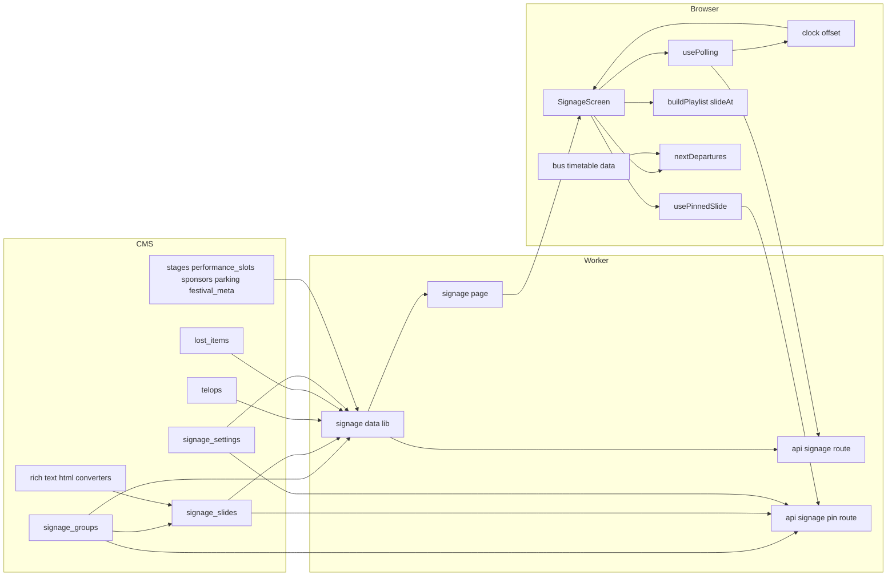
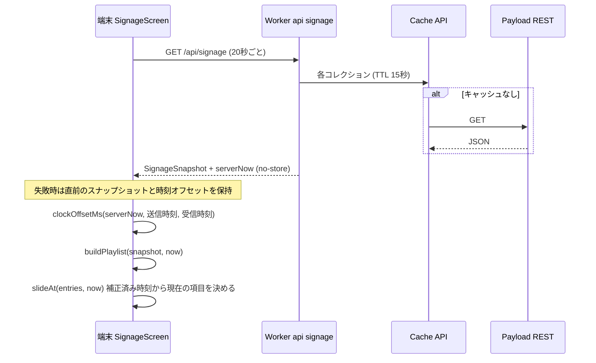
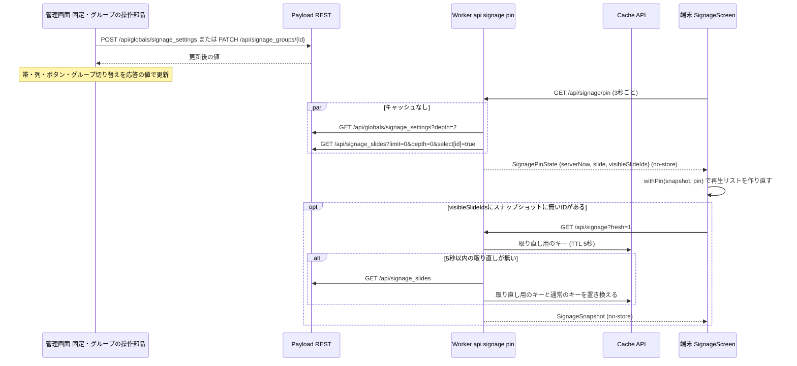
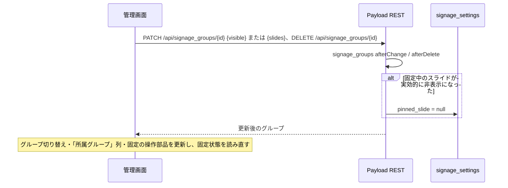
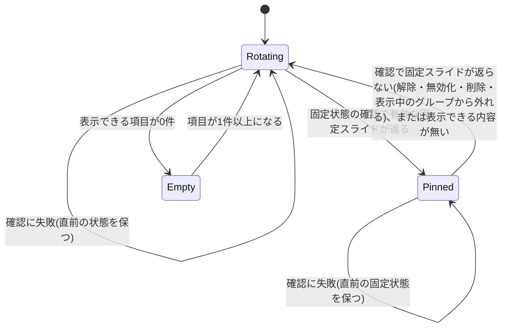
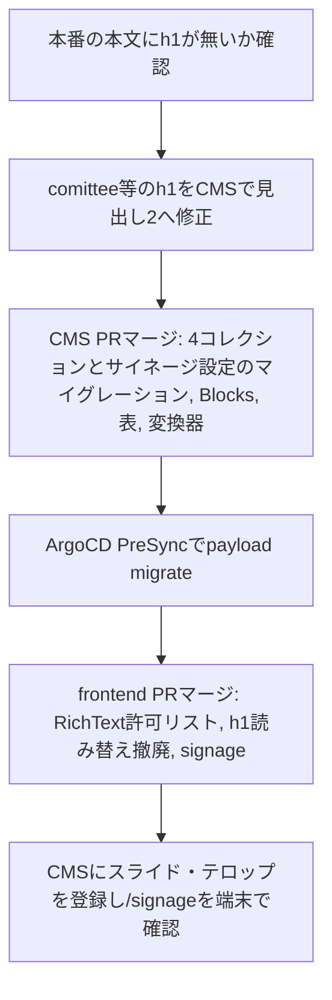

# Design Document: digital-signage

## Overview

**Purpose**: 会場のディスプレイに、祭の基本情報・いまのステージ・スライド・テロップ・バス発車案内を1920×1080(横型)または1080×1920(縦型)のキャンバスで常時表示する。向きはビューポートの縦横から自動で決まり、キャンバスは任意の縦横比のビューポートに収まるよう縮小して中央に置く。スライドとテロップは補正済みの時刻から決定的に求め、全端末が同時刻に同じものを表示する。端末設定は持たない。あわせて、公式サイトとサイネージで共通に使う本文部品(横並び・注意枠・ボタン型リンク・表)を本文エディタへ追加する。

**Users**: 来場者は会場で画面を見る。実行委員はCMS管理画面でスライド・テロップ・落とし物を登録し、スライドをグループ(「開場前」など)にまとめて(1枚を複数のグループに入れられる)グループ単位で表示・非表示を切り替え、閉祭後・緊急時にスライドの一覧または編集画面で1枚を固定表示する。公式サイトの閲覧者はお知らせ・トピック・固定ページで新しい本文部品を見る。

**Impact**: 新ページ`/signage`、集約APIの`/api/signage`、固定状態APIの`/api/signage/pin`、CMSコレクション4つ(`signage_slides`/`signage_groups`/`telops`/`lost_items`)とグローバル`signage_settings`を追加する。本文エディタ共通設定と本文描画(`rich-text.tsx`)を拡張し、h1をh2へ読み替える現行挙動を撤廃する。

### Goals
- 操作なしで1画面に左カラム・メイン・テロップ・バス案内を表示し続け、任意の縦横比のビューポートでキャンバス全体を収める(1.1〜1.3)
- ビューポートの縦横に応じて横型・縦型の配置を自動で切り替える。データ取得・巡回・状態は共通で、縦型のメイン領域は横型と同じ16:9の中身を縮小して表示する(1.4、1.5)
- CMS更新を手動再読み込みなしで約35秒以内に反映し、取得失敗時は直前の内容を保つ(12.1〜12.3)
- 同じスナップショットを持つ全端末が、サーバー時刻で補正した時刻から同じスライド・テロップ・流し位置を表示する(4.9、10.9、12.6、12.7)
- 固定表示の選択・解除と、グループの表示の切り替え・所属スライドの変更で表示対象から外れるスライドは、管理画面で保存してから約3秒以内に全端末へ反映する。表示対象に加わるスライドは中身の取り直しを挟むため数秒遅れる(4.10、4.11、4.21)
- スライドをグループ単位で表示・非表示にでき、その操作をスライドの一覧で完結させる(4.13〜4.20)
- 新しい課金サービス・外部問い合わせを増やさない(11.8、12.4)
- 本文部品を全richTextフィールドで共通に使え、既存本文の表示を変えない(15.1、15.13)

### Non-Goals
- サイネージ端末の機材・ブラウザ・キオスク設定、YouTubeライブ配信の設定
- 公式サイトの既存ページ(タイムテーブル・駐車場・マップ等)の表示変更(本文表示を除く)
- バス時刻表のCMS管理・外部APIからの取得
- スライド切り替えのアニメーション演出、進行ドット、万彩の装飾

## Boundary Commitments

### This Spec Owns
- `/signage`の画面構成(横型・縦型)・向きの判定・切り替え・時刻経過による表示更新・ポーリング
- `/api/signage`の応答型`SignageSnapshot`と`/api/signage/pin`の応答型`SignagePinState`(いずれもサイネージ画面だけが使う)
- `signage_slides`の管理画面に置く固定表示の操作部品(一覧上部の帯・一覧の「固定」列・編集画面サイドバーのボタン)とグループの操作部品(一覧上部のグループ切り替え・一覧の「所属グループ」列)
- CMSコレクション`signage_slides`・`signage_groups`・`telops`・`lost_items`とグローバル`signage_settings`の定義・公開判定・マイグレーション
- 端末の時刻補正(`serverNow`によるオフセット)と、時刻からの巡回・テロップの計算
- バス時刻データ(`frontend/src/lib/bus-timetable-data.ts`)と次便計算
- 本文部品3種(Blocks)と表機能の追加、そのHTML変換契約(`rt-*`クラスのHTML)、本文描画の許可リストと見た目
- h1の読み替え撤廃

### Out of Boundary
- 既存コレクション(`stages`/`performance_slots`/`sponsors`/`parking_lots`/`parking_statuses`/`festival_meta`)の定義変更
- 公式サイトのタイムテーブル・駐車場・協賛・マップ画面の見た目
- 開催フェーズ(`BUILD_PHASE`)の切り替え運用
- 本番の既存本文中のh1をCMS上で書き換える作業そのもの(手順はMigration Strategyに記す)

### Allowed Dependencies
- `frontend/src/lib/cms.ts`(CMSクライアント、Cache API)、`use-polling.ts`、`event-day.ts`、`timetable.ts`(`toTimetable`/`isPerformanceActive`/`findActivePerformances`)、`sponsors.ts`、`parking-data.ts`、`cms-asset-url.ts`、`cms-media.ts`、`timetable-stage-colors.ts`
- `cms/src/access/policy.ts`の`PUBLISHED_FILTER`、`collections/index.ts`の`withAccess`
- `@payloadcms/richtext-lexical` 3.88.0の`BlocksFeature`・`EXPERIMENTAL_TableFeature`・非同期HTML変換器
- 依存方向: CMS定義 → 生成型(`cms-types.ts`) → `lib/*`(データ取得・純関数) → `app/api`・`components/signage/*` → `app/(fullscreen)/signage`。上流への逆参照は禁止

### Revalidation Triggers
- `SignageSnapshot`のフィールド削除・型変更(稼働中端末の旧JSが読むため追加のみ許可)
- 本文HTMLの`rt-*`構造の変更(フロントの許可リストとCSSが依存)
- `toTimetable`・`getParkingResponse`・`getSponsors`の戻り値変更
- Payloadの更新(`EXPERIMENTAL_TableFeature`の仕様変更)

## Architecture

### Existing Architecture Analysis
- フロントはOpenNextでCloudflare Workersに載り、CMSのREST公開GETを`cms.ts`がCache APIへTTL付きで保持する
- 更新反映の前例は駐車場空き情報: Route Handler(no-store)+`usePolling`(20秒、失敗時は直前データ保持)
- 本文はCMSが`lexicalHTMLField`でHTML化し(`afterRead`で毎回生成)、フロントが`sanitize-html`の許可リストで描画する。エディタ設定は`buildConfig.editor`の単一設定で全richTextに効く
- 公開判定は`policy.ts`の`PUBLISHED_FILTER`に集約し、access結線は`collections/index.ts`で一括

### Architecture Pattern & Boundary Map



**Architecture Integration**:
- Selected pattern: 集約エンドポイント+クライアントポーリング(駐車場空き情報と同型)。代替案の比較は`research.md`
- Domain/feature boundaries: サーバ側`signage-data.ts`はCMSの値を表示用の型へ正規化するだけ。何を表示するか・次便・いまのステージ・テロップの件と流し位置は、端末側の純関数が補正済みの`now`から決める(時刻経過の表示更新に再取得を要せず、端末ごとの経過時間に依存しない)
- Existing patterns preserved: `cms.ts`経由の取得、`CmsResult`、`usePolling`、`PUBLISHED_FILTER`、`withAccess`、`lexicalHTMLField`+`richTextHTMLConverters`
- New components rationale: スライド・テロップ・落とし物はCMSに対応データが無い。グループは、時間帯などで入れ替える複数のスライドを1回の操作で出し入れするため、表示フラグを持つ独立したコレクションにし、グループ側から所属スライドを複数参照する(スライドの`enabled`を1枚ずつ切り替えずに済み、個々の`enabled`の設定も失わない。1枚のスライドを「開場前」と「開場中」の両方に入れられる)。全スライドが常に属する組み込みのグループ「すべて」を1つ持ち、「グループに属さないスライド」という特別扱いを無くす。固定表示は排他(1枚だけ)のため、スライドごとのチェックではなくグローバルの単一リレーションで持つ。グローバルは保存先としてだけ使い、操作はスライドの管理画面に置いたカスタム部品で行う(固定の操作がスライドと別の場所にあると分かりづらいため)。固定表示とグループの表示状態は即時性が要るため、全データの集約APIとは別に、キャッシュしない軽量APIを短い間隔で確認する。バス時刻は外部問い合わせ禁止のため同梱データ
- Steering compliance: Edge制約(Node専用API無し)、`.env`不使用、コレクション変更はマイグレーション経由、`any`不使用

### Technology Stack

| Layer | Choice / Version | Role in Feature | Notes |
|-------|------------------|-----------------|-------|
| Frontend | Next.js 15 App Router / React 19 | `/signage`ページ、`/api/signage` | 既存 |
| Frontend | sanitize-html ^2.17.6 | 本文HTMLの許可リスト | `allowedClasses`を新たに使う |
| Backend | Payload 3.88.0 / @payloadcms/richtext-lexical 3.88.0 | 新コレクション、`BlocksFeature`、`EXPERIMENTAL_TableFeature` | 表はEXPERIMENTAL |
| Data | Postgres 16 | 新4コレクションのテーブル | `pnpm migrate:create` |
| Infrastructure | Cloudflare Workers + Cache API | 集約APIとCMS応答の短期キャッシュ | 追加課金サービスなし |

## File Structure Plan

### Directory Structure
```
cms/src/
├── collections/
│   ├── signage-slides.ts        # スライド(種別・レイアウト・本文・画像・表示秒数・有効・所属グループの読み取り・並び順)と固定表示・グループの操作部品の結線
│   ├── signage-groups.ts        # サイネージ グループ(名前・表示・「すべて」の印・所属スライド)と固定の自動解除。実行委員には管理画面のナビに出す
│   ├── telops.ts                # テロップ(対象区分・対象・文面・有効・並び順)
│   └── lost-items.ts            # 落とし物(写真・品名・拾得場所・拾得時刻・返却済み)
├── globals/
│   └── signage-settings.ts      # サイネージ設定(固定表示するスライド)。管理画面のナビには出さない
├── components/
│   ├── signage-pin.ts           # 固定状態の取得・更新(REST)
│   ├── useSignagePin.ts         # 帯・列・ボタンで共有する固定状態
│   ├── SignagePinBanner.tsx     # スライド一覧の上部の帯
│   ├── SignagePinCell.tsx       # スライド一覧の「固定」列(ラジオボタン)
│   ├── SignagePinButton.tsx     # スライド編集画面のサイドバーのボタン
│   ├── signage-groups.ts        # グループ一覧(所属スライドIDを含む)の取得と表示の更新(REST)
│   ├── useSignageGroups.ts      # グループ切り替え・「所属グループ」列・固定の操作部品で共有するグループの状態
│   ├── SignageGroupSwitches.tsx # スライド一覧の上部のグループ切り替え
│   ├── SignageGroupCell.tsx     # スライド一覧の「所属グループ」列(表示されない印を含む)
│   ├── signage-group-slides.ts  # 所属スライドの左右リストの振り分け・絞り込み(純関数)
│   └── SignageGroupSlidesField.tsx # グループ編集画面の所属スライドの左右リスト
├── lib/
│   └── signage-visibility.ts    # 実効的な表示の判定(表示対象のスライドIDの計算)。固定の自動解除・固定の選択肢・操作部品で共用
├── blocks/
│   └── rich-text-blocks.ts      # 本文Blocks定義(imageRow/callout/buttonLink)
└── migrations/<timestamp>_digital_signage.ts

frontend/src/
├── app/
│   ├── api/signage/route.ts                 # GETで集約スナップショットを返す(no-store)
│   ├── api/signage/pin/route.ts             # GETで固定状態を返す(no-store、CMS取得もキャッシュしない)
│   └── (fullscreen)/signage/page.tsx        # 初期スナップショットを取得しSignageScreenへ渡す
├── lib/
│   ├── signage.ts                # SignageSnapshot等の型と端末側純関数(buildPlaylist/slideAt/paginate*/stageNow/timetableWindow)
│   ├── signage-time.ts           # 時刻補正(clockOffsetMs)と補正済み時刻のフック(useCorrectedNow)
│   ├── signage-pin.ts            # 固定状態と表示対象の型、スナップショットへの適用(withPin)、取り直しの要否(missingSlideIds)と3秒ごとの確認フック(usePinnedSlide)
│   ├── signage-telop.ts          # テロップの時刻表(telopSchedule)と時刻からの件・流し位置(telopAt)
│   ├── signage-viewport.ts       # 向きの判定(orientationOf)とキャンバスの拡縮(fitCanvas/useCanvasLayout)
│   ├── signage-data.ts           # getSignageSnapshot()・getPinState(): CMS取得と正規化(サーバ専用)
│   ├── bus-timetable-data.ts     # 関越交通 前橋渋川線の時刻データ(人手変換)
│   └── bus-departures.ts         # 次便計算・ダイヤ種別判定
└── components/signage/
    ├── signage-screen.tsx        # 'use client'。ポーリング・時刻補正・巡回・向き判定の結線と、向きごとの固定キャンバス(1920×1080 / 1080×1920)の拡縮
    ├── signage-left-column.tsx   # 横型の左カラム
    ├── signage-portrait-header.tsx  # 縦型の上部帯(ロゴ・DAY・日付・時計)
    ├── signage-portrait-info.tsx    # 縦型の情報帯(いまのステージ・公式サイトQR)
    ├── signage-telop.tsx         # 横型・縦型共通。寸法は向き別指定。流し位置は補正済み時刻から毎フレーム求める
    ├── signage-bus-info.tsx      # 横型・縦型共通。縦型は方面ごとに次の2便、横型は1便
    ├── signage-main.tsx          # メイン領域。常に1536×864で描画し、縦型は0.671875倍に縮小して1032×580.5の枠に収める
    ├── signage-heading-chip.tsx  # スライド見出しチップ (アイコン+文字)
    └── slides/                   # 種別ごとに1ファイル: sponsors / lost-items / image (登録画像・構内マップ兼用) / parking / timetable / layout
```

### Modified Files
- `cms/src/collections/index.ts` — 新4コレクションを登録口へ追加。`withAccess`は`admin.hidden`だけを上書きする
- `cms/src/globals/index.ts` — `signage_settings`を登録口へ追加(既存グローバルと同じ結線で、読み取りは公開、更新は実行委員のみ)。`withAccess`は`admin.hidden`を上書きするため、グローバル自身が`admin.hidden: true`を持つときは全員に非表示にする
- `cms/src/access/policy.ts` — `PUBLISHED_FILTER`へ`signage_slides`(有効のみ。グループでの絞り込みは`accessFor`で重ねる)・`telops`(有効のみ)・`lost_items`(返却済み以外)を追加。`signage_groups`は絞らない
- `cms/src/access/payload-access.ts` — `accessFor`の読み取りで、`signage_slides`の公開判定が条件を返したときに`visibleSlideFilter`の条件を`and`で重ねる(「実効的な表示とグループ」)
- `cms/src/lib/rich-text-editor.ts` — `BlocksFeature`(3ブロック)と`EXPERIMENTAL_TableFeature`を共通機能に追加
- `cms/src/lib/rich-text-html-converters.ts` — 3ブロックと表の変換器を追加(画像は既存の`data-media-id`方式を共用)
- `cms/src/app/(payload)/admin/importMap.js` — `pnpm generate:importmap`で再生成。固定表示の操作部品3つとグループの操作部品2つの登録だけを取り込み、ローカル差分のZitadel/S3エントリ消失は戻す
- `cms/src/payload-types.ts`、`frontend/src/cms-types.ts` — `pnpm generate:types`で再生成
- `frontend/src/components/rich-text.tsx` — 許可タグ・class・属性の追加、h1→h2読み替えの削除
- `frontend/src/app/globals.css` — `.rich-text-body`配下に`rt-*`の公式サイト用スタイル、`.rich-text-body--signage`配下にサイネージ用スタイル。サイネージ画面の縦型配置と、縦型でのメイン領域の縮小(`transform: scale(0.671875)`、transform-origin左上)は、キャンバスの`data-orientation="portrait"`で切り替える(メディア条件は使わない)。見出し・本文の折り返しに`word-break: auto-phrase`を指定する
- `frontend/src/app/layout.tsx` — Material Symbolsの`icon_names`へ`handshake`・`local_parking`・`mic`・`directions_bus`・`warning`・`info`を追加
- `frontend/src/lib/cms.ts` — `findGlobal`にTTL指定(`CmsFetchOptions`)を追加(既存呼び出しは不変)。`ttlSeconds: 0`はCache APIを読み書きせずに取得する。`refreshIntervalSeconds`はCache APIの通常のキーを読まずに、取り直し用のキーの保存時刻で取り直しの頻度を制限する(下記`getSignageSnapshot`)
- `frontend/src/lib/use-polling.ts` — 戻り値に、即時に1回取得して次回の予約をそこから数え直す`refresh(fetcher?)`を追加(既存呼び出しは不変)
- `frontend/src/lib/sponsors.ts` — `getSponsors`にTTL指定を受ける省略可能な引数を追加
- `frontend/src/lib/use-slide-rotation.ts` — 削除(巡回は`slideAt`で時刻から求める)
- `frontend/src/lib/phase.ts` — `PRE_EVENT_PUBLIC_PATHS`へ`/signage`・`/api/signage`・`/api/signage/pin`を追加
- `frontend/tailwind.config.ts` — 組み込みの`portrait:`(メディア条件)を、キャンバスの`data-orientation="portrait"`配下を指すバリアントに置き換える
- `docs/cms-operations.md` — スライド・テロップ・落とし物・グループ・固定表示の操作とQR画像の用意の仕方

## System Flows

### 更新反映とスライド巡回



- 反映遅延の上限はTTL 15秒+ポーリング20秒で約35秒(12.3)。`festival_meta`もTTL 15秒で取得する
- 1つでもCMS取得に失敗したら`/api/signage`は502を返し、端末は全体を直前の内容のまま保つ(画面内の整合を優先、12.2)
- 時刻・いまのステージ・タイムテーブルの現在線・バス・DAY表記は再取得を待たず`now`(1秒ごと)から再計算する(3.5、11.4、11.5)
- 端末ごとに取得の時点が最大20秒ずれるため、CMS更新直後の最大20秒程度は端末間で再生リストが食い違いうる(12.7)。全端末が新しいスナップショットを得た後は同じ表示に揃う

### 固定表示と表示対象の即時反映



- 端末は`/api/signage`の20秒ごとの取得とは別に、`/api/signage/pin`を3秒ごとに確認する。CMSへの取得もキャッシュしないため、保存から表示の切り替え(固定・解除と、表示対象から外れるスライド)までは確認間隔の3秒と往復時間で収まる(4.10、4.21)。確認の通信方式の見直しは別specで扱い、本specは3秒ごとの確認のままにする
- 確認の応答は、固定スライドに加えて、いま表示対象のスライドIDの一覧(`visibleSlideIds`)を返す。グループの表示の切り替え・所属スライドの変更・グループの削除・スライドの有効の切り替えは、この一覧の変化として3秒以内に全端末へ伝わる
- 表示対象から外れたスライドは、端末がスナップショットの`slides`を`visibleSlideIds`で絞ってすぐ外す。表示対象に加わったスライドはスナップショットに中身が無いため(「実効的な表示とグループ」)、`visibleSlideIds`にスナップショットに無いIDがあれば、端末はただちに`/api/signage?fresh=1`でスナップショットを取り直す。保存から表示までは確認の3秒に取り直しの時間を加えた数秒になる(4.21)
- 固定状態の確認が一度でも成功した後は、スナップショットの`pinnedSlideId`と`slides`の範囲ではなく確認結果の固定と`visibleSlideIds`を使う(スナップショットは最大35秒古いため)。確認が一度も成功していない間はスナップショットの値をそのまま使う
- 固定スライドの中身(レイアウトの本文・画像など)は確認結果のものを使い、それ以外のスライドの中身と、協賛・落とし物・駐車場・タイムテーブルなど自動スライドが描くデータはスナップショットのものを使う
- 確認に失敗したら直前の固定状態と表示対象を保ち、画面にエラーを出さない(4.11)
- 確認の応答の`serverNow`でも時刻オフセットを`clockOffsetMs`で更新する

### 実効的な表示とグループ

スライドが画面に出るかは、スライドの`enabled`と、スライドが属するグループの`visible`から決まる(4.14)。全スライドは組み込みのグループ「すべて」(`is_all = true`の1件)に常に属する。

```
実効的な表示 = slide.enabled = true かつ (「すべて」.visible = true または slide を所属に持つ通常のグループのいずれかの visible = true)
```

- 「すべて」は所属を保存せず、全スライドが属するものとして計算する。新しく作成したスライドも設定なしで属する(4.20)
- 判定は「表示中のグループに1つ以上属する」の和(OR)にする。「開場前」と「開場中」の両方に入れた共通スライドは、片方を非表示にしてももう片方が表示中なら出続ける。積(AND)にすると、共通スライドを残したいときに別のグループへ複製する運用になるため採らない。個別のスライドを隠すときは、グループではなく各スライドの「有効」を外す
- 運用例: 普段は「すべて」を表示にしておく(全スライドが巡回する)。開場前は「すべて」を非表示にして「開場前」だけを表示にする。開場したら「開場前」を非表示に、「すべて」を表示に戻す。「すべて」が表示中の間は、通常のグループを非表示にしてもそのスライドは「すべて」経由で出続ける(グループ切り替えの非表示の行にその旨を出す)
- 巡回の順番はスライドの並び順(`_order`)だけで決まる。グループは表示対象を選ぶだけで、グループ内の所属スライドの並びは巡回順に影響しない
- 判定は1か所の純関数に置く。`cms/src/lib/signage-visibility.ts`の`visibleSlideIds(enabledSlideIds, groups)`だけで計算し、フロントは判定を持たない(CMSの公開判定で絞られたスライドだけを受け取るため)
- 表示対象でないスライドは配らない(4.14)。未認証の読み取りは表示対象のスライドだけを返し、`/api/signage`のスナップショットにも表示対象のスライドだけが入る。通信量を表示中のスライドの分に抑えるため
- 公開判定の結線: `policy.ts`は同期の純関数でDBを読めないため、`PUBLISHED_FILTER.signage_slides`は`enabled = true`のままにする。`accessFor`の読み取りで、`signage_slides`の公開判定が条件(Where)を返したとき(未認証・学生団体)、`signage-visibility.ts`の`visibleSlideFilter(req)`の条件を`and`で重ねる。`visibleSlideFilter`はグループ一覧(`visible`・`is_all`・`slides`)と有効なスライドのIDを`overrideAccess: true`で読み、`visibleSlideIds`の結果を`{ id: { in: ids } }`で返す。表示対象が無いときは一致しない条件(`{ id: { exists: false } }`)を返す(`false`を返すと読み取りが403になるため)。実行委員の読み取りは絞らない
- 固定スライドの展開(`signage_settings`の`depth: 2`)も`signage_slides`の読み取り権限で絞られるため、表示対象に無い固定スライドは未認証ではIDのまま返る
- Workerと端末はグループを知らない。`getSignageSnapshot`は公開判定で絞られたスライドをそのまま`slides`に入れ、`getPinState`は同じく絞られたスライドのIDを`visibleSlideIds`として返す
- 全端末が同じスナップショットと同じ`visibleSlideIds`を持てば、時刻基準の巡回(`slideAt`)で同じスライドを出す。表示対象が変わった直後は、確認の位相差(最大3秒)と取り直しの時間の間、端末間で食い違いうる。全端末が新しい確認結果と取り直したスナップショットを得た後は揃う
- 取り直し: 端末は`missingSlideIds(snapshot, pin)`(`pin.visibleSlideIds`のうち`snapshot.slides`に無いID)が空でなければ、`usePolling`の`refresh`で`/api/signage?fresh=1`を取得する。取り直し中は重ねて要求せず、取り直しは端末ごとに10秒に1回までにする(取り直した後も、別の拠点のキャッシュから古いスナップショットが返った場合などに要求が続かないようにするため)。新規作成・有効化したスライドも同じ経路で巡回に入る



### 時刻の同期

全端末が同時刻に同じスライド・テロップを出すため、表示に使う時刻はすべて補正済みの時刻`now = Date.now() + offsetMs`とする(4.9、10.9、12.6)。

- `/api/signage`の応答と初期スナップショット(SSR)は、サーバーの現在時刻`serverNow`(ISO)を含む
- ポーリング: 要求の送信時刻`sentAt`と受信時刻`receivedAt`(いずれも`Date.now()`)を取り、`offsetMs = Date.parse(serverNow) + (receivedAt − sentAt) / 2 − receivedAt`。取得に成功するたびに更新し、失敗時は直前の値を保つ
- 初期値: マウント時に`offsetMs = Date.parse(initial.serverNow) − Date.now()`(SSRからの配送時間ぶん遅れるため、マウント直後に`/api/signage`を1回取得して往復時間込みの値に更新する。その後は20秒ごと)。初期スナップショットが無いときは`renderedAt`(SSR時のサーバー時刻)を使う
- `useCorrectedNow(offsetMs)`は、補正済み時刻の秒の境目に合わせて1秒ごとに`now`を更新する(端末ごとの更新位相のずれで切り替えが最大1秒ずれるのを防ぐ)
- 時計・スライドの巡回・バス案内・いまのステージ・タイムテーブル・DAY表記はこの`now`を使う。テロップの流し位置だけは`requestAnimationFrame`ごとに`Date.now() + offsetMs`から求める

### スライド巡回の計算

```
cycleMs = Σ entries[i].slide.durationSec × 1000
t = now(ms, UNIXエポック基準) mod cycleMs
先頭から durationSec × 1000 を順に引き、t が収まる項目が現在の項目、残りがその項目内の経過時間
```

- 表示秒数は整数秒のため、切り替えは補正済み時刻の秒の境目で起きる
- 同じスナップショットと同じ補正済み時刻を持つ端末は同じ項目を出す。端末で表示を始めた時刻・画面の大きさ・向きは結果に影響しない(再生リストは向きに依存しない)
- 再生リストが変わると(スナップショット更新・日付や開催状態の変化)、新しいリストで同じ式を計算し直す。現在位置の引き継ぎは行わない

### テロップの計算

```
件 i の枠幅 box_i(向き) = 帯の内寸(横型768 / 縦型984) − 対象チップ幅_i − 20
各件 i の表示秒数 d_i = 文面幅 ≤ box_i(横型): 8秒 / それ以外: ceil((文面幅 + box_i(縦型)) / 速度)
cycle = Σ d_i(秒)
t = now(秒、小数を含む) mod cycle → 件 i と件内の経過 e を決める
流す件の translateX = box_i(端末の向き) − 速度 × e(e が流し切りの時間を超えた残りは文面が枠外に出たまま)
```

- 時刻表は向きに依らない。収まるかは狭い横型の枠で、流す時間は広い縦型の枠で決め、横型と縦型の端末で周期・件・枠の右端からの流れた距離が揃う(横型は流し切った後の残りが空白になる)
- 文面幅・チップ幅はキャンバスの設計座標(拡縮前)で測る(`offsetWidth`はtransformの影響を受けない)。全件を測ってから時刻表を作り、Webフォントの読み込み完了後に測り直す
- 各件の表示秒数を秒単位に切り上げ、端末間の文面幅の計測誤差(フォントの描画差)で周期がずれないようにする
- 流し位置はCSSアニメーションの開始時刻に依存させず、時刻から`translate`を求める

### スライド巡回の状態



- 再生リスト(`buildPlaylist`)はスナップショットか`now`の分が変わるたびに作り直し、現在の項目は常に`slideAt`で時刻から求める
- 固定表示の判定: `withPin(snapshot, pin)`で固定状態と表示対象をスナップショットへ重ね、`slides`を表示対象だけに絞ってから`buildPlaylist`に渡す。`pinnedSlideId`が有効スライド(`slides`)のいずれかを指すときだけ、そのスライド1枚のページで再生リストを作る。指す先が無い(空・無効化・削除)、または指す先に表示できるページが無い(0件の落とし物・協賛など)ときは通常の巡回
- 固定状態と表示対象は3秒ごとに確認し、変化した確認の直後の秒から新しい再生リストで表示する。解除後は時刻基準の巡回に戻るため、全端末が同じ項目から再開する
- 固定表示中も同じ式で時刻から求めるため、時計の同期は保たれ、そのスライドが複数ページ(落とし物・協賛)を持つ場合はページ間で巡回する

## Requirements Traceability

| Requirement | Summary | Components | Interfaces | Flows |
|-------------|---------|------------|------------|-------|
| 1.1, 1.3 | 4領域を1画面、任意の縦横比で縮小・中央寄せ | SignageScreen, `fitCanvas` | `SignageScreenProps` | — |
| 1.4 | 縦型(1080×1920)で同じ情報を縦型配置で表示し、メイン領域は横型と同じ16:9の中身を縮小 | SignageScreen, SignagePortraitHeader, SignagePortraitInfo, SignageMain, SignageTelop, SignageBusInfo | `SignageOrientation`、`CANVAS_SIZE` | — |
| 1.5 | 向きの自動切替、端末設定なし | SignageScreen(`useCanvasLayout`、`orientationOf`)、キャンバスの`data-orientation` | `SignageOrientation`、`CANVAS_SIZE` | — |
| 1.2 | 操作不要で表示継続 | SignageScreen, usePolling | — | 更新反映 |
| 2.1, 2.2, 2.5 | ロゴ・QR、キャッチコピー無し | SignageLeftColumn | — | — |
| 2.3 | DAY表記と日付 | SignageLeftColumn, `eventDayIndex` | `signage.ts` | — |
| 2.4 | 現在時刻 | SignageScreen(`useCorrectedNow` 1秒) | — | — |
| 3.1〜3.5 | いまのステージ | SignageLeftColumn, `stageNow` | `StageNowRow` | — |
| 4.1, 4.2, 4.5 | 順番どおりの巡回 | buildPlaylist, slideAt | `PlaylistEntry` | スライド巡回の計算 |
| 4.3 | スライド種別 | signage_slides, slides/* | `SignageSlide` | — |
| 4.4 | 種別と順番をCMSで設定 | signage_slides(`kind`/`enabled`、`orderable`の`_order`) | — | — |
| 4.6, 4.7 | 固定表示と解除 | signage_settings(`pinned_slide`), getPinState, withPin, buildPlaylist | `SignagePinState`、`SignageSnapshot.pinnedSlideId` | 巡回状態 |
| 4.8, 4.12 | 固定の操作をスライドの一覧・編集画面で行い、1枚だけと分かる | SignagePinBanner, SignagePinCell, SignagePinButton, useSignagePin | Payload REST(`/api/globals/signage_settings`) | 固定表示と表示対象の即時反映 |
| 4.13, 4.16, 4.19 | 多対多のグループ、グループ側で所属を左右2列のリストで登録・解除(題名で絞り込み)、スライド側は所属を読み取り専用、実行委員だけが操作 | signage_groups(`slides`), SignageGroupSlidesField, signage_slides(`groups`のjoin) | Payload REST(`/api/signage_slides`) | — |
| 4.14 | 実効的な表示(表示中のグループに1つ以上属する)で巡回・固定を判定し、表示対象でないスライドは配らない | `visibleSlideIds`・`visibleSlideFilter`(CMS), accessFor, withPin, signage_settings(`filterOptions`) | `SignagePinState.visibleSlideIds` | 実効的な表示とグループ |
| 4.15 | 固定中のスライドが表示対象から外れたら固定を解除 | signage_groupsの`afterChange`・`afterDelete`、signage_slidesの`afterChange` | — | 実効的な表示とグループ |
| 4.17, 4.18 | 一覧上部のグループ切り替え(「すべて」が先頭)、一覧での所属グループと表示されない印 | SignageGroupSwitches, SignageGroupCell, useSignageGroups | Payload REST(`/api/signage_groups`) | 実効的な表示とグループ |
| 4.20 | 全スライドが属する「すべて」、所属の編集・削除の禁止 | signage_groups(`is_all`)、マイグレーション | — | 実効的な表示とグループ |
| 4.21 | グループの切り替え・所属の変更で外れるスライドは約3秒、加わるスライドは取り直しを挟んで数秒で反映 | /api/signage/pin, getPinState, usePinnedSlide, withPin, missingSlideIds, /api/signage?fresh=1 | `SignagePinState.visibleSlideIds` | 固定表示と表示対象の即時反映 |
| 4.10, 4.11 | 保存から約3秒で反映、確認失敗時は直前を保持 | /api/signage/pin, usePinnedSlide | `SignagePinState` | 固定表示と表示対象の即時反映 |
| 4.9 | 全端末で同時刻に同じスライド | slideAt, signage-time | `SignageSnapshot.serverNow` | 時刻の同期、スライド巡回の計算 |
| 5.1〜5.4 | 協賛のプラン別表示 | SponsorsSlide, `paginateSponsors` | `SignageSponsor` | — |
| 6.1〜6.3 | 落とし物一覧と案内 | LostItemsSlide, `paginate` | `SignageLostItem` | — |
| 6.4 | 落とし物の登録・更新・削除 | lost_items | — | — |
| 7.1 | 構内マップ | ImageSlide(`campus_map`) | — | — |
| 8.1, 8.2 | 登録画像を16:9全面 | ImageSlide(`image`), signage_slides | — | — |
| 9.1〜9.5 | 駐車場の空き状況 | ParkingSlide, `getParkingResponse` | `ParkingResponse` | — |
| 9.6 | 0件なら外す | buildPlaylist | — | 巡回状態 |
| 10.1〜10.3 | テロップ登録 | telops | — | — |
| 10.4〜10.8 | テロップ表示・流し | SignageTelop, telopSchedule, telopAt | `SignageTelopItem` | テロップの計算 |
| 10.9 | 全端末で同時刻に同じテロップ・流し位置 | telopAt, signage-time | — | 時刻の同期、テロップの計算 |
| 11.1〜11.6 | バス発車案内 | SignageBusInfo, nextDepartures | `DirectionBoard` | — |
| 11.7 | 曜日に合うダイヤ | `serviceDayOf` | `ServiceDay` | — |
| 11.8 | 自前データ・外部問い合わせ無し | bus-timetable-data | `BusTimetable` | — |
| 12.1〜12.4 | 自動反映・失敗時保持・数十秒・課金無し | /api/signage, usePolling, cms.ts | `SignageSnapshot` | 更新反映 |
| 12.5 | 配信取り込みでも同じ内容 | SignageScreen(固定キャンバス拡縮) | — | — |
| 12.6 | 補正済み時刻で全表示 | clockOffsetMs, useCorrectedNow | `SignageSnapshot.serverNow` | 時刻の同期 |
| 12.7 | 更新途中の食い違いは数十秒以内 | usePolling(20秒)、Cache API(15秒) | — | 更新反映 |
| 13.1〜13.5 | タイムテーブルスライド | TimetableSlide, `timetableWindow` | `TimetableWindow` | — |
| 14.1, 14.2 | レイアウト4種の作成 | signage_slides(`layout`系), LayoutSlide | — | — |
| 14.3 | 枠に本文部品 | signage_slides(`content1`/`content2`), RichText | — | — |
| 14.4 | 最大行数で省略 | LayoutSlide | — | — |
| 14.5 | 注意喚起の配色 | LayoutSlide(`tone`) | — | — |
| 14.6 | 画像を枠内に縦横比維持 | `.rich-text-body--signage` | — | — |
| 15.1 | 全本文で同じ編集機能 | rich-text-editor | — | — |
| 15.2, 15.3 | 横並び | imageRowブロック、変換器、CSS | HTML契約 | — |
| 15.4, 15.5 | 注意枠 | calloutブロック、変換器、CSS | HTML契約 | — |
| 15.6, 15.7 | ボタン型リンク | buttonLinkブロック、変換器、CSS | HTML契約 | — |
| 15.8〜15.10 | 表 | EXPERIMENTAL_TableFeature、表変換器、CSS | HTML契約 | — |
| 15.11〜15.13 | 見出しレベル保持・h1は文字・既存表示不変 | RichText | — | — |
| 16.1〜16.4 | 画面とAPIへの要求を認証済みの端末に限り、外部の要求はWorkerの前で拒否、開催期間中の認証の維持、認証切れ時の表示の継続 | Cloudflare Access(aramakisai-infra) | — | — |

## Components and Interfaces

| Component | Domain/Layer | Intent | Req Coverage | Key Dependencies (P0/P1) | Contracts |
|-----------|--------------|--------|--------------|--------------------------|-----------|
| signage_slides / signage_groups / telops / lost_items / signage_settings | CMS | サイネージ専用データ・グループ・固定表示の登録 | 4.4, 4.6〜4.8, 4.13〜4.16, 4.19, 4.20, 6.4, 8.2, 10.1〜10.3, 14.1, 14.3 | policy.ts (P0) | State |
| richTextBlocks + converters | CMS | 本文部品と表のHTML化 | 15.1〜15.10 | richtext-lexical (P0) | API(HTML契約) |
| getSignageSnapshot | frontend lib(server) | CMSデータの取得・正規化と表示対象の計算 | 4.14, 12.1, 12.2, 9.1〜9.5 | cms.ts (P0), parking-data (P0), timetable (P0), sponsors (P1) | Service |
| /api/signage | frontend route | スナップショット配信 | 12.1〜12.4 | getSignageSnapshot (P0) | API |
| 固定表示の操作部品 | CMS admin | スライドの一覧・編集画面で固定を選ぶ・解除する | 4.8, 4.12 | Payload REST (P0) | State |
| グループの操作部品 | CMS admin | スライドの一覧でグループの表示を切り替え、所属と表示されないスライドを見せる | 4.17, 4.18 | Payload REST (P0) | State |
| /api/signage/pin + usePinnedSlide | frontend route / lib | 固定状態と表示対象の即時配信と3秒ごとの確認 | 4.6, 4.7, 4.10, 4.11, 4.14, 4.21 | getPinState (P0) | API / State |
| signage.tsの純関数 | frontend lib | 再生リスト・時刻からの現在項目・ページ分割・いまのステージ・時間窓 | 1.4, 2.3, 3.2〜3.5, 4.1〜4.9, 5.1〜5.4, 6.1, 9.6, 13.2 | timetable (P0) | Service |
| signage-time / signage-telop / signage-viewport | frontend lib | 時刻補正、テロップの時刻表、向き判定と拡縮 | 1.3, 1.5, 10.7, 10.9, 12.6 | — | Service |
| bus-departures + data | frontend lib | 次便計算 | 11.2〜11.8 | event-day (P1) | Service |
| SignageScreen | UI | 結線・時刻補正・向き判定・拡縮・巡回 | 1.1〜1.5, 2.4, 4.1, 4.9, 4.10, 12.2, 12.5, 12.6 | usePolling (P0), useCorrectedNow (P0), usePinnedSlide (P0) | State |
| SignageLeftColumn / SignagePortraitHeader / SignagePortraitInfo / SignageMain / SignageTelop / SignageBusInfo / slides/* | UI | Figma部品の描画(横型・縦型) | 各要件 | — | — |
| RichText(拡張) | UI | 本文の許可リストと描画 | 14.6, 15.3, 15.5, 15.7, 15.9〜15.13 | sanitize-html (P0) | — |

### CMS

#### signage_slides / signage_groups / telops / lost_items

| Field | Detail |
|-------|--------|
| Intent | サイネージだけが使うデータを実行委員が登録する |
| Requirements | 4.4, 4.6, 4.7, 4.13〜4.16, 4.19, 4.20, 6.4, 7.1, 8.2, 10.1〜10.3, 14.1, 14.3 |

**Responsibilities & Constraints**
- 1ファイル1コレクション、accessは`collections/index.ts`の`withAccess`で結線(実行委員のみCRUD、学生団体には管理画面で非表示)
- 未認証の読み取りは`PUBLISHED_FILTER`で絞る: `signage_slides`は`enabled = true`、`telops`は`enabled = true`、`lost_items`は`returned != true`。`signage_slides`には`accessFor`で表示対象の条件を重ねる(「実効的な表示とグループ」)。`signage_groups`は絞らない
- `signage_groups`は実行委員の管理画面のナビに「サイネージ スライド」と並べて出す。グループの作成はナビから一覧へ入り「新規作成」で行うため、ナビから外すと作成の入口が無くなる。学生団体には`withAccess`の`admin.hidden`で全体を隠す
- 種別に依存する必須項目は`required`ではなくフィールドの`validate`で判定する(全種別に必須化しないため)
- 本文フィールドは他のコレクションと同じ`lexicalHTMLField({ storeInDB: true, converters: richTextHTMLConverters })`で`*_html`を持つ

**Dependencies**
- Outbound: `media` — 画像・写真(P0)
- Inbound: `getSignageSnapshot`・`getPinState` — REST読み取り(P0)

**Contracts**: State [x]

##### State Management
- 並び順: `signage_slides`と`telops`は`orderable: true`とし、管理画面の一覧でドラッグして並べ替える。順序はPayloadが追加する`_order`(文字列の順序キー、管理画面では非表示)に保存され、新規作成は末尾に入る。数値の並び順項目は持たない
- 並び順の取得: RESTの`sort=_order`(昇順)で取得し、返った順のまま使う。フロントで`_order`を比較し直さない(管理画面の一覧と同じDB上の並びにするため)
- 落とし物の返却済みは削除せず`returned`で隠す(問い合わせ対応で履歴を見るため)
- グループとスライドの所属: グループ側の`slides`(`signage_slides`へのhasManyのrelationship)に保存する。スライド側は`groups`(`type: 'join'`、`collection: 'signage_groups'`、`on: 'slides'`)で所属グループを読み取るだけで、所属は保存しない。所属の編集はグループの編集画面の左右2列のリスト(`SignageGroupSlidesField`)で行う(4.16)
- グループは巡回の順番を持たない。巡回順はスライドの`_order`だけで決まり、グループの`slides`の並びは使わない(グループの編集画面の左右のリストはスライドの`_order`順に並べ、並べ替えの操作を持たない)
- 「すべて」: `is_all = true`のグループ1件。所属は保存せず、全スライドが属するものとして計算する(4.20)
  - マイグレーションの`up`で`INSERT`して作る(本番はArgoCDのPreSyncの`payload migrate`で入り、`seed:dev`の有無に左右されない)。`down`ではテーブルごと消える
  - `is_all`はフィールドの`access`で`create`・`update`を常に偽にし、管理画面でも`admin.hidden`にする。APIから付けることも外すこともできないため、マイグレーションで作った1件だけが`is_all`を持つ
  - `slides`はフィールドの`access.update`を`({ doc }) => !doc?.is_all`にし、`admin.condition`で「すべて」の編集画面から隠す。「すべて」に所属を書き込もうとしても保存されない
  - 削除は`payload-access.ts`の`accessFor`の`delete`で、`signage_groups`かつ削除できる利用者のときだけ`canDelete`の結果に代えて条件`{ is_all: { not_equals: true } }`を返して拒む(`read`の`signage_slides`と同じく`accessFor`の中でコレクションを判定する。accessは`withAccess`が一括で上書きするため、コレクション側の`access`には置かない)。Payloadは文書ごとの権限をこの条件で判定するため、「すべて」の編集画面のドキュメント操作のメニューに「削除」が出ず、一覧の一括削除でも「すべて」は消えない。APIの削除も拒まれる。`beforeDelete`のフックは置かない
  - 名前(`name`)と表示(`visible`)は通常のグループと同じく変更できる
- 固定の自動解除(4.15): 固定中のスライドが実効的に非表示になったら`signage_settings.pinned_slide`を空にする。判定は`signage-visibility.ts`の`visibleSlideIds`で、保存後のグループ一覧から計算する
  - スライドの`afterChange`: 保存後の`enabled`が偽で、固定中のスライドなら空にする
  - グループの`afterChange`: `visible`または`slides`が変わったら、固定中のスライドがまだ表示対象かを計算し、外れていれば空にする(「すべて」の`visible`の変更を含む)
  - グループの`afterDelete`: 同じ計算をする(削除で所属が消え、表示中のグループから外れることがあるため)
  - スライド側に所属の項目が無いため、所属の変化はすべてグループのフックで捉える
- グループを削除すると、所属の行(`signage_groups_rels`)は外部キーの`ON DELETE CASCADE`で消える。スライドは残り、「すべて」には属したままになる。所属スライドが残るグループも削除できる。スライドを削除した場合も、グループの所属の行が同じく消える

**Implementation Notes**
- Integration: 未リリースのサイネージ用マイグレーション(`20261008_193135_signage`)を削除し、`pnpm migrate:create signage`で作り直して1本に4コレクション(`signage_slides`・`telops`の`_order`列と索引、`signage_groups_rels`)とグローバル`signage_settings`を入れ、生成後に「すべて」の`INSERT`を`up`へ手で足し、`migrations/index.ts`の登録を差し替える。`pnpm generate:types`を実行する。新コレクション・グローバルの追加のみのため`cms-schema-check.yml`の破壊的変更には当たらない
- Validation: `policy.test.ts`と`access.int.test.ts`へ新コレクションの未認証読み取り(フィルタ)と学生団体の拒否を追加。未認証のスライド読み取りが表示対象だけを返すことは結合テストで確かめる。`visibleSlideIds`は単体テストで、「すべて」表示中・「すべて」非表示で通常のグループに属する/属さない・表示中と非表示の両方に属する・無効の各場合を確かめる。「すべて」の保護(削除の拒否、`is_all`の付け外し不可、所属の書き込み不可、名前と表示は変更可)と固定の自動解除は結合テストで確かめる
- Risks: `is_all`の1件だけという制約はDBの一意制約ではなく、APIから付けられないことで保つ(Payloadは部分一意索引を定義できない)。SQLで直接触る作業では守られない

**Payload 3.88のjoinとhasManyのrelationship(調査結果)**
- ドキュメントドロワーは`@payloadcms/ui`の`useDocumentDrawer`(`exports/client`)で開く。返る`DocumentDrawer`は`initialData`を受け取り(`elements/DocumentDrawer/types.d.ts`)、`DrawerContent.js`が`renderDocument`へ渡す。作成画面では`@payloadcms/next`の`views/Document/index.js`が、IDの無い文書の初期値と`buildFormState`の`data`に`initialData`を使う。フィールドの`defaultValue`は値が未定義のときだけ入るため、`{ enabled: false }`を渡せば「有効」は外れて開く
- ドロワーの`onSave`は`{ doc, operation, result }`を受け取る(`elements/DocumentDrawer/Provider.d.ts`)。標準のrelationshipの`AddNewRelation`は`operation === 'create'`のとき`doc.id`を値に加えるだけで、親の文書は保存しない
- hasManyのrelationshipは、親テーブルに列を持たず`{コレクション}_rels`テーブル(`id`・`order`・`parent_id`・`path`・`{関連先}_id`)に保存される。`parent_id`と`{関連先}_id`の外部キーはいずれも`ON DELETE CASCADE`(`@payloadcms/drizzle`の`schema/build.js`、既存の`announcements_rels`と同じ形)。本件では`signage_groups_rels`(`path = 'slides'`、`signage_slides_id`)になる
- joinの`on`はhasManyのrelationshipを指せる。joinの`hasMany`は相手のrelationshipの値で上書きされ、相手の項目に索引が無ければ自動で付く(`fields/config/sanitizeJoinField.js`)。joinはDB列を持たない
- joinの`where`は読み出し時の条件に`combineQueries`で足される(`database/sanitizeJoinQuery.js`)。「すべて」は所属の行を持たないため、`where`で除かなくてもjoinに現れない
- joinは一覧の列にできる。一覧の列の候補から外れるのは隠し・無効・`disableListColumn`の項目だけで(`@payloadcms/ui`の`buildColumnState/filterFields.js`)、既定のセルはrelationshipと同じ`RelationshipCell`(先頭3件の題名)。一覧は`depth: 0`で取得し、joinの`defaultLimit`(既定10)件まで返る
- joinの`admin`は`readOnly`を受け付けない(型が`never`)。編集画面のjoinは関連の表と「新規作成」を出すため、`admin.allowCreate: false`で新規作成を消して読み取り専用の表示にする
- relationshipの管理画面の標準の入力は`admin.appearance`の`select`(既定。選択済みを並べた複数選択の入力欄と候補のメニュー)と`drawer`(一覧のドロワーから選ぶ)の2つだけで、左右2列のリストは無い(`payload`の`fields/config/types.d.ts`、`@payloadcms/ui`の`fields/Relationship/Input.js`)。所属の左右リストはカスタム部品で作る
- relationshipの部品が扱うフォームの値は、関連先が1つのhasManyではIDの配列(`@payloadcms/ui`の`fields/Relationship/index.js`が選択肢の`value`だけを`setValue`する)。カスタム部品も`useField<number[]>`でIDの配列を読み書きすれば、保存の形は標準の部品と同じになる
- joinを通じた条件(`groups.visible`など)は`getTableColumnFromPath`がhasManyの`_rels`を結合して扱える。本設計は表示対象の計算をWorker・CMSの関数で行うため使わない

#### signage_settings(グローバル)

| Field | Detail |
|-------|--------|
| Intent | 固定表示するスライドを1か所で1枚だけ保持する |
| Requirements | 4.6, 4.7, 4.8, 4.14, 4.15 |

**Responsibilities & Constraints**
- 項目は単一のリレーション`pinned_slide`(`signage_slides`への単一参照、任意)だけ。値が1つしか持てないため、固定表示の排他は構造で保証される
- 保存先としてだけ使い、`admin.hidden: true`で管理画面のナビ・画面には出さない。読み書きは固定表示の操作部品からのRESTで行う
- 選択肢は`filterOptions`で実効的に表示されるスライドに限る。`filterOptions`は非同期の関数とし、`visibleSlideIds`で計算したIDを`{ id: { in: ids } }`で返す。RESTからの更新でもPayloadの検証で、無効なスライドと表示中のグループに1つも属さないスライドは拒否される
- `pinned_slide: null`での更新で参照が空になり、以後の読み取りで`null`が返る(解除の契約。結合テストで固定する)
- 結線は`globals/index.ts`の`withAccess`(読み取りは公開、更新は実行委員のみ)。`policy.ts`の変更は要らない
- 参照先のスライドが削除されると参照は`NULL`になる(外部キー`SET NULL`)。固定中のスライドが実効的に非表示になると(無効化・グループの非表示・グループからの除外・グループの削除)、`signage_slides`の`afterChange`と`signage_groups`の`afterChange`・`afterDelete`で`pinned_slide`を空にする(帯・列の表示と画面の状態を一致させ、再び表示に戻した時に予告なく固定へ戻らないようにするため)

**Contracts**: State [x]

#### 固定表示の操作部品(`signage_slides`の管理画面)

| Field | Detail |
|-------|--------|
| Intent | 固定の選択・解除をスライドの管理画面だけで行い、固定できるのが1枚だけであることを見て分かる形にする |
| Requirements | 4.8, 4.12 |

**Responsibilities & Constraints**
- `signage-pin.ts`・`useSignagePin.ts`: `GET /api/globals/signage_settings?depth=0`で固定中のスライドIDを取り、`POST /api/globals/signage_settings`(`{ pinned_slide: id | null }`、`credentials: 'include'`)で更新する。状態はモジュール内に1つだけ持ち、帯・列・ボタンが購読する。更新が成功したら状態を置き換え、全部品の表示をただちに変える。失敗時は状態を変えず、部品の近くに「更新できませんでした」と出す。保存中は全部品の操作を止める
- 固定中のスライド名は、帯が固定中のIDで`GET /api/signage_slides/{id}?depth=0`を引いて得る(状態の変化時のみ)
- 帯(`SignagePinBanner`、コレクションの`admin.components.beforeListTable`): 固定中は「固定表示中: {スライド名}」と[解除]ボタン、固定なしは「固定表示なし(通常の巡回中)」。固定中は警告色の枠で目立たせる
- 「固定」列(`SignagePinCell`、`type: 'ui'`の項目`pin`の`admin.components.Cell`、列名「固定」): 各行にラジオボタンを出し、固定中の1行だけが選択状態になる。選ぶとその行を固定し、他の行は外れる。実効的に表示されないスライド(無効、または表示中のグループに1つも属さない)の行は選べない(`disabled`。行の`enabled`と`useSignageGroups`のグループの状態から`visibleSlideIds`で判定する)
- サイドバーのボタン(`SignagePinButton`、`type: 'ui'`の項目`pin`の`admin.components.Field`、`admin.position: 'sidebar'`): 固定中のスライドなら「固定表示を解除する」、それ以外は「このスライドを固定表示する」。保存済みでない・保存済みの`enabled`が偽・表示中のグループに1つも属さないスライドでは押せない
- `ui`項目はDBの列を持たないため、マイグレーションは要らない

**Contracts**: State [x]

**Implementation Notes**
- Integration: 部品のパスは既存のカスタム部品と同じく`./components/...`で指定し、`pnpm generate:importmap`で登録する
- Validation: `signage-pin`・`useSignagePin`の取得・更新・失敗時の状態保持を単体テストで、無効化とグループの変更による解除を結合テストで確認する。表示と操作は実ブラウザで確認する
- Risks: 一覧を複数タブで開いている場合、他タブの更新は再読み込みまで反映されない(許容)

#### グループの操作部品(`signage_slides`の管理画面)

| Field | Detail |
|-------|--------|
| Intent | グループの表示の切り替えをスライドの一覧で完結させ、どのスライドが表示されないかを一覧で見て分かる形にする |
| Requirements | 4.16, 4.17, 4.18, 4.20 |

**Responsibilities & Constraints**
- `signage-groups.ts`・`useSignageGroups.ts`: `GET /api/signage_groups?limit=0&depth=0&sort=createdAt`でグループ(`name`・`visible`・`is_all`・`slides`のID)を、`GET /api/signage_slides?limit=1&depth=0`の`totalDocs`で全スライド数を取って持ち、`PATCH /api/signage_groups/{id}`(`{ visible }`、`credentials: 'include'`)で表示を更新する。状態はモジュール内に1つだけ持ち、グループ切り替え・「所属グループ」列・固定の操作部品が購読する(`useSignagePin`と同じ作り)。更新が成功したら状態を置き換え、固定状態を読み直す(グループの`afterChange`が固定を外し得るため)。失敗時は状態を変えず「更新できませんでした」と出す。一覧の画面に入るたびに読み直す
- グループ切り替え(`SignageGroupSwitches`、`admin.components.beforeListTable`に固定表示の帯の次に置く): 「すべて」を先頭に、続けて通常のグループを作成順に、1行ずつ表示/非表示のスイッチ(`role="switch"`のチェックボックス)、グループ名、「{n}枚」、グループの編集画面(`/admin/collections/signage_groups/{id}`)へのリンクを並べる。「すべて」の枚数は全スライド数、通常のグループは`slides`の件数。非表示のグループは名前の横に「非表示中」と出す。「すべて」が表示中の間は、非表示の通常のグループの行に「『すべて』が表示中のため表示されます」を添える(非表示にしたのにスライドが消えない理由が分かるように)
- 「所属グループ」列(`groups`のjoinの`admin.components.Cell`、列名「所属グループ」): 所属する通常のグループ名を並べる(「すべて」は全行に出て邪魔なため出さない)。実効的に表示されないスライドには「表示されません」の印を添える。印の判定は行の`enabled`と`useSignageGroups`の状態から`visibleSlideIds`で行い、無効のスライドにも同じ印を付ける。joinの既定のセル(先頭3件)ではなく自前のセルにするのは、印を添えるためと、グループ切り替えの直後に再読み込みなしで印を変えるため
- スライドの編集画面の`groups`はjoinの標準の表示で、所属グループを読み取り専用で出す(`admin.allowCreate: false`)。所属の編集はグループの編集画面の`slides`の左右2列のリスト(下記)で行う(4.16)。`signage_groups`は`admin.group: false`のためナビには無いが、画面・ドロワーの経路は残る
- 一覧をグループで区切る表示(`admin.groupBy`)は使わない。Payloadのグループ化は単一の値の項目で区切るもので、スライド側に単一のグループ列が無い多対多では成り立たない。所属は「所属グループ」列で、表示状態はグループ切り替えと印で見る

**Contracts**: State [x]

**Implementation Notes**
- Integration: `slides`は`signage_groups_rels`を持つためマイグレーションに含める。`groups`のjoinはDB列を持たない。部品は`./components/...`で指定し、`pnpm generate:importmap`で登録する
- Validation: `signage-groups`・`useSignageGroups`の取得(「すべて」を先頭にした並び、枚数)・更新・失敗時の状態保持・更新後の固定状態の読み直しを単体テストで確認する。表示と操作は実ブラウザで確認する
- Risks: 一覧を複数タブで開いている場合、他タブの更新は再読み込みまで反映されない(許容)

#### 所属スライドの左右リスト(`signage_groups`の編集画面)

| Field | Detail |
|-------|--------|
| Intent | グループの所属スライドを、未登録と登録済みの2列の間で移して登録・解除する |
| Requirements | 4.16, 4.20 |

**Responsibilities & Constraints**
- `SignageGroupSlidesField`: `slides`の`admin.components.Field`に置くクライアント部品。保存値は`slides`(hasManyのrelationship)のままで、`useField<number[]>({ path })`でスライドIDの配列を読み書きする。保存はPayloadの標準の保存ボタンで行う。部品がRESTで書き込むのは、下記の新規作成したスライドの所属だけ
- 選択肢の取得: 画面を開いたときに1回、`GET /api/signage_slides?limit=0&depth=0&sort=_order&select[title]=true&select[enabled]=true`(`credentials: 'include'`)で全スライドの題名と有効を取る。既存のカスタム部品(`useEventDays`・`signage-pin`)と同じくクライアントからのRESTにし、サーバー部品から渡す経路を新たに作らない。スライドは数十枚の規模のため件数の上限と分割の読み込みは持たない
- 並び: 左の列「未登録」は取得したスライドのうち値に無いもの、右の列「登録済み」は値にあるものを、どちらも取得順(`_order`順)に並べる。右の列の並びは巡回順に影響しないため、移したスライドも`_order`の位置に入り、`setValue`も`_order`順の配列にする。列の見出しに件数を出す。無効のスライドは題名の横に「無効」と出す
- 選択: 各行にチェックボックスを付け、各列の見出しに「全選択」のチェックボックスを付ける。「全選択」の対象は、その列でいま絞り込みで見えている行だけ。行のどこを押しても、その行の選択が切り替わる(チェックボックスと題名を1つの`label`で包む)
- 移動: 列の間に「追加 →」(左の列で選んだ行をまとめて右へ移す)と「← 外す」(右の列で選んだ行をまとめて左へ移す)の2つのボタンを置く。行ごとの移動ボタンは持たない。その列で選んだ行が無いとき、ボタンは押せない。移した行の選択は外す。ドラッグは持たない
- 絞り込みで見えなくなった行は、選択中であっても移さない(ボタンが押せるかの判定にも数えない)。絞り込みを変えた後に、見えない行が意図せず動く事故を防ぐため
- 絞り込み: 左右の列それぞれに入力欄を持ち、題名の部分一致(大文字・小文字を区別しない)でその列だけを絞る。追加するスライドと外すスライドを別々に探せるようにするため。絞り込みは表示だけで、隠れた登録済みのスライドは値に残る
- 振り分けと絞り込みは`signage-group-slides.ts`の純関数(全スライド・値・左右それぞれの絞り込みの文字列から左右の列を返す、選択と絞り込みから移す対象を決める、移動後の値を`_order`順で返す)に置く
- 読み込み中は「読み込み中」、取得に失敗したら「スライドを読み込めませんでした」と出して列を出さない。値は変えないため、保存しても所属は消えない
- 保存の権限が無い(`readOnly`)ときはボタンと入力欄を押せなくする
- 見た目は管理画面の他の項目に揃え、素のHTMLの部品を出さない。入力欄・チェックボックス・ボタンは`@payloadcms/ui`の`TextInput`・`CheckboxInput`・`Button`(`buttonStyle="secondary"`、`size="small"`)を使い、色・角丸・余白は管理画面のCSS変数(`--theme-elevation-*`・`--style-radius-s`・`--base`)だけで指定する。項目名「所属スライド」は他の項目と同じラベルの見た目にする
- 配置: 左右の列と列の間のボタンを横に並べる。各列は枠線(`--theme-elevation-150`)と角丸の箱で、上端の見出し帯(地`--theme-elevation-50`)に「全選択」のチェックボックス・列名と件数・「スライドを新規作成」ボタンを並べ、その下にその列の絞り込みの入力欄(列の幅いっぱい)、さらにその下に行を並べる。行は区切り線で分け、行の高さを揃える。行が多いときは箱の中だけを縦にスクロールし(最大高さ400px程度)、ページ全体を伸ばさない。左右の列は同じ幅で、列の間のボタンは縦に並べて上下中央に置く。「グループを保存すると、ここからスライドを作成できます」は列ごとに繰り返さず、左右の列の上に1回だけ出す。列が空のときは箱の中に「スライドはありません」と出す
- 「すべて」では`slides`が`admin.condition`で隠れるため、この部品も出ない(所属の編集不可、4.20)
- 新規作成: 列の上に「スライドを新規作成」ボタンを置き、`@payloadcms/ui`の`useDocumentDrawer({ collectionSlug: 'signage_slides' })`のドロワーでスライドの作成画面を開く。ドロワーには`initialData={{ enabled: false }}`を渡し、「有効」を外した状態で開く。ドロワーの`onSave`が`operation: 'create'`で呼ばれたら、作成したスライド(`doc`の`id`・`title`・`enabled`)を取得済みの一覧の末尾に足し(新規作成は`_order`の末尾に入るため)、値に加えて右の列に出し、ドロワーを閉じる
- 作成直後のスライドは画面に出さない。所属はその場で保存するため、有効のまま作ると、グループが表示中ならグループの保存を待たずに巡回へ入る。中身を確かめてから実行委員が「有効」を付ける。`enabled`の既定値(`defaultValue: true`)は変えないため、スライドの一覧からの通常の新規作成は従来どおり有効で始まる
- 新規作成した所属はその場で保存する(スライドは無効のため、保存しても表示には出ない)。Payloadの標準のrelationshipもドロワーで作成した文書を値に加えるだけで(`AddNewRelation`の`onSave`)、親の保存まで所属は保存されないため、グループの保存を忘れると作ったスライドがどのグループにも付かない。これを防ぐため、部品は`GET /api/signage_groups/{id}?depth=0`で保存済みの`slides`を読み、新しいIDを足して`PATCH /api/signage_groups/{id}`(`{ slides }`、`credentials: 'include'`)で所属だけを保存する。グループの名前・表示やリストでの移動など、他の未保存の変更は保存しない(標準の保存ボタンで保存する)。値にも加えてあるため、後で保存ボタンを押しても所属は保たれる
- 所属の保存に失敗したら「所属を保存できませんでした。グループを保存してください」と出す。スライドは作成済みで値にも加えてあるため、保存ボタンで所属を保存できる
- 未保存の新規グループ(`useDocumentInfo`の`id`が無い)では、新規作成のボタンを押せなくし、「グループを保存すると、ここからスライドを作成できます」と添える。保存先のグループが無いまま作ると、その場で所属を保存できないため
- 新規作成のボタンは`readOnly`のときとスライドの作成権限が無いときは出さない。「すべて」では部品ごと出ないため、この導線も出ない

**Contracts**: State [x]

**Implementation Notes**
- Integration: 部品のパスは`./components/SignageGroupSlidesField.tsx`で指定し、`pnpm generate:importmap`で登録する(`SignagePin*`と同じ)
- Validation: 新規作成した所属の保存(保存済みの`slides`への追加、他の未保存の変更を送らない、失敗時の表示)を単体テストで確認する。`signage-group-slides`の振り分け(未登録・登録済み、`_order`順)・移動後の値の順・絞り込み(左右それぞれの入力欄がその列だけに効く、大文字・小文字、絞り込みで隠れた登録済みが値に残る)・まとめての移動(選んだ複数行を左右それぞれへ移す、「全選択」が見えている行だけを選ぶ、選択中でも絞り込みで隠れた行は移さない、選択が無ければ移せない、移した行の選択が外れる)を単体テストで確認する。表示と操作は実ブラウザで確認する
- Risks: 部品が開いている間に別のタブで作ったスライドは、開き直すまで左の列に出ない(許容)

#### richTextBlocksとHTML変換器

| Field | Detail |
|-------|--------|
| Intent | 本文に横並び・注意枠・ボタン型リンク・表を挿入可能にし、決まった構造のHTMLへ変換する |
| Requirements | 15.1〜15.10 |

**Responsibilities & Constraints**
- `richTextEditorFeatures`へ`BlocksFeature({ blocks: [imageRow, callout, buttonLink] })`と`EXPERIMENTAL_TableFeature()`を追加する。`buildConfig.editor`の単一設定のため、お知らせ・トピック・固定ページ・`festival_meta`・`page_home`・サイネージの全richTextに効く(15.1)
- 見出しは現行どおりh2〜h4のみ。h1をエディタで新規作成する経路は無い
- 変換器は全ブロックを必ず持つ(未定義ブロックは`<span>unknown node</span>`になるため)
- 画像は既存`uploadConverter`と同じく実URLを焼き込まず`data-media-id`だけを出す。未展開のIDは変換器引数の`populate`で取得し、画像以外・ID不明は出力しない
- 利用者入力(ラベル・本文・URL)は既存`escapeAttr`相当で必ずエスケープする

**ブロック定義**

| slug | 管理画面名 | フィールド | 検証 |
|------|-----------|-----------|------|
| `imageRow` | 横並び | `items`(array、1〜3件): `image`(upload media、必須)、`label`(text、30字まで) | 画像必須 |
| `callout` | 注意枠 | `kind`(select、必須、`caution`注意/`note`補足、既定`caution`)、`text`(textarea、必須、500字まで) | — |
| `buttonLink` | ボタン型リンク | `label`(text、必須、30字まで)、`url`(text、必須、500字まで) | `https://`・`http://`・`/`始まりのみ |

**Contracts**: API [x]

##### HTML契約(CMS → frontend)
CMSが`*_html`に出すHTMLの形を固定する。frontendの許可リストとCSSはこの形だけを前提にする。

| 部品 | HTML |
|------|------|
| 横並び | `<div class="rt-image-row" data-count="{1-3}"><figure><figcaption>{label}</figcaption></figure>…</div>`(ラベル空なら`figcaption`を出さない) |
| 注意枠 | `<aside class="rt-callout" data-kind="{caution\|note}"><p>{text、改行は<br>}</p></aside>` |
| ボタン型リンク | `<p class="rt-button"><a href="{url}">{label}</a></p>` |
| 表 | `<div class="rt-table"><table><tbody><tr><th>…</th><td>…</td></tr></tbody></table></div>`(見出しセルは`headerState > 0`で`th`、`colspan`/`rowspan`は2以上のときだけ出す、インラインstyleは出さない) |

**Implementation Notes**
- Integration: 変換器の変更は`afterRead`で既存ドキュメントにも効く。データ移行不要。`pnpm generate:importmap`で`BlocksFeatureClient`/`TableFeatureClient`を登録
- Validation: `rich-text-html-converters.test.ts`へ部品ごとのHTML、エスケープ、画像以外の除外、未展開IDの`populate`を追加
- Risks: `EXPERIMENTAL_TableFeature`はPayloadの安定版内でも破壊的変更があり得る。表の変換テストで検出する

### frontend lib

#### getSignageSnapshot(`signage-data.ts`)と`/api/signage`

| Field | Detail |
|-------|--------|
| Intent | サイネージ表示に要るCMSデータを1回で集め、表示用の型へ正規化する |
| Requirements | 4.14, 9.1〜9.5, 12.1〜12.4 |

**Responsibilities & Constraints**
- 取得はすべて`cms.ts`経由、TTLは`SIGNAGE_TTL_SECONDS = 15`。駐車場は既存`getParkingResponse()`をそのまま使う(当日判定・未設定除外を含む)
- 協賛は`getSponsors({ ttlSeconds })`+`mergeSponsorLogos`、タイムテーブルは`toTimetable`を再利用する
- `limit: 0`で全件取得(Payload既定の10件で切れるため)
- スライドとテロップは`sort: '_order'`を指定して取得する
- スライドは公開判定のとおり表示対象のもの(有効かつ表示中のグループに1つ以上属する)を全件取得して正規化する。表示対象でないスライドは含まない
- `getSignageSnapshot({ fresh })`: `fresh`が真のときは、スライドだけを`{ ttlSeconds: SIGNAGE_TTL_SECONDS, refreshIntervalSeconds: SIGNAGE_REFRESH_INTERVAL_SECONDS }`(5秒)で取得する。`/api/signage`自体は`force-dynamic`・`no-store`で、キャッシュはWorkerがCMSへの取得を`cms.ts`の`cachedFetch`でCache API(`caches.default`、キーはURL、TTL 15秒)に置くものだけ。取り直しはこの通常のキーを読まない
- 取り直しの頻度の制限: Workerのisolateのメモリは要求の間で共有されないため、制限はCache APIで行う。取り直し用のキー(URLに`__refresh=5`を足したもの)を`s-maxage=5`で置き、その有無を「直前の取り直しから5秒以内か」の印にする。キーがあれば、CMSへ行かずにそのキーの応答(直前に取り直したデータ)を返す。無ければCMSから取得し、取り直し用のキーと通常のキー(15秒)の両方を置き換える。通常のキーも置き換えるため、他の端末の通常の取得もそれ以降は新しい内容を受け取る。他のコレクションは通常どおりキャッシュを使う
- 制限が効く範囲: Cache APIはCloudflareのデータセンター(コロ)ごとに別で、全世界で1つではない。制限は同じコロに届いた取り直しの間でだけ効き、端末が別々のコロへつながれば、それぞれのコロで5秒に1回までCMSへ行く。保存は`waitUntil`の非同期のため、ほぼ同時に届いた取り直しは両方CMSへ行きうる。Cache APIは`*.workers.dev`では効かないため、PRのプレビューでは制限されない(本番は`aramakisai.com`)
- `/api/signage`はクエリ`fresh=1`のときだけ`getSignageSnapshot({ fresh: true })`を呼ぶ
- Risks: `fresh=1`の要求でCMSへ行くのは、コロごとにおおむね5秒に1回まで(上記の範囲)。外部からの要求はCloudflare AccessがWorkerの前で拒否するため(「Security Considerations」)、`fresh=1`でWorkerが動きCMSへ行くのは認証済みの端末の要求だけ
- サイネージ設定は`findGlobal('signage_settings', { depth: 0 })`で取得し、`pinned_slide`のIDだけを`pinnedSlideId`として渡す(固定対象が有効かどうかの判定は端末側で`slides`と突き合わせる)
- いずれかの取得が失敗したら全体を失敗にする
- 取得が揃った時点のサーバー時刻を`serverNow`に入れて返す(スナップショット全体はキャッシュしないため、応答の直前の時刻になる)

**Dependencies**
- Outbound: `cms.ts`(P0)、`parking-data.ts`(P0)、`timetable.ts`(P0)、`sponsors.ts`(P1)、`cms-media.ts`(P1)

**Contracts**: Service [x] / API [x]

##### Service Interface
```typescript
import type { CmsResult } from '@/lib/cms';

export function getSignageSnapshot(options?: { readonly fresh?: boolean }): Promise<CmsResult<SignageSnapshot>>;
```
- Postconditions: `serverNow`は返す直前のサーバー時刻。`pinnedSlideId`はサイネージ設定の値(未設定ならnull、有効かどうかは問わない)。`slides`は表示対象のものを`_order`昇順で含む。`lostItems`は返却済みを含まず拾得時刻の新しい順。`telops`は有効なものを`_order`昇順

##### API Contract
| Method | Endpoint | Request | Response | Errors |
|--------|----------|---------|----------|--------|
| GET | /api/signage | `fresh=1`(任意。スライドを取り直す。コロごとに5秒に1回まで、間隔内は直前に取り直したデータ) | `SignageSnapshot`(`serverNow`を含む、`Cache-Control: no-store`) | 502 `{ error: 'cms_unavailable' }` |

#### getPinState(`signage-data.ts`)と`/api/signage/pin`、`signage-pin.ts`

| Field | Detail |
|-------|--------|
| Intent | 固定状態と表示対象のスライドIDだけをキャッシュせずに配信し、端末が3秒ごとに確認して即時に切り替える |
| Requirements | 4.6, 4.7, 4.10, 4.11, 4.14, 4.21 |

**Responsibilities & Constraints**
- `getPinState`は、サイネージ設定(`findGlobal('signage_settings', { depth: 2 }, { ttlSeconds: 0 })`)と表示対象のスライドのID(`limit: 0`・`depth: 0`・`select[id]=true`。公開判定で表示対象だけが返る)の2つを、いずれもキャッシュなしで並行して取得する。いずれかが失敗したら全体を失敗にする
- `visibleSlideIds`は取得したスライドのIDを`_order`順のまま返す
- `pinned_slide`がオブジェクトで、そのIDが`visibleSlideIds`に含まれるときだけ、`getSignageSnapshot`と同じ正規化でスライドへ変換して`slide`に返す。未設定・IDのまま(未認証で読めない、表示対象に無いスライド)・`visibleSlideIds`に無いものは`slide: null`
- `depth: 2`は固定スライド→画像(`media`)までを展開するため。本文HTMLは読み出し時に生成され、画像は`data-media-id`方式のまま
- `/api/signage/pin`は`Cache-Control: no-store`。取得に失敗したら502`{ error: 'cms_unavailable' }`
- `usePinnedSlide`は`usePolling`を3秒間隔で使い、失敗時は直前の値を保つ。確認が一度も成功していない間は`undefined`
- `withPin(snapshot, pin)`は、`pin`があれば`slides`を`pin.visibleSlideIds`に含まれるものだけに絞り(並びは`slides`の`_order`順のまま)、`pinnedSlideId`を`pin.slide?.id ?? null`に置き換え、`pin.slide`があれば`slides`の同じIDの項目をそれで置き換える(無ければ末尾に加える)。`undefined`ならスナップショットをそのまま返す。再生リストの計算(`buildPlaylist`)は変えない
- `missingSlideIds(snapshot, pin)`は、`pin.visibleSlideIds`のうち`snapshot.slides`に無いIDを返す(`pin`が`undefined`なら空)。`SignageScreen`はこれが空でないとき取り直す(「固定表示と表示対象の即時反映」)
- 全端末が同じスナップショットと同じ`visibleSlideIds`から同じ再生リストを作るため、表示対象の変化後も時刻基準の巡回で同じスライドを出す

**Contracts**: Service [x] / API [x] / State [x]

```typescript
export interface SignagePinState {
  /** 応答を返す直前のサーバー時刻(ISO) */
  readonly serverNow: string;
  /** 有効な固定スライド。固定なし・無効・削除済み・表示対象に無いならnull */
  readonly slide: SignageSlide | null;
  /** いま表示対象のスライドID(有効かつ表示中のグループに1つ以上属する) */
  readonly visibleSlideIds: readonly number[];
}

export function getPinState(): Promise<CmsResult<SignagePinState>>;
export function withPin(snapshot: SignageSnapshot, pin: SignagePinState | undefined): SignageSnapshot;
export function missingSlideIds(snapshot: SignageSnapshot, pin: SignagePinState | undefined): readonly number[];
/** 3秒ごとに/api/signage/pinを確認する。成功のたびにonSampleへ送信・受信時刻を渡し、時刻オフセットを更新させる */
export function usePinnedSlide(onSample: (serverNow: string, sentAtMs: number, receivedAtMs: number) => void): SignagePinState | undefined;
```

| Method | Endpoint | Request | Response | Errors |
|--------|----------|---------|----------|--------|
| GET | /api/signage/pin | なし | `SignagePinState`(`Cache-Control: no-store`) | 502 `{ error: 'cms_unavailable' }` |

#### signage.ts(型と端末側の純関数)

| Field | Detail |
|-------|--------|
| Intent | スナップショットと`now`から、表示する内容を決める |
| Requirements | 2.3, 3.1〜3.5, 4.1〜4.9, 5.1〜5.4, 6.1, 9.6, 13.1〜13.3 |

**Contracts**: Service [x]

```typescript
import type { Attachment, EventDay } from '@/lib/home-page-types';
import type { ParkingResponse } from '@/lib/parking';
import type { Timetable, TimetablePerformance, TimetableStage } from '@/lib/timetable';

/** 画面の向き。キャンバス寸法・外周の配置・バス案内の便数だけを分け、メイン領域の中身・データ・巡回・状態は共通 */
export type SignageOrientation = 'landscape' | 'portrait';

/** 横型1920×1080、縦型1080×1920。向きで変わるのはキャンバス寸法だけで、ページ分割・時間窓の定数は向きに依らない */
export const CANVAS_SIZE: Readonly<Record<SignageOrientation, { readonly width: number; readonly height: number }>>;

export type SlideLayout = 'title' | 'title-content' | 'section' | 'two-content';
export type SlideTone = 'normal' | 'alert';

interface SlideBase {
  readonly id: number;
  readonly durationSec: number;
}
export type SignageSlide =
  | (SlideBase & { readonly kind: 'sponsors' | 'lost_items' | 'parking' | 'timetable' })
  | (SlideBase & { readonly kind: 'image' | 'campus_map'; readonly image: Attachment | null })
  | (SlideBase & {
      readonly kind: 'layout';
      readonly layout: SlideLayout;
      readonly tone: SlideTone;
      readonly title: string;
      readonly subtext: string | null;
      readonly content1Html: string;
      readonly content2Html: string;
    });

export interface SignageTelopItem {
  readonly id: number;
  readonly audience: 'visitor' | 'group';
  /** audienceがgroupのときの対象表記。例: "出店団体へ" */
  readonly target: string | null;
  readonly body: string;
}

export type SponsorTier = 'planA' | 'planB' | 'planC' | 'planD';
export interface SignageSponsor {
  readonly id: number;
  readonly name: string;
  readonly logoId: string | null;
  readonly tier: SponsorTier | null;
}

export interface SignageLostItem {
  readonly id: number;
  readonly name: string;
  readonly foundPlace: string;
  readonly foundAt: string;
  readonly photoId: string | null;
}

export interface SignageSnapshot {
  readonly fetchedAt: string;
  /** 応答を返す直前のサーバー時刻(ISO)。端末の時刻補正に使う */
  readonly serverNow: string;
  /** サイネージ設定の固定表示スライドID。表示対象に無ければ通常の巡回 */
  readonly pinnedSlideId: number | null;
  readonly eventDays: readonly EventDay[];
  /** 表示対象のスライド(有効かつ表示中のグループに1つ以上属する)。_order順 */
  readonly slides: readonly SignageSlide[];
  readonly telops: readonly SignageTelopItem[];
  readonly timetable: Timetable;
  readonly sponsors: readonly SignageSponsor[];
  readonly lostItems: readonly SignageLostItem[];
  readonly parking: ParkingResponse;
}

export interface PlaylistEntry {
  /** `${slideId}:${page}`。描画のkey */
  readonly key: string;
  readonly slide: SignageSlide;
  readonly page: number;
}

/** pinnedSlideIdが有効スライドを指せばその1枚のページだけ、無ければ有効スライドを順に。空の自動スライドは除く */
export function buildPlaylist(snapshot: SignageSnapshot, now: Date): readonly PlaylistEntry[];

/** 表示秒数の合計を周期として、nowMs mod 周期から現在の項目と項目内の経過を返す。空ならnull */
export function slideAt(
  entries: readonly PlaylistEntry[],
  nowMs: number,
): { readonly entry: PlaylistEntry; readonly elapsedMs: number } | null;

/** 1ページ8件(4列×2行) */
export function paginateLostItems(items: readonly SignageLostItem[]): readonly (readonly SignageLostItem[])[];

export type SponsorRow =
  | { readonly kind: 'logo'; readonly tier: 'planA' | 'planB' | 'planC'; readonly items: readonly SignageSponsor[] }
  | { readonly kind: 'names'; readonly items: readonly SignageSponsor[] };
/** プランA〜Cかつロゴありはプラン別のロゴ行、それ以外(プランD・未設定・ロゴなし)は社名行。行高の合計が704pxを超える位置でページを分ける */
export function paginateSponsors(sponsors: readonly SignageSponsor[]): readonly (readonly SponsorRow[])[];

export interface StageNowRow {
  readonly stage: TimetableStage;
  readonly colorIndex: number;
  /** 出演中の公演。無ければnull (「公演なし」) */
  readonly performance: TimetablePerformance | null;
}
export function stageNow(timetable: Timetable, now: Date): readonly StageNowRow[];

/** 開催日なら1始まりの日数、開催日以外はnull */
export function eventDayIndex(eventDays: readonly EventDay[], now: Date): number | null;

export interface TimetableWindow {
  /** JSTの分(0〜1439) */
  readonly startMinute: number;
  readonly endMinute: number;
}
/** 幅は4時間(240分)。開始 = floor30(now − 幅/2) を当日の公演範囲 (時単位に丸め) 内へ寄せる */
export function timetableWindow(dayPerformances: readonly TimetablePerformance[], now: Date): TimetableWindow;
```
- Preconditions: `now`は補正済みの時刻(「時刻の同期」)。JST変換は`event-day.ts`の`toJstParts`を使う(端末のタイムゾーンに依存しない)
- 空の自動スライドの判定(`buildPlaylist`): 協賛0件、落とし物0件、`parking.lots`のうち`status`が非nullの件数0(当日以外は全件null)、当日の公演0件、`image`/`campus_map`で画像未登録
- `stageNow`は全ステージを`toTimetable`の順で返し、出演中の判定は`isPerformanceActive`(開始≦now<終了)。同一ステージに重なる出演中枠があれば開始の遅い方(後から始まった公演)を出す

#### signage-time.ts / signage-telop.ts / signage-viewport.ts

| Field | Detail |
|-------|--------|
| Intent | 時刻補正、テロップの時刻からの決定、向きと拡縮の算出 |
| Requirements | 1.3, 1.5, 10.7, 10.9, 12.6 |

**Contracts**: Service [x]

```typescript
// signage-time.ts
/** serverNow + 往復時間の半分 − 受信時刻 */
export function clockOffsetMs(serverNowIso: string, sentAtMs: number, receivedAtMs: number): number;
/** 補正済み時刻。補正済みの秒の境目に合わせて1秒ごとに更新する */
export function useCorrectedNow(offsetMs: number): Date;

// signage-telop.ts
export const TELOP_FIT_SEC = 8;
/** 調整用。流す文面の速さ */
export const TELOP_SPEED_PX_PER_SEC = 150;
export interface TelopSlot {
  readonly scroll: boolean;
  /** 秒単位に切り上げた表示秒数 */
  readonly durationSec: number;
}
/** 各件の文面幅と枠幅(設計座標)から表示秒数を決める */
export function telopSchedule(textWidths: readonly number[], boxWidth: number): readonly TelopSlot[];
/** 周期 = 表示秒数の合計。nowMs mod 周期から現在の件とtranslateX(流さない件は0)を返す。空ならnull */
export function telopAt(
  schedule: readonly TelopSlot[],
  boxWidth: number,
  nowMs: number,
): { readonly index: number; readonly translateX: number } | null;

// signage-viewport.ts
/** 高さ > 幅なら縦型、それ以外は横型 */
export function orientationOf(viewport: { width: number; height: number }): SignageOrientation;
/** min(幅比, 高さ比)で縮小し、余白を左右・上下に等分する */
export function fitCanvas(
  viewport: { width: number; height: number },
  canvas: { width: number; height: number },
): { readonly scale: number; readonly left: number; readonly top: number };
/** innerWidth/innerHeightを1か所で測り、向き・倍率・位置を同時に返す。測るまではnull */
export function useCanvasLayout(): { readonly orientation: SignageOrientation; readonly fit: ReturnType<typeof fitCanvas> } | null;
```

#### bus-departures.ts / bus-timetable-data.ts

| Field | Detail |
|-------|--------|
| Intent | 同梱の時刻データと`now`から、方面ごとの次便を求める |
| Requirements | 11.2〜11.8 |

**Contracts**: Service [x]

```typescript
export type BusStop = 'gunma_univ_aramaki' | 'driving_school';
export type BusDirection = 'maebashi' | 'shibukawa';
export type ServiceDay = 'weekday' | 'holiday';

export interface BusTrip {
  /** 系統番号。例: "22B" */
  readonly route: string;
  /** 行先の表示名。例: "前橋駅" */
  readonly destination: string;
  readonly direction: BusDirection;
  /** 停車するサイネージ対象停留所と発車時刻 "HH:MM" (JST)。通過・非経由の停留所は含めない */
  readonly departures: readonly { readonly stop: BusStop; readonly time: string }[];
}

export interface BusTimetable {
  /** 例: "2024-06-01改正 土日祝" */
  readonly revision: string;
  readonly holiday: readonly BusTrip[];
  readonly weekday?: readonly BusTrip[];
}

export interface NextDeparture {
  readonly route: string;
  readonly destination: string;
  readonly stopName: string;
  readonly departAt: string;
  /** 切り上げ。最小1 */
  readonly minutesLeft: number;
}

export interface DirectionBoard {
  readonly direction: BusDirection;
  /** 発車時刻順の次便。本日の便が残っていなければ空 */
  readonly departures: readonly NextDeparture[];
}

/** 開催日はその曜日、開催日以外は当日の曜日で、土日をholiday、それ以外をweekdayとする */
export function serviceDayOf(now: Date): ServiceDay;

/** 前橋駅方面・渋川駅方面の順に2件返す。各方面の`departures`は最大`perDirection`件(横型1、縦型2) */
export function nextDepartures(timetable: BusTimetable, now: Date, perDirection: number): readonly DirectionBoard[];
```
- 次便は「発車時刻 > now」の停車を早い順に`perDirection`件。1便が両停留所に停まる場合は先に来る停車を表示する(11.6)
- 対象ダイヤのデータが無い(平日)場合は両方面とも`departures`が空
- 開催日2026-11-14(土)・15(日)はいずれも土日。祝日判定は持たない(開催日以外は試験表示のみのため)

**Implementation Notes**
- Integration: `bus-timetable-data.ts`は公式PDF(土日祝・前橋駅方面/渋川駅方面)から人手で一回だけ変換する。変換スクリプトはリポジトリに残さない。行先は便ごとにPDFの終点行で確定する
- Validation: データの不変条件(時刻形式、方面内で`departures`が時刻順)と`nextDepartures`の境界(発車時刻ちょうど、最終便後、両停留所停車便)を単体テストで固定
- Risks: ダイヤ改正時はデータ差し替えとデプロイが要る

### UI

#### SignageScreen

| Field | Detail |
|-------|--------|
| Intent | ポーリング・時刻補正・巡回・向きを結線し、向きごとの固定キャンバスをビューポートへ拡縮して描く |
| Requirements | 1.1〜1.5, 2.4, 4.1, 4.2, 4.9, 12.2, 12.5, 12.6 |

**Contracts**: State [x]

```typescript
export interface SignageScreenProps {
  readonly initial: SignageSnapshot | null;
  readonly renderedAt: string;
}
```

##### State Management
- `usePolling<SignageSnapshot>({ fetcher, intervalMs: 20_000, initial })`。`shouldContinue`は常に真。失敗時は直前の`data`を使い続ける。`fetcher`は送信・受信時刻を測り、成功時に`clockOffsetMs`で時刻オフセットを更新する(「時刻の同期」)
- `useCorrectedNow(offsetMs)`を画面全体で1つだけ持ち、子へ`now`を渡す。テロップには`offsetMs`も渡す
- 固定状態と表示対象: `usePinnedSlide`の結果を`withPin(data, pin)`で重ねる。`missingSlideIds(data, pin)`が空でなければ`/api/signage?fresh=1`で取り直す(取り直し中は重ねず、10秒に1回まで)。確認の応答でも時刻オフセットを更新する(「固定表示と表示対象の即時反映」)
- 巡回: `slideAt(buildPlaylist(withPin(data, pin), now), now.getTime())`で現在の項目を毎回求める。巡回の状態(現在位置・経過時間)は持たない
- 向きと拡縮: `useCanvasLayout()`が`innerWidth`/`innerHeight`を測り、`orientationOf`で向き(高さ>幅なら縦型)を、`fitCanvas`で倍率`min(innerWidth/canvas.width, innerHeight/canvas.height)`と中央寄せの位置を同じ測定から求める。`resize`で再計算する。端末設定・URLパラメータは持たない(1.5)
- 向きはキャンバスの`data-orientation`属性に出し、外周の配置・メイン領域の縮小・テロップ帯の高さはこの属性で切り替える。メディア条件(`orientation`)は使わず、配置・キャンバス寸法(`CANVAS_SIZE`)・倍率・バス案内の便数(横型1、縦型2)が同じ判定に従う(1.3)
- 測る前(SSR・マウント直後)はキャンバスを`visibility: hidden`にし、拡縮前の原寸が見えたりはみ出したりしない。外枠は`position: fixed; inset: 0; overflow: hidden`でスクロールを出さない
- 配信取り込み(OBSのブラウザソース等)も同じページを1920×1080または1080×1920で読むだけで同じ表示になる(12.5)
- 初回が取得失敗(`initial`が`null`)の間は、CMSに依存しない時計・バス案内・ロゴ・QRだけを描く

#### 表示部品(summary-only)

以下の表は横型(1920×1080キャンバス基準)で、メイン領域(1536×864)の各スライドは縦型でも同じ寸法・配置のまま描画する。縦型の外周の配置は後続の「縦型の配置」に示す。地は`background`(#fbf8f3)。値はFigma実測(`research.md`のFigma実測を参照)。

| Component | Figma | Req | 要点 |
|-----------|-------|-----|------|
| SignageLeftColumn | `829:2` | 2.1〜2.5, 3.1〜3.5 | x24 y24 312×1032。上: ロゴ(`/images/logo-2026.webp`、高55.42)、DAYチップ+日付「M/D (曜)」、時計「HH:MM」104px。区切り線の下に`mic`アイコン+「いまのステージ」と`stageNow`の行。ステージ名チップ色は`STAGE_BAND_CLASSES[colorIndex]`、企画名は`-webkit-line-clamp: 2`で省略(3.4)、公演なしは「公演なし」。下端に「▼公式サイト」と`/images/qr-aramakisai.svg`を240角。開催日以外はDAYチップを出さず日付だけ |
| SignageHeadingChip | 各スライドの`見出しチップ` | 4.3 | メイン左上(24,24)。地`text`、文字`background`、32px Bold、px20 py10、角丸8、アイコン(Material Symbols)+文字gap8 |
| SignageTelop | `829:45`(`829:37`/`829:41`) | 10.4〜10.8 | x360 y912 816×144、地`text`、角丸16。対象チップ: 来場者「ご来場のみなさまへ」=primary、団体`target`=warning。文面44px Bold `background`色。テロップは1件ずつ順に表示し、幅に収まらない文面は右から左へ一定速度で流す(速度は調整用定数、初期値150px/秒)。件と流し位置は「テロップの計算」のとおり補正済み時刻から求め、全端末で揃う(10.9) |
| SignageBusInfo | `829:46` | 11.1〜11.6 | x1200 y912 696×144。見出しは`directions_bus`アイコン+「バス発車案内」+「荒牧キャンパスエリア」。方面ごと1行: 系統チップ・行先・発車時刻・「あとN分」・停留所名(右寄せ)。`departures`が空の方面は行先の位置に「本日の運行は終了しました」 |
| SponsorsSlide | `829:54` | 5.1〜5.4 | 見出しは`handshake`+「ご協賛いただいた皆さま」。A=3列440×200、B=4列324×144、C=6列208×96(ロゴ`object-contain`、下に社名24px)、社名行=4列24px。プラン間32 |
| LostItemsSlide | `829:179` | 6.1〜6.3 | 見出しは`search`+「落とし物」。4列×2行、写真336×252(`object-cover`、写真なしは灰地)、品名30px Bold(1行で省略)、「拾得場所｜HH:MM」24px。右下に「本部テントでお預かりしています」(28px Bold) |
| ImageSlide | `829:341`/`829:281` | 7.1, 8.1 | メイン1536×864全面に`object-contain`(16:9以外は白地の余白)。`campus_map`のみ見出しチップ(`map`+「構内マップ」)を重ねる |
| ParkingSlide | `832:4529` | 9.1〜9.5 | 見出しは`local_parking`+「駐車場の空き状況」。2列のカード(732×170)、駐車場名・状態バッジ(文字ラベル「空き/混雑/満車」)・「HH:MM更新」。`status`が`null`の駐車場は出さない。バッジ色は公式サイトの駐車場表示(`parking-row.tsx`)と同じ対応 |
| TimetableSlide | `843:267` | 13.1〜13.5 | 見出しは`calendar_clock`+「タイムテーブル」。時刻列90、ステージ列は均等割、ステージ見出し高56、本体672px=4時間(2.8px/分)、30分目盛、現在時刻線。出演中は公式サイトと同じ`bg-info`+「出演中」表記。リンクの印は出さない |
| LayoutSlide | `884:793`(見本`884:794`/`884:909`/`884:1024`/`884:1155`/`884:1270`) | 14.2, 14.4〜14.6 | 1536×864、p64、`alert`は地warning。title: タイトル96px/1.1(最大2行)+サブ40px/1.3(最大2行)を中央。section: 上282pxから左寄せ、タイトル96px(最大2行)+サブ36px/1.4(最大3行)。title-content: タイトル64px/1.2(1行)+本文枠1408幅。two-content: タイトル(1行)+本文枠680幅×2(gap48)。本文枠は`RichText`に`rich-text-body--signage`と幅区分(`full`/`half`)を付け、はみ出しは枠で切る |

#### 縦型の配置(1080×1920)

キャンバス1080×1920、外周24、要素間24、幅1032、x=24、地は`background`。Figmaページ「デジタルサイネージ」(`828:2`)に作成済み。横型と同じ情報をキャンバスの`data-orientation="portrait"`で並べ替え、データ・巡回・状態は共通とする。

| 領域 | 座標・寸法 | Figma | 要点 |
|------|-----------|-------|------|
| Header | (24,24) 1032×176 | `Signage/Portrait/Header` `915:683` | 左にロゴ、右にDAYチップ+日付と時計104px(開催日以外はDAYチップ無し) |
| メイン | (24,224) 1032×581(16:9、厳密には580.5)、角丸16 | — | 横型メイン領域(1536×864)の中身を同じ配置のまま0.671875倍に縮小して表示。見出しチップを含むスライドは横型と同じ |
| Info | (24,829) 1032×536 | `Signage/Portrait/Info` `915:691` | 左(幅696)に「いまのステージ」3件。各件はステージチップ(幅192)の右に、公演名36px太字(最大2行、行高48、末尾省略)とその下に時刻28px。右(x720、幅312)に「▼公式サイト」32px+QR(288角)。左右とも上下中央 |
| BusInfo | (24,1389) 1032×363 | `Signage/Portrait/BusInfo` `915:720` | 方面ごとに次の2便、計4行。見出し32px、系統チップ28px、行先36px、発車時刻48px、あと28px、発車バス停28px、行高64。横型は方面ごと次の1便 |
| Telop | (24,1776) 1032×120(横型は144) | `Signage/Portrait/Telop` `915:739`(visitor `915:740`/group `915:744`) | 横型と同じ構成。高さのみ異なる |

縦型のメイン領域の各スライド(LayoutSlide・協賛・落とし物・構内マップ・登録画像・駐車場・タイムテーブル)は、横型と同じ中身の縮小で、縦型専用の配置・定数を持たない。Figmaの縦型画面ノード(協賛`915:748`、落とし物`915:1008`、構内マップ`915:1245`、登録画像`915:1440`、駐車場`915:1632`、タイムテーブル`915:1852`)と、レイアウトスライドの縦型見本(`917:8113`/`917:8306`/`917:8499`/`917:8694`/`917:8887`)も横型の縮小である。

**実装**: メイン領域は常に1536×864の要素として描画し、縦型では`data-orientation="portrait"`配下で`transform: scale(0.671875)`(transform-origin左上)を掛けて1032×580.5の枠に入れる。

**折り返し**: 見出し(タイトル・サブテキスト)と本文は、横型・縦型共通で`word-break: auto-phrase`を指定し、文節単位で折り返す。対応しないブラウザでは通常の折り返しになる(表示は崩れないが文節の途中で折れ得る)。

**Implementation Notes**
- Integration: アイコンはMaterial Symbols Sharpのテキスト(SVGアイコンは使わない)。`layout.tsx`の`icon_names`に新アイコンを追加しないと豆腐になる
- Validation: 各部品はFigmaの該当ノードをMCPで実測して寸法を合わせ、ブラウザで1920×1080表示の寸法を確認する
- Risks: ステージが4件以上だと左カラム(縦型はInfo)に収まらない(現行3件)。収まらない分は切れる。縦型ではメインの文字が0.671875倍に縮むため、最小24pxの文字は約16pxで表示される(既知のトレードオフ)

#### RichText(拡張)

| Field | Detail |
|-------|--------|
| Intent | HTML契約の部品を安全に描画し、公式サイトとサイネージで見た目を出し分ける |
| Requirements | 14.6, 15.3, 15.5, 15.7, 15.9〜15.13 |

**Responsibilities & Constraints**
- 許可タグに`div`・`figure`・`figcaption`・`aside`・`table`・`tbody`・`tr`・`th`・`td`を追加。`allowedClasses`は`div: ['rt-image-row', 'rt-table']`、`aside: ['rt-callout']`、`p: ['rt-button']`。属性は`div: ['data-count']`、`aside: ['data-kind']`、`th`/`td: ['colspan', 'rowspan']`
- `transformTags`のh1→h2を削除。h1は許可タグに無いため、タグが捨てられ文字だけ残る(15.12)
- 既存の許可タグ・属性・変換は変えない(15.13)
- `className`で`rich-text-body--signage`を受けたときのスタイルはCSSだけで切り替え、コンポーネントの分岐は増やさない

**公式サイトのスタイル(`.rich-text-body`、Figma `408:555`・`900:681`〜`900:683`・`900:617`)**
- 部品の上余白24
- 横並び: 等幅の横一列、gap24、ラベル16/1.8 Bold中央・画像の上、画像は正方形枠に`object-contain`
- 注意枠: 枠2px(注意warning/補足info)、角丸8、p16、gap12、`::before`でMaterial Symbolsの`warning`/`info`(24px)、本文16/1.8
- ボタン型リンク: primary地、px24 py12、角丸8、16/1.5 Bold、下線なし
- 表: `.rt-table`が`overflow-x: auto`(表だけ横スクロール、15.10)、罫gray-200の1px、`th`はgray-100地、セルpx16 py12、16/1.8。SPで表の最小幅を確保し本文幅を超えたらスクロール

**サイネージのスタイル(`.rich-text-body--signage`、Figma `905:773`〜`905:777`)**
- 本文36px/1.5、部品間gap24
- 横並び: 白枠p12の正方形を左詰め、gap24、ラベル28px/1.2 Bold。全幅枠は360角、半幅枠は1〜2個で320角・3個で210角
- 注意枠: 地`background`、枠4px、p24、gap16、アイコン行高48
- 表: 罫gray-200の2px、`th`はgray-100、`td`は`background`地、p12、28px/1.5
- ボタン型リンク: 表示しない

## Data Models

### Logical Data Model

**signage_slides**(管理画面名「サイネージ スライド」、`useAsTitle: title`、`orderable: true`、既定の列は名前・種別・所属グループ・有効・固定)

| Field | Type | 条件・既定 | 用途 |
|-------|------|-----------|------|
| `title` | text(必須、100字まで) | — | 管理用の名前。`layout`では表示タイトル |
| `kind` | select(必須) | `sponsors`協賛/`lost_items`落とし物/`campus_map`構内マップ/`image`登録画像/`parking`駐車場/`timetable`タイムテーブル/`layout`レイアウト | 種別 |
| `layout` | select | `kind = layout`で表示・必須。`title`/`title-content`/`section`/`two-content` | レイアウト |
| `tone` | select | `layout`で表示、既定`normal`。`normal`通常/`alert`注意喚起 | 配色 |
| `subtext` | textarea(200字まで) | `layout`が`title`/`section`で表示 | サブテキスト |
| `content1` + `content1_html` | richText + lexicalHTMLField | `layout`が`title-content`/`two-content`で表示 | 本文枠1 |
| `content2` + `content2_html` | richText + lexicalHTMLField | `layout`が`two-content`で表示 | 本文枠2 |
| `image` | upload media | `kind`が`image`/`campus_map`で表示・必須 | 画像(推奨1536×864) |
| `duration_seconds` | number(5〜120) | 既定10 | 表示秒数。説明に「QR・表・タイムテーブル・落とし物は15秒を推奨」 |
| `enabled` | checkbox | 既定true | 巡回に含めるか。固定中のスライドを偽で保存すると固定を解除する |
| `groups` | join(`collection: signage_groups`、`on: slides`、`admin.allowCreate: false`) | 一覧の列「所属グループ」(「すべて」は出さず、表示されないスライドに印を付ける)。編集画面では読み取り専用 | 所属グループ(DB列なし)。表示中のグループに1つも属さないスライドは`enabled`に関わらず出ない |
| `pin` | ui | 一覧の列「固定」と編集画面のサイドバー | 固定するスライドを選ぶラジオボタンと、固定表示する/解除するボタン(DB列なし) |

**telops**(「サイネージ テロップ」、`useAsTitle: body`、`orderable: true`)

| Field | Type | 条件・既定 |
|-------|------|-----------|
| `audience` | select(必須) | `visitor`来場者向け/`group`参加団体向け |
| `target` | text(20字まで) | `audience = group`で表示・必須。例「出店団体へ」 |
| `body` | text(必須、200字まで) | 文面 |
| `enabled` | checkbox | 既定true |

**signage_groups**(「サイネージ グループ」、`useAsTitle: name`、`defaultSort: createdAt`、`accessFor`の`delete`の条件で「すべて」の削除を拒む)

| Field | Type | 条件・既定 |
|-------|------|-----------|
| `name` | text(必須、30字まで) | グループ名。例「開場前」。「すべて」も変更できる |
| `visible` | checkbox | 既定true。ラベル「表示」。偽にすると、他の表示中のグループに属さない所属スライドを巡回・固定から外す |
| `slides` | relationship(`signage_slides`、`hasMany`、任意、`admin.components.Field: './components/SignageGroupSlidesField.tsx'`) | 所属スライド。左右2列のリストで登録・解除する。保存先は`signage_groups_rels`。「すべて」では`access.update`が偽で`admin.condition`により隠す |
| `is_all` | checkbox | 既定false。`access.create`・`access.update`は常に偽、`admin.hidden`。マイグレーションで作る「すべて」の1件だけが真 |

**signage_settings**(グローバル「サイネージ設定」)

| Field | Type | 条件・既定 |
|-------|------|-----------|
| `pinned_slide` | relationship(`signage_slides`、単一、任意) | 選択肢は実効的に表示されるスライドのみ。グローバルは`admin.hidden: true`で管理画面に出さず、スライドの管理画面の操作部品から更新する |

**lost_items**(「落とし物」、`useAsTitle: name`、`defaultSort: -found_at`)

| Field | Type | 条件・既定 |
|-------|------|-----------|
| `name` | text(必須、50字まで) | 品名 |
| `found_place` | text(必須、30字まで) | 拾得場所 |
| `found_at` | date(必須、日時) | 拾得時刻 |
| `photo` | upload media | 写真 |
| `returned` | checkbox | 既定false。真でサイネージ・公開APIから外れる |

**Consistency & Integrity**
- `media`への参照、`signage_settings.pinned_slide`は外部キー(削除時は`SET NULL`)。`signage_groups_rels`は`parent_id`(グループ)・`signage_slides_id`(スライド)とも外部キー(削除時は`CASCADE`)で、グループかスライドのどちらを消しても所属の行だけが消える。それ以外のサイネージのコレクションは互いに独立
- 「すべて」はマイグレーションの`up`で`INSERT INTO "signage_groups" ("name", "visible", "is_all") VALUES ('すべて', true, true)`として作る
- 本文の`*_html`は読み出し時に生成されるため、変換器の更新で過去データも新しいHTMLになる

### Data Contracts & Integration
- `/api/signage`の`SignageSnapshot`は追加のみで変更する(稼働中端末の旧JSが読むため)
- 画像は`Attachment`/メディアIDで渡し、URLは端末側で`toAssetUrl`により組み立てる(既存方針)

## Error Handling

### Error Strategy
- 取得失敗: `/api/signage`は502。端末は直前のスナップショットで表示を続け、20秒後に再試行(12.2)。画面上にエラー表示は出さない(来場者向け画面のため)
- 固定状態の確認失敗: `/api/signage/pin`は502。端末は直前の固定状態を保ち、3秒後に再確認する(4.11)
- 管理画面の固定の更新失敗: 状態を変えず、操作した部品の近くに「保存できませんでした」と出す
- 初回取得失敗: CMSに依存しない領域(時計・バス・ロゴ・QR)だけを表示し、次のポーリングで回復する
- 不正データ: 開催日・時刻が解釈できない出演枠は`toTimetable`の既存規則で除外。画像の無い画像スライドは巡回から外す
- 本文: 変換器未定義のブロックは出さない(全ブロックに変換器を用意)。メディアIDを読めない画像は既存規則でタグごと落とす

### Monitoring
- 既存のエラー監視方針に従う。`/api/signage`の502は駐車場APIと同じくログに残る範囲で扱い、専用の監視は追加しない

## Testing Strategy

- **Unit (frontend)**: `buildPlaylist`(`pinnedSlideId`が有効スライドを指す/無効・削除済み・nullで通常巡回、空スライド除外・ページ展開・順序)、`slideAt`(周期の境目、同じ時刻なら同じ項目、項目内の経過、1件・0件)、`paginateSponsors`/`paginateLostItems`、`stageNow`(境界: 開始ちょうど・終了ちょうど・重なり)、`timetableWindow`(朝・夕方の寄せ)、`nextDepartures`(発車時刻ちょうど・最終便後・両停留所停車便・平日データ無し)、`eventDayIndex`
- **Unit (frontend RichText)**: `rt-*`の各部品が残る、許可外class・属性が落ちる、h1が文字だけになる、既存本文サンプル(h2〜h4・リスト・リンク・画像)の出力が変わらない
- **Unit (frontend 取得)**: `getSignageSnapshot`がスライドとテロップを`sort=_order`で要求し返った順を保つ、`pinnedSlideId`と`serverNow`を返す、`fresh`のときスライドだけを取り直す。`cms.ts`の`refreshIntervalSeconds`(取り直し用のキーがあればそれを返しCMSへ行かない、無ければCMSから取得して取り直し用のキーと通常のキーを置き換える、通常のキーは読まない)。`/api/signage`の応答に`serverNow`が入り、`fresh=1`で`fresh`の取得になる
- **Unit (frontend 固定状態)**: `getPinState`(固定なし・有効・無効・表示対象に無い・IDのまま→null、2つの取得をキャッシュなしで要求し`visibleSlideIds`を返す、いずれかの失敗で全体を失敗)、`/api/signage/pin`の応答と`no-store`・失敗時502、`withPin`(`undefined`はそのまま、`pin`があれば`pin.visibleSlideIds`で絞り`_order`順を保つ、`slide: null`はスナップショットの`pinnedSlideId`を打ち消す、スナップショットに無いスライドの追加、同じIDの置き換え)、`missingSlideIds`(無い・ある・`undefined`)、`usePolling`の`refresh`
- **Unit (frontend 時刻・テロップ・拡縮)**: `clockOffsetMs`(往復時間の半分の考慮)、`telopSchedule`(横型の枠で収まる8秒、縦型の枠で流す件の切り上げ、チップ幅で枠が狭まる)、`telopAt`(周期の境目、同じ時刻なら同じ件と流れた距離)、`orientationOf`と`fitCanvas`(横長・縦長・正方形・極端な細長で全体が収まり中央に来る)
- **Unit (cms)**: 3ブロックと表の変換HTML、ラベル・URLのエスケープ、`buttonLink`のURL検証、種別依存の必須検証、`policy.ts`の新フィルタ、`signage_settings`の項目定義(単一リレーション・有効スライドに限る選択肢・`admin.hidden`)、`signage-pin`・`useSignagePin`(取得・固定・解除・失敗時に状態を保つ)、`signage-groups`・`useSignageGroups`(「すべて」を先頭にした並びと枚数・表示の更新・失敗時に状態を保つ・更新後に固定状態を読み直す)、`signage-group-slides`(左右の振り分けと`_order`順・移動後の値の順・左右それぞれの列だけへの絞り込み・絞り込みで隠れた登録済みが値に残る・選んだ複数行のまとめての移動・「全選択」は見えている行だけ・選択中でも隠れた行は移さない・選択が無ければ移せない・移した行の選択が外れる)、`signage-visibility`の`visibleSlideIds`(「すべて」表示中・「すべて」非表示で表示中の通常のグループに属する/属さない・表示中と非表示の両方に属する・無効)と`visibleSlideFilter`(表示対象が無いとき一致しない条件)、`signage_settings`の選択肢が実効的な表示の条件であること
- **Integration (cms `*.int.test.ts`)**: 未認証で無効スライド・無効テロップ・返却済み落とし物が読めない、学生団体が作成・更新できない、スライドとテロップの新規作成が末尾の`_order`を持ち未認証の`sort=_order`取得がその順で返る、`signage_settings`を未認証で読めて学生団体が更新できない、固定対象のスライド削除で参照が空になる、`pinned_slide: null`の更新で解除され読み取りが`null`を返す、固定中のスライドを無効にすると参照が空になる、未認証のスライド読み取りが表示対象のスライドだけを返す(「すべて」表示中は有効なもの全部、「すべて」非表示では表示中のグループに属するものだけ、表示対象が無ければ0件で403にならない)、表示対象に無い固定スライドが未認証の`signage_settings`の`depth: 2`でIDのまま返る、実行委員の読み取りは絞られない、表示中のグループに1つも属さないスライドを固定に選べない、固定中のスライドについてグループの非表示(「すべて」を含む)・グループの所属からの除外・グループの削除で表示対象から外れると参照が空になり、他の表示中のグループに属していれば空にならない、グループの削除で`signage_groups_rels`の行が消えスライドは残る、「すべて」がマイグレーションで1件作られ削除できず`is_all`を付け外しできず所属を書き込めず名前と表示は変えられる、学生団体がグループを作成・更新できない
- **Unit (向き)**: `nextDepartures`の`perDirection`(1件/2件、2件目が無い場合)
- **Browser (実測)**: 1920×1080と1080×1920で各領域の位置・寸法がFigmaと一致し(縦型のメイン領域は1032×580.5で、中身が横型の0.671875倍)、ビューポートの縦横を切り替えると配置が自動で変わる、細長いビューポート(例: 500×1330、1920×600)でキャンバス全体が収まり中央に来てスクロールが出ない、大きさ・読み込み時刻の異なる2つのページで同時刻に同じスライド・テロップ・流し位置が出る、端末時計をずらしても揃う、テロップの流し、スライド巡回と固定表示の切り替え、管理画面の帯・「固定」列・サイドバーのボタンで固定と解除ができ表示がただちに変わる、一覧上部のグループ切り替え(「すべて」が先頭)で所属スライドが巡回から外れ・戻り、「所属グループ」列の印と「固定」列が切り替えに追随する、グループの編集画面の左右のリストでチェックボックスで選んだ複数のスライドをまとめて追加・解除して保存でき、列ごとの題名の絞り込みがその列だけに効き、行のどこを押しても選択が切り替わる、固定・解除と表示対象から外れる切り替えで保存から全画面の切り替えまでが約3秒以内、表示対象に加わる切り替えで取り直しを挟んで数秒以内で、グループの編集画面から新規作成したスライドがグループの保存なしに所属し巡回に入る、2つのページが同じスライドを出し続ける、表の横スクロール(公式サイトSP幅358)

## Security Considerations
- サイネージの画面とAPIへの要求は、認証を通った端末・配信PCからのものだけにする(16.1〜16.4)。目的は、外部からの要求でWorkersのリクエスト数(無料枠は1日10万件)とCMSの負荷が増えないようにすること。そのため、外部からの要求はWorkerを起動させずに拒否できる方式にする。ナビ・サイトマップには載せず、`robots: { index: false }`も付ける
- Cloudflareで確かめた事実
  - Accessは要求をWorkerより前に検査し、通らない要求にはログイン画面を出すか拒否する(「every request is checked before your Worker runs」 https://developers.cloudflare.com/workers/configuration/cloudflare-access/ )。ホスト名単位のAccessでは`example.com/login`のような1つのパスだけを保護できる(同ページ)
  - Workersのリクエスト数に数えられるのはWorkerに届いた要求だけ(「Only requests that hit a Worker will count against your limits and your bill」、無料枠は1日10万件 https://developers.cloudflare.com/workers/platform/pricing/ )。上の2つから、Accessに拒否された要求はWorkerに届かず数えられない。拒否された要求を数えないと明記した文は公式ドキュメントに無く、2つの記述から導いたもの
  - アプリのセッションは即時から最長1か月まで設定でき、既定は24時間。アプリのトークンが切れても、全体のトークンが有効で条件を満たしていれば自動で発行し直し、両方切れていればIdPで再認証を求める(https://developers.cloudflare.com/cloudflare-one/access-controls/access-settings/session-management/ )
  - ポリシーの条件にIP範囲を使える。Bypassはその要求にAccessの検査をかけず、ログも残さない(https://developers.cloudflare.com/cloudflare-one/access-controls/policies/ )
- 方式の比較(観点は通信量)
  - (A) Access+サイネージ専用のZitadelのアカウント+セッション730h: 外部からの要求はAccessが拒否しWorkerは動かない。Workerに届くのはログイン済みの端末・配信PCの要求だけ。セッションが切れると端末の要求もAccessで止まり、Workerには届かない(表示は直前のまま、更新が止まる)
  - (B) Access+会場の送信元IPをBypass: 外部からの要求はAccessが拒否しWorkerは動かない。ログインが要らず期限切れも無い。ただし同じ送信元IPから出る端末以外の機器(会場の回線を共有する利用者)の要求もWorkerに届く。送信元IPが固定かの確認が要り、配信PCが別の回線なら別途許可が要る
  - (C) URLの秘密の文字列をWorkerで照合: 照合はWorkerの中で行うため、拒否する要求でもWorkerが起動し、リクエスト数に数えられる。外部からの要求を数えない目的に合わないため採らない
- (A)に決める。Cloudflare Accessの`self_hosted`アプリを`aramakisai.com/signage`と`aramakisai.com/api/signage`(下位の`/api/signage/pin`を含む)に置き、既存のZitadelのIdPと`allow_zitadel`の形のポリシーで制限する。設定はaramakisai-infraの`terraform/access.tf`に置く(既存のプレビュー・dev環境と同じ管理。本specの外の作業として依頼する)。`/_next/static`などの共有アセットは公式サイトと共有のため対象にしない
  - 端末・配信PCは、サイネージ専用のZitadelのアカウントで1回ログインする。Accessの`session_duration`はこのアプリだけ上限の`730h`(1か月)にし、開催前日に全端末でログインし直してセッションの期限を開催期間の後にする(運用手順に書く)。キオスクのブラウザはcookieを残す設定にし、シークレットモードを使わない。OBSのブラウザソースはcookieを保持し、「操作」から同じアカウントでログインする
  - Accessのサービストークンは要求ヘッダで渡すもので、端末のブラウザは付けられないため使わない(既存の`e2e_ci`はCI専用)
  - セッションが切れると、ページの再読み込みはログイン画面になる。表示中のページは`/api/signage`と`/api/signage/pin`の取得がログインへの転送で失敗し、直前の表示を続ける(16.4、12.2)が、更新は止まる
- CMSの公開判定は他のコレクションと同じ扱いにし、サイネージのために未認証の読み取りを別に制限しない。CMSへの要求はWorkerからのものだけで、Workerへの外部の要求はAccessが止める
- 表示データはCMSの公開REST由来(公開判定で無効・返却済み・表示対象でないスライドを除く)
- 落とし物の写真に氏名等が写る場合は撮影・登録時に避ける(運用手順に書く)
- 本文は従来どおりCMS変換時のエスケープとフロントの許可リストの二重で防ぐ。`buttonLink.url`はスキームを`http(s)`と`/`に限定

## Performance & Scalability
- 端末1台あたり20秒に1回の`/api/signage`(1日約4,300リクエスト)。CMSへの問い合わせはCache API(TTL 15秒)で端末間共有される
- 固定状態と表示対象の確認は端末1台あたり3秒に1回(1日約28,800リクエスト)で、毎回CMSへ2回(サイネージ設定・表示対象のスライドのID)並行して問い合わせる。CMSはスライドの未認証の読み取りごとに表示対象の計算でグループ一覧と有効なスライドのIDを読む。表示対象が変わったときは、各端末がスナップショットを1回取り直す。確認の通信方式の見直しは別specで扱う
- 画面内の時刻更新は1秒ごとの`now`のみで、再取得は伴わない。毎フレームの計算はテロップの流し位置(`translate`の更新)だけ
- 長時間表示によるメモリ増加は当日に観察し、問題が出たら定時再読み込みを足す(初期実装では入れない)

## Migration Strategy



- B→Eの順を守る。h1読み替え撤廃が先に出ると、修正前の`comittee`のh1が見出しでなく文字として表示される
- 確認はREST(`pages`/`announcements`/`topics`/`festival_meta`/`page_home`の`*_html`)で`<h1`を検索する
- CMSを先に出すと、フロント更新前は新部品のHTMLが旧許可リストで落ちる(文字のみ残る)。新部品は手順Eの後に使い始める
- ロールバック: frontendは前バージョンへ戻せば旧表示。CMSのマイグレーションは`down`でサイネージのテーブルを削除(データは失われる)

## 未決・要判断

| 項目 | 状態 | 内容 |
|------|------|------|
| 書体 | 決定 | サイネージ画面の書体はLINE Seed JPに統一し、Noto Sans JPは読み込まない。Figmaで左カラムのステージ欄・バス便行・落とし物カードなどがNoto Sans JPの箇所もLINE Seed JPにする。読み込むフォントを減らし、通信量を抑えるため |
| 時計の数字 | 決定 | FigmaのLINE Seed JP 104pxのまま、1桁ずつ固定幅の箱に入れて左カラム(312px)に収める。プロポーショナル数字だと時刻によっては最大349pxになり、はみ出すため |
| 灰色の文字 | 決定 | Figmaのgray-500ではなくgray-600を使う。リポジトリの既存テストがgray-500の使用を禁止しているため |
| サイネージへの要求の制限 | 決定 | 目的は通信量(Workersのリクエスト数とCMSの負荷)。画面とAPIへの外部からの要求を、Cloudflare Access+サイネージ専用のZitadelのアカウント+セッション730hでWorkerの前で拒否する。会場の送信元IPのBypassは同じ回線の他の機器の要求もWorkerに届き送信元IPの固定の確認も要るため、URLの秘密の文字列のWorkerでの照合は拒否する要求でもWorkerが起動し数えられるため採らない。CMSの公開判定は他のコレクションと同じ扱い |
| 関越交通の時刻表の二次利用 | 運用確認 | 開催前に関越交通へ確認する。不可ならバス案内を外す |
| ボタン型リンクのサイネージ表示 | 決定(推奨) | 表示しない。QRが要るときは横並びにQR画像を登録する(QR生成ライブラリを足さず、公式サイトQRの事前生成方針と揃える) |
| 横並びでのQRの用意 | 決定(推奨) | QR画像を登録する。作り方(誤り訂正M・余白2モジュール)を運用手順に書く |
| スライド表示秒数 | 決定 | 既定10秒、スライドごとに5〜120秒。QR・表・情報量の多いスライドは15秒推奨(同種サイネージの目安7〜15秒) |
| 空の自動スライド | 決定 | 巡回から外す(9.6と同じ規則)。全部外れたらメインは空の白地 |
| 最終便後 | 決定 | 方面ごとに「本日の運行は終了しました」 |
| 開催日以外 | 決定 | DAYチップを出さず日付のみ。いまのステージは各ステージ「公演なし」、駐車場スライドは外れる。バスは当日の曜日のダイヤ(平日はデータ無しのため終了表示) |
| 構内マップ | 決定 | CMSに登録した構内マップ画像を表示(公式サイトのLeafletマップは操作前提で遠目に読みにくい) |
| 登録画像 | 決定 | 1スライド1画像。16:9以外は縦横比を保って収め余白は白 |
| 落とし物 | 決定 | 返却済みは`returned`で非表示。1ページ8件を超えたらページを分けて巡回 |
| 向きの切替 | 決定 | 端末設定なし。ビューポートの高さ>幅で縦型。JSの1回の測定で向き・倍率・位置を決め、`data-orientation`で配置を切り替える。外周の配置とバス案内の便数だけが違い、メイン領域は横型と同じ中身を縮小し、データ・巡回・状態は共通 |
| 端末間の同期 | 決定 | 巡回とテロップは補正済み時刻から決定的に計算する。CMS更新直後の最大20秒程度の食い違いは許容 |
| グループを削除したときの所属スライド | 決定 | 削除で所属の行だけが消え(`CASCADE`)、スライドは残って「すべて」に属したままになる。所属スライドが残るグループも削除できる |
| 所属スライドの編集 | 決定 | グループの編集画面で、未登録と登録済みの左右2列で、チェックボックス(列ごとの「全選択」は見えている行だけ)で選んだ行を列の間の「追加 →」「← 外す」でまとめて移す。絞り込みで隠れた行は選択中でも移さない。標準のrelationshipに左右2列の表示が無いため`admin.components.Field`のカスタム部品とし、保存値は`slides`のまま。題名の絞り込みは列ごとに持ち、その列だけに効く。行のどこを押しても選択が切り替わる。並びは`_order`順で、巡回順に影響しない 同じ画面からドロワーでスライドを新規作成でき、作成したスライドは「有効」を外した状態で作り、所属はその場で保存する(グループの保存忘れで所属が付かない事故を防ぎ、作成直後のスライドは公開しない)。未保存の新規グループでは作成できない |
| グループとスライドの関係 | 決定 | 多対多。所属はグループ側の`slides`(hasMany)に保存し、スライド側はjoinで読み取り専用に出す。一覧をグループで区切る表示(`admin.groupBy`)は単一の値の項目が要るため使わず、「所属グループ」列と一覧上部の切り替えで見る |
| 表示の判定 | 決定 | 有効で、かつ表示中のグループに1つ以上属するスライドを出す(和)。「すべて」が表示中の間は、通常のグループを非表示にしても所属スライドは出続ける。個別のスライドは各スライドの「有効」で隠す。全スライドは「すべて」に属する。普段は「すべて」を表示、開場前は「すべて」を非表示にして「開場前」だけ表示する |
| 「すべて」 | 決定 | 組み込みのグループ1件(`is_all`)。所属は保存せず全スライドが属するものとして計算し、新規スライドも自動で属する。名前の変更と表示の切り替えだけでき、所属の編集と削除はできない。マイグレーションで作る |
| グループの切り替えの反映時間 | 決定 | 固定表示と同じ3秒ごとの確認で表示対象のスライドIDを返す。表示対象から外れるスライドは約3秒以内に全端末から外れ、加わるスライドは端末がスナップショットを取り直して数秒で出る |
| 表示対象でないスライドの配信 | 決定 | 配らない。未認証の読み取りとスナップショットには表示対象のスライドだけを出す(通信量を表示中のスライドの分に抑えるため) |
| 確認の通信方式 | 決定 | 本specは3秒ごとの確認のまま。方式の見直しは別specで扱う |
| 取り直しの頻度 | 決定 | `fresh=1`の取り直しはWorkerでCache APIの取り直し用のキー(TTL 5秒)により5秒に1回までにし、間隔内は直前に取り直したデータを返す。効くのはコロ単位で、全世界で1つの制限ではない |
| グループの並び | 決定 | 一覧上部の切り替えは「すべて」を先頭に、通常のグループは作成順。巡回順はスライドの並び順だけで決まり、グループとグループ内の所属の並びは巡回順に影響しない |
| 固定表示 | 決定 | グローバルの単一リレーションで1枚だけ保持し、操作はスライドの一覧・編集画面の部品で行う。グローバルは管理画面に出さない。端末は3秒ごとに固定状態を確認して即時に割り込む |
| 折り返し | 決定 | 見出し・本文は`word-break: auto-phrase`で文節単位。非対応ブラウザは通常の折り返し |
| テロップ | 決定 | 表示期間は持たず`enabled`で出し入れ。各件は収まれば8秒、流す件は秒単位に切り上げた流し切りの時間。並びは管理画面の一覧で並べ替えた順(`_order`昇順)。団体向けの対象は自由記述(20字) |
