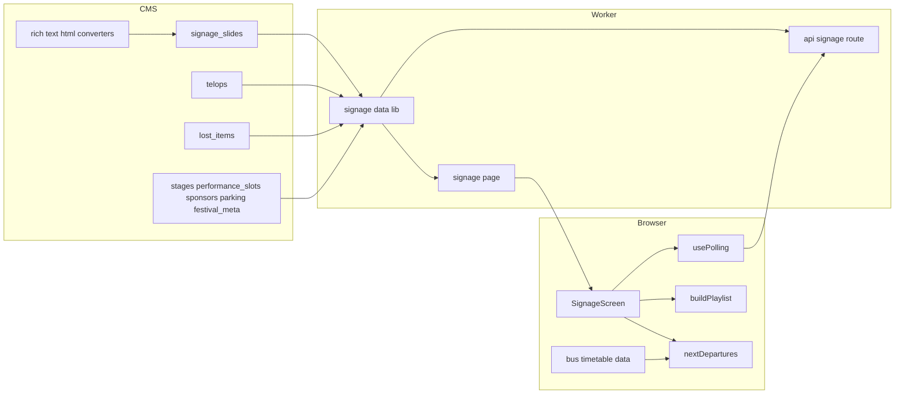
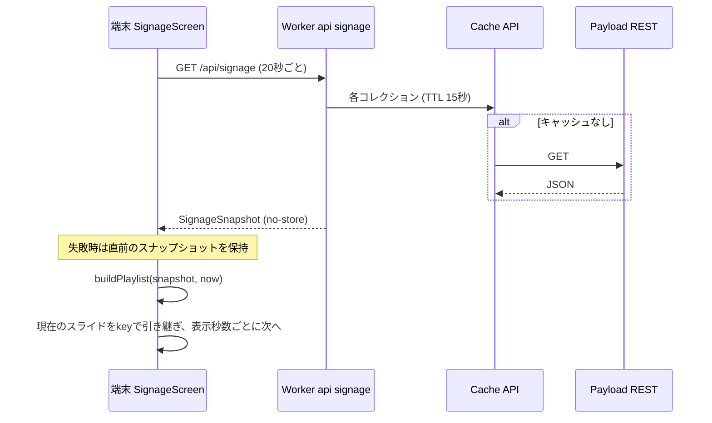
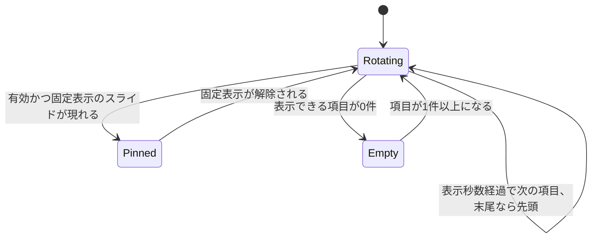

# Design Document: digital-signage

## Overview

**Purpose**: 会場のディスプレイに、祭の基本情報・いまのステージ・スライド・テロップ・バス発車案内を1920×1080(横型)または1080×1920(縦型)の1画面で常時表示する。向きは画面の縦横から自動で決まり、端末設定は持たない。あわせて、公式サイトとサイネージで共通に使う本文部品(横並び・注意枠・ボタン型リンク・表)を本文エディタへ追加する。

**Users**: 来場者は会場で画面を見る。実行委員はCMS管理画面でスライド・テロップ・落とし物を登録し、閉祭後・緊急時に1枚を固定表示する。公式サイトの閲覧者はお知らせ・トピック・固定ページで新しい本文部品を見る。

**Impact**: 新ページ`/signage`、集約APIの`/api/signage`、CMSコレクション3つ(`signage_slides`/`telops`/`lost_items`)を追加する。本文エディタ共通設定と本文描画(`rich-text.tsx`)を拡張し、h1をh2へ読み替える現行挙動を撤廃する。

### Goals
- 操作なしで1画面に左カラム・メイン・テロップ・バス案内を表示し続ける(1.1〜1.3)
- 縦横の向きに応じて横型・縦型の配置を自動で切り替える。データ取得・巡回・状態は共通で、縦型のメイン領域は横型と同じ16:9の中身を縮小して表示する(1.4、1.5)
- CMS更新を手動再読み込みなしで約35秒以内に反映し、取得失敗時は直前の内容を保つ(12.1〜12.3)
- 新しい課金サービス・外部問い合わせを増やさない(11.8、12.4)
- 本文部品を全richTextフィールドで共通に使え、既存本文の表示を変えない(15.1、15.13)

### Non-Goals
- サイネージ端末の機材・ブラウザ・キオスク設定、YouTubeライブ配信の設定
- 公式サイトの既存ページ(タイムテーブル・駐車場・マップ等)の表示変更(本文表示を除く)
- バス時刻表のCMS管理・外部APIからの取得
- スライド切り替えのアニメーション演出、進行ドット、万彩の装飾

## Boundary Commitments

### This Spec Owns
- `/signage`の画面構成(横型・縦型)・向きの判定・切り替え・時刻経過による表示更新・ポーリング
- `/api/signage`の応答型`SignageSnapshot`(サイネージ画面だけが使う)
- CMSコレクション`signage_slides`・`telops`・`lost_items`の定義・公開判定・マイグレーション
- バス時刻データ(`frontend/src/lib/bus-timetable-data.ts`)と次便計算
- 本文部品3種(Blocks)と表機能の追加、そのHTML変換契約(`rt-*`クラスのHTML)、本文描画の許可リストと見た目
- h1の読み替え撤廃

### Out of Boundary
- 既存コレクション(`stages`/`performance_slots`/`sponsors`/`parking_lots`/`parking_statuses`/`festival_meta`)の定義変更
- 公式サイトのタイムテーブル・駐車場・協賛・マップ画面の見た目
- 開催フェーズ(`BUILD_PHASE`)の切り替え運用
- 本番の既存本文中のh1をCMS上で書き換える作業そのもの(手順はMigration Strategyに記す)

### Allowed Dependencies
- `frontend/src/lib/cms.ts`(CMSクライアント、Cache API)、`use-polling.ts`、`use-now.ts`、`event-day.ts`、`timetable.ts`(`toTimetable`/`isPerformanceActive`/`findActivePerformances`)、`sponsors.ts`、`parking-data.ts`、`cms-asset-url.ts`、`cms-media.ts`、`timetable-stage-colors.ts`
- `cms/src/access/policy.ts`の`PUBLISHED_FILTER`、`collections/index.ts`の`withAccess`
- `@payloadcms/richtext-lexical` 3.88.0の`BlocksFeature`・`EXPERIMENTAL_TableFeature`・非同期HTML変換器
- 依存方向: CMS定義 → 生成型(`cms-types.ts`) → `lib/*`(データ取得・純関数) → `app/api`・`components/signage/*` → `app/(fullscreen)/signage`。上流への逆参照は禁止

### Revalidation Triggers
- `SignageSnapshot`のフィールド削除・型変更(稼働中端末の旧JSが読むため追加のみ許可)
- 本文HTMLの`rt-*`構造の変更(フロントの許可リストとCSSが依存)
- `toTimetable`・`getParkingResponse`・`getSponsors`の戻り値変更
- Payloadの更新(`EXPERIMENTAL_TableFeature`の仕様変更)

## Architecture

### Existing Architecture Analysis
- フロントはOpenNextでCloudflare Workersに載り、CMSのREST公開GETを`cms.ts`がCache APIへTTL付きで保持する
- 更新反映の前例は駐車場空き情報: Route Handler(no-store)+`usePolling`(20秒、失敗時は直前データ保持)
- 本文はCMSが`lexicalHTMLField`でHTML化し(`afterRead`で毎回生成)、フロントが`sanitize-html`の許可リストで描画する。エディタ設定は`buildConfig.editor`の単一設定で全richTextに効く
- 公開判定は`policy.ts`の`PUBLISHED_FILTER`に集約し、access結線は`collections/index.ts`で一括

### Architecture Pattern & Boundary Map



**Architecture Integration**:
- Selected pattern: 集約エンドポイント+クライアントポーリング(駐車場空き情報と同型)。代替案の比較は`research.md`
- Domain/feature boundaries: サーバ側`signage-data.ts`はCMSの値を表示用の型へ正規化するだけ。何を何秒表示するか・次便・いまのステージは端末側の純関数が`now`から決める(時刻経過の表示更新に再取得を要しない)
- Existing patterns preserved: `cms.ts`経由の取得、`CmsResult`、`usePolling`、`useNow`、`PUBLISHED_FILTER`、`withAccess`、`lexicalHTMLField`+`richTextHTMLConverters`
- New components rationale: スライド・テロップ・落とし物はCMSに対応データが無い。バス時刻は外部問い合わせ禁止のため同梱データ
- Steering compliance: Edge制約(Node専用API無し)、`.env`不使用、コレクション変更はマイグレーション経由、`any`不使用

### Technology Stack

| Layer | Choice / Version | Role in Feature | Notes |
|-------|------------------|-----------------|-------|
| Frontend | Next.js 15 App Router / React 19 | `/signage`ページ、`/api/signage` | 既存 |
| Frontend | sanitize-html ^2.17.6 | 本文HTMLの許可リスト | `allowedClasses`を新たに使う |
| Frontend | next/font/google `Noto_Sans_JP` | Figmaが指定するNoto Sans JP部分 | 新規利用(依存追加なし)。書体は未決事項を参照 |
| Backend | Payload 3.88.0 / @payloadcms/richtext-lexical 3.88.0 | 新コレクション、`BlocksFeature`、`EXPERIMENTAL_TableFeature` | 表はEXPERIMENTAL |
| Data | Postgres 16 | 新3コレクションのテーブル | `pnpm migrate:create` |
| Infrastructure | Cloudflare Workers + Cache API | 集約APIとCMS応答の短期キャッシュ | 追加課金サービスなし |

## File Structure Plan

### Directory Structure
```
cms/src/
├── collections/
│   ├── signage-slides.ts        # スライド(種別・レイアウト・本文・画像・表示秒数・有効・固定表示・並び順)
│   ├── telops.ts                # テロップ(対象区分・対象・文面・有効・並び順)
│   └── lost-items.ts            # 落とし物(写真・品名・拾得場所・拾得時刻・返却済み)
├── blocks/
│   └── rich-text-blocks.ts      # 本文Blocks定義(imageRow/callout/buttonLink)
└── migrations/<timestamp>_digital_signage.ts

frontend/src/
├── app/
│   ├── api/signage/route.ts                 # GETで集約スナップショットを返す(no-store)
│   └── (fullscreen)/signage/page.tsx        # 初期スナップショットを取得しSignageScreenへ渡す
├── lib/
│   ├── signage.ts                # SignageSnapshot等の型と端末側純関数(buildPlaylist/paginate*/stageNow/timetableWindow)
│   ├── signage-data.ts           # getSignageSnapshot(): CMS取得と正規化(サーバ専用)
│   ├── bus-timetable-data.ts     # 関越交通 前橋渋川線の時刻データ(人手変換)
│   └── bus-departures.ts         # 次便計算・ダイヤ種別判定
└── components/signage/
    ├── signage-screen.tsx        # 'use client'。ポーリング・now・回転・向き判定の結線と、向きごとの固定キャンバス(1920×1080 / 1080×1920)の拡縮
    ├── signage-left-column.tsx   # 横型の左カラム
    ├── signage-portrait-header.tsx  # 縦型の上部帯(ロゴ・DAY・日付・時計)
    ├── signage-portrait-info.tsx    # 縦型の情報帯(いまのステージ・公式サイトQR)
    ├── signage-telop.tsx         # 横型・縦型共通。寸法はCSSの向き別指定
    ├── signage-bus-info.tsx      # 横型・縦型共通。縦型は方面ごとに次の2便、横型は1便
    ├── signage-main.tsx          # メイン領域。常に1536×864で描画し、縦型は`@media (orientation: portrait)`で0.671875倍に縮小して1032×580.5の枠に収める
    ├── signage-heading-chip.tsx  # スライド見出しチップ (アイコン+文字)
    └── slides/                   # 種別ごとに1ファイル: sponsors / lost-items / image (登録画像・構内マップ兼用) / parking / timetable / layout
```

### Modified Files
- `cms/src/collections/index.ts` — 新3コレクションを登録口へ追加
- `cms/src/access/policy.ts` — `PUBLISHED_FILTER`へ`signage_slides`(有効のみ)・`telops`(有効のみ)・`lost_items`(返却済み以外)を追加
- `cms/src/lib/rich-text-editor.ts` — `BlocksFeature`(3ブロック)と`EXPERIMENTAL_TableFeature`を共通機能に追加
- `cms/src/lib/rich-text-html-converters.ts` — 3ブロックと表の変換器を追加(画像は既存の`data-media-id`方式を共用)
- `cms/src/app/(payload)/admin/importMap.js` — `pnpm generate:importmap`で再生成(ローカル差分のZitadel/S3エントリ消失は戻す)
- `cms/src/payload-types.ts`、`frontend/src/cms-types.ts` — `pnpm generate:types`で再生成
- `frontend/src/components/rich-text.tsx` — 許可タグ・class・属性の追加、h1→h2読み替えの削除
- `frontend/src/app/globals.css` — `.rich-text-body`配下に`rt-*`の公式サイト用スタイル、`.rich-text-body--signage`配下にサイネージ用スタイル。サイネージ画面の縦型配置と、縦型でのメイン領域の縮小(`transform: scale(0.671875)`、transform-origin左上)は`@media (orientation: portrait)`で切り替える。見出し・本文の折り返しに`word-break: auto-phrase`を指定する
- `frontend/src/app/layout.tsx` — Material Symbolsの`icon_names`へ`handshake`・`local_parking`・`mic`・`directions_bus`・`warning`・`info`を追加
- `frontend/src/lib/cms.ts` — `findGlobal`にTTL指定(`CmsFetchOptions`)を追加(既存呼び出しは不変)
- `frontend/src/lib/sponsors.ts` — `getSponsors`にTTL指定を受ける省略可能な引数を追加
- `frontend/src/lib/phase.ts` — `PRE_EVENT_PUBLIC_PATHS`へ`/signage`を追加
- `docs/cms-operations.md` — スライド・テロップ・落とし物・固定表示の操作とQR画像の用意の仕方

## System Flows

### 更新反映とスライド巡回



- 反映遅延の上限はTTL 15秒+ポーリング20秒で約35秒(12.3)。`festival_meta`もTTL 15秒で取得する
- 1つでもCMS取得に失敗したら`/api/signage`は502を返し、端末は全体を直前の内容のまま保つ(画面内の整合を優先、12.2)
- 時刻・いまのステージ・タイムテーブルの現在線・バス・DAY表記は再取得を待たず`now`(1秒ごと)から再計算する(3.5、11.4、11.5)

### スライド巡回の状態



- 再生リスト(`buildPlaylist`)はスナップショットか`now`の分が変わるたびに作り直す。現在の項目の`key`が新しいリストにあればそれを表示し続け、無ければ同じ位置(リスト長で剰余)から再開する
- 固定表示中も、そのスライドが複数ページ(落とし物・協賛)を持つ場合はページ間で巡回する

## Requirements Traceability

| Requirement | Summary | Components | Interfaces | Flows |
|-------------|---------|------------|------------|-------|
| 1.1, 1.3 | 1920×1080の4領域を1画面 | SignageScreen | `SignageScreenProps` | — |
| 1.4 | 縦型(1080×1920)で同じ情報を縦型配置で表示し、メイン領域は横型と同じ16:9の中身を縮小 | SignageScreen, SignagePortraitHeader, SignagePortraitInfo, SignageMain, SignageTelop, SignageBusInfo | `SignageOrientation`、`CANVAS_SIZE` | — |
| 1.5 | 向きの自動切替、端末設定なし | SignageScreen(`useOrientation`)、globals.cssの`@media (orientation: portrait)` | `SignageOrientation`、`CANVAS_SIZE` | — |
| 1.2 | 操作不要で表示継続 | SignageScreen, usePolling | — | 更新反映 |
| 2.1, 2.2, 2.5 | ロゴ・QR、キャッチコピー無し | SignageLeftColumn | — | — |
| 2.3 | DAY表記と日付 | SignageLeftColumn, `eventDayIndex` | `signage.ts` | — |
| 2.4 | 現在時刻 | SignageScreen(`useNow` 1秒) | — | — |
| 3.1〜3.5 | いまのステージ | SignageLeftColumn, `stageNow` | `StageNowRow` | — |
| 4.1, 4.2, 4.5 | 順番どおりの巡回 | buildPlaylist, useSlideRotation | `PlaylistEntry` | 巡回状態 |
| 4.3 | スライド種別 | signage_slides, slides/* | `SignageSlide` | — |
| 4.4 | 種別と順番をCMSで設定 | signage_slides(`kind`/`enabled`、`orderable`の`_order`) | — | — |
| 4.6, 4.7 | 固定表示と解除 | signage_slides(`pinned`), buildPlaylist | — | 巡回状態 |
| 5.1〜5.4 | 協賛のプラン別表示 | SponsorsSlide, `paginateSponsors` | `SignageSponsor` | — |
| 6.1〜6.3 | 落とし物一覧と案内 | LostItemsSlide, `paginate` | `SignageLostItem` | — |
| 6.4 | 落とし物の登録・更新・削除 | lost_items | — | — |
| 7.1 | 構内マップ | ImageSlide(`campus_map`) | — | — |
| 8.1, 8.2 | 登録画像を16:9全面 | ImageSlide(`image`), signage_slides | — | — |
| 9.1〜9.5 | 駐車場の空き状況 | ParkingSlide, `getParkingResponse` | `ParkingResponse` | — |
| 9.6 | 0件なら外す | buildPlaylist | — | 巡回状態 |
| 10.1〜10.3 | テロップ登録 | telops | — | — |
| 10.4〜10.8 | テロップ表示・流し | SignageTelop, useTelopRotation | `SignageTelopItem` | — |
| 11.1〜11.6 | バス発車案内 | SignageBusInfo, nextDepartures | `DirectionBoard` | — |
| 11.7 | 曜日に合うダイヤ | `serviceDayOf` | `ServiceDay` | — |
| 11.8 | 自前データ・外部問い合わせ無し | bus-timetable-data | `BusTimetable` | — |
| 12.1〜12.4 | 自動反映・失敗時保持・数十秒・課金無し | /api/signage, usePolling, cms.ts | `SignageSnapshot` | 更新反映 |
| 12.5 | 配信取り込みでも同じ内容 | SignageScreen(固定キャンバス拡縮) | — | — |
| 13.1〜13.5 | タイムテーブルスライド | TimetableSlide, `timetableWindow` | `TimetableWindow` | — |
| 14.1, 14.2 | レイアウト4種の作成 | signage_slides(`layout`系), LayoutSlide | — | — |
| 14.3 | 枠に本文部品 | signage_slides(`content1`/`content2`), RichText | — | — |
| 14.4 | 最大行数で省略 | LayoutSlide | — | — |
| 14.5 | 注意喚起の配色 | LayoutSlide(`tone`) | — | — |
| 14.6 | 画像を枠内に縦横比維持 | `.rich-text-body--signage` | — | — |
| 15.1 | 全本文で同じ編集機能 | rich-text-editor | — | — |
| 15.2, 15.3 | 横並び | imageRowブロック、変換器、CSS | HTML契約 | — |
| 15.4, 15.5 | 注意枠 | calloutブロック、変換器、CSS | HTML契約 | — |
| 15.6, 15.7 | ボタン型リンク | buttonLinkブロック、変換器、CSS | HTML契約 | — |
| 15.8〜15.10 | 表 | EXPERIMENTAL_TableFeature、表変換器、CSS | HTML契約 | — |
| 15.11〜15.13 | 見出しレベル保持・h1は文字・既存表示不変 | RichText | — | — |

## Components and Interfaces

| Component | Domain/Layer | Intent | Req Coverage | Key Dependencies (P0/P1) | Contracts |
|-----------|--------------|--------|--------------|--------------------------|-----------|
| signage_slides / telops / lost_items | CMS | サイネージ専用データの登録 | 4.4, 4.6, 4.7, 6.4, 8.2, 10.1〜10.3, 14.1, 14.3 | policy.ts (P0) | State |
| richTextBlocks + converters | CMS | 本文部品と表のHTML化 | 15.1〜15.10 | richtext-lexical (P0) | API(HTML契約) |
| getSignageSnapshot | frontend lib(server) | CMSデータの取得・正規化 | 12.1, 12.2, 9.1〜9.5 | cms.ts (P0), parking-data (P0), timetable (P0), sponsors (P1) | Service |
| /api/signage | frontend route | スナップショット配信 | 12.1〜12.4 | getSignageSnapshot (P0) | API |
| signage.tsの純関数 | frontend lib | 再生リスト・ページ分割・いまのステージ・時間窓(向き別の定数を受ける) | 1.4, 2.3, 3.2〜3.5, 4.1〜4.7, 5.1〜5.4, 6.1, 9.6, 13.2 | timetable (P0) | Service |
| bus-departures + data | frontend lib | 次便計算 | 11.2〜11.8 | event-day (P1) | Service |
| SignageScreen | UI | 結線・向き判定・拡縮・回転 | 1.1〜1.5, 2.4, 4.1, 12.2, 12.5 | usePolling (P0), useNow (P0) | State |
| SignageLeftColumn / SignagePortraitHeader / SignagePortraitInfo / SignageMain / SignageTelop / SignageBusInfo / slides/* | UI | Figma部品の描画(横型・縦型) | 各要件 | — | — |
| RichText(拡張) | UI | 本文の許可リストと描画 | 14.6, 15.3, 15.5, 15.7, 15.9〜15.13 | sanitize-html (P0) | — |

### CMS

#### signage_slides / telops / lost_items

| Field | Detail |
|-------|--------|
| Intent | サイネージだけが使うデータを実行委員が登録する |
| Requirements | 4.4, 4.6, 4.7, 6.4, 7.1, 8.2, 10.1〜10.3, 14.1, 14.3 |

**Responsibilities & Constraints**
- 1ファイル1コレクション、accessは`collections/index.ts`の`withAccess`で結線(実行委員のみCRUD、学生団体には管理画面で非表示)
- 未認証の読み取りは`PUBLISHED_FILTER`で絞る: `signage_slides`は`enabled = true`、`telops`は`enabled = true`、`lost_items`は`returned != true`
- 種別に依存する必須項目は`required`ではなくフィールドの`validate`で判定する(全種別に必須化しないため)
- 本文フィールドは他のコレクションと同じ`lexicalHTMLField({ storeInDB: true, converters: richTextHTMLConverters })`で`*_html`を持つ

**Dependencies**
- Outbound: `media` — 画像・写真(P0)
- Inbound: `getSignageSnapshot` — REST読み取り(P0)

**Contracts**: State [x]

##### State Management
- 固定表示: 有効なスライドのうち`pinned`が真で並び順が先頭の1枚だけを使う。複数チェックは許すが、管理画面の説明に「先頭の1枚だけが表示される」と書く
- 並び順: `signage_slides`と`telops`は`orderable: true`とし、管理画面の一覧でドラッグして並べ替える。順序はPayloadが追加する`_order`(文字列の順序キー、管理画面では非表示)に保存され、新規作成は末尾に入る。数値の並び順項目は持たない
- 並び順の取得: RESTの`sort=_order`(昇順)で取得し、返った順のまま使う。フロントで`_order`を比較し直さない(管理画面の一覧と同じDB上の並びにするため)
- 落とし物の返却済みは削除せず`returned`で隠す(問い合わせ対応で履歴を見るため)

**Implementation Notes**
- Integration: `pnpm migrate:create digital_signage`で1本のマイグレーションに3コレクション(`signage_slides`・`telops`の`_order`列と索引を含む)を入れ、`pnpm generate:types`を実行する。新コレクション追加のみのため`cms-schema-check.yml`の破壊的変更には当たらない
- Validation: `policy.test.ts`と`access.int.test.ts`へ新コレクションの未認証読み取り(フィルタ)と学生団体の拒否を追加
- Risks: なし

#### richTextBlocksとHTML変換器

| Field | Detail |
|-------|--------|
| Intent | 本文に横並び・注意枠・ボタン型リンク・表を挿入可能にし、決まった構造のHTMLへ変換する |
| Requirements | 15.1〜15.10 |

**Responsibilities & Constraints**
- `richTextEditorFeatures`へ`BlocksFeature({ blocks: [imageRow, callout, buttonLink] })`と`EXPERIMENTAL_TableFeature()`を追加する。`buildConfig.editor`の単一設定のため、お知らせ・トピック・固定ページ・`festival_meta`・`page_home`・サイネージの全richTextに効く(15.1)
- 見出しは現行どおりh2〜h4のみ。h1をエディタで新規作成する経路は無い
- 変換器は全ブロックを必ず持つ(未定義ブロックは`<span>unknown node</span>`になるため)
- 画像は既存`uploadConverter`と同じく実URLを焼き込まず`data-media-id`だけを出す。未展開のIDは変換器引数の`populate`で取得し、画像以外・ID不明は出力しない
- 利用者入力(ラベル・本文・URL)は既存`escapeAttr`相当で必ずエスケープする

**ブロック定義**

| slug | 管理画面名 | フィールド | 検証 |
|------|-----------|-----------|------|
| `imageRow` | 横並び | `items`(array、1〜3件): `image`(upload media、必須)、`label`(text、30字まで) | 画像必須 |
| `callout` | 注意枠 | `kind`(select、必須、`caution`注意/`note`補足、既定`caution`)、`text`(textarea、必須、500字まで) | — |
| `buttonLink` | ボタン型リンク | `label`(text、必須、30字まで)、`url`(text、必須、500字まで) | `https://`・`http://`・`/`始まりのみ |

**Contracts**: API [x]

##### HTML契約(CMS → frontend)
CMSが`*_html`に出すHTMLの形を固定する。frontendの許可リストとCSSはこの形だけを前提にする。

| 部品 | HTML |
|------|------|
| 横並び | `<div class="rt-image-row" data-count="{1-3}"><figure><figcaption>{label}</figcaption></figure>…</div>`(ラベル空なら`figcaption`を出さない) |
| 注意枠 | `<aside class="rt-callout" data-kind="{caution\|note}"><p>{text、改行は<br>}</p></aside>` |
| ボタン型リンク | `<p class="rt-button"><a href="{url}">{label}</a></p>` |
| 表 | `<div class="rt-table"><table><tbody><tr><th>…</th><td>…</td></tr></tbody></table></div>`(見出しセルは`headerState > 0`で`th`、`colspan`/`rowspan`は2以上のときだけ出す、インラインstyleは出さない) |

**Implementation Notes**
- Integration: 変換器の変更は`afterRead`で既存ドキュメントにも効く。データ移行不要。`pnpm generate:importmap`で`BlocksFeatureClient`/`TableFeatureClient`を登録
- Validation: `rich-text-html-converters.test.ts`へ部品ごとのHTML、エスケープ、画像以外の除外、未展開IDの`populate`を追加
- Risks: `EXPERIMENTAL_TableFeature`はPayloadの安定版内でも破壊的変更があり得る。表の変換テストで検出する

### frontend lib

#### getSignageSnapshot(`signage-data.ts`)と`/api/signage`

| Field | Detail |
|-------|--------|
| Intent | サイネージ表示に要るCMSデータを1回で集め、表示用の型へ正規化する |
| Requirements | 9.1〜9.5, 12.1〜12.4 |

**Responsibilities & Constraints**
- 取得はすべて`cms.ts`経由、TTLは`SIGNAGE_TTL_SECONDS = 15`。駐車場は既存`getParkingResponse()`をそのまま使う(当日判定・未設定除外を含む)
- 協賛は`getSponsors({ ttlSeconds })`+`mergeSponsorLogos`、タイムテーブルは`toTimetable`を再利用する
- `limit: 0`で全件取得(Payload既定の10件で切れるため)
- スライドとテロップは`sort: '_order'`を指定して取得する
- いずれかの取得が失敗したら全体を失敗にする

**Dependencies**
- Outbound: `cms.ts`(P0)、`parking-data.ts`(P0)、`timetable.ts`(P0)、`sponsors.ts`(P1)、`cms-media.ts`(P1)

**Contracts**: Service [x] / API [x]

##### Service Interface
```typescript
import type { CmsResult } from '@/lib/cms';

export function getSignageSnapshot(): Promise<CmsResult<SignageSnapshot>>;
```
- Postconditions: `slides`は有効なものだけを`_order`昇順で含む。`lostItems`は返却済みを含まず拾得時刻の新しい順。`telops`は有効なものを`_order`昇順

##### API Contract
| Method | Endpoint | Request | Response | Errors |
|--------|----------|---------|----------|--------|
| GET | /api/signage | なし | `SignageSnapshot`(`Cache-Control: no-store`) | 502 `{ error: 'cms_unavailable' }` |

#### signage.ts(型と端末側の純関数)

| Field | Detail |
|-------|--------|
| Intent | スナップショットと`now`から、表示する内容を決める |
| Requirements | 2.3, 3.1〜3.5, 4.1〜4.7, 5.1〜5.4, 6.1, 9.6, 13.1〜13.3 |

**Contracts**: Service [x]

```typescript
import type { Attachment, EventDay } from '@/lib/home-page-types';
import type { ParkingResponse } from '@/lib/parking';
import type { Timetable, TimetablePerformance, TimetableStage } from '@/lib/timetable';

/** 画面の向き。キャンバス寸法・外周の配置・バス案内の便数だけを分け、メイン領域の中身・データ・巡回・状態は共通 */
export type SignageOrientation = 'landscape' | 'portrait';

/** 横型1920×1080、縦型1080×1920。向きで変わるのはキャンバス寸法だけで、ページ分割・時間窓の定数は向きに依らない */
export const CANVAS_SIZE: Readonly<Record<SignageOrientation, { readonly width: number; readonly height: number }>>;

export type SlideLayout = 'title' | 'title-content' | 'section' | 'two-content';
export type SlideTone = 'normal' | 'alert';

interface SlideBase {
  readonly id: number;
  readonly durationSec: number;
  readonly pinned: boolean;
}
export type SignageSlide =
  | (SlideBase & { readonly kind: 'sponsors' | 'lost_items' | 'parking' | 'timetable' })
  | (SlideBase & { readonly kind: 'image' | 'campus_map'; readonly image: Attachment | null })
  | (SlideBase & {
      readonly kind: 'layout';
      readonly layout: SlideLayout;
      readonly tone: SlideTone;
      readonly title: string;
      readonly subtext: string | null;
      readonly content1Html: string;
      readonly content2Html: string;
    });

export interface SignageTelopItem {
  readonly id: number;
  readonly audience: 'visitor' | 'group';
  /** audienceがgroupのときの対象表記。例: "出店団体へ" */
  readonly target: string | null;
  readonly body: string;
}

export type SponsorTier = 'planA' | 'planB' | 'planC' | 'planD';
export interface SignageSponsor {
  readonly id: number;
  readonly name: string;
  readonly logoId: string | null;
  readonly tier: SponsorTier | null;
}

export interface SignageLostItem {
  readonly id: number;
  readonly name: string;
  readonly foundPlace: string;
  readonly foundAt: string;
  readonly photoId: string | null;
}

export interface SignageSnapshot {
  readonly fetchedAt: string;
  readonly eventDays: readonly EventDay[];
  readonly slides: readonly SignageSlide[];
  readonly telops: readonly SignageTelopItem[];
  readonly timetable: Timetable;
  readonly sponsors: readonly SignageSponsor[];
  readonly lostItems: readonly SignageLostItem[];
  readonly parking: ParkingResponse;
}

export interface PlaylistEntry {
  /** `${slideId}:${page}`。スナップショット更新を跨いで現在位置を引き継ぐ鍵 */
  readonly key: string;
  readonly slide: SignageSlide;
  readonly page: number;
}

/** 固定表示があればその1枚のページだけ、無ければ有効スライドを順に。空の自動スライドは除く */
export function buildPlaylist(snapshot: SignageSnapshot, now: Date): readonly PlaylistEntry[];

/** 1ページ8件(4列×2行) */
export function paginateLostItems(items: readonly SignageLostItem[]): readonly (readonly SignageLostItem[])[];

export type SponsorRow =
  | { readonly kind: 'logo'; readonly tier: 'planA' | 'planB' | 'planC'; readonly items: readonly SignageSponsor[] }
  | { readonly kind: 'names'; readonly items: readonly SignageSponsor[] };
/** プランA〜Cかつロゴありはプラン別のロゴ行、それ以外(プランD・未設定・ロゴなし)は社名行。行高の合計が704pxを超える位置でページを分ける */
export function paginateSponsors(sponsors: readonly SignageSponsor[]): readonly (readonly SponsorRow[])[];

export interface StageNowRow {
  readonly stage: TimetableStage;
  readonly colorIndex: number;
  /** 出演中の公演。無ければnull (「公演なし」) */
  readonly performance: TimetablePerformance | null;
}
export function stageNow(timetable: Timetable, now: Date): readonly StageNowRow[];

/** 開催日なら1始まりの日数、開催日以外はnull */
export function eventDayIndex(eventDays: readonly EventDay[], now: Date): number | null;

export interface TimetableWindow {
  /** JSTの分(0〜1439) */
  readonly startMinute: number;
  readonly endMinute: number;
}
/** 幅は4時間(240分)。開始 = floor30(now − 幅/2) を当日の公演範囲 (時単位に丸め) 内へ寄せる */
export function timetableWindow(dayPerformances: readonly TimetablePerformance[], now: Date): TimetableWindow;
```
- Preconditions: `now`は端末時刻。JST変換は`event-day.ts`の`toJstParts`を使う(端末のタイムゾーンに依存しない)
- 空の自動スライドの判定(`buildPlaylist`): 協賛0件、落とし物0件、`parking.lots`のうち`status`が非nullの件数0(当日以外は全件null)、当日の公演0件、`image`/`campus_map`で画像未登録
- `stageNow`は全ステージを`toTimetable`の順で返し、出演中の判定は`isPerformanceActive`(開始≦now<終了)。同一ステージに重なる出演中枠があれば開始の遅い方(後から始まった公演)を出す

#### bus-departures.ts / bus-timetable-data.ts

| Field | Detail |
|-------|--------|
| Intent | 同梱の時刻データと`now`から、方面ごとの次便を求める |
| Requirements | 11.2〜11.8 |

**Contracts**: Service [x]

```typescript
export type BusStop = 'gunma_univ_aramaki' | 'driving_school';
export type BusDirection = 'maebashi' | 'shibukawa';
export type ServiceDay = 'weekday' | 'holiday';

export interface BusTrip {
  /** 系統番号。例: "22B" */
  readonly route: string;
  /** 行先の表示名。例: "前橋駅" */
  readonly destination: string;
  readonly direction: BusDirection;
  /** 停車するサイネージ対象停留所と発車時刻 "HH:MM" (JST)。通過・非経由の停留所は含めない */
  readonly departures: readonly { readonly stop: BusStop; readonly time: string }[];
}

export interface BusTimetable {
  /** 例: "2024-06-01改正 土日祝" */
  readonly revision: string;
  readonly holiday: readonly BusTrip[];
  readonly weekday?: readonly BusTrip[];
}

export interface NextDeparture {
  readonly route: string;
  readonly destination: string;
  readonly stopName: string;
  readonly departAt: string;
  /** 切り上げ。最小1 */
  readonly minutesLeft: number;
}

export interface DirectionBoard {
  readonly direction: BusDirection;
  /** 発車時刻順の次便。本日の便が残っていなければ空 */
  readonly departures: readonly NextDeparture[];
}

/** 開催日はその曜日、開催日以外は当日の曜日で、土日をholiday、それ以外をweekdayとする */
export function serviceDayOf(now: Date): ServiceDay;

/** 前橋駅方面・渋川駅方面の順に2件返す。各方面の`departures`は最大`perDirection`件(横型1、縦型2) */
export function nextDepartures(timetable: BusTimetable, now: Date, perDirection: number): readonly DirectionBoard[];
```
- 次便は「発車時刻 > now」の停車を早い順に`perDirection`件。1便が両停留所に停まる場合は先に来る停車を表示する(11.6)
- 対象ダイヤのデータが無い(平日)場合は両方面とも`departures`が空
- 開催日2026-11-14(土)・15(日)はいずれも土日。祝日判定は持たない(開催日以外は試験表示のみのため)

**Implementation Notes**
- Integration: `bus-timetable-data.ts`は公式PDF(土日祝・前橋駅方面/渋川駅方面)から人手で一回だけ変換する。変換スクリプトはリポジトリに残さない。行先は便ごとにPDFの終点行で確定する
- Validation: データの不変条件(時刻形式、方面内で`departures`が時刻順)と`nextDepartures`の境界(発車時刻ちょうど、最終便後、両停留所停車便)を単体テストで固定
- Risks: ダイヤ改正時はデータ差し替えとデプロイが要る

### UI

#### SignageScreen

| Field | Detail |
|-------|--------|
| Intent | ポーリング・時刻・回転・向きを結線し、向きごとの固定キャンバスを画面へ拡縮して描く |
| Requirements | 1.1〜1.5, 2.4, 4.1, 4.2, 12.2, 12.5 |

**Contracts**: State [x]

```typescript
export interface SignageScreenProps {
  readonly initial: SignageSnapshot | null;
  readonly renderedAt: string;
}
```

##### State Management
- `usePolling<SignageSnapshot>({ fetcher, intervalMs: 20_000, initial })`。`shouldContinue`は常に真。失敗時は直前の`data`を使い続ける
- `useNow(renderedAt, 1000)`を画面全体で1つだけ持ち、子へ`now`を渡す
- `useSlideRotation(entries)`: 現在の`key`と経過時間を持ち、`durationSec`経過で次へ。`entries`が変わったら`key`で位置を引き継ぐ
- 向き: `useOrientation()`が`matchMedia('(orientation: portrait)')`を購読して`SignageOrientation`を返す(初回描画は`landscape`、マウント後に確定)。端末設定・URLパラメータは持たない(1.5)。配置の切り替えはCSSの`@media (orientation: portrait)`が担い、同じ判定をキャンバス寸法の選択(`CANVAS_SIZE`)とバス案内の便数(横型1、縦型2)の選択にも使う。`useOrientation`を残すのは、拡縮の計算(JS)がキャンバス寸法を要するため。メイン領域の縮小はCSSだけで済み、JSを要しない。データ取得・`useSlideRotation`・`now`は向きに依存しない
- 拡縮: キャンバスは横型1920×1080・縦型1080×1920(`CANVAS_SIZE[orientation]`)。`min(innerWidth/canvas.width, innerHeight/canvas.height)`で`transform: scale`し中央に置く。`resize`で再計算。配信取り込み(OBSのブラウザソース等)も同じページを1920×1080または1080×1920で読むだけで同じ表示になる(12.5)
- 初回が取得失敗(`initial`が`null`)の間は、CMSに依存しない時計・バス案内・ロゴ・QRだけを描く

#### 表示部品(summary-only)

以下の表は横型(1920×1080キャンバス基準)で、メイン領域(1536×864)の各スライドは縦型でも同じ寸法・配置のまま描画する。縦型の外周の配置は後続の「縦型の配置」に示す。地は`background`(#fbf8f3)。値はFigma実測(`research.md`のFigma実測を参照)。

| Component | Figma | Req | 要点 |
|-----------|-------|-----|------|
| SignageLeftColumn | `829:2` | 2.1〜2.5, 3.1〜3.5 | x24 y24 312×1032。上: ロゴ(`/images/logo-2026.webp`、高55.42)、DAYチップ+日付「M/D (曜)」、時計「HH:MM」104px。区切り線の下に`mic`アイコン+「いまのステージ」と`stageNow`の行。ステージ名チップ色は`STAGE_BAND_CLASSES[colorIndex]`、企画名は`-webkit-line-clamp: 2`で省略(3.4)、公演なしは「公演なし」。下端に「▼公式サイト」と`/images/qr-aramakisai.svg`を240角。開催日以外はDAYチップを出さず日付だけ |
| SignageHeadingChip | 各スライドの`見出しチップ` | 4.3 | メイン左上(24,24)。地`text`、文字`background`、32px Bold、px20 py10、角丸8、アイコン(Material Symbols)+文字gap8 |
| SignageTelop | `829:45`(`829:37`/`829:41`) | 10.4〜10.8 | x360 y912 816×144、地`text`、角丸16。対象チップ: 来場者「ご来場のみなさまへ」=primary、団体`target`=warning。文面44px Bold `background`色。テロップは1件ずつ順に表示し、幅に収まらない文面は右から左へ一定速度で流す(速度は調整用定数、初期値150px/秒)。1件の表示は「収まる: 8秒」「流す: 全文が流れ切るまで」 |
| SignageBusInfo | `829:46` | 11.1〜11.6 | x1200 y912 696×144。見出しは`directions_bus`アイコン+「バス発車案内」+「荒牧キャンパスエリア」。方面ごと1行: 系統チップ・行先・発車時刻・「あとN分」・停留所名(右寄せ)。`departures`が空の方面は行先の位置に「本日の運行は終了しました」 |
| SponsorsSlide | `829:54` | 5.1〜5.4 | 見出しは`handshake`+「ご協賛いただいた皆さま」。A=3列440×200、B=4列324×144、C=6列208×96(ロゴ`object-contain`、下に社名24px)、社名行=4列24px。プラン間32 |
| LostItemsSlide | `829:179` | 6.1〜6.3 | 見出しは`search`+「落とし物」。4列×2行、写真336×252(`object-cover`、写真なしは灰地)、品名30px Bold(1行で省略)、「拾得場所｜HH:MM」24px。右下に「本部テントでお預かりしています」(28px Bold) |
| ImageSlide | `829:341`/`829:281` | 7.1, 8.1 | メイン1536×864全面に`object-contain`(16:9以外は白地の余白)。`campus_map`のみ見出しチップ(`map`+「構内マップ」)を重ねる |
| ParkingSlide | `832:4529` | 9.1〜9.5 | 見出しは`local_parking`+「駐車場の空き状況」。2列のカード(732×170)、駐車場名・状態バッジ(文字ラベル「空き/混雑/満車」)・「HH:MM更新」。`status`が`null`の駐車場は出さない。バッジ色は公式サイトの駐車場表示(`parking-row.tsx`)と同じ対応 |
| TimetableSlide | `843:267` | 13.1〜13.5 | 見出しは`calendar_clock`+「タイムテーブル」。時刻列90、ステージ列は均等割、ステージ見出し高56、本体672px=4時間(2.8px/分)、30分目盛、現在時刻線。出演中は公式サイトと同じ`bg-info`+「出演中」表記。リンクの印は出さない |
| LayoutSlide | `884:793`(見本`884:794`/`884:909`/`884:1024`/`884:1155`/`884:1270`) | 14.2, 14.4〜14.6 | 1536×864、p64、`alert`は地warning。title: タイトル96px/1.1(最大2行)+サブ40px/1.3(最大2行)を中央。section: 上282pxから左寄せ、タイトル96px(最大2行)+サブ36px/1.4(最大3行)。title-content: タイトル64px/1.2(1行)+本文枠1408幅。two-content: タイトル(1行)+本文枠680幅×2(gap48)。本文枠は`RichText`に`rich-text-body--signage`と幅区分(`full`/`half`)を付け、はみ出しは枠で切る |

#### 縦型の配置(1080×1920)

キャンバス1080×1920、外周24、要素間24、幅1032、x=24、地は`background`。Figmaページ「デジタルサイネージ」(`828:2`)に作成済み。横型と同じ情報をCSSの`@media (orientation: portrait)`で並べ替え、データ・巡回・状態は共通とする。

| 領域 | 座標・寸法 | Figma | 要点 |
|------|-----------|-------|------|
| Header | (24,24) 1032×176 | `Signage/Portrait/Header` `915:683` | 左にロゴ、右にDAYチップ+日付と時計104px(開催日以外はDAYチップ無し) |
| メイン | (24,224) 1032×581(16:9、厳密には580.5)、角丸16 | — | 横型メイン領域(1536×864)の中身を同じ配置のまま0.671875倍に縮小して表示。見出しチップを含むスライドは横型と同じ |
| Info | (24,829) 1032×536 | `Signage/Portrait/Info` `915:691` | 左(幅696)に「いまのステージ」3件。各件はステージチップ(幅192)の右に、公演名36px太字(最大2行、行高48、末尾省略)とその下に時刻28px。右(x720、幅312)に「▼公式サイト」32px+QR(288角)。左右とも上下中央 |
| BusInfo | (24,1389) 1032×363 | `Signage/Portrait/BusInfo` `915:720` | 方面ごとに次の2便、計4行。見出し32px、系統チップ28px、行先36px、発車時刻48px、あと28px、発車バス停28px、行高64。横型は方面ごと次の1便 |
| Telop | (24,1776) 1032×120(横型は144) | `Signage/Portrait/Telop` `915:739`(visitor `915:740`/group `915:744`) | 横型と同じ構成。高さのみ異なる |

縦型のメイン領域の各スライド(LayoutSlide・協賛・落とし物・構内マップ・登録画像・駐車場・タイムテーブル)は、横型と同じ中身の縮小で、縦型専用の配置・定数を持たない。Figmaの縦型画面ノード(協賛`915:748`、落とし物`915:1008`、構内マップ`915:1245`、登録画像`915:1440`、駐車場`915:1632`、タイムテーブル`915:1852`)と、レイアウトスライドの縦型見本(`917:8113`/`917:8306`/`917:8499`/`917:8694`/`917:8887`)も横型の縮小である。

**実装**: メイン領域は常に1536×864の要素として描画し、縦型では`@media (orientation: portrait)`で`transform: scale(0.671875)`(transform-origin左上)を掛けて1032×580.5の枠に入れる。

**折り返し**: 見出し(タイトル・サブテキスト)と本文は、横型・縦型共通で`word-break: auto-phrase`を指定し、文節単位で折り返す。対応しないブラウザでは通常の折り返しになる(表示は崩れないが文節の途中で折れ得る)。

**Implementation Notes**
- Integration: アイコンはMaterial Symbols Sharpのテキスト(SVGアイコンは使わない)。`layout.tsx`の`icon_names`に新アイコンを追加しないと豆腐になる
- Validation: 各部品はFigmaの該当ノードをMCPで実測して寸法を合わせ、ブラウザで1920×1080表示の寸法を確認する
- Risks: ステージが4件以上だと左カラム(縦型はInfo)に収まらない(現行3件)。収まらない分は切れる。縦型ではメインの文字が0.671875倍に縮むため、最小24pxの文字は約16pxで表示される(既知のトレードオフ)

#### RichText(拡張)

| Field | Detail |
|-------|--------|
| Intent | HTML契約の部品を安全に描画し、公式サイトとサイネージで見た目を出し分ける |
| Requirements | 14.6, 15.3, 15.5, 15.7, 15.9〜15.13 |

**Responsibilities & Constraints**
- 許可タグに`div`・`figure`・`figcaption`・`aside`・`table`・`tbody`・`tr`・`th`・`td`を追加。`allowedClasses`は`div: ['rt-image-row', 'rt-table']`、`aside: ['rt-callout']`、`p: ['rt-button']`。属性は`div: ['data-count']`、`aside: ['data-kind']`、`th`/`td: ['colspan', 'rowspan']`
- `transformTags`のh1→h2を削除。h1は許可タグに無いため、タグが捨てられ文字だけ残る(15.12)
- 既存の許可タグ・属性・変換は変えない(15.13)
- `className`で`rich-text-body--signage`を受けたときのスタイルはCSSだけで切り替え、コンポーネントの分岐は増やさない

**公式サイトのスタイル(`.rich-text-body`、Figma `408:555`・`900:681`〜`900:683`・`900:617`)**
- 部品の上余白24
- 横並び: 等幅の横一列、gap24、ラベル16/1.8 Bold中央・画像の上、画像は正方形枠に`object-contain`
- 注意枠: 枠2px(注意warning/補足info)、角丸8、p16、gap12、`::before`でMaterial Symbolsの`warning`/`info`(24px)、本文16/1.8
- ボタン型リンク: primary地、px24 py12、角丸8、16/1.5 Bold、下線なし
- 表: `.rt-table`が`overflow-x: auto`(表だけ横スクロール、15.10)、罫gray-200の1px、`th`はgray-100地、セルpx16 py12、16/1.8。SPで表の最小幅を確保し本文幅を超えたらスクロール

**サイネージのスタイル(`.rich-text-body--signage`、Figma `905:773`〜`905:777`)**
- 本文36px/1.5、部品間gap24
- 横並び: 白枠p12の正方形を左詰め、gap24、ラベル28px/1.2 Bold。全幅枠は360角、半幅枠は1〜2個で320角・3個で210角
- 注意枠: 地`background`、枠4px、p24、gap16、アイコン行高48
- 表: 罫gray-200の2px、`th`はgray-100、`td`は`background`地、p12、28px/1.5
- ボタン型リンク: 表示しない

## Data Models

### Logical Data Model

**signage_slides**(管理画面名「サイネージ スライド」、`useAsTitle: title`、`orderable: true`)

| Field | Type | 条件・既定 | 用途 |
|-------|------|-----------|------|
| `title` | text(必須、100字まで) | — | 管理用の名前。`layout`では表示タイトル |
| `kind` | select(必須) | `sponsors`協賛/`lost_items`落とし物/`campus_map`構内マップ/`image`登録画像/`parking`駐車場/`timetable`タイムテーブル/`layout`レイアウト | 種別 |
| `layout` | select | `kind = layout`で表示・必須。`title`/`title-content`/`section`/`two-content` | レイアウト |
| `tone` | select | `layout`で表示、既定`normal`。`normal`通常/`alert`注意喚起 | 配色 |
| `subtext` | textarea(200字まで) | `layout`が`title`/`section`で表示 | サブテキスト |
| `content1` + `content1_html` | richText + lexicalHTMLField | `layout`が`title-content`/`two-content`で表示 | 本文枠1 |
| `content2` + `content2_html` | richText + lexicalHTMLField | `layout`が`two-content`で表示 | 本文枠2 |
| `image` | upload media | `kind`が`image`/`campus_map`で表示・必須 | 画像(推奨1536×864) |
| `duration_seconds` | number(5〜120) | 既定10 | 表示秒数。説明に「QR・表・タイムテーブル・落とし物は15秒を推奨」 |
| `enabled` | checkbox | 既定true | 巡回に含めるか |
| `pinned` | checkbox | 既定false | 固定表示 |

**telops**(「サイネージ テロップ」、`useAsTitle: body`、`orderable: true`)

| Field | Type | 条件・既定 |
|-------|------|-----------|
| `audience` | select(必須) | `visitor`来場者向け/`group`参加団体向け |
| `target` | text(20字まで) | `audience = group`で表示・必須。例「出店団体へ」 |
| `body` | text(必須、200字まで) | 文面 |
| `enabled` | checkbox | 既定true |

**lost_items**(「落とし物」、`useAsTitle: name`、`defaultSort: -found_at`)

| Field | Type | 条件・既定 |
|-------|------|-----------|
| `name` | text(必須、50字まで) | 品名 |
| `found_place` | text(必須、30字まで) | 拾得場所 |
| `found_at` | date(必須、日時) | 拾得時刻 |
| `photo` | upload media | 写真 |
| `returned` | checkbox | 既定false。真でサイネージ・公開APIから外れる |

**Consistency & Integrity**
- 3コレクションとも独立。`media`への参照は既存と同じ外部キー(削除時は`SET NULL`)
- 本文の`*_html`は読み出し時に生成されるため、変換器の更新で過去データも新しいHTMLになる

### Data Contracts & Integration
- `/api/signage`の`SignageSnapshot`は追加のみで変更する(稼働中端末の旧JSが読むため)
- 画像は`Attachment`/メディアIDで渡し、URLは端末側で`toAssetUrl`により組み立てる(既存方針)

## Error Handling

### Error Strategy
- 取得失敗: `/api/signage`は502。端末は直前のスナップショットで表示を続け、20秒後に再試行(12.2)。画面上にエラー表示は出さない(来場者向け画面のため)
- 初回取得失敗: CMSに依存しない領域(時計・バス・ロゴ・QR)だけを表示し、次のポーリングで回復する
- 不正データ: 開催日・時刻が解釈できない出演枠は`toTimetable`の既存規則で除外。画像の無い画像スライドは巡回から外す
- 本文: 変換器未定義のブロックは出さない(全ブロックに変換器を用意)。メディアIDを読めない画像は既存規則でタグごと落とす

### Monitoring
- 既存のエラー監視方針に従う。`/api/signage`の502は駐車場APIと同じくログに残る範囲で扱い、専用の監視は追加しない

## Testing Strategy

- **Unit (frontend)**: `buildPlaylist`(固定表示・空スライド除外・ページ展開・順序)、`useSlideRotation`の`key`引き継ぎ、`paginateSponsors`/`paginateLostItems`、`stageNow`(境界: 開始ちょうど・終了ちょうど・重なり)、`timetableWindow`(朝・夕方の寄せ)、`nextDepartures`(発車時刻ちょうど・最終便後・両停留所停車便・平日データ無し)、`eventDayIndex`
- **Unit (frontend RichText)**: `rt-*`の各部品が残る、許可外class・属性が落ちる、h1が文字だけになる、既存本文サンプル(h2〜h4・リスト・リンク・画像)の出力が変わらない
- **Unit (frontend 取得)**: `getSignageSnapshot`がスライドとテロップを`sort=_order`で要求し、返った順を保つ
- **Unit (cms)**: 3ブロックと表の変換HTML、ラベル・URLのエスケープ、`buttonLink`のURL検証、種別依存の必須検証、`policy.ts`の新フィルタ
- **Integration (cms `*.int.test.ts`)**: 未認証で無効スライド・無効テロップ・返却済み落とし物が読めない、学生団体が作成・更新できない、スライドとテロップの新規作成が末尾の`_order`を持ち未認証の`sort=_order`取得がその順で返る
- **Unit (向き)**: `nextDepartures`の`perDirection`(1件/2件、2件目が無い場合)
- **Browser (実測)**: 1920×1080と1080×1920で各領域の位置・寸法がFigmaと一致し(縦型のメイン領域は1032×580.5で、中身が横型の0.671875倍)、ビューポートの縦横を切り替えると配置が自動で変わる、テロップの流し、スライド巡回と固定表示の切り替え、表の横スクロール(公式サイトSP幅358)

## Security Considerations
- `/signage`は公開URLとし、ナビ・サイトマップに載せず`robots: { index: false }`を付ける。表示データはすべてCMSの公開REST由来で、新たに公開範囲は広がらない(落とし物・テロップ・スライドは新規に公開されるデータであり、公開判定で無効・返却済みを除く)
- 落とし物の写真に氏名等が写る場合は撮影・登録時に避ける(運用手順に書く)
- 本文は従来どおりCMS変換時のエスケープとフロントの許可リストの二重で防ぐ。`buttonLink.url`はスキームを`http(s)`と`/`に限定

## Performance & Scalability
- 端末1台あたり20秒に1回の`/api/signage`(1日約4,300リクエスト)。CMSへの問い合わせはCache API(TTL 15秒)で端末間共有される
- 画面内の時刻更新は1秒ごとの`now`のみで、再取得は伴わない
- 長時間表示によるメモリ増加は当日に観察し、問題が出たら定時再読み込みを足す(初期実装では入れない)

## Migration Strategy

```mermaid
flowchart TD
  A[本番の本文にh1が無いか確認] --> B[comittee等のh1をCMSで見出し2へ修正]
  B --> C[CMS PRマージ: 3コレクションのマイグレーション, Blocks, 表, 変換器]
  C --> D[ArgoCD PreSyncでpayload migrate]
  D --> E[frontend PRマージ: RichText許可リスト, h1読み替え撤廃, signage]
  E --> F[CMSにスライド・テロップを登録し/signageを端末で確認]
```



- B→Eの順を守る。h1読み替え撤廃が先に出ると、修正前の`comittee`のh1が見出しでなく文字として表示される
- 確認はREST(`pages`/`announcements`/`topics`/`festival_meta`/`page_home`の`*_html`)で`<h1`を検索する
- CMSを先に出すと、フロント更新前は新部品のHTMLが旧許可リストで落ちる(文字のみ残る)。新部品は手順Eの後に使い始める
- ロールバック: frontendは前バージョンへ戻せば旧表示。CMSのマイグレーションは`down`で3テーブルを削除(データは失われる)

## 未決・要判断

| 項目 | 状態 | 内容 |
|------|------|------|
| 書体 | 未決(ユーザー回答待ち) | Figmaはサイネージ本文・公式サイト本文がLINE Seed JP、左カラムのステージ欄・バス便行・落とし物カードがNoto Sans JP。設計はFigmaのとおりとし、Noto Sans JP部分は`next/font/google`をサイネージ画面だけで読み込む。統一する場合はこの読み込みを外すだけ |
| サイネージURLの公開/保護 | 要判断 | 推奨は公開URL+noindex(上記Security)。Cloudflare Accessで保護する場合、端末・配信PCでの認証(サービストークン等)の運用が要る |
| 関越交通の時刻表の二次利用 | 運用確認 | 開催前に関越交通へ確認する。不可ならバス案内を外す |
| ボタン型リンクのサイネージ表示 | 決定(推奨) | 表示しない。QRが要るときは横並びにQR画像を登録する(QR生成ライブラリを足さず、公式サイトQRの事前生成方針と揃える) |
| 横並びでのQRの用意 | 決定(推奨) | QR画像を登録する。作り方(誤り訂正M・余白2モジュール)を運用手順に書く |
| スライド表示秒数 | 決定 | 既定10秒、スライドごとに5〜120秒。QR・表・情報量の多いスライドは15秒推奨(同種サイネージの目安7〜15秒) |
| 空の自動スライド | 決定 | 巡回から外す(9.6と同じ規則)。全部外れたらメインは空の白地 |
| 最終便後 | 決定 | 方面ごとに「本日の運行は終了しました」 |
| 開催日以外 | 決定 | DAYチップを出さず日付のみ。いまのステージは各ステージ「公演なし」、駐車場スライドは外れる。バスは当日の曜日のダイヤ(平日はデータ無しのため終了表示) |
| 構内マップ | 決定 | CMSに登録した構内マップ画像を表示(公式サイトのLeafletマップは操作前提で遠目に読みにくい) |
| 登録画像 | 決定 | 1スライド1画像。16:9以外は縦横比を保って収め余白は白 |
| 落とし物 | 決定 | 返却済みは`returned`で非表示。1ページ8件を超えたらページを分けて巡回 |
| 向きの切替 | 決定 | 端末設定なし。`@media (orientation: portrait)`と`matchMedia`で自動。外周の配置とバス案内の便数だけが違い、メイン領域は横型と同じ中身を縮小し、データ・巡回・状態は共通 |
| 折り返し | 決定 | 見出し・本文は`word-break: auto-phrase`で文節単位。非対応ブラウザは通常の折り返し |
| テロップ | 決定 | 表示期間は持たず`enabled`で出し入れ。並びは管理画面の一覧で並べ替えた順(`_order`昇順)。団体向けの対象は自由記述(20字) |
