# Technical Design: directus-schema

## Overview

荒牧祭Webサイト向け Directus CMS のコレクション設計。
構内マップ (OSM) 連携、学生団体 RBAC、タイムテーブル、協賛管理を対象とする。

## ER Diagram

```mermaid
erDiagram
    directus_users {
        uuid id PK
    }

    map_areas {
        int id PK
        string name
        json geometry "GeoJSON Polygon"
        int sort
    }

    student_exhibitions {
        int id PK
        uuid user_created FK "UNIQUE, Directus組み込み"
        int area_id FK "NULL可 (出演のみ団体)"
        int booth_number "NULL可, (area_id,booth_number) UNIQUE"
        string booth_label "NULL可"
        string category "stage|exhibit|vendor|other 表示分類"
        string location "人間可読な開催場所名, NULL可"
        string name
        string slug
        string description "一覧表示用短文"
        text content "WYSIWYG HTML"
        json images
        string status
    }

    sponsors {
        int id PK
        int area_id FK "NULL可 (広告協賛)"
        int booth_number "NULL可, (area_id,booth_number) UNIQUE"
        string booth_label "NULL可"
        string type "ad|sponsor|food_truck|other"
        string name
        string logo
        string url
        string description "応援メッセージ兼用"
        string business_category "業種tag, NULL可"
        string address "住所, NULL可 (地元協賛のみ)"
        string tier "NULL可 (広告協賛のみ使用)"
        int sort
    }

    stages {
        int id PK
        int area_id FK "→ map_areas, 出演場所 (NULL可)"
        string name
        int sort
    }

    time_slots {
        int id PK
        string label "例: 13:00-13:30"
        time start_at
        time end_at
        int sort
    }

    performance_slots {
        int id PK
        int stage_id FK
        int time_slot_id FK
        int exhibition_id FK "NULL可 (団体なし出演)"
        string title "NULL可 (団体なし出演の表示名)"
    }

    announcements {
        int id PK
        string title
        text body
        datetime published_at
    }

    faq_items {
        int id PK
        string question
        text answer
        int sort
    }

    topics {
        int id PK
        string title
        text body
        string image "サムネイル file, NULL可"
        string link_url "遷移先, NULL可"
        string attachment "PDF file (デジタルパンフ等), NULL可"
        int sort
    }

    festival_meta {
        int id PK "singleton (id=1固定)"
        string name "祭名"
        json event_days "[{label,open,close}] 日ごと開催時間"
        string admission_fee "入場料 (例: 無料)"
        string payment_note "支払い注記 (例: 現金のみ)"
        int parking_capacity "駐車場収容数"
        string parking_map "駐車場マップ画像 file"
    }

    page_contact {
        int id PK "singleton (id=1固定)"
        text content
        string form_embed_url "Google Forms iframe URL"
    }

    page_home {
        int id PK "singleton (id=1固定)"
        json blocks
    }

    page_access {
        int id PK "singleton (id=1固定)"
        text content
        string map_embed_url
    }

    directus_users      |o--o|  student_exhibitions : "user_created (1:1)"
    map_areas           ||--o{  student_exhibitions : "has"
    map_areas           ||--o{  sponsors            : "has (type!=ad)"
    map_areas           ||--o{  stages              : "has (出演場所)"
    stages              ||--o{  performance_slots   : "has"
    time_slots          ||--o{  performance_slots   : "has"
    student_exhibitions ||--o{  performance_slots   : "performs at (NULL可)"
```



## Collection 詳細

### map_areas

OSMに描画するゾーン/エリア定義。

| フィールド | 型 | 備考 |
|---|---|---|
| id | integer | PK |
| name | string | 表示名 (例: "Aゾーン") |
| geometry | json | GeoJSON Polygon |
| sort | integer | 表示順 |

### student_exhibitions

学生団体の統合テーブル。出展・出演・両方を同一レコードで管理。
掲載状態は真偽フラグを持たず導出する (冗長排除): **マップ掲載 = `area_id != NULL`** / **タイムテーブル掲載 = `performance_slots` に該当行あり**。`category` は表示分類専用で、掲載判定とは独立 (`other` はブース・出演なしでも category で表示可能)。

| フィールド | 型 | Directus interface | 備考 |
|---|---|---|---|
| id | integer | - | PK |
| user_created | uuid | - | Directus組み込み, **UNIQUE**, 自動セット |
| category | string | select | `stage`/`exhibit`/`vendor`/`other` 表示分類 |
| location | string | input | 人間可読な開催場所名 (建物/教室/屋外), NULL可 |
| area_id | integer | many-to-one | → map_areas, NULL可。**掲載=マップ配置の source of truth** |
| booth_number | integer | input | NULL可, (area_id, booth_number) UNIQUE |
| booth_label | string | input | マップ表示ラベル, NULL可 |
| name | string | input | 団体名 |
| slug | string | input | URLスラッグ, UNIQUE |
| description | text | textarea | 一覧表示用短文 |
| content | text | wysiwyg | ページ本文 (HTML) |
| images | json | files | 画像リスト |
| status | string | select | published/draft |

### sponsors

協賛一元管理テーブル。`type` でブース出展・広告協賛を区別。

| フィールド | 型 | Directus interface | 備考 |
|---|---|---|---|
| id | integer | - | PK |
| type | string | select | `ad` / `sponsor` / `food_truck` / `other` |
| name | string | input | |
| logo | string | file | |
| url | string | input | |
| description | text | textarea | 説明兼 応援メッセージ |
| business_category | string | input | 業種tag (ラーメン店/銀行等), NULL可 |
| address | string | input | 住所, NULL可 (地元協賛のみ) |
| tier | string | select | 協賛ランク, NULL可 (`ad` のみ使用) |
| area_id | integer | many-to-one | → map_areas, NULL可 (`ad` は不要) |
| booth_number | integer | input | NULL可, (area_id, booth_number) UNIQUE |
| booth_label | string | input | マップ表示ラベル, NULL可 |
| sort | integer | input | 表示順 |

**フロントエンド利用パターン**:
- マップ表示: `type != ad` かつ `area_id != null`
- 協賛一覧: 全レコード、`type` でセクション分け
- 広告協賛: `type = ad`、`tier` でランク表示

### stages

ステージマスタ。実行委員が事前定義。OSM 上の出演場所を `area_id` で紐付け。

| フィールド | 型 | 備考 |
|---|---|---|
| id | integer | PK |
| area_id | integer | → map_areas, 出演場所 (NULL可)。専用エリアの Polygon が出演場所 |
| name | string | ステージ名 (例: "メインステージ") |
| sort | integer | |

### time_slots

固定タイムスロットマスタ。実行委員が祭前に一括定義。

| フィールド | 型 | 備考 |
|---|---|---|
| id | integer | PK |
| label | string | 表示ラベル (例: "13:00-13:30") |
| start_at | time | 開始時刻 |
| end_at | time | 終了時刻 |
| sort | integer | 時系列順 |

### performance_slots

タイムテーブル本体。

| フィールド | 型 | 備考 |
|---|---|---|
| id | integer | PK |
| stage_id | integer | → stages, NOT NULL |
| time_slot_id | integer | → time_slots, NOT NULL |
| exhibition_id | integer | → student_exhibitions, **NULL可** (団体なし出演) |
| title | string | 団体なし出演の表示名, NULL可 |

**UNIQUE(stage_id, time_slot_id)** → 同ステージ・同スロット二重登録を DB 層で防止。

**`exhibition_id` か `title` の少なくとも一方が必須** (両方 NULL 不可)。Directus schema snapshot は CHECK 制約非対応のため、アプリ層バリデーション or カスタム migration の CHECK 制約で担保する。
表示名解決: `exhibition_id.name ?? title`。

### announcements / faq_items

標準的なコンテンツコレクション。実行委員のみ編集。

### topics

告知カード。駐車場マップ・模擬店マップ・デジタルパンフ等を画像+リンクで表現。

| フィールド | 型 | Directus interface | 備考 |
|---|---|---|---|
| id | integer | - | PK |
| title | string | input | |
| body | text | textarea | |
| image | string | file | サムネイル, NULL可 |
| link_url | string | input | 遷移先, NULL可 |
| attachment | string | file | PDF (デジタルパンフ等), NULL可 |
| sort | integer | input | |

### festival_meta

祭全体メタ情報シングルトン (id=1固定)。実行委員のみ編集。

| フィールド | 型 | Directus interface | 備考 |
|---|---|---|---|
| id | integer | - | PK singleton |
| name | string | input | 祭名 |
| event_days | json | - | `[{label:"11/8(土)", open:"10:00", close:"17:30"}]` 日ごと開催時間 |
| admission_fee | string | input | 入場料 (例: 無料) |
| payment_note | string | input | 支払い注記 (例: 現金のみ) |
| parking_capacity | integer | input | 駐車場収容数 (例: 840) |
| parking_map | string | file | 駐車場マップ画像 (構内マップは OSM で代替) |

### page_contact

お問い合わせシングルトン (id=1固定)。実行委員のみ編集。

| フィールド | 型 | Directus interface | 備考 |
|---|---|---|---|
| id | integer | - | PK singleton |
| content | text | wysiwyg | 問い合わせ案内本文 |
| form_embed_url | string | input | Google Forms iframe 埋め込みURL |

### page_home / page_access

シングルトン (id=1固定)。実行委員のみ編集。交通アクセス (バス路線・時刻・徒歩距離・混雑注意) は `page_access.content` の自由記述で管理。

## RBAC 設計

### ロール一覧

| ロール | 対象 | Authentik グループ |
|---|---|---|
| `executive` | 荒牧祭実行委員。全コレクション管理権限 | `directus-executive` |
| `student_exhibitor` | 学生団体担当者。自団体レコードのみ編集 | `directus-org-member` |

**実行委員と学生団体のアカウントは完全に別。**

### ロール: student_exhibitor

| 操作 | コレクション | 許可 | フィルタ / 備考 |
|---|---|---|---|
| CREATE | `student_exhibitions` | ✓ | `user_created` UNIQUE が2件目を拒否 |
| READ | `student_exhibitions` | ✓ | `status = published` のみ |
| UPDATE | `student_exhibitions` | ✓ | `{ "user_created": { "_eq": "$CURRENT_USER" } }` |
| DELETE | `student_exhibitions` | ✗ | - |
| READ | 全コレクション (published) | ✓ | - |
| * | その他操作 | ✗ | - |

**UPDATE 許可フィールド** (`student_exhibitions`):
```
name, slug, description, content, images, status
```

実行委員のみ変更可: `category`, `location`, `area_id`, `booth_number`, `booth_label`

### ロール: executive

全コレクション・全フィールド CRUD。フィールド制限なし。

### Authentik 連携

- `directus-executive` → `executive`
- `directus-org-member` → `student_exhibitor`
- 学生が SSO ログイン後、自身で `student_exhibitions` CREATE → `user_created` 自動セット
- 詳細は `aramakisai-infra/.kiro/specs/directus-sso` 参照

## OSM フロントエンド連携

```
GET /items/map_areas?fields=*,student_exhibitions.*,sponsors.*,stages.*
  &filter[sponsors][type][_neq]=ad
  # student_exhibitions は area_id で map_areas に紐付く時点で「出展」= マップ掲載対象。
  # is_exhibitor フラグは廃止し area_id の存在で判定 (関連取得なので追加フィルタ不要)。
  # stages も area_id で紐付き、出演場所として同一エンドポイントで取得。
```

## タイムテーブル フロントエンド連携

```
GET /items/performance_slots
  ?fields=*,title,stage_id.*,time_slot_id.*,exhibition_id.name,exhibition_id.slug,exhibition_id.images
  &sort=time_slot_id.sort,stage_id.sort
  # 表示名 = exhibition_id.name ?? title (exhibition_id は NULL 可)
```

## Constraints

- `student_exhibitions.user_created` UNIQUE
- `student_exhibitions.slug` UNIQUE
- `(student_exhibitions.area_id, student_exhibitions.booth_number)` 複合UNIQUE
- `(sponsors.area_id, sponsors.booth_number)` 複合UNIQUE
- `(performance_slots.stage_id, performance_slots.time_slot_id)` 複合UNIQUE
- `sponsors.area_id`, `booth_number`, `booth_label`, `tier` は NULL 可
- `student_exhibitions.area_id`, `booth_number`, `booth_label` は NULL 可
- `stages.area_id` は NULL 可、`map_areas.id` への外部キー制約を持つ
- `performance_slots.exhibition_id` は NULL 可、`title` は NULL 可、ただし少なくとも一方は必須 (CHECK or アプリ層)
- WYSIWYG (`content`) は XSS 対策としてフロントエンドで sanitize 必須
