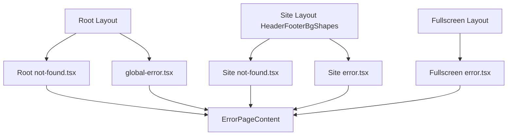

# Design Document

## Overview

**Purpose**: `not-found.tsx` / `error.tsx` / `global-error.tsx` の5ファイルを、`full-site-design` で確定済みのビジュアルトークン (色・フォント・余白) と背景図形に揃え、固有のページタイトルと noindex を持たせる。full-site-design のスコープ外として現行のプレーンな Tailwind パレットのまま残っていた領域を解消する。

**Users**: サイト訪問者が誤ったURLへアクセスした場合、または表示中に例外が発生した場合に、この5ファイルのいずれかを目にする。

**Impact**: 5ファイルの JSX とメタデータ設定を全面的に書き換え、新規共有コンポーネント `error-page-content.tsx` を追加する。既存の `notFound()` 呼び出し元・Error Boundary の発火条件・データ取得ロジックは変更しない。

### Goals
- 404・エラー表示を、到達経路 (Header+Footer 付き / 自己完結) によらず同一のメッセージ・トーン・構成要素で統一する
- 各表示に固有のページタイトルを設定し、noindex にする
- 既存の復帰導線 (トップへ戻る / 再読み込み) を維持する

### Non-Goals
- 404・エラーの発生条件そのもの (HTTP ステータスコード制御、CMS 障害時のリトライ戦略) の設計
- 背景図形の生成ルール自体 (`bgshape-rules.md` / `place.py`) の変更。本 spec は Figma 上で確定した配置結果をコードへ反映するのみ
- `robots.ts` (robots.txt 生成) の変更

## Boundary Commitments

### This Spec Owns
- `src/app/not-found.tsx`、`src/app/(site)/not-found.tsx`、`src/app/(site)/error.tsx`、`src/app/(fullscreen)/error.tsx`、`src/app/global-error.tsx` の見た目・構成・メタデータ設定
- 新規共有コンポーネント `src/components/error-page-content.tsx`

### Out of Boundary
- `notFound()` を呼び出す各詳細ページ側のデータ取得・404 判定ロジック — 既存のまま
- Error Boundary の発火条件、CMS 障害時の HTTP ステータスコード — `full-site-design` design.md で「後続の spec で扱う」とされた領域全体であり、本 spec は UI のみを扱う
- 背景図形の生成ルール (`bgshape-rules.md`、`place.py`、`tex5/` 質感画像) — 既に別ツールで運用中。Figma 上のフレームへ確定済み配置を反映するところまでが対象
- `full-site-design` が確定した色・フォント・spacing トークンの定義自体 (`tailwind.config.ts`、`globals.css`) — 参照のみで変更しない
- `frontend/src/app/robots.ts` (robots.txt 生成)

### Allowed Dependencies
- `frontend/tailwind.config.ts` / `globals.css` のトークン (`color/*`、LINE Seed JP)
- `frontend/src/components/header.tsx`、`footer.tsx`、`background-shapes.tsx` — `(site)/layout.tsx` 経由で利用。変更しない
- `frontend/src/lib/page-metadata.ts` の `buildPageMetadata` — 変更しない
- `frontend/src/lib/site-metadata.ts` の `getSiteMetadata` — 変更しない

### Revalidation Triggers
- `full-site-design` のトークン変更 — `error-page-content.tsx` の配色・フォント指定を再確認する
- `buildPageMetadata` の契約変更 — 2 つの `not-found.tsx` の `generateMetadata` 呼び出しに影響する
- `(site)/layout.tsx` / `(fullscreen)/layout.tsx` の構成変更 (Header/Footer/BackgroundShapes の有無・順序) — 本 spec が前提とする「到達経路ごとの外枠」が崩れる

## Architecture

### Existing Architecture Analysis
- `(site)/layout.tsx` は `<Header>` → `<BackgroundShapes>` → `<main>{children}</main>` → `<Footer>` の順で描画する。`BackgroundShapes` は props を取らず `usePathname()` と DOM 実測だけで自身の配置を決めるため、`(site)` 配下に置かれたページは何もしなくても Header・Footer・背景装飾が揃う
- `(fullscreen)/layout.tsx` は `<div>{children}</div>` のみで、Header・Footer・BackgroundShapes を持たない (構内マップ等、全画面表示を優先する既存方針)
- ルート `layout.tsx` は `(site)`/`(fullscreen)` いずれのグループにも属さない到達経路 (存在しない任意の URL、ルートレベルの例外) で使われる

### Architecture Pattern & Boundary Map



**Architecture Integration**:
- 選択パターン: 表示内容を単一の共有コンポーネント `ErrorPageContent` に集約し、5ファイルはそれぞれの外枠 (Header/Footer 有無、`<title>`/`<meta>` の付け方) だけを担当する
- ドメイン境界: 「外枠 (到達経路依存)」と「中身 (404/エラーの2バリエーション)」を分離する。外枠は既存の `(site)`/`(fullscreen)`/ルート layout がそのまま担い、本 spec は中身の実装に専念する
- 既存パターンの維持: `notFound()`・Error Boundary の発火条件、`(site)/layout.tsx` の Header/BackgroundShapes/Footer 構成はすべて既存のまま
- 新規コンポーネントの理由: 404 用 2 ファイル・エラー用 3 ファイルがそれぞれ同一の見出し・説明文・導線パターンを共有するため (要件 1.5)。共有化しない場合、Figma のトークンが変わるたびに 5 箇所を個別修正することになりドリフトしやすい
- Steering 準拠: Edge Runtime 制約 (Node.js 専用 API 不使用) を維持。`error-page-content.tsx` はブラウザ API のみを使う

### Technology Stack

| Layer | Choice / Version | Role in Feature | Notes |
|-------|------------------|------------------|-------|
| Frontend | Next.js App Router (既存) | `not-found.tsx`/`error.tsx`/`global-error.tsx` の規約に従う | 新規依存なし |
| Frontend | React 19 (既存) | `error.tsx`/`global-error.tsx` (Client Component) で `<title>`/`<meta>` をレンダー内に直書きし、head へ自動反映させる | `generateMetadata` が使えない Client Component 向けの標準機能 |
| Styling | Tailwind CSS v4 + `tailwind.config.ts` トークン (既存) | `color/warning`、`color/text`、`color/gray-500` 等を適用 | `full-site-design` で確定済み |

## File Structure Plan

### Directory Structure
```
frontend/src/
├── app/
│   ├── not-found.tsx                # Modified: 自己完結外枠 + ErrorPageContent(variant="not-found") + generateMetadata
│   ├── global-error.tsx             # Modified: 自己完結外枠 (html/body 自前) + ErrorPageContent(variant="error") + <title>/<meta>
│   ├── (site)/
│   │   ├── not-found.tsx            # Modified: Site Layout 経由で Header/Footer/BackgroundShapes 自動付与 + ErrorPageContent(variant="not-found") + generateMetadata
│   │   └── error.tsx                # Modified: 同上 + ErrorPageContent(variant="error") + <title>/<meta>
│   └── (fullscreen)/
│       └── error.tsx                # Modified: 自己完結外枠 + ErrorPageContent(variant="error") + <title>/<meta>
└── components/
    └── error-page-content.tsx       # New: 404/エラー共通の見出し・説明文・導線
```

### Modified Files
- `src/app/not-found.tsx` — 外枠を自己完結レイアウト (Header/Footer に依存しない中央揃え) に変更し、`ErrorPageContent(variant="not-found")` を配置。`generateMetadata` を新設
- `src/app/(site)/not-found.tsx` — 外枠を Header/Footer 付きレイアウトに変更 (実体は `(site)/layout.tsx` 側で自動付与されるため、本ファイルは中央揃えのコンテナのみ持てばよい)。`ErrorPageContent(variant="not-found")` を配置。`generateMetadata` を新設
- `src/app/(site)/error.tsx` — 同様に外枠を整え、`ErrorPageContent(variant="error")` を配置。`<title>`/`<meta name="robots">` を直書き
- `src/app/(fullscreen)/error.tsx` — 自己完結レイアウトのまま、`ErrorPageContent(variant="error")` を配置。`<title>`/`<meta name="robots">` を直書き
- `src/app/global-error.tsx` — `<html>`/`<body>` の自前構造は維持しつつ、内部に `ErrorPageContent(variant="error")` を配置。`<title>`/`<meta name="robots">` を直書き

## Requirements Traceability

| Requirement | Summary | Components | Interfaces | Flows |
|-------------|---------|-------------|------------|-------|
| 1.1, 1.5 | トークン準拠・到達経路によらない構成の一貫性 | ErrorPageContent | Props | - |
| 1.2 | Site Layout 経由の Header/Footer/背景装飾 | `(site)/not-found.tsx`, `(site)/error.tsx` | - | - |
| 1.3 | Fullscreen Layout の外枠 | `(fullscreen)/error.tsx` | - | - |
| 1.4 | Root Layout のみの自己完結スタイル | `not-found.tsx`, `global-error.tsx` | - | - |
| 2.1, 2.2, 2.3 | 固有タイトル | `not-found.tsx` ×2 (`generateMetadata`), `error.tsx`×2/`global-error.tsx` (`<title>`) | Metadata / JSX | - |
| 2.4 | noindex | 5ファイル全て | `robots` フィールド / `<meta>` | - |
| 2.5 | `notFound()` 時のタイトル優先 | `(site)/not-found.tsx` | `generateMetadata` | - |
| 3.1 | トップへ戻るリンク | ErrorPageContent (variant="not-found") | Props | - |
| 3.2 | 再読み込み手段 | ErrorPageContent (variant="error") | `onReset` callback | - |

## Components and Interfaces

| Component | Domain/Layer | Intent | Req Coverage | Key Dependencies (P0/P1) | Contracts |
|-----------|--------------|--------|---------------|---------------------------|-----------|
| ErrorPageContent | UI (共有) | 404/エラーの見出し・説明文・導線を出し分けて描画する | 1.1, 1.5, 3.1, 3.2 | なし | State |
| `not-found.tsx` ×2 | UI / Metadata | 外枠 + `ErrorPageContent` 配置 + タイトル/noindex 設定 | 1.2, 1.4, 2.1, 2.4, 2.5 | ErrorPageContent (P0), `buildPageMetadata` (P0) | API (Metadata) |
| `error.tsx` ×2 / `global-error.tsx` | UI | 外枠 + `ErrorPageContent` 配置 + `<title>`/`<meta>` 直書き | 1.2, 1.3, 1.4, 2.2, 2.3, 2.4 | ErrorPageContent (P0) | State |

### UI

#### ErrorPageContent

| Field | Detail |
|-------|--------|
| Intent | 404/エラーの見出し・説明文・導線を、外枠 (Header/Footer 有無) に依存せず描画する |
| Requirements | 1.1, 1.5, 3.1, 3.2 |

**Responsibilities & Constraints**
- `variant="not-found"`: `color/warning` の "404"、見出し「ページが見つかりません」、説明文、`color/text` の下線テキストリンクによるトップページへの導線を描画する
- `variant="error"`: 見出し「エラーが発生しました」、説明文、`onReset` を呼ぶ再読み込みボタンを描画する
- 外枠 (Header/Footer の有無、外側の padding) は呼び出し元ページが担当し、本コンポーネントは中央揃えのコンテンツ列のみを描画する
- `'use client'` — `variant="error"` のボタンが `onClick` (呼び出し元から渡される `reset`) を必要とするため

**Dependencies**
- Inbound: `not-found.tsx` ×2, `error.tsx` ×2, `global-error.tsx` — 描画呼び出し (P0)
- Outbound: なし
- External: なし

**Contracts**: Service [ ] / API [ ] / Event [ ] / Batch [ ] / State [x]

##### State Management
- State model: Props のみで完結するステートレスな表示コンポーネント (内部 state を持たない)
- Persistence & consistency: 該当なし
- Concurrency strategy: 該当なし

```typescript
export type ErrorPageContentProps =
  | { variant: 'not-found' }
  | { variant: 'error'; onReset: () => void };

export function ErrorPageContent(props: ErrorPageContentProps): JSX.Element;
```

**Implementation Notes**
- Integration: `not-found.tsx` (Server Component) から Client Component である `ErrorPageContent` を呼び出すのは Next.js の制約上問題ない (逆方向のみ不可)
- Validation: variant の分岐は TypeScript の判別可能ユニオンで網羅する (`onReset` は `variant="error"` のときのみ必須)
- Risks: なし (副作用を持たない表示コンポーネントのため)

## Error Handling

### Error Strategy
本 spec は「エラー表示そのものの見た目」を扱う。`notFound()` の呼び出し元・Error Boundary の発火条件は変更しないため、エラーの分類・復旧ロジック自体はこの spec のスコープ外 (Boundary Commitments 参照)。

### Error Categories and Responses
- **404 (Not Found)**: `not-found.tsx` ×2 が `ErrorPageContent(variant="not-found")` を表示し、トップページへの復帰導線を提供する
- **予期しない例外**: `error.tsx` ×2 / `global-error.tsx` が `ErrorPageContent(variant="error")` を表示し、`reset()` による再読み込み手段を提供する

## Testing Strategy

- **Unit Tests**:
  - `ErrorPageContent` が `variant="not-found"` で "404"・見出し・説明文・戻るリンクを描画する
  - `ErrorPageContent` が `variant="error"` で見出し・説明文・再読み込みボタンを描画し、クリックで `onReset` が呼ばれる
  - 2つの `not-found.tsx` の `generateMetadata` が固有タイトルと `robots: {index:false}` を返す
- **Integration Tests**:
  - `(site)/not-found.tsx` / `(site)/error.tsx` が `(site)/layout.tsx` 配下でレンダリングされた際に Header・Footer が存在する
- **E2E/UI Tests** (実機確認、Next.js dev 環境):
  - 存在しない URL へアクセスして対応する `not-found.tsx` が表示され、ブラウザタブのタイトルが固有のものになっている
  - 詳細ページ (お知らせ/トピック/企画/固定ページ) で存在しない ID にアクセスし、`(site)/not-found.tsx` 側のタイトルが優先されることを確認する (research.md のリスク参照)
