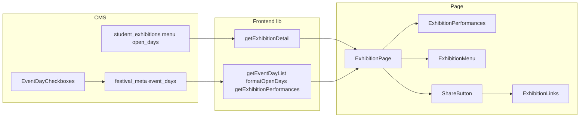
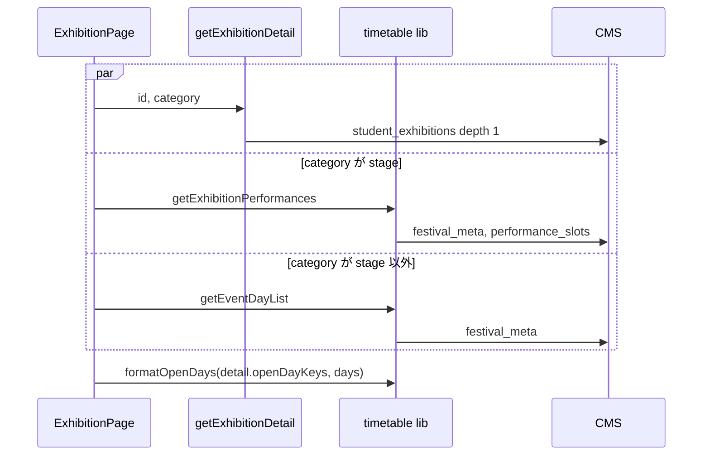

# Design Document

## Overview
**Purpose**: 学生企画に「メニュー・価格表」と「出店日」を持たせ、企画詳細ページのヘッダー情報列 (画像右の列) に表示する。あわせてヘッダー情報列を「いつ・どこで・何を」がまとまる並びに組み直す。
**Users**: 出展者と実行委員が管理画面でメニュー・出店日を入力し、来場者が企画詳細ページで確認する。
**Impact**: `student_exhibitions`にarrayフィールドを2つ追加する (テーブル追加のみ)。企画詳細ページでは、ステージの出演時間が本文側の独立セクションからヘッダー情報列へ移り、共有ボタンとリンクが1行にまとまり、「リンク」の小見出しがなくなる。

### Goals
- 管理画面で品名・価格の行と出店日を入力できる (要件1・2)
- 企画詳細ページのヘッダー情報列に、場所 → 出店日または出演時間 → メニュー → [共有][リンク…] の順で表示する (要件3〜5)
- 既存データ・既存フィールドを変えない追加だけのマイグレーションで反映する (要件6)

### Non-Goals
- 企画一覧・カード・構内マップ・トップページへの表示、メニュー・出店日による絞り込み
- 営業中判定などの時刻計算、出演枠のデータ・内容の変更
- 協賛企業への同項目追加
- 出店日の保存値を開催日程の範囲に制限するサーバー側検証 (範囲外は表示で除外する。要件4.4)

## Boundary Commitments

### This Spec Owns
- `student_exhibitions.menu` / `student_exhibitions.open_days`の定義、マイグレーション、価格の空値正規化
- 企画詳細ページのヘッダー情報列の並びと、その中の出店日の行・出演時間の行・メニュー欄・共有とリンクの行の見た目
- `ExhibitionDetail`への`menu` / `openDayKeys`の追加と、出店日のラベル解決 (`formatOpenDays`)

### Out of Boundary
- 開催日程 (`festival_meta.event_days`) の定義と、出演枠の取得・並び順・ラベル解決の規則 (既存の`getExhibitionPerformances` / `toDays`をそのまま使う)
- 学生企画のアクセス制御 (`accessFor('student_exhibitions')`) と公開後の編集禁止 (`guardPublishedExhibition`)。新フィールドは既存の規則に従うだけで、規則は変えない
- 紹介・場所 (地図) セクションの内容

### Allowed Dependencies
- CMS: `useEventDays` / `event-day-options.ts` (`cms/src/components/`)、`@payloadcms/ui`の`useField`・`CheckboxInput`、Payloadのフィールド単位フック
- Frontend: `cms`クライアント (`lib/cms.ts`)、`toDays` / `toJstDateKey` / `formatEventDayLabel`、`icons.tsx`の`createIcon`
- 依存方向: `cms-types` → `lib/event-day` → `lib/timetable` / `lib/exhibitions` → `components` → `app/.../page.tsx`。componentsからlibの取得関数を呼ばない

### Revalidation Triggers
- 開催日程の保存形式 (`start_at`) や、出演枠の暦日キーの規約 (`toJstDateKey`) が変わる
- `eventDayValue`の保存形式 (JST暦日のUTC正午) が変わる (出演枠の`event_date`と出店日で共有している)
- 企画詳細ページのヘッダー情報列に別の行が加わる

## Architecture

### Existing Architecture Analysis
- CMS: コレクション定義を変更 → `pnpm migrate:create`でマイグレーション生成 → `pnpm generate:types`で`cms/src/payload-types.ts`と`frontend/src/cms-types.ts`を更新、が唯一の変更経路
- 出演枠は開催日を`event_date` (date、JST暦日のUTC正午) で保持し、開催日程とは暦日キーで突き合わせる。管理画面は`EventDaySelect`で開催日程から選ぶ
- 企画詳細ページはサーバーコンポーネントで、企画・区画・出演枠を`Promise.all`で並行取得する。区画・出演枠の取得失敗はページ全体のエラーにせず、該当部分だけを出さない

### Architecture Pattern & Boundary Map



**Architecture Integration**:
- Selected pattern: 既存の「libがCMSの生データを表示用の型へ変換し、ページが組み立てる」構成をそのまま拡張する
- Existing patterns preserved: 暦日キーでの開催日の突き合わせ、取得失敗の部分縮退、Material Symbolsフォントのアイコン
- New components rationale: `ExhibitionMenu`だけを新設する (表の描画をpage.tsxに抱えるとページが肥大するため)。出店日の行は場所の行と同じ1行の`<p>`なのでpage.tsxに直接置く

### Technology Stack

| Layer | Choice / Version | Role in Feature | Notes |
|-------|------------------|-----------------|-------|
| Frontend | Next.js 15 App Router / React 19 | 企画詳細ページの表示 | 追加依存なし |
| Backend | Payload 3.88.0 | フィールド定義・価格の正規化フック | 追加依存なし |
| Data | Postgres 16 (`@payloadcms/db-postgres`) | array用の子テーブル2つ | 追加のみ |
| Icons | Material Symbols Sharp (Google Fontsサブセット) | `calendar_month` / `schedule` | サブセット一覧に追加 |

## File Structure Plan

### Modified Files
- `cms/src/collections/student-exhibitions.ts` — `menu` / `open_days`の追加、`price`の空値正規化フック
- `cms/src/collections/student-exhibitions.test.ts` — 新フィールドの定義と正規化の単体テスト
- `cms/src/components/event-day-options.ts` (+ `.test.ts`) — 複数選択用の選択肢を作る`buildEventDayCheckOptions`を追加
- `cms/src/app/(payload)/admin/importMap.js` — `pnpm generate:importmap`で`EventDayCheckboxes`のエントリを追加
- `cms/src/migrations/<timestamp>_student_exhibitions_menu_open_days.ts` (+ `.json`、`index.ts`登録) — `pnpm migrate:create`で生成
- `cms/src/payload-types.ts` / `frontend/src/cms-types.ts` — `pnpm generate:types`で再生成
- `frontend/src/lib/exhibitions.ts` — `ExhibitionDetail`に`menu` / `openDayKeys`を追加し、`getExhibitionDetail`で詰める
- `frontend/src/lib/timetable.ts` — `getEventDayList`と`formatOpenDays`を追加 (`toDays`を共用)
- `frontend/src/components/icons.tsx` — `CalendarMonthIcon` / `ScheduleIcon`を追加
- `frontend/src/app/layout.tsx` — `MATERIAL_SYMBOLS_ICON_NAMES`に`calendar_month` / `schedule`を追加 (アルファベット順を保つ)
- `frontend/src/components/exhibition-performances.tsx` — 本文セクションからヘッダー情報列の行の見た目へ作り替える
- `frontend/src/components/exhibition-links.tsx` — 「リンク」の小見出しと外側のdivを外し、`<ul>`だけを返す
- `frontend/src/components/share-button.tsx` — `children`を受け取り、ボタンと同じ行に並べる
- `frontend/src/app/(site)/exhibitions/[id]/[category]/page.tsx` — ヘッダー情報列の並び替え、出店日の行・メニュー欄の追加、本文側の出演時間セクションの削除
- 各テスト (`page.test.tsx`、`exhibition-performances.test.tsx`、`exhibition-links` / `share-button`のテスト、`timetable.test.ts`、`exhibitions`のテスト、`icons.test.tsx`)

### New Files
- `cms/src/components/EventDayCheckboxes.tsx` — 出店日の管理画面用Field。開催日程の日をチェックボックスで並べる
- `frontend/src/components/exhibition-menu.tsx` (+ `.test.tsx`) — メニュー欄 (小見出し「メニュー」と品名・価格の2列の表)

## System Flows



- 出演時間と出店日はカテゴリで排他に取得する。ステージのページは出演時間だけ、それ以外のページは出店日だけを出す (要件4.7)
- `getEventDayList`が失敗したときは`null`を返し、出店日の行だけを出さない (要件4.6)

## Requirements Traceability

| Requirement | Summary | Components | Interfaces |
|-------------|---------|------------|------------|
| 1.1, 1.2, 1.3 | メニュー行の保持 | StudentExhibitions `menu` | フィールド定義 |
| 1.4, 1.5, 2.4, 2.5 | ロール別の編集範囲 | 既存`accessFor` / `guardPublishedExhibition` | 変更なし (新フィールドにフィールド単位のaccessを付けない) |
| 2.1, 2.2, 2.3 | 出店日の選択・保持 | StudentExhibitions `open_days`、EventDayCheckboxes | フィールド定義 |
| 3.1, 3.2 | 価格がnullの行を除外 | 価格の正規化フック、`getExhibitionDetail` | `ExhibitionMenuItem` |
| 3.3, 3.4, 3.6 | メニュー欄の表示・位置 | ExhibitionMenu、ExhibitionPage | `ExhibitionMenuProps` |
| 3.5, 4.8 | どのカテゴリURLでも同内容 | `getExhibitionDetail` (カテゴリに依存せず企画単位で詰める) | `ExhibitionDetail` |
| 4.1, 4.2, 4.3, 4.4, 4.5 | 出店日の行 | `formatOpenDays`、ExhibitionPage | `formatOpenDays` |
| 4.6 | 開催日程の取得失敗 | `getEventDayList` | 戻り値`null` |
| 4.7 | ステージでは出さない | ExhibitionPage | カテゴリ分岐 |
| 5.1 | 情報列の並び | ExhibitionPage | — |
| 5.2, 5.3, 5.4, 5.5 | 出演時間の移設 | ExhibitionPerformances、ExhibitionPage | 既存`ExhibitionPerformance` |
| 5.6, 5.7, 5.8 | 共有とリンクの1行化 | ShareButton、ExhibitionLinks | `ShareButtonProps.children` |
| 6.1, 6.2, 6.3 | 追加だけのマイグレーション | マイグレーション | — |
| 6.4 | 空のとき出さない | ExhibitionMenu、ExhibitionPage | — |
| 6.5 | 型の再生成 | `cms-types.ts` | — |

## Components and Interfaces

| Component | Layer | Intent | Req Coverage | Key Dependencies |
|-----------|-------|--------|--------------|------------------|
| StudentExhibitions (menu / open_days) | CMS | フィールド定義と価格の正規化 | 1, 2, 3.1, 3.2, 6.1〜6.3 | EventDayCheckboxes (P0) |
| EventDayCheckboxes | CMS (admin UI) | 出店日のチェックボックス入力 | 2.1, 2.2 | useEventDays (P0) |
| getExhibitionDetail | Frontend lib | 企画単位でメニュー・出店日キーを詰める | 3.1, 3.2, 3.5, 4.8 | cms (P0) |
| getEventDayList / formatOpenDays | Frontend lib | 開催日程の取得と出店日ラベルの組み立て | 4.2〜4.6 | toDays (P0) |
| ExhibitionMenu | UI | メニュー欄 | 3.3, 3.4, 3.6, 6.4 | — |
| ExhibitionPerformances | UI | 出演時間の行 | 5.2〜5.5 | icons (P1) |
| ExhibitionLinks | UI | リンクのアイコン群 | 5.7 | — |
| ShareButton | UI | 共有ボタンと行の組み立て | 5.6, 5.8 | — |
| ExhibitionPage | UI (page) | 取得と情報列の並び | 4.1, 4.7, 5.1 | 上記すべて |

### CMS

#### StudentExhibitions: `menu` / `open_days`

| Field | Detail |
|-------|--------|
| Intent | メニュー行と出店日を学生企画に持たせる |
| Requirements | 1.1〜1.5, 2.1〜2.5, 3.1, 3.2, 6.1〜6.3 |

**フィールド定義** (`links`の直後に追加する)

| name | type | 配下のフィールド | admin | 備考 |
|------|------|------------------|-------|------|
| `menu` | array (label「メニュー」) | `name`: text、required、maxLength 255、label「品名」<br>`price`: text、maxLength 255、label「価格」 | description「価格が空の行はサイトに表示されません。」 | 行の順序が表示順 (要件1.1) |
| `open_days` | text、`hasMany: true` (label「出店日」) | なし | `admin.components.Field: './components/EventDayCheckboxes.tsx'` | 値は`eventDayValue`の文字列 (JST暦日のUTC正午、例`2026-11-14T12:00:00.000Z`) の配列。出演枠の`event_date`と同じ表記 |

- どちらもトップレベルは任意入力 (`required`なし、`minRows`なし)。`menu`の行の中の`required`は「行を足したら品名は埋める」の意味で、行が無い状態の保存は妨げない (要件6.3)
- `open_days`を`text`の`hasMany`にするのは、チェックボックスの状態を文字列の配列1つで持てるため。arrayにするとチェックの付け外しを行の追加・削除に置き換える必要があり、selectは選択肢が静的でDBのenumになるため開催日程に追従できない (比較は`research.md`)
- `menu.name`の必須化は、品名の無い行が価格だけで表示されるのを防ぐため。要件1.2 (自由記述) は満たす
- フィールド単位の`access`は付けない。コレクション単位の`accessFor('student_exhibitions')`と`guardPublishedExhibition`がそのまま効く (要件1.4, 1.5, 2.4, 2.5)
- `admin.condition`は付けない。カテゴリを問わず入力できる (要件1.3, 2.3)

**価格の正規化** (`price`の`hooks.beforeValidate`)
- 入力: フィールドの値 (`unknown`)
- 出力: 文字列で、空白を除くと空なら`null`。それ以外は受け取った値をそのまま返す (前後の空白も削らない。要件3.4)
- 根拠: Payload 3.88.0はtextの空値を補正しない。管理画面で一度も触らない価格は`NULL`、入力してから消した価格は`''`で保存される (`research.md`)。保存時に`null`へ寄せ、表示側の判定を「nullでない」だけにする

#### EventDayCheckboxes (`cms/src/components/EventDayCheckboxes.tsx`)

| Field | Detail |
|-------|--------|
| Intent | 開催日程の日をチェックボックスで並べ、付けた日を`open_days`に保存する |
| Requirements | 2.1, 2.2 |

- クライアントコンポーネント (`TextFieldClientComponent`)。`useField<string[]>({ path })`で値を読み書きし、開催日程は既存の`useEventDays`で取得する
- 選択肢は`buildEventDayCheckOptions(days, value)`で作る。開催日程の各日を暦日順に並べ、ラベルは既存の`buildEventDayOptions`と同じ (`表示ラベル(M/D)`、ラベル未設定なら`M/D`)。要件2.2
- チェックを付け外しすると、選択中の値の集合を暦日順に並べた配列を`setValue`する。全部外したら空配列
- 開催日程の読み込み中は何も出さない。開催日程が0件なら`EventDaySelect`と同じく「祭基本情報で開催日程を登録してください」と出す
- ラベルはフィールドの`label` (「出店日」) を使う。説明文は付けない

**開催日程に無い日がすでに選ばれている場合**
- その値も「M/D(開催日程外)」のラベルでチェック済みのまま並べる (既存の`buildEventDayOptions`が単一選択で出している表記と同じ)。暦日順に開催日程の日と混ぜて並べる
- チェックを外すと値から消え、次の描画で選択肢からも消える。黙って消したり保存時に自動で除いたりはしない (担当者が気付かないまま選択が失われるのを避けるため)。サイトでは要件4.4どおり表示しない

`buildEventDayCheckOptions(days: readonly EventDay[], selected: readonly unknown[]): (EventDayOption & { readonly outOfRange: boolean })[]`
- 開催日程の日に加え、`selected`のうち開催日程に無く`eventDayValue`で解釈できる値を「(開催日程外)」として含める。解釈できない値は含めない。値の重複は1つにまとめる

**importMapへの登録**
1. コレクション定義に`admin.components.Field`を書いたあと、`cms/`で`pnpm generate:importmap`を実行する。このスクリプトはS3・Authentikのダミー環境変数を付けて動くため、Zitadel/S3のエントリを保ったまま`EventDayCheckboxes`のエントリが1つ加わる
2. `git diff cms/src/app/(payload)/admin/importMap.js`で、差分が`EventDayCheckboxes`のimport 1行とマップの1行だけであることを確かめる
3. ローカルで`make cms-worktree`等を起動すると、importMapからZitadel/S3のエントリが消える差分が出る。これはコミットしない。`git restore cms/src/app/(payload)/admin/importMap.js`で戻し、手順1をやり直してから手順2で確かめる (未コミットの`EventDayCheckboxes`のエントリも`git restore`で消えるため)

**Implementation Notes**
- Risks: 開催日そのものを別の日へ変えると、その日を選んでいた出店日は開催日程外になり、サイトでは表示されなくなる。管理画面では「(開催日程外)」として残るので外して選び直す (出演枠と同じ運用)
- サーバー側で値を開催日程に制限する検証は付けない (Non-Goals)。解釈できない値はフロントエンドが読み飛ばす

### Frontend lib

#### getExhibitionDetail (`lib/exhibitions.ts`)

```typescript
export interface ExhibitionMenuItem {
  readonly name: string;
  readonly price: string;
}

export interface ExhibitionDetail extends ExhibitionCardSummary {
  // 既存フィールドは変更しない
  /** CMS の並び順。価格が null の行は含まない */
  readonly menu: readonly ExhibitionMenuItem[];
  /** 出店日の JST暦日キー ('YYYY-MM-DD')。範囲外・重複を含み得る */
  readonly openDayKeys: readonly string[];
}
```
- Postconditions: `menu`は`price != null`の行だけ (要件3.1, 3.2)。`openDayKeys`は`open_days`の値のうち日時として解釈できるものだけを`toJstDateKey`で変換したもの
- カテゴリに依存しない値を詰める (要件3.5, 4.8)

#### getEventDayList / formatOpenDays (`lib/timetable.ts`)

```typescript
/** 開催日程を暦日キー順の TimetableDay にする。取得失敗は null (例外にしない) */
export function getEventDayList(): Promise<readonly TimetableDay[] | null>;

/** 出店日を開催日程の順にラベルで「・」連結する。表示対象が無ければ null */
export function formatOpenDays(
  openDayKeys: readonly string[],
  days: readonly TimetableDay[],
): string | null;
```
- `getEventDayList`は`cms.findGlobal('festival_meta')`の結果に既存の`toDays`を適用する。ラベルは`label || formatEventDayLabel(start_at)` (要件4.3)
- `formatOpenDays`は`days`を順に走査し、`openDayKeys`に含まれる日のラベルだけを残す。これで開催日程の順 (要件4.2)、範囲外の除外 (要件4.4)、重複の除去が同時に満たされる。0件なら`null` (要件4.5)

### UI

ヘッダー情報列の並び (PC・SP共通)。Figma (fileKey `0kWDqHsLr6xE8b4FFgR1Zx`) の参照ノード:

| 例 | フレーム | 出店日の行 | 出演時間の行 | メニュー | 共有とリンクの行 |
|----|----------|------------|--------------|----------|------------------|
| ステージ (PC) | `2:468` | — | `802:695` | — | `803:714` |
| 出店 (PC) | `802:731` | `802:752` | — | `802:759` | `803:739` |
| SP | `2:531` | `804:700` | — | — | — |

実装時は各ノードをMCPで実測し、余白・幅・文字の大きさを合わせる。

```
[タグ]
企画名 (h1)
団体名
(location_on) 場所
(calendar_month) 1日目・2日目        ← ステージ以外のページ
(schedule) 1日目 10:00〜10:30 メインステージ  ← ステージのページ
           …
           タイムテーブルを見る
メニュー (小見出し)
品名 | 価格
[共有] [X] [Instagram] [🔗]
```

#### ExhibitionPage (`page.tsx`)
- 取得: 既存の`Promise.all`に、`category !== 'stage'`のときだけ`getEventDayList()`を加える。`category === 'stage'`のときの`getExhibitionPerformances`は現行どおり
- 出店日の行: `openDaysLabel = days ? formatOpenDays(exhibition.openDayKeys, days) : null`。値があるときだけ、場所の行と同じクラス (`flex items-center gap-1 text-sm leading-[140%] font-medium text-gray-600`) で`CalendarMonthIcon` (20px、`text-text`) + テキストを出す
- 出演時間の行: `performancesResult?.kind === 'loaded'`のとき`ExhibitionPerformances`を場所の行の直後に置く。紹介の後ろのセクションは削除する (要件5.4)
- メニュー: `<ExhibitionMenu items={exhibition.menu} />`を出店日・出演時間の行の直後に置く
- 最下段: `<ShareButton title url><ExhibitionLinks links={exhibition.links} /></ShareButton>`

#### ExhibitionPerformances (`components/exhibition-performances.tsx`)
- Propsは現行どおり (`performances: readonly ExhibitionPerformance[]`)。0件なら`null`
- 見た目: 場所の行と同じ文字 (`text-sm leading-[140%] font-medium text-gray-600`)、`ScheduleIcon` (20px、`text-text`) を先頭に置き、右側に各出演枠の行 (`{dayLabel} {開始}〜{終了} {stageName}`、`tabular-nums`) と「タイムテーブルを見る」リンク (`/timetable`) を縦に並べる。アイコンは1行目に揃える (`items-start`)
- 見出し (h2「出演時間」)・区切り線は持たない

#### ExhibitionMenu (`components/exhibition-menu.tsx`)

```typescript
export interface ExhibitionMenuProps {
  readonly items: readonly ExhibitionMenuItem[];
}
```
- 0件なら`null` (要件3.3, 6.4)
- 小見出し「メニュー」は情報列の小見出しの体裁の`<p>`。Figma `802:759`では12px Regular (現行の「リンク」ラベルは`font-medium`だが、Figmaに合わせてRegularにする)
- 表は`<table>`の2列 (品名・価格)。価格は右寄せ・`tabular-nums`、文字列は加工しない (要件3.4)。列見出し行は持たない (小見出しで内容が分かるため、`<caption>`も付けない)。表の幅・行間はFigma `802:759`を実測して合わせる (出店の例では品名列と価格列を合わせて約280px、罫線なし)

#### ExhibitionLinks (`components/exhibition-links.tsx`)
- 「リンク」の小見出しと外側のdivを外し、`<ul aria-label="リンク" className="flex flex-wrap items-center gap-2">`だけを返す (要件5.7)。0件なら`null`
- 各リンクの見た目・`aria-label`は現行どおり

#### ShareButton (`components/share-button.tsx`)

```typescript
export interface ShareButtonProps {
  readonly title: string;
  readonly url: string;
  /** ボタンの右に同じ行で並べる要素 */
  readonly children?: React.ReactNode;
}
```
- ボタンと`children`を`flex flex-wrap items-center gap-2`の1行に並べ、共有ボタンを先頭にする (要件5.6)。`children`が無ければボタンだけ (要件5.8)
- コピー完了・手動コピーの通知はその行の下に出す (手動コピーのURL入力欄が行の全幅を使えるようにするため)
- `children`はサーバーコンポーネントから渡すノードで、クライアントコンポーネント内でもそのまま描画できる

#### Icons (`components/icons.tsx`, `app/layout.tsx`)
- `CalendarMonthIcon = createIcon('icon-calendar-month', 'calendar_month')`、`ScheduleIcon = createIcon('icon-schedule', 'schedule')` (線画、FILL 0)
- `MATERIAL_SYMBOLS_ICON_NAMES`に同名を追加する。サブセットに無い名前はフォントに含まれず、リガチャ名の文字列がそのまま表示される

## Data Models

### Physical Data Model
`pnpm migrate:create student_exhibitions_menu_open_days`で生成する。想定されるテーブル (Payloadの既定形。列名は生成物で確かめる):

| テーブル | 列 |
|----------|----|
| `student_exhibitions_menu` | `_order` integer NOT NULL, `_parent_id` integer NOT NULL (FK → `student_exhibitions.id` ON DELETE cascade), `id` varchar PK, `name` varchar NOT NULL, `price` varchar |
| `student_exhibitions_texts` | `id` serial PK, `order` integer NOT NULL, `parent_id` integer NOT NULL (FK → `student_exhibitions.id` ON DELETE cascade), `path` varchar NOT NULL, `text` varchar。`open_days`の各値が`path = 'open_days'`の1行になる。学生企画にはまだtext hasManyが無いため新規作成になる |

- 各テーブルに並び順・親IDのインデックス (`_texts`は`path`にも)。`down`は2テーブルのDROPだけ
- 既存テーブル・列には触れない。既存の企画は子行0件の状態になる (要件6.2)
- `cms-schema-check`はトップレベルの削除・型変更・必須化・多重度変更だけを検出するため、新しいトップレベルのフィールド (`menu`のarray、`open_days`のtext hasMany) の追加は検出されない (要件6.1)

## Error Handling
- 開催日程の取得失敗: `getEventDayList`が`null`を返し、出店日の行だけを出さない (要件4.6)
- 出演枠の取得失敗: 現行どおり出演時間の行を出さない (要件5.5)
- 企画本体の取得失敗・不在: 現行どおり (変更なし)

## Testing Strategy
- **CMS単体** (`student-exhibitions.test.ts`): `menu`がarrayで配下の型・`required`が定義どおり、`open_days`がtextの`hasMany`で`EventDayCheckboxes`を指定している。`buildEventDayCheckOptions`が開催日程順に並べ、範囲外の値を「(開催日程外)」で含め、解釈できない値と重複を除く。`price`の正規化が`''`・空白のみ → `null`、`'¥300'`・`' ¥300 '` → そのまま、`null` / `undefined` → そのまま
- **CMSマイグレーション**: `cms-ci`のmigrateで適用できる。生成された`up`に2テーブルのCREATE以外 (特に`media.prefix`のDROP) が無い
- **管理画面の手動確認** (`make cms-worktree`): チェックの付け外しで保存・再読込後も状態が保たれる、開催日程外の値が「(開催日程外)」で表示され外せる、出展者ロールで自分の企画だけ編集できる
- **lib単体**: `formatOpenDays`の順序 (保存順に関係なく開催日程順)、範囲外の除外、重複の除去、0件で`null`、ラベル未設定時の代替表記。`getExhibitionDetail`が`price: null`の行を除き、並び順を保つ
- **コンポーネント**: `ExhibitionMenu`の0件で非表示・表の内容。`ExhibitionPerformances`が見出し無しで行とリンクを出す。`ExhibitionLinks`に「リンク」の文字が無い。`ShareButton`がchildrenをボタンの後ろに並べ、通知が行の外に出る
- **ページ** (`page.test.tsx`): 情報列の並び (場所 → 出店日/出演時間 → メニュー → 共有とリンク)、ステージのページで出店日を出さない、ステージ以外で出演時間を出さない、開催日程の取得失敗時に出店日だけ出ない、紹介の後ろに「出演時間」の見出しが無い

## Migration Strategy
1. コレクション定義を変更し`pnpm migrate:create student_exhibitions_menu_open_days`を実行、`index.ts`への登録を確認
2. 生成物から本件と無関係な差分 (`media.prefix`のDROP等) を除く
3. `pnpm generate:types`で`cms/src/payload-types.ts`と`frontend/src/cms-types.ts`を更新し、`pnpm generate:importmap`でimportMapを更新する (手順は「EventDayCheckboxes」のimportMapへの登録を参照)
4. ローカルで`make cms-worktree`と`make dev CMS=worktree`を使い、管理画面での入力と企画詳細ページの表示を確認する。起動で出たimportMapのZitadel/S3の差分はコミットせず`git restore`し、`pnpm generate:importmap`をやり直す
5. 本番はmainマージ後、ArgoCDのPreSync Jobが`payload migrate`を実行してからDeploymentを更新する。フロントエンドは新フィールドが無い (旧CMS) 応答でも`menu` / `open_days`を空として扱うため、CMSとフロントエンドの反映順は問わない
