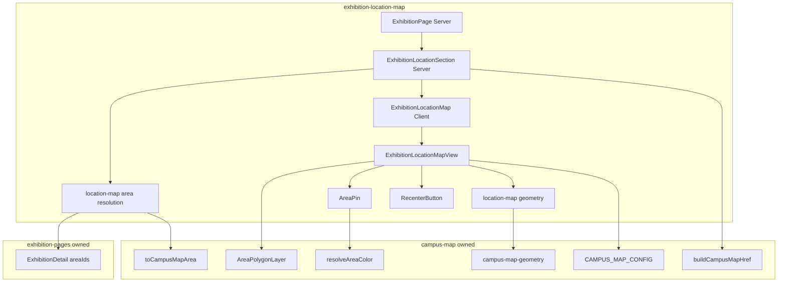
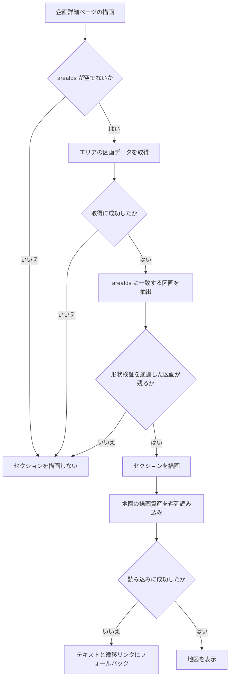
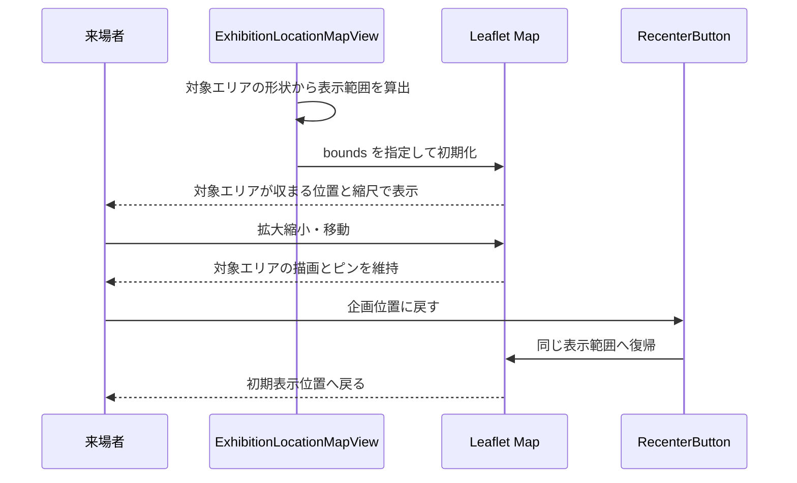

# Technical Design

## Overview

**Purpose**: 企画詳細ページに、その企画の開催場所をキャンパスマップ上で示す地図セクションを提供する。来場者は企画名と所在地テキストだけでは実際の位置を把握できず、構内マップページへ移って企画を探し直す必要があった。

**Users**: 一般来場者と学生が、企画詳細ページから会場内の位置を確認し、必要に応じて構内マップページへ移って周辺の企画を探す。

**Impact**: 企画詳細ページの末尾にセクションが一つ増える。CMS のコンテンツモデルは変更しない。`campus-map` が構築した地図基盤 (ポリゴン描画・色解決・設定値・タイル資産) を読み取り専用の依存として再利用する。

### Goals

- 企画の対象エリアを示す操作可能な地図を企画詳細ページ内に表示する
- 地図から構内マップページへ、対象エリアを選択した状態で遷移させる
- 対象エリアを解決できない企画、および地図資産の取得に失敗した場合でも企画詳細ページの本文を従来どおり表示する
- 地図資産の読み込みが企画詳細ページの初期表示をブロックしない

### Non-Goals

- 構内マップページ (`/map`) 自体の表示・操作・状態遷移の変更
- 地図タイル資産の生成、エリアポリゴンの描画規則、縮尺範囲・表示範囲の定数の再定義
- 企画詳細ページの URL 構造、所在地テキスト表記 (`resolveLocationForCategory`) の変更
- `student_exhibitions` / `stages` / `map_areas` のスキーマ変更
- 企画一覧ページへの地図表示の展開

## Boundary Commitments

### This Spec Owns

- 企画詳細ページ内の企画位置セクションの表示・操作・状態遷移
- 企画から対象エリアを解決する規則と、遷移先クエリに用いるエリアの選択規則
- 埋め込み文脈の地図コンテナ (高さ・初期表示範囲・コントロール構成)
- 複数の `PolygonGeometry` から地図の表示範囲を導く規則
- マップピンの描画規則 (形状・色・寸法・クリック可否)
- 「企画位置に戻す」操作の挙動
- 対象エリアを解決できない場合および地図資産の取得に失敗した場合のフォールバック表示
- `frontend/src/lib/campus-map.ts` へのエリア単独取得関数および `toCampusMapArea` の `export` 追加

### Out of Boundary

- 構内マップページ (`/map`) の表示・操作・状態遷移 — `campus-map`
- 地図タイル資産とその生成ワークフロー、タイルの配信パス — `campus-map`
- エリアポリゴンの描画規則、`map_areas.color` の色解決規則、`map_areas.geometry` の検証規則 — `campus-map`
- 地図の初期表示中心・縮尺範囲・表示範囲の上限を定める定数 — `campus-map`
- 企画詳細ページの URL 構造、所在地テキスト表記の規則、`ExhibitionDetail` の型定義 — `exhibition-pages`
- サイト全体のカラートークンとアイコンセット (`tailwind.config.ts` / `components/icons.tsx` / `components/sns-icon.tsx`) — `exhibition-pages`
- Service Worker の登録とキャッシュ戦略 — `pwa-offline`
- 下部ナビゲーションの実装 — `responsive-navigation`

`resolveLocationForCategory` はステージ企画の所在地をステージ名で表記し `area_id` を参照しない。本セクションのエリア解決はこれとは別系統であり、同関数のシグネチャと表記規則は変更しない。

### Allowed Dependencies

- `frontend/src/components/campus-map/area-polygon-layer.tsx` — props を変更せずインスタンス化する
- `frontend/src/lib/campus-map.ts` の `CampusMapArea` / `resolveAreaColor` / `buildCampusMapHref` / `CampusMapFilters`。加えて `toCampusMapArea` は private のため、本 spec がこれに `export` を追加し、エリアのみを取得する関数を新設する
- `frontend/src/lib/campus-map-geometry.ts` の `PolygonGeometry` / `parsePolygonGeometry` / `polygonCentroid`
- `frontend/src/lib/campus-map-config.ts` の `CAMPUS_MAP_CONFIG` / `MAP_ATTRIBUTION`
- `frontend/src/lib/exhibitions.ts` の `ExhibitionDetail` (`areaIds` を含む)。既存 export をそのまま読む
- `frontend/src/components/icons.tsx` — アイコンセットは `exhibition-pages` が所有する。本 spec は `createIcon` ファクトリを読み、塗りつぶし形状の位置アイコンを一件追加する。ファクトリのシグネチャと既存アイコンは変更しない
- `frontend/tailwind.config.ts` のカラートークン
- Payload の `map_areas` の公開 READ

制約: `campus-map.ts` / `campus-map-geometry.ts` / `exhibitions.ts` / `icons.tsx` の既存 export のシグネチャを変更しない。`campus-map.ts` への変更は `toCampusMapArea` の `export` 追加と関数の新規追加のみ、`icons.tsx` への変更はアイコン一件の追加のみに限る。`CampusMapView` / `CampusMapScreen` / `MapZoomControl` は読まず、変更もしない。

### Revalidation Triggers

- `ExhibitionCardSummary.areaIds` の要素順序または意味の変更 → 本 spec の遷移先エリア選択が破綻するため再検証を要する
- `CampusMapFilters` および `parseCampusMapQuery` のエリア指定の型 (単数/複数) の変更 → 本 spec と `campus-map` の双方が再検証を要する
- `CAMPUS_MAP_CONFIG` の縮尺範囲・表示範囲・タイル配信パスの変更 → `pwa-offline` が企画詳細ページから参照されるタイルのキャッシュ対象を再確認する
- `AreaPolygonLayer` の props 変更 → 本 spec が追従を要する
- `toCampusMapArea` の変換規則の変更 → 本 spec のエリア解決結果が変わる

本 spec が他 spec の所有物へ加える追加は、当該 spec の再検証を要する。

- `campus-map.ts` への `toCampusMapArea` の `export` 追加と `getCampusMapAreas` の新設 → `campus-map` が公開面の拡大を再確認する
- `icons.tsx` への塗りつぶし形状の位置アイコンの追加 → `exhibition-pages` がアイコンセットの構成を再確認する

## Architecture

### Existing Architecture Analysis

構内マップは `(fullscreen)` route group 配下で全画面表示される。`CampusMapScreen` (`'use client'`) がモジュールトップレベルで `dynamic(() => import('./campus-map-view'), { ssr: false, loading })` を呼び、`CampusMapView` が `MapContainer` を組み立てる。`leaflet.css` の import は `campus-map-view.tsx` 内で完結し、Client Component の境界を越えない。

埋め込みを阻む実体は route group ではなく `CampusMapView` が `MapContainer` に与える `className="h-dvh w-full"` である。この一箇所がビューポート高に固定されているため、セクション内の有限高では使えない。`CampusMapView` は `campus-map` spec の所有物であり、埋め込み用の分岐を加えると両 spec が同一コンポーネントを共同所有することになる。したがって本 spec は表示コンテナのみを新設し、その下の層 (ポリゴン描画・色解決・設定値) を読み取り専用の依存として再利用する。

企画詳細ページ (`app/(site)/exhibitions/[id]/[category]/page.tsx`) は Server Component である。同ページは `ExhibitionGallery` / `ShareButton` という Client Component を既に子に持つ。「紹介」セクションは `description` が存在する場合にのみレンダリングされ、現在の最終セクションである。

### Architecture Pattern & Boundary Map



**Architecture Integration**:

- Selected pattern: 埋め込み専用コンテナの新設 + 下位層の読み取り再利用。`CampusMapView` の拡張および地図本体の共通化は、`campus-map` spec の所有領域を改変するため採らない (評価は `research.md` を参照)。
- Domain/feature boundaries: 表示コンテナとエリア解決は本 spec が所有する。ポリゴン描画・色解決・形状検証・設定値は `campus-map` が所有し、本 spec は読むだけとする。唯一の例外が `campus-map.ts` への追加であり、これは既存 export のシグネチャを変えない追加に限定する。
- Existing patterns preserved: Server Component から Client Component を一枚挟んで `dynamic(ssr: false)` を呼ぶ構成、`divIcon` + `renderToStaticMarkup` によるマーカー描画、`createIcon` ファクトリによるアイコン定義。
- New components rationale: 埋め込み文脈は高さの与え方・初期表示範囲の決め方・コントロール構成のいずれも全画面表示と異なるため、共通化しても分岐が増えるだけとなる。
- Steering compliance: 環境変数を直接参照しない、`any` を用いない、コンポーネントと同階層にテストを置く、という既存の規約に従う。Edge Runtime 制約下で Node.js 専用 API を用いない。

### Dependency Direction

```
campus-map-config → campus-map-geometry → campus-map (lib) → location-map lib → location-map components → page
```

各層は左側の層のみを import する。`location-map components` から `campus-map/area-polygon-layer` への依存は、同一階層の読み取り専用依存として許可する。逆方向の import (`campus-map` から本 spec のモジュールを参照すること) は禁止する。

### Technology Stack

| Layer | Choice / Version | Role in Feature | Notes |
|-------|------------------|-----------------|-------|
| Frontend | Next.js 15 (App Router) / React 19 | 企画詳細ページの構成。Server Component を維持し Client Component を一枚挟む | 新規依存なし |
| Frontend | leaflet 1.9.4 / react-leaflet 5.0.0 | 地図描画、`latLngBounds` による表示範囲算出 | `campus-map` が導入済み。バージョン変更なし |
| Data / Storage | Payload REST (`map_areas` の公開 READ) | 対象エリアの区画データ取得 | スキーマ変更なし |
| Infrastructure / Runtime | Cloudflare Workers (`@opennextjs/cloudflare`) | 既存のデプロイ構成 | Edge Runtime 制約下で Node.js 専用 API を用いない |

新規の外部依存は導入しない。

## File Structure Plan

### Directory Structure

```
frontend/src/
├── lib/
│   ├── exhibition-location-map.ts          # エリア解決・表示範囲算出・遷移先 URL 組み立て
│   └── exhibition-location-map.test.ts
├── components/
│   └── exhibition-location-map/
│       ├── exhibition-location-section.tsx      # Server: 表示可否の判定とフォールバック
│       ├── exhibition-location-section.test.tsx
│       ├── exhibition-location-map.tsx          # Client: dynamic(ssr:false) の宿主
│       ├── exhibition-location-map.test.tsx
│       ├── map-error-boundary.tsx                # Client: 描画資産の読み込み失敗を捕捉
│       ├── map-error-boundary.test.tsx
│       ├── exhibition-location-map-view.tsx     # MapContainer の組み立て
│       ├── exhibition-location-map-view.test.tsx
│       ├── area-pin.tsx                         # divIcon によるマップピン
│       ├── area-pin.test.tsx
│       ├── recenter-button.tsx                  # 初期表示範囲への復帰
│       └── recenter-button.test.tsx
```

### Modified Files

- `frontend/src/app/(site)/exhibitions/[id]/[category]/page.tsx` — 既存セクション群の末尾に `ExhibitionLocationSection` を配置する。他のセクションの構造は変更しない
- `frontend/src/lib/campus-map.ts` — `toCampusMapArea` に `export` を追加し、エリアのみを取得する `getCampusMapAreas` を新設する。既存 export のシグネチャは変更しない
- `frontend/src/components/icons.tsx` — 塗りつぶし形状の位置アイコンを一件追加する。`createIcon` ファクトリは変更しない
- `frontend/src/lib/campus-map.test.ts` — 追加した export に対するテストを加える
- `frontend/src/components/icons.test.tsx` — 追加したアイコンに対するテストを加える

## System Flows

### 表示可否の判定



形状検証を通過しなかった区画は対象から除外し、残りが一件でもあればセクションを描画する (要件 4.3、4.4)。取得と検証は Server Component 側で完結し、地図の描画資産の読み込みのみがクライアント側で遅延する。セクションを描画しない場合でも既存の所在地テキスト表記は維持される (要件 4.2、4.5)。

### 初期表示と復帰操作



初期表示と復帰は同一の表示範囲を用いる。範囲の算出は一度だけ行い、コンポーネントの再描画をまたいで同じ値を参照する。

## Requirements Traceability

| Requirement | Summary | Components | Interfaces | Flows |
|-------------|---------|------------|------------|-------|
| 1.1 | 既存セクション群の末尾に表示 | ExhibitionLocationSection | — | 表示可否の判定 |
| 1.2 | 直接エリアと出演ステージのエリアを解決 | location-map lib | `resolveTargetAreas` | 表示可否の判定 |
| 1.3 | 対象エリアを描画した地図とキャプション | ExhibitionLocationSection, ExhibitionLocationMapView | `ExhibitionLocationSectionProps` | — |
| 1.4 | 対象エリアの位置をピンで示す | AreaPin | `AreaPinProps` | — |
| 1.5 | 複数エリアのすべてにピンを置く | AreaPin | `AreaPinProps` | — |
| 1.6 | 塗りつぶし形状の位置アイコンと accent 着色 | AreaPin, icons | `IconProps` | — |
| 1.7 | 地図に重なった状態で判別できる寸法 | AreaPin | `AreaPinProps` | — |
| 1.8 | ブース情報をキャプションに併記 | ExhibitionLocationSection | `ExhibitionLocationSectionProps` | — |
| 1.9 | 構内マップと同じポリゴン描画規則 | ExhibitionLocationMapView | `AreaPolygonLayerProps` | — |
| 1.10 | 対象エリアを同一の描画規則で描画 | ExhibitionLocationMapView | `AreaPolygonLayerProps` | — |
| 1.11 | 全対象エリアが収まる初期表示 | location-map lib, ExhibitionLocationMapView | `toAreaBounds` | 初期表示と復帰操作 |
| 1.12 | 縮尺下限で収まらない場合の中央寄せ | ExhibitionLocationMapView | `ExhibitionLocationMapViewProps` | 初期表示と復帰操作 |
| 2.1 | 拡大縮小と移動を受け付ける | ExhibitionLocationMapView | `ExhibitionLocationMapViewProps` | 初期表示と復帰操作 |
| 2.2 | 操作中も描画とピンを維持 | ExhibitionLocationMapView | — | 初期表示と復帰操作 |
| 2.3 | 構内マップと同じ縮尺範囲と表示範囲の上限 | ExhibitionLocationMapView | `CAMPUS_MAP_CONFIG` | — |
| 2.4 | 初期表示位置へ戻す操作手段 | RecenterButton | `RecenterButtonProps` | 初期表示と復帰操作 |
| 3.1 | 構内マップページへの遷移リンク | ExhibitionLocationSection | `ExhibitionLocationSectionProps` | — |
| 3.2 | エリア選択状態のクエリを付与 | location-map lib | `buildAreaMapHref` | — |
| 3.3 | 複数時のエリア選択規則 | location-map lib | `resolveTargetAreas` | — |
| 3.4 | 地図操作を遷移の契機としない | ExhibitionLocationMapView | `ExhibitionLocationMapViewProps` | — |
| 3.5 | 遷移先が判別できる文言 | ExhibitionLocationSection | — | — |
| 4.1 | 対象エリアが解決できなければ非表示 | ExhibitionLocationSection | `resolveTargetAreas` | 表示可否の判定 |
| 4.2 | 区画データを取得できなければ非表示 | ExhibitionLocationSection | `getCampusMapAreas` | 表示可否の判定 |
| 4.3 | 形状不正なエリアを対象から除外 | location-map lib | `resolveTargetAreas` | 表示可否の判定 |
| 4.4 | 残る対象が無ければ非表示 | ExhibitionLocationSection | `resolveTargetAreas` | 表示可否の判定 |
| 4.5 | 他セクションは従来どおり表示 | ExhibitionPage | — | 表示可否の判定 |
| 5.1 | 読み込み中の表示と領域確保 | ExhibitionLocationMap | — | 表示可否の判定 |
| 5.2 | 失敗時はテキストとリンクへフォールバック | MapErrorBoundary, ExhibitionLocationMap | `MapErrorBoundaryProps` | 表示可否の判定 |
| 5.3 | 取得結果によらず本文を表示 | ExhibitionPage | — | 表示可否の判定 |
| 5.4 | 初期表示の完了条件としない | ExhibitionLocationMap | — | 表示可否の判定 |
| 6.1 | Figma の PC / SP 定義に従う | ExhibitionLocationSection | — | — |
| 6.2 | 表示幅に応じた地図領域の寸法 | ExhibitionLocationSection | — | — |
| 6.3 | テキストによる等価情報の提供 | ExhibitionLocationSection | — | — |
| 6.4 | 遷移リンクのキーボード操作 | ExhibitionLocationSection | — | — |
| 6.5 | 既存トークンのみを用いる | 全コンポーネント | — | — |

## Components and Interfaces

| Component | Domain/Layer | Intent | Req Coverage | Key Dependencies (P0/P1) | Contracts |
|-----------|--------------|--------|--------------|--------------------------|-----------|
| location-map lib | Lib | エリア解決・表示範囲算出・遷移先 URL 組み立て | 1.2, 1.11, 3.2, 3.3, 4.1, 4.3 | campus-map lib (P0), campus-map-geometry (P0) | Service |
| ExhibitionLocationSection | UI (Server) | 表示可否の判定、キャプションと遷移リンクの提供 | 1.1, 1.3, 1.8, 3.1, 3.5, 4.1, 4.2, 4.4, 6.1〜6.5 | location-map lib (P0), ExhibitionLocationMap (P0) | State |
| ExhibitionLocationMap | UI (Client) | 地図の遅延読み込みとフォールバック | 5.1, 5.4 | ExhibitionLocationMapView (P0) | State |
| ExhibitionLocationMapView | UI (Client) | 地図コンテナの組み立てと初期表示範囲の適用 | 1.9〜1.12, 2.1〜2.3, 3.4 | AreaPolygonLayer (P0), CAMPUS_MAP_CONFIG (P0) | State |
| MapErrorBoundary | UI (Client) | 地図描画資産の読み込み失敗を捕捉しフォールバックへ切り替える | 5.2 | React error boundary (P0) | State |
| AreaPin | UI (Client) | 対象エリア位置のマーカー描画 | 1.4, 1.5, 1.6, 1.7 | icons (P0), campus-map-geometry (P0) | — |
| RecenterButton | UI (Client) | 初期表示範囲への復帰 | 2.4 | react-leaflet useMap (P0) | — |

### Lib

#### location-map lib (`frontend/src/lib/exhibition-location-map.ts`)

| Field | Detail |
|-------|--------|
| Intent | 企画から対象エリアを解決し、表示範囲と遷移先 URL を導く |
| Requirements | 1.2, 1.11, 3.2, 3.3, 4.1, 4.3 |

**Responsibilities & Constraints**

- `ExhibitionDetail.areaIds` と取得済みのエリア一覧から、描画可能な対象エリアを順序を保って抽出する
- 複数の `PolygonGeometry` から地図の表示範囲を導く
- 遷移先の構内マップページ URL を組み立てる
- 純関数のみで構成し、React にも leaflet のランタイムにも依存しない。表示範囲は緯度経度の組として返し、leaflet の型への変換は呼び出し側が行う

**Dependencies**

- Outbound: `campus-map.ts` の `CampusMapArea` / `buildCampusMapHref` / `CampusMapFilters` — 型と URL 組み立て (P0)
- Outbound: `campus-map-geometry.ts` の `PolygonGeometry` — 形状の型 (P0)
- Inbound: ExhibitionLocationSection — 表示可否の判定に用いる (P0)

**Contracts**: Service [x]

##### Service Interface

```typescript
import type { CampusMapArea } from '@/lib/campus-map';

/** 南西端と北東端の緯度経度で表す矩形範囲 */
export interface AreaBounds {
  readonly southWest: readonly [latitude: number, longitude: number];
  readonly northEast: readonly [latitude: number, longitude: number];
}

/** 企画位置セクションが描画する対象エリアの集合 */
export interface TargetAreas {
  /** 描画可能な区画。areaIds の順序を保つ。空配列にはならない */
  readonly areas: readonly [CampusMapArea, ...CampusMapArea[]];
  /** 遷移先クエリに用いる区画。areas の先頭と一致する */
  readonly primary: CampusMapArea;
}

/**
 * 企画の areaIds と取得済みのエリア一覧から対象エリアを解決する。
 *
 * areaIds の順序をそのまま保つ。これは exhibitions.ts の resolveAreaIds が
 * 直接の area_id を先に Set へ追加することに依存しており、先頭要素が
 * 「直接の所在エリア、それがなければ最初の出演ステージの所在エリア」と
 * 一致する (要件 3.3)。この順序は回帰テストで固定する。
 */
export function resolveTargetAreas(
  areaIds: readonly number[],
  areas: readonly CampusMapArea[],
): TargetAreas | null;

/** 対象エリアのすべての頂点を含む矩形範囲を返す */
export function toAreaBounds(
  areas: readonly [CampusMapArea, ...CampusMapArea[]],
): AreaBounds;

/** 指定したエリアを選択状態とする構内マップページの URL を返す */
export function buildAreaMapHref(area: CampusMapArea): string;
```

- Preconditions: `areas` は取得と形状検証を通過した区画のみを含む
- Postconditions: `resolveTargetAreas` は `areaIds` に一致する区画が一件もない場合に `null` を返す。返す場合、`areas` は必ず一件以上を含み `primary` は `areas[0]` と同一の参照である
- Invariants: `toAreaBounds` の返す範囲は入力したすべての頂点を含む。同一の入力に対して同一の範囲を返す。`PolygonGeometry` の座標は経度・緯度の順で保持されるため、緯度・経度の順を取る `AreaBounds` へ詰め替える

**Implementation Notes**

- Integration: `buildAreaMapHref` は `buildCampusMapHref({ q: '', categories: [], selectedAreaId: area.id })` に委譲する。`/map` 側のクエリ解釈は単一エリアのみを受け付けるため、複数の対象エリアがあっても `primary` のみを渡す
- Validation: `resolveTargetAreas` は `areaIds` に存在しても `areas` に含まれない ID を黙って読み飛ばす。区画データ側の形状検証は `toCampusMapArea` が担うため、本関数は再検証しない
- Validation: `TargetAreas.areas` の空でない配列型は型アサーションなしで構築できる。ただし分割代入した先頭と残余を一度変数へ代入すると型が通常の配列へ広がるため、戻り値の位置へ直接書く必要がある
- Risks: `areaIds` の順序への依存は暗黙の契約である。順序を固定する回帰テストを必須とする

### UI

#### ExhibitionLocationSection

| Field | Detail |
|-------|--------|
| Intent | 表示可否を判定し、地図・キャプション・遷移リンクを配置する |
| Requirements | 1.1, 1.3, 1.8, 3.1, 3.5, 4.1, 4.2, 4.4, 6.1〜6.5 |

**Responsibilities & Constraints**

- 受け取った区画データから対象エリアを解決する。区画データの取得は行わない
- 対象エリアを解決できない場合は自身を描画しない。この判定は Server Component 側で完結させ、クライアントへ不要なデータを送らない
- 所在地をテキストとして提供する。地図を視覚的に参照できない利用者に対する等価情報はこのキャプションが担う (要件 6.3)

区画データの取得を自身で行わないのは、取得を内包すると `exhibition` の解決を待ってから実行され、企画詳細の取得と直列になるためである。両者の並列実行は呼び出し元のページが担う。
- Figma の `LocationMap` (PC `95:2` / SP `95:12`) の寸法と配置に従う

**Dependencies**

- Inbound: ExhibitionPage — 既存セクション群の末尾に配置される (P0)
- Outbound: location-map lib — 対象エリアの解決と遷移先 URL (P0)
- Outbound: ExhibitionLocationMap — 地図本体 (P0)

**Contracts**: State [x]

##### State Management

- State model: Server Component であり自身の状態を持たない。取得結果と解決結果を props としてクライアント側へ渡す
- Persistence & consistency: 取得は既存の CMS クライアント (`lib/cms.ts`) 経由。取得失敗はセクションの非表示として扱い、ページ全体のエラーへ昇格させない (要件 4.2、5.3)
- Concurrency strategy: なし

```typescript
import type { CampusMapArea } from '@/lib/campus-map';
import type { ExhibitionDetail } from '@/lib/exhibitions';

export interface ExhibitionLocationSectionProps {
  readonly exhibition: ExhibitionDetail;
  /** 取得済みの区画データ。取得の成否は呼び出し元が解決し、失敗時は空配列を渡す */
  readonly areas: readonly CampusMapArea[];
}
```

**Implementation Notes**

- Integration: 企画詳細ページの「紹介」セクションは `description` が存在する場合にのみ描画される。本セクションは `description` の有無にかかわらず既存セクション群の末尾に置く (要件 1.1)
- Validation: キャプションには `ExhibitionDetail.location` をそのまま用いる。ブース番号およびブース表示名は表示モデルへ個別に写像されておらず、`resolveLocationForCategory` が所在地表記へ結合した形でのみ公開されている。`location` が `null` の場合は対象エリア名を用いる (要件 1.8)
- Risks: `getExhibitionDetail` は内部の `fetchJoinSources` で既に `map_areas` を全件取得している。区画データを別途取得することで 同一ページ内に `map_areas` への二回目の GET が生じる。取得結果を共有する経路の新設は `exhibitions.ts` (`exhibition-pages` の所有) への変更を伴うため本 spec では行わない。追加のレイテンシは呼び出し元での並列実行により吸収する

#### ExhibitionLocationMap

| Field | Detail |
|-------|--------|
| Intent | 地図描画資産の遅延読み込みとフォールバックを担う |
| Requirements | 5.1, 5.2, 5.4 |

**Responsibilities & Constraints**

- `'use client'` を持つモジュールのトップレベルで `dynamic(() => import('./exhibition-location-map-view'), { ssr: false, loading })` を呼ぶ。Server Component 内で `ssr: false` を指定するとビルドが失敗するため、この一枚を必ず挟む
- 読み込み中はセクションの占有領域を確保し、レイアウトシフトを防ぐ (要件 5.1)
- 描画資産の取得に失敗した場合、エリア名を含むテキストと遷移リンクへフォールバックする (要件 5.2)

**Dependencies**

- Inbound: ExhibitionLocationSection (P0)
- Outbound: ExhibitionLocationMapView — 遅延読み込みの対象 (P0)

**Contracts**: State [x]

##### State Management

- State model: 描画資産の読み込み状態 (読み込み中 / 成功 / 失敗) のみを持つ
- Persistence & consistency: 永続化しない。ページ遷移で破棄される
- Concurrency strategy: `dynamic` の既定に従う

```typescript
import type { CampusMapArea } from '@/lib/campus-map';
import type { AreaBounds } from '@/lib/exhibition-location-map';

export interface ExhibitionLocationMapProps {
  readonly areas: readonly [CampusMapArea, ...CampusMapArea[]];
  readonly bounds: AreaBounds;
  /** 描画資産の取得に失敗した際に表示する遷移先 */
  readonly mapHref: string;
  /** フォールバック時に表示するエリア名 */
  readonly areaNames: readonly [string, ...string[]];
}
```

**Implementation Notes**

- Integration: `loading` プレースホルダの高さは地図領域と一致させる。既存の `CampusMapScreen` が `h-dvh` を用いるのに対し、本コンポーネントはセクション内の有限高を用いる
- Validation: フォールバック表示はエリア名と遷移リンクを含む。地図がなくても場所の情報と導線が失われないことを保証する
- Risks: `dynamic` の `loading` は読み込み中の表示のみを担い、読み込みの失敗は捕捉しない。失敗の検知は `MapErrorBoundary` が担う

#### ExhibitionLocationMapView

| Field | Detail |
|-------|--------|
| Intent | 埋め込み文脈の地図コンテナを組み立てる |
| Requirements | 1.9〜1.12, 2.1〜2.3, 3.4 |

**Responsibilities & Constraints**

- `MapContainer` を有限高で構成する。ビューポート高 (`h-dvh`) を用いない
- `CAMPUS_MAP_CONFIG` の `minZoom` / `maxZoom` / `bounds` / `tileUrlTemplate` をそのまま適用する (要件 2.3)
- 初期表示は `bounds` prop により対象エリアが収まる位置と縮尺で行う (要件 1.11)
- `AreaPolygonLayer` を props を変更せずインスタンス化する。選択状態は用いず、ポリゴンのクリックは副作用を持たせない (要件 1.10、3.4)
- `leaflet.css` を import する。この import は本モジュール内で完結させる

**Dependencies**

- Inbound: ExhibitionLocationMap (P0)
- Outbound: `AreaPolygonLayer` — ポリゴン描画 (P0)
- Outbound: `CAMPUS_MAP_CONFIG` / `MAP_ATTRIBUTION` — 地図設定と出典表記 (P0)
- Outbound: AreaPin, RecenterButton (P1)
- External: react-leaflet 5.0.0 / leaflet 1.9.4 — 地図描画 (P0)

**Contracts**: State [x]

##### State Management

- State model: 地図インスタンスの状態は leaflet が保持する。本コンポーネントは選択エリアの状態を持たない
- Persistence & consistency: なし
- Concurrency strategy: なし

```typescript
import type { CampusMapArea } from '@/lib/campus-map';
import type { AreaBounds } from '@/lib/exhibition-location-map';

export interface ExhibitionLocationMapViewProps {
  readonly areas: readonly [CampusMapArea, ...CampusMapArea[]];
  readonly bounds: AreaBounds;
}
```

**Implementation Notes**

- Integration: `AreaPolygonLayer` は `selectedAreaId` と `onAreaClick` を必須で受け取る。`selectedAreaId` には `null` を、`onAreaClick` には副作用を持たない関数を渡す。埋め込み文脈は選択状態の概念を持たず、ポリゴンのクリックを遷移や選択変更に繋げない (要件 1.10、3.4)。これにより対象エリアはすべて同一の描画規則で描かれ、位置の識別はマップピンが担う (要件 1.5)
- Integration: `MapContainer` は `center` + `zoom` と `bounds` を排他に扱い、両方を与えると `bounds` が無視され範囲合わせが行われない。本コンポーネントは `bounds` のみを与え、`CAMPUS_MAP_CONFIG` の `center` / `initialZoom` を混ぜない
- Integration: 対象エリアの離隔が縮尺下限で表示しきれない場合、`fitBounds` の結果は縮尺下限にクランプされ一部のエリアが表示領域の外に出る。縮尺下限を適用した上で対象エリア全体の中心を表示領域の中央に置く (要件 1.12)。表示領域の高さ (PC 360 / SP 240) と縮尺下限 16 から、この分岐が生じるのは対象エリアの離隔が概ね 460m を超える場合である
- Validation: 全画面表示との差分は、高さの与え方・ズームコントロールの有無・初期表示範囲の決め方の三点に限る。`maxBounds` と出典表記は `campus-map` と同一の値を用いる
- Validation: `maxBounds` はパン後の補正として働き `fitBounds` の初期計算を弾かない。対象エリアがキャンパス境界の近くにある場合、補正パンにより表示位置がずれうる
- Risks: `campus-map` 側の `MapContainer` 設定が変わった場合、追従の要否を判断する必要がある。Revalidation Triggers に記載済み

#### MapErrorBoundary

| Field | Detail |
|-------|--------|
| Intent | 地図描画資産の読み込み失敗を捕捉し、フォールバック表示へ切り替える |
| Requirements | 5.2 |

**Responsibilities & Constraints**

- `ExhibitionLocationMap` が遅延読み込みする地図本体を包む React error boundary として振る舞う
- 捕捉の対象は地図描画資産の読み込みと初期描画の失敗に限る。捕捉した失敗をページ全体のエラーへ再送出しない
- フォールバックはエリア名と構内マップページへの遷移リンクを含む。地図がなくても場所の情報と導線を失わせない

**Dependencies**

- Inbound: ExhibitionLocationMap (P0)
- External: React の error boundary 機構 (P0)

**Contracts**: State [x]

##### State Management

- State model: 捕捉した失敗の有無のみを持つ
- Persistence & consistency: 永続化しない。ページ遷移で破棄される
- Concurrency strategy: なし

```typescript
import type { ReactNode } from 'react';

export interface MapErrorBoundaryProps {
  readonly children: ReactNode;
  readonly fallback: ReactNode;
}
```

**Implementation Notes**

- Integration: `dynamic(..., { ssr: false, loading })` は内部で `React.lazy` を用い、`loading` を `Suspense` の fallback として扱う。モジュールの取得が失敗すると `React.lazy` は次の描画で理由を送出するため、外側に置いた本境界が捕捉できる。`loading` は読み込み中の表示のみを担い、いずれか一方では要件 5.1 と 5.2 の双方を満たせない
- Validation: 境界の外側に企画詳細ページの他セクションを置かない。失敗の影響を本セクション内に閉じる (要件 5.3)
- Risks: React 19 において error boundary はクラスコンポーネントでのみ実装でき、フックの API は存在しない。本リポジトリに `getDerivedStateFromError` / `componentDidCatch` の前例はなく、新規のパターンとなる

#### AreaPin

| Field | Detail |
|-------|--------|
| Intent | 対象エリアの位置に塗りつぶし形状のマーカーを描画する |
| Requirements | 1.4, 1.5, 1.6, 1.7 |

**Responsibilities & Constraints**

- `AreaLabelMarker` と同じ `divIcon` + `renderToStaticMarkup` のパターンで描画する。新しい描画方式を持ち込まない
- 位置は `polygonCentroid` が返す重心を用いる
- `interactive={false}` を与え、クリックをポリゴン層へ素通りさせる
- 色は `accent` のカラートークンを className で与える。アイコンは `fill="currentColor"` 固定のため、色指定は className に集約される

**Dependencies**

- Inbound: ExhibitionLocationMapView (P0)
- Outbound: `icons.tsx` の塗りつぶし位置アイコン (P0)
- Outbound: `campus-map-geometry.ts` の `polygonCentroid` (P0)

```typescript
import type { PolygonGeometry } from '@/lib/campus-map-geometry';

export interface AreaPinProps {
  readonly geometry: PolygonGeometry;
  /** 地図上で判別できる寸法。既定値はコンポーネント内で定める */
  readonly size?: number;
}
```

**Implementation Notes**

- Integration: アイコンは Material Symbols Sharp の `location_on` (`wght300fill1`) を `createIcon` ファクトリで追加する。ファクトリ自体は変更しない
- Validation: ピンの先端が重心を指すよう、`divIcon` の `iconSize` を `[0, 0]` とし、水平は中央・垂直は下端をアンカーに合わせる変形を与える。`AreaLabelMarker` が中心配置であるのに対し、ピンは下端が基準となる。アイコンの図形が viewBox の下端に先端を持つことを実際の形状データで確認した上で値を確定する
- Risks: 複数エリアが近接する場合にピンが重なる。ワイヤーフレームの想定は一エリアであり、重なりの解消は行わない

#### RecenterButton

| Field | Detail |
|-------|--------|
| Intent | 地図を初期表示範囲へ戻す |
| Requirements | 2.4 |

**Responsibilities & Constraints**

- `useMap()` で地図インスタンスを取得し、初期表示と同一の範囲へ戻す
- Figma の `RecenterButton` (PC `102:300` / SP `102:302`) の配置とスタイルに従う。地図領域の左下に置き、遷移リンクとは主従を分ける

**Dependencies**

- Inbound: ExhibitionLocationMapView (P0)
- External: react-leaflet の `useMap` (P0)

```typescript
import type { AreaBounds } from '@/lib/exhibition-location-map';

export interface RecenterButtonProps {
  readonly bounds: AreaBounds;
}
```

**Implementation Notes**

- Integration: 既存の `MapZoomControl` は leaflet の `ZoomControl` をそのまま用いるため `useMap` を使わない。本コンポーネントは地図インスタンスへの操作が必要なため `useMap` を用いる。両者の実装様式が異なるのはこの理由による
- Validation: ボタンはキーボード操作で到達および実行できる。ズームの増減コントロールは置かない
- Risks: なし

## Data Models

### Domain Model

本 spec は永続データを所有しない。既存のコンテンツモデルを読むのみである。

- `student_exhibitions.area_id` → `map_areas` — 企画に直接設定された所在エリア
- `student_exhibitions` → `performance_slots` → `stages.area_id` → `map_areas` — 出演ステージ経由の所在エリア
- `map_areas.geometry` — GeoJSON Polygon。形状の検証規則は `campus-map` が所有する
- `map_areas.color` — 色解決規則は `campus-map` が所有する

対象エリアは上記二経路の和集合であり、`ExhibitionCardSummary.areaIds` として既に公開されている。本 spec はこれを読み取り、描画可能な区画へ写像する。

### Data Contracts & Integration

- `getCampusMapAreas(): Promise<AreasResult>` — `campus-map.ts` に新設する。既存の `getCampusMapData` が返す `areas` と同じ成否の形を取り、出展物一覧の取得を伴わない。`getCampusMapData` は区画データを一度だけ取得し、その生の応答を変換後のエリアと出展物の結合コンテキストの双方に使い回している。取得部分を素朴に独立関数化して同関数から呼ぶと結合コンテキスト用の生の応答が失われ、区画データの取得が二度走って既存テストの前提を壊す。取得と変換をそれぞれ独立した内部ヘルパーに分け、新設の関数と `getCampusMapData` の双方がそれらを組み合わせる形とする
- `toCampusMapArea(area: MapArea): CampusMapArea | null` — `export` を追加する。形状検証に失敗した区画は `null` を返す既存の挙動を変更しない

スキーマ変更およびマイグレーションは発生しない。

## Error Handling

### Error Strategy

地図はページの補助情報であり、その失敗を企画情報の表示失敗へ昇格させない。失敗はすべてセクション単位に閉じ込め、段階的に縮退させる。

### Error Categories and Responses

- **区画データの取得失敗** — セクションを描画せず、既存の所在地テキスト表記を維持する (要件 4.2、5.3)
- **形状検証の不通過** — 当該エリアのみを対象から除外する。残る対象が一件もない場合にセクションを描画しない (要件 4.3、4.4)
- **対象エリアが未設定** — セクションを描画しない (要件 4.1)
- **地図描画資産の読み込み失敗** — エリア名と遷移リンクへフォールバックする。場所の情報と導線を失わせない (要件 5.2)

いずれの場合も企画詳細ページの他セクションは従来どおり描画される (要件 4.5)。

### Monitoring

CMS 取得失敗は既存の `CmsFetchError` を通じて扱い、本 spec 固有のログ経路は設けない。

## Testing Strategy

### Unit Tests

- `resolveTargetAreas` が `areaIds` の順序を保ち、先頭要素を `primary` として返すこと
- `resolveTargetAreas` が `areas` に存在しない ID を読み飛ばし、一致が皆無なら `null` を返すこと
- `toAreaBounds` が複数エリアのすべての頂点を含む範囲を返すこと
- `buildAreaMapHref` が `primary` のエリア ID を選択状態とする `/map` の URL を返すこと
- `resolveAreaIds` の順序への依存を固定する回帰テスト — 直接の `area_id` と出演ステージの `area_id` の双方を持つ企画で、先頭が直接の `area_id` となること

既存テストは `next/dynamic` をモックして渡された選択肢と props を検証する手法を確立している。地図本体の読み込み失敗もこの手法で注入する。
`useMap` をモックした前例は既存テストになく、初期表示範囲への復帰を検証する際に新たに用意する。

### Integration Tests

- 対象エリアを持つ企画の詳細ページでセクションが描画され、キャプションにエリア名とブース情報が含まれること
- `area_id` を持たずステージ経由でエリアを解決する企画でセクションが描画されること
- 対象エリアを持たない企画でセクションが描画されず、他セクションが従来どおり描画されること
- 区画データの取得に失敗した場合にセクションが描画されず、既存の所在地テキスト表記が維持されること
- 形状検証に失敗する区画が混在する場合に、当該エリアのみが除外されること

### E2E/UI Tests

- 企画詳細ページから遷移リンクを辿り、構内マップページで当該エリアが選択状態となること
- 地図を移動したのち「企画位置に戻す」で初期表示範囲へ復帰すること
- 遷移リンクがキーボード操作で到達および実行できること

### Performance

- 地図描画資産の読み込みが企画詳細ページの初期表示をブロックしないこと (要件 5.4)
- 読み込み中のプレースホルダがレイアウトシフトを起こさないこと (要件 5.1)

## Security Considerations

CMS 由来のエリア名を地図上のマーカーへ描画する際、`AreaLabelMarker` と同様に `renderToStaticMarkup` を経由し React の既定エスケープを通す。`divIcon` の `html` へ文字列を直接連結しない。
