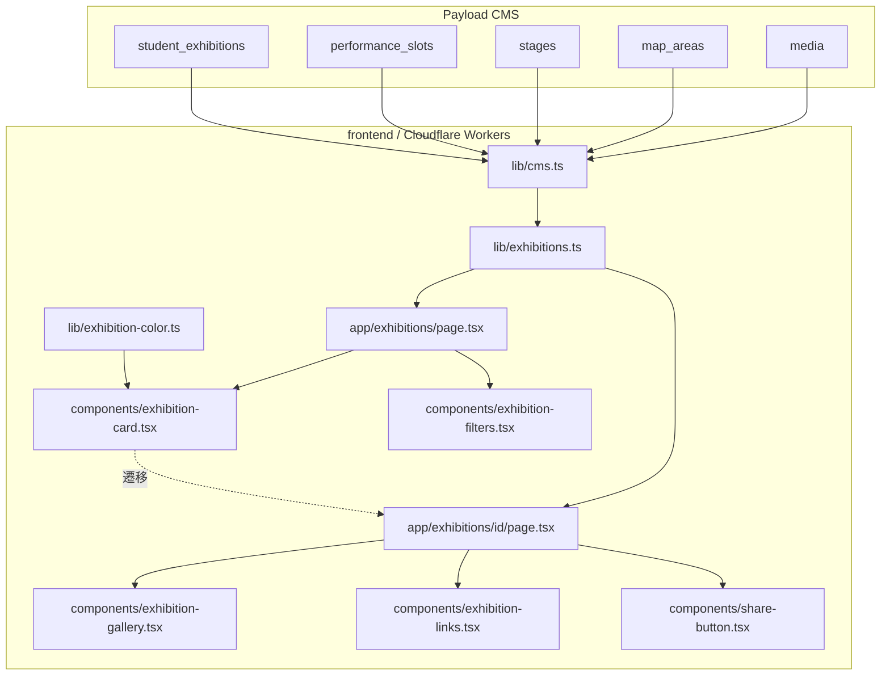
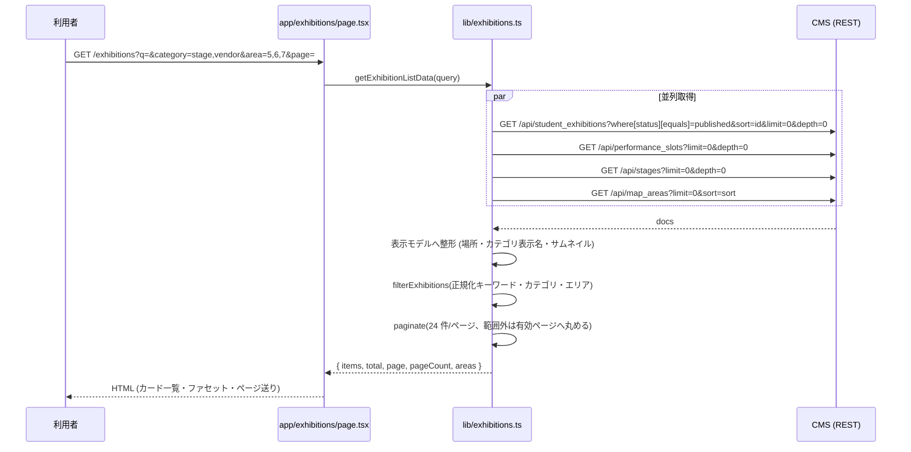
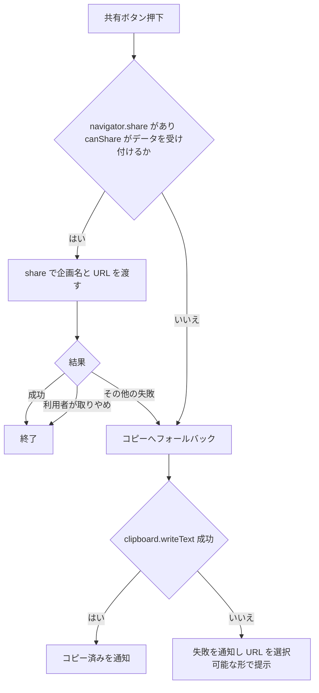
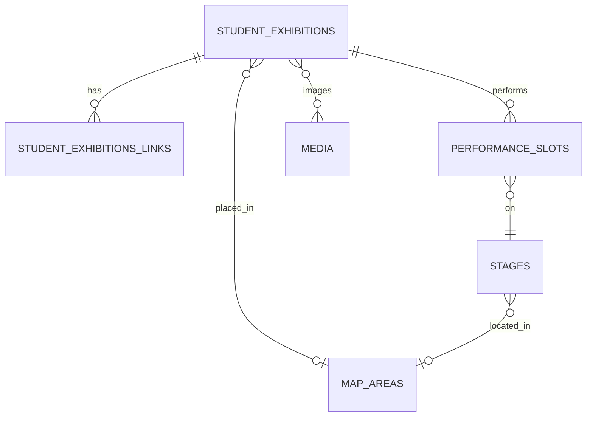
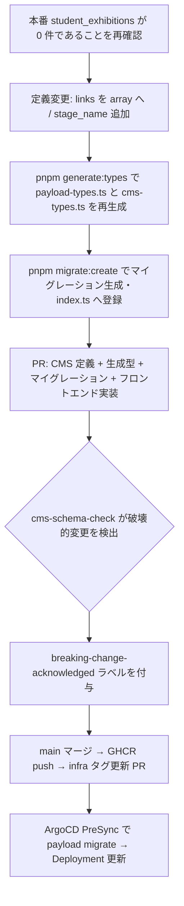

# Technical Design Document — exhibition-pages

## Overview

**Purpose**: 来場者が学生企画を探し、個々の企画の詳細を確認できる一覧ページ (`/exhibitions`) と詳細ページ (`/exhibitions/[id]`) をフロントエンドに追加する。

**Users**: 一般来場者・学生は企画を検索・絞り込みして目的の企画へ辿り着き、詳細ページで写真・場所・紹介文・団体のリンクを確認し、企画を共有する。出展者は CMS 管理画面で自分の企画のリンクを入力欄から登録する。

**Impact**: フロントエンドに 2 ルートと企画表示用のコンポーネント群・データ取得層を追加する。CMS 側では `student_exhibitions.links` を構造化された配列フィールドへ作り替え、出演用の企画名 `stage_name` を追加する。あわせてページ背景色・グレー・アイコンセットをサイト全体で統一し、テーマ「万彩」に沿った表示基盤を導入する。

### Goals

- 公開済み企画の一覧・検索・絞り込み・ページ送りを、URL に状態を持つ形で提供する。
- 企画詳細で写真ギャラリー・場所・紹介文・団体のリンク・共有を提供する。
- 企画カード・データ整形・配色計算を、`campus-map` / `digital-signage` / `timetable-page` から再利用できる形で切り出す。
- 出展者が JSON を手書きせずリンクを登録でき、`https://` 以外の URL を保存できないようにする。

### Non-Goals

- 投票機能・ブックマーク機能 (別 spec)。
- 詳細ページへの構内マップ表示 (`campus-map` 実装後に組み込む)。
- タイムテーブルへの導線 (`timetable-page` 実装後に組み込む)。
- サイト共通ヘッダー・フッターのレイアウト変更 (アイコンの差し替えのみ行う)。
- `festival_meta.sns_links` のデータ構造変更。
- 企画の長文紹介文フィールドの新設 (既存の `description` をそのまま紹介文として使う)。

## Boundary Commitments

### This Spec Owns

- ルート `/exhibitions` と `/exhibitions/[id]` の存在・URL 形状・表示内容。
- 企画の表示モデル (`ExhibitionSummary` / `ExhibitionDetail`) とその整形処理 (`lib/exhibitions.ts`)。
- 企画カードの外観と配色アルゴリズム (`lib/exhibition-color.ts`、`components/exhibition-card.tsx`)。
- 検索・ファセット・ページングの意味論と URL クエリの形 (`?q=&category=&area=&page=`。`category` / `area` は複数値をカンマ区切りで連結し、常にソート済みで表す)。
- `student_exhibitions.links` のフィールド定義とバリデーション、`stage_name` の追加、および `description` の管理画面表記。
- サイト全体の背景色・グレー階調・アイコンセット (`tailwind.config.ts`、`components/icons.tsx`、`components/sns-icon.tsx`)。

### Out of Boundary

- `map_areas` / `stages` / `performance_slots` / `media` のスキーマ (読み取りのみ)。
- 構内マップの描画、タイムテーブルの表示、サイネージ画面の構成。
- ヘッダー・フッターの構造とナビゲーション導線 (`responsive-navigation` が所有)。
- `cms/src/access/policy.ts` の公開判定ロジック (既存のまま利用する)。
- CMS の認証・ロール定義。

### Allowed Dependencies

- `frontend/src/lib/cms.ts` (CMS クライアント。本 spec では改造しない)。
- `frontend/src/lib/cms-asset-url.ts` の `toAssetUrl` と既存派生サイズ `card` / `hero`。
- `frontend/src/cms-types.ts` (CMS が生成する型)。
- Payload REST API の `student_exhibitions` / `performance_slots` / `stages` / `map_areas` / `media` の読み取り。
- Tailwind のテーマトークン (`tailwind.config.ts`)。

### Revalidation Triggers

以下が変わった場合、依存する spec・利用側は統合を再確認する。

- Figma ファイル「ホームページ」/「企画ページ」の更新 (画面デザインの正)。
- 企画カードの配色アルゴリズム (ハッシュ・パレット・補間方式) の変更。
- 詳細ページ URL `/exhibitions/[id]` の変更、および ID 以外のキー (slug 等) の導入。
- `ExhibitionSummary` / `ExhibitionDetail` のフィールド追加・削除・意味変更。
- `student_exhibitions.links` / `stage_name` のスキーマ変更。
- カード配色のパレット実値 (`GRADIENT_PALETTE`) と `tailwind.config.ts` のカラートークンの対応。
- 一覧の URL クエリパラメータ名・意味の変更。

## Architecture

### Existing Architecture Analysis

- フロントエンドは App Router のサーバーコンポーネントが `lib/<domain>.ts` を呼び、CMS 型を表示用の型へ変換してから描画する構成 (`lib/topics.ts` / `app/topics/**` が既存例)。本 spec もこの層構造を踏襲する。
- `lib/cms.ts` は `findMany` / `findById` / `findGlobal` を提供し、`where` / `sort` / `limit` / `depth` を組み立てる。`page` や `like` は未対応だが、本設計では必要としない (下記「絞り込みの所在」)。
- 画像は CMS の `/api/media/serve/:id/:size` が派生ファイルへ 302 で送る。派生サイズは `card` (960) / `hero` (1920) のみで、本 spec では追加しない。
- 未認証の読み取りは `cms/src/access/policy.ts` が `status=published` に制限する。フロントエンドは追加のフィルタを送るが、公開判定自体は CMS 側の責務に依存する。`users` は未認証では読めないため、一覧の取得では `owner` を populate させない (`depth: 0`)。
- Tailwind CSS 4 を `@tailwindcss/postcss` + `@config "../../tailwind.config.ts"` の互換経路で使っている (`frontend/src/app/globals.css`)。この経路では JS config 由来の色は**リテラル値としてユーティリティに展開されるだけで、`--color-*` の CSS カスタムプロパティは生成されない**。したがって実行時に決まる色を `var(--color-primary)` や動的なクラス名で参照できない (クラス名は静的検出されないため未生成)。カード配色は色の実値を JS 側から渡す。
- Cloudflare Workers (OpenNext) 上で動くため、サーバー側で Node.js 専用 API を使わない。

### Architecture Pattern & Boundary Map



**Architecture Integration**:

- **Selected pattern**: サーバーコンポーネント主体の層構造 (取得層 → 整形の純関数 → 表示)。既存の topics / announcements と同じ形を踏襲する。
- **Domain/feature boundaries**: CMS からの取得と表示モデルへの整形は `lib/exhibitions.ts` に閉じる。配色計算は `lib/exhibition-color.ts` に単独で切り出し、表示部品と他 spec の双方から使えるようにする。ページは `searchParams` の解釈と描画のみを担う。
- **絞り込みの所在**: キーワード照合は NFKC 正規化を伴うため CMS の `like` では満たせず、エリア判定はステージ経由の関係を含む。したがって一覧ページは公開済み企画を全件取得し、サーバー側 (Workers 上の SSR) の純関数で絞り込み・ページングを確定させる。判断根拠は `research.md` の「Architecture Pattern Evaluation」を参照。
- **Existing patterns preserved**: `lib/cms.ts` の単一クライアント、`toAssetUrl` による画像 URL 組み立て、詳細ページの `notFound()`、一覧ページの取得失敗フォールバック。
- **New components rationale**: 企画カードとギャラリー・リンク・共有は他ページからも参照されるため、`components/` に独立させる。アイコンは `components/icons.tsx` に集約してサイト全体で共有する。
- **Dependency direction**: `cms-types` → `lib/cms` → `lib/exhibitions` → `components` → `app`。逆方向の import を禁止する。`lib/exhibition-color.ts` は他に依存しない葉ノードとする。
- **Steering compliance**: 環境変数は `src/env.ts` 経由、CMS クライアントは単一インスタンス、CI ロジックは対象外、テストは対象ファイルと同階層。

### Technology Stack

| Layer | Choice / Version | Role in Feature | Notes |
|-------|------------------|-----------------|-------|
| Frontend | Next.js 15 (App Router) / React 19 | 一覧・詳細ページのサーバーレンダリングと部分的なクライアント操作 | 既存スタック。新規依存なし |
| Frontend (style) | Tailwind CSS 4 | 配色トークン・レイアウト | `tailwind.config.ts` に背景色とグレーの再定義を追加 |
| Frontend (assets) | Material Symbols Sharp (weight 300) / 各 SNS の公式ロゴ | UI アイコン・SNS アイコン | 使用分のみ SVG をインライン化し、フォント読み込みは行わない |
| Backend / CMS | Payload 3 + `@payloadcms/db-postgres` | `links` の配列フィールド化、`description` の表記変更 | 既存スタック |
| Data / Storage | PostgreSQL 16 | `student_exhibitions_links` テーブルの新設 (Payload の array field) | 本番 0 件のためデータ移行なし |
| Infrastructure / Runtime | Cloudflare Workers (`@opennextjs/cloudflare`) | フロントエンドの実行環境 | サーバー側で Node.js 専用 API を使わない |

## File Structure Plan

### Directory Structure

```
frontend/src/
├── app/exhibitions/
│   ├── page.tsx                   # 一覧。searchParams を解釈し取得・絞り込み・描画
│   ├── page.test.tsx
│   └── [id]/
│       ├── page.tsx               # 詳細。generateMetadata と notFound を担う
│       └── page.test.tsx
├── components/
│   ├── exhibition-card.tsx        # 企画カード (サーバーコンポーネント)
│   ├── exhibition-filters.tsx     # 検索欄・カテゴリ/エリアチップ ("use client")
│   ├── exhibition-gallery.tsx     # 写真ギャラリー ("use client")
│   ├── exhibition-links.tsx       # 団体リンクのアイコン列
│   ├── exhibition-pagination.tsx  # ページ送り
│   ├── share-button.tsx           # 共有ボタン ("use client")
│   ├── icons.tsx                  # Material Symbols Sharp のインライン SVG 群
│   └── *.test.tsx                 # 各コンポーネントと同階層
└── lib/
    ├── exhibitions.ts             # CMS 取得・表示モデルへの整形・絞り込み・ページング
    ├── exhibitions.test.ts
    ├── exhibition-color.ts        # 企画名 → グラデーション配色の決定的計算
    └── exhibition-color.test.ts

frontend/e2e/
└── exhibitions.spec.ts            # 一覧→詳細→404 の導線

cms/src/
├── collections/student-exhibitions.ts   # links の配列化、description の表記変更
└── migrations/<timestamp>_exhibition_links.ts
```

### Modified Files

- `frontend/tailwind.config.ts` — `background` を `#fbf8f3` に変更し、既存コードが実際に使う **9 階調すべて** (`gray-50` / `100` / `200` / `300` / `400` / `500` / `600` / `700` / `800`、最多は `gray-200` の 10 箇所) を Tailwind `stone` 相当の値で再定義する。`extend.colors.gray` は既定パレットとの深いマージになり、上書きしなかった階調は寒色の既定値が残るため、部分的な上書きでは要件 9.2 を満たさない。クラス名を `gray-*` のまま据え置く理由もコメントで残す。
- `frontend/src/app/globals.css` — 企画カードの背景クラス (グラデーション + `@supports` による OKLCH 切り替え) を追加する。
- `frontend/src/components/sns-icon.tsx` — 自作の簡略パスを各サービスの公式ロゴ SVG (公式配色) へ差し替える。既存テストが参照する `data-testid` は維持する。
- `frontend/src/app/layout.tsx` — OGP 用に `metadataBase` を設定する (相対 URL のメタデータ用。`og:image` は絶対 URL なので影響を受けない)。
- `cms/src/collections/student-exhibitions.ts` — `links` を `json` から `array` へ変更し、`stage_name` を追加し、`description` の管理画面説明文を改める。
- `cms/src/migrations/index.ts` — 新規マイグレーションを登録する。
- `cms/src/payload-types.ts` / `frontend/src/cms-types.ts` — `pnpm generate:types` で再生成してコミットする。`cms-ci.yml` は生成物に差分があると失敗するため、CMS 定義の変更と同一 PR に含める。

## System Flows

### 一覧ページの取得と絞り込み



取得のいずれか 1 本でも失敗した場合は取得失敗として扱い、空一覧ではなくエラー表示を返す (要件 1.6)。絞り込み条件はサーバー側で確定するため、ブラウザ側の再取得は発生しない。ファセット操作と検索入力は `router.replace` で URL クエリを書き換え、ページ番号を 1 に戻す (要件 2.8)。`category` / `area` は選択順に関わらず常にソート済みのカンマ区切りで書き出すため、同じ条件集合は必ず同じ URL になる。

一覧の企画取得は `depth: 0` とする。`owner` (未認証で読めない `users` への参照) を populate させないためで、`images` は media の ID 配列として受け取る。一覧で必要なのは先頭 1 枚のサムネイルだけであり、`alt` は企画名をフォールバックとして用いる。個別画像の `alt` が要る詳細ページのみ `depth: 1` で 1 件を取得する。

### 共有ボタンの分岐



## Requirements Traceability

| Requirement | Summary | Components | Interfaces | Flows |
|-------------|---------|------------|------------|-------|
| 1.1, 1.2, 1.3 | 公開済み企画の一覧・ID 昇順・24 件ページング | `app/exhibitions/page.tsx`, `lib/exhibitions.ts` | `getExhibitionListData`, `paginate` | 一覧取得 |
| 1.4, 1.5 | 件数表示・レスポンシブ配置 | `app/exhibitions/page.tsx`, `exhibition-card.tsx` | `ExhibitionListResult` | — |
| 1.6, 1.7 | 取得失敗・0 件の表示 | `app/exhibitions/page.tsx` | `CmsResult` | 一覧取得 |
| 2.1, 2.2 | キーワード照合と正規化 | `lib/exhibitions.ts` | `filterExhibitions`, `normalizeText` | 一覧取得 |
| 2.3, 2.4, 2.5, 2.6 | カテゴリ・エリア (ステージ経由を含む) の絞り込みと AND 結合 | `lib/exhibitions.ts` | `filterExhibitions`, `ExhibitionSummary.areaIds` | 一覧取得 |
| 2.7 | ファセット選択肢の構成 | `lib/exhibitions.ts`, `exhibition-filters.tsx` | `ExhibitionFacets`, `CATEGORY_LABELS` | 一覧取得 |
| 2.8, 2.9 | 条件変更でページリセット・URL への反映 | `exhibition-filters.tsx`, `app/exhibitions/page.tsx` | `ExhibitionQuery`, `parseExhibitionQuery` | 一覧取得 |
| 2.10, 2.11 | 0 件表示・ページ番号の丸め | `app/exhibitions/page.tsx`, `lib/exhibitions.ts` | `paginate` | 一覧取得 |
| 3.1, 3.2, 3.3 | カード構成・サムネイル・画像なし表示 | `exhibition-card.tsx` | `ExhibitionCardProps` | — |
| 3.4, 3.5, 3.6 | 決定的グラデーションと OKLCH 補間 | `lib/exhibition-color.ts` | `getExhibitionGradient` | — |
| 3.7, 3.8 | コントラスト・枠線なし・hover の影 | `exhibition-card.tsx` | — | — |
| 3.9, 3.10 | 詳細への遷移・他画面からの再利用 | `exhibition-card.tsx` | `ExhibitionCardProps` | — |
| 4.1〜4.7 | 場所文字列の組み立て | `lib/exhibitions.ts` | `resolveLocation` | 一覧取得 |
| 5.1〜5.5 | 詳細表示・ギャラリー・戻る導線 | `app/exhibitions/[id]/page.tsx`, `exhibition-gallery.tsx` | `getExhibitionDetail`, `ExhibitionDetail` | — |
| 5.6 | OGP・ページ情報 | `app/exhibitions/[id]/page.tsx`, `app/layout.tsx` | `generateMetadata` | — |
| 5.7, 5.8 | 不在・非公開は 404、取得失敗はエラー表示 | `app/exhibitions/[id]/page.tsx`, `lib/exhibitions.ts` | `ExhibitionDetailResult` | — |
| 5.9 | ステージ文脈での表示名 | `lib/exhibitions.ts` | `ExhibitionSummary.stageName` | — |
| 6.1〜6.5 | リンクの表示・読み上げ名・新規タブ・0 件時 | `exhibition-links.tsx`, `sns-icon.tsx` | `ExhibitionLink`, `PLATFORM_LABELS` | — |
| 7.1〜7.6 | CMS の入力欄・選択肢・URL 検証・権限・表記・移行不要 | `cms/src/collections/student-exhibitions.ts`, マイグレーション | `links` フィールド定義 | 移行手順 |
| 7.7, 7.8 | 出演用の企画名と条件付き表示 | `cms/src/collections/student-exhibitions.ts` | `stage_name` フィールド定義 | 移行手順 |
| 8.1〜8.4 | 共有と失敗時の案内 | `share-button.tsx` | `ShareButtonProps` | 共有分岐 |
| 9.1〜9.4 | 背景色・グレー・本文コントラスト・見出し色の据え置き | `tailwind.config.ts` | テーマトークン | — |
| 9.5, 9.6, 9.7 | アイコンセットと読み上げ除外 | `icons.tsx`, `sns-icon.tsx` | `IconProps` | — |
| 10.1, 10.2, 10.3 | URL・整形処理・配色計算の再利用 | `app/exhibitions/[id]`, `lib/exhibitions.ts`, `lib/exhibition-color.ts` | 各 export, `GRADIENT_PALETTE` | — |

## Components and Interfaces

| Component | Domain/Layer | Intent | Req Coverage | Key Dependencies (P0/P1) | Contracts |
|-----------|--------------|--------|--------------|--------------------------|-----------|
| `lib/exhibitions.ts` | Data | CMS 取得・表示モデル整形・絞り込み・ページング | 1, 2, 4, 5, 10 | `lib/cms.ts` (P0), `cms-asset-url` (P1) | Service |
| `lib/exhibition-color.ts` | Domain | 企画名からカード配色を決定的に導く | 3, 10 | なし | Service |
| `app/exhibitions/page.tsx` | UI | 一覧の描画と `searchParams` の解釈 | 1, 2 | `lib/exhibitions.ts` (P0) | State |
| `app/exhibitions/[id]/page.tsx` | UI | 詳細の描画とメタデータ生成 | 5, 6, 10 | `lib/exhibitions.ts` (P0) | State |
| `components/exhibition-card.tsx` | UI | 企画カードの表示と遷移 | 1, 3, 4 | `lib/exhibition-color.ts` (P0) | — |
| `components/exhibition-filters.tsx` | UI | 検索欄とファセットチップ、URL 更新 | 2 | `next/navigation` (P0) | State |
| `components/exhibition-gallery.tsx` | UI | 写真の切り替え表示 | 5 | — | State |
| `components/exhibition-links.tsx` | UI | 団体リンクのアイコン列 | 6 | `sns-icon.tsx` (P0) | — |
| `components/exhibition-pagination.tsx` | UI | ページ送り | 1, 2 | — | — |
| `components/share-button.tsx` | UI | 共有・コピーのフォールバック | 8 | ブラウザ API (P0) | State |
| `components/icons.tsx` | UI | UI アイコンの供給 | 9 | — | — |
| `cms/src/collections/student-exhibitions.ts` | CMS | `links` の構造化と表記 | 7 | Payload (P0) | Service |

### Data / フロントエンド取得層

#### `lib/exhibitions.ts`

| Field | Detail |
|-------|--------|
| Intent | CMS から企画関連データを取得し、表示モデルへ整形したうえで絞り込みとページングを行う |
| Requirements | 1.1, 1.2, 1.3, 1.4, 1.6, 2.1, 2.2, 2.3, 2.4, 2.5, 2.6, 2.7, 2.10, 2.11, 4.1, 4.2, 4.3, 4.4, 4.5, 4.6, 4.7, 5.1, 5.7, 5.8, 5.9, 10.2 |

**Responsibilities & Constraints**

- CMS 型 (`@/cms-types`) を表示モデルへ変換する唯一の場所。ページ・コンポーネントは CMS 型を直接扱わない。
- 場所文字列・カテゴリ表示名・サムネイル URL・エリア ID 集合の決定を担う。
- 絞り込みとページングは副作用のない純関数として切り出し、CMS 通信と分離する。
- 公開判定は CMS 側の access control に依存しつつ、明示的に `status=published` も送る。

**Dependencies**

- Inbound: `app/exhibitions/page.tsx`, `app/exhibitions/[id]/page.tsx` — データ取得 (P0)
- Outbound: `lib/cms.ts` — REST 取得 (P0) / `lib/cms-asset-url.ts` — 画像 URL (P1)
- External: Payload REST API — `student_exhibitions` / `performance_slots` / `stages` / `map_areas` (P0)

**Contracts**: Service [x] / API [ ] / Event [ ] / Batch [ ] / State [ ]

##### Service Interface

```typescript
export type ExhibitionCategory = 'stage' | 'exhibit' | 'vendor' | 'other';

export interface ExhibitionImage {
  readonly id: string;
  readonly alt: string;
}

export interface ExhibitionLink {
  readonly platform: 'x' | 'instagram' | 'facebook' | 'youtube' | 'tiktok' | 'line' | 'website';
  readonly url: string;
}

export interface ExhibitionSummary {
  readonly id: number;
  readonly name: string;
  /** ステージ文脈での表示名。`stage_name` 未入力なら `name` と同じ値 (要件 5.9) */
  readonly stageName: string;
  readonly organizationName: string;
  readonly categories: readonly ExhibitionCategory[];
  /** 表示用の場所文字列。未設定なら null (要件 4.6) */
  readonly location: string | null;
  /** 絞り込み用。直接設定されたエリアと出演ステージ由来のエリアの和 (要件 2.5) */
  readonly areaIds: readonly number[];
  readonly thumbnail: ExhibitionImage | null;
}

export interface ExhibitionDetail extends ExhibitionSummary {
  readonly description: string | null;
  readonly images: readonly ExhibitionImage[];
  readonly links: readonly ExhibitionLink[];
}

export interface AreaOption {
  readonly id: number;
  readonly name: string;
}

export interface ExhibitionQuery {
  readonly q: string;
  readonly categories: readonly ExhibitionCategory[];
  readonly areaIds: readonly number[];
  readonly page: number;
}

export interface ExhibitionListResult {
  readonly items: readonly ExhibitionSummary[];
  readonly total: number;
  readonly page: number;
  readonly pageCount: number;
  readonly rangeStart: number;
  readonly rangeEnd: number;
  readonly areas: readonly AreaOption[];
}

export const PAGE_SIZE = 24;

export const CATEGORY_LABELS: Readonly<Record<ExhibitionCategory, string>>;

/** searchParams を検証済みのクエリへ変換する。不正値は既定値へ落とす */
export function parseExhibitionQuery(
  params: Readonly<Record<string, string | readonly string[] | undefined>>,
): ExhibitionQuery;

/** 全角/半角・大文字小文字を吸収する照合用の正規化 (NFKC + 小文字化) */
export function normalizeText(value: string): string;

export function filterExhibitions(
  items: readonly ExhibitionSummary[],
  query: ExhibitionQuery,
): readonly ExhibitionSummary[];

export function paginate<T>(
  items: readonly T[],
  page: number,
  pageSize?: number,
): { readonly items: readonly T[]; readonly page: number; readonly pageCount: number };

/** 一覧ページ用。取得失敗時は例外を投げる (既存 topics/announcements と同じ規約) */
export function getExhibitionListData(query: ExhibitionQuery): Promise<ExhibitionListResult>;

/**
 * 詳細ページ用の結果。不在・非公開 (missing) と取得失敗 (error) を必ず区別する。
 * 両者を null へ潰すと要件 5.8 (CMS 障害を 404 にしない) を満たせない。
 */
export type ExhibitionDetailResult =
  | { readonly kind: 'found'; readonly value: ExhibitionDetail }
  | { readonly kind: 'missing' }
  | { readonly kind: 'error'; readonly error: CmsFetchError };

export function getExhibitionDetail(id: number): Promise<ExhibitionDetailResult>;
```

- `CmsFetchError` は `lib/cms.ts` が公開する判別可能ユニオン (`not_found` / `unauthorized` / `network`)。`not_found` と `unauthorized` (非公開レコードへの参照) を `missing`、それ以外を `error` へ写す。
- Preconditions: `page` は 1 以上の整数へ正規化済みであること。`id` は数値であること。`parseExhibitionQuery` の入力は `await` 済みの `searchParams` であること (Next.js 15 では `searchParams` は Promise)。
- Postconditions: `filterExhibitions` は入力の並び順 (ID 昇順) を保つ。`paginate` は範囲外のページを有効範囲へ丸めた `page` を返す。
- Invariants: `ExhibitionSummary.areaIds` は重複を含まない。`location` は空文字を返さない (未設定は `null`)。

**Implementation Notes**

- Integration: `student_exhibitions` / `performance_slots` / `stages` / `map_areas` を並列取得し、ID で結合する。join field には依存しない。一覧は `depth: 0` (owner を populate させない)、詳細は 1 件のみ `depth: 1` (画像の `alt` を得る)。
- Integration: `stageName` は `stage_name` が空文字・null なら `name` を用いる (要件 5.9)。判定はこの層のみで行い、表示側は `stageName` をそのまま使う。
- Validation: `parseExhibitionQuery` は未知のカテゴリ値・数値でないエリア ID・0 以下のページ番号を捨てる。
- Risks: 企画数が数千規模になると全件取得が重くなる。閾値を超えたら CMS 側の絞り込みへ移行する (`research.md` 参照)。

#### `lib/exhibition-color.ts`

| Field | Detail |
|-------|--------|
| Intent | 企画名からカード背景のグラデーション (2 色と角度) を決定的に導く |
| Requirements | 3.4, 3.5, 3.6, 10.3 |

**Responsibilities & Constraints**

- 入力は企画名のみ。時刻・乱数種・環境に依存しない。サーバーとクライアント、および Figma のモックで同じ結果を返す。
- 色は既存パレットの 7 色 (`primary` / `secondary` / `accent` / `accent-alt` / `info` / `success` / `warning`) に限定する。
- 2 色は必ず異なる。角度は 0〜359 の整数。

**Contracts**: Service [x] / API [ ] / Event [ ] / Batch [ ] / State [ ]

##### Service Interface

```typescript
export type GradientColorToken =
  | 'primary' | 'secondary' | 'accent' | 'accent-alt' | 'info' | 'success' | 'warning';

/**
 * トークン名 → 実際の色値。Tailwind v4 を JS config 経由で使う本リポジトリでは
 * `--color-*` の CSS カスタムプロパティが生成されないため、描画側は色値そのものを必要とする。
 * `tailwind.config.ts` の対応する値と一致することを単体テストで固定する。
 */
export const GRADIENT_PALETTE: Readonly<Record<GradientColorToken, string>>;

export interface ExhibitionGradient {
  readonly from: GradientColorToken;
  readonly to: GradientColorToken;
  /** `GRADIENT_PALETTE[from]` の色値 (例: `#ebb03c`) */
  readonly fromColor: string;
  /** `GRADIENT_PALETTE[to]` の色値 */
  readonly toColor: string;
  /** 度数法。0-359 */
  readonly angle: number;
}

export function getExhibitionGradient(name: string): ExhibitionGradient;
```

- アルゴリズム (Figma のモックと同一、変更は Revalidation Trigger):
  1. 企画名の UTF-16 コードユニット列に対し FNV-1a 32bit (offset `2166136261`、prime `16777619`、`Math.imul`、最後に `>>> 0`) を適用して種を得る。
  2. 種を mulberry32 に与え、1 回目の乱数でパレット 7 色から `from` を選ぶ。
  3. 2 回目の乱数で `from` を除いた 6 色から `to` を選ぶ。
  4. 3 回目の乱数で角度 (0〜359 の整数) を決める。
- 描画側の契約:
  - カードは色値と角度をインラインのカスタムプロパティ (`--exhibition-gradient-from` / `--exhibition-gradient-to` / `--exhibition-gradient-angle`) として渡す。値は Tailwind のトークン名ではなく `GRADIENT_PALETTE` の色値そのもの。
  - `globals.css` のクラスが 2 段で背景を宣言する。素の `linear-gradient(<angle>, <from>, <to>)` を先に置き、`@supports (background-image: linear-gradient(in oklch, red, blue))` の中で `linear-gradient(in oklch <angle>, <from>, <to>)` に差し替える。
  - **`in oklch` 未対応のブラウザは sRGB 補間に退化しない。** CSS はパースできない宣言を丸ごと破棄するため、単一宣言では背景が消える。上記の 2 段宣言 (または同等のカスケード) が必須。
  - カードは背景の上に白 30% のレイヤーと SVG ノイズを重ねる。

**Implementation Notes**

- Validation: 空文字の企画名でも決定的に配色を返す。
- Risks: パレットや手順を変えると既存の配色がすべて変わる。変更時は依存 spec へ通知する。
- Risks: `GRADIENT_PALETTE` と `tailwind.config.ts` の値が二重管理になる。片方だけ変えた場合に落ちる単体テストで担保する。

### UI / フロントエンド表示層

#### `app/exhibitions/page.tsx`

| Field | Detail |
|-------|--------|
| Intent | 一覧ページ。`searchParams` を解釈し、取得結果をカード・ファセット・ページ送りへ配る |
| Requirements | 1.1, 1.3, 1.4, 1.5, 1.6, 1.7, 2.8, 2.9, 2.10, 2.11 |

**Contracts**: Service [ ] / API [ ] / Event [ ] / Batch [ ] / State [x]

##### State Management

- State model: URL クエリ (`q` / `category` / `area` / `page`) が唯一の状態。サーバーコンポーネントがそれを読んで描画する。Next.js 15 では `searchParams` が Promise で渡るため、`await` してから `parseExhibitionQuery` に与える。`category` / `area` はカンマ区切り (`category=stage,vendor`) を正とし、同一キーの繰り返し (`category=stage&category=vendor`) も後方互換として受け付ける。`parseExhibitionQuery` は両形式を解釈したうえで重複を除き、`category` は定義順 (`stage` / `exhibit` / `vendor` / `other`)、`area` は数値昇順にソートして返すため、選択順に関わらず常に同じ `ExhibitionQuery` になる。URL の書き出しは `lib/exhibitions.ts` の `buildExhibitionsHref` に一本化し、一覧のページ送りとファセット操作 (`components/exhibition-filters.tsx`) の両方がこれを使う。
- Persistence & consistency: 状態はブラウザ履歴に載るため、同じ URL は同じ結果を返す。
- Concurrency strategy: 取得は毎リクエスト実行する (キャッシュ・再検証の指定は行わない)。

**Implementation Notes**

- Integration: 取得失敗は `getExhibitionListData` の例外を捕捉してエラー表示に切り替える (空一覧にしない)。
- Validation: `page` が範囲外なら `paginate` が丸めた結果を表示する。

#### `app/exhibitions/[id]/page.tsx`

| Field | Detail |
|-------|--------|
| Intent | 詳細ページ。取得結果の種別で表示を分岐し、メタデータを生成する |
| Requirements | 5.1, 5.5, 5.6, 5.7, 5.8, 10.1 |

**Contracts**: Service [ ] / API [ ] / Event [ ] / Batch [ ] / State [x]

##### State Management

- State model: ルートパラメータ `id` のみ。`params` も Next.js 15 では Promise で渡るため `await` する。
- Persistence & consistency: 取得は毎リクエスト実行する。
- Concurrency strategy: なし (単一取得)。

**Implementation Notes**

- Integration: `getExhibitionDetail(id)` の結果で分岐する。`missing` → `notFound()` (要件 5.7)、`error` → 取得失敗の表示 (要件 5.8)、`found` → 通常描画。`generateMetadata` も同じ分岐に従い、`error` のときは既定のメタデータのみを返す。
- Validation: `id` が数値に解釈できない場合は `missing` と同じ扱いにする。
- OGP (要件 5.6):
  - `title` は企画名、`description` は `description` の先頭を用い、未入力なら「<出展団体名> の企画」を代替とする。
  - `og:image` は先頭画像の `card` (960) サイズの URL。画像が無い企画ではサイト既定の画像を用いる。
  - `toAssetUrl` が返すのは `NEXT_PUBLIC_CMS_URL` を含む絶対 URL のため `metadataBase` では解決されない。`metadataBase` は `og:url` など相対値のメタデータのために設定する。
  - `twitter:card` は `summary_large_image` とする。画像の高さは派生サイズから一意に決まらないため `og:image:width` / `height` は付与しない。

#### `components/exhibition-filters.tsx`

| Field | Detail |
|-------|--------|
| Intent | 検索欄とカテゴリ・エリアのチップを提供し、URL クエリを書き換える |
| Requirements | 2.1, 2.3, 2.4, 2.7, 2.8, 2.9 |

**Contracts**: Service [ ] / API [ ] / Event [ ] / Batch [ ] / State [x]

##### State Management

- State model: 入力中のキーワードのみローカル状態。確定時に `router.replace` で URL を更新する。
- Persistence & consistency: 条件変更時は `page` を除去して 1 ページ目に戻す。
- Concurrency strategy: 入力はデバウンスして URL 更新の頻度を抑える。

```typescript
export interface ExhibitionFiltersProps {
  readonly query: ExhibitionQuery;
  readonly areas: readonly AreaOption[];
}
```

#### `components/exhibition-card.tsx`

| Field | Detail |
|-------|--------|
| Intent | 企画カードの表示。一覧以外 (構内マップ・サイネージ) からも同じ見た目で使う |
| Requirements | 3.1, 3.2, 3.3, 3.7, 3.8, 3.9, 3.10, 4.1, 4.2 |

```typescript
export interface ExhibitionCardProps {
  readonly exhibition: ExhibitionSummary;
}
```

**Implementation Notes**

- Integration: `getExhibitionGradient(exhibition.name)` が返す色値と角度をインラインのカスタムプロパティで渡し、`globals.css` のクラスが素のグラデーションと `@supports` 下の OKLCH 版を 2 段で宣言する (`lib/exhibition-color.ts` の描画側の契約を参照)。
- Validation: サムネイルが無い場合はグレーの領域と画像なしアイコンを表示する (要件 3.3)。
- Risks: 企画名が 2 行になるとカードの高さが伸びる。グリッドの `stretch` で行内の高さを揃える。

#### `components/exhibition-gallery.tsx` / `exhibition-links.tsx` / `exhibition-pagination.tsx`

```typescript
export interface ExhibitionGalleryProps {
  readonly images: readonly ExhibitionImage[];
  readonly fallbackAlt: string;
}

export interface ExhibitionLinksProps {
  readonly links: readonly ExhibitionLink[];
}

export interface ExhibitionPaginationProps {
  readonly page: number;
  readonly pageCount: number;
  /** 現在の検索条件を保ったままページのみ差し替えた URL を返す */
  readonly hrefForPage: (page: number) => string;
}
```

- ギャラリーは選択中の画像インデックスのみをローカル状態に持つ (要件 5.3)。画像が 0 件ならサムネイル列を描画しない (要件 5.4)。
- リンクは 0 件なら欄ごと描画しない (要件 6.5)。各リンクは `target="_blank" rel="noopener noreferrer"` とし、読み上げ用の名前を `aria-label` で与える (要件 6.3, 6.4)。
- `PLATFORM_LABELS` はプラットフォーム値から読み上げ名 (例: `x` → 「X」、`website` → 「公式サイト」) を返す定数とする。

#### `components/share-button.tsx`

| Field | Detail |
|-------|--------|
| Intent | 端末の共有機能、非対応時は URL のコピーへフォールバックする |
| Requirements | 8.1, 8.2, 8.3, 8.4 |

**Contracts**: Service [ ] / API [ ] / Event [ ] / Batch [ ] / State [x]

##### State Management

- State model: 「コピーしました」「コピーに失敗しました」の一時的な通知状態のみ。
- Persistence & consistency: 永続化しない。一定時間で消す。
- Concurrency strategy: 連続操作時は最後の結果で上書きする。

```typescript
export interface ShareButtonProps {
  readonly title: string;
  /** 絶対 URL。サーバー側で組み立てて渡す */
  readonly url: string;
}
```

- 対応判定は `navigator.share` の存在だけでは足りない。デスクトップの Chrome / Edge にも存在するため、`navigator.canShare?.(data) !== false` を併用し、さらに `share()` の例外 (`NotAllowedError` など `AbortError` 以外) でもコピーへフォールバックする (要件 8.1, 8.2)。
- 利用者が共有シートを閉じた場合 (`AbortError`) はエラー表示を行わない (要件 8.3)。
- コピーに失敗した場合は、URL を選択可能な形で提示する (要件 8.4)。

#### `components/icons.tsx` / `components/sns-icon.tsx`

| Field | Detail |
|-------|--------|
| Intent | UI アイコンと SNS ロゴをサイト全体へ供給する |
| Requirements | 9.5, 9.6, 9.7, 6.2 |

```typescript
export interface IconProps {
  /** 既定は 24。装飾用途では aria-hidden を付与する */
  readonly size?: number;
  readonly className?: string;
}
```

- UI アイコン (場所・共有・リンク・検索・左右の矢印・画像なし・戻る) は Material Symbols Sharp (weight 300) の SVG をインラインで持つ。フォント読み込みは行わない。
- SNS ロゴは各サービスの公式ロゴを公式配色のまま用いる。既存テストが参照する `data-testid` は維持する。
- 装飾目的のアイコンは `aria-hidden="true"` とし、意味を持つ場合は親要素が `aria-label` を持つ (要件 9.7)。

### CMS

#### `cms/src/collections/student-exhibitions.ts`

| Field | Detail |
|-------|--------|
| Intent | `links` を構造化した配列フィールドへ変更し、`stage_name` を追加し、`description` の管理画面表記を改める |
| Requirements | 7.1, 7.2, 7.3, 7.4, 7.5, 7.6, 7.7, 7.8 |

**Responsibilities & Constraints**

- 出展者が行単位でリンクを追加・削除・並べ替えできること。
- `https://` で始まらない URL を保存させない。
- 既存の access control (`payload-access.ts` 経由) と `owner` の扱いを変更しない。

**Contracts**: Service [x] / API [ ] / Event [ ] / Batch [ ] / State [ ]

##### Service Interface

```typescript
/** links 配列の 1 行 */
export interface ExhibitionLinkRow {
  readonly platform:
    | 'x' | 'instagram' | 'facebook' | 'youtube' | 'tiktok' | 'line' | 'website';
  readonly url: string;
}
```

- フィールド定義: `name: 'links'`, `type: 'array'`, 行は `platform` (`select`, required, 上記 7 値) と `url` (`text`, required)。
- `url` の `validate` は `https://` で始まる解釈可能な URL のみを通し、それ以外は日本語の理由を返す (要件 7.3)。
- `description` の `admin.description` を「企画の紹介文」に改める。DB スキーマは変わらない (要件 7.5)。
- フィールド定義: `name: 'stage_name'`, `type: 'text'`, 任意, `maxLength: 255`。`admin.condition` で `category` に `stage` が含まれるときだけ表示する (要件 7.7, 7.8)。既存フィールドを変えない純粋な追加のため、`cms-schema-check` の破壊的変更には当たらない。

**Implementation Notes**

- Integration: Payload の array field は子テーブル (`student_exhibitions_links`) を作る。マイグレーションで旧 `links` (jsonb) カラムを落とし、子テーブルを作成する。
- Validation: 表示名フィールドは持たない (要件 6.2 によりアイコンのみで表示する)。
- Risks: `cms-schema-check` が型変更を破壊的変更として検出する。本番 0 件のため `breaking-change-acknowledged` ラベルで通す。

## Data Models

### Domain Model

- **企画 (Exhibition)**: 集約ルート。`owner` と 1 対 1 (UNIQUE 制約は維持)。カテゴリを複数持ち、出店と出演を兼ねる団体はカテゴリの複数選択で表す。名前は通常の企画名 (`name`) と、ステージ文脈でのみ使う `stage_name` の 2 つを持ちうる。`stage_name` が空なら `name` が両方の文脈を兼ねる。
- **リンク (ExhibitionLink)**: 企画に従属する値オブジェクトの並び。順序が表示順を決める。単独では存在しない。
- **場所**: 企画が直接持つエリア (`area_id` + `booth_label`) と、出演枠経由のステージ (`performance_slots` → `stages`) の 2 系統から導出する。導出規則はフロントエンドの `resolveLocation` が唯一の実装。
  - エリアと出演枠の双方があればエリアを優先する (要件 4.3)。
  - 複数ステージに出演する場合は重複を除いて連ねる (要件 4.4)。
  - ブース表示名が無ければエリア名のみ (要件 4.5)。
  - どちらも無ければ場所を表示しない (要件 4.6)。

### Logical Data Model



- `student_exhibitions_links` は `id` / 親 ID / `_order` / `platform` / `url` を持つ (Payload の array field 標準構造)。親削除時はカスケード削除される。
- 参照整合性・カスケードは Payload の既定に従い、本 spec で独自の制約は追加しない。

### Physical Data Model

- `student_exhibitions` の `links` (`jsonb`) カラムを削除し、子テーブル `student_exhibitions_links` を追加する。あわせて `stage_name` (`varchar`, NULL 許容) カラムを追加する。
- インデックスは親 ID に対する既定のもののみ。リンクは常に親経由で読むため追加しない。
- 本番は 0 件のため、`up` でのデータ移行処理は不要。`down` は旧 `jsonb` カラムと `stage_name` の削除を復元するが、**パイプライン上に `down` を自動実行する経路は無い** (下記 Migration Strategy のロールバック手順を参照)。

### Data Contracts & Integration

- フロントエンドは Payload REST の JSON をそのまま受け取り、`lib/exhibitions.ts` で表示モデルへ変換する。API の追加・変更は行わない。
- `links` は `depth` に関わらず親ドキュメントに配列として含まれる。
- 画像は ID のみを表示モデルに保持し、URL は `toAssetUrl(id, width)` が組み立てる。

## Error Handling

### Error Strategy

CMS 通信の失敗は `CmsResult` の判別可能なユニオンで表現し、ページ側で表示に変換する。一覧は取得層の関数境界で例外を投げ、ページが捕捉する (既存 topics / announcements と同じ規約)。詳細は `ExhibitionDetailResult` で「不在・非公開 (`missing`)」と「取得失敗 (`error`)」を区別したまま返す。既存の `lib/topics.ts` は両者を `null` に潰しているが、本 spec は要件 5.8 があるためこの規約を踏襲しない。

### Error Categories and Responses

- **利用者起因 (4xx 相当)**:
  - 存在しない ID・非公開の企画 → `notFound()` で「ページが見つからない」表示 (要件 5.7)。
  - 範囲外のページ番号 → 有効なページへ丸めて表示する (要件 2.11)。
  - 不正なクエリ値 (未知のカテゴリ・数値でないエリア ID・カンマ区切り中の空要素) → 無視して既定値で描画する。
- **システム起因 (5xx 相当)**:
  - CMS が不通・エラー応答 → 一覧は取得失敗の表示 (要件 1.6)、詳細は取得失敗の表示 (要件 5.8)。空一覧や 404 として扱わない。
- **業務ルール**:
  - 公開済み企画が 0 件 → 「企画がまだ公開されていない」旨を表示する (要件 1.7)。
  - 条件に一致する企画が 0 件 → 「該当する企画がない」旨を表示する (要件 2.10)。
  - CMS の URL 検証違反 → 保存を拒否し、理由を日本語で表示する (要件 7.3)。
- **ブラウザ API**:
  - 共有の取りやめ (`AbortError`) → 何も表示しない (要件 8.3)。
  - コピー失敗 → 失敗の通知と URL の手動コピー手段を提示する (要件 8.4)。

### Monitoring

CMS 取得失敗時はサーバー側のログに残す。新しい監視基盤は導入しない。

## Testing Strategy

### Unit Tests

- `getExhibitionGradient` — 同じ企画名が常に同じ配色を返すこと、2 色が必ず異なること、角度が 0〜359 の整数であること、Figma のモックと同じ既知の組み合わせを返すこと。
- `GRADIENT_PALETTE` — 全 7 トークンの色値が `tailwind.config.ts` の対応する値と一致すること (二重管理の検出)。
- `resolveStageName` 相当 — `stage_name` があればそれを、空・null なら `name` を `stageName` に載せること (要件 5.9)。
- `normalizeText` / `filterExhibitions` — 全角・半角・大文字小文字をまたいだ一致、企画名と団体名の OR 照合、カテゴリとエリアの AND 結合。
- `filterExhibitions` (エリア) — 直接設定されたエリアと、出演ステージ由来のエリアの双方で一致すること。
- `paginate` — 24 件区切り、範囲外ページの丸め、総ページ数の算出。
- `resolveLocation` — エリア優先、複数ステージの連結、ブース名なし、いずれも無い場合。

### Integration Tests

- `getExhibitionListData` — 4 本の取得結果を結合して表示モデルを組み立てること (CMS クライアントをモックする)。
- `getExhibitionListData` — いずれかの取得が失敗した場合に例外を投げること。
- `getExhibitionDetail` — 不在・非公開は `missing`、CMS 不通・5xx は `error` を返し、両者を取り違えないこと。
- `app/exhibitions/[id]/page.tsx` — `missing` で 404、`error` で取得失敗の表示になること (取得失敗を 404 にしないこと)。
- `app/exhibitions/page.tsx` — 取得失敗時にエラー表示、0 件時に該当なし表示を出すこと。
- CMS: `links` の `validate` が `https://` 以外を拒否すること (`cms/src/collections/*.test.ts`)。

### E2E Tests

`frontend/e2e/exhibitions.spec.ts` (冒頭に依存コレクションを明記し、`beforeAll` で `checkCmsReachable` を呼ぶ)。

- 一覧から企画カードを選択して詳細ページへ遷移できること。
- 検索・カテゴリ絞り込みの結果が URL に反映され、同じ URL を開き直すと同じ結果になること。
- 存在しない ID の詳細ページが 404 を返すこと。

### アクセシビリティ・表示の検証

- 背景色を `#fbf8f3` に変更した後、既存ページを含む本文テキストの色 (`text`、`gray-500` / `gray-600` など) とのコントラスト比を実測し、4.5:1 以上であることを確認する (要件 9.3)。下回る階調があれば `tailwind.config.ts` の値を 1 段暗い側へ寄せる。見出し色 `primary` は対象外 (要件 9.4)。
- カード背景のコントラスト (文字 4.5:1、アイコン 3:1) は、パレット 7 色の全組み合わせを OKLCH 補間 + 白 30% で評価して確認する (要件 3.7)。

## Migration Strategy



- 適用時の停止時間: PreSync Job (`cms-migrate`, namespace `prod`) は Deployment の更新より前に走る。旧 `links` カラムを DROP した時点から新イメージの Pod に入れ替わるまでの間、旧イメージの Pod は `student_exhibitions` を読めない (存在しないカラムを SELECT するため)。本番は 0 件でデータ損失は無いが、この間は CMS 管理画面と企画関連の参照が失敗する。祭期間中・告知直後を避けて適用する。
- ロールバックの引き金: マイグレーション失敗、管理画面でリンクを保存できない、一覧・詳細が表示できない。
- ロールバック手順 (自動経路は無い): `cms-migrate` Job は `payload migrate` (up) 固定で、`cms-ci.yml` も up のみ。infra のタグを戻しても DB は新スキーマのままなので CMS は復旧しない。`down` は同じ migrator イメージで手動実行する。
  1. `make kubectl ARGS="-n prod get job cms-migrate -o yaml"` で直前に適用されたイメージタグを確認する。
  2. 同じイメージ (`ghcr.io/aramakisai/aramakisai-cms-migrate:<tag>`) を `command: [node_modules/.bin/payload, migrate:down]`、`envFrom: cms-secrets` で 1 回だけ実行する Job を `make kubectl ARGS="-n prod create -f -"` で流す。
  3. `down` 完了後に infra のイメージタグを直前のものへ戻す PR を出し、ArgoCD に同期させる。
- 検証ポイント: マイグレーション後に `student_exhibitions_links` と `stage_name` が存在すること、管理画面でリンクを登録・並べ替えできること、`https://` 以外が拒否されること、カテゴリに「ステージ」を含むときだけ `stage_name` が表示されること。
- 本番にレコードが存在する状態に変わっていた場合は、ラベル付与を止めて移行手順を設計し直す (要件 7.6)。

## Performance & Scalability

- 一覧は 1 リクエストあたり 4 本の CMS 取得を並列実行し、全件をサーバー側で絞り込む。想定件数 (数十〜数百) では許容範囲。
- キャッシュ・再検証は設定しない (毎リクエスト取得)。当日の更新が即座に反映されることを優先する。
- 画像は既存の派生サイズ `card` (960) を一覧・ギャラリーのサムネイルに、`hero` (1920) を詳細の主画像に用いる。新しい派生サイズは追加しない。
- 企画数が数百を大きく超えた場合は、CMS 側の `where` / `page` による絞り込みへ移行する (`research.md` の案 A)。

## Risks & Open Items

実装の初手で確認し、結果に応じて設計を調整する。

- **workerd 上の `String.prototype.normalize('NFKC')`** — 実測済み。workerd では全角英数・半角カナ (濁点/半濁点の合成を含む)・全角空白がいずれも期待どおり正規化される。`normalizeText` は `normalize('NFKC')` + `toLowerCase()` の素の実装でよく、変換表は持たない。
- **OGP クローラが `/api/media/serve/:id/:size` の 302 を追うか** — 本番で実測済み。302 の `Location` は相対パスだが公開 URL へ解決でき、追従先は 200 / `image/webp` / `max-age=14400` で CDN にも載る。`og:image` は `toAssetUrl(fileId, 960)` をそのまま使い、派生ファイルの実 URL は埋めない。なお `serve` は GET のみ登録のため HEAD は 404 を返す (追従先の `/api/media/file/...` は HEAD 200)。HEAD で事前確認するクローラが現れた場合のみ CMS 側に HEAD を追加する。
- **`depth: 1` での relationship populate が N+1 になるか** — 一覧は `depth: 0` に寄せたため影響は詳細ページ 1 件のみ。実測は不要と判断するが、一覧で populate に戻す場合は再確認する。**未検証**。
- **企画数の想定** — 数十〜数百を前提に全件取得を採用している。数千規模になる見込みが立った時点で `research.md` の案 A へ移行する。
- **`sns-icon.tsx` の差し替えで既存テストが壊れる** — `data-testid` を維持したまま SVG を差し替える。
- **`frontend/src/cms-types.ts` の再生成で `frontend-ci` も発火する** — プレビュー URL 周りの既知の不安定さに当たる可能性がある。CI の失敗が本 spec の変更由来かどうかを切り分ける。
