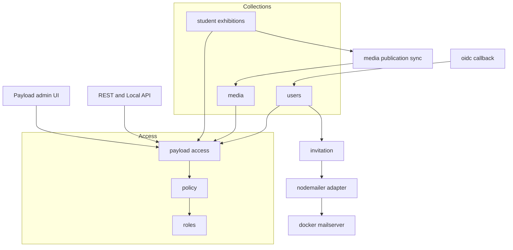
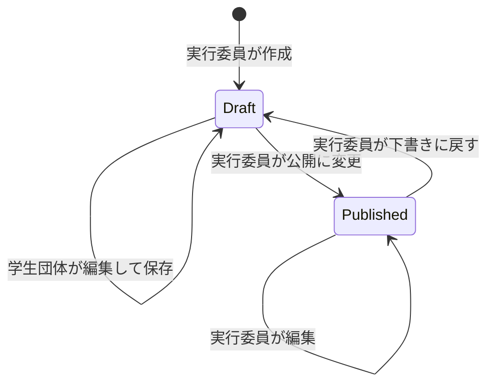

# Design Document: exhibitor-admin-ui

## Overview
**Purpose**: 学生団体 (学生団体ロール) が Payload 管理画面で、自分の企画と画像だけを迷わず入稿できるようにする。あわせて、実行委員が確認して公開するまで公式サイトに出ない状態を作る。

**Users**:
- 学生団体: 招待メールからパスワードを設定し、下書きの自分の企画を編集する。
- 実行委員: 受け皿の企画レコードとアカウントを発行し、内容を確認して公開する。

**Impact**: 次の 5 点を変える。
- `cms/src/access/policy.ts` の読み書き条件を「所有者本人のみ」へ絞る。
- 割当・公開状態・所有者にフィールド単位の制限を付ける。
- 学生団体アカウントを OIDC から切り離し、ローカル認証と招待メールで発行する。
- メディアに所有者と「公開中の企画で使用中」を持たせ、公開サイトへの露出を制御する。
- 今回新たに必要になる文言 (説明文が無い項目の説明、エラーメッセージ、招待メール等) を追加する。既存の文言は変えない (「文言表」)。

### Goals
- 要件 1〜10 の全受け入れ基準を、2026-09-28 までに本番へ反映できる規模の変更で満たす
- 管理画面・REST・Local API で同じ判定を通す (既存の「policy 1 か所で兼ねる」方針を維持する)
- スキーマ変更を列の追加だけに限る

### Non-Goals
- versions/drafts による承認ワークフロー (差し戻しは運用で扱う)
- 一括発行スクリプト本体、入稿手順書、フロントエンドの変更
- アップロード可能なファイル形式・容量の制限の追加

## Boundary Commitments

### This Spec Owns
- 学生団体ロールの read / create / update / delete 条件 (`student_exhibitions`, `media`, `users`)
- 管理画面のナビ・ダッシュボードでの表示範囲 (`admin.hidden`)
- `student_exhibitions` の所有者指定・割当項目・公開状態のフィールド制限と、公開済み保存の拒否
- `media` の所有者記録と、公開中の企画で使用中かどうかの派生フラグ、配信エンドポイントの access 評価
- 学生団体アカウントの招待メール (初回・再送)、パスワード再設定メールの文面、期限切れの案内
- OIDC コールバックでの学生団体の拒否
- 招待リンクの有効期限 (発行から 72 時間の定数) と、問い合わせ先 URL を環境変数 `EXHIBITOR_CONTACT_URL` から読む処理
- 本書「文言表」に載る文言
- `docs/cms-operations.md` の運用手順の追記

### Out of Boundary
- フロントエンド (`frontend/`) のコード。ただし `pnpm generate:types` が再生成する `frontend/src/cms-types.ts` の差分は含む (列の追加だけで、既存の型は変わらない)
- aramakisai-infra 側の設定 (「別リポジトリで行う作業」に列挙し、そちらで実施する)
- 実行委員アカウントの発行 (荒牧祭SSO (Zitadel) による OIDC のまま)
- メールサーバーの送信ドメイン設定 (SPF / DKIM は vaultwarden 用に既に稼働している)

### Allowed Dependencies
- Payload 3.88 (collection / field access、hooks、`forgotPassword` / `sendEmail` Local API)
- `@payloadcms/email-nodemailer@3.88.0` (新規)
- aramakisai-infra の docker-mailserver (`mailserver.prod.svc.cluster.local:587`)
- 依存方向: `access/roles.ts` → `access/policy.ts` → `access/payload-access.ts` → `collections/*`, `globals/*`, `auth/*`, `hooks/*` → `payload.config.ts`。逆方向の import を禁止する。`auth/invitation.ts` は `collections/*` から呼ばれる側で、`collections/*` を import しない。

### Revalidation Triggers
- `student_exhibitions.status` の値や意味を変えるとき (フロントエンドは `status=published` を直接見ている)
- `media` の未認証 read 条件を変えるとき (公開サイトの画像配信に直結する)
- `users` の認証方式、または OIDC のロール写像を変えるとき

## Architecture

### Existing Architecture Analysis
- access は `policy.ts` の純粋関数が `boolean | Where` を返す。`payload-access.ts` が Payload の呼び出し規約へ写し、`collections/index.ts` / `globals/index.ts` の登録口で一括して結線する。この構造は変えない。
- 登録口 `withAccess` は `access` を丸ごと上書きする。`admin.hidden` も同じ登録口で付ける。
- 現状の穴:
  - 学生団体は他団体の公開企画と全メディアを読める。
  - 割当・公開状態を変えられる。
  - `/api/media/serve` は access を評価しない。
  - OIDC はメール一致で任意のユーザーに紐づく。

### Architecture Pattern & Boundary Map



**Architecture Integration**:
- 採用パターン: 既存の policy 集約を拡張する。承認は 2 状態なので drafts は入れない。
- 新規コンポーネントは 3 つ。
  - `auth/invitation.ts`: 招待の組み立て・送信・記録
  - `auth/email-templates.ts`: 招待メールの文面
  - `hooks/media-publication.ts`: 使用中フラグの再計算
- Steering 準拠: ロール判定は `roles.ts` / `policy.ts` に集約する。環境変数は `env.ts` 経由で読む。スキーマ変更はマイグレーション経由で入れる。

### Technology Stack

| Layer | Choice / Version | Role in Feature | Notes |
|---|---|---|---|
| Backend | Payload 3.88.0 | access・hooks・auth・Local API | 既存 |
| Email | `@payloadcms/email-nodemailer` 3.88.0 (新規) | SMTP 送信 | `SMTP_HOST` があるときだけ有効化する。無いローカル環境では Payload 既定のコンソール出力になる |
| Jobs | Payload 3.88 のジョブキュー (`jobs.tasks` / `jobs.autoRun`) | 招待メールを commit 後に送る | `payload-jobs` コレクション (テーブル) が追加される |
| Data | Postgres 16 (`@payloadcms/db-postgres`) | 列の追加 | マイグレーション 1 本 |
| Infra | docker-mailserver (aramakisai-infra) | 送信 | 587 / STARTTLS。送信者 `noreply@aramakisai.com` |

## File Structure Plan

### New Files
```
cms/src/
├── auth/
│   ├── invitation.ts            # 有効期限の計算、招待トークン発行、送信、結果の記録
│   ├── invitation.test.ts       # 有効期限 (発行から 72 時間) の単体テスト
│   ├── email-templates.ts       # 招待メールの件名と本文 (文言表 M-01, M-02, M-05, M-06)
│   └── invitation.int.test.ts   # 作成・再送・API 経由作成・送信失敗・期限切れトークン
├── components/
│   └── AutoFillInitialPassword.tsx  # users 新規作成画面でパスワード欄と確認欄に乱数を自動入力する client component (ui フィールド)
├── hooks/
│   ├── media-publication.ts     # 企画の保存・削除時に media.used_in_published を再計算
│   └── media-publication.int.test.ts
└── migrations/<timestamp>_exhibitor_admin_ui.ts   # pnpm migrate:create で生成
```

### Modified Files
- `cms/src/access/policy.ts`:
  - 学生団体の read / update / delete の Where を差し替える。create は media のみに絞る。
  - 未認証の media Where を追加する。
  - `isHiddenInAdmin` を追加する。
- `cms/src/access/payload-access.ts`: フィールド access 用の `executiveOnlyField` / `denyField` を追加する。
- `cms/src/collections/index.ts`, `cms/src/globals/index.ts`: 登録口で `admin.hidden` を結線する。
- `cms/src/collections/student-exhibitions.ts`:
  - owner の表示とフィールド access。
  - 割当・status のフィールド access。
  - 所有者重複の検証、公開済み保存の拒否、メディア同期フック。
  - 画像 5 枚上限の検証、文言の差し替え。
- `cms/src/collections/media.ts`:
  - `owner` / `used_in_published` を追加する。作成時にこの 2 つを設定する。
  - serve で `overrideAccess: false` を付ける。
  - 使用中の画像の変更拒否、文言。
- `cms/src/collections/users.ts`:
  - `email` の上書き定義、フィールド access、招待記録フィールド、`resend_invite`。
  - 作成時のパスワード差し替え、招待送信、再設定メール文面、期限切れトークンの案内。
- `cms/src/auth/role-mapping.ts`: `student_exhibitor` のグループ写像を削除する。
- `cms/src/auth/authentik-endpoints.ts`: ユーザーの新規作成を実行委員ロールに限る。既存ユーザーの引き当てと紐づけは現行のまま。
- `cms/src/payload.config.ts`:
  - `email` アダプタを追加する。`SMTP_HOST` がある環境だけで有効にし、S3 の変数 (`S3_BUCKET` があれば他を `requireEnv`) と同じく、`NOREPLY_SMTP_PASSWORD` と `EXHIBITOR_CONTACT_URL` を読み込み時に `requireEnv` する (未設定なら起動失敗)。`infisical run --env=prod` には `SMTP_HOST` が入らないため、ローカル起動はコンソール出力のまま動く。
  - `jobs` 設定を追加する: タスク `sendInvitation`、`autoRun: [{ cron: '*/10 * * * * *' }]`、`shouldAutoRun: () => !process.env.VITEST`、`jobsCollectionOverrides` で `payload-jobs` の access を実行委員のみにする。
- `cms/src/components/ZitadelLoginButton.tsx`: ボタン文言を U-01 に変える (ユーザー指示)。
- `cms/src/app/(payload)/admin/importMap.js`: `AutoFillInitialPassword` の 1 エントリだけを追加する (`payload generate:importmap`。ローカル起動で消える S3 / 荒牧祭SSO 関連のエントリの差分は含めない)。
- `cms/package.json`: `@payloadcms/email-nodemailer` を追加する。
- `cms/src/access/policy.test.ts`, `access.int.test.ts`, `auth/role-mapping.test.ts`, `auth/authentik-endpoints.test.ts`, `collections/media.int.test.ts`: 拡張する。`access.int.test.ts` の「owner を省略した作成では自分が所有者になる」「他者を owner に指定した作成でも自分が所有者になる」は、学生団体の作成禁止に合わせて書き換える。
- `cms/src/payload-types.ts`, `frontend/src/cms-types.ts`: `pnpm generate:types` で再生成する。
- `docs/cms-operations.md`: 運用手順を追記する (要件 6)。

## System Flows

### 招待メール (作成・再送)

```mermaid
sequenceDiagram
    participant Actor as 実行委員 or API
    participant Users as users collection
    participant Jobs as payload jobs queue
    participant Runner as jobs autoRun
    participant Payload as payload auth
    participant Smtp as mailserver
    Actor->>Users: create role student exhibitor
    Users->>Users: beforeOperation replaces password with random
    Users->>Jobs: afterChange queues sendInvitation in same transaction
    Users-->>Actor: commit and respond
    Runner->>Jobs: run queued job after commit
    Runner->>Payload: forgotPassword disableEmail with 72h expiration
    Payload-->>Runner: token
    Runner->>Smtp: sendEmail invitation with timeout
    Runner->>Users: update invite status sent or failed
    Actor->>Users: update resend invite true
    Users->>Users: beforeChange moves flag to context
    Users->>Jobs: afterChange consumes flag and queues job
```

- 送信は作成・更新のトランザクションの commit 後に行う。Payload の操作には commit 後に走るフックが無いため、ジョブキュー (`payload.jobs`) を使う。
  - afterChange と afterOperation はどちらも commit の前に走る (`payload/dist/collections/operations/create.js:291` の afterChange、`:308` の afterOperation、`:324` の commit)。フックの中でメール送信やトークン発行をすると、失敗時に不整合が起きる。
    - 例: `forgotPassword` は自分の失敗で `killTransaction` を呼んで作成を巻き戻す (`auth/operations/forgotPassword.js:150`)。フックがその例外を握りつぶすと、作成は成功を返すのにユーザーは残らない。
  - 操作に付随するトランザクションの後始末は `utilities/commitTransaction.js` / `killTransaction.js` だけで、commit 後のコールバックの口は無い。
  - afterChange で `req.payload.jobs.queue({ task: 'sendInvitation', input: { userId }, req })` を呼ぶと、ジョブの行が同じトランザクションに入る。作成が巻き戻れば、ジョブも残らない。キュー投入の失敗は例外のまま投げ、作成・更新の失敗として扱う。
  - ジョブは `jobs.autoRun` (`payload/dist/index.js:239-244`、Cron) が commit 後に拾って実行する。間隔は 10 秒 (`*/10 * * * * *`)。テスト中は `shouldAutoRun` を偽にし、テストから `payload.jobs.run()` を呼ぶ。
- ジョブ `sendInvitation` は、トークン発行・送信・記録を自分のトランザクションで行う。
  - トークン発行 (`forgotPassword`) と送信 (`sendEmail`) の失敗は、`invite_status=failed` と理由を記録して正常終了する (4.10)。再試行はしない。
  - 記録 (`payload.update`) 自体の失敗は例外のまま投げ、ジョブの再試行 (`retries: 2`) に任せる。
- 再送はトークンを上書きするため、以前のリンクは無効になる (4.12)。
- `forgotPassword` と記録用の `update` は users の afterChange を再び起こす。再送フラグは、キューに入れる前に `req.context` から削除する。作成時のキュー投入は `operation === 'create'` のときだけ行う。

### 企画の公開状態とメディアの公開



- 遷移のたび、または公開中の企画を保存・削除したときに、前後の画像 ID の和集合について `used_in_published` を再計算する。
- 学生団体の画像は `used_in_published=true` のあいだだけ未認証に返る。また、そのあいだは学生団体本人も変更・削除できない。

## Requirements Traceability

| Requirement | Summary | Components | Interfaces | Flows |
|---|---|---|---|---|
| 1.1, 1.2 | 学生団体は自分の企画だけ | AccessPolicy | `canRead` | — |
| 1.3 | 実行委員は全件 | AccessPolicy | `canRead` / `canUpdate` | — |
| 2.1, 2.2, 2.4 | ナビの表示範囲 | AccessPolicy, 登録口 | `isHiddenInAdmin` | — |
| 2.3 | エリア・出演枠の名前解決 | AccessPolicy | 未認証と同じ公開 read を維持 | — |
| 3.1 | owner をセレクトで選ぶ | StudentExhibitions | owner `filterOptions` | — |
| 3.2, 3.3 | 指定値で保存・全経路で同じ | StudentExhibitions | フィールド access (Local API は overrideAccess) | — |
| 3.4 | owner 重複を拒否 | StudentExhibitions | `ownerConstraint` | — |
| 3.5 | 所有者に一覧・下書き編集 | AccessPolicy | `canRead` / `canUpdate` | 公開状態 |
| 3.6 | owner を学生団体に出さない | StudentExhibitions | owner `access.read` | — |
| 3.7, 3.8, 3.9 | 割当は読み取り専用・変更不可 | StudentExhibitions | `executiveOnlyField` | — |
| 3.10 | 学生団体の作成禁止 | AccessPolicy | `canCreate` | — |
| 4.1, 4.5 | メールだけで作成 | Users, AutoFillInitialPassword | `replaceInitialPassword` | 招待 |
| 4.2, 4.3, 4.4, 4.6 | 招待メールの自動送付・文面 | Invitation, EmailTemplates | `sendInvitation` | 招待 |
| 4.7 | noreply から SMTP | payload.config | nodemailerAdapter | — |
| 4.8 | 期限 = 発行から 72 時間 | Invitation | `INVITATION_EXPIRATION_MS` | 招待 |
| 4.9 | 問い合わせ先を設定値で与える | Invitation, payload.config | `requireEnv('EXHIBITOR_CONTACT_URL')` | 招待 |
| 4.10 | 失敗の記録 | Invitation, Users | `invite_status` / `invite_error` | 招待 |
| 4.11, 4.12 | 再送と旧リンク無効化 | Users, Invitation | `resend_invite` | 招待 |
| 4.13 | 設定後に学生団体としてログイン | Users | Payload 標準の reset | — |
| 4.14 | 期限切れの案内 | Users | `guardResetToken` | — |
| 4.15, 4.16 | 再設定メールは本人要求のみ | Users | Payload 標準の forgot-password (文面は既定のまま) | — |
| 4.17 | 本人のパスワード変更 | AccessPolicy | users `canRead` / `canUpdate` (本人) | — |
| 4.18 | ロール・メール・OIDC ID の変更拒否 | Users | `executiveOnlyField` | — |
| 4.19 | 学生団体のユーザー作成拒否 | AccessPolicy | `canCreate` | — |
| 5.1, 5.2 | 学生団体グループの OIDC 拒否 | RoleMapping | `resolveRole` | — |
| 5.3 | メール一致時は紐づけ、パスワード差し替えと他セッション無効化 | OidcCallback | `payload.update`, `addSessionToUser` | — |
| 5.4 | 実行委員は従来どおり | OidcCallback | — | — |
| 6.1〜6.7 | 運用手順書 | docs/cms-operations.md | — | — |
| 7.1 | 2 状態 | StudentExhibitions | status options | 公開状態 |
| 7.2, 7.3 | 学生団体は公開状態を変えられない | StudentExhibitions | status `executiveOnlyField` | — |
| 7.4 | 下書きは所有者が編集 | AccessPolicy | `canUpdate` | 公開状態 |
| 7.5 | 公開済みの保存拒否と案内 | AccessPolicy, StudentExhibitions | `canUpdate`, `guardPublishedExhibition` | 公開状態 |
| 7.6 | 下書きを未認証に返さない | AccessPolicy | 既存の公開 Where | — |
| 7.7 | 実行委員は双方向に変更 | StudentExhibitions | — | 公開状態 |
| 7.8 | 公開状態で絞り込み | StudentExhibitions | 一覧の標準フィルタ + 列表示 | — |
| 7.9, 7.10 | 未使用の学生団体画像を非公開 | AccessPolicy, MediaPublicationSync | 未認証の media Where, `syncMediaPublication` | 公開状態 |
| 7.11 | serve で access を評価 | Media | `findByID({ overrideAccess: false })` | — |
| 7.12 | 状態の判別表示 | StudentExhibitions | status をサイドバーと一覧列に表示 | — |
| 8.1〜8.6 | ラベル・説明文 | 各コレクション | 文言表 | — |
| 9.1 | 所有者を記録 | Media | `assignMediaOwner` | — |
| 9.2, 9.3 | 本人の画像だけ | AccessPolicy | media `canRead` | — |
| 9.4, 9.5, 9.6 | 使用中でない自分の画像だけ変更可 | AccessPolicy, Media | media `canUpdate` / `canDelete`, `guardPublishedMedia` | — |
| 9.7 | 実行委員は全件 | AccessPolicy | — | — |
| 9.9 | 他人の画像の指定を拒否 | StudentExhibitions | `imageConstraint` | — |
| 9.8 | 既存 (所有者なし) の扱い | AccessPolicy | 所有者なしは未認証に公開、学生団体には非表示 | — |
| 10.1 | 期日 | 全体 | — | — |
| 10.2 | 3 者の自動テスト | Testing Strategy | — | — |
| 10.3 | 追加のみのスキーマ | Data Models | — | — |

## Components and Interfaces

| Component | Layer | Intent | Req Coverage | Key Dependencies | Contracts |
|---|---|---|---|---|---|
| AccessPolicy | access | ロール × コレクションの read/create/update/delete と hidden を決める | 1, 2, 3.5, 3.10, 4.17, 4.19, 7.4-7.6, 7.9, 9 | roles (P0) | Service |
| FieldAccess | access | フィールド単位の実行委員限定・全面禁止 | 3.6-3.9, 4.18, 7.2, 7.3 | roles (P0) | Service |
| StudentExhibitions | collections | 所有者・割当・公開状態の制限、公開済み保存拒否、同期の起点 | 3, 7, 8 | AccessPolicy (P0), MediaPublicationSync (P0) | State |
| Media | collections | 所有者の記録、使用中フラグ、serve の access 評価 | 7.9-7.11, 9 | AccessPolicy (P0) | API |
| Users | collections | 招待の起点、フィールド制限、期限切れ案内、再設定文面 | 4 | Invitation (P0) | Service |
| Invitation | auth | 有効期限計算・トークン発行・送信・記録 | 4.2-4.12 | env.ts (P0), nodemailer (P0) | Service |
| EmailTemplates | auth | 招待メールの件名・本文の生成 | 4.3, 4.4, 4.6 | — | Service |
| MediaPublicationSync | hooks | `used_in_published` の再計算 | 7.9, 7.10, 9.5 | Media (P0) | Batch |
| RoleMapping / OidcCallback | auth | 学生団体の OIDC ログイン拒否 | 5 | Users (P0) | API |

### access

#### AccessPolicy

| Field | Detail |
|---|---|
| Intent | ロールごとのデータ範囲を Where で返し、管理画面とすべての API で共有する |
| Requirements | 1.1-1.3, 2.1-2.4, 3.5, 3.10, 4.17, 4.19, 7.4-7.6, 7.9, 9.2-9.8 |

**Responsibilities & Constraints**
- 純粋関数を保つ (DB を引かない)。判定に使う値はすべて Where で表す。
- 実行委員には常に `true` を返す。

**Contracts**: Service [x]

##### Service Interface
```typescript
type AccessResult = boolean | Where;

function canRead(user: CmsUser | null, collection: string, now?: string): AccessResult;
function canCreate(user: CmsUser | null, collection: string): boolean;
function canUpdate(user: CmsUser | null, collection: string): AccessResult;
function canDelete(user: CmsUser | null, collection: string): AccessResult;
/** 実行委員以外には、EXHIBITOR_VISIBLE 以外のコレクション・グローバルを隠す */
function isHiddenInAdmin(user: CmsUser | null, slug: string): boolean;

const EXHIBITOR_VISIBLE = ['student_exhibitions', 'media'] as const;
```

判定表 (実行委員は全操作 `true`、表に無い組み合わせは現行どおり):

| コレクション | 操作 | 学生団体 | 未認証 |
|---|---|---|---|
| student_exhibitions | read | `owner = 自分` | `status = published` (現行) |
| student_exhibitions | create | false | false |
| student_exhibitions | update | `owner = 自分 AND status = draft` | false |
| student_exhibitions | delete | false | false |
| media | read | `owner = 自分` | `owner が空 OR owner.role = executive OR used_in_published = true` |
| media | create | true | false |
| media | update / delete | `owner = 自分 AND used_in_published = false` | false |
| users | read / update | `id = 自分` | false |
| users | create / delete | false | false |
| 上記以外 | read | 現行の公開 read (map_areas 等の名前解決に必要) | 現行 |

- `used_in_published` の条件には `equals: false` を使う。作成時のフックが必ず `false` を入れるため、学生団体の画像に NULL は生じない。
- 学生団体の media read を `owner = 自分` に限る。このため、未認証に公開している既存・実行委員の画像も学生団体には見えない (9.2, 9.8)。

**Implementation Notes**
- 結線: `collections/index.ts` の `withAccess` と `globals/index.ts` の `withAccess` で `admin: { ...x.admin, hidden: ({ user }) => isHiddenInAdmin(toCmsUser(user), x.slug) }` を付ける。
- Risk: 一覧の件数・ページングは Where 適用後の件数になる (1.1)。これは Payload の標準の挙動である。

#### FieldAccess (`payload-access.ts` に追加)
```typescript
/** 実行委員だけが対象操作を行える。Local API の overrideAccess では評価されない */
const executiveOnlyField: FieldAccess;
/** 誰もフォームや API から書けない。フックが overrideAccess で書く値に使う */
const denyField: FieldAccess;
```
- false のとき、Payload は入力値を捨てて既存値を保つ。保存自体は成功する (3.8, 7.3 の「反映しない」)。
- 管理画面は、update が false のフィールドを読み取り専用で、read が false のフィールドを非表示で描画する。

### collections

#### StudentExhibitions

| Field | Detail |
|---|---|
| Intent | 受け皿レコードの割当を守り、公開済みの企画を学生団体から保護する |
| Requirements | 3.1-3.10, 7.1-7.8, 7.12, 8.2-8.6 |

**Responsibilities & Constraints**

フィールド制限:

| フィールド | read | create / update | 管理画面 |
|---|---|---|---|
| owner | executiveOnly | executiveOnly | 表示する (`admin.hidden` を外す)。`filterOptions: { role: { equals: 'student_exhibitor' } }` |
| status | 全員 | executiveOnly | `admin.position: 'sidebar'` |
| area_id, booth_number, booth_label | 全員 | executiveOnly | — |
| performance_slots (join) | 全員 | (書込不可) | 説明文のみ差し替え |
| `<category>.images` | 全員 | 全員 | 5 枚上限の検証 (M-E07)、本人の画像だけ指定可 (M-E17) |

- owner の現行 `beforeChange` フック (実行委員以外は既存値か `req.user.id` を入れる) を削除する。フィールド access が学生団体の値を捨て、Local API (overrideAccess) は指定値をそのまま保存する。これにより経路の差が無くなる (3.3)。
- `admin.defaultColumns: ['organization_name', 'categories', 'status']`。一覧で状態が分かり (7.12)、標準の「絞り込み」で status を条件にできる (7.8)。
- `hooks.beforeValidate` に `ownerConstraint` を追加する。
  - owner と同じ値を持つ別レコードがあれば `ValidationError` (path `owner`、M-E02) を投げる。
  - 指定ユーザーのロールが学生団体でなければ M-E03 を投げる。
  - 管理画面・REST・Local API で同じ判定を通す (3.3, 3.4)。
- `hooks.beforeValidate` に `imageConstraint` を追加する。`hooks/payload-constraints.ts` の既存フックと同じく、違反を `ValidationError` で返す方式にする。`maxRows` は使わない。
  - 各カテゴリの `images` が 6 枚以上なら M-E07 を返す。
  - リクエスト元が学生団体 (`overrideAccess` でない) のとき、`originalDoc` に無く新しく加わった media ID を `overrideAccess: true` で引き、owner が本人でないものがあれば M-E17 を返す (9.9)。画像欄は ID の形式しか検証されないため、この検査が無いと他団体の未公開画像の ID を保存できる。
- `hooks.beforeOperation` に `guardPublishedExhibition` を追加する。
  - 対象: operation `update` かつ `args.id` があり、`args.overrideAccess !== true` で、リクエスト元が学生団体の場合。
  - 対象を `overrideAccess: true` で引き、owner が本人かつ status が published なら `APIError(M-E01, 403, undefined, true)` を投げる。
  - 本人の企画でなければ何もしない (後段の access が Forbidden を返す。他団体の公開状態を漏らさないため)。
- `hooks.afterChange` / `afterDelete` から `syncMediaPublication` を呼ぶ。呼ぶのは、前後いずれかの status が published のときだけ。

**Contracts**: State [x]
- 状態は `draft` / `published` の 2 値で、既存の `status` 列を使う (7.1)。遷移できるのは実行委員だけ。

#### Media

| Field | Detail |
|---|---|
| Intent | 画像の所有者を記録し、公開サイトへの露出を「公開中の企画で使用中」に限る |
| Requirements | 7.9-7.11, 9.1-9.9 |

- 追加フィールド:
  - `owner`: relationship → users、非必須、`index: true`。read / create / update は executiveOnly。
  - `used_in_published`: checkbox。read は全員、create / update は denyField。
- `hooks.beforeChange` (operation `create`) の `assignMediaOwner`: `owner = req.user?.id ?? null`、`used_in_published = false` を入れる。
- `hooks.beforeOperation` の `guardPublishedMedia`:
  - 対象: operation `update` / `delete` で、`overrideAccess !== true` かつリクエスト元が学生団体の場合。`args.id` の指定だけでなく、一覧からの一括操作 (`args.where` の指定) も対象にする。一括削除は、beforeOperation (`payload/dist/collections/operations/delete.js:32`) の後で where に access の Where を合成して対象を絞る (同 `:46-57`)。このため使用中の画像は黙って対象から外れ、ここで判定しないと M-E05 が出ない。
  - `args.id` か `args.where` で対象を `overrideAccess: true` で引き、本人所有で `used_in_published = true` のものがあれば `APIError(M-E05, 403, undefined, true)` を投げる。
- `upload.admin`: `useAsTitle` は現行どおりとする。

**Contracts**: API [x]

| Method | Endpoint | Request | Response | Errors |
|---|---|---|---|---|
| GET | /api/media/serve/:id/:size | cookie (任意) | 302 Location | 404 (存在しない、または read access 外) |

- `findByID({ collection: 'media', id, depth: 0, req, overrideAccess: false })` に変える (7.11)。
- 302 先の `/api/media/file/<filename>` は、Payload 標準の `checkFileAccess` が同じ read access を評価する。`disablePayloadAccessControl` は今後も設定しない。

#### Users

| Field | Detail |
|---|---|
| Intent | 学生団体アカウントのローカル発行と招待、本人によるパスワード管理 |
| Requirements | 4.1-4.19 |

- フィールド:
  - `email`: 上書き定義。update は executiveOnly。
  - `role`: create / update は executiveOnly。read は全員のまま (認証後の `req.user.role` 判定に要るため絞らない)。
  - `authentik_sub`: read / update は executiveOnly。
  - `invite_status`: select `sent` / `failed`。
  - `invite_sent_at`: date。
  - `invite_error`: text。
  - `invite_*` の 3 つは、read が executiveOnly、create / update が denyField。
  - `resend_invite`: checkbox、`virtual: true`、create / update は executiveOnly。
- `admin.defaultColumns: ['email', 'role', 'invite_status']`
- `hooks.beforeOperation`:
  - `replaceInitialPassword`: operation `create` で、作成するロールが学生団体 (未指定時は既定値の学生団体) なら、`args.data.password` を `randomBytes(32).toString('hex')` に差し替える。管理画面から届いた値も、API で省略した場合も同じに扱う (4.1, 4.5, 4.6)。
- 管理画面の新規作成でパスワードを入力させないため、`ui` フィールド `initial_password_autofill` (ラベルなし、`admin.components.Field` に `AutoFillInitialPassword`) を置く。
  - 必須判定はクライアント側にある。サーバー側のフックだけでは、実行委員は何も入力せずに保存できない。
    - `@payloadcms/ui/dist/views/Edit/index.js:588` が `requirePassword: !id` を Auth に渡す。
    - `views/Edit/Auth/index.js:262-278` は、作成時にパスワード欄 (`required: true`) と確認欄を常に描画する。表示条件はフィールド権限に依存しない。
    - 確認欄の検証は `fields/ConfirmPassword/index.js:87-93` (`required: true`)。
    - パスワード欄の検証は `payload/dist/fields/validations.js:75` (`required && !value` なら必須エラー)。
    - 送信時は `forms/Form/index.js:283-292` の `validateForm` がこれらを実行する。不合格なら API を呼ばずに止まる。
    - このため、サーバー側の beforeOperation / beforeValidate は呼ばれる前に送信が止まる。
  - Auth ブロックそのものは差し替えられない。`views/Edit/index.js:579` の `BeforeFields` を与えるスロットが、collection 設定側 (`@payloadcms/next/dist/views/Document/renderDocumentSlots.js`) に無いためである。
  - `AutoFillInitialPassword` は `useDocumentInfo()` で id が無い (新規作成) ときだけ、マウント時に `useForm().dispatchFields({ type: 'UPDATE', path: 'password', value })` と、同じ値の `confirm-password` を 1 回だけ入れる。値は `crypto.getRandomValues` で作る 32 バイトの 16 進文字列とする。
    - `forms/Form/fieldReducer.js:388-405` の UPDATE は、未登録のパスでも値を持つフィールドを作る。
    - 各欄の `useField` が値の変化で再検証するため、必須・一致の検証を通過する。
  - 画面には何も描画しない。パスワード欄と確認欄は自動入力済み (伏せ字) で表示されたまま残る。欄を隠す設定の口が無いためである。説明文は付けない。
  - 送られた値は `replaceInitialPassword` がサーバー側で差し替えるため、クライアントの乱数の強度には依存しない。
  - 実装: `useDocumentInfo()` の id が無いときだけ、`useEffect` と `useRef` で 1 回だけ `useForm().dispatchFields` を呼ぶ (`@payloadcms/ui/dist/forms/Form/fieldReducer.js:388-405`、`forms/Form/index.js:616` で `dispatchFields` が form context に載る)。
- `hooks.beforeOperation` (続き):
  - `guardResetToken`: operation `resetPassword` で、`req.payload.db.findOne` を `resetPasswordToken = token AND resetPasswordExpiration > now` の条件で引く。見つからなければ `APIError(M-E06, 403, undefined, true)` を投げる (4.14)。
- `hooks.beforeChange`: `data.resend_invite === true` かつ実行委員なら、`req.context.resendInviteFor = <id>` を立てて、`data.resend_invite` を消す。
- `hooks.afterChange`:
  - operation `create` かつ `doc.role === 'student_exhibitor'` なら `req.payload.jobs.queue({ task: 'sendInvitation', input: { userId: doc.id }, req })` を呼ぶ (4.2)。送信は commit 後にジョブが行う (System Flows 参照)。
  - `req.context.resendInviteFor === doc.id` なら、フラグを削除してから同じくキューに入れる (4.11)。対象が学生団体でなければ入れない。
- `auth.forgotPassword`:
  - 再設定メールの件名・本文は Payload 既定のまま使う (4.15)。`generateEmailSubject` / `generateEmailHTML` は設定しない。
  - `expiration` は設定しない (設定すると招待の呼び出しごとの `expiration` が無視されるため)。再設定リンクは既定の 1 時間になる。

**Contracts**: Service [x] (フックとして Payload から呼ばれる。公開インターフェースは Invitation 側)

### auth

#### Invitation

| Field | Detail |
|---|---|
| Intent | 招待リンクの有効期限を決め、トークンを発行して送信し、結果をユーザーに記録する |
| Requirements | 4.2-4.12 |

**Dependencies**
- Outbound: `env.ts` の `requireEnv('EXHIBITOR_CONTACT_URL')` — P0
- Outbound: `payload.forgotPassword` / `payload.sendEmail` / `payload.update` — P0
- External: nodemailer adapter → docker-mailserver — P0。SMTP には短いタイムアウトを付ける (`transportOptions` の `connectionTimeout` / `greetingTimeout` / `socketTimeout` を各 10 秒)

**Contracts**: Service [x]

##### Service Interface
```typescript
/** 招待リンクの有効期限。発行 (再送を含む) から 72 時間の固定値 */
const INVITATION_EXPIRATION_MS = 72 * 60 * 60 * 1000;

type InvitationResult =
  | { readonly kind: 'sent'; readonly expiresAt: Date }
  | { readonly kind: 'failed'; readonly reason: string };

/**
 * ジョブ `sendInvitation` のハンドラから呼ぶ (commit 後に実行される)。
 * トークン発行・送信の失敗は例外にせず、users の invite_* に記録してから返す。
 * 記録そのものの失敗だけは例外にし、ジョブの再試行に任せる。
 */
function sendInvitation(args: {
  readonly req: PayloadRequest;
  readonly userId: number;
}): Promise<InvitationResult>;
```
- 問い合わせ先: `requireEnv('EXHIBITOR_CONTACT_URL')` を M-02 の `{問い合わせ先}` に渡す。本番では起動時に検証済み。メール無効のローカル環境で未設定なら、既存の `requireEnv` の例外を M-E11 の `{エラーメッセージ}` として記録する (新しい文言は足さない)。
- トークン: `payload.forgotPassword({ collection: 'users', data: { email }, disableEmail: true, expiration: INVITATION_EXPIRATION_MS, req })`。
- リンク:
  - パスワード設定: `${CMS_PUBLIC_URL}/admin/reset/${token}`
  - ログイン: `${CMS_PUBLIC_URL}/admin/login`
  - `CMS_PUBLIC_URL` が未設定のローカル環境では `http://localhost:3000` を使う。
- 送信: `payload.sendEmail({ to, subject: M-01, html: M-02 })`。
- 記録: `payload.update({ collection: 'users', id, data: { invite_status, invite_sent_at: now, invite_error }, overrideAccess: true, req })`。成功時は `invite_error` を null にする。
- 失敗は `invite_status='failed'` と理由を記録し、`payload.logger.error` にも出す (4.10)。
- Preconditions: user が存在する。
- Postconditions: `resetPasswordToken` が新しい値になり、以前のトークンは無効になる (4.12)。

#### EmailTemplates
```typescript
interface InvitationMailInput {
  readonly resetUrl: string;
  readonly loginUrl: string;
  readonly contactUrl: string;
}
function invitationSubject(): string;                        // M-01
function invitationHtml(input: InvitationMailInput): string; // M-02
```
- 本文は「文言表」の M-02 の文をそのまま使う。改行は `<br>`、リンクは `<a>` にする。
- 本文に有効期限は書かない。
- パスワード文字列を受け取る引数を持たない (4.6)。

#### RoleMapping / OidcCallback
- `GROUP_TO_ROLE` から `student_exhibitor` を削除する。学生団体グループだけの利用者は `toCmsIdentity` が null になり、既存の 403 経路 (メッセージは現行の M-E08) に乗る (5.1, 5.2)。
- 新規作成は `identity.role === 'executive'` のときだけ行う (5.2, 5.4)。
- 既存ユーザーの引き当て (sub → email) と紐づけ、role を executive にする更新は現行のまま変えない。実行委員が入稿者を兼ねる可能性があるため、メールが学生団体アカウントと一致しても拒否しない (5.3)。
- 引き当てたユーザーの更新前の role が `student_exhibitor` だった場合は、同じ更新で次も行う (5.3)。
  - `data.password` に `randomBytes(32).toString('hex')` を入れる。`payload.update` は auth コレクションの `password` を受けるとハッシュを作り直す (`payload/dist/collections/operations/utilities/update.js:26-30, 237-242`)。これで、学生団体に伝わっていたパスワードでは実行委員の権限を得られない。
  - `addSessionToUser` を呼ぶ前に `user.sessions = []` とする。`addSessionToUser` は sessions が空なら今回のセッションだけの配列を DB に書く (`auth/sessions.js` の `addSessionToUser`)。JWT 戦略は、sessions に sid が無いトークンを無効として扱う (`auth/strategies/jwt.js:73-78`)。このため、今回のログイン以外の既存セッションは全て無効になる。
  - 企画の owner は変えない。
- 上の 2 点 (学生団体グループだけの利用者の拒否と、学生団体ユーザーを新規作成しないこと) により、荒牧祭SSO でログインできるのは実行委員だけになる。

### hooks

#### MediaPublicationSync

| Field | Detail |
|---|---|
| Intent | 公開中の企画から参照されているかを `media.used_in_published` に反映する |
| Requirements | 7.9, 7.10, 9.5 |

**Contracts**: Batch [x]
```typescript
/** 4 カテゴリの images から media ID を集める */
function collectImageIds(doc: Partial<StudentExhibition> | null | undefined): number[];
/** 指定 ID それぞれについて、公開中の企画から参照されているかを再計算して書き込む */
function syncMediaPublication(req: PayloadRequest, mediaIds: readonly number[]): Promise<void>;
```
- Trigger: `student_exhibitions` の afterChange (`previousDoc` と `doc` の和集合) と afterDelete (`doc`)。前後いずれかの status が published のときだけ呼ぶ。
- 処理:
  1. `find(student_exhibitions, where: status=published AND OR(stage.images|exhibit.images|vendor.images|other.images in ids), limit 0, depth 0, overrideAccess: true, req)` で、使用中の ID を求める。
  2. 使用中の ID に `true`、残りに `false` を、`payload.update({ collection: 'media', where: { id: { in } }, overrideAccess: true, req })` で書き込む。where 指定の update は失敗を例外にせず戻り値の `errors` に入れて返す (`payload/dist/collections/operations/update.js:202-210`) ため、`errors` が空でなければ throw して企画の保存ごと巻き戻す。
- Idempotency: 何度実行しても同じ結果になる。同じ `req` のトランザクション内で走るため、企画の保存と一緒に確定・巻き戻しされる。


## Data Models

### Logical Data Model (追加のみ)

| テーブル | 追加列 | 型 | NULL | 既存行 |
|---|---|---|---|---|
| media | owner_id | integer FK → users.id (ON DELETE SET NULL)、index | 可 | NULL (= 既存画像。未認証に公開、学生団体には非表示) |
| media | used_in_published | boolean | 可 | NULL (学生団体の画像は作成時に false が入る) |
| users | invite_status | enum (`sent`, `failed`) | 可 | NULL |
| users | invite_sent_at | timestamptz | 可 | NULL |
| users | invite_error | varchar | 可 | NULL |

- `users.resend_invite` は `virtual: true` で、列を作らない。
- `student_exhibitions` には列の追加も変更も無い (owner の `admin.hidden` を外すのは表示だけの変更)。
- 列に DB 既定値を持たせない。既定値があると既存行が埋まり、既存画像の公開判定が変わるためである。
- `cms-schema-check.yml` の検出対象 (削除・型変更・必須化) に当たる変更は無い (10.3)。

## Error Handling

### Error Strategy
- 学生団体に案内が要る拒否は、日本語の `APIError` (isPublic) か `ValidationError` で返す。管理画面ではトーストかフィールド横に出る。
- フィールド単位の変更拒否 (割当・公開状態・ロール等) はエラーにせず、値を捨てる。
- 招待の送信・トークン発行の失敗は、作成・更新を失敗させずに記録する (commit 後のジョブで行うため)。キュー投入の失敗は作成・更新の失敗として返す。

### Error Categories and Responses
| 事象 | 応答 | 文言 |
|---|---|---|
| 学生団体が自分の公開済み企画を保存 | 403 | M-E01 |
| owner の重複 | 400 (ValidationError, path owner) | M-E02 |
| owner に学生団体以外を指定 | 400 (ValidationError, path owner) | M-E03 |
| 学生団体の企画作成・他団体レコードの操作 | 403 | M-E04 (Payload 既定) |
| 学生団体が使用中の自分の画像を変更・削除 | 403 | M-E05 |
| 期限切れ・無効な招待/再設定リンク | 403 | M-E06 |
| 画像 6 枚以上 | 400 | M-E07 |
| 学生団体が他人の画像を企画に指定 | 400 | M-E17 |
| OIDC で学生団体相当のグループだけ | 403 | M-E08 (現行) |
| 招待の失敗: 送信エラー | 記録のみ | M-E11 |

### Monitoring
- 招待の送信失敗は `payload.logger.error({ userId, reason }, 'invitation failed')` に出す。
- OIDC の拒否は既存の `logger.warn` を使う。

## Testing Strategy

- **Unit**
  - `policy.test.ts`: 判定表の全行を 3 者 (実行委員・学生団体・未認証) で確認する。`isHiddenInAdmin` の許可リストも確認する。
  - `invitation.test.ts`:
    - トークン発行に渡す有効期限が 72 時間 (ミリ秒) であること
  - `role-mapping.test.ts`: `student_exhibitor` だけのグループで null になること。
  - `authentik-endpoints.test.ts`:
    - 実行委員以外のロールではユーザーを新規作成しないこと
    - 実行委員は従来どおり通ること
    - メールが学生団体アカウントと一致した場合、role が executive になり、パスワードのハッシュが変わり、sessions が今回の 1 件だけになること
- **Integration (実 DB、`*.int.test.ts`)**
  - `access.int.test.ts`:
    - 学生団体の一覧・件数・他団体 ID の直接取得
    - 下書きの保存、公開済みの保存 (M-E01)
    - 割当と status を変える保存が反映されないこと
    - 作成の拒否
    - users の本人 read/update と、role / email の変更が反映されないこと
    - 実行委員の owner 指定作成を、Local API (overrideAccess) と REST 相当 (user 付き、overrideAccess: false) で行い、同じ値と同じ重複エラーになること
  - `media-publication.int.test.ts`:
    - 学生団体の画像が、企画の公開で未認証に読めるようになること
    - 下書きに戻すと読めなくなること
    - 公開中の差し替えで外れた画像が false になること
    - 使用中の画像を学生団体が更新・削除できないこと (ID 指定と where 指定の両方)
    - 学生団体が他人の画像 ID を自分の企画に保存すると M-E17 になること
    - serve エンドポイントで未使用画像が 404 になること
    - 所有者なしの既存画像が未認証に読め、学生団体の一覧に出ないこと
  - 結合テストは `DATABASE_URL` と `PAYLOAD_SECRET` が無いと `describe.skipIf` でスキップされる。ローカルでは `pnpm db:up` と `pnpm migrate` の後、環境変数をコマンドの前に付けて実行する (`.env` は使わない)。スキップされていないことを出力で確かめる。
  - `invitation.int.test.ts`:
    - 送信は `vi.spyOn(payload, 'sendEmail')` で捕捉する (`payload/dist/index.js:416-417` で `sendEmail` はインスタンスのプロパティとして定義されている)。送信失敗は `mockRejectedValueOnce` で作る。
    - `EXHIBITOR_CONTACT_URL` は CI に無いため `vi.stubEnv` で与える。
    - ジョブは `payload.jobs.run()` をテストから呼んで実行する。
    - 期限切れは `payload.db.updateOne` で `resetPasswordExpiration` を過去の日時に書き換えて作る。
    - Local API と REST 相当で作成すると 1 通送られること、本文にパスワードが含まれないこと
    - 再送で旧トークンの reset が M-E06 になること
    - `sendEmail` が失敗しても作成が成功し、`invite_status=failed` になること
    - 作成が巻き戻ったときはジョブも残らず、送信されないこと
    - 期限切れトークンで M-E06 になること
- **手動確認 (本番反映前、ローカル管理画面)**
  - 学生団体でログインし、ナビに企画と画像だけが出ること
  - マップ配置エリアの名前と出演枠の表が表示されること (2.3)
  - 公開済み企画が読み取り専用になること
  - アカウント画面でパスワードを変更できること
  - reset 画面で期限切れの案内が出ること

## Security Considerations
- 学生団体のパスワードは、作成時にサーバー側で乱数に差し替える。実行委員もスクリプトも値を知らない。
- 再設定メールは Payload 標準の forgot-password エンドポイントだけが送る (4.16)。応答は、登録の有無を区別しない既定の挙動のままにする。
- 荒牧祭SSO でログインできるのは実行委員だけになる (学生団体グループだけの利用者は拒否し、学生団体ユーザーを新規作成しない)。メール一致による既存アカウントへの紐づけは、実行委員が入稿者を兼ねる可能性があるため残す。その際、学生団体だったアカウントのパスワードを乱数に差し替え、他のセッションを無効にする。
- 未認証の画像取得は serve と file の両経路で read access を通す。S3 バケット自体の匿名 GET は本 spec の外で確認する (別リポジトリ作業 3)。

## Migration Strategy
1. `pnpm migrate:create exhibitor_admin_ui` で列と `payload-jobs` テーブルを追加するマイグレーションを生成し、`pnpm generate:types` を実行する。
2. aramakisai-infra 側の変更 (下記 1・2・4) を同時にマージする。`SMTP_HOST` が入ると `NOREPLY_SMTP_PASSWORD` と `EXHIBITOR_CONTACT_URL` が必須になるため、3 つを同じ変更で入れる。3 つとも無い間は CMS は起動し、送信はコンソール出力になる。
3. CMS をデプロイする (ArgoCD PreSync で migrate)。
5. 既存ユーザーに学生団体ロールが残っていれば、運用手順に従って招待を再送する。

## 別リポジトリで行う作業 (aramakisai-infra)
- migrate の PreSync Job は `cms-secrets` しか読まない (`gitops/manifests/prod/cms/migrate-job.yaml:25-27` の `envFrom`)。Job も `payload.config.ts` を読み込むため、SMTP 関連の値と `EXHIBITOR_CONTACT_URL` はすべて `cms-secrets` に入れる。Deployment の `env` には置かない。

1. `gitops/manifests/prod/cms-secrets/external-secret.yaml`: `data` に `secretKey: NOREPLY_SMTP_PASSWORD` (remoteRef key `NOREPLY_SMTP_PASSWORD`) を追加する。`template.data` にも `NOREPLY_SMTP_PASSWORD: "{{ .NOREPLY_SMTP_PASSWORD }}"` を追加する。
2. 同じ ExternalSecret の `template.data` に、固定値 `SMTP_HOST: mailserver.prod.svc.cluster.local` を追加する。
3. S3 バケット (Hetzner Object Storage) の `payload-uploads/` 以下に対して、匿名 GET が拒否されることを確認する。許可されていれば拒否に変える。
4. Infisical の prod に `EXHIBITOR_CONTACT_URL` を登録し、`cms-secrets` の ExternalSecret の `data` と `template.data` に追加する。1・2 と同時にマージする (`SMTP_HOST` が入ると起動時に必須になるため)。

### CMS 側の環境変数 (`payload.config.ts`)
| 変数 | 必須 | 用途 |
|---|---|---|
| `SMTP_HOST` | 任意 | 接続先。設定時のみ nodemailer アダプタを有効化する |
| `NOREPLY_SMTP_PASSWORD` | `SMTP_HOST` 設定時は必須 (読み込み時に `requireEnv`) | 送信専用アカウントのパスワード |
| `EXHIBITOR_CONTACT_URL` | `SMTP_HOST` 設定時は必須 (読み込み時に `requireEnv`) | 招待メールの問い合わせ先 |

- 固定値:
  - ポート 587、`requireTLS: true`
  - `tls.servername: 'mail.aramakisai.com'` (証明書のホスト名に合わせる)
  - ユーザー `noreply@aramakisai.com`、送信元アドレスも同じ
  - 送信者名は M-05
  - タイムアウト: `connectionTimeout` / `greetingTimeout` / `socketTimeout` を各 10 秒
- ローカル (SMTP 無効) では Payload のコンソール adapter が宛先と件名しか出力しない (`payload/dist/email/consoleEmailAdapter.js:9`)。パスワード設定リンクは、ローカル DB から `SELECT reset_password_token FROM users WHERE email = '<宛先>'` でトークンを取り出し、`http://localhost:3000/admin/reset/<トークン>` を開いて確かめる。

## 運用手順書 (`docs/cms-operations.md`) に追記する節
- 既存の記述で今回の変更と食い違う箇所も書き換える。
  - `:57`: ロール割り当ては IdP のグループ変更で自動反映される、という記述。学生団体はローカル認証になる。
  - `:66`: ローカル起動手順。`SMTP_HOST` が無いとメールはコンソール出力になることを添える。
  - `:168-170`: ロール写像が参照するグループに `student_exhibitor` が含まれる、という記述。
  - `:180-200`: 「ロールごとの見え方」の表と説明 (他者の公開済み企画が一覧に出る、1 出展者 1 企画の作成等)。今回の判定表に合わせる。
- 環境変数の表 (`:80-90`) と、Infisical に登録が必要なシークレットの表 (`:154-161`) に、`SMTP_HOST` / `NOREPLY_SMTP_PASSWORD` / `EXHIBITOR_CONTACT_URL` を足す。
- 「学生団体アカウントの発行」(6.1):
  - 管理画面での作成手順 (メールアドレスとロールを入れて保存する。パスワード欄は自動入力されるため触らない)。
  - API (`POST /api/users` と Local API) の例。
  - 招待メールの自動送付。
  - 「招待メール」列の見方。
  - 送信失敗・期限切れ・紛失時の再送 (「招待メールを再送する」にチェックして保存)。
- 「受け皿レコードの作成と割当」(6.2): 次の順に行う手順を、管理画面と API の双方について書く。
  1. アカウント作成
  2. 企画作成 (所有者・団体名・カテゴリ・マップ配置エリア・ブース番号・マップ表示ラベル)
  3. ステージ出演枠の作成
- 「学生団体のパスワード再設定」(6.3): ログイン画面の「パスワードをお忘れですか？」から行い、リンクは 1 時間有効であることを書く。
- 「学生団体から見た操作範囲」(6.4): 見える項目、編集できる項目、公開までの流れ。
- 「確認と公開」(6.5): 一覧を公開状態で絞り込み、内容を確認して「公開」に変える。
- 「公開後の修正依頼」(6.6): 下書きに戻す → 学生団体が修正 → 再度公開する。下書きの間は公式サイトから消えることを明記する。
- 「公開前の修正依頼の連絡手段」(6.7): システム外の連絡手段 (実行委員会が団体との連絡に使っている手段) で依頼する。
- 「既存の OIDC 学生団体アカウントの移行」: role が学生団体で `authentik_sub` を持つユーザーは、荒牧祭SSO でログインできなくなる。招待を再送してローカル認証へ移す。

## 「design で決める事項」の決定
| 事項 | 決定 |
|---|---|
| 学生団体による公開状態の変更と、公開済み企画の保存を拒否する手段 | status のフィールド access (実行委員のみ、学生団体の値は捨てる)、コレクション update access `owner=自分 AND status=draft`、beforeOperation の案内 (M-E01) |
| 公開企画から参照されるメディアの判定 | 派生フラグ `media.used_in_published` を、企画の afterChange / afterDelete で再計算する |
| 再設定リンクの有効期限 | 1 時間 (Payload 既定。collection 側の expiration は未設定を維持する) |
| 招待リンクの有効期限 | 発行 (再送を含む) から 72 時間の固定値。コード上の定数とし、設定値は持たない |
| 問い合わせ先の置き場所 | 環境変数 `EXHIBITOR_CONTACT_URL`。本番の値は Infisical と k8s manifest で与える |
| 招待メールの組み立て | commit 後にジョブキューのタスクで、`forgotPassword({ disableEmail: true, expiration })` でトークンを得て、独自の件名・本文 (M-01 / M-02) を `payload.sendEmail` で送る |

## 文言表

表の読み方:
- 表 A には、この spec で新しく必要になる文言と、既存の文言で要件と食い違うものだけを載せる。
- 文言はユーザーのレビューで確定済み。実装はこの表の文字列をそのまま使う。
- 表 B の文言は現行のまま使う。
- 説明文を付けるのは、学生団体に見えていて、ラベルだけでは入力に迷う項目に限る。1 文・おおむね 30 字以内とする。実行委員にしか見えない項目には説明を付けない。
- 実装はこの表の文字列をそのまま使い、表に無い文言を追加しない。`{…}` は差し込み値を表す。

### 表 A: 新規・要判断

| ID | 対象 | 現行の文言 | 提案 | 根拠 |
|---|---|---|---|---|
| F-05 | 学生企画 status 説明 (学生団体には読み取り専用) | (なし) | 公開は実行委員が行い、公開後は編集できません。 | 8.2・8.3・7.12 |
| F-15 | 学生企画 images 説明 | 最大 5 枚まで | 最大5枚まで。1枚目がサムネイルとして表示されます。 | 8.5。1 枚目がカードのサムネイルになる (`toCard`)。上限は M-E07 で検証する |
| F-17 | 学生企画 performance_slots 説明 | 実行委員が割り当てる。閲覧のみ | ステージ出演枠 | 8.4 |
| F-19 | 学生企画 area_id 説明 | NULL=マップ非掲載。展示・出店のみ使用 | 割り当てられた出店エリア | 8.1・8.4 |
| F-21 | 学生企画 booth_number 説明 | エリア内番号 (area_id+booth_number UNIQUE)。展示・出店のみ使用 | 割り当てられた出店グループ内の番号もしくは教室番号 | 8.1・8.4 |
| F-23 | 学生企画 booth_label 説明 | 展示・出店のみ使用 | 割り当てられた出店エリア名 | 8.4 |
| F-27 | 学生企画 links.url 説明 | (なし) | https://から始まるURLを入力してください。 | 入力の制約 (`validate` は https:// のみを許す) |
| F-41 | メディア alt 説明 | (なし) | 画像の内容を短い文で説明してください。画像読込み時にエラーが発生した場合などに表示されます。 | 8.5。「代替テキスト」だけでは何を書くか分からない |
| F-42 | メディア owner ラベル (新規) | (新規) | アップロード者 | 実行委員だけに表示される |
| F-44 | メディア used_in_published ラベル (新規) | (新規) | 公開企画で使用中 | インターネットに公開し学生団体の読み取り権限を削除する。 |
| F-55 | ユーザー invite_status ラベル (新規) | (新規) | 招待メール | 実行委員だけに表示される |
| F-56 | ユーザー invite_status 選択肢 | (新規) | 送信済み / 送信失敗 | 4.10 |
| F-57 | ユーザー invite_sent_at ラベル (新規) | (新規) | 招待送信日時 | — |
| F-59 | ユーザー invite_error ラベル (新規) | (新規) | 送信エラー | 4.10 |
| F-61 | ユーザー resend_invite ラベル (新規) | (新規) | 招待メールを再送 | 4.11 |
| M-E01 | 学生団体が自分の公開済み企画を保存 | (なし) | 公開中の企画のため、修正は実行委員に依頼してください。 | 7.5 |
| M-E02 | owner の重複 | (なし) | {メールアドレス}は既に{団体名}の所有者です。 | 3.4 |
| M-E03 | owner に学生団体以外を指定 | (なし) | 所有者に学生団体のアカウントを選んでください。 | 3.1 |
| M-E05 | 学生団体が使用中の自分の画像を変更・削除 | (なし) | 公開中の企画で使用中の画像は変更・削除できません。 | 9.5 |
| M-E06 | 期限切れ・無効なパスワード設定リンク | Token is either invalid or has expired. (Payload 固定) | リンクが無効なため、実行委員に招待メールの再送を依頼してください。 | 4.14 |
| M-E07 | 画像が 6 枚以上 | (なし) | 画像は最大5枚です。 | 現行の説明「最大 5 枚まで」を実際に検証する |
| M-E17 | 学生団体が他人の画像を企画に指定 | (なし) | 【仮】自分がアップロードした画像だけを選べます。 | 9.9 |
| M-E11 | 招待失敗の記録: 送信エラー | (新規) | 送信に失敗しました: {エラーメッセージ} | 4.10 |
| U-01 | ログインボタン (`ZitadelLoginButton.tsx`) | Zitadel でログイン | 荒牧祭SSOでログイン | 既存文言据え置きの例外 |
| M-01 | 招待メール 件名 | (新規) | 【荒牧祭】HP企画ページの入稿用アカウントのご案内 | 4.3 |
| M-02 | 招待メール 本文 | (新規) | 下記「M-02 本文」 | 4.3・4.4・4.6 |
| M-05 | 送信者名 (`defaultFromName`) | (新規) | 荒牧祭実行委員会広報部 | 4.7 |
| M-06 | 問い合わせ先 (M-02 の `{問い合わせ先}`) | (新規) | 環境変数 `EXHIBITOR_CONTACT_URL` から差し込む | 4.4 |

**M-02 本文**
```
学生団体ご担当者様

荒牧祭実行委員会広報部です。
荒牧祭公式サイトに掲載する企画情報を入稿していただくため、CMS(コンテンツ管理システム)のアカウントを作成しました。

以下の手順でログインし、企画情報を入力してください。

1. 下記のリンクを開き、パスワードを設定してください。
   {パスワード設定リンク}
2. ログイン画面で、このメールを受信したメールアドレスと設定したパスワードを入力してください。
   {ログイン画面のURL}
3. 「学生企画」を開き、実行委員が用意した自団体の企画を編集してください。

入力した内容は、実行委員が確認したうえで公式サイトに公開します。

ご不明な点は、下記のフォームからお問い合わせください。
{問い合わせ先}

なお、パスワード設定リンクは発行から72時間で無効になります。期限切れの場合は、実行委員に招待メールの再送を依頼してください。

※このメールは送信専用のアドレスから送信しています。

荒牧祭実行委員会広報部
```

### 表 B: 現行のまま使う文言

| 対象 | 現行の文言 (そのまま使う) |
|---|---|
| コレクション・グローバル名 | 学生企画 / メディア / ユーザー / 祭基本情報 |
| 学生企画のラベル・選択肢・説明 | 所有者、公開状態 (公開 / 下書き)、団体名 (説明: 学生団体・サークル名)、カテゴリ (ステージ・展示・出店・その他、説明: 1 つ以上選択する (上限なし))、{カテゴリ}の企画内容 (説明: カテゴリで「{カテゴリ}」を選択したときだけ表示する)、企画名、紹介文、画像、ステージ出演枠、マップ配置エリア、ブース番号、マップ表示ラベル、リンク (説明: 公式サイト・SNS 等のリンク (並べ替えた順に表示する))、プラットフォーム (X・Instagram・Facebook・YouTube・TikTok・LINE・ホームページ)、URL |
| メディアのラベル | 代替テキスト |
| ユーザーのラベル・説明 | メールアドレス、ロール (実行委員・学生団体、説明: ロールはコード上の定義 (CMS_ROLES) からのみ決まる)、Authentik sub (説明: Authentik の sub。OIDC ログイン時に設定される) |
| パスワード設定画面 | パスワード再発行 (reset 画面の見出し、Payload 既定) |
| 既存のエラーメッセージ | このアクションは許可されていません。 (Payload 既定)、CMS に対応するグループを持たない (OIDC、学生団体グループだけの場合を含む)、{カテゴリ}を選択した場合は企画名の入力が必要、出演枠が割り当てられているためステージの選択を外せません、同じエリア内で既に使われているブース番号、URL は https:// で始まる形式で入力してください |
| パスワード再設定メール | Payload 既定の件名「パスワードの再設定」と本文をそのまま使う (`generateEmailSubject` / `generateEmailHTML` は設定しない) |
