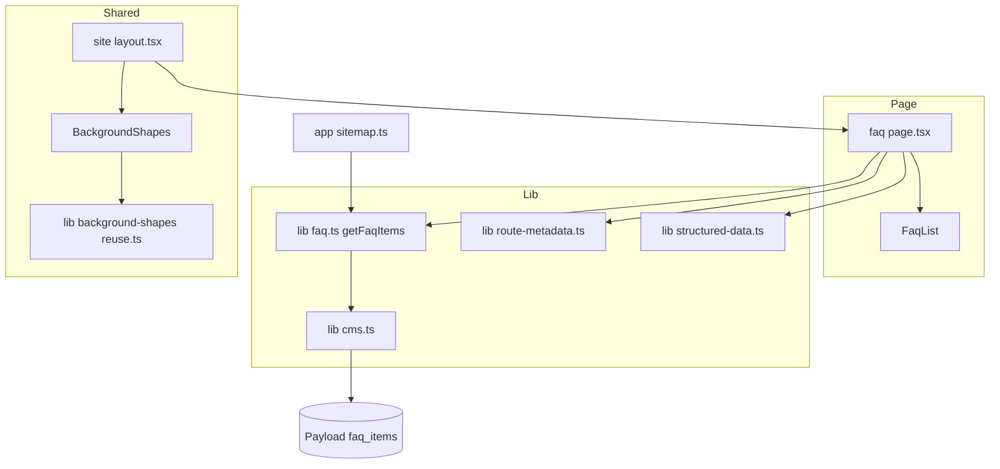
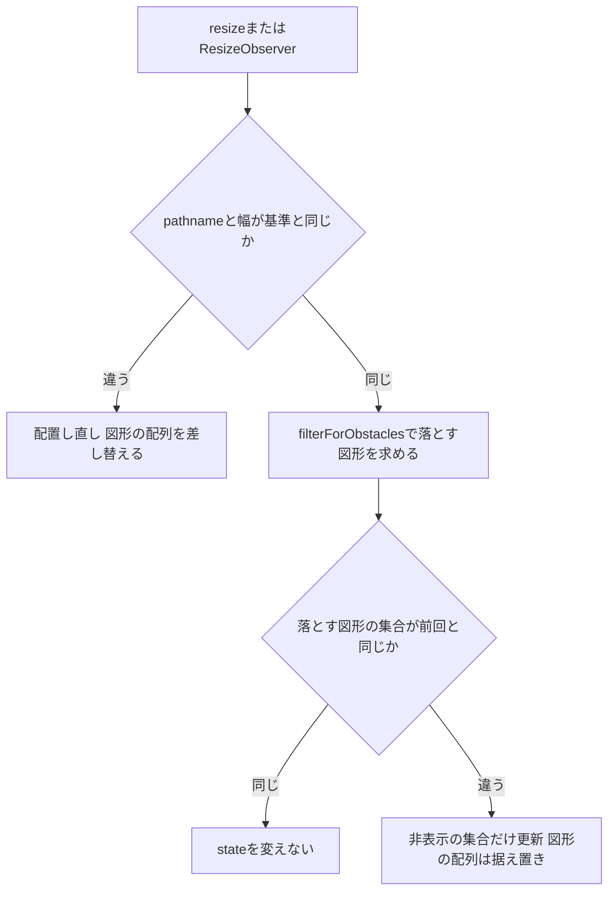

# 技術設計書

## Overview
**Purpose**: CMSの`faq_items`に登録された質問と回答を`/faq`で一覧表示し、現在404の「よくある質問」を来場者に提供する。
**Users**: 来場者が開催前・開催中の両フェーズで閲覧する。実行委員はCMSで項目と表示順を管理する。
**Impact**: `(site)`ルートグループに`/faq`ページを追加し、sitemapで`/faq`を固定ページ候補から外して専用に扱う。あわせて、アコーディオンの開閉で背景図形が入場アニメーションをやり直さないよう、背景図形コンポーネントの再判定時の描画を変える。

### Goals
- `faq_items`全件を表示順どおりにアコーディオンで表示する(要件1、2)
- 0件・取得失敗でも200で壊れずに表示する(要件3)
- メタデータ・パンくず・sitemapを既存の一覧ページと同じ形式で出す(要件4、5)
- 開閉しても背景図形が入場をやり直さず、重なりの判定で落ちた図形だけが隠れる

### Non-Goals
- 検索・絞り込み・カテゴリ・「すべて開く」等の操作
- FAQPageの構造化データ(要件4.4)
- `faq_items`コレクション定義・ヘッダー・フッター・公開パス一覧の変更
- サイト共通の書体移行(LINE Seed JP)・見出し色の変更・白い光彩の仕組み

## Boundary Commitments

### This Spec Owns
- `/faq`のページ・取得関数・一覧部品
- `/faq`のメタデータ定義(`ROUTE_METADATA`への追加)とsitemapエントリ
- 背景図形コンポーネントの再判定時の描画(図形の配列を固定し、落ちた図形は非表示で表す)

### Out of Boundary
- 背景図形の配置・除外ルール(`frontend/src/lib/background-shapes/*`、`docs/background-shapes/rules.md`)。除外ルールは「不透明な面と重ねない」「図形どうしを24px以上離す」「装飾範囲の外に出さない」の3つで、FAQのために除外対象を足さない。質問文・回答文に図形が重なることはルール上許容される
- サイト共通の書体(LINE Seed JP)の読み込み、見出しの基底スタイル(`app/globals.css:144-197`)の変更
- ヘッダー・フッター・ナビゲーション・公開パス一覧(`/faq`は`lib/phase.ts:38`、`lib/navigation.ts:65`に登録済み)
- CMS側(`cms/`)の変更

### Allowed Dependencies
- `lib/cms.ts`の`cms.findMany`、`cms-types.ts`の`FaqItem`
- `components/section-heading.tsx`、`components/icons.tsx`の`ExpandMoreIcon`、`components/json-ld.tsx`
- `lib/page-metadata.ts`、`lib/site-metadata.ts`、`lib/route-metadata.ts`、`lib/structured-data.ts`
- `lib/phase.ts`・`lib/crawl-targets.ts`の公開判定

### Revalidation Triggers
- `faq_items`のフィールド名・型の変更(`question`・`answer`・`sort`・`updatedAt`)
- 背景図形コンポーネントの状態の持ち方(`MeasureState`)や入場アニメーションの張り直し条件が変わるとき
- サイト共通の書体移行が入ったとき(FAQの文字指定を追随させる)

## Architecture

### Existing Architecture Analysis
- 共通レイアウト`frontend/src/app/(site)/layout.tsx:11-45`がHeader・BackgroundShapes・main・Footerを敷く。16行の`cookies()`で配下のページはすべてリクエスト時描画になり、CMSの更新は再デプロイなしで反映される(要件2.3)
- 一覧ページの取得失敗は、取得関数が例外を投げ(`lib/topics.ts:25`)、ページが`catch`して空配列にする(`app/(site)/topics/page.tsx:24-29`、`announcements/page.tsx:44-49`)。ステータスは200のまま
- 一覧ページのメタデータは`ROUTE_METADATA`(`lib/route-metadata.ts:12-39`)と`buildPageMetadata`で出す(`topics/page.tsx:9-21`)
- sitemapは`OWN_HANDLING_ROUTES`(`app/sitemap.ts:18-24`)に無いコード定義ルートを`pages`の固定ページ候補として扱う(117-126行)。現状`/faq`はこちらに入り、`pages`に`faq`が無いと掲載されない

### Architecture Pattern & Boundary Map



- Selected pattern: 既存の一覧ページと同じ「Server Componentのページ+取得関数+表示部品」
- 新規部品: 取得関数`getFaqItems`(sitemapと共用するため)、表示部品`FaqList`(項目の構造と開閉の見た目を持つ)
- Steering compliance: CMSクライアントは`lib/cms.ts`の単一インスタンス、環境変数は`env`経由、テストは同階層

### Technology Stack

| Layer | Choice / Version | Role in Feature | Notes |
|-------|------------------|-----------------|-------|
| Frontend | Next.js 15 App Router / React 19 | ページ・メタデータ | Server Componentのみで構成 |
| Styling | Tailwind CSS 4.3.2 | 見た目・開閉のtransition | `details-content:`・`group-open:`・`motion-reduce:`バリアント |
| Data | Payload 3 REST(`/api/faq_items`) | 質問と回答 | 未認証で全件読める |

## File Structure Plan

### Directory Structure
```
frontend/src/
├── app/(site)/faq/
│   ├── page.tsx            # メタデータ・取得・パンくず・0件分岐
│   └── page.test.tsx
├── components/
│   ├── faq-list.tsx        # FaqList(区切り線+details項目の並び)
│   └── faq-list.test.tsx
└── lib/
    ├── faq.ts              # getFaqItems(表示用に整形した配列を返す)
    └── faq.test.ts
```

### Modified Files
- `frontend/src/lib/route-metadata.ts` — `CodeRoutePath`に`'/faq'`を足し、`ROUTE_METADATA`にタイトル「よくある質問」と固定の説明文を追加
- `frontend/src/lib/route-metadata.test.ts` — ルート一覧の完全一致検証(4-15行)に`/faq`を加え、件数を6にする
- `frontend/src/app/sitemap.ts` — `OWN_HANDLING_ROUTES`に`'/faq'`を足し、`getFaqItems`で最終更新日時を求める専用ブロックを追加
- `frontend/src/app/sitemap.test.ts` — `/faq`を`pages`から掲載していた前提(112-122、147-149行)を、`faq_items`由来に書き換える。`@/lib/faq`を`vi.mock`し、`beforeEach`で`getFaqItems`の既定を`[]`にする(モックしないと実物が例外を投げ、`/faq`が黙って欠落してテストが素通りする)
- `frontend/src/components/background-shapes.tsx` — 再判定で描画する図形の配列を配置結果で固定し、落ちた図形を`visibility: hidden`で表す
- `frontend/src/components/background-shapes.test.tsx` — 再判定で図形が隠れる・戻るときに他の図形の`transform`が保持される回帰テスト

## System Flows

### 背景図形の再判定



## Requirements Traceability

| Requirement | Summary | Components | Interfaces | Flows |
|-------------|---------|------------|------------|-------|
| 1.1 | 主見出し | FaqPage | SectionHeading | |
| 1.2 | 全項目を1ページに掲載 | getFaqItems, FaqList | `limit: 0` | |
| 1.3 | 質問と回答の対応づけ | FaqList | `details`/`summary` | |
| 1.4 | 改行を保ったプレーンテキスト | FaqList | Reactのテキスト描画+`whitespace-pre-line` | |
| 1.5 | アコーディオン、キーボード操作、状態伝達 | FaqList | `details`/`summary` | |
| 1.6 | `(site)`のページ | FaqPage | `app/(site)/faq/page.tsx` | |
| 1.7 | 両フェーズで閲覧可能 | (既存)`lib/phase.ts:38` | | |
| 1.8 | 初期状態は全閉 | FaqList | `open`属性を付けない | |
| 2.1, 2.2 | `sort`昇順、未設定は後ろ | getFaqItems | `sort: ['sort']` | |
| 2.3 | 再デプロイなしで反映 | (既存)`(site)/layout.tsx:16` | | |
| 3.1, 3.2, 3.3 | 0件・失敗時の表示と200 | FaqPage | `try/catch` | |
| 4.1, 4.2 | タイトル・説明文・canonical・OGP | FaqPage, ROUTE_METADATA | `buildPageMetadata` | |
| 4.3 | パンくず | FaqPage | `buildBreadcrumbJsonLd` | |
| 4.4 | FAQPageを出さない | FaqPage | | |
| 5.1〜5.5 | sitemap | sitemap.ts, getFaqItems | `maxUpdatedAt` | |

## Components and Interfaces

| Component | Domain/Layer | Intent | Req Coverage | Key Dependencies | Contracts |
|-----------|--------------|--------|--------------|------------------|-----------|
| getFaqItems | Lib | `faq_items`を表示順で取得し整形 | 1.2, 2.1, 2.2, 5.2 | cms.findMany (P0) | Service |
| FaqPage | Page | メタデータ・取得・0件分岐・パンくず | 1.1, 1.6, 3.x, 4.x | getFaqItems (P0), FaqList (P0) | — |
| FaqList | UI | 区切り線と開閉できる項目の並び | 1.2〜1.5, 1.8 | ExpandMoreIcon (P1) | State(ブラウザ標準) |
| sitemap(変更) | Route | `/faq`エントリ | 5.x | getFaqItems (P0) | — |
| BackgroundShapes(変更) | Shared UI | 再判定で入場をやり直さない | — | lib/background-shapes/reuse.ts (P0) | State |

### Lib

#### getFaqItems

| Field | Detail |
|-------|--------|
| Intent | `faq_items`全件を`sort`昇順で取得し、表示用の型に整形する |
| Requirements | 1.2, 2.1, 2.2, 5.2 |

**Contracts**: Service [x]

##### Service Interface
```typescript
export interface FaqEntry {
  readonly id: number;
  readonly question: string;
  readonly answer: string;
  readonly updatedAt: string;
}

/** 取得失敗は例外を投げる(lib/topics.tsと同じ規約)。呼び出し側がcatchして扱いを決める */
export function getFaqItems(): Promise<FaqEntry[]>;
```
- Preconditions: なし(未認証で全件読める)
- Postconditions: `cms.findMany('faq_items', { sort: ['sort'], limit: 0, depth: 0 })`の結果を順序を保って返す
- Invariants: 公開判定のフィルタは付けない(`faq_items`は公開状態を持たない)

**Implementation Notes**
- `sort`未設定(null)の項目はPostgresの昇順の既定`NULLS LAST`で末尾に来る(要件2.2)。Payloadの`buildOrderBy`はnullsを指定せず`asc()`を使う。実データでの確認は検証タスクで行う
- Payloadは`-createdAt`を第2キーとして必ず足すため、`sort`が同値の項目どうし・未設定の項目どうしは作成が新しい順に並ぶ
- 失敗時は`!result.ok`で`Error`を投げる(`lib/topics.ts:25`と同形)

### Page

#### FaqPage(`app/(site)/faq/page.tsx`)

| Field | Detail |
|-------|--------|
| Intent | `/faq`の描画とメタデータ |
| Requirements | 1.1, 1.6, 3.1, 3.2, 3.3, 4.1〜4.4 |

**Responsibilities & Constraints**
- `generateMetadata`は`topics/page.tsx:9-21`と同形。`ROUTE_METADATA['/faq']`の`title`・`description`、`path: '/faq'`、`ogType: 'website'`、`imageCandidates: []`
- 本体は`getFaqItems()`を`try/catch`し、失敗時は空配列にする(`topics/page.tsx:24-29`と同形)。0件と失敗は同じ表示
- `buildBreadcrumbJsonLd([{ name: 'トップ', path: '/' }, { name: 'よくある質問', path: '/faq' }], env.NEXT_PUBLIC_SITE_URL)`を`JsonLd`で出す(`[slug]/page.tsx:48-58`と同形)。FAQPageのJSON-LDは出さない
- `ROUTE_METADATA['/faq']`の説明文は「荒牧祭についてよくある質問と回答をまとめています。」とする

**レイアウト**(Figmaファイル`0kWDqHsLr6xE8b4FFgR1Zx`の`633:35`・`634:165`・`635:394`・`635:305`で実測。announcements/[id]/PC `619:7509`に準拠)

| 項目 | SP(〜1023px) | PC(1024px〜) |
|---|---|---|
| 外側 | 左右16・上16・下48 | 左右80・上48・下80 |
| 本文列 | 幅いっぱい(390幅で358) | 幅768、中央寄せ |
| 見出しと一覧の間隔 | 24 | 32 |
| 0件時の見出しと文言の間隔 | 16 | 16 |

- 外側は既存一覧(`topics/page.tsx:32`)の余白クラス`mx-auto max-w-[1440px] px-4 pt-4 pb-12 lg:px-20 lg:pt-12 lg:pb-20`だけを流用する(同じ行の`flex flex-col gap-*`は持ち込まない)。内側に`mx-auto flex w-full max-w-[768px] flex-col`の列を置き、見出しとの間隔は列の`gap`で持つ。項目があるときは`gap-6 lg:gap-8`、0件時は`gap-4`に切り替える
- 見出しは`SectionHeading level="h1"`(ページの主見出し)に、Figmaの`Level=h2`の見た目(32px、行高125%、字間2%、中央揃え、`text-text`)を`className`で与える。太さは基底の700のまま(読込済みのZen Old Minchoは700のみ)。`SectionHeading`の`mb-6`は`mb-0!`で打ち消し、間隔は列の`gap`で持つ(`announcements/page.tsx:59`と同じ扱い)
- 0件時は見出しの下に`<p>よくある質問はありません</p>`。16px、行高170%、`text-gray-600`。左揃え(Figmaでは列幅いっぱいの左揃え)
- ヘッダーの現在地表示は出さない(ヘッダーは現行どおりで変更しない)

### UI

#### FaqList(`components/faq-list.tsx`)

| Field | Detail |
|-------|--------|
| Intent | 区切り線と、質問を押すと回答が開閉する項目の並び |
| Requirements | 1.2, 1.3, 1.4, 1.5, 1.8 |

**Contracts**: State [x](開閉状態はブラウザの`details`が持つ。Reactの状態は持たない)

```typescript
export interface FaqListProps {
  readonly items: readonly Pick<FaqEntry, 'id' | 'question' | 'answer'>[];
}
```

**方式の決定**: ネイティブの`<details>/<summary>`を採る。
- 理由: `summary`はフォーカス可能でEnter/Spaceで開閉でき、展開状態が支援技術に標準で伝わる(要件1.5)。質問(`summary`)と回答が同じ`details`に入るため、対応づけも構造で表せる(要件1.3)。JS不要でServer Componentのまま描画できる
- `name`属性は付けない。複数の項目を同時に開け、開いた項目は利用者が閉じるまで開いたまま
- `open`属性を付けずに描画し、初期状態を全閉にする(要件1.8)。Figmaの先頭1件が開いているのは開状態の見本

**構造と見た目**(FaqItem `631:576`、State=closed `631:562` / open `631:568`で実測)

```
<div>                                   FaqList
  <div 区切り線1px gray-200 />            先頭に1本
  <details class="group">               FaqItem(CMSの表示順)
    <summary>                           Row: 上下20、間隔16、行全体が押せる
      <span>質問</span>                 16px、行高140%、字間2%、font-extrabold、text-text、幅いっぱい
      <ExpandMoreIcon size=24 />        gray-600、group-open:rotate-180
    </summary>
    <div>                               Answer: 右40・下24
      <p>回答</p>                        左に2pxのOpenMarker(border-l-2 border-success)+左14
    </div>                              16px、行高180%、字間2%、Regular、text-text、whitespace-pre-line
  </details>
  <div 区切り線1px gray-200 />            各項目の下
</div>
```

- 区切り線は`details`の外に置く(閉状態・開状態のどちらでも項目の下に1本)
- `summary`は`list-none`と`[&::-webkit-details-marker]:hidden`で既定の三角を消し、`flex items-start gap-4 py-5 cursor-pointer`とする。フォーカス表示は既存の`focus-visible:outline-2 focus-visible:outline-offset-2 focus-visible:outline-primary`(`motion-toggle.tsx:20`)に合わせる
- アイコンは既存の`ExpandMoreIcon`(`components/icons.tsx:59`、リガチャ`expand_more`)。Figmaのコンポーネント名は`icon/chevron_down`だが中身は`expand_more`で、`app/layout.tsx:36`で読込済み。`aria-hidden`付きで、状態は`details`が伝える
- OpenMarkerは回答の`<p>`自身の左罫線として描く。x=0(区切り線の左端)、幅2px、`success`(#8cb76b)、回答テキストの上端から下端まで。罫線2px+内側14pxで文字の開始位置が16pxになる。質問は字下げしない
- 回答はReactのテキストとして描き(HTMLとして解釈しない、要件1.4)、`whitespace-pre-line`で改行を保つ
- 回答の右端余白40pxにより、回答の本文は質問の右端(アイコンの手前)付近で折り返す

**開閉のアニメーション**
- 対象はアイコンの回転と回答の展開だけ
- アイコン: `transition-transform duration-200 ease-out group-open:rotate-180 motion-reduce:transition-none`
- 回答の展開: `details`に`[interpolate-size:allow-keywords]`、`details-content:`バリアントで`h-0 overflow-hidden transition-[height,content-visibility] duration-200 ease-out transition-discrete`、`open:details-content:h-auto`(`::details-content`は`details`自身の疑似要素で、`group-open:`は`.group`の子孫にしか効かないため使わない)、`motion-reduce:details-content:transition-none`
- 時間と緩急は既存UIの`duration-200 ease-out`(`components/header.tsx:245,280`)に合わせる。FaqItemにFigmaのモーション定義は無い(`get_motion_context`で空)
- モーション抑制は`app/globals.css:77-84`の`motion-reduce:`バリアントで、OSの`prefers-reduced-motion`とフッターの切替(`<html data-motion="reduce">`)の両方に従う。JSのフック(`lib/use-motion-preference.ts`)は使わない
- `::details-content`・`interpolate-size`の未対応ブラウザでは展開が即時になるだけで、開閉そのものは動く

**書体についての扱い**
- Figmaの質問・回答・見出し・0件文言はLINE Seed JP(ExtraBold / Regular)。現行コードはLINE Seed JPを読み込まず(`app/layout.tsx:16-21`)、見出しは基底スタイルでZen Old Mincho(`app/globals.css:144-152`)
- 大きさ・行高・字間・太さ・色はFigmaの値を当てる。書体の読み込みはサイト共通の基盤でありFAQ単独では入れない(Out of Boundary)。見出しの書体は基底スタイルのまま、文字色だけFigmaの`#231815`(`text-text`)を当てる

### Route

#### sitemap(`app/sitemap.ts`の変更)
- `OWN_HANDLING_ROUTES`に`'/faq'`を加え、`pages`の固定ページ候補から外す(要件5.5)
- `isPublicPath('/faq', phase)`が真のとき、`getFaqItems()`を`try/catch`し、成功なら`{ url: toUrl('/faq'), lastModified: maxUpdatedAt(items.map(i => i.updatedAt)) }`を足す(要件5.1〜5.3。0件は`maxUpdatedAt`が`undefined`を返す)。失敗は`/faq`だけを欠落させる(要件5.4、50-69行と同じ扱い)

### Shared UI

#### BackgroundShapes(`components/background-shapes.tsx`の変更)

**前提(現行)**: `pathname`と幅が同じ間は配置結果(`base`)を保ち、`ResizeObserver(document.body)`の発火ごとに`refilter`が`filterForObstacles`(`lib/background-shapes/reuse.ts`)で障害物に反する図形を落とす。幅・`pathname`が変わったときだけ配置し直す。

**問題**: `details-content`の開閉アニメーション中は`body`の高さが連続して変わり、1回の開閉で`ResizeObserver`が11〜13回発火する。`refilter`は毎回新しい`visible`配列を`setState`していたため、`ShapeList`に渡る図形配列の参照が変わり、`useShapeMotion`のeffectが張り直されて全図形の入場アニメーションが再生されていた(ちらつき)。落ちる図形が1個変わるだけでも、残りの全図形が入場をやり直す。

**変更後**
- `MeasureState`は`visible`の代わりに、`base`に対する非表示インデックスの集合`hidden: ReadonlySet<number>`を持つ
- `ShapeList`には常に`base`の参照を渡す。`refilter`は`dropped`を`base`上のインデックスに変換して`hidden`だけを更新し、`base`・`sections`は作り直さない
- 非表示は図形の外枠の`visibility: hidden`で表す。要素はマウントしたままなので、`useShapeMotion`の依存(`shapes`・`entryOffsets`)は変わらない
- 非表示の集合が前回と同じなら`prev`をそのまま返し、`setState`を空振りさせる

## Data Models

### Data Contracts & Integration
- 取得: `GET {NEXT_PUBLIC_CMS_URL}/api/faq_items?sort=sort&limit=0&depth=0`
- 応答: `CmsListResponse<FaqItem>`(`cms-types.ts:447-454`: `id`・`question`・`answer`・`sort?`・`updatedAt`・`createdAt`)
- `FaqEntry`へは`id`・`question`・`answer`・`updatedAt`だけを写す

## Error Handling

| 事象 | ページ | sitemap |
|---|---|---|
| CMSの取得失敗(ネットワーク・5xx・401/403) | 空配列として0件と同じ表示、200 | `/faq`エントリだけを欠落 |
| 0件 | 「よくある質問はありません」、200 | `/faq`を最終更新日時なしで掲載 |

- 監視は既存の仕組みに委ね、本機能で追加しない

## Testing Strategy

- Unit
  - `lib/faq.test.ts`: `cms.findMany`へ`sort: ['sort']`・`limit: 0`・`depth: 0`を渡すこと、順序を保って整形すること、`ok: false`で例外を投げること
  - `components/faq-list.test.tsx`: 先頭と各項目の下に区切り線、`details`に`open`と`name`が無いこと、`summary`に質問、回答が改行を保ったテキストとして描かれHTMLが解釈されないこと
  - `lib/route-metadata.test.ts`: `/faq`を含む6ルートの定義
- Integration
  - `app/(site)/faq/page.test.tsx`: 見出し、全件表示、取得失敗と0件で同じ文言、パンくずJSON-LD(2階層)が出てFAQPageが出ないこと、メタデータのタイトル・説明・canonical。`@/env`のモックは`NEXT_PUBLIC_SITE_URL`を含む`[slug]/page.test.tsx:22`を雛形にする。HTTPステータス200は単体では検証できず、実機確認に委ねる
  - `app/sitemap.test.ts`: `/faq`が`faq_items`の最新`updatedAt`で載る、0件で日時なし、失敗で`/faq`だけ欠落、`pages`に`faq`が無くても載り、`getPageSlugsUpdatedAt`の引数に`faq`が含まれないこと
  - `components/background-shapes.test.tsx`: 同じ幅の再判定で障害物条件が変わらなければ図形の`transform`が上書きされないこと。1個の図形が隠れる・戻るときも他の図形の`transform`が保持され、隠れた図形はDOMに残って`visibility: hidden`になること
- E2E(任意): `/faq`で質問をEnterで開閉でき、開いた回答と重なる図形が表示されないこと
