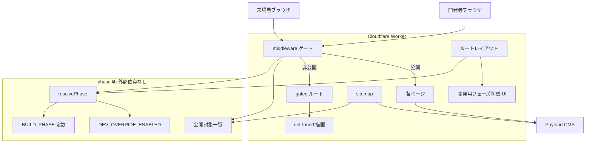
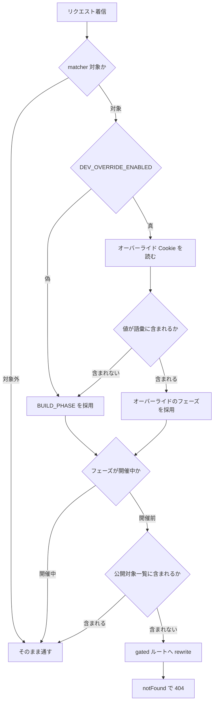
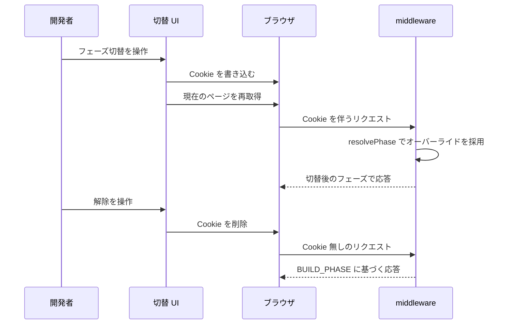

# Technical Design

## Overview

**Purpose**: 荒牧祭サイトに「開催前フェーズ」「開催中フェーズ」の 2 状態を導入し、サイト全体の公開範囲とトップページの表示を単一のソースコード定数で一括して切り替える公開ゲートを提供する。

**Users**: 開発者がフェーズ定数を PR 経由で変更することで切替を行う。実行委員は切替操作を行わないが、開催前に未完成ページが来場者へ露出しないことの保証を受け取る。来場者は現在のフェーズに応じた公開範囲のサイトを閲覧する。

**Impact**: 現在フェーズ分岐もページを非公開にする手段も持たないフロントエンドに、リクエスト経路上のゲート層 (`middleware.ts`) を新設する。これにより `full-site-design` が作り直す各ページを非公開のまま段階的にマージできるようになり、`header.tsx:17-18` が手作業のコメントアウトで回避している問題を機構として解決する。

### Goals

- 公開範囲の判定を allowlist 方式で一元化し、明示的に許可されていないページが開催前フェーズで到達不能になることを構造的に保証する
- フェーズ判定を外部 I/O に一切依存させず、CMS の可用性がサイトの公開範囲に影響しない状態を作る
- 開発者がアクセス制御された環境で、本番のフェーズを変えずに開催中フェーズを事前確認できる手段を提供する
- 開発用機能が本番ビルドの成果物に含まれないことを、自動テストで機械的に検証可能にする

### Non-Goals

- 開催中フェーズで公開される各ページの内容・デザイン (`full-site-design` が所有)
- CMS (`cms/`) 側のコレクション/グローバル定義の変更
- 実行委員が管理画面からフェーズを切り替える手段
- 静的アセット (`frontend/public/`) の公開範囲制御
- robots.txt の新規構築
- 日時に基づく自動フェーズ遷移

## Boundary Commitments

### This Spec Owns

- **フェーズ状態の定義**: `FestivalPhase` 型と、現在のフェーズを決めるビルド時定数 `BUILD_PHASE`
- **公開対象一覧 (allowlist)**: 開催前フェーズで公開するパスの唯一の定義。動的パスについては値単位の許可リストを含む
- **リクエスト経路上のゲート**: `frontend/src/middleware.ts` による公開可否の判定と、非公開時の 404 応答
- **開発者向けフェーズオーバーライド**: Cookie の名称・値の語彙・解釈規則、およびオーバーライドを有効にしてよい環境の判定
- **開発用フェーズ切替 UI**: 画面左下に表示する操作要素と、その本番非露出の保証
- **sitemap**: `frontend/src/app/sitemap.ts` と、開催前フェーズの公開対象を収録する規則。開催中フェーズでのみ公開されるページの収録は `full-site-design` が所有する (R9-5)
- **フェーズに応じたトップページの出し分けの機構** (表示内容そのものは所有しない)

### Out of Boundary

- **ナビゲーション項目定義そのもの** — `navigationItems` (`header.tsx:19`) / `footerNavigation` (`footer.tsx:7`) の内容と一元管理は `full-site-design` R15 が所有する。本 spec は「与えられたナビ項目を現在のフェーズで絞り込む」関数を提供するのみで、項目の追加・削除・構造変更は行わない
- **開催前・開催中それぞれのトップページのデザインと内容** — `full-site-design` が所有する
- **CMS のスキーマ・ロール・アクセス制御** — 本 spec は CMS に一切手を入れない
- **Cloudflare Access の設定** — `aramakisai-infra` が所有する。本 spec は既存の保護状況を前提として設計するのみで、Access Application の追加・変更を要求しない
- **静的アセットの配信制御** — `wrangler.toml` の `[assets]` 設定は変更しない
- **CMS 取得失敗時のフォールバックとキャッシュ方針** — `full-site-design` R16 が所有する。フェーズ判定は CMS に依存しないため本 spec の関心外になった

### Allowed Dependencies

- Next.js 15 App Router の middleware / `notFound()` / `MetadataRoute.Sitemap`
- `@opennextjs/cloudflare` 1.20.1 の middleware サポート
- `frontend/src/env.ts` の `NEXT_PUBLIC_SITE_URL` (sitemap の基点)
- `frontend/src/lib/announcements.ts` の `getAnnouncements()` (sitemap の動的 URL 列挙)
- `frontend/src/lib/app-routes.ts` の `listAppRoutes` (構造テストでのルート網羅検証。テスト専用、ランタイムには載らない)
- 既存の `not-found.tsx` (ゲートの 404 描画)

**制約**: 公開対象一覧をナビ定義から導出してはならない。公開範囲はセキュリティ境界であり、`full-site-design` が作り替えるナビ構造に従属させない (`research.md` の Decision 参照)。

### Revalidation Triggers

以下の変更は、依存する spec および運用の再確認を要する。

- **`FestivalPhase` の値の追加・改名** — 公開対象一覧、middleware、sitemap、開発用 UI のすべてに波及する
- **公開対象一覧の構造変更** — 動的パスの許可表現を変えると `[slug]` の扱いが変わる
- **`app/` へのルート追加** — 構造テストが失敗する。新規ルートは公開対象一覧への明示的な登録か、意図的な非公開の宣言を要する
- **`Header` / `Footer` の props 変更** — `full-site-design` R15 の実装と衝突しうる
- **PR プレビュー URL の Cloudflare Access 保護状況の変化** — `aramakisai-infra` に `preview_worker` destination の Access Application が追加された場合、開発用オーバーライドをプレビュー環境でも有効にする判断を再検討できる
- **`wrangler.toml` の `[assets]` に `run_worker_first` が追加された場合** — 静的アセットが middleware を通るようになり、ゲートの対象範囲が変わる

## Architecture

### Existing Architecture Analysis

現行の `frontend/` は App Router のレイヤー構成 (app / components / lib) を採り、middleware 層を持たない。関連する既存の性質は以下の通り。

- **全ページが毎リクエスト動的に描画される**。`next.config.ts` は空で、`dynamic` / `revalidate` / `generateStaticParams` / `unstable_cache` の指定がコードベース全体に存在せず、`src/lib/cms.ts:82` の `fetch` もキャッシュ指定を持たない。middleware と Cookie 読取の追加でレンダリング戦略は劣化しない
- **`notFound()` による 404 の作法が確立している**。`(site)/[slug]/page.tsx:25` ほか 6 箇所で使用され、`app/not-found.tsx` と `(site)/not-found.tsx` の 2 つの描画先を持つ
- **`/access` と `/privacy` は専用ファイルを持たず `(site)/[slug]/page.tsx` が `pages` コレクションの slug で解決する**。ルートパターン単位の許可では `pages` の全 slug が公開されるため、値単位の許可が必須になる
- **`src/lib/app-routes.ts` がルート列挙の仕組みを既に提供している**。`header.test.tsx` / `footer.test.tsx` がナビの `href` の実在検証に使っており、公開対象一覧の網羅性検証にも再利用できる
- **環境変数は `src/env.ts` に集約する規約** (steering `structure.md`)。ただし本 spec の開発用フラグはこの規約から意図的に逸脱する (後述)

### Architecture Pattern & Boundary Map



**Architecture Integration**:

- **Selected pattern**: middleware へのゲート集約。全ルートに一律で効き、公開対象一覧に載らないページが構造的に到達不能になるため R2-4 (default deny) が保証される。ページ側へのガード追加方式は、新規ページでガードを書き忘れると公開される (default allow) ため採らない
- **Domain/feature boundaries**: フェーズ判定ロジックは `src/lib/phase.ts` の単一モジュールに閉じ、外部 I/O を一切持たない。middleware・レイアウト・sitemap はいずれもこのモジュールを参照するだけで、判定結果を相互に受け渡さない
- **Existing patterns preserved**: 404 は既存の `notFound()` と `not-found.tsx` に委ねる。middleware は React を描画せず、`notFound()` を呼ぶだけの実在ルートへ rewrite する
- **New components rationale**: middleware はゲートの構造的保証のために必要。`gated` ルートは middleware から styled な 404 を返すために必要。phase lib は 3 つの参照元 (middleware / レイアウト / sitemap) が同じ判定規則を共有するために必要
- **Steering compliance**: Edge Runtime 制約を守り、phase lib は `node:fs` 等の Node.js 専用 API を使わない。`app-routes.ts` は従来どおりテスト専用に留める

**Key Decisions**:

- **フェーズがビルド時定数であるため、判定結果を下流へ受け渡す機構が不要**になった。任意のモジュールが定数を直接 import できる。gap-analysis が検討していた「middleware からリクエストヘッダで下流へ渡す」設計は、CMS 由来のフェーズを前提としたものであり不要になった
- **オーバーライド Cookie の解釈も `resolvePhase` に集約**する。middleware とルートレイアウトが同じ関数を呼ぶため、両者の判定が食い違わない

### Dependency Direction

```
types → phase lib → { middleware, sitemap, layouts } → components
```

- `src/lib/phase.ts` は React・CMS クライアント・`node:fs` のいずれにも依存しない。これにより Edge Runtime の middleware から安全に import できる
- `middleware.ts` は phase lib のみに依存する。CMS を呼ばない
- UI コンポーネントは phase lib を参照してよいが、逆方向の依存を作らない

### Technology Stack

| Layer | Choice / Version | Role in Feature | Notes |
|-------|------------------|-----------------|-------|
| Frontend | Next.js 15.5.19 (App Router) | middleware によるゲート、`notFound()` による 404、`sitemap.ts` | 新規依存なし |
| Frontend | React 19 | 開発用フェーズ切替 UI (Client Component) | 新規依存なし |
| Infrastructure / Runtime | `@opennextjs/cloudflare` 1.20.1 | middleware を Cloudflare Worker 上で実行 | edge/node 双方の middleware ビルド経路を持つことを実装で確認済み |
| Infrastructure / Runtime | Cloudflare Access (既存) | 開発用機能を有効にしてよい環境の前提 | `dev.aramakisai.com` のみ保護。**PR プレビュー URL は保護されていない** |
| CI | GitHub Actions (`frontend-ci.yml`) | 開発用フラグの注入と、その非注入の検証 | `deploy-dev` job のリテラル `env:` ブロックのみに追加 |

新規の npm 依存は追加しない。

## File Structure Plan

### Directory Structure

```
frontend/
├── src/
│   ├── middleware.ts                 # ゲート本体。公開可否の判定と rewrite
│   ├── middleware.test.ts            # 判定ロジックのユニットテスト
│   ├── lib/
│   │   ├── phase.ts                  # フェーズ定数・公開対象一覧・判定・開発用フラグ
│   │   └── phase.test.ts
│   ├── components/
│   │   ├── phase-toggle.tsx          # 開発用フェーズ切替 UI (Client Component)
│   │   └── phase-toggle.test.tsx
│   └── app/
│       ├── sitemap.ts                # フェーズ連動 sitemap
│       ├── sitemap.test.ts
│       └── (site)/
│           └── gated/
│               └── page.tsx          # notFound() を呼ぶだけの rewrite 先
└── frontend-ci.workflow.test.ts      # 開発用フラグの注入箇所を検証 (既存ファイルへ追加)
```

`src/lib/phase.ts` を単一モジュールに保つのは、middleware が Edge Runtime で import する対象を最小化するため。型・定数・公開対象一覧・判定関数はいずれも外部依存を持たないため分割の利得が無い。

### Modified Files

- `frontend/src/app/layout.tsx` — 開発用フェーズ切替 UI の描画を追加する。`DEV_OVERRIDE_ENABLED` が偽のときは Cookie を読まずに即座に描画を打ち切る
- `frontend/src/app/(site)/layout.tsx` — 現在のフェーズを解決し `Header` / `Footer` へ渡す
- `frontend/src/components/header.tsx` — `phase` prop を受け取り、`navigationItems` を現在のフェーズで絞り込む。項目定義そのものは変更しない
- `frontend/src/components/footer.tsx` — 同上 (`footerNavigation`)
- `frontend/src/app/(site)/page.tsx` — 開催前フェーズではトピックス節を描画しない
- `frontend/src/env.ts` — 変更しない (後述の理由により開発用フラグは登録しない)
- `.github/workflows/frontend-ci.yml` — `deploy-dev` job の Build ステップの `env:` ブロックへ開発用フラグを追加する

## System Flows

### リクエストのゲート判定



**Key Decisions**:

- `DEV_OVERRIDE_ENABLED` が偽のとき **Cookie を読む経路自体が存在しない**。本番で来場者が Cookie を手で設定しても判定に影響しない (R7-2, R7-3)。開発用 UI の非描画ではなくこの分岐が実際のセキュリティ境界である
- 不正な Cookie 値は例外を投げず `BUILD_PHASE` へ落とす (R4-6, R4-7)。Cookie は利用者が自由に操作できる入力であり、これは信頼境界での入力検証にあたる
- 開催中フェーズでは公開対象一覧を参照しない。全ページが公開される (R2-8)

### オーバーライドの適用と解除



Cookie は `path=/` と長期の有効期限を持ち、ページ遷移・再読み込み・ブラウザ再起動をまたいで維持される (R5-1, R5-2, R5-3)。Cookie の書き込みは Client Component から直接行い、専用の API ルートを設けない。この Cookie は `DEV_OVERRIDE_ENABLED` が真のビルドでのみ解釈されるため、`HttpOnly` にする利得が無い。

## Requirements Traceability

| Requirement | Summary | Components | Interfaces | Flows |
|-------------|---------|------------|------------|-------|
| 1.1, 1.2 | フェーズの 2 値定義とソースコード定数での保持 | phase lib | `FestivalPhase`, `BUILD_PHASE` | — |
| 1.3, 1.4 | 変更手段をソースコード変更に限定、PR 経由 | phase lib, CI workflow test | `BUILD_PHASE` | — |
| 1.5 | デプロイ後に従前フェーズの応答を返さない | middleware | — | ゲート判定 |
| 1.6, 1.7, 1.8 | 双方向遷移・開催後フェーズ不設置・自動遷移なし | phase lib | `FestivalPhase` | — |
| 2.1, 2.2 | 許可ページのみ提供、非公開は 404 | middleware, gated ルート | `isPublicPath` | ゲート判定 |
| 2.3 | 公開対象一覧を単一定義で保持 | phase lib | `PRE_EVENT_PUBLIC_PATHS` | — |
| 2.4 | 新規ページは既定で非公開 | middleware, 構造テスト | `isPublicPath` | ゲート判定 |
| 2.5, 2.6 | 動的パスへ値単位で適用 | phase lib | `PRE_EVENT_PUBLIC_PATHS`, `isPublicPath` | ゲート判定 |
| 2.7 | 非公開ページへの導線を提示しない | Header, Footer, トップページ | `visibleNavItems` | — |
| 2.8 | 開催中は全ページ提供 | middleware | `isPublicPath` | ゲート判定 |
| 2.9 | 公開対象一覧の確定内容 | phase lib | `PRE_EVENT_PUBLIC_PATHS` | — |
| 3.1, 3.2, 3.4 | トップページの出し分け | `(site)/page.tsx` | `resolvePhase` | — |
| 3.3 | 公開範囲との同時切替 | phase lib | `BUILD_PHASE` | ゲート判定 |
| 4.1〜4.5 | オーバーライドの提供と優先 | phase lib, PhaseToggle | `resolvePhase`, `PHASE_OVERRIDE_COOKIE` | オーバーライド適用 |
| 4.6, 4.7 | 不正値の無視 | phase lib | `resolvePhase` | ゲート判定 |
| 5.1〜5.4 | 永続性と全ページ適用 | PhaseToggle, middleware | `PHASE_OVERRIDE_COOKIE` | オーバーライド適用 |
| 6.1〜6.5 | 開発用切替 UI | PhaseToggle | `PhaseToggleProps` | オーバーライド適用 |
| 7.1〜7.5 | 本番非露出 | phase lib, ルートレイアウト, CI | `DEV_OVERRIDE_ENABLED` | ゲート判定 |
| 7.6 | 自動テストでの検証 | 成果物走査テスト, workflow テスト | — | — |
| 8.1〜8.4 | 外部露出防止 | middleware, gated ルート | — | ゲート判定 |
| 9.1〜9.6 | フェーズ連動 sitemap | sitemap | `MetadataRoute.Sitemap` | — |

## Components and Interfaces

| Component | Domain/Layer | Intent | Req Coverage | Key Dependencies (P0/P1) | Contracts |
|-----------|--------------|--------|--------------|--------------------------|-----------|
| phase lib | Lib | フェーズの定義・公開対象一覧・判定を一元的に提供する | 1, 2.3, 2.5, 2.6, 2.9, 4.6, 4.7, 7.5 | なし | Service, State |
| PhaseGate middleware | Runtime | リクエスト経路上で公開可否を判定し非公開を 404 にする | 1.5, 2.1, 2.2, 2.4, 2.8, 8 | phase lib (P0) | Service |
| gated ルート | Runtime | `notFound()` を呼ぶだけの rewrite 先 | 2.2, 8.1, 8.2 | 既存 `not-found.tsx` (P0) | — |
| PhaseToggle | UI | 開発用のフェーズ切替操作要素 | 4.1〜4.5, 5, 6 | phase lib (P0) | State |
| PhaseSitemap | Runtime | フェーズに応じた sitemap を出力する | 9 | phase lib (P0), `getAnnouncements` (P1) | Service |

### Lib

#### phase lib (`frontend/src/lib/phase.ts`)

| Field | Detail |
|-------|--------|
| Intent | フェーズの型・ビルド時定数・公開対象一覧・実効フェーズの解決を単一モジュールで提供する |
| Requirements | 1.1, 1.2, 1.3, 1.6, 1.7, 1.8, 2.3, 2.5, 2.6, 2.9, 4.2, 4.6, 4.7, 7.5 |

**Responsibilities & Constraints**

- フェーズの語彙と公開対象一覧に対する唯一の権威。他モジュールはこの定義を複製しない
- **外部 I/O を一切持たない**。CMS・ファイルシステム・ネットワークに触れず、Edge Runtime から安全に import できる
- React に依存しない。middleware からも Server Component からも Client Component からも import できる
- `BUILD_PHASE` の変更は本モジュールの 1 行の変更として PR の diff に現れる (R1-4)

**Dependencies**

- Inbound: middleware — 公開可否の判定 (P0)
- Inbound: ルートレイアウト / サイトレイアウト — 実効フェーズの解決 (P0)
- Inbound: PhaseSitemap — 収録対象の決定 (P0)
- External: なし

**Contracts**: Service [x] / API [ ] / Event [ ] / Batch [ ] / State [x]

##### Service Interface

```typescript
export type FestivalPhase = 'pre_event' | 'live';

export type PhaseSource = 'constant' | 'override';

export interface ResolvedPhase {
  readonly phase: FestivalPhase;
  readonly source: PhaseSource;
}

/**
 * 現在のフェーズ。切替はこの定数の変更と再デプロイによってのみ行う。
 */
export const BUILD_PHASE: FestivalPhase;

/** オーバーライド Cookie の名称。 */
export const PHASE_OVERRIDE_COOKIE: string;

/**
 * 開発用オーバーライドと切替 UI を有効にしてよいビルドかどうか。
 * ビルド時に定数へ畳み込まれる必要があるため process.env を直接参照する。
 */
export const DEV_OVERRIDE_ENABLED: boolean;

/** 開催前フェーズで公開する、値まで確定したパスの一覧。 */
export const PRE_EVENT_PUBLIC_PATHS: readonly string[];

/**
 * 開催前フェーズでルート単位に公開するパスの前置詞の一覧。
 * 配下の値をすべて公開する。動的ルートの許可はここでのみ表現する。
 */
export const PRE_EVENT_PUBLIC_PREFIXES: readonly string[];

/**
 * Cookie 値から実効フェーズを解決する。
 * DEV_OVERRIDE_ENABLED が偽のとき cookieValue は参照されない。
 */
export function resolvePhase(cookieValue: string | undefined): ResolvedPhase;

/** 指定フェーズにおいて pathname が公開対象かどうかを判定する。 */
export function isPublicPath(pathname: string, phase: FestivalPhase): boolean;

/** ナビ項目を現在のフェーズで絞り込む。href が公開対象でない項目を除去する。 */
export function visibleNavItems<T extends { readonly href: string }>(
  items: readonly T[],
  phase: FestivalPhase,
): readonly T[];
```

- **Preconditions**: `pathname` は先頭に `/` を持つリクエストパス。クエリ文字列とフラグメントを含まない
- **Postconditions**:
  - `resolvePhase` は常に妥当な `FestivalPhase` を返す。例外を投げない
  - `DEV_OVERRIDE_ENABLED` が偽のとき `resolvePhase` は常に `{ phase: BUILD_PHASE, source: 'constant' }` を返す
  - `isPublicPath(_, 'live')` は常に真を返す
  - `isPublicPath(p, 'pre_event')` は、`p` が `PRE_EVENT_PUBLIC_PATHS` に含まれるか、`PRE_EVENT_PUBLIC_PREFIXES` のいずれかで始まるときのみ真を返す
- **Invariants**:
  - `PRE_EVENT_PUBLIC_PATHS` は動的ルートのパターンを含まない。`/access` のように**値まで確定したパス**のみを列挙する
  - どちらの一覧にも該当しないパスは開催前フェーズで非公開である (default deny)

##### State Management

- **State model**: 状態を持たない。`BUILD_PHASE` と `PRE_EVENT_PUBLIC_PATHS` はビルド時に確定する不変値
- **Persistence & consistency**: 永続化しない。オーバーライドの永続化はブラウザの Cookie が担い、本モジュールは解釈のみを行う
- **Concurrency strategy**: 不要。純粋関数のみ

**確定した公開対象一覧 (R2-9)**

開催前フェーズで公開するパスは以下に確定する。根拠は現行のヘッダー (`header.tsx:19-32`)、フッター (`footer.tsx:7-11,87`)、トップページ本体 (`(site)/page.tsx:46`) からの導線。

| パス | 解決するルート | 根拠 |
|---|---|---|
| `/` | `(site)/page.tsx` | ヘッダー・フッターの TOP、ロゴリンク |
| `/announcements` | `(site)/announcements/page.tsx` | ヘッダー・フッターのお知らせ |
| `/announcements/[id]` | `(site)/announcements/[id]/page.tsx` | トップページの `AnnouncementsList` |
| `/access` | `(site)/[slug]/page.tsx` | ヘッダーのアクセス |
| `/privacy` | `(site)/[slug]/page.tsx` | フッターのサポート欄 |

`/#about` 系はトップページ内のアンカーであり、パスとしては `/` に含まれる。

非公開になるルート: `/topics`、`/topics/[id]`、`/exhibitions`、`/exhibitions/[id]/[category]`、`/map`、および `/access` `/privacy` 以外の全 `[slug]`。

`/announcements/[id]` は動的パスだが、id の値ごとの許可は行わず**ルート単位で許可**する。お知らせ詳細は開催前から公開すべき内容であり、公開済み判定は既存の `publishedFilter()` (`announcements.ts:16-20`) が担う。一方 `[slug]` は `pages` コレクション全体を解決してしまうため値単位の許可が必須である (R2-6)。

**この非対称を 2 つの定数で表現する。** 単一の配列に両方を混ぜると、要素が完全一致で扱われるのか前置詞で扱われるのかが型から読み取れず、実装がぶれる。

| 定数 | 値 | 判定 |
|---|---|---|
| `PRE_EVENT_PUBLIC_PATHS` | `['/', '/announcements', '/access', '/privacy']` | 完全一致 |
| `PRE_EVENT_PUBLIC_PREFIXES` | `['/announcements/']` | 前方一致 |

`isPublicPath(p, 'pre_event')` は `PRE_EVENT_PUBLIC_PATHS.includes(p) || PRE_EVENT_PUBLIC_PREFIXES.some((prefix) => p.startsWith(prefix))` で判定する。どちらの一覧にも載らないパスは非公開であり、新規ルートは既定で遮断される。

**Implementation Notes**

- Integration: `DEV_OVERRIDE_ENABLED` は `process.env.NEXT_PUBLIC_ENABLE_PHASE_OVERRIDE === 'true' || process.env.NODE_ENV === 'development'` の形で評価する。`src/env.ts` 経由にすると `@t3-oss/env-nextjs` の proxy 越しのランタイム参照になり定数畳み込みが効かず、R7-4 (成果物にコードを含まない) を満たせない。steering `structure.md` の「`process.env` を直接参照しない」規約から意図的に逸脱する箇所であり、理由をコード上のコメントに残す。逸脱は本モジュールの 1 箇所に閉じる
- Validation: Cookie 値の検証は語彙への所属判定のみ。想定外の値は黙って `BUILD_PHASE` へ落とす
- Risks: `BUILD_PHASE` の値と `PRE_EVENT_PUBLIC_PATHS` の整合を破る変更が起きうる。構造テストで検証する

### Runtime

#### PhaseGate middleware (`frontend/src/middleware.ts`)

| Field | Detail |
|-------|--------|
| Intent | リクエスト経路上で公開可否を判定し、非公開ページを 404 として応答する |
| Requirements | 1.5, 2.1, 2.2, 2.4, 2.8, 7.2, 7.3, 8.1, 8.2, 8.3, 8.4 |

**Responsibilities & Constraints**

- 判定のみを行い描画を行わない。非公開時は `gated` ルートへ rewrite し、描画は既存の `not-found.tsx` に委ねる
- CMS を呼ばない。外部 I/O を持たない
- `matcher` で静的アセットと Next.js 内部パスを除外する。`sitemap.xml` はゲートを通さない (sitemap 自身がフェーズに応じた内容を出力するため)

**Dependencies**

- Outbound: phase lib — `resolvePhase` / `isPublicPath` (P0)
- Outbound: `gated` ルート — rewrite 先 (P0)
- External: `@opennextjs/cloudflare` の middleware 実行基盤 (P0)

**Contracts**: Service [x] / API [ ] / Event [ ] / Batch [ ] / State [ ]

##### Service Interface

```typescript
import type { NextRequest, NextResponse } from 'next/server';

export function middleware(request: NextRequest): NextResponse;

export const config: {
  readonly matcher: readonly string[];
};
```

**matcher の内容**

```typescript
export const config = {
  matcher: ['/((?!_next/static|_next/image|favicon.ico|sitemap.xml|.*\\.[^/]+$).*)'],
};
```

除外対象は Next.js の内部パス (`_next/static`、`_next/image`)、`favicon.ico`、`sitemap.xml` (sitemap 自身がフェーズに応じた内容を出力するためゲートを通さない)、および拡張子を持つ全パス (`.*\\.[^/]+$`) である。最後の条件は `public/` 配下のアセットを対象外にする。本番では OpenNext の asset-resolver がそもそも middleware を経由させないが (`wrangler.toml` に `run_worker_first` の指定が無い)、ローカルの `next dev` では経由するため、環境間で挙動を揃える目的で明示する。

**rewrite 先 URL の生成**

`request.nextUrl.clone()` で複製し、`pathname` を `gated` ルートへ、`search` を空文字へ設定する。クエリ文字列は破棄する — 転送先は `notFound()` を呼ぶだけでクエリを解釈せず、保持しても意味を持たないうえ、非公開パスのクエリが下流へ渡る経路を残さないためである。

- **Preconditions**: `request.nextUrl.pathname` がページルートを指す (matcher により静的アセットは除外済み)
- **Postconditions**:
  - 実効フェーズが `live` のとき、すべてのリクエストを素通しする
  - 実効フェーズが `pre_event` かつ `isPublicPath` が偽のとき、`gated` ルートへ rewrite する。応答のステータスは 404 になり、本文は既存の `not-found.tsx` の内容になる
  - rewrite によって URL は書き換わらない。来場者には元の URL のまま 404 が表示される
- **Invariants**: 非公開ページの応答に、当該ページ固有のタイトル・説明・画像を含めない (R8-1)

**Implementation Notes**

- Integration: 非公開時の応答は本来存在しないパスへの 404 と**区別できない**。どのパスがゲート対象かを外部から推測できず、R8-2 (インデックス対象としない応答) と R8-3 (robots.txt に依存しない) を同時に満たす
- Validation: OpenNext 上で rewrite 経由の `notFound()` がステータス 404 を返すことを e2e で確認する。存在しないパスへの rewrite には Next.js の不具合報告があるため、rewrite 先は必ず実在するルートにする (`research.md` 参照)
- Risks: このリポジトリに middleware の前例が無い。`matcher` の記述漏れで静的アセットや `_next` 配下が通ると表示が壊れるため、e2e で通常ページの描画を確認する
- Risks: R1-5 (デプロイ後に従前フェーズの応答を返さない) は、HTML が CDN にキャッシュされていないことに依存する。現状 Cloudflare 側のキャッシュルールはメディア用のみであり HTML は対象外だが、Cache Everything 相当のルールが追加された場合は前提が崩れる。Revalidation Triggers に含める

#### gated ルート (`frontend/src/app/(site)/gated/page.tsx`)

| Field | Detail |
|-------|--------|
| Intent | middleware の rewrite 先として `notFound()` を呼ぶ |
| Requirements | 2.2, 8.1, 8.2 |

**Responsibilities & Constraints**

- 描画内容を持たない。`notFound()` を呼ぶのみ
- `(site)` 配下に置くことで `(site)/not-found.tsx` が描画され、ヘッダー・フッターを伴う通常の 404 と同一の見た目になる。ルート直下 (`app/gated/page.tsx`) に置くと、内容は同一だがヘッダー・フッターを持たない `app/not-found.tsx` が描画され、`(site)` 配下の通常の 404 と見た目が食い違う。両ファイルは既存で本文が同一であるため、この差は配置のみで決まる
- 直接アクセスされても 404 を返すのみで副作用を持たない

**Dependencies**

- Inbound: PhaseGate middleware — rewrite 先 (P0)
- Outbound: `(site)/not-found.tsx` — 描画 (P0)

**Contracts**: Service [ ] / API [ ] / Event [ ] / Batch [ ] / State [ ]

**Implementation Notes**

- Integration: `notFound()` は常にステータス 404 を返す。middleware が直接 404 レスポンスを組み立てる方式や、存在しないパスへ rewrite する方式と異なり、Next.js の標準挙動のみに依存する
- Validation: 構造テストの公開対象検証において、このルートを「意図的な非公開」として宣言する

#### PhaseSitemap (`frontend/src/app/sitemap.ts`)

| Field | Detail |
|-------|--------|
| Intent | 現在のフェーズで公開対象となっている URL のみを収録した sitemap を出力する |
| Requirements | 9.1, 9.2, 9.3, 9.4, 9.5, 9.6 |

**Responsibilities & Constraints**

- 収録対象は phase lib の公開対象一覧から導出する。独自のパス一覧を持たない
- 非公開のパスを一切含めない (R9-3)
- 開催中フェーズでのみ公開されるページ (`/topics`、`/exhibitions`、`/map` 等) は収録しない。収録は `full-site-design` の責務である (R9-5)

**Dependencies**

- Outbound: phase lib — 公開対象一覧とフェーズ (P0)
- Outbound: `getAnnouncements()` (`lib/announcements.ts:22`) — お知らせ詳細の URL 列挙 (P1)
- Outbound: `env.NEXT_PUBLIC_SITE_URL` (`env.ts:7`) — URL の基点 (P0)

**Contracts**: Service [x] / API [ ] / Event [ ] / Batch [ ] / State [ ]

##### Service Interface

```typescript
import type { MetadataRoute } from 'next';

export default function sitemap(): Promise<MetadataRoute.Sitemap>;
```

- **Preconditions**: `NEXT_PUBLIC_SITE_URL` が設定済み
- **Postconditions**:
  - `PRE_EVENT_PUBLIC_PATHS` の各パスと、公開済みお知らせの詳細 URL を含む
  - 開催前フェーズで非公開のパスを含まない
  - フェーズによらず同一の収録範囲を返す。開催中フェーズで追加公開されるページは収録しない
- **Invariants**: sitemap に載る URL は必ず `isPublicPath(url, 'pre_event')` が真を返す

**収録範囲を開催前フェーズに固定する理由 (R9-5)**

phase lib が持つパス一覧は `PRE_EVENT_PUBLIC_PATHS` のみであり、開催中フェーズの公開対象は「一覧を参照せず常に真」という形で表現されている (`isPublicPath(_, 'live')`)。したがって開催中フェーズの収録対象を導出する材料が存在しない。ここで開催中用のパス一覧を新設すると、`full-site-design` がページ構成と URL 構造を作り直した時点で二重管理になる。動的パスの収録をお知らせ詳細のみに限ったのと同じ理由で、開催中フェーズの収録は同 spec へ委ねる。

**URL の組み立て**

`new URL(path, env.NEXT_PUBLIC_SITE_URL).toString()` を使う。`env.ts:7` の検証は `z.string().url()` のみで末尾スラッシュの有無を規定しないため、文字列結合では `//announcements` のような二重スラッシュが生じうる。既存の `layout.tsx:30` も `new URL()` で吸収しており、同じ扱いに揃える。

**動的パスの収録方針**

お知らせ詳細 (`/announcements/[id]`) のみを収録する。企画詳細 (`/exhibitions/[id]/[category]`) とトピックス詳細 (`/topics/[id]`) は収録しない。前者は既存の `getAnnouncements()` の再利用で済み、開催前から公開される唯一の動的コンテンツであるため。後者は対応ページが `full-site-design` で作り直される対象であり、URL 構造が確定していない。確定後に収録範囲を見直す。

**Implementation Notes**

- Integration: フェーズはビルド時定数だが、お知らせ一覧は CMS から取得するため sitemap 自体は動的に生成される。デプロイ完了時点で新しいフェーズの内容が返る (R9-4)
- Integration: `getAnnouncements()` (`announcements.ts:22-30`) は取得失敗時に例外を投げる。sitemap 側で捕捉し、固定パスのみを返す (R9-6)
- Validation: `isPublicPath` を通さない URL が混入しないことをユニットテストで検証する
- Risks: CMS 取得に失敗した場合、お知らせ詳細が欠けた sitemap になる。sitemap は検索エンジン向けの補助情報であり、固定パスが残れば実害は小さい。例外を投げて 500 を返すのではなく、固定パスのみで応答する

### UI

#### PhaseToggle (`frontend/src/components/phase-toggle.tsx`)

| Field | Detail |
|-------|--------|
| Intent | 画面左下でフェーズを切り替え、現在の適用元を示す開発用の操作要素 |
| Requirements | 4.1, 4.3, 4.5, 5.1, 5.2, 5.3, 5.4, 6.1, 6.2, 6.3, 6.4, 6.5 |

**Responsibilities & Constraints**

- Client Component。Cookie の書き込みと削除を `document.cookie` で直接行い、専用の API ルートを設けない
- 現在適用中のフェーズと、その適用元 (定数かオーバーライドか) を表示する (R6-3)
- オーバーライドの解除操作を持つ (R6-4)
- ページ本体の閲覧と操作を妨げない位置と大きさで表示する (R6-5)
- **`DEV_OVERRIDE_ENABLED` が偽のとき、このコンポーネントは描画されず、ビルド成果物にも含まれない**

**Dependencies**

- Inbound: ルートレイアウト — 描画の可否と初期状態の決定 (P0)
- Outbound: phase lib — Cookie 名とフェーズの語彙 (P0)

**Contracts**: Service [ ] / API [ ] / Event [ ] / Batch [ ] / State [x]

```typescript
export interface PhaseToggleProps {
  readonly resolved: ResolvedPhase;
}
```

##### State Management

- **State model**: 表示中のフェーズと適用元は props として受け取る。コンポーネント内部では開閉状態のみを保持する
- **Persistence & consistency**: 永続化は Cookie が担う。`path=/` を指定してサイト全体へ適用し (R5-1)、長期の有効期限を与えてブラウザ再起動をまたいで維持する (R5-2)。解除は Cookie の削除で行い、以降は `BUILD_PHASE` に基づく表示へ戻る (R5-4)
- **Concurrency strategy**: 切替後は現在のページを再取得して、切替後のフェーズで描画し直す (R6-2)。サーバ側の判定が唯一の真実であり、クライアント側でフェーズに応じた表示を組み立てない

**Implementation Notes**

- Integration: ルートレイアウト (`app/layout.tsx`) に置くことで `(site)` と `(fullscreen)` の双方のページに表示される。同レイアウトは現状**同期**の Server Component であり、`cookies()` が Promise を返す Next.js 15 の API であるため `async function` へ変更する。`DEV_OVERRIDE_ENABLED && <PhaseToggle ... />` の短絡評価により、フラグが偽のビルドでは Cookie の読み取り自体が行われない
- Validation: 本番相当の設定でビルドした成果物に、本コンポーネント固有の文字列 (Cookie 名等) が含まれないことをテストで検証する (R7-4, R7-6)
- Risks: 成果物からの除去はバンドラの定数畳み込みと dead code elimination に依存する。成果物走査テストが落ちた場合は、除去方式を別途設計する。**`next/dynamic` への切り替えは解にならない** — 初期バンドルからの遅延分割であって成果物ディレクトリからの排除ではなく、分割後のチャンクに文字列が残るため走査テストは通らない。実効性があるのは、フラグが偽のビルドで当該モジュールをエントリから外す方式 (ビルド時のモジュール差し替え等) である

#### ナビ項目を描画する 3 コンポーネントへの変更

| Field | Detail |
|-------|--------|
| Intent | 開催前フェーズで非公開ページへのナビ項目を提示しない |
| Requirements | 2.7 |

対象は `navigationItems` / `footerNavigation` を描画する**すべての箇所**である。

| コンポーネント | 現状 | 変更 |
|---|---|---|
| `components/header.tsx` | `navigationItems` を PC 用 (`:89`) とモバイル用 (`:188`) の 2 箇所で `.map` | `phase` prop を受け、両方を `visibleNavItems` 経由にする |
| `components/footer.tsx` | `footerNavigation` を `.map` (`:53`) | 同上 |
| `components/campus-map/map-menu-button.tsx` | `header.tsx` から `navigationItems` を直接 import し (`:5`)、素の配列を描画 (`:94`) | 同上 |

`map-menu-button.tsx` を対象に含めるのは、Header / Footer だけを絞り込むと、`full-site-design` が `/exhibitions` 等をナビへ戻した時点で**このコンポーネントだけが非公開リンクを出し続ける**ためである。3 つすべてが同じ `visibleNavItems` を通ることで、絞り込みの抜けが構造的に生じない。

**項目定義そのもの (`navigationItems` / `footerNavigation`) は変更しない** — その所有権は `full-site-design` R15 にある。

現行のナビ項目 (`/`, `/#about`, `/announcements`, `/access`) はすべて開催前フェーズの公開対象に含まれるため、**現時点でこの絞り込みは何も除去しない**。`full-site-design` が `/exhibitions` 等をナビへ戻した時点で初めて機能する。`header.tsx:17-18` のコメントが示す手作業のコメントアウトは、その時点で不要になる。

実効フェーズの解決は `(site)/layout.tsx` が担い、3 コンポーネントへ `phase` を渡す。同レイアウトは現状**同期**の Server Component であり、`cookies()` が Promise を返す Next.js 15 の API であるため `async function` へ変更する。既存の `header.test.tsx` / `footer.test.tsx` / `map-menu-button.test.tsx` は引数なしで呼び出しており、`phase` を必須 prop にすると型エラーになるため更新を要する。

#### トップページのトピックス節

| Field | Detail |
|-------|--------|
| Intent | 開催前フェーズでトピックス詳細への導線を提示しない |
| Requirements | 2.7, 3.1 |

`/topics/[id]` が開催前フェーズで非公開であるため、そこへリンクする `TopicsList` を開催前フェーズでは描画しない。カードをリンクでなくす案は採らない。カードはタイトルと要約を表示するため、リンクを外しても非公開ページの内容の一部を提示し続けることになり、R2-7 の趣旨に反する。

**描画の抑止と同時に、取得自体を止める。** `getHomePage()` (`home-page.ts:14`) は `meta` / `sponsors` / `announcements` / `topics` / `page_home` を一括取得し、`(site)/page.tsx:10` が無条件に呼ぶ。`page.tsx` 側で節を落としても `cms.findMany('topics', ...)` (`home-page.ts:65`) は毎リクエスト走り続ける。トップページは毎リクエスト動的に描画されるため、この無駄は恒常的に残る。

`getHomePage()` に実効フェーズを引数で渡し、開催前フェーズでは topics の取得を行わず空配列を返す。`home-page.ts` を取得単位で分割する案は採らない — 呼び出し側が 1 箇所しかなく、分割は現時点で使い道のない自由度を増やすだけである。

> これは現行の公開サイトに対する可視の変更である。現在トップページに表示されているトピックス節は、本 spec の適用後、開催前フェーズでは表示されなくなる。

## Data Models

### Domain Model

本 spec が導入するドメイン概念は以下の 3 つ。いずれも永続化を伴わない。

- **`FestivalPhase`** (値オブジェクト): `pre_event` | `live` の 2 値。第三の状態を持たない (R1-1)。開催後は `pre_event` へ戻す運用で表現する (R1-7)
- **`ResolvedPhase`** (値オブジェクト): 実効フェーズとその適用元の組。適用元は表示のためだけに存在し、判定には影響しない
- **公開対象一覧** (不変コレクション): 開催前フェーズで公開するパスの集合。ビルド時に確定する

**不変条件**:

- 実効フェーズは常にいずれか一方に定まる。未定義の状態を持たない
- `DEV_OVERRIDE_ENABLED` が偽のビルドでは、実効フェーズは常に `BUILD_PHASE` と一致する
- 公開対象一覧に含まれないパスは、開催前フェーズにおいて必ず非公開である

### Data Contracts & Integration

**Cookie 契約**

| 項目 | 内容 |
|---|---|
| 名称 | `PHASE_OVERRIDE_COOKIE` (phase lib が定義する単一の定数) |
| 値の語彙 | `pre_event` \| `live` |
| スコープ | `path=/` (サイト全体) |
| 寿命 | 長期の有効期限。ブラウザ再起動をまたいで維持される |
| 削除 | 有効期限を過去に設定して削除する。以降は `BUILD_PHASE` が適用される |
| 解釈 | `DEV_OVERRIDE_ENABLED` が真のビルドでのみ解釈される。偽のビルドでは読まれない |
| 想定外の値 | 無視して `BUILD_PHASE` へ落とす。エラーとしない |

この Cookie は認証情報ではなく、保護対象の秘密も持たない。`HttpOnly` / `Secure` の付与は解釈側のビルドフラグによる遮断に比べて実効的な意味を持たないため要求しない。

## Error Handling

### Error Strategy

フェーズ判定は外部 I/O を持たないため、判定そのものが失敗する経路が存在しない。扱うべきは利用者由来の不正入力と、sitemap における CMS 取得失敗の 2 つに限られる。

### Error Categories and Responses

- **不正なオーバーライド Cookie 値** (利用者入力): 例外を投げず `BUILD_PHASE` へ落とす。来場者・開発者のいずれにもエラーページを表示しない (R4-6, R4-7)。Cookie は利用者が自由に書き換えられる入力であり、信頼境界での検証として扱う
- **sitemap の CMS 取得失敗** (システムエラー): 固定パスのみを収録した sitemap を返す。500 を返さない。sitemap は補助情報であり、部分的な内容でも検索エンジンにとって有用である
- **非公開ページへのアクセス** (利用者エラー): 404。本来存在しないページの 404 と応答が区別できない

### Monitoring

本 spec は新たな監視要件を持たない。フェーズはビルド時に確定するため、実行時に予期せず変化することがない。現在のフェーズは `BUILD_PHASE` の git 履歴から追跡できる (R1-4)。

## Testing Strategy

### Unit Tests

- `resolvePhase` が、Cookie 未設定・妥当な値・不正な値・`DEV_OVERRIDE_ENABLED` が偽の各条件で期待どおりのフェーズと適用元を返す
- `isPublicPath` が、公開対象一覧の各パス・一覧外のパス・`[slug]` の許可外 slug・開催中フェーズの各条件で期待どおりに判定する
- `visibleNavItems` が、非公開の `href` を持つ項目のみを除去し、アンカー付きパス (`/#about`) を誤って除去しない
- middleware の判定ロジックが、公開パスを素通しし非公開パスを rewrite する
- sitemap が、各フェーズで `isPublicPath` の真となる URL のみを出力する

### Integration Tests

- **構造テスト**: `listAppRoutes` で `app/` の全ルートを列挙し、各ルートが宣言済みの分類のいずれかに属することを検証する。未分類のルートが現れたら失敗する (R2-4 の宣言的な担保)。分類は 2 値では足りず、以下の 4 種を要する

  | 分類 | 該当ルート | 根拠 |
  |---|---|---|
  | 完全一致で公開 | `/`、`/announcements` | `PRE_EVENT_PUBLIC_PATHS` に一致 |
  | ルート単位で公開 | `/announcements/[id]` | `PRE_EVENT_PUBLIC_PREFIXES` に前方一致 |
  | 値単位で一部が公開 | `/[slug]` | ルートパターンは一覧に載らないが、`/access` `/privacy` という公開値を解決する |
  | 意図的な非公開 | `/topics`、`/topics/[id]`、`/exhibitions`、`/exhibitions/[id]/[category]`、`/map`、`/gated` | いずれの一覧にも載らない |

  `/[slug]` を「意図的な非公開」に分類すると公開値を持つ事実と矛盾し、「公開」に分類すると `pages` 全件の公開を意味してしまう。第三の分類として扱い、`/access` と `/privacy` がこのルートで解決されることを併せて検証する
- **ナビ整合テスト**: `navigationItems` / `footerNavigation` の全 `href` が開催前フェーズの公開対象に含まれることを検証する。開催前フェーズで死んだリンクが出ないことを保証する
- **ワークフロー構造テスト** (`frontend-ci.workflow.test.ts` へ追加): 開発用フラグが `deploy-dev` job の Build ステップの `env:` にのみ現れ、`deploy-preview` / `deploy-prod` のいずれにも現れないことを検証する (R7-6)
- **成果物走査テスト**: 本番相当の設定でビルドした出力に、開発用切替 UI 固有の文字列 (Cookie 名等) が含まれないことを検証する (R7-4, R7-6)
  - **走査対象は `.open-next/` 配下**とする。`wrangler.toml` の `main = ".open-next/worker.js"` と `[assets] directory = ".open-next/assets"` が示すとおり、実際に配信されるのはこの出力である。`.next/` のみを走査すると OpenNext による esbuild 再バンドルの結果を見落とす
  - **実行経路**: `pnpm test` (`vitest run`) はビルドを行わないため、このテストは vitest の対象に含めない。`opennextjs-cloudflare build` を実行してから出力を走査するスクリプトとして独立させ、CI では `validate` とは別のステップから呼ぶ。ローカルでも同一コマンドで再現できるようにする

### E2E/UI Tests

実行環境によって検証できる範囲が二分される。既存の `test:e2e` ジョブ (`frontend-ci.yml:170`) は `E2E_BASE_URL` を PR プレビュー URL に固定しており、そのビルドには開発用フラグが入らない。したがってオーバーライドが**効く**ことの検証は CI では原理的に実行できない。

**CI で実行する (PR プレビュー = 開発用フラグ無効のビルド)**

- 開催前フェーズで公開対象のページが 200 を返し、非公開のページが 404 を返す (OpenNext 上での rewrite 経由 `notFound()` の実機確認)
- 非公開ページの応答が、本来存在しないパスの応答と同一の内容である
- オーバーライド Cookie を設定しても非公開ページが 404 のままである (R7-3)。フラグ無効のビルドを相手にするため、この検証はプレビュー環境でこそ意味を持つ

**ローカルで手動実行する (CI 対象外)**

- オーバーライド Cookie を設定した状態で、非公開のページが閲覧でき、ページ遷移をまたいで維持される
- 開発用切替 UI が描画され、切替と解除が機能する

これらは `DEV_OVERRIDE_ENABLED` が真のビルドを必要とする。該当するのはローカル開発環境と `dev.aramakisai.com` のみであり、PR ごとに回せる対象がない。CI へ組み込むには `deploy-dev` 完了後に実行する専用ジョブが要るが、開発者向け機能の確認のために常時ジョブを増やす価値は現時点では無い。実装時と、オーバーライド周辺を変更した際に手動で確認する。

## Security Considerations

- **実際のセキュリティ境界は middleware 内の `DEV_OVERRIDE_ENABLED` 分岐である**。開発用 UI が描画されないことではなく、Cookie を読む経路自体がビルド時に消えることが、本番での不正なフェーズ昇格を防ぐ。UI の非露出 (R7-1, R7-4) はこの境界の補強であって代替ではない
- **PR プレビュー URL は Cloudflare Access で保護されていない**。既存の Access Application はホスト名の完全一致指定であり、バージョンハッシュ付きの別ホスト名には及ばない (`research.md` 参照)。したがって開発用フラグを Infisical の `staging` 環境へ登録してはならない。フラグを `true` にしてよいのは、Access 保護が確認できる `deploy-dev` job のリテラル `env:` ブロックとローカル開発環境のみである
- **開発用フラグを Infisical に登録しない設計**により、フラグが `true` になる箇所はリポジトリ内の 1 行に限定される。誰かが Infisical の `prod` 環境へ誤って変数を追加する経路そのものが存在しない
- **非公開ページの 404 が通常の 404 と区別できない**ため、ゲート対象のパスを応答から推測できない
- **静的アセットはゲートを通らない** (`wrangler.toml:16-17` に `run_worker_first` の指定が無い)。`public/` 配下の画像と地図タイルは開催前フェーズでも取得可能である。requirements で Out of scope と確定済みであり、未公開ページの内容を明かさないことを前提とする。`full-site-design` が未公開ページ固有の画像を `public/` へ追加する場合、この前提が崩れるため再検討を要する
