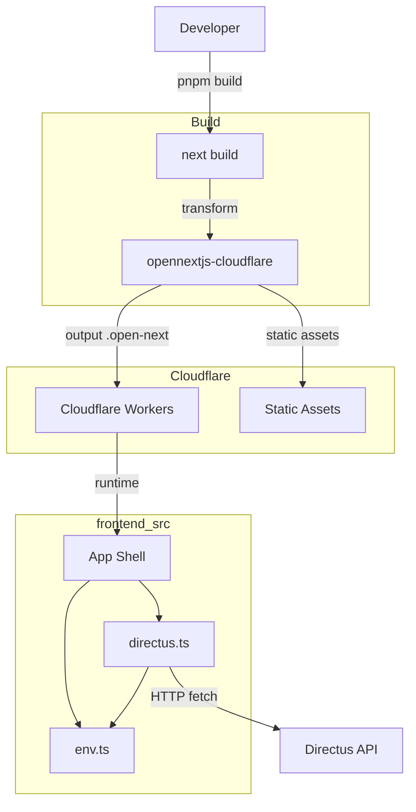

# Technical Design: frontend-scaffold

## Overview

本仕様は `aramakisai-web` リポジトリの `frontend/` ディレクトリに Next.js 15 App Router プロジェクトをゼロから構築する。アプリケーションコード（ページ実装・デザイン）は対象外とし、CI/CD が機能する最小限の骨格を確立することが目的である。

Cloudflare Pages へのデプロイは `@opennextjs/cloudflare`（旧 `@cloudflare/next-on-pages` の公式後継）を通じて行われる。Directus ヘッドレス CMS との接続は `@directus/sdk` クライアントを `src/lib/directus.ts` として初期化することで提供される。

### Goals

- `pnpm dev`, `pnpm build`, `pnpm type-check` がエラーなく完了する最小構成の確立
- Cloudflare Workers (OpenNext) へのデプロイ可能な成果物の生成
- 後続の実装者が迷わず配置できるディレクトリ骨格の整備
- 環境変数の型安全な検証と Directus クライアントの初期化

### Non-Goals

- ページコンポーネント実装・デザイン・コンテンツ取得ロジック
- Directus スキーマ定義
- GitHub Actions ワークフロー（cicd-pipeline spec で扱う）
- Cloudflare Pages プロジェクトの作成・連携（cicd-pipeline spec で扱う）

## Boundary Commitments

### This Spec Owns

- `frontend/` ディレクトリ以下のすべての設定・骨格ファイル
- `package.json`, `tsconfig.json`, `next.config.ts`, `wrangler.toml`, `open-next.config.ts`
- `src/env.ts`（環境変数バリデーション）
- `src/lib/directus.ts`（Directus SDK クライアント）
- `src/app/layout.tsx`, `src/app/page.tsx`（最小限の App Shell）
- `.env.example`, `.gitignore`

### Out of Boundary

- GitHub Actions ワークフロー（cicd-pipeline spec）
- Cloudflare Pages プロジェクト ID・連携設定（cicd-pipeline spec）
- 実際のページ・コンポーネント実装
- Directus スキーマ変更

### Allowed Dependencies

- `@opennextjs/cloudflare`（Cloudflare Workers ランタイム）
- `@directus/sdk` v21.x（ヘッドレス CMS クライアント）
- `@t3-oss/env-nextjs` + `zod`（環境変数バリデーション）
- Next.js 15、TypeScript、pnpm

### Revalidation Triggers

- OpenNext の major バージョンアップ（`wrangler.toml` / `open-next.config.ts` スキーマ変更）
- `@directus/sdk` の major バージョンアップ（クライアント初期化 API 変更）
- 追加の環境変数が必要になった場合（`src/env.ts` の更新が必要）

## Architecture

### Architecture Pattern & Boundary Map



**Architecture Integration**:
- 採用パターン: Next.js App Router + Cloudflare Workers (OpenNext)
- `@opennextjs/cloudflare` が Next.js ビルド成果物を Workers 互換に変換
- `@cloudflare/next-on-pages`（非推奨）は使用しない（詳細は `research.md` 参照）
- Edge Runtime ディレクティブ（`export const runtime = 'edge'`）は使用しない。OpenNext が Node.js Workers Runtime でホストするため不要
- 依存方向: `EnvValidator` → `DirectusClient` → `AppShell`

### Technology Stack

| Layer | Choice / Version | Role | Notes |
|-------|------------------|------|-------|
| Frontend Framework | Next.js 15 | App Router, SSR | 14 は OpenNext サポート終了 |
| CF Adapter | @opennextjs/cloudflare | Workers 変換 | @cloudflare/next-on-pages の後継 |
| Language | TypeScript (strict) | 型安全 | noEmit 型チェック |
| CMS Client | @directus/sdk 21.x | Fetch ベース CMS 接続 | Edge/Node.js 両対応 |
| Env Validation | @t3-oss/env-nextjs + zod | ビルド時変数検証 | NEXT_PUBLIC_ バンドリング問題対応 |
| Package Manager | pnpm | 依存管理 | pnpm-lock.yaml コミット必須 |
| CF Config | wrangler.toml | Workers 設定 | TOML 形式（.jsonc でも可） |

## File Structure Plan

### Directory Structure

```
frontend/
├── src/
│   ├── app/
│   │   ├── layout.tsx           # Root HTML shell (lang, metadata)
│   │   └── page.tsx             # Root page (placeholder content)
│   ├── components/              # .gitkeep のみ (後続実装者用)
│   └── lib/
│       └── directus.ts          # Directus SDK クライアント (named export)
├── public/
│   └── _headers                 # Cloudflare 静的アセットキャッシュ設定
├── src/
│   └── env.ts                   # @t3-oss/env-nextjs による環境変数バリデーション
├── .env.example                 # 必須変数のキー一覧 (値なし)
├── next.config.ts               # initOpenNextCloudflareForDev 呼び出し
├── open-next.config.ts          # defineCloudflareConfig
├── wrangler.toml                # Cloudflare Workers 設定
├── tsconfig.json                # strict: true, App Router 対応
├── pnpm-lock.yaml               # コミット必須
└── package.json                 # scripts: dev / build / type-check / preview / deploy
```

> `src/env.ts` は `src/` 直下（`src/app/` 外）に配置し、App Router のルーティング対象から外す。

### Modified Files

- リポジトリルートの `.gitignore` — `node_modules/`, `.next/`, `.open-next/`, `*.local` を追加

## Requirements Traceability

| Requirement | Summary | Components |
|-------------|---------|------------|
| 1.1 | frontend/ に Next.js App Router プロジェクト | ProjectConfig, AppShell |
| 1.2 | Next.js >=15, TypeScript, @opennextjs/cloudflare を package.json に記載 | ProjectConfig |
| 1.3 | pnpm install がエラーなく完了 | ProjectConfig |
| 1.4 | pnpm dev が localhost:3000 で起動 | AppShell |
| 1.5 | pnpm-lock.yaml をコミット | ProjectConfig |
| 2.1 | tsconfig.json strict モード | ProjectConfig |
| 2.2 | pnpm type-check が src/ 全体を検証 | ProjectConfig |
| 2.3 | type-check スクリプト = `tsc --noEmit` | ProjectConfig |
| 2.4 | 型エラーがあれば非ゼロ終了 | ProjectConfig |
| 3.1 | @opennextjs/cloudflare + next.config.ts dev セットアップ | CloudflareRuntimeConfig |
| 3.2 | build スクリプトが Workers 互換成果物を生成 | CloudflareRuntimeConfig |
| 3.3 | pnpm build がエラーなく完了 | CloudflareRuntimeConfig |
| 3.4 | ランタイムディレクティブを省略 (OpenNext では edge 指定不要) | CloudflareRuntimeConfig |
| 3.5 | wrangler.toml に name / compatibility_date / nodejs_compat | CloudflareRuntimeConfig |
| 4.1 | src/app/, src/components/, src/lib/ を作成 | AppShell |
| 4.2 | layout.tsx と page.tsx が存在しエラーなく描画 | AppShell |
| 4.3 | public/ ディレクトリが存在 | AppShell |
| 4.4 | .gitignore が node_modules/, .next/, *.local を除外 | ProjectConfig |
| 5.1 | src/lib/directus.ts が NEXT_PUBLIC_DIRECTUS_URL で初期化 | DirectusClient |
| 5.2 | 型付き named export | DirectusClient |
| 5.3 | DIRECTUS_URL 未定義時にビルドが失敗 | EnvValidator |
| 5.4 | @directus/sdk を package.json dependencies に記載 | ProjectConfig |
| 5.5 | Node.js 専用 API を使用しない (SDK は Fetch ベース) | DirectusClient |
| 6.1 | src/env.ts が起動時に必須変数を検証 | EnvValidator |
| 6.2 | NEXT_PUBLIC_DIRECTUS_URL, NEXT_PUBLIC_SITE_URL が必須 | EnvValidator |
| 6.3 | .env.example をコミット | ProjectConfig |
| 6.4 | .env, .env.local, .env.*.local を .gitignore で除外 | ProjectConfig |

## Components and Interfaces

| Component | Layer | Intent | Req Coverage | Key Dependencies | Contracts |
|-----------|-------|--------|--------------|------------------|-----------|
| ProjectConfig | Build/Config | package.json, tsconfig.json, .gitignore を管理 | 1.x, 2.x, 4.4, 5.4, 6.3, 6.4 | pnpm, TypeScript | — |
| CloudflareRuntimeConfig | Build/Config | OpenNext 設定、Workers ビルドパイプライン | 3.x | @opennextjs/cloudflare, wrangler | — |
| EnvValidator | Config/Runtime | 環境変数の型安全な検証・エクスポート | 5.3, 6.x | @t3-oss/env-nextjs, zod | Service |
| DirectusClient | Lib | Directus SDK クライアント初期化・エクスポート | 5.x | @directus/sdk, EnvValidator | Service |
| AppShell | UI | 最小限の Root Layout と placeholder Page | 1.4, 4.x | EnvValidator (間接) | — |

### Config Layer

#### ProjectConfig

| Field | Detail |
|-------|--------|
| Intent | ビルド設定・依存定義・TypeScript 設定を管理する設定ファイル群 |
| Requirements | 1.1, 1.2, 1.3, 1.5, 2.1, 2.2, 2.3, 2.4, 4.4, 5.4, 6.3, 6.4 |

**Responsibilities & Constraints**
- `package.json` に `pnpm` を前提としたスクリプトを定義
- `tsconfig.json` は `strict: true` かつ Next.js App Router 対応 (`"moduleResolution": "bundler"`)
- `pnpm-lock.yaml` はコミット対象

**Dependencies**
- External: pnpm — パッケージ管理 (P0)
- External: TypeScript — 型チェック (P0)

**Contracts**: なし（設定ファイル群）

**Implementation Notes**
- `package.json` scripts:
  - `"dev": "next dev"`
  - `"build": "next build"`
  - `"type-check": "tsc --noEmit"`
  - `"preview": "opennextjs-cloudflare build && opennextjs-cloudflare preview"`
  - `"deploy": "opennextjs-cloudflare build && opennextjs-cloudflare deploy"`

#### CloudflareRuntimeConfig

| Field | Detail |
|-------|--------|
| Intent | OpenNext による Cloudflare Workers ビルド変換の設定 |
| Requirements | 3.1, 3.2, 3.3, 3.4, 3.5 |

**Responsibilities & Constraints**
- `next.config.ts`: `initOpenNextCloudflareForDev()` をトップレベルで呼び出す
- `open-next.config.ts`: `defineCloudflareConfig()` で最小構成を定義
- `wrangler.toml`: Workers の name, compatibility_date, nodejs_compat, assets を設定
- ランタイムディレクティブ (`export const runtime = 'edge'`) はソースファイルに含めない

**Dependencies**
- External: @opennextjs/cloudflare — Workers 変換 (P0)
- External: wrangler — ローカルプレビュー・デプロイ (P0)

**Contracts**: なし（ビルド設定）

**Implementation Notes**
- `wrangler.toml` の必須フィールド:
  ```toml
  name = "aramakisai-web"
  main = ".open-next/worker.js"
  compatibility_date = "2024-12-30"
  compatibility_flags = ["nodejs_compat"]
  pages_build_output_dir = ".open-next/assets"
  ```
  > 注: `main` と `pages_build_output_dir` は OpenNext の出力ディレクトリに対応させること。
- Risks: OpenNext が minor update で設定スキーマを変更する可能性あり。バージョン固定推奨。

### Config/Runtime Layer

#### EnvValidator

| Field | Detail |
|-------|--------|
| Intent | 必須環境変数の存在をビルド時・起動時に検証し、型付きオブジェクトとしてエクスポート |
| Requirements | 5.3, 6.1, 6.2, 6.3, 6.4 |

**Responsibilities & Constraints**
- `@t3-oss/env-nextjs` の `createEnv` を使用
- `NEXT_PUBLIC_*` は `client` スキーマに配置し、手動分割代入を行う（バンドラー制約）
- 未定義変数がある場合はビルド時に例外をスロー

**Dependencies**
- External: @t3-oss/env-nextjs — NEXT_PUBLIC_ バンドリング対応バリデーション (P0)
- External: zod — スキーマ定義 (P0)

**Contracts**: Service [x]

##### Service Interface

```typescript
// src/env.ts
import { createEnv } from '@t3-oss/env-nextjs';
import { z } from 'zod';

export const env = createEnv({
  client: {
    NEXT_PUBLIC_DIRECTUS_URL: z.string().url(),
    NEXT_PUBLIC_SITE_URL: z.string().url(),
  },
  runtimeEnv: {
    NEXT_PUBLIC_DIRECTUS_URL: process.env.NEXT_PUBLIC_DIRECTUS_URL,
    NEXT_PUBLIC_SITE_URL: process.env.NEXT_PUBLIC_SITE_URL,
  },
});
```

- Preconditions: `process.env.NEXT_PUBLIC_DIRECTUS_URL` および `NEXT_PUBLIC_SITE_URL` が有効な URL 文字列であること
- Postconditions: `env` オブジェクトが型安全な文字列プロパティとして両変数を持つ
- Invariants: バリデーション失敗時は ZodError をスローしビルドを停止する

**Implementation Notes**
- Integration: `src/lib/directus.ts` から `env.NEXT_PUBLIC_DIRECTUS_URL` をインポートして使用
- Validation: ビルド時に実行されるため、Cloudflare Pages ダッシュボードに変数が未設定であればビルドが失敗する

### Lib Layer

#### DirectusClient

| Field | Detail |
|-------|--------|
| Intent | Directus SDK クライアントを初期化し named export として提供する |
| Requirements | 5.1, 5.2, 5.3, 5.4, 5.5 |

**Responsibilities & Constraints**
- `createDirectus(url).with(rest())` パターンで初期化
- Node.js 専用 API を使用しない（SDK は Fetch ベースのため自然に満たされる）
- URL は `env.NEXT_PUBLIC_DIRECTUS_URL` から取得（`EnvValidator` 依存）

**Dependencies**
- Inbound: AppShell, Server Components — データ取得時にインポート (P1)
- Outbound: EnvValidator — URL 取得 (P0)
- External: @directus/sdk 21.x — REST クライアント生成 (P0)
- External: Directus API (stg/prod) — CMS データソース (P0)

**Contracts**: Service [x]

##### Service Interface

```typescript
// src/lib/directus.ts
import { createDirectus, rest } from '@directus/sdk';
import { env } from '@/env';

// Schema 型は後続実装で Directus スキーマに応じて拡張する
type Schema = Record<string, never>;

export const directus = createDirectus<Schema>(env.NEXT_PUBLIC_DIRECTUS_URL).with(rest());
```

- Preconditions: `env.NEXT_PUBLIC_DIRECTUS_URL` が有効な URL（EnvValidator が保証）
- Postconditions: `directus` が REST API 呼び出し可能な型付きクライアントとして使用可能
- Invariants: `Schema` 型は後続の実装フェーズで Directus コレクションに対応させる

**Implementation Notes**
- Integration: Server Components で `import { directus } from '@/lib/directus'` としてインポート
- Risks: `Schema = Record<string, never>` は scaffold 段階のプレースホルダー。ページ実装時に Directus のコレクション型に置き換える必要あり

### UI Layer

#### AppShell

| Field | Detail |
|-------|--------|
| Intent | エラーなく描画できる最小限の Root Layout と placeholder Page を提供する |
| Requirements | 1.4, 4.1, 4.2, 4.3 |

**Responsibilities & Constraints**
- `layout.tsx`: `<html lang="ja"><body>{children}</body></html>` 程度の最小構成
- `page.tsx`: テキストプレースホルダーのみ。スタイル・コンテンツ実装はスコープ外
- `src/components/` は空ディレクトリとして `.gitkeep` を配置

**Dependencies**
- Inbound: Cloudflare Workers Runtime — HTTP リクエスト受信 (P0)

**Contracts**: なし（UI コンポーネント）

**Implementation Notes**
- Integration: `layout.tsx` には `metadata` export を含めることを推奨（Next.js App Router ベストプラクティス）
- ランタイムディレクティブは追加しない

## Error Handling

### Error Strategy

- **EnvValidator**: ビルド時バリデーション失敗 → ZodError をスローしビルドを即時停止
- **DirectusClient**: fetch エラーは上位の Server Component / Route Handler に伝播させる（本 spec のスコープ外）

### Error Categories and Responses

- **環境変数未設定**: ビルド時に `ZodError` で失敗。Cloudflare Pages ダッシュボードへの設定を促すメッセージが含まれる
- **Directus 接続エラー**: 本 spec のスコープ外。scaffold 段階ではエラーハンドリングは実装しない

## Testing Strategy

### Build-Time Verification

- `pnpm type-check` — TypeScript エラーゼロで exit 0
- `pnpm build` — Next.js ビルド + OpenNext 変換が exit 0

### Manual Smoke Tests

- `pnpm dev` → `http://localhost:3000` でページが表示されること
- 環境変数を未設定にしてビルド → ZodError でビルドが失敗すること

### Unit Tests (scaffold 後に追加)

- `src/env.ts`: 必須変数が欠けている場合に例外をスローすることを確認（next-on-pages 制約と同様、jest + jest-environment-node で実施）

## Security Considerations

- `.env`, `.env.local`, `.env.*.local` は `.gitignore` に追加し、機密情報のコミットを防止
- `.env.example` には実値を含めない（キーと説明のみ）
- `NEXT_PUBLIC_*` 変数はクライアントサイドにバンドルされる。機密情報を含めないこと
