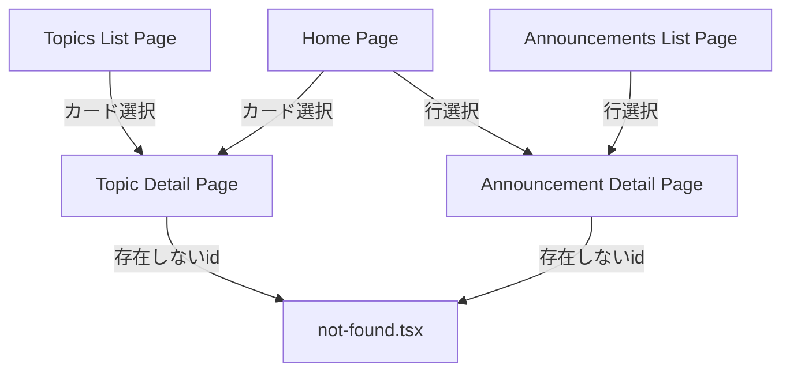

# Technical Design: home-page-expansion

## Overview

**Purpose**: 本機能は、既存 Home Page (`page-home-friendly-editing` spec 実装済み) の表示を拡充する。お知らせをテーブル形式で一覧化し、トピックスカードに複数添付ファイル対応を追加し、`festival_meta` の祭概要 (WYSIWYG) を表示する専用コンポーネントを新設する。加えて `topics`/`announcements` それぞれの個別記事ページとトピックス一覧ページを新設し、サイト共通 Footer に SNS アイコンリンクを追加する。

**Users**: 一般来場者・学生が Home Page および新設の一覧・個別記事ページで、お知らせ・トピックス・祭概要を閲覧する。荒牧祭実行委員 (`executive` ロール) が Directus 管理画面で祭概要 (WYSIWYG) と複数添付ファイルを登録する。

**Impact**: `topics`/`announcements` collection にadditiveなフィールド追加 (M2M添付, WYSIWYG概要) を行い、既存の `AnnouncementsList`/`TopicsList` コンポーネントの表示ロジックを変更する。`festival_meta` にヒーロー画像フィールドを追加する。新規ルート (`/topics`, `/topics/[id]`, `/announcements/[id]`, `/about`) を追加し、`Footer`/`Header` を変更する。

### Goals
- `announcements` をテーブル形式、`topics` をカード形式で一覧表示し、それぞれ個別記事ページへ遷移できるようにする
- `topics`/`announcements` の添付ファイルを、既存の単一ファイルフィールドを壊さず複数登録可能にする (additive-only 遵守)
- `festival_meta` に WYSIWYG 概要フィールドを追加し、既存の `FestivalOverview` (開催日程・入場料) とは独立した表示コンポーネントで描画する
- トピックカードのサムネイル未登録時に NO IMAGE 差し替え画像を一貫して表示する
- サイト共通 Footer で `festival_meta.sns_links` をアイコン付きリンクとして全ページ表示する
- `festival_meta` にヒーロー画像フィールドを追加し、開催日程・入場料・概要WYSIWYGとあわせて整理表示する About ページ (`/about`) を新設する

### Non-Goals
- `page_home`/`page_home_live`/`home_active_variant` によるバリアント切替ロジック自体の変更
- `topics.image`/`topics.attachment` (既存の単一ファイルフィールド) の削除・廃止 (将来の別specの範囲)
- `student_exhibitions`/`sponsors`/`stages`/`performance_slots`/`map_areas`/`time_slots`/`faq_items` の変更
- Home Page 本文中の既存 SNS セクション (`SnsLinks` コンポーネント) の削除・重複排除判断 (Footer 追加後の共存可否は本specでは判断せず現状維持する)
- 最終的なビジュアルデザイン (Figma) の確定、アイコンライブラリの新規導入
- Home Page (`page.tsx`) への `festival_meta` ヒーロー画像の表示 (Home Pageは`page_home`/`page_home_live`の`hero_image`を継続使用。`festival_meta`のヒーロー画像はAboutページ専用)
- 会場住所・地図等のアクセス情報 (既存`/access`ページの責務)、テーマ画像・主要イベント一覧・公式キャラクター等 `festival_meta` に存在しないフィールドの新設 ([[research]] 参考サイト分析参照)

## Boundary Commitments

### This Spec Owns
- `directus/schema/snapshot.yaml`: `festival_meta.overview` (WYSIWYG概要)・`festival_meta.hero_image` (M2O to directus_files) フィールド追加、`topics_files`/`announcements_files` M2Mジャンクションコレクション新設、`topics.attachments`/`announcements.attachments` alias フィールド追加
- `directus/migrations/`: 新規ジャンクションコレクションに対する executive CRUD + Public read 権限を付与する新規 migration ファイル
- `frontend/src/app/topics/page.tsx`, `frontend/src/app/topics/[id]/page.tsx`, `frontend/src/app/announcements/[id]/page.tsx`, `frontend/src/app/about/page.tsx` (新設)
- `frontend/src/app/page.tsx`, `frontend/src/app/announcements/page.tsx` (表示ロジック変更)
- `frontend/src/components/announcements-list.tsx`, `frontend/src/components/topics-list.tsx`, `frontend/src/components/footer.tsx`, `frontend/src/components/header.tsx` (変更)
- `frontend/src/components/` 配下の新規コンポーネント (`TopicCard`, `AttachmentGallery`, `FestivalSummary`, `SnsIcon` 等)
- `frontend/src/lib/home-page-types.ts`, `frontend/src/lib/directus.ts` の Schema 型定義 (本specが触れるフィールド分)
- `frontend/src/lib/topics.ts` (新設), `frontend/src/lib/announcements.ts` (拡張), `frontend/src/lib/sns-links.ts` (新設), `frontend/src/lib/festival-meta.ts` (新設, About ページ専用)
- `frontend/public/images/` への NO IMAGE 差し替え画像アセット追加

### Out of Boundary
- `page-home-friendly-editing` spec が確立した2バリアント切替・`HomePageService`(`getHomePage`)の分岐構造自体
- `directus/migrations/20260701C-rbac-roles.js`/`20260712A-rbac-page-home-live.js` 自体の変更 (新規 migration ファイルの追加のみ行う)
- `topics.image`/`topics.attachment`(旧単一ファイルフィールド)の削除
- Directus Admin UI 上での実行委員向け運用手順書の作成
- `directus_files` collection 自体への新規 RBAC 権限付与 (既存の単一ファイルフィールドと同じ前提を踏襲し、本specでは変更しない。[[research]] 参照)
- 既存 `/access` ページのアクセス情報 (住所・地図) の変更、`festival_meta` へのテーマ画像・主要イベント・公式キャラクター等未モデル化フィールドの新設

### Allowed Dependencies
- 既存 `HomePageService` (`frontend/src/lib/home-page.ts`) の `getHomePage()` が返す `HomePageResult`/`PreEventHomeContent` 構造 (変更を最小化し、`festival.overviewHtml`・`announcements[].attachments`・`topics[].attachments` を追加する形で拡張)
- 既存 `RichText`/`toAssetUrl` コンポーネント・ユーティリティ (WYSIWYG本文・添付ファイルURL生成に再利用)
- 既存 RBAC migration の 3ステップ insert パターン (delete-then-insert → executive CRUD → Public read)
- 既存 `not-found.tsx` (Next.js `notFound()` 呼び出しによる404委譲)
- `frontend/src/env.ts` の `NEXT_PUBLIC_DIRECTUS_URL`

### Revalidation Triggers
- `topics.attachments`/`announcements.attachments` のジャンクションコレクション名・フィールド名が実装時に変更された場合、`frontend/src/lib/directus.ts` の Schema 型定義とデータ層クエリを再確認する
- `festival_meta` に他specから概要以外のフィールドが追加された場合、`FestivalOverview`/`FestivalSummary` 双方の責務分割が崩れていないか再確認する
- 将来 `topics.image`/`topics.attachment` を廃止する spec が着手される場合、本specの NO IMAGE フォールバック判定ロジック (Requirement 2.5) を再確認する
- Footer が `festival_meta` を直接参照する構造が変更された場合 (例: Header等の他共通コンポーネントも同様のデータ取得を必要とする場合)、共通データ取得方針を再設計する

## Architecture

### Existing Architecture Analysis
- Directus 12 + Postgres 16 を Next.js (App Router, Server Component) が REST (`@directus/sdk`) 経由で参照する JAMstack 構成 ([[tech]])
- `frontend/src/lib/directus.ts` の `Schema` 型は `page-home-friendly-editing` spec で導入され、`page_home`/`page_home_live`/`festival_meta`/`announcements`/`topics`/`sponsors`/`page_*` を型定義済み
- `HomePageService` (`getHomePage()`) が Directus から取得した生データを `HomePageContent`/`PreEventHomeContent` に整形し、`page.tsx` は整形済みデータのみを表示コンポーネントに渡す presentation/data分離パターンが確立済み
- `frontend/src/app/announcements/page.tsx` は既に `getAnnouncements()` (`lib/announcements.ts`) を介して `AnnouncementsList` を描画する独立ページとして存在するが、`topics` には一覧ページ・個別ページのいずれも存在しない
- RBAC権限は `fields: "*"` のcollection単位で付与されており、既存collectionへの新規フィールド追加はRBAC変更不要。新規collection (本specでは `topics_files`/`announcements_files`) 追加時のみ RBAC migration 追加が必須という制約は `page-home-friendly-editing` spec から継続する ([[research]])

### Architecture Pattern & Boundary Map

```mermaid
graph TB
    subgraph Directus
        FestivalMeta[festival_meta]
        Topics[topics]
        TopicsFiles[topics_files junction]
        Announcements[announcements]
        AnnouncementsFiles[announcements_files junction]
        DirectusFiles[directus_files]
    end
    subgraph DataLayer
        HomePageService[HomePageService]
        TopicsService[TopicsService]
        AnnouncementsService[AnnouncementsService]
        SnsLinksService[SnsLinksService]
        FestivalMetaService[FestivalMetaService]
    end
    subgraph Presentation
        HomePage[Home Page]
        TopicsListPage[Topics List Page]
        TopicDetailPage[Topic Detail Page]
        AnnouncementsListPage[Announcements List Page]
        AnnouncementDetailPage[Announcement Detail Page]
        AboutPage[About Page]
        FooterComp[Footer]
        HeaderComp[Header]
    end

    Topics --> TopicsFiles --> DirectusFiles
    Announcements --> AnnouncementsFiles --> DirectusFiles
    FestivalMeta --> DirectusFiles

    FestivalMeta --> HomePageService
    FestivalMeta --> SnsLinksService
    FestivalMeta --> FestivalMetaService
    Topics --> HomePageService
    Topics --> TopicsService
    Announcements --> HomePageService
    Announcements --> AnnouncementsService

    HomePageService --> HomePage
    TopicsService --> TopicsListPage
    TopicsService --> TopicDetailPage
    AnnouncementsService --> AnnouncementsListPage
    AnnouncementsService --> AnnouncementDetailPage
    FestivalMetaService --> AboutPage
    SnsLinksService --> FooterComp
    HeaderComp --> TopicsListPage
    HeaderComp --> AboutPage
```



**Architecture Integration**:
- 選定パターン: 既存の Content-driven Server Rendering (Directus REST → Next.js Server Component) をそのまま踏襲。新規パターン導入なし
- ドメイン境界: Directusスキーマ層 (`topics`/`announcements`/`festival_meta` とそのジャンクションコレクション) と frontend データ取得層 (`HomePageService`/新設 `TopicsService`/`AnnouncementsService`/`SnsLinksService`) を分離し、表示コンポーネントは整形済みデータのみに依存する
- 既存パターン維持: `src/lib/directus.ts` の単一クライアントインスタンス共有、`src/env.ts` 経由の環境変数アクセス、`page.tsx` 単位でのtry/catchフォールバック
- 新規コンポーネントの理由: `TopicsService`/`AnnouncementsService` は Home Page 専用の `HomePageService` とは異なるライフサイクル (一覧ページ・個別ページは variant 分岐を持たず全件/単一取得のみ行う) を持つため、`HomePageService` に混在させず独立させる。`SnsLinksService`/`FestivalMetaService` はそれぞれ Footer・About ページ専用の軽量な `festival_meta` 部分取得のため、`HomePageService` の全件取得 (`sponsors`/`announcements`等を含む) とは分離する
- Steering準拠: `src/env.ts` 経由の環境変数アクセス、`@/` パスエイリアス、`Schema` 型の明示 ([[structure]])を維持

### Technology Stack

| Layer | Choice / Version | Role in Feature | Notes |
|-------|------------------|-----------------|-------|
| Frontend | Next.js 15 (App Router) / React 19 | 新規ルート (`/topics`, `/topics/[id]`, `/announcements/[id]`) の追加、Footer の async Server Component化 | 既存踏襲、新規依存なし |
| CMS / Data | Directus 12.1.1 (`@directus/sdk` ^21.0.0) | `festival_meta.overview`, `topics.attachments`, `announcements.attachments` (M2M) の追加 | 新規ジャンクションコレクション2件を追加 ([[research]]) |
| UI | Tailwind CSS + インライン SVG | SNSアイコン (Footer), NO IMAGE プレースホルダー | 新規アイコンライブラリは追加しない ([[research]] Design Decision参照) |

## File Structure Plan

### Directory Structure
```
frontend/src/
├── app/
│   ├── page.tsx                      # Modified: FestivalSummary追加、TopicsList/AnnouncementsListの新props反映
│   ├── announcements/
│   │   ├── page.tsx                  # Modified: テーブル形式・詳細ページへのリンク
│   │   └── [id]/
│   │       └── page.tsx              # New: お知らせ個別記事ページ (Requirement 10)
│   ├── topics/
│   │   ├── page.tsx                  # New: トピックス一覧ページ (Requirement 8)
│   │   └── [id]/
│   │       └── page.tsx              # New: トピックス個別記事ページ (Requirement 9)
│   └── about/
│       └── page.tsx                  # New: festival_meta概要About ページ (Requirement 14)
├── components/
│   ├── announcements-list.tsx        # Modified: テーブル描画・行リンク (Requirement 1)
│   ├── topics-list.tsx               # Modified: TopicCardのグリッド描画に委譲 (Requirement 2, 8)
│   ├── topic-card.tsx                # New: トピック共通カード (サムネイル・複数添付・NO IMAGE)
│   ├── attachment-gallery.tsx        # New: 添付ファイル一覧 (画像サムネイル/非画像ダウンロードリンク)
│   ├── festival-summary.tsx          # New: festival_meta概要WYSIWYG表示 (Requirement 3, About ページでも再利用)
│   ├── footer.tsx                    # Modified: async化しSNSアイコンリンク表示 (Requirement 12)
│   ├── header.tsx                    # Modified: /topics, /about へのナビリンク追加 (Requirement 8.6, 14.6)
│   └── sns-icon.tsx                  # New: プラットフォーム別インラインSVGアイコン
└── lib/
    ├── directus.ts                   # Modified: Schema型に新規フィールド/ジャンクションコレクション追加
    ├── home-page-types.ts            # Modified: Attachment型追加、TopicSummary/AnnouncementSummary/FestivalOverview(heroImageId/overviewHtml)拡張
    ├── home-page.ts                  # Modified: attachments/overviewHtmlの取得・整形を追加
    ├── announcements.ts              # Modified: getAnnouncementById()追加
    ├── topics.ts                     # New: getTopics()/getTopicById()
    ├── sns-links.ts                  # New: getSnsLinks() (Footer専用の軽量festival_meta取得)
    └── festival-meta.ts              # New: getFestivalMeta() (Aboutページ専用のfestival_meta取得)
```

### Modified Files
- `frontend/src/app/page.tsx` — `FestivalSummary` を `FestivalOverview` と並べて配置。`AnnouncementsList`/`TopicsList` へ渡す props はデータ層拡張分 (`attachments`) を透過するのみで大きな変更なし
- `frontend/src/app/announcements/page.tsx` — `AnnouncementsList` のテーブル化に追従し、各行から `/announcements/[id]` へリンク
- `frontend/src/components/announcements-list.tsx` — 記事配列を `<table>` (公開日時列・タイトル列) として描画し、行クリックで個別記事ページに遷移するリンクを持つ
- `frontend/src/components/topics-list.tsx` — グリッドレイアウトは維持しつつ、各アイテムの描画を新設 `TopicCard` に委譲する薄いラッパーへ変更
- `frontend/src/components/footer.tsx` — 非同期 Server Component化し、`getSnsLinks()` の結果を `SnsIcon` 付きリンクとして描画
- `frontend/src/lib/home-page-types.ts` — `Attachment` 型新設、`TopicSummary`/`AnnouncementSummary` に `attachments: Attachment[]` 追加、`FestivalOverview` に `overviewHtml: string | null` 追加
- `frontend/src/lib/home-page.ts` — `topics`/`announcements` 取得時に `attachments` の deep-fields 取得・整形を追加、`festival_meta.overview` を `overviewHtml` にマッピング
- `frontend/src/lib/announcements.ts` — `getAnnouncementById(id)` を追加 (個別記事ページ用)
- `frontend/src/lib/directus.ts` — `Schema` に `festival_meta.overview`, `festival_meta.hero_image`, `topics.attachments`, `announcements.attachments`, `topics_files`, `announcements_files` を追加
- `frontend/src/components/header.tsx` — ナビゲーションに `/topics`・`/about` へのリンクを追加
- `frontend/src/app/about/page.tsx` (新規) — `FestivalMetaService.getFestivalMeta()` の結果を `FestivalOverview`・`FestivalSummary` に渡し、ヒーロー画像とあわせて表示する

> `frontend/public/images/` への NO IMAGE 差し替え画像 (例: `no-image.svg`) は新規アセット追加のみで、既存ファイルへの変更はない。

## Requirements Traceability

| Requirement | Summary | Components | Interfaces | Flows |
|-------------|---------|------------|------------|-------|
| 1.1-1.5 | お知らせテーブル表示 | AnnouncementsList, AnnouncementsService | `AnnouncementsListProps` | - |
| 2.1-2.6 | トピックカード複数添付・NO IMAGE | TopicCard, AttachmentGallery | `TopicCardProps` | - |
| 3.1-3.4 | festival_meta概要コンポーネント | FestivalSummary | `FestivalSummaryProps` | - |
| 4.1-4.4 | festival_meta WYSIWYGフィールド | Directus Schema (`festival_meta.overview`) | Schema/Migration | Migration Strategy |
| 5.1-5.5 | topics添付複数化(schema) | Directus Schema (`topics.attachments`, `topics_files`), RBAC Migration | Schema/Migration | Migration Strategy |
| 6.1-6.5 | announcements添付複数化(schema) | Directus Schema (`announcements.attachments`, `announcements_files`), RBAC Migration | Schema/Migration | Migration Strategy |
| 8.1-8.6 | トピックス一覧ページ | TopicsListPage, TopicsService, TopicCard, Header | `TopicsService.getTopics` | System Flows |
| 9.1-9.4 | トピックス個別記事ページ | TopicDetailPage, TopicsService, AttachmentGallery | `TopicsService.getTopicById` | System Flows |
| 10.1-10.4 | お知らせ個別記事ページ | AnnouncementDetailPage, AnnouncementsService, AttachmentGallery | `AnnouncementsService.getAnnouncementById` | System Flows |
| 11.1-11.4 | additive-only・CI/staging | Directus Schema/Migration, CI Pipeline | - | Migration Strategy |
| 12.1-12.6 | Footer SNSアイコンリンク | Footer, SnsIcon, SnsLinksService | `SnsLinksService.getSnsLinks` | - |
| 13.1-13.5 | festival_metaヒーロー画像フィールド | Directus Schema (`festival_meta.hero_image`) | Schema/Migration | Migration Strategy |
| 14.1-14.6 | Aboutページ | AboutPage, FestivalMetaService, FestivalOverview, FestivalSummary, Header | `FestivalMetaService.getFestivalMeta` | - |

## Components and Interfaces

| Component | Domain/Layer | Intent | Req Coverage | Key Dependencies (P0/P1) | Contracts |
|-----------|--------------|--------|---------------|--------------------------|-----------|
| AnnouncementsList | UI | お知らせをテーブル形式で表示し個別記事へリンク | 1.1-1.5 | RichText (P1) | State |
| TopicCard | UI | トピック1件をカード表示 (複数添付・NO IMAGE) | 2.1-2.6, 8.3, 9.4 | AttachmentGallery (P0) | State |
| AttachmentGallery | UI | 添付ファイル一覧 (画像/非画像) を表示 | 2.1, 2.2, 9.4, 10.2 | toAssetUrl (P0) | State |
| FestivalSummary | UI | festival_meta概要WYSIWYGを表示 | 3.1-3.4 | RichText (P0) | State |
| Footer | UI | サイト共通SNSアイコンリンク表示 | 12.1-12.6 | SnsLinksService (P0), SnsIcon (P0) | State |
| SnsIcon | UI | プラットフォーム別アイコン描画 | 12.2, 12.3, 12.4 | - | State |
| Header (Modified) | UI | サイト共通ナビゲーションに `/topics`・`/about` リンクを追加 | 8.6, 14.6 | - | State |
| AboutPage | UI | festival_metaのヒーロー画像・開催情報・概要を統合表示 | 14.1-14.6 | FestivalMetaService (P0), FestivalOverview (P0), FestivalSummary (P0), toAssetUrl (P0) | State |
| TopicsService | Data | topics全件/単一取得・整形 | 8.1-8.5, 9.1-9.4 | Directus SDK (P0) | Service |
| AnnouncementsService | Data | announcements単一取得・整形 (一覧は既存維持+拡張) | 10.1-10.4 | Directus SDK (P0) | Service |
| SnsLinksService | Data | festival_meta.sns_links軽量取得 | 12.1, 12.5 | Directus SDK (P0) | Service |
| FestivalMetaService | Data | Aboutページ向けfestival_meta取得 (hero_image/event_days/admission_fee/payment_note/overview) | 14.1-14.5 | Directus SDK (P0) | Service |
| HomePageService | Data | Home Page向け全データ集約 (既存拡張) | 1.4, 2.1-2.6, 3.1-3.2 | Directus SDK (P0) | Service |

### UI

#### AnnouncementsList (Modified)

| Field | Detail |
|-------|--------|
| Intent | `announcements` をテーブル形式で表示し、行選択で個別記事ページへ導線を提供する |
| Requirements | 1.1, 1.2, 1.3, 1.4, 1.5 |

**Responsibilities & Constraints**
- `AnnouncementSummary[]` を `published_at` 降順の `<table>` として描画する (ソート自体はデータ層 [`AnnouncementsService`]/[`HomePageService`] が担い、本コンポーネントは受け取った順序をそのまま描画する)
- 0件時は「お知らせはありません」を表示する (既存動作を維持)
- 各行 (`<tr>`) はクリック可能なリンクとして `/announcements/{id}` へ遷移する

**Contracts**: Service [ ] / API [ ] / Event [ ] / Batch [ ] / State [x]

##### State Management
- State model: Props駆動のステートレス表示コンポーネント (既存パターン踏襲)
- Persistence & consistency: なし (Server Componentからの一方向データフロー)
- Concurrency strategy: 該当なし

**Implementation Notes**
- Integration: 既存 `AnnouncementsListProps` (`announcements: AnnouncementSummary[]`) をそのまま拡張利用。`AnnouncementSummary` に `attachments` が追加されてもテーブル自体は本文・添付を表示せず、行リンク先の個別記事ページ (Requirement 10) がそれらを表示する
- Validation: 該当なし (Directus側で必須項目は保証済み)
- Risks: 既存 `announcements-list.test.tsx` はカード/article形式を前提にしている可能性が高く、テーブル要素の期待値へ更新が必要

#### TopicCard (New)

| Field | Detail |
|-------|--------|
| Intent | トピック1件をカードとして表示し、複数添付ファイル・NO IMAGEフォールバックを扱う共通コンポーネント |
| Requirements | 2.1, 2.2, 2.3, 2.4, 2.5, 2.6, 8.3, 9.4 |

**Responsibilities & Constraints**
- サムネイル領域: `attachments` の先頭画像、無ければ旧 `imageUrl` (`image`フィールド由来)、それも無ければ NO IMAGE 差し替え画像 (`frontend/public/images/no-image.svg` 相当) を表示する
- 添付ファイルの追加表示 (2件目以降含む) は `AttachmentGallery` に委譲する
- Home Page (グリッド内の1アイテム) とトピックス一覧ページの両方から同一コンポーネントとして呼び出される (Requirement 8.3)
- カード全体、またはタイトルをクリックすると `/topics/{id}` (個別記事ページ) へ遷移する

**Contracts**: Service [ ] / API [ ] / Event [ ] / Batch [ ] / State [x]

##### State Management
- State model: Props駆動のステートレス表示コンポーネント
- Persistence & consistency: なし
- Concurrency strategy: 該当なし

**Implementation Notes**
- Integration: `topics-list.tsx` (Home Page用グリッド) と `app/topics/page.tsx` (一覧ページ) の双方が `TopicCard` を同一propsで呼び出す。個別記事ページ (`app/topics/[id]/page.tsx`) はカードではなく詳細レイアウトのため `TopicCard` を再利用せず、`AttachmentGallery` のみ再利用する
- Validation: 該当なし
- Risks: NO IMAGE判定 (「添付画像の先頭、または旧`image`フィールド」の優先順位) を実装時に確定する必要がある。本designでは「`attachments`内の画像 → 旧`image` → NO IMAGE」の優先順位を採用する

#### AttachmentGallery (New)

| Field | Detail |
|-------|--------|
| Intent | 添付ファイル配列を、画像はサムネイル・非画像はダウンロードリンクとして表示する |
| Requirements | 2.1, 2.2, 9.4, 10.2 |

**Responsibilities & Constraints**
- `Attachment[]` (Data Models参照) を受け取り、`type` が `image/*` のものはサムネイル ``、それ以外はファイル名 + ダウンロードリンクとして表示する
- `TopicCard`、トピックス個別記事ページ、お知らせ個別記事ページの3箇所から共通利用される

**Contracts**: Service [ ] / API [ ] / Event [ ] / Batch [ ] / State [x]

##### State Management
- State model: Props駆動のステートレス表示コンポーネント
- Persistence & consistency: なし

**Implementation Notes**
- Integration: `toAssetUrl(attachment.id)` で画像/ダウンロードURLを生成 (既存ユーティリティ再利用)
- Validation: `type`がnull/不明な場合は非画像として扱いダウンロードリンク表示にフォールバックする
- Risks: 大量添付時のレイアウト崩れは本designのスコープ外 (Non-Goals: ビジュアルデザイン確定)

#### FestivalSummary (New)

| Field | Detail |
|-------|--------|
| Intent | `festival_meta.overview` (WYSIWYG) を独立した表示ブロックとして描画する |
| Requirements | 3.1, 3.2, 3.3, 3.4 |

**Responsibilities & Constraints**
- `overviewHtml` が空文字列またはnullの場合は何も描画しない (Requirement 3.2)
- 既存 `FestivalOverview` (開催日程・入場料) とは別コンポーネントとして独立し、`page.tsx` 内で並列に配置される (Requirement 3.3)
- 本文描画は既存 `RichText` コンポーネントを利用しサニタイズを一元化する (Requirement 3.4)

**Contracts**: Service [ ] / API [ ] / Event [ ] / Batch [ ] / State [x]

##### State Management
- State model: Props駆動のステートレス表示コンポーネント
- Persistence & consistency: なし

**Implementation Notes**
- Integration: `page.tsx` で `content.festival.overviewHtml` を渡す
- Validation: 空文字列/null判定は本コンポーネント内で行う (`page.tsx`側は条件分岐を持たない)
- Risks: なし (既存`RichText`のサニタイズ許可タグをそのまま利用するため新規XSSリスクは増えない)

#### Footer (Modified)

| Field | Detail |
|-------|--------|
| Intent | サイト共通で `festival_meta.sns_links` をアイコン付きリンクとして表示する |
| Requirements | 12.1, 12.2, 12.3, 12.4, 12.5, 12.6 |

**Responsibilities & Constraints**
- async Server Componentとして自身で `SnsLinksService.getSnsLinks()` を呼び出す ([[research]] Design Decision参照)
- Directus到達不能時は try/catch で空配列にフォールバックし、SNSリンク領域を描画しない (既存ページと同様、Footer自体の描画失敗でサイト全体を壊さない)
- 既知プラットフォーム (X, Instagram, Facebook, YouTube, TikTok, LINE) は `SnsIcon` で対応するアイコンを、未知プラットフォームは汎用アイコン+テキストラベルを表示する
- 各リンクに `aria-label` (例: `platform名の公式SNSを開く`) を付与する

**Contracts**: Service [ ] / API [ ] / Event [ ] / Batch [ ] / State [x]

##### State Management
- State model: 自己完結型 async Server Component (fetch → render)
- Persistence & consistency: なし (読み取り専用)
- Concurrency strategy: 該当なし (リクエスト毎に独立実行)

**Implementation Notes**
- Integration: `layout.tsx` は変更不要 (`<Footer />` の呼び出し方はそのまま)
- Validation: `sns_links` が0件/null時はSNSリンク領域自体を描画しない
- Risks: 全ページで `festival_meta` への追加リクエストが発生する (Performance & Scalabilityセクション参照)

#### Header (Modified)

| Field | Detail |
|-------|--------|
| Intent | サイト共通ナビゲーションに `/topics`・`/about` へのリンクを追加する |
| Requirements | 8.6, 14.6 |

**Contracts**: Service [ ] / API [ ] / Event [ ] / Batch [ ] / State [ ]

**Implementation Notes**
- Integration: 既存のリンク一覧 (`トップ`/`お知らせ`/`お問い合わせ`) に `トピックス` (`/topics`)・`About` (`/about`) を追加するのみ。データ取得は行わない
- Risks: なし (静的リンク追加)

#### AboutPage (New)

| Field | Detail |
|-------|--------|
| Intent | `festival_meta` のヒーロー画像・開催日程・入場料・支払い注記・概要WYSIWYGを1ページに統合表示する |
| Requirements | 14.1, 14.2, 14.3, 14.4, 14.5 |

**Responsibilities & Constraints**
- `FestivalMetaService.getFestivalMeta()` の結果を、既存 `FestivalOverview` (開催日程・入場料の構造化表示, Requirement14.2) と `FestivalSummary` (概要WYSIWYG, Requirement14.3) にそのまま委譲する。About ページ自身は新規の表示ロジックをほぼ持たず、ヒーロー画像領域のみ追加で描画する
- ヒーロー画像未登録時 (`heroImageId === null`) は画像領域を描画しない (Requirement 14.4)
- 開催日程・入場料が共に未設定の場合、既存 `FestivalOverview` は元々 `null` を返す実装のため追加対応不要 (Requirement 14.5 は既存コンポーネントの挙動でカバーされる)

**Contracts**: Service [ ] / API [ ] / Event [ ] / Batch [ ] / State [x]

##### State Management
- State model: Server Componentが`FestivalMetaService`を呼び出し整形済みデータを子コンポーネントへ渡す (既存`page.tsx`と同型)
- Persistence & consistency: なし

**Implementation Notes**
- Integration: `FestivalOverview`/`FestivalSummary` は Home Page既存コンポーネントをそのまま再利用し、About ページ専用の複製は作らない
- Validation: 該当なし
- Risks: Directus到達不能時は既存`page.tsx`と同様のtry/catchフォールバック (最小限表示) を適用する

#### SnsIcon (New)

| Field | Detail |
|-------|--------|
| Intent | プラットフォーム名文字列からインラインSVGアイコンを解決する純粋表示コンポーネント |
| Requirements | 12.2, 12.3, 12.4 |

**Responsibilities & Constraints**
- `platform: string` を大文字小文字を無視して既知セット (X/Twitter, Instagram, Facebook, YouTube, TikTok, LINE) と照合し、一致すれば専用SVG、しなければ汎用リンクアイコンを返す

**Contracts**: Service [ ] / API [ ] / Event [ ] / Batch [ ] / State [ ]

**Implementation Notes**
- Integration: `Footer` からのみ利用 (既存 `SnsLinks` コンポーネントは変更しないため利用しない)
- Risks: 新規プラットフォームが増えた際のマッピング追加はコード変更が必要 (設定駆動ではない) — 本specの規模では許容

### Data

#### TopicsService (New)

| Field | Detail |
|-------|--------|
| Intent | `topics` の全件取得(一覧ページ用)・単一取得(個別記事ページ用)を提供する |
| Requirements | 8.1-8.5, 9.1-9.4 |

**Responsibilities & Constraints**
- `HomePageService` とは独立し、Home Page の variant分岐に依存しない
- 添付ファイルは deep-fields (`attachments.directus_files_id.*`) で取得し `Attachment[]` に整形する

**Dependencies**
- Outbound: `@directus/sdk` (`readItems`/`readItem`) — Directus REST呼び出し (P0)

**Contracts**: Service [x] / API [ ] / Event [ ] / Batch [ ] / State [ ]

##### Service Interface
```typescript
interface TopicsService {
  getTopics(): Promise<TopicSummary[]>;
  getTopicById(id: number): Promise<TopicSummary | null>;
}
```
- Preconditions: `id` は正の整数
- Postconditions: `getTopicById` はレコードが存在しない場合 `null` を返す (呼び出し側の `app/topics/[id]/page.tsx` が `notFound()` を呼び出す)
- Invariants: 返却する `attachments` は `sort` 昇順

**Implementation Notes**
- Integration: `app/topics/page.tsx`/`app/topics/[id]/page.tsx` から呼び出す。`getHomePage()` 内の既存 `topics` 取得ロジックとは別実装のままとする (variant分岐が絡む既存ロジックへの影響を避ける)
- Validation: 該当なし
- Risks: `topics`/`home-page.ts` 双方で同様の整形ロジックが重複する可能性 — 共通の整形関数への切り出しは実装時の判断に委ねる (設計はコードの重複自体を禁止しない)

#### AnnouncementsService (Modified)

| Field | Detail |
|-------|--------|
| Intent | `announcements` の一覧取得(既存)に加え、単一取得を提供する |
| Requirements | 10.1-10.4 |

**Contracts**: Service [x] / API [ ] / Event [ ] / Batch [ ] / State [ ]

##### Service Interface
```typescript
interface AnnouncementsService {
  getAnnouncements(): Promise<AnnouncementSummary[]>; // 既存、attachments追加のみ
  getAnnouncementById(id: number): Promise<AnnouncementSummary | null>;
}
```
- Preconditions: `id` は正の整数
- Postconditions: `getAnnouncementById` はレコードが存在しない場合 `null` を返す
- Invariants: 未公開 (`published_at` が未来またはnull) のレコードも個別記事ページでは表示可能とするか、一覧と同じ公開フィルタを適用するかは実装時に決定する (Open Question参照)

**Implementation Notes**
- Integration: `app/announcements/[id]/page.tsx` から呼び出す
- Risks: 個別記事ページの公開フィルタ方針が未確定 (Open Questions参照)

#### FestivalMetaService (New)

| Field | Detail |
|-------|--------|
| Intent | About ページ専用に `festival_meta` (hero_image/event_days/admission_fee/payment_note/overview) を取得・整形する |
| Requirements | 14.1, 14.2, 14.3, 14.4, 14.5 |

**Contracts**: Service [x] / API [ ] / Event [ ] / Batch [ ] / State [ ]

##### Service Interface
```typescript
interface FestivalMetaService {
  getFestivalMeta(): Promise<FestivalOverview>;
}
```
- Preconditions: なし
- Postconditions: `FestivalOverview.heroImageId`/`overviewHtml` は未登録時 `null`
- Invariants: 返却型は `HomePageService`/`SnsLinksService` と同じ `home-page-types.ts` の型を再利用する

**Implementation Notes**
- Integration: `readSingleton('festival_meta')` で必要フィールドのみ取得し、`HomePageService`と同等の整形ロジック (`event_days`/`admission_fee`等のマッピング) をAboutページ用に再実装する。`HomePageService`内部関数の共通化は実装時の判断に委ねる
- Risks: `HomePageService`と整形ロジックが重複する ([[research]] Risks参照、`TopicsService`と同種のトレードオフ)

#### SnsLinksService (New)

| Field | Detail |
|-------|--------|
| Intent | Footer専用に `festival_meta.sns_links` のみを軽量取得する |
| Requirements | 12.1, 12.5 |

**Contracts**: Service [x] / API [ ] / Event [ ] / Batch [ ] / State [ ]

##### Service Interface
```typescript
interface SnsLinksService {
  getSnsLinks(): Promise<SnsLink[]>;
}
```
- Preconditions: なし
- Postconditions: Directus到達不能時は例外を送出せず空配列を返す (Footer自体がpage全体を壊さないため)
- Invariants: `SnsLink[]` は既存 `home-page-types.ts` の `SnsLink` 型と同一

**Implementation Notes**
- Integration: `readSingleton('festival_meta', { fields: ['sns_links'] })` で必要フィールドのみ取得し、`HomePageService`と重複する全件取得を避ける
- Risks: `HomePageService`とは別に`festival_meta`への読み取りリクエストが増える (Performance参照)

## System Flows

### トピックス/お知らせ 一覧 → 個別記事ページ遷移



- 個別記事ページは `TopicsService.getTopicById`/`AnnouncementsService.getAnnouncementById` が `null` を返した場合、Next.js `notFound()` を呼び出し既存の `not-found.tsx` に委譲する (Requirement 9.3, 10.3)。新規の404表示ロジックは作らない

## Data Models

### Logical Data Model

**Directus Collections (追加分)**:
- `festival_meta.overview: string | null` — WYSIWYG (rich-text-html) の祭概要。既存フィールドへの追加のみ
- `festival_meta.hero_image: string | null` — About ページ用ヒーロー画像 (`file-image`, M2O to `directus_files`)。既存フィールドへの追加のみ
- `topics.attachments` — `topics` から `topics_files` (M2M junction) 経由で `directus_files` への複数関連
- `announcements.attachments` — `announcements` から `announcements_files` (M2M junction) 経由で `directus_files` への複数関連
- `topics_files` (新規junction): `id` (PK), `topics_id` (FK → topics), `directus_files_id` (FK → directus_files), `sort` (表示順)
- `announcements_files` (新規junction): `id` (PK), `announcements_id` (FK → announcements), `directus_files_id` (FK → directus_files), `sort` (表示順)

**Referential Integrity**: ジャンクション行は親レコード (`topics`/`announcements`) 削除時にカスケード削除、`directus_files` 側削除時はジャンクション行を削除 (Directus標準のM2M削除動作に従う)

### Data Contracts & Integration

**Frontend型定義 (`frontend/src/lib/home-page-types.ts`)**:
```typescript
export interface Attachment {
  id: string;
  filenameDownload: string;
  type: string | null; // MIME type, 例: "image/png" | "application/pdf"
}

export interface TopicSummary {
  id: number;
  title: string;
  body: string | null;
  imageId: string | null; // 既存の旧単一imageフィールド由来 (フォールバック用)
  linkUrl: string | null;
  attachments: Attachment[];
}

export interface AnnouncementSummary {
  id: number;
  title: string;
  body: string;
  publishedAt: string;
  attachments: Attachment[];
}

export interface FestivalOverview {
  name: string;
  eventDays: EventDay[];
  admissionFee: string | null;
  paymentNote: string | null;
  overviewHtml: string | null; // 新規: festival_meta.overview
  heroImageId: string | null; // 新規: festival_meta.hero_image (Aboutページ専用)
}
```

**Directus SDK Schema型 (`frontend/src/lib/directus.ts`) 追加分**:
```typescript
type DirectusFileRef = {
  id: string;
  type: string | null;
  filename_download: string;
};

type TopicFile = { id: number; topics_id: number; directus_files_id: string | DirectusFileRef; sort: number | null };
type AnnouncementFile = { id: number; announcements_id: number; directus_files_id: string | DirectusFileRef; sort: number | null };
```
- `Topic`/`Announcement` 型それぞれに `attachments: TopicFile[]` / `AnnouncementFile[]` を追加する
- `festival_meta` (`FestivalMeta`) 型に `overview: string | null`, `hero_image: string | null` を追加する

## Error Handling

### Error Strategy
既存 `page.tsx` のtry/catchパターン (Directus到達不能時は最小限フォールバック表示) を新規ページ・コンポーネントにも適用する。

### Error Categories and Responses
**User Errors (4xx相当)**: 存在しない `topics`/`announcements` の個別記事ページID → `TopicsService`/`AnnouncementsService` が `null` を返し、ページコンポーネントが Next.js `notFound()` を呼び出して既存 `not-found.tsx` を描画する (Requirement 9.3, 10.3)
**System Errors (5xx相当)**: Directus到達不能 → 一覧ページ (`/topics`, `/announcements`) は空配列/エラーメッセージにフォールバック、Footer はSNSリンク領域を非表示にする (ページ全体は壊さない)

## Testing Strategy

### Unit Tests
- `TopicCard`: 添付複数枚・添付0件・NO IMAGE表示の3パターン
- `AttachmentGallery`: 画像/非画像混在時の描画振り分け
- `FestivalSummary`: `overviewHtml` 空文字列/null時に非描画となること
- `SnsIcon`: 既知プラットフォーム/未知プラットフォームでの描画切り替え
- `AnnouncementsList`: テーブル描画・0件時メッセージ・行リンクのhref

### Integration Tests
- `TopicsService.getTopicById`: 存在しないIDで `null` を返すこと
- `AnnouncementsService.getAnnouncementById`: 存在しないIDで `null` を返すこと
- `Footer`: `getSnsLinks()` が例外を投げてもレンダリングが成功すること (try/catchフォールバック)
- `app/topics/page.tsx`: `TopicCard` がHome Pageと同一コンポーネントで描画されること (共通コンポーネント再利用の検証)
- `app/about/page.tsx`: `heroImageId`/開催日程/入場料/概要それぞれが未設定の場合に該当ブロックが描画されないこと

### E2E/UI Tests
- トピックス一覧ページ → 個別記事ページ → 存在しないIDアクセス時の404遷移
- お知らせテーブル → 個別記事ページ遷移
- Home Page: `FestivalSummary` と既存 `FestivalOverview` が両方独立して表示されること
- Header から `/topics`・`/about` への遷移

## Migration Strategy

```mermaid
graph TB
    Step1[snapshot.yaml へ festival_meta.overview/hero_image 追加] --> Step2[snapshot.yaml へ topics_files/announcements_files junction + attachments alias field 追加]
    Step2 --> Step3[新規 migration: executive CRUD + Public read 権限付与]
    Step3 --> Step4[additive-schema-check.yml による自動検証]
    Step4 --> Step5[staging (stg-api.aramakisai.com) での事前検証]
    Step5 --> Step6[main merge -> directus-schema-sync.yml が aramakisai-infra へPR]
    Step6 --> Step7[ArgoCD が database migrate:latest -> schema apply]
```

- Phase分け: スキーマ追加 (additive) → RBAC migration → CI自動検証 → staging手動検証 → 本番反映、という既存フロー ([[tech]] CI/CD節) をそのまま利用し、新規フローは導入しない
- ロールバックトリガー: staging検証で添付ファイルの実体取得が403等になった場合、RBAC migrationの`down`を実行して切り戻す (`20260712A-rbac-page-home-live.js`と同様の`down`実装パターンに従う)
- 検証チェックポイント: (1) `additive-schema-check.yml` green, (2) staging Directus管理画面で`topics`/`announcements`に複数ファイルを登録できる, (3) staging Public APIで添付ファイルが取得できる

## Open Questions / Risks
- お知らせ個別記事ページ (Requirement 10) が、一覧ページと同じ「公開日時が過去」フィルタを適用するか、未公開レコードも直接URLアクセスなら閲覧可能とするかは未確定。実装フェーズで一覧ページと同じ公開フィルタを踏襲する方針をデフォルトとし、異なる挙動が必要な場合はタスク側で明記する
- ジャンクションコレクションの正確なDirectusメタ表現は、手書きyamlではなくDirectus管理画面で1度作成→`schema snapshot`で書き出す手順を推奨する ([[research]] 参照)
- `directus_files` 自体へのPublic read権限が実際に必要かは、既存の単一ファイルフィールドと同様staging検証で確認する ([[research]] 参照)

## Supporting References
- 詳細な調査ログ・却下した代替案は `research.md` を参照
