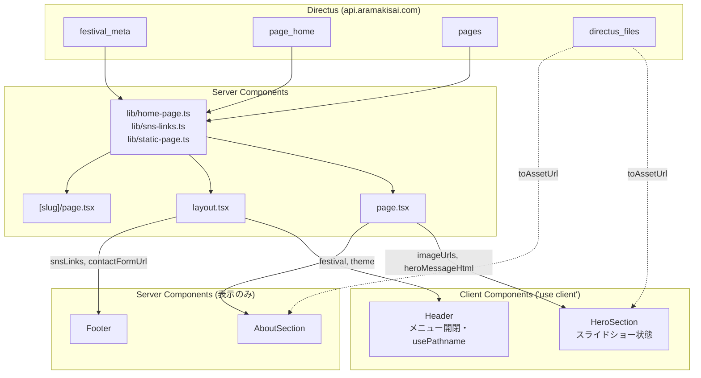
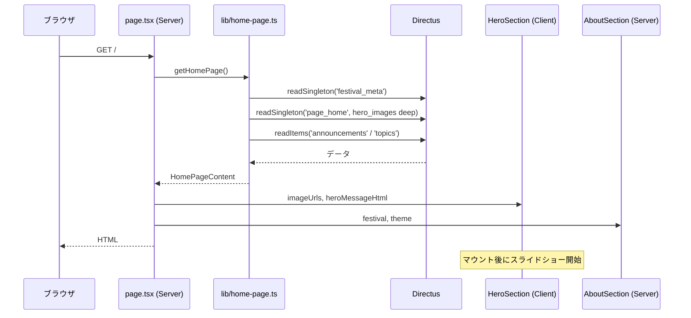
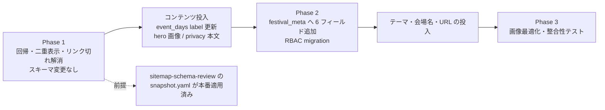
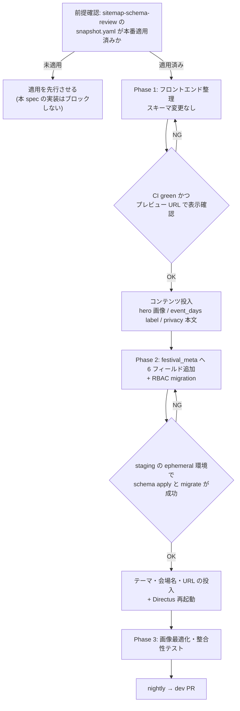

# Technical Design: nightly-dev-integration

## Overview

**Purpose**: `nightly` ブランチで作られたデザイン刷新の叩き台を、Directus による CMS 運用と両立する形へ整理し、`dev` へ反映する。

**Users**: 一般来場者は刷新されたトップページ・About セクション・固定ページを閲覧する。実行委員会の運営者は、静的コードに固定されていた文言・画像を Directus 管理画面から更新できるようになる。

**Impact**: `nightly` はヒーロー画像・SNS リンク・祭概要・開催日程・プライバシーポリシーを静的値へ差し戻しており、同じ情報が静的版と Directus 版で二重に描画される状態になっている。本 spec はこれらを Directus 側へ一本化し、受け皿のない要素 (テーマ・会場名・埋め込み URL 等) には additive なフィールドを追加する。あわせて `/about` ルートを廃止してホームページの `#about` へ統合し、リポジトリに追加された 25MB の静的画像を整理する。

### Goals

- `nightly` のレイアウトを維持したまま、表示データの供給元を Directus に一本化する
- 既存スキーマで受けられるコンテンツを Directus へ登録し、投入手順を再現可能な形で残す
- 受け皿のない要素に additive なフィールドを追加し、コード変更なしで更新できる状態にする
- ナビゲーションからリンク切れを排除する
- 静的画像アセットを 25MB から 1MB 未満へ削減する

### Non-Goals

- 新設ページ (会場マップ・タイムテーブル・出展一覧・FAQ) の実装 — `sitemap-schema-review` が後続 spec への切り出しを確定させている
- `nightly` のビジュアル方針そのものへの変更提案
- `additive-schema-check.yml` の一時停止解除
- `festival-overview.tsx` / `festival-summary.tsx` の削除 — `sitemap-schema-review` が追従修正を所有しているため、本 spec は呼び出し元を外すところまでに留める

## Boundary Commitments

### This Spec Owns

- `nightly` が導入した静的コンテンツの管理先判定と、その結果に基づくフロントエンド実装
- `HeroSection` / `Footer` / `AboutSection` のデータ供給インターフェース (props 契約)
- `src/app/privacy-policy/` と `src/app/about/` の廃止判断および実施
- ヘッダー / フッターのナビゲーション定義
- `festival_meta` への additive なフィールド追加 (`theme_word` / `theme_image` / `theme_description` / `venue_name` / `campus_map_url` / `contact_form_url`) と、その公開読み取り RBAC
- `page_home.hero_images` の公開読み取り RBAC
- Directus へのコンテンツ投入一覧と投入手順
- `frontend/public/images/` の構成とサイズ方針

### Out of Boundary

- 既存 collection のフィールド削除・型変更・`page_home_live` 廃止 — `sitemap-schema-review` の所有物。本 spec は追加のみを行う
- `festival-overview.tsx` / `festival-summary.tsx` / `lib/festival-meta.ts` の削除 — 同上。本 spec は呼び出し元を外すのみ
- 新設ページ (`/map` `/timetable` `/exhibitions` `/faq`) の実装とそのためのスキーマ設計
- `additive-schema-check.yml` / `directus-schema-sync.yml` の変更
- `aramakisai-infra` 側の GitOps 定義

### Allowed Dependencies

- `frontend/src/lib/home-page.ts` / `directus.ts` / `directus-asset-url.ts` / `sns-links.ts` / `static-page.ts` (参照および型の追加)
- `directus/schema/snapshot.yaml` (フィールド追加のみ)
- `directus/migrations/` (RBAC migration の追加のみ)
- `.kiro/specs/sitemap-schema-review/design.md` (読み取りのみ、スキーマ前提の確認)
- 本番 / staging Directus の REST API (コンテンツ投入)

### Revalidation Triggers

- `sitemap-schema-review` が `snapshot.yaml` の内容を変更した場合、本 spec の追加フィールドが衝突しないか再確認する
- 新設ページ spec が起票され `/map` `/timetable` `/exhibitions` `/faq` が実装された場合、本 spec が一時非表示にしたナビゲーション項目を戻す
- `festival_meta` / `page_home` の RBAC が変更された場合、本 spec が追加した公開読み取り権限が維持されているか確認する
- `HeroSection` / `AboutSection` / `Footer` の props 契約を変更する場合、`page.tsx` / `layout.tsx` 側の受け渡しを合わせて更新する

## Architecture

### Existing Architecture Analysis

`dev` は「サーバーコンポーネントで `src/lib/*.ts` を通じて Directus を読み、表示コンポーネントへ props で渡す」構成を採る。`nightly` はこの構成を崩し、`HeroSection` / `Header` / `Footer` を `'use client'` 化した上で表示値をコンポーネント内の定数へ移した。`Footer` は `async` サーバーコンポーネントから同期関数へ変更されている。

本番 Directus のスキーマは Git の `snapshot.yaml` より古く、`festival_meta.home_active_variant` (`page_home_live` 2 バリアント運用の切替フラグ) や `admission_fee` 等が残存している。これらは `sitemap-schema-review` が削除方針を確定済みで、同 spec の適用によって解消される。本 spec は適用後の状態を前提とする。

`page_home.hero_images` は公開ロールから読み取れず `FORBIDDEN` を返す。ヒーロー画像を Directus から配信するには RBAC migration が必要になる。

### Architecture Pattern & Boundary Map



**Architecture Integration**:

- **Selected pattern**: サーバー取得 + props 受け渡し (`dev` の既存仕様)。クライアントコンポーネントは状態を持つものだけに限定する
- **Domain/feature boundaries**: Directus アクセスは `src/lib/` に閉じる。表示コンポーネントは Directus SDK を直接参照しない
- **Existing patterns preserved**: `src/lib/*.ts` へのアクセス集約、`toAssetUrl` によるアセット URL 生成、対象と同階層のテスト配置、素の `` (Edge Runtime 制約に伴う既存慣習)
- **New components rationale**: 新規コンポーネントは追加しない。`nightly` が追加した `AboutSection` を props 受け取り型へ変更するのみ
- **Steering compliance**: Edge Runtime 制約 (`next/image` の最適化に依存しない)、環境変数の `src/env.ts` 経由アクセス、additive-only ルール

### Technology Stack

| Layer | Choice / Version | Role in Feature | Notes |
|-------|------------------|-----------------|-------|
| Frontend | Next.js 15 (App Router) / React 19 | サーバーコンポーネントでのデータ取得と props 受け渡し | `next/image` は使用しない (下記 Notes 参照) |
| Backend / Services | Directus 12.1.1 (`@directus/sdk`) | `festival_meta` / `page_home` / `pages` の参照、コンテンツ投入 | 投入は管理画面と REST API を併用 |
| Data / Storage | Postgres 16 (Directus 管理) | `snapshot.yaml` によるスキーマ管理、`migrations/` による RBAC | 追加のみ (additive-only) |
| Infrastructure / Runtime | Cloudflare Workers + `@opennextjs/cloudflare` | 配信 | Image Optimization API は非対応。画像最適化は Directus Asset Transformations (`?format=webp&width=`) に寄せる |
| Testing | vitest + @testing-library/react | コンポーネント / lib / ナビゲーション整合性 | ルート一覧の走査には Node の `fs` を使う (既存 `*.workflow.test.ts` と同じ流儀) |

## File Structure Plan

### Modified Files

**Phase 1 (スキーマ変更なし)**

- `frontend/src/app/page.tsx` — `FestivalOverview` / `FestivalSummary` の直接描画を除去。`HeroSection` へ画像 URL 配列、`AboutSection` へ祭情報を props で渡す
- `frontend/src/app/layout.tsx` — `Footer` を `await` するサーバーコンポーネントとして扱い、SNS リンクを供給する
- `frontend/src/components/hero-section.tsx` — `'use client'` を維持しつつ `HeroSectionProps` を復活させ、静的 `HERO_IMAGES` を除去。画像 0 件時のフォールバックを追加
- `frontend/src/components/about-section.tsx` — `'use client'` なし。概要文・開催日程・会場名・マップ URL・テーマを props で受け取る。`next/image` を素の `` へ置換
- `frontend/src/components/footer.tsx` — `async` サーバーコンポーネントへ戻し、`getSnsLinks()` の結果と住所・連絡先表示を復活。ナビゲーション定義から未実装ルートを除去
- `frontend/src/components/header.tsx` — `/news` を `/announcements` へ張り替え、`/events` `/guide` `/sponsors` を除去
- `frontend/src/lib/home-page-types.ts` — `AboutSection` へ渡す型 (`FestivalTheme` 等) を追加
- `frontend/src/lib/home-page.ts` — 追加フィールドの取得を反映 (Phase 2 で拡張)
- 対応する `*.test.tsx` — `page.test.tsx` の二重表示前提を修正、`hero-section` / `about-section` / `footer` / `header` のテストを props 受け取り前提へ更新

**Phase 1 (削除)**

- `frontend/src/app/privacy-policy/page.tsx` / `page.test.tsx` — `pages` collection へ統合するため削除
- `frontend/src/app/about/page.tsx` / `page.test.tsx` — ホームページの `#about` へ統合するため削除
- `frontend/public/images/top/top0.png` 〜 `top4.png` — Directus 管理へ移行するため削除 (計 18.9MB)
- `frontend/public/images/background1.png` — `festival_meta.theme_image` へ移行するため削除 (5.8MB)

**Phase 2 (スキーマ追加)**

- `directus/schema/snapshot.yaml` — `festival_meta` へ 6 フィールドを追加
- `directus/migrations/{YYYYMMDD}{suffix}-rbac-festival-meta-theme.js` — 追加フィールドと `page_home.hero_images` の公開読み取り権限を付与
- `frontend/src/lib/directus.ts` — `Schema` 型へ追加フィールドを反映
- `frontend/src/lib/home-page.ts` — 追加フィールドの取得とマッピング

**Phase 3 (整理)**

- `frontend/src/components/header.test.tsx` / `footer.test.tsx` — ナビゲーション整合性テストを追加
- `.pre-commit-config.yaml` — 追加ファイルサイズ上限フックを追加
- `frontend/src/lib/directus-asset-url.ts` — Asset Transformations パラメータの付与 (`sitemap-schema-review` の方針と重複するため、同 spec の実装状況を確認した上で対応)

**新規ドキュメント**

- `.kiro/specs/nightly-dev-integration/directus-content.md` — Directus 投入対象の一覧 (要件 9)

## System Flows

### ホームページのデータフロー



Directus への到達に失敗した場合、`page.tsx` は `content = null` として Directus 由来の領域を描画せず、静的なページ構造 (ヘッダー・フッター・セクション枠) は維持する。

### 段階導入



Phase 1 の本番デプロイ前に、`sitemap-schema-review` の `snapshot.yaml` が本番へ適用済みであることを確認する。未適用のまま `hero_images` (M2M) を参照すると取得に失敗する。

## Requirements Traceability

| Requirement | Summary | Components | Interfaces | Flows |
|-------------|---------|------------|------------|-------|
| 1.1–1.2 | nightly 差分の反映と既存連携の非退行 | `page.tsx`, `layout.tsx` | — | ホームページのデータフロー |
| 1.3 | 削除された dev 側要素の復活 | `Footer`, `HeroSection` | `FooterProps`, `HeroSectionProps` | — |
| 1.4 | 二重表示の解消 | `page.tsx`, `AboutSection` | `AboutSectionProps` | ホームページのデータフロー |
| 1.5 | 開催日程の表示形式 | `AboutSection` | `EventDay` | — |
| 1.6–1.8 | ブランチ運用と CI | — | — | 段階導入 |
| 2.1–2.5 | 静的コンテンツの棚卸しと振り分け | — | Data Models 参照 | — |
| 3.1–3.4 | ヒーロー画像の Directus 復帰 | `HeroSection`, `lib/home-page.ts` | `HeroSectionProps` | ホームページのデータフロー |
| 4.1–4.6 | 固定ページの重複解消 | `[slug]/page.tsx`, `Footer` | `StaticPageContent` | — |
| 5.1–5.5 | ナビゲーション整合性 | `Header`, `Footer` | `NavigationItem`, `FooterProps` | — |
| 6.1–6.4 | 静的画像アセットの整理 | `public/images/`, `lib/directus-asset-url.ts` | `toAssetUrl` | 段階導入 |
| 7.1–7.4 | テストによる回帰防止 | 各 `*.test.tsx` | — | — |
| 8.1–8.4 | スキーマ変更の安全性 | `snapshot.yaml`, `migrations/` | Data Models 参照 | 段階導入 |
| 9.1–9.6 | Directus へのコンテンツ投入 | `directus-content.md` | Directus REST API | 段階導入 |

## Components and Interfaces

| Component | Domain/Layer | Intent | Req Coverage | Key Dependencies (P0/P1) | Contracts |
|-----------|--------------|--------|--------------|--------------------------|-----------|
| `page.tsx` | App Router (Server) | ホームページのデータ取得と配分 | 1.1, 1.2, 1.4, 3.1 | `lib/home-page.ts` (P0) | State |
| `layout.tsx` | App Router (Server) | 共通レイアウトと Footer へのデータ供給 | 1.3, 5.3 | `lib/sns-links.ts` (P0) | State |
| `HeroSection` | UI (Client) | ヒーロー画像のスライドショー | 3.1–3.4 | `page.tsx` (P0) | State |
| `AboutSection` | UI (Server) | 概要・開催日程・テーマの表示 | 1.4, 1.5, 2.x | `page.tsx` (P0) | — |
| `Footer` | UI (Server) | SNS リンク・サイト案内・連絡先 | 1.3, 5.1, 5.3–5.5 | `lib/sns-links.ts` (P0) | — |
| `Header` | UI (Client) | ナビゲーションとメニュー開閉 | 5.1, 5.2 | — | State |
| `lib/home-page.ts` | Data Access | Directus からのホームページデータ取得 | 3.1, 3.2 | `@directus/sdk` (P0) | Service |

### App Router

#### `page.tsx`

| Field | Detail |
|-------|--------|
| Intent | ホームページのデータ取得と各セクションへの配分 |
| Requirements | 1.1, 1.2, 1.4, 3.1, 3.3 |

**Responsibilities & Constraints**

- `getHomePage()` を 1 回だけ呼び、結果を `HeroSection` / `AboutSection` / 各リストへ配分する
- `FestivalOverview` / `FestivalSummary` を直接描画しない (`AboutSection` が同じ情報を担う)
- 取得失敗時は `content = null` とし、Directus 由来の領域のみ描画を省く

**Dependencies**

- Outbound: `lib/home-page.ts` — ホームページデータ取得 (P0)
- Outbound: `lib/directus-asset-url.ts` — ヒーロー画像 URL 生成 (P0)

**Implementation Notes**

- Integration: `heroImages` を `toAssetUrl` で URL 配列へ変換してから `HeroSection` へ渡す (`nightly` 以前の `page.tsx` と同じ変換)
- Risks: `AboutSection` へ渡す情報が増えるため、props をひとまとめの型で受け渡す

#### `HeroSection`

| Field | Detail |
|-------|--------|
| Intent | Directus 由来のヒーロー画像をスライドショー表示する |
| Requirements | 3.1, 3.2, 3.3, 3.4 |

**Responsibilities & Constraints**

- `'use client'` を維持する (自動送り・前後ナビの状態管理のため)
- 画像 URL の生成・並び替えは行わない。並び順は `lib/home-page.ts` が `hero_images.sort` で確定済み
- `imageUrls` が空の場合はセクション自体を描画しない

**Contracts**: State [x]

##### Service Interface

```typescript
export interface HeroSectionProps {
  imageUrls: string[];
  heroMessageHtml?: string;
}
```

- Preconditions: `imageUrls` は表示順に並んでいる
- Postconditions: `imageUrls.length === 0` のとき `null` を返す
- Invariants: 自動送りの間隔とアクセシビリティ属性 (`aria-label`, `motion-reduce`) は画像の出所によらず一定

**Implementation Notes**

- Integration: 静的定数 `HERO_IMAGES` を削除し、props 経由に置き換える
- Validation: `imageUrls` が 1 件のときは前後ナビゲーションを表示しない
- Risks: 画像が Directus 経由となり読み込みが遅くなるため、先頭画像には `fetchPriority="high"` を維持する

#### `AboutSection`

| Field | Detail |
|-------|--------|
| Intent | 祭の概要・開催日程・テーマを `nightly` のレイアウトで表示する |
| Requirements | 1.4, 1.5, 2.2, 2.3 |

**Responsibilities & Constraints**

- サーバーコンポーネントとして実装する (内部状態を持たない)
- 概要文とテーマ説明は HTML であり `RichText` を通す
- 各ブロックはデータが欠けている場合に個別に非表示となる (セクション全体は落とさない)

##### Service Interface

```typescript
export interface FestivalTheme {
  word: string | null;
  imageId: string | null;
  descriptionHtml: string | null;
}

export interface AboutSectionProps {
  festival: FestivalOverview;
  theme: FestivalTheme;
  venueName: string | null;
  campusMapUrl: string | null;
}
```

- Preconditions: `festival.eventDays` は表示順に並んでいる
- Postconditions: 開催日程は `{label} {open}〜{close}` の形式で描画される
- Invariants: セクション見出し・番号付きレイアウト・区切り線は `nightly` の構造を維持する

**Implementation Notes**

- Integration: `next/image` を素の `` へ置換し、`toAssetUrl` で URL を生成する
- Validation: `theme.imageId` が null のときはテーマのビジュアル領域を描画しない
- Risks: `campusMapUrl` は `iframe` の `src` になるため、Directus 側で任意 URL を設定できる点に注意する (Error Handling 参照)

#### `Footer`

| Field | Detail |
|-------|--------|
| Intent | SNS リンク・サイト案内・連絡先の表示 |
| Requirements | 1.3, 5.1, 5.3, 5.4, 5.5 |

**Responsibilities & Constraints**

- `async` サーバーコンポーネントとして `getSnsLinks()` を呼ぶ (`dev` の実装形)
- SNS の取得に失敗した場合は該当ブロックのみ非表示にし、フッター全体は描画する
- `nightly` で削除された住所・連絡先を `nightly` のレイアウトに沿って復活させる
- ナビゲーションから未実装ルートを除去する

**Implementation Notes**

- Integration: `SnsIcon` は `platform` 文字列を小文字化して解決するため、Directus の `sns_links[].platform` (`Instagram` / `X` / `YouTube`) をそのまま渡せる
- Validation: `contactFormUrl` は Phase 2 で Directus 由来へ切り替える。それまではコード上の定数を使う
- Risks: `'use client'` を外すため、`HoverLine` を含む内部ヘルパーがイベントハンドラを持たないことを確認する

#### `Header`

| Field | Detail |
|-------|--------|
| Intent | ナビゲーションとモバイルメニューの制御 |
| Requirements | 5.1, 5.2 |

**Responsibilities & Constraints**

- `'use client'` を維持する (`usePathname` とメニュー開閉状態のため)
- ナビゲーション定義はコード管理とする (要件 2.2 の「構造的要素はコードに残す」)
- 実在しないルートを指す項目を持たない

##### State Management

- State model: `mobileMenuOpen` / `mobileAboutOpen` (真偽値)
- Persistence & consistency: 永続化しない。ルート遷移時に閉じる
- Concurrency strategy: 該当なし

**Implementation Notes**

- Integration: `/news` → `/announcements` へ張り替え、`/events` `/guide` `/sponsors` を定義から除去する
- Validation: ナビゲーション定義を `export` し、テストからルート実在性を検証できるようにする

### Data Access

#### `lib/home-page.ts`

| Field | Detail |
|-------|--------|
| Intent | ホームページに必要な Directus データの取得とマッピング |
| Requirements | 3.1, 3.2, 8.4 |

**Responsibilities & Constraints**

- `festival_meta` / `page_home` / `announcements` / `topics` を読み、`HomePageContent` へマッピングする
- `hero_images` は `sort` 昇順に並べ替えてから返す (既存実装を維持)
- Phase 2 で追加されるフィールドは、未投入 (null) でもマッピングが失敗しないようにする

##### Service Interface

```typescript
export interface HomePageContent {
  heroImages: Attachment[];
  heroMessageHtml: string;
  snsLinks: SnsLink[];
  festival: FestivalOverview;
  theme: FestivalTheme;
  venueName: string | null;
  campusMapUrl: string | null;
  contactFormUrl: string | null;
  announcements: AnnouncementSummary[];
  topics: TopicSummary[];
}
```

- Preconditions: `NEXT_PUBLIC_DIRECTUS_URL` が `src/env.ts` 経由で解決できる
- Postconditions: 未投入フィールドは `null` または空配列として返る
- Invariants: 型定義に `any` を使わない (deep-fields のリテラル配列は既存の `eslint-disable` 付きキャストを踏襲する)

## Data Models

### 静的コンテンツの管理先判定 (要件 2)

| # | 要素 | 判定 | 格納先 | フェーズ |
|---|------|------|--------|----------|
| 1 | ヒーロー画像 5 点 | Directus | `page_home.hero_images` | Phase 1 |
| 2 | 概要文 | Directus | `festival_meta.overview` | Phase 1 |
| 3 | 開催スケジュール | Directus | `festival_meta.event_days` | Phase 1 |
| 4 | 会場名 | Directus (追加) | `festival_meta.venue_name` | Phase 2 |
| 5 | キャンパスマップ埋め込み URL | Directus (追加) | `festival_meta.campus_map_url` | Phase 2 |
| 6 | テーマ語・メインビジュアル・説明文 | Directus (追加) | `festival_meta.theme_word` / `theme_image` / `theme_description` | Phase 2 |
| 7 | 来場者数 (実績・目標) | Directus | `festival_meta.overview` / `theme_description` の本文に含める | Phase 1–2 |
| 8 | プライバシーポリシー本文 | Directus | `pages` (`slug: privacy`) の `content` | Phase 1 |
| 9 | ナビゲーション項目 | コード | `header.tsx` / `footer.tsx` | Phase 1 |
| 10 | SNS リンク | Directus | `festival_meta.sns_links` | Phase 1 |
| 11 | お問い合わせフォーム URL | Directus (追加) | `festival_meta.contact_form_url` | Phase 2 |
| 12 | コピーライト表記 | コード | `footer.tsx` | — |
| 13 | 住所・連絡先 | コード | `footer.tsx` | Phase 1 |

9・12・13 をコードに残す理由: ナビゲーションは URL とページ実装に結びついた構造的要素であり、Directus 上で編集するとリンク切れを招く。コピーライトと住所は更新頻度が極めて低く、専用フィールドを設ける利益が薄い。

### Phase 2 で追加するフィールド (`festival_meta`)

| Field | Type | Nullable | Interface | 用途 |
|-------|------|----------|-----------|------|
| `theme_word` | string | true | `input` | テーマ語 (例: 万彩) |
| `theme_image` | uuid | true | `file-image` | テーマのメインビジュアル |
| `theme_description` | text | true | `input-rich-text-html` | テーマの説明文 |
| `venue_name` | string | true | `input` | 会場名 |
| `campus_map_url` | string | true | `input` | Google Maps 埋め込み URL |
| `contact_form_url` | string | true | `input` | お問い合わせフォーム URL |

**Consistency & Integrity**:

- 全フィールドを nullable とし、未投入時はフロントエンドが該当ブロックを描画しない (要件 8.4)
- collection / field の削除・型変更・`is_nullable: true→false` は行わない (要件 8.1)
- `theme_image` は `directus_files` への参照。既存の `hero_image` と同じ扱いとする

### RBAC (migration)

`directus/migrations/{YYYYMMDD}{suffix}-rbac-festival-meta-theme.js` で以下を付与する。

- 公開ポリシーに対する `festival_meta` の追加 6 フィールドの `read` 権限
- 公開ポリシーに対する `page_home.hero_images` (および junction `page_home_files`) の `read` 権限
- `directus_files` の該当ファイルに対する `read` 権限 (既存の付与状況を確認した上で不足分のみ追加)

再実行安全性のため `onConflict().ignore()` または delete-then-insert で記述する。適用後は Directus の再起動が必要 (権限キャッシュが更新されないため)。

### Directus へのコンテンツ投入対象 (要件 9)

`directus-content.md` に一覧として記録する。現時点で判明している対象:

| 対象 | 投入先 | 現状 | 手段 |
|------|--------|------|------|
| ヒーロー画像 5 点 | `directus_files` → `page_home.hero_images` | 未投入 (`hero_images` は権限エラー) | 管理画面 (ファイルアップロード + 並び替え) |
| `event_days[].label` の表記 | `festival_meta.event_days` | `11/14(土)` 形式で投入済み | REST API (`PATCH /items/festival_meta`) で `11月14日` 形式へ更新 |
| 概要文 | `festival_meta.overview` | 投入済み (内容が `nightly` 版と異なる) | 管理画面 (WYSIWYG) で内容を確定 |
| SNS リンク | `festival_meta.sns_links` | 投入済み (Instagram / X / YouTube) | 対応不要 |
| プライバシーポリシー本文 | `pages` (`slug: privacy`) の `content` | 投入済み (章立てが `nightly` 版と異なる) | 管理画面 (WYSIWYG) で `nightly` 版の内容へ更新 |
| テーマ関連 3 項目 | `festival_meta.theme_*` | フィールド未追加 | Phase 2 後に管理画面 |
| 会場名 / マップ URL / お問い合わせ URL | `festival_meta` | フィールド未追加 | Phase 2 後に REST API |

REST API を使う場合は実行内容を `directus-content.md` にリクエスト定義として残す (要件 9.3)。本番へ適用する前に開発環境 (`directus/docker-compose.yaml`) または staging で確認する (要件 9.6)。

## Error Handling

### Error Strategy

Directus への到達失敗はページ全体のエラーにせず、影響範囲を該当セクションに閉じる。既存の `page.tsx` は `try`/`catch` で `content = null` とする方針を採っており、これを維持する。

### Error Categories and Responses

**システムエラー (Directus 到達不可・タイムアウト)**
- `page.tsx`: `content = null` とし、Directus 由来のセクションを描画しない。ヘッダー・フッター・ページ構造は維持する
- `layout.tsx` / `Footer`: `getSnsLinks()` の失敗時は SNS ブロックのみ非表示。フッター全体は描画する
- `[slug]/page.tsx`: `getPageBySlug()` は既に失敗時 `null` を返し `notFound()` へ倒す

**データ欠落 (フィールド未投入)**
- `HeroSection`: `imageUrls` が空ならセクションを描画しない
- `AboutSection`: テーマ・会場名・マップ URL が null なら該当ブロックのみ描画しない
- `Footer`: `contactFormUrl` が null ならお問い合わせリンクを表示しない

**入力の信頼境界**
- `campus_map_url` は `iframe` の `src` として使われる。Directus 上で任意の URL を設定できるため、`https://www.google.com/maps/embed` 由来の URL のみを受け入れる検証を表示側に置く。条件を満たさない場合は `iframe` を描画しない
- 本文 HTML (`overview` / `theme_description` / `pages.content`) は既存の `RichText` のサニタイズを通す

### Monitoring

既存の `error.tsx` / `global-error.tsx` によるエラーバウンダリを維持する。本 spec で新たな監視基盤は導入しない。

## Testing Strategy

### Unit Tests

- `lib/home-page.ts`: `hero_images` の `sort` 昇順マッピング、追加フィールドが未投入 (null) の場合のマッピング
- `AboutSection`: 開催日程が `{label} {open}〜{close}` 形式で描画されること
- `AboutSection`: `theme.imageId` / `campusMapUrl` が null のとき該当ブロックを描画しないこと
- `HeroSection`: `imageUrls` が空のとき何も描画しないこと、1 件のとき前後ナビを出さないこと
- `Footer`: `getSnsLinks()` が失敗しても SNS ブロック以外が描画されること

### Integration Tests

- `page.tsx`: `AboutSection` が描画され、`FestivalOverview` / `FestivalSummary` が重複描画されないこと
- `page.tsx`: `getHomePage()` が例外を投げた場合でもヘッダー・フッター・静的構造が維持されること
- `layout.tsx` → `Footer`: SNS リンクがサーバー側で取得され props として渡ること
- `[slug]/page.tsx`: `privacy` スラッグでプライバシーポリシーが描画されること

### E2E/UI Tests

- ナビゲーション整合性: `header.tsx` / `footer.tsx` のナビゲーション定義の `href` が、`src/app` 配下の `page.tsx` から導出したルート一覧 (およびページ内アンカー) に含まれること
- ヒーロースライドショー: 自動送り・前後ナビ・`prefers-reduced-motion` が画像の出所によらず動作すること

`nightly` の既存テスト (`page.test.tsx` の二重表示前提、`privacy-policy/page.test.tsx`、`about/page.test.tsx`) は本 spec で更新または削除する。

## Migration Strategy



**ロールバック**: Phase 1 と Phase 3 はフロントエンドのみの変更であり、PR の revert で戻せる。Phase 2 はフィールド追加のみ (additive) のため、フロントエンドを revert してもフィールドが残るだけで既存表示に影響しない。RBAC migration は `down` を実装し、付与した権限を取り消せるようにする。

**検証チェックポイント**: Phase 1 完了時にプレビュー URL で「ヒーロー画像が Directus 由来であること」「開催日程が 1 箇所にのみ表示されること」「ナビゲーションが 404 を含まないこと」を確認する。Phase 2 完了時に追加フィールドが公開ロールから読めることを `curl` で確認する。
