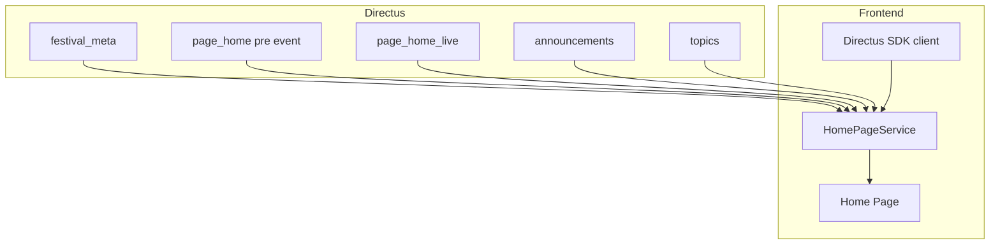
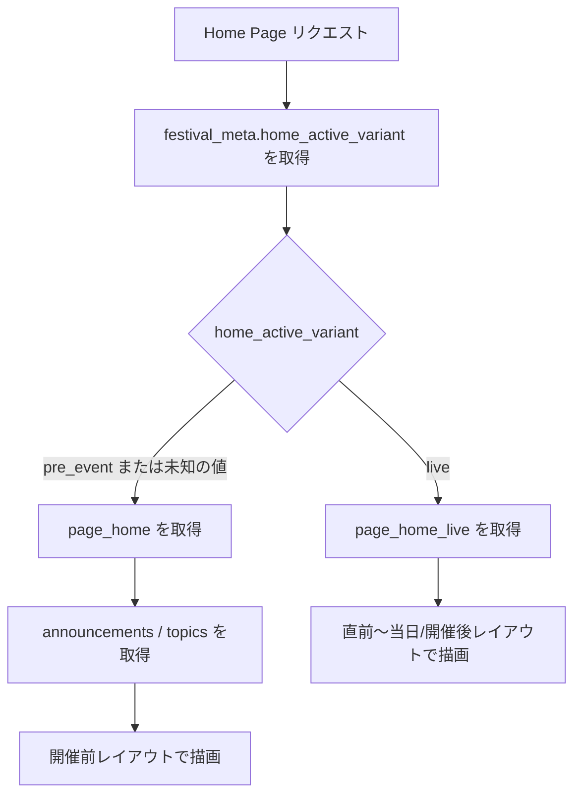
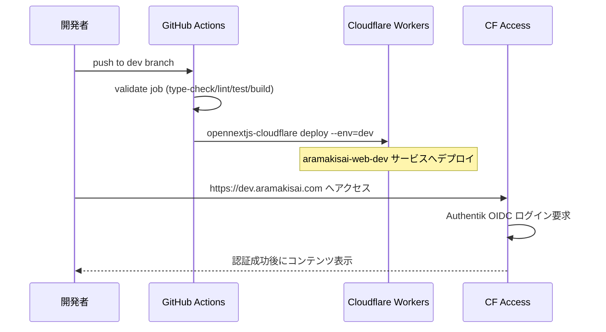
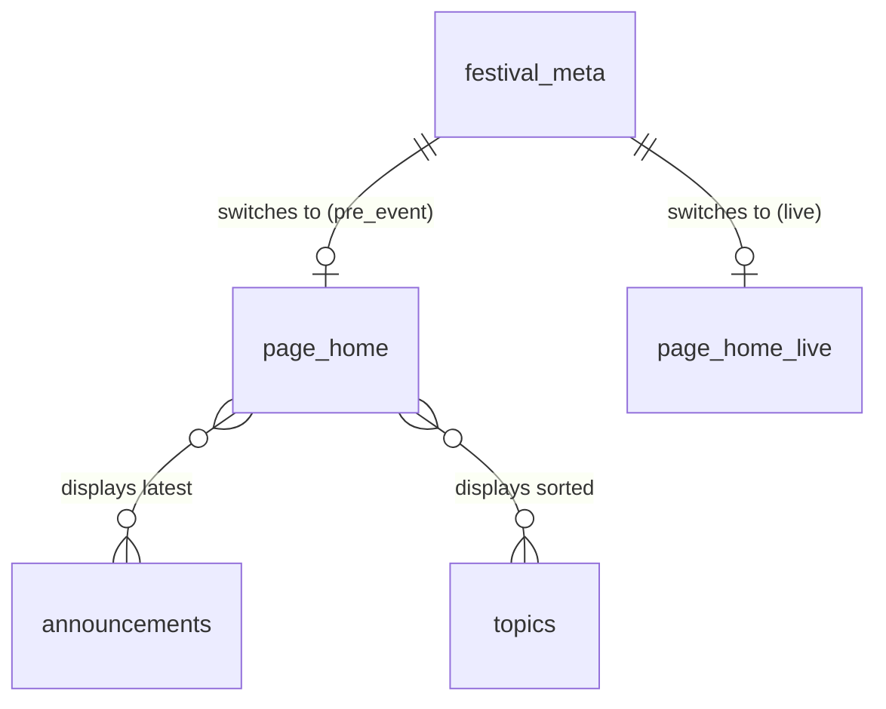
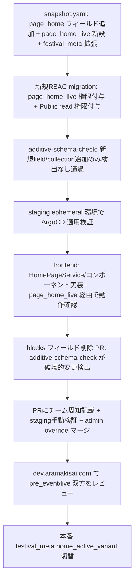

# Technical Design: page-home-friendly-editing

## Overview

本機能は、実行委員が生JSON(`page_home.blocks`)を手打ちする現状を廃止し、Directus管理画面のフォームベースUIでトップページ(Home Page)を編集できるようにする。加えて、開催前(開催1ヶ月前〜直前)と直前〜当日・開催後で内容が大きく異なるという運用要件に対し、切替日の作業負担を最小化するため2つのDirectus singleton collectionを用意し、`festival_meta`の単一フラグで表示を切り替える。切替前に安全にレビューできるよう、CF Access保護された`dev.aramakisai.com`レビュー環境(aramakisai-infra側のTerraform変更を含む)も本specの範囲で構築する。

**Purpose**: 実行委員が非エンジニアでも安全・簡単にHome Pageを更新できる編集体験と、開催フェーズの安全な切替手段を提供する。
**Users**: 荒牧祭実行委員(Directus `executive`ロール)がHome Pageの編集・フェーズ切替を行う。一般来場者はfrontendで完成したHome Pageを閲覧する。
**Impact**: 現状ほぼ空実装の`frontend/src/app/page.tsx`と、生JSON1フィールドのみの`page_home` collectionを、実データ連携した2 singleton構成へ置き換える。

### Goals
- `page_home`/新設`page_home_live`をフォームベース(WYSIWYG・専用URLフィールド)で編集可能にし、`blocks`(生JSON)フィールドを廃止する
- 既存`announcements`/`topics` collectionを再利用し、お知らせ/トピックスの二重管理を避ける
- `festival_meta.home_active_variant`の単一フラグ変更のみでHome Pageの表示内容を切り替えられるようにする
- 埋め込みURLをサンドボックス化`<iframe>`として安全に描画する
- `dev.aramakisai.com`(CF Access保護)でフェーズ切替を事前レビューできる環境を、aramakisai-infra側変更を含め本spec配下で構築する
- presentation層(表示コンポーネント)をdata層(`HomePageService`)から分離し、Tailwind CSSを採用することで、後日デザインチームからFigmaデザインが提供された際にpresentation層のみの差し替えで対応できる構造にする

### Non-Goals
- WordPress風の自由な複合ブロックエディタ(M2A構成)の実装
- `page_access`/`page_contact`/`page_privacy`/`page_sponsor_guide`のスキーマ変更
- RBAC ロール・ポリシー自体の新設(既存`executive`/`student_exhibitor`ポリシーへの権限追加のみ)
- `performance_slots`/`stages`/`student_exhibitions`等、直前〜当日に参照する既存collection自体の変更(Home Pageからのリンク・参照のみ)
- SNS/地図の実サービスとの連携仕様確定(埋め込みURLフィールドの用意まで)
- 最終的なビジュアルデザインの確定(デザインチームからのFigmaデザイン自体の作成。本specはFigma到着前のプレースホルダー実装までを担う)

## Boundary Commitments

### This Spec Owns
- `directus/schema/snapshot.yaml`: `page_home`のフィールド再設計(`blocks`廃止、`hero_image`/`hero_message`/`embed_url`追加)、新規singleton collection `page_home_live`の追加、`festival_meta`への`home_active_variant`/`sns_links`フィールド追加
- `directus/migrations/`: `page_home_live`用のexecutive/student_exhibitor権限付与、および`page_home`/`page_home_live`/`festival_meta`/`announcements`/`topics`に対するDirectus Public(匿名)ポリシーの読み取り権限付与を行う新規migrationファイル
- `frontend/src/app/page.tsx`ほかHome Page関連のコンポーネント・データ取得層の初回実装
- `frontend/src/lib/directus.ts`のSchema型定義(本specが触れる collection分)
- `frontend/wrangler.toml`への`dev`環境(named environment)追加
- `.github/workflows/frontend-ci.yml`への`dev`ブランチ向けデプロイjob追加
- `aramakisai-infra/terraform/dns.tf`/`access.tf`への`dev.aramakisai.com`用リソース追加(クロスリポジトリタスクの一元管理のため)

### Out of Boundary
- `announcements`/`topics` collection自体のフィールド追加・変更(Publicポリシーへの読み取り権限付与を除き、参照するのみ)
- `student_exhibitions`/`sponsors`/`stages`/`performance_slots`/`map_areas`/`time_slots`/`faq_items`/`page_access`/`page_contact`等、本specが触れない他collectionへのDirectus Public権限付与(必要であれば別途対応)
- `page_access`/`page_contact`等、他の固定ページのfrontend実装(本specはHome Pageのみ)
- `performance_slots`/`stages`/`student_exhibitions`のfrontend表示実装(Home Pageからのリンクのみ)
- `aramakisai-infra`側のTerraform apply実行そのもの(既存のHCP Terraformワークスペース運用フローに従う。本specはコード変更のみ所有)
- Authentik側のユーザー・グループ管理(既存`allow_authentik`ポリシーをそのまま再利用)

### Allowed Dependencies
- 既存`announcements`/`topics` collection(読み取り専用の依存、変更不可)
- 既存`page_access`/`page_contact`のフィールド命名規則(`*_embed_url`, `content`)
- 既存RBAC migration `20260701C-rbac-roles.js`の`fields: "*"`権限モデル(参照のみ、直接編集はしない)
- `aramakisai-infra/terraform/access.tf`の`cloudflare_zero_trust_access_identity_provider.authentik`・`local.access_applications`(既存リソース、変更せず新規エントリを追加登録)
- `frontend-ci.yml`の既存Infisical(`staging`環境)連携パターン

### Revalidation Triggers
- `announcements`/`topics`のスキーマ変更(フィールド追加・削除)があった場合、Home Page側の表示ロジックを再確認する
- `20260701C-rbac-roles.js`の`ALL_COLLECTIONS`/`PUBLIC_COLLECTIONS`配列の設計(ハードコード列挙)が変更された場合、本specが追加するRBAC migrationの前提を見直す
- `local.access_applications`の`for_each`ポリシー設計(全アプリに`allow_authentik`が自動適用される構造)が変更された場合、`dev.aramakisai.com`のアクセス制御を再確認する
- 既存`directus-schema` spec の design.md(`page_home / page_access`節)を更新する場合、本specとの記述整合を確認する

## Architecture

### Existing Architecture Analysis
- Directus 12 + Postgres 16のヘッドレスCMSをNext.js(App Router)がREST(`@directus/sdk`)で参照するJAMstack構成([[tech]])
- `frontend/src/lib/directus.ts`の`Schema`型は現状`Record<string, never>`で、Directusスキーマがfrontendに一切反映されていない(初回のDirectus連携実装がこのspecになる)
- RBAC権限は`fields: "*"`のcollection単位で付与されており、既存collectionへのフィールド追加はRBAC変更不要。新規collection追加時のみRBAC migration追加が必須という制約がある([[research]] 参照)
- CI(`frontend-ci.yml`)はPRプレビュー(`wrangler versions upload`、一時URL)と本番デプロイ(`push: main`)の2系統のみで、永続ブランチ向けデプロイは存在しない

### Architecture Pattern & Boundary Map



**Architecture Integration**:
- 選定パターン: 既存のContent-driven Server Rendering(Directus REST→Next.js Server Component)をそのまま踏襲。新規パターン導入なし
- ドメイン境界: Directusスキーマ層(`page_home`/`page_home_live`/`festival_meta`)とfrontendデータ取得層(`HomePageService`)を分離し、表示コンポーネントは`HomePageService`が返す整形済みデータのみに依存する
- 既存パターン維持: `src/lib/directus.ts`の単一クライアントインスタンス共有、`src/env.ts`経由の環境変数アクセス
- 新規コンポーネントの理由: `HomePageService`はDirectusの生スキーマ(2 collection + festival_metaフラグ + announcements/topics)を1つの表示用モデルに集約する層が無いと、`page.tsx`が分岐ロジックと表示ロジックを両方持つ肥大化したコンポーネントになるため新設する
- **presentation/data境界(デザインチーム連携, 7.2)**: `HeroSection`/`NoticesList`/`TopicsList`/`SnsLinks`等の表示コンポーネントは`HomePageService`が返す型付きデータのみをpropsとして受け取り、Directus SDK・fetch処理への直接依存を一切持たない。この境界により、デザインチームからFigmaデザインが提供された際は表示コンポーネント配下(`frontend/src/components/`)のみを差し替えるPRで完結し、`HomePageService`・Directusスキーマへの変更を必要としない(7.4)。本specでの表示コンポーネント実装は、情報設計・構造を満たすだけの最小限のプレースホルダー(Tailwindユーティリティによる簡易スタイル)とする(7.3)
- Steering準拠: `src/env.ts`経由の環境変数アクセス、`@/`パスエイリアス、`Schema`型の明示([[structure]])を維持

### Technology Stack

| Layer | Choice / Version | Role in Feature | Notes |
|-------|------------------|-----------------|-------|
| Frontend | Next.js 15 (App Router) / React 19 | Home Page Server Component実装 | 既存スタックそのまま |
| スタイリング | Tailwind CSS(新規導入) | presentation層のプレースホルダー実装、将来のFigmaデザイントークン反映先 | frontendリポジトリ初のスタイリング基盤導入(7.1, 7.5) |
| Data / CMS | Directus 12.1.1 (`@directus/sdk` ^21) | `page_home`/`page_home_live`/`festival_meta`/`announcements`/`topics`のスキーマ拡張・取得 | Schema型を本specで初めて定義 |
| HTMLサニタイズ | `sanitize-html`(候補、要動作検証) | WYSIWYG本文の安全なレンダリング | `nodejs_compat`環境での動作を実装序盤で検証([[research]]) |
| Infrastructure / Runtime | Cloudflare Workers (`@opennextjs/cloudflare`) + `wrangler` named environment | `dev`環境の新設(`[env.dev]`) | `opennextjs-cloudflare deploy --env=dev`([[research]]) |
| Infra (Terraform) | Cloudflare provider `~> 4.0`(`aramakisai-infra`) | `cloudflare_workers_custom_domain`, `cloudflare_zero_trust_access_application` 追加 | Workers Assets構成との相性を実装序盤で検証([[research]]) |

## File Structure Plan

### Directory Structure
```
directus/
├── schema/snapshot.yaml          # page_home再設計 / page_home_live新設 / festival_meta拡張
└── migrations/
    └── {YYYYMMDD}{suffix}-rbac-page-home-live.js   # 新規: page_home_liveへのRBAC権限付与

frontend/
├── wrangler.toml                 # [env.dev] ブロック追加
├── tailwind.config.ts            # 新規: Figmaデザイントークン反映先(色/spacing/font)
├── postcss.config.mjs            # 新規: Tailwind有効化
├── src/
│   ├── app/globals.css           # 新規: Tailwind エントリポイント
│   ├── lib/
│   │   ├── directus.ts           # Schema型に本spec対象collectionを追加
│   │   └── home-page.ts          # HomePageService: festival_meta参照→collection分岐→announcements/topics取得
│   ├── components/                # presentation層。HomePageServiceの型付きpropsのみに依存(Directus非依存, 7.2)
│   │   ├── rich-text.tsx         # サニタイズ済みWYSIWYGレンダリング(共通)
│   │   ├── sandboxed-embed.tsx   # embed_url用サンドボックスiframe(共通)
│   │   ├── hero-section.tsx      # ヒーロー画像+本文(プレースホルダー実装, 7.3)
│   │   ├── notices-list.tsx      # announcements表示(プレースホルダー実装, 7.3)
│   │   ├── topics-list.tsx       # topics表示(プレースホルダー実装, 7.3)
│   │   └── sns-links.tsx         # festival_meta.sns_links表示(プレースホルダー実装, 7.3)
│   └── app/
│       └── page.tsx              # HomePageServiceを呼び出しコンポーネントを組み立てる

.github/workflows/
└── frontend-ci.yml               # push: [dev] トリガー + deploy-dev job 追加
```

### Modified Files
- `directus/schema/snapshot.yaml` — `page_home`の`blocks`削除・`hero_image`/`hero_message`/`embed_url`追加、`page_home_live`新設、`festival_meta`への`home_active_variant`/`sns_links`追加
- `frontend/src/lib/directus.ts` — `Schema`型に`page_home`/`page_home_live`/`festival_meta`/`announcements`/`topics`を追加
- `frontend/src/app/page.tsx` — 静的仮実装からHomePageService連携実装へ置き換え
- `frontend/wrangler.toml` — `[env.dev]`(専用worker名、custom domain想定)追加
- `.github/workflows/frontend-ci.yml` — `dev`ブランチpushトリガーの`deploy-dev` job追加
- `aramakisai-infra/terraform/dns.tf` — `dev.aramakisai.com`用リソース追加(内容は実装序盤の検証結果に依存、[[research]]参照)
- `aramakisai-infra/terraform/access.tf` — `local.access_applications`への`dev.aramakisai.com`用`cloudflare_zero_trust_access_application`エントリ追加

## System Flows

### Home Page表示時のフェーズ分岐



- `home_active_variant`が未設定・想定外の値の場合は`pre_event`扱いにフェイルセーフする(4.xのエラーハンドリング参照)
- `live`分岐では`announcements`/`topics`を取得せず、代わりに`performance_slots`/`stages`/`student_exhibitions`へのリンクを表示する(既存collection自体は本specの対象外)

### devブランチ デプロイ〜レビューフロー



## Requirements Traceability

| Requirement | Summary | Components | Interfaces | Flows |
|-------------|---------|------------|------------|-------|
| 1.1 | 生JSONでなくフォーム表示 | Directus Schema (`page_home`/`page_home_live`) | - | - |
| 1.2 | WYSIWYGフィールド | Directus Schema, RichText | RichText Props | - |
| 1.3 | お知らせ/トピックスの追加・削除・並び替え手段 | 既存`announcements`/`topics`, NoticesList, TopicsList | HomePageService.getActiveVariant | フェーズ分岐フロー |
| 1.4 | ヒーロー画像フィールド | Directus Schema, HeroSection | HeroSection Props | - |
| 1.5 | SNSリンクフィールド | `festival_meta.sns_links`, SnsLinks | SnsLinks Props | - |
| 1.6 | `blocks`廃止 | Directus Schema (`page_home`) | - | Migration Strategy |
| 2.1 | 埋め込み専用URLフィールド | Directus Schema (`embed_url`) | - | - |
| 2.2 | WYSIWYGへのiframe禁止 | RichText(サニタイズ) | RichText Props | - |
| 2.3 | サンドボックスiframe描画 | SandboxedEmbed | SandboxedEmbed Props | - |
| 2.4 | 空URL時は非表示 | SandboxedEmbed | SandboxedEmbed Props | - |
| 3.1 | 2 singleton構成 | Directus Schema (`page_home`, `page_home_live`) | - | フェーズ分岐フロー |
| 3.2 | 開催後は軽微編集で対応 | Directus Schema (`page_home_live.hero_message`) | - | - |
| 3.3 | 切替フラグ | `festival_meta.home_active_variant` | HomePageService.getActiveVariant | フェーズ分岐フロー |
| 3.4 | フラグ変更で即時反映 | HomePageService | HomePageService.getActiveVariant | フェーズ分岐フロー |
| 3.5 | dev環境での事前検証 | wrangler `[env.dev]`, frontend-ci.yml, access.tf, dns.tf | - | devデプロイフロー |
| 3.6 | dev環境は本番Directusを参照(読み取り専用のため分離不要) | frontend-ci.yml `deploy-dev` job | - | devデプロイフロー |
| 4.1〜4.5 | additive-only/staging検証運用 | Migration Strategy | - | Migration Strategy flow |
| 4.6 | Public(匿名)ロールへの読み取り権限付与 | RBAC Migration | - | Migration Strategy flow |
| 5.1〜5.3 | 既存固定ページとの一貫性 | Directus Schema設計(命名規則) | - | - |
| 6.1〜6.6 | devレビュー環境(infra含む) | wrangler `[env.dev]`, frontend-ci.yml, dns.tf, access.tf | - | devデプロイフロー |
| 7.1, 7.5 | Tailwind CSS導入 | `tailwind.config.ts`, `postcss.config.mjs`, `globals.css` | - | - |
| 7.2, 7.4 | presentation/data層の分離 | HeroSection, NoticesList, TopicsList, SnsLinks | HomePageContent props | - |
| 7.3 | Figma到着前のプレースホルダー実装 | HeroSection, NoticesList, TopicsList, SnsLinks | - | - |

## Components and Interfaces

| Component | Domain/Layer | Intent | Req Coverage | Key Dependencies (P0/P1) | Contracts |
|-----------|--------------|--------|--------------|--------------------------|-----------|
| Directus Schema (page_home/page_home_live/festival_meta) | Data | Home Page系フィールド定義 | 1.1-1.6, 2.1, 3.1-3.3, 5.1-5.3 | - | State |
| RBAC Migration (page_home_live) | Data | 新規collectionへのCRUD権限付与 | 3.1, 4.2 | 既存RBAC migration(P0参照のみ) | Batch |
| HomePageService | Frontend/lib | フェーズ判定+データ集約 | 1.3, 3.3, 3.4 | Directus client(P0) | Service |
| RichText | Frontend/UI | サニタイズ済みWYSIWYG描画 | 1.2, 2.2 | sanitize-html(P0) | - |
| SandboxedEmbed | Frontend/UI | 埋め込みURLのサンドボックスiframe描画 | 2.1, 2.3, 2.4 | - | - |
| HeroSection / NoticesList / TopicsList / SnsLinks | Frontend/UI (presentation, Figma差し替え対象) | 各セクションの表示(プレースホルダー実装) | 1.3, 1.4, 1.5, 7.2, 7.3, 7.4 | HomePageContent props(P0)。Directus/HomePageServiceには非依存 | - |
| frontend-ci.yml `deploy-dev` job | CI/CD | devブランチの永続デプロイ | 3.5, 6.1, 6.5 | Infisical staging(P1) | Batch |
| wrangler `[env.dev]` | Infra | dev worker定義 | 6.1 | - | - |
| access.tf / dns.tf 追加 | Infra(aramakisai-infra) | `dev.aramakisai.com`保護・ルーティング | 3.5, 6.2, 6.3, 6.4 | 既存Authentik IdP(P0) | State |

### Data Layer

#### Directus Schema (page_home / page_home_live / festival_meta)

| Field | Detail |
|-------|--------|
| Intent | Home Page系コンテンツと切替フラグの保持 |
| Requirements | 1.1, 1.2, 1.4, 1.6, 2.1, 3.1, 3.2, 3.3, 5.1, 5.2, 5.3 |

**Responsibilities & Constraints**
- `page_home`(既存流用、開催前用): `blocks`(json, input-code)を廃止し、`hero_image`(uuid→directus_files, interface: file-image)/`hero_message`(text, interface: input-rich-text-html)/`embed_url`(string, interface: input, 既存`map_embed_url`等と同じ命名規則)を追加
- `page_home_live`(新規、直前〜当日・開催後兼用): `id`/`hero_image`/`hero_message`/`embed_url`の4フィールドのみ。`singleton: true`、`accountability: all`など既存固定ページと同一のmeta設定に従う(5.2)
- `festival_meta`(既存拡張): `home_active_variant`(interface: select-dropdown, choices: `pre_event`/`live`, default: `pre_event`)と`sns_links`(interface: list, 各行に`platform`/`url`)を追加
- お知らせ/トピックスは新規フィールドを持たず、既存`announcements`(`published_at`でフィルタ)/`topics`(`sort`順)をfrontendから直接クエリする(1.3)

**Contracts**: State [x]

##### State Management
- 永続化: Directus(Postgres)。`directus schema snapshot`で書き出した`snapshot.yaml`がSSoT
- 整合性: `page_home_live`追加はRBAC migrationとセットでなければexecutiveロールからも操作不能になる制約がある([[research]])
- 移行: `blocks`削除は破壊的変更としてadditive-schema-checkが検出する(Migration Strategy参照)

#### RBAC Migration (page_home_live + Public read access)

| Field | Detail |
|-------|--------|
| Intent | 新規collection `page_home_live` にexecutive(CRUD)/student_exhibitor(read)権限を付与し、あわせて`page_home`/`page_home_live`/`festival_meta`/`announcements`/`topics`にDirectus Public(匿名)ポリシーの読み取り権限を付与する |
| Requirements | 3.1, 4.2, 4.6 |

**Dependencies**
- Inbound: なし
- Outbound: `directus_permissions`テーブル(P0)
- External: 既存`20260701C-rbac-roles.js`の`EXECUTIVE_POLICY_ID`/`STUDENT_EXHIBITOR_POLICY_ID`定数(参照のみ、P0)。Directus core標準の`PUBLIC_POLICY_ID = 'abf8a154-5b1c-4a46-ac9c-7300570f4f17'`(Directus本体の`20240806A-permissions-policies.ts`が定義する固定UUID、全Directusインストールで共通、P0)

**Contracts**: Batch [x]

##### Batch / Job Contract
- Trigger: `directus database migrate:latest`(既存運用フローと同一)
- Input / validation: 新規migrationファイルは既存の固定UUID(`EXECUTIVE_POLICY_ID`等)およびDirectus core標準の`PUBLIC_POLICY_ID`を再定義せず同じ値を参照する
- Output / destination: `directus_permissions`テーブルに (1) `page_home_live`に対する4アクション(executive)+ read(student_exhibitor)、(2) `page_home`/`page_home_live`/`festival_meta`/`announcements`/`topics`に対する`PUBLIC_POLICY_ID`のread権限(`announcements`のみ`{ published_at: { _lte: "$NOW", _nnull: true } }`でフィルタ、他はフィルタ無し)の行を追加
- Idempotency & recovery: `onConflict`相当のガード、または対象collectionに限定した`delete-then-insert`で再実行安全性を確保する。`down()`は対象collection・対象policyの行のみ削除し、既存の`page_home`等executive権限や他collectionのPublic権限を巻き込まない

**Implementation Notes**
- Integration: 既存`20260701C-rbac-roles.js`は編集しない(適用済みのため無効)。新規ファイルとして追加する
- Validation: staging適用後、(1) Directus管理画面でexecutiveロールが`page_home_live`を編集できること、(2) 未認証(Publicロール)のREST呼び出しで対象5 collectionが読み取れることの両方を確認する(4.4と連動)
- Risks: RBAC追加を忘れると新規collectionが操作不能になる、Public権限付与を忘れるとfrontendが常に空データになる(いずれも見落としやすい、[[research]] Risks参照)

### Frontend Layer

#### HomePageService

| Field | Detail |
|-------|--------|
| Intent | `festival_meta.home_active_variant`を判定し、対応するcollection+announcements/topicsを取得して表示用モデルに集約する |
| Requirements | 1.3, 3.3, 3.4 |

**Dependencies**
- Inbound: `app/page.tsx`(P0)
- Outbound: `@directus/sdk`クライアント(P0)、`announcements`/`topics`/`page_home`/`page_home_live`/`festival_meta`(P0)

**Contracts**: Service [x]

##### Service Interface
```typescript
type HomeActiveVariant = 'pre_event' | 'live';

interface DirectusFileRef {
  id: string;
}

interface SnsLink {
  platform: string;
  url: string;
}

interface NoticeSummary {
  id: number;
  title: string;
  body: string;
  publishedAt: string;
}

interface TopicSummary {
  id: number;
  title: string;
  body: string | null;
  imageId: string | null;
  linkUrl: string | null;
}

interface HomePageContent {
  heroImageId: string | null;
  heroMessageHtml: string;
  embedUrl: string | null;
  snsLinks: SnsLink[];
}

interface PreEventHomeContent extends HomePageContent {
  notices: NoticeSummary[];
  topics: TopicSummary[];
}

type HomePageResult =
  | { variant: 'pre_event'; content: PreEventHomeContent }
  | { variant: 'live'; content: HomePageContent };

interface HomePageService {
  getHomePage(): Promise<HomePageResult>;
}
```
- Preconditions: Directusクライアントが`NEXT_PUBLIC_DIRECTUS_URL`で初期化済みであること
- Postconditions: `festival_meta.home_active_variant`が未設定/不正な値の場合は`variant: 'pre_event'`を返す(フェイルセーフ)
- Invariants: `variant: 'live'`の場合、`notices`/`topics`は含まれない(1.3, 3.3参照)

**dev環境向けフェーズオーバーライド(5.7)**: dev環境(`env.dev`)は本番Directusを読み取り専用で参照するため(3.6)、`festival_meta.home_active_variant`は本番と共有された唯一のフラグである。dev環境上でこのフラグをそのまま操作すると本番のHome Page表示まで同時に切り替わってしまう。再デプロイ無しで即座にプレビュー切替できるよう、URLクエリパラメータ`?home_variant=pre_event|live`によるオーバーライドを採用する: `getHomePage(overrideVariant?: HomeActiveVariant)`は`overrideVariant`引数が渡された場合、`festival_meta.home_active_variant`より優先してそれをvariantとして採用する。`app/page.tsx`(Server Component)がNext.jsの`searchParams`から`home_variant`クエリを読み取り、ビルド時の環境変数`NEXT_PUBLIC_ENABLE_HOME_VARIANT_QUERY_OVERRIDE`(値: `'true'`。dev環境のCIビルドでのみ設定し、本番ビルドでは常に未設定)が有効な場合に限り`overrideVariant`として渡す。本番ビルドではこの変数が存在しないため、`?home_variant=live`等のクエリを本番URLに付与しても一切影響しない。レビュアーはdev.aramakisai.comのURLにクエリを付け替えるだけで再デプロイ無しに両フェーズを確認できる。

**Implementation Notes**
- Integration: `app/page.tsx`はServer Componentとして`HomePageService.getHomePage()`を呼び出し、結果に応じて表示コンポーネントを組み立てる
- Validation: `home_active_variant`の想定外の値(null、未知の文字列)は`pre_event`として扱う
- Risks: Directus側のフィールド名変更が起きた場合、`Schema`型とこのServiceの両方を更新する必要がある

#### RichText / SandboxedEmbed

| Field | Detail |
|-------|--------|
| Intent | WYSIWYG本文の安全な描画、埋め込みURLのサンドボックスiframe描画 |
| Requirements | 1.2, 2.1, 2.2, 2.3, 2.4 |

**Implementation Notes**
- Integration: `RichText`は`sanitize-html`(第一候補)でサーバー側サニタイズしてから`dangerouslySetInnerHTML`相当で描画する。`SandboxedEmbed`は`embedUrl`が空文字/null(2.4)の場合何もレンダリングせず、値がある場合`<iframe sandbox="allow-scripts allow-popups">`相当の制限付き属性で描画する(2.3)
- Validation: `sanitize-html`が`nodejs_compat`環境で動作しない場合は`isomorphic-dompurify`にフォールバックする([[research]] Risks)
- Risks: サニタイズ対象のHTMLタグ許可リストの詳細(見出し・リンク・改行等どこまで許可するか)は実装時に確定する

### CI/CD & Infra Layer

#### frontend-ci.yml `deploy-dev` job / wrangler `[env.dev]`

| Field | Detail |
|-------|--------|
| Intent | `dev`ブランチへのpushで`dev.aramakisai.com`へ永続デプロイする。バックエンドは本番Directus(`api.aramakisai.com`)を参照する |
| Requirements | 3.5, 3.6, 6.1, 6.5 |

**Dependencies**
- Inbound: `dev`ブランチへのpush(P0)
- Outbound: Cloudflare Workers(`aramakisai-web-dev`サービス想定, P0)
- External: Infisical `staging`環境(Cloudflareデプロイ資格情報のみ流用、P1)

**Contracts**: Batch [x]

##### Batch / Job Contract
- Trigger: `push: branches: [dev]`(既存の`main`向けjobパターンを踏襲)
- Input / validation: 既存`validate` job(type-check/lint/test/build)を`needs`として通過すること
- Output / destination: `opennextjs-cloudflare deploy --env=dev`によって`aramakisai-web-dev`(仮称)Workersサービスへデプロイ。ビルド時の`NEXT_PUBLIC_DIRECTUS_URL`は本番値(`https://api.aramakisai.com`)を明示的に指定する(この値自体は`NEXT_PUBLIC_`のためクライアント公開前提であり秘匿情報ではなく、Infisical `prod`環境を経由する必要はない)。`NEXT_PUBLIC_SITE_URL`は`https://dev.aramakisai.com`
- Idempotency & recovery: 既存`deploy-prod`と同様、push毎に上書きデプロイ。ロールバックは既存の`git revert`+再pushで対応

**Implementation Notes**
- Integration: Cloudflareデプロイ資格情報(API token等)は既存`deploy-preview`と同じくInfisical `staging`環境のログイン手順を再利用する。`NEXT_PUBLIC_DIRECTUS_URL`のみワークフロー内でリテラル値として上書きし、Infisical `prod`環境の資格情報自体は本jobに渡さない(devブランチが`main`ほど保護されていない場合でも、prod Cloudflareデプロイ資格情報の露出面を広げないため)
- Validation: `opennextjs-cloudflare deploy --env=`フラグの既知issue(#11741)があるため、実装序盤に実機で動作確認する
- Risks: `--env`フラグが意図通り機能しない場合、`wrangler deploy --env=dev`への切り替えを検討する。本番Directusへの読み取りは常時発生するため、`page_home`/`page_home_live`等のPublic read権限(RBAC Migrationコンポーネント参照)が前提となる

#### access.tf / dns.tf 追加(aramakisai-infra)

| Field | Detail |
|-------|--------|
| Intent | `dev.aramakisai.com`をCF Access(Authentik OIDC)で保護し、Cloudflare Workersへルーティングする |
| Requirements | 3.5, 6.2, 6.3, 6.4 |

**Dependencies**
- Inbound: なし
- Outbound: `cloudflare_workers_custom_domain`(P0)、`cloudflare_zero_trust_access_application`(P0)
- External: 既存`cloudflare_zero_trust_access_identity_provider.authentik`(P0, 変更不可)

**Contracts**: State [x]

##### State Management
- 永続化: Terraform state(`aramakisai-infra`のHCP Terraformワークスペース)
- 整合性: `local.access_applications`マップに`dev.aramakisai.com`用エントリを追加すると、既存の`allow_authentik`ポリシーが`for_each`により自動適用される(既存アーキテクチャを変更せず拡張できる)
- 移行: `cloudflare_workers_custom_domain`のWorkers Assets構成との相性(既知issue #5618)を実装序盤で検証する。問題が出た場合はダッシュボード手動設定+`terraform import`にフォールバックする

**Implementation Notes**
- Integration: `dns.tf`の追加内容(CNAME要否)は`cloudflare_workers_custom_domain`が自動でDNSを扱うか、別途`cloudflare_record`が必要かを実装序盤に確認してから確定する
- Validation: `dev.aramakisai.com`にAuthentik未認証でアクセスし、CF Accessのログイン画面にリダイレクトされることを確認する
- Risks: `terraform apply`自体は`aramakisai-infra`の既存運用フロー(HCP Terraformワークスペース)に従う。本spec側でapply実行までは担保しない(Out of Boundary)

## Data Models

### Logical Data Model

| Collection | Key Fields | Cardinality | Notes |
|---|---|---|---|
| `festival_meta` | `home_active_variant`(select), `sns_links`(list) | singleton | Home Page変種の切替と横断的なSNS情報を保持 |
| `page_home` | `hero_image`, `hero_message`, `embed_url` | singleton | 開催前用。既存`page_home`を流用、`blocks`は廃止 |
| `page_home_live` | `hero_image`, `hero_message`, `embed_url` | singleton(新規) | 直前〜当日・開催後兼用。開催後は`hero_message`の内容書き換えのみで対応 |
| `announcements`(既存,参照のみ) | `title`, `body`, `published_at` | 非singleton | Home Page(開催前)がpublished_at昇順降順で最新N件を参照 |
| `topics`(既存,参照のみ) | `title`, `body`, `image`, `link_url`, `sort` | 非singleton | Home Page(開催前)が`sort`順で参照 |



### Physical Data Model

**page_home(既存collection、フィールド変更)**

| フィールド | 型 | Directus interface | 備考 |
|---|---|---|---|
| id | integer | - | PK singleton(既存) |
| ~~blocks~~ | ~~json~~ | ~~input-code~~ | **廃止**(1.6) |
| hero_image | uuid → directus_files | file-image | ヒーロー画像(1.4) |
| hero_message | text | input-rich-text-html | 開催前トップメッセージ(1.2) |
| embed_url | string | input | SNS/動画等の任意埋め込みURL(2.1) |

**page_home_live(新規collection)**

| フィールド | 型 | Directus interface | 備考 |
|---|---|---|---|
| id | integer | - | PK singleton |
| hero_image | uuid → directus_files | file-image | 直前〜当日/開催後のヒーロー画像 |
| hero_message | text | input-rich-text-html | 直前〜当日メッセージ。開催後はこの内容を閉会メッセージに書き換える(3.2) |
| embed_url | string | input | SNS/動画等の任意埋め込みURL |

**festival_meta(既存collection、フィールド追加)**

| フィールド | 型 | Directus interface | 備考 |
|---|---|---|---|
| home_active_variant | string | select-dropdown | 選択肢: `pre_event` / `live`。default: `pre_event`(3.3) |
| sns_links | json | list | 各行 `{ platform: string, url: string }`(1.5) |

## Error Handling

### Error Strategy
- Directus未応答・ネットワークエラー時はHome Page全体をクラッシュさせず、既存の静的仮実装相当の最小限フォールバック(見出しのみ表示等)にグレースフルデグレードする
- `home_active_variant`が未設定/不正値の場合は`pre_event`にフェイルセーフする(Postconditions参照)
- `embed_url`が空/nullの場合は該当セクションを描画しない(2.4)

### Error Categories and Responses
- **System Errors**: Directus fetch失敗 → Server Componentレベルでtry/catchし、最小限のフォールバックUIを描画(ユーザー向けエラーメッセージは表示しない、来場者体験を優先)
- **Business Logic Errors**: `home_active_variant`が想定外の値 → `pre_event`扱い(ログ出力のみ、ユーザー向けエラーにはしない)

### Monitoring
- 既存steeringにアプリケーション監視基盤の言及なし(`.kiro/specs/error-monitoring`は見送り済み)。本specでも新規監視基盤は導入せず、Cloudflare Workersの標準ログに委ねる

## Testing Strategy

- **Unit Tests**: `HomePageService.getHomePage()`のフェーズ分岐ロジック(pre_event/live/不正値)、`RichText`のサニタイズ結果(許可/禁止タグ)、`SandboxedEmbed`の空URL時非表示・sandbox属性付与
- **Integration Tests**: Directus SDKをモックした`page.tsx`のレンダリング(pre_event/live双方)、`announcements`/`topics`取得のフィルタ条件(published_at, sort)
- **Workflow Tests**: 既存`frontend-ci.workflow.test.ts`パターンに倣い、`frontend-ci.yml`の`deploy-dev` job構造(trigger, needs, steps)を検証する新規/追記テスト
- **E2E**: 既存`staging-e2e-verification`のPlaywright基盤を使い、pre_event/liveそれぞれのHome Page主要要素(ヒーロー・お知らせ・埋め込み非表示時の挙動)を検証

## Security Considerations
- **脅威モデル**: Home Page編集者はDirectus `executive`ロール(Authentik OIDC認証済み)に限定される少人数の実行委員であり、想定される脅威は外部攻撃者によるXSSよりも「事故による不正なHTML混入・レイアウト崩壊」が主。とはいえ多層防御として`sanitize-html`(または代替)によるサニタイズを行う(2.2)
- **iframeサンドボックス化**: `embed_url`由来の`<iframe>`は`sandbox`属性で権限を最小化し、埋め込み先が予期せずページ全体を操作できないようにする(2.3)
- **CF Access**: `dev.aramakisai.com`は既存`allow_authentik`ポリシー(Authentik OIDC)で保護し、未認証アクセスを拒否する(6.4)。E2E CI等の非対話アクセスが必要になった場合は既存`web-e2e-cloudflare-access-bypass`同様のnon_identity Service Tokenパターンを踏襲できる(本specではスコープ外、必要になれば別途追加)
- **Public(匿名)読み取り権限の付与**: `page_home`/`page_home_live`/`festival_meta`/`announcements`/`topics`にDirectus Public policy経由の読み取り権限を新規付与する(4.6)。これらのcollectionは実行委員が編集する公開前提のコンテンツであり機密情報を含まないため、匿名read許可は意図した設計である。`announcements`のみ既存`student_exhibitor`向け権限と同じ`published_at`フィルタを適用し、未公開お知らせの露出を防ぐ
- **devバックエンドの本番Directus参照**: `dev.aramakisai.com`は本番Directus(`api.aramakisai.com`)に対し上記Public read権限の範囲でのみ読み取りを行う。書き込み経路が無く閲覧できる情報も上記の通り機密情報を含まないため、専用のテストデータ環境を用意しない判断とした(3.6)。CF Access(Authentik)による人間側のアクセス制御と組み合わせ、開催フェーズ切替のリハーサルを安全に行える

## Migration Strategy



- Phase A〜Eは追加のみ(additive)で完結させ、`blocks`削除(Phase F)は独立したPRとして分離し、Req4のチーム周知・staging検証フローを確実に踏む
- `aramakisai-infra`側(`dns.tf`/`access.tf`)の変更はA〜Eと並行して進められる(依存関係なし)

## Design Handoff(デザインチーム連携)

- 本specはデザインチームからのFigmaデザイン到着を前提とせず、`HeroSection`/`NoticesList`/`TopicsList`/`SnsLinks`をTailwindユーティリティによる最小限のプレースホルダーとして実装する(7.3)
- デザインチームはコーディングを行わずFigmaでデザインを渡す、またはこちら側でFigma相当の見た目を実装する運用を想定する。いずれの場合も差し替え対象は`frontend/src/components/`配下のpresentation層のみであり、`HomePageService`(`frontend/src/lib/home-page.ts`)・Directusスキーマへの変更は不要(7.2, 7.4)
- Figma到着後の差し替えPRは、`HomePageContent`/`PreEventHomeContent`のprops契約(Components and Interfaces参照)を変更しない限りHomePageService側のレビューを要さず、presentation層単独でレビュー完結できる

### 受け取り方式(採用: Figma共有リンク + Inspectパネルの手動転記)

- デザインチームはFigmaファイルの**閲覧権限リンク**(編集権限不要)を共有する。専用の連携ツール・Figma APIトークン発行は不要
- 開発側はFigmaの無料枠で使える**Inspectパネル**(要素選択時に表示される色コード・spacing・フォント・書き出し用アセットの一覧。有料のDev Modeは不要)を用いて値を確認し、`tailwind.config.ts`の`theme.extend`(色パレット・spacing・fontFamily)と各presentationコンポーネントのTailwindクラスへ人力で転記する
- 画像・アイコン等の静的アセットはFigmaの書き出し機能でエクスポートし、`frontend/public/`配下に配置する
- **不採用**: Figma API連携やTokens Studio等によるデザイントークン自動同期パイプライン。デザインチームもコーディングをせず、対象がトップページ1画面のみという規模感に対して導入・保守コストが見合わないため。将来デザイン変更の頻度・対象範囲が広がった場合に再検討する(7.5)
