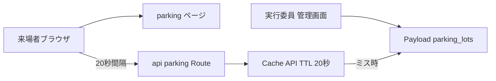
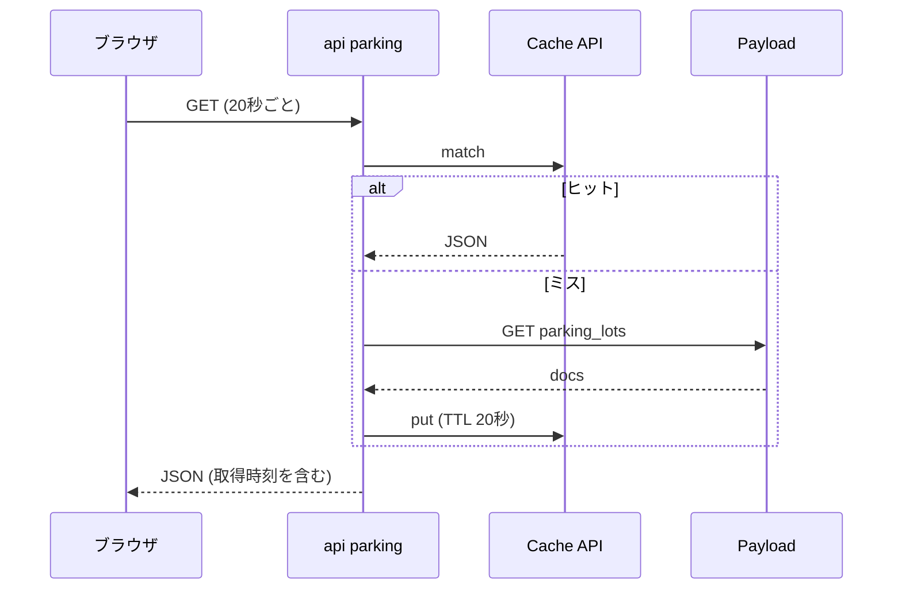

# Design Document

## Overview
来場者が駐車場ごとの空き状況をスマートフォンで確認できるページを追加する。実行委員が Payload 管理画面で駐車場ごとの状況を更新し、来場者のブラウザが 20 秒間隔で frontend の API ルートを再取得して表示を更新する。

**Users**: 来場者 (閲覧)、実行委員 (管理画面での更新)。
**Impact**: CMS に `parking_lots` コレクションを 1 つ追加し、既存グローバル `festival_meta` に公開切替のフィールドを 1 つ追加する。frontend にページ・API ルート・ポーリングフックを追加する。ロール定義・認証は変更しない。

### Goals
- 更新から 60 秒以内 (最悪約 45 秒、平均約 20 秒) に来場者の表示へ反映する
- CMS オリジンへの到達リクエスト数を来場者数に比例させない
- ポーリング機構を digital-signage が再利用できる形にする

### Non-Goals
- 駐車台数の自動計測、予約、経路案内、PUSH 通知
- 構内マップ上への駐車場表示
- 認証・ロール・外部入力経路 (Forms / Discord) の追加

## Boundary Commitments

### This Spec Owns
- `parking_lots` コレクションの定義・マイグレーション・テスト
- `festival_meta.parking_enabled` (公開切替) の定義・マイグレーション
- `/parking` ページと `/api/parking` ルート
- 汎用ポーリングフック `usePolling` と、`cms.ts` の TTL 指定オプション

### Out of Boundary
- ロール・access policy の仕組みの変更 (既存 policy をそのまま使う)
- 公開フェーズ切替の仕組み (`phase.ts` の判定を利用するのみ)
- digital-signage の画面実装

### Allowed Dependencies
- `frontend/src/lib/cms.ts` (CMS クライアント、Cache API)
- `frontend/src/lib/phase.ts` と `middleware.ts` (公開フェーズ制御)
- `cms/src/access/policy.ts` (既定の公開読み取り・実行委員のみ書き込み)

### Revalidation Triggers
- `usePolling` の引数・戻り値の変更 (digital-signage に影響)
- `parking_lots` のフィールド削除・型変更 (`cms-schema-check` が検出する破壊的変更)
- `cms.ts` の TTL 既定値の変更 (他ページの鮮度に影響)

## Architecture

### Architecture Pattern & Boundary Map


- **Selected pattern**: frontend 内の Route Handler が CMS 取得結果をエッジにキャッシュし、クライアントがポーリングする
- **依存方向**: `cms-types` → `lib/parking.ts` (型・純粋関数) → `lib/parking-data.ts` (取得、`lib/cms.ts` を使用) → `app/api/parking/route.ts` / `app/(site)/parking/page.tsx`。`components/parking-list.tsx` は `lib/parking.ts` のみ import し、`cms.ts` (`caches`・`@/env` を参照) をクライアントバンドルに含めない。上方向の import は行わない
- **Steering compliance**: Node 専用 API を使わない。`runtime = 'edge'` は宣言しない (既存コードに宣言はなく、OpenNext は `nodejs_compat` で動作する)。環境変数は追加しない。型は `cms-types.ts` から導出する

### Technology Stack
| Layer | Choice | Role | Notes |
|-------|--------|------|-------|
| Frontend | Next.js 15 / React 19、OpenNext | ページ・Route Handler・ポーリングフック | 既存 |
| Backend | Payload 3 | `parking_lots` コレクション | 既存の access 結線を利用 |
| Storage | Postgres | 駐車場データ | マイグレーションで追加 |
| Runtime | Cloudflare Workers + Cache API | TTL 20 秒のエッジキャッシュ | 拠点単位でキャッシュ |

## File Structure Plan

### Directory Structure
```
cms/src/collections/parking-lots.ts           # コレクション定義
cms/src/collections/parking-lots.test.ts      # 定義の単体テスト
cms/src/migrations/<timestamp>_parking_lots.ts # 生成されるマイグレーション (index.ts に登録)
frontend/src/lib/parking.ts                   # 型・整形・古さ判定 (純粋関数のみ。クライアントから import 可)
frontend/src/lib/parking-data.ts              # CMS からの取得 (サーバー側専用)
frontend/src/lib/use-polling.ts               # 機能非依存のポーリングフック
frontend/src/app/api/parking/route.ts         # GET ルート
frontend/src/app/(site)/parking/page.tsx      # ページ (初回データをサーバー取得)
frontend/src/components/parking-list.tsx      # 一覧表示 (クライアント)
```
各ファイルに同階層の `*.test.ts(x)` を置く。

### Modified Files
- `cms/src/collections/index.ts` — 登録口に `ParkingLots` を 1 行追加
- `cms/src/globals/festival-meta.ts` — `parking_enabled` (checkbox、label「駐車場空き情報を公開する」、既定 false) を追加
- `frontend/src/lib/festival-meta.ts` — `parking_enabled` を読む取得関数 (`CmsResult<boolean>` を返す) を追加
- `cms/src/access/access.int.test.ts` — 未認証の読み取り許可・作成更新削除の拒否、学生団体の更新・作成・削除の拒否を検証するケースを追加
- `cms/src/access/policy.test.ts` — `isHiddenInAdmin` に駐車場のケース (student_exhibitor は true、executive は false) を追加
- `frontend/src/lib/cms.ts` — `findMany` に TTL 指定オプションを追加 (既定は 60 秒のまま)
- `frontend/src/cms-types.ts` — `pnpm generate:types` による再生成
- `frontend/src/lib/route-metadata.ts` — `CodeRoutePath` 型と `ROUTE_METADATA` に `/parking` を追加
- `frontend/src/lib/route-classification.ts` — `INTENTIONALLY_PRIVATE_ROUTES` に `/parking` を追加
- `frontend/src/app/layout.tsx` — `MATERIAL_SYMBOLS_ICON_NAMES` に `history`・`sync_problem` を追加
- `frontend/src/lib/navigation.ts` — `/parking` へのリンクは既存 (`:114`)。「別 spec が実装するまで未実装」のコメント (`:57-59`) は丸ごと削除する (timetable も実装済み)
- `frontend/src/app/sitemap.ts` — 公開フェーズが live かつ `parking_enabled` が真のときだけ `/parking` を載せる。既に取得している festival_meta の結果から読む

## System Flows

再取得に失敗した場合、ブラウザは直前の JSON と取得時刻を保持して次の間隔で再試行する。

## Requirements Traceability
| Requirement | Summary | Components | Interfaces |
|-------------|---------|------------|------------|
| 1.1-1.5 | 一覧表示 | `parking-list`, `parking.ts`, `parking-data.ts`, ページ | `ParkingLot` |
| 2.1-2.2 | 更新時刻・3 段階 | `parking-lots.ts` | `status` の select、`updatedAt` |
| 2.3-2.5 | 権限 | 既存 `policy.ts`、`access.int.test.ts` | 既定の access |
| 2.6 | スマホ更新 | `parking-lots.ts` の admin 設定 | `defaultColumns` |
| 3.1, 3.3, 3.4 | ポーリング・非表示停止・復帰時再取得 | `use-polling.ts` | `usePolling` |
| 3.2, 3.7, 3.8 | 反映時間・キャッシュ・経由 | `route.ts`、`cms.ts` の TTL | `GET /api/parking` |
| 3.5 | 失敗時の保持 | `use-polling.ts`、`parking-list` | `PollingState` |
| 3.6 | 30 分で古い表示 | `parking.ts` | `isStale` |
| 4.1-4.3 | 再利用性 | `use-polling.ts`、`cms.ts` | `usePolling`、TTL オプション |
| 5.1 | マイグレーション | 生成マイグレーション | |
| 5.2 | Edge Runtime | `route.ts`、各ファイル | |
| 5.3 | 公開フェーズ | `phase.ts`、`middleware.ts` | `isPublicPath` |
| 5.4 | 更新拒否のテスト | `access.int.test.ts` | |
| 6.1 | 公開切替の設定 | `festival-meta.ts` (CMS) | `parking_enabled` |
| 6.2-6.4 | 非公開時の表示・データ非返却・停止 | `parking-data.ts`、`route.ts`、`use-polling.ts`、`parking-list` | `ParkingResponse`、`shouldContinue` |
| 6.5 | 本番以外は常に表示 | `parking-data.ts` | `DEV_OVERRIDE_ENABLED` |
| 6.6 | 再デプロイ不要 | `festival-meta.ts` (frontend) | `findGlobal` |

## Components and Interfaces

| Component | Layer | Intent | Req | Contracts |
|-----------|-------|--------|-----|-----------|
| ParkingLots | CMS | 駐車場マスタと状況 | 2.1-2.6, 5.1 | Collection |
| parking.ts | frontend lib | 型・整形・古さ判定 | 1.x, 3.6 | Service |
| parking-data.ts | frontend lib | CMS からの取得 (サーバー側) | 1.1, 3.7 | Service |
| /api/parking | frontend route | キャッシュ付き JSON 配信 | 3.2, 3.7, 3.8 | API |
| usePolling | frontend hook | 機能非依存の定期再取得 | 3.1, 3.3-3.5, 4.x | State |
| ParkingList | frontend UI | 一覧表示 | 1.x, 3.5, 3.6 | State |

### CMS

#### ParkingLots
- **Responsibilities**: 駐車場の名称・並び順・状況を保持する (台数は扱わない)。access は `withAccess` の既定に任せ、個別に書かない
- **Contracts**: Collection

| Field | Type | 制約 |
|-------|------|------|
| `name` | text | 必須、最大 255 |
| `status` | select | 必須。`available` / `crowded` / `full` (label は 空き / 混雑 / 満車)。既定値は持たない (登録直後に未確認の「空き」が公開されるのを防ぐ) |
| `sort` | number | 表示順 |

- `admin.useAsTitle` は `name`、`defaultColumns` は `name` / `status` / `updatedAt`。`defaultSort` は `sort`
- 最終更新時刻は Payload 標準の `updatedAt` を使う

### Frontend

#### parking.ts
```typescript
type ParkingStatus = 'available' | 'crowded' | 'full';

interface ParkingLot {
  readonly id: number;
  readonly name: string;
  readonly status: ParkingStatus;
  readonly updatedAt: string;
}

interface ParkingSnapshot {
  readonly lots: readonly ParkingLot[];
  readonly fetchedAt: string;
}

type ParkingResponse =
  | { readonly enabled: false }
  | ({ readonly enabled: true } & ParkingSnapshot);

declare const STALE_AFTER_MS: number; // 30 分。経過時間がこれを超えたら古い (ちょうど 30 分は古くない)

function isStale(lot: ParkingLot, now: Date): boolean;
```
- `fetchedAt` は Worker が応答を組み立てた時刻。Cache API は CMS の生レスポンスだけを保持するため、キャッシュヒット時は実データより最大 20 秒新しく見える。画面の「最終取得時刻」(要件 3.5) はこの値を表示する

#### parking-data.ts
```typescript
function getParkingResponse(): Promise<CmsResult<ParkingResponse>>;
```
- 公開判定: `DEV_OVERRIDE_ENABLED` (`phase.ts`、PR プレビューとローカル開発で真) なら常に公開。それ以外は `festival_meta.parking_enabled` に従う。`festival_meta` は既存の `findGlobal` (TTL 60 秒) で読むため、切替は再デプロイなしで最大約 80 秒 (60 + ポーリング間隔 20) で反映される。この遅延は要件 3.2 (空き状況の反映時間) の対象外
- 公開切替を読む関数 (`festival-meta.ts`) は `CmsResult<boolean>` を返し、未設定・null は false。`festival_meta` の取得失敗は非公開と区別し、`getParkingResponse` も失敗として返す。`/api/parking` は 502 になり、CMS が一時的に落ちても非公開に倒れてポーリングが止まらない
- 非公開なら `parking_lots` を取得せず `{ enabled: false }` を返す。CMS への到達は `festival_meta` の 1 件だけになる
- Preconditions: 公開時は `cms.findMany('parking_lots', { sort: ['sort'], limit: 100 })` を TTL 20 秒で呼ぶ。`limit` を省くと Payload 既定の 10 件で切れる
- Postconditions: `lots` は `sort` 昇順

#### /api/parking
| Method | Endpoint | Response | Errors |
|--------|----------|----------|--------|
| GET | /api/parking | `ParkingResponse` | 502 (`festival_meta` または `parking_lots` の CMS 取得失敗) |

- 非公開時も 200 で `{ enabled: false }` を返す。404 にすると取得失敗 (3.5) と区別できず、停止 (6.4) の判定ができないため

- 応答ヘッダは `Cache-Control: no-store`。キャッシュは `cms.ts` の Cache API (CMS→Worker 間) の 20 秒だけにし、ブラウザ側で反映遅延を上乗せしない
- `dynamic = 'force-dynamic'` を宣言し、ビルド時の静的化・ISR の対象にしない

#### /parking ページ
- `dynamic = 'force-dynamic'` を宣言する (`timetable/page.tsx` と同じ)。宣言しないと `app/layout.tsx` の `revalidate = 60` と R2 の incremental cache により、初回表示のデータが 60 秒以上古くなり得る
- 初回データを `getParkingResponse` でサーバー取得し、レスポンスごと `ParkingList` に渡す。非公開の表示とポーリング停止は `ParkingList` が担う (初回が非公開ならポーリングも始まらない)

#### usePolling
```typescript
interface PollingOptions<T> {
  readonly fetcher: () => Promise<T>;
  readonly intervalMs: number;
  readonly initial: T | null; // 初回のサーバー取得に失敗した場合は null
  readonly shouldContinue?: (data: T) => boolean; // 偽を返した取得結果で再取得を止める。既定は常に継続
}

interface PollingState<T> {
  readonly data: T | null;
  readonly error: boolean;
}

declare function usePolling<T>(options: PollingOptions<T>): PollingState<T>;
```
- Invariants: タブ非表示中は再取得しない。表示に戻った時点で直ちに 1 回再取得する。失敗時は `data` を保持し `error` のみ立てる。`data` が null の間は失敗しても null のまま
- 取得時刻は `T` 側 (`ParkingSnapshot.fetchedAt`) が持つ。フックは時刻を扱わない
- 無操作による停止は持たない (digital-signage は操作のない画面で動き続ける必要がある)
- 駐車場側の `intervalMs` は 20,000、`shouldContinue` は `(r) => r.enabled`。表示中に非公開へ切り替わると次回の取得で停止し、画面を非公開の表示に切り替える (6.4)

#### ParkingList
Figma: ファイル`0kWDqHsLr6xE8b4FFgR1Zx`、ページ「駐車場空き情報ページ」(`815:4666`)の「駐車場空き情報 / PC (1440)」(`815:4667`)・「/ PC / 取得失敗」(`819:74`)・「/ PC / 0件」(`819:88`)・「/ PC / 非公開」(`821:113`)・「/ SP / 非公開」(`821:121`)・「/ SP (390)」(`815:4703`)・「/ SP / 取得失敗」(`815:4739`)・「/ SP / 0件」(`815:4777`)。ヘッダー・フッター・背景図形は共通部品に従い、フレームには含めない。部品はページ「コンポーネント」の`コンテンツ/駐車場`(`812:570`)にある。

- `ParkingStatusBadge`(`812:577`、variant `Status`=available/crowded/full): 64×32、角丸`radius/sm`、文字14px Bold・`text`・中央揃え。塗りは 空き=`success` / 混雑=`primary` / 満車=`warning`(信号の並びに合わせる。`accent`は駐車場導線の識別色なので使わない)。色に加えて文字ラベルで判別できる(1.3)
- `ParkingRow`(`812:608`、variant `Stale`=false/true): `TimetableRow`と同じ行の作り(上下左右16px、下端に`gray-200`1px)。左にバッジ、16px空けて1行目に名前(16px Bold)、4px下に2行目`HH:mm更新`(12px、`gray-600`)。リンクではないので chevron を置かない
- 古い情報(3.6): `isStale`が真の行は2行目を`history`アイコン(16px、`warning`)+`HH:mm更新・情報が古い可能性があります`(12px、`text`)に置き換える。SP 390幅では余裕がほぼ無いため、折り返す場合はアイコンを1行目の上端に揃える
- 構成: 見出し(`SectionHeading`、中央揃え)→16px→状態行→24px→一覧。PCは左右80px余白で一覧は幅1280いっぱい(お知らせ一覧と同じ)、状態行に左16pxの余白を取りバッジの左端と揃える。SPは状態行を左16px、一覧は画面幅いっぱい
- 状態行: 通常は`HH:mm時点`(14px、`gray-600`、`fetchedAt`)。取得失敗中(3.5)は`sync_problem`アイコン(16px、`warning`)+`最新の情報を取得できません(HH:mm時点)`(14px、`text`)に置き換え、一覧は直前の内容のまま表示する
- 0件(1.4): 一覧の代わりに「駐車場の情報はありません」(14px、`gray-600`)。初回取得に失敗して`data`が null のときは、状態行を時刻なしの`最新の情報を取得できません`(`sync_problem`アイコン付き)にし、一覧は出さない
- 非公開(6.2): 見出しの下16pxに「現在、駐車場空き情報は公開していません」(14px、`gray-600`)だけを置き、状態行・一覧は出さない
- 古い情報の判定に使う現在時刻は、timetable と同じく `useNow(renderedAt)` で更新する。`renderedAt` は page から渡す。ポーリングの再描画だけでは、失敗が続いたときに切り替わらない
- 時刻の `HH:mm` 整形は既存の `formatEventDayTime` (`frontend/src/lib/event-day.ts`) を使う
- `history`・`sync_problem` を `frontend/src/app/layout.tsx` の `MATERIAL_SYMBOLS_ICON_NAMES` に追加する (読み込まない字形は文字列のまま表示されるため)
- 非公開の描画は ParkingList の 1 か所にまとめる。page はレスポンスごと渡す
- 状態行は折り返し可 (320px 幅対策)
- 見出しは timetable の `text-[32px]` の上書きを写さず、h1 の既定サイズ (Figma と一致) にする。見出し下の余白は 16px。SP で一覧を画面幅いっぱいにするのは timetable-view と同じ `-mx-4`
- 時刻の数字は`tabular-nums`で桁幅を揃える(Figma では未設定)
- アイコンは Material Symbols Sharp(weight 300)のフォントで描画する

## Data Models
- `parking_lots` は独立テーブル。他コレクションへの関連を持たない
- マイグレーションは新規テーブル追加のみで、既存データに影響しない

## Error Handling
- CMS 取得失敗: Route Handler は 502 を返し、ブラウザは直前の値を保持して最終取得時刻を表示する。初回描画 (サーバー側) の取得失敗時は `initial = null` で描画してエラー表示とし、ポーリングの成功で回復する
- 駐車場 0 件: 「情報がない」旨を表示する
- 最終更新から 30 分を超えた未更新 (30 分 00 秒ちょうどは古くない): 該当駐車場に「情報が古い可能性」を表示する

## Testing Strategy
- Unit: `isStale` の境界値 (30:00 は古くない / 30:01 は古い)、並び順、`cms.ts` の TTL オプション (既定 60 秒が変わらないこと)、`/api/parking` の `Cache-Control: no-store`
- Hook: `usePolling` のタブ非表示停止・復帰時再取得・失敗時の保持・`initial = null` からの回復 (`renderHook` + fake timers。`use-now.test.ts` と同じ形)
- Unit: `getParkingResponse` の公開判定 (`parking_enabled` false/true × `DEV_OVERRIDE_ENABLED` false/true)、非公開時に `parking_lots` を取得しないこと、`festival_meta` 取得失敗が失敗として返ること。`usePolling` の `shouldContinue` が偽で停止すること
- Integration (`cms/` で `pnpm test`、`access.int.test.ts`): 未認証の読み取り可・作成/更新/削除不可、学生団体ロールの更新・作成・削除不可 (5.4)。管理画面での非表示は `policy.test.ts` の `isHiddenInAdmin` で検証する
- 実ブラウザ: スマートフォン幅で横スクロールなし、管理画面での 1 件更新から反映までの時間を実測

## Operational Concerns

### 公開フェーズ (要件 5.3)
- `/parking` は `PRE_EVENT_PUBLIC_PATHS` に含めない。`BUILD_PHASE` が `live` になるまで `middleware.ts` が `/gated` へ rewrite する
- `/api/parking` も同じ matcher に入るため、開催前は JSON ではなく gated の応答になる。ページ自体が見えないため実害はない
- live への切替は `BUILD_PHASE` の変更と再デプロイによる。`sitemap.ts` は `isPublicPath` で判定する
- live 中でも、`/parking` の公開は `festival_meta.parking_enabled` で別に切り替える (6.1)。開催当日の朝に実行委員が管理画面でオンにし、終了後にオフにする。`sitemap.ts` には公開中だけ `/parking` を載せる
- 下部ナビ・主要導線カードの `/parking` へのリンクは非公開中も残る (full-site-design で固定の 5 項目)。リンク先が 404 にならないよう、非公開時もページは 200 で非公開の表示を返す

### Workers のリクエスト枠
- ポーリングは Worker 呼び出しとして数える。同時閲覧 N 件で 180N req/時。N=500 で 90,000 req/時
- 現在は Free プラン (100,000 req/日、超過するとサイト全体が Error 1027)。N=500 なら約 1 時間強で日次枠を使い切るため、Free のままでは公開できない
- 開催月だけ Workers Paid ($5/月、10M req/月込み、超過 $0.30/百万) へダッシュボードで切り替え、終了後に Free へ戻す。ポーリングは N=500・1 日 10 時間・2 日で約 1.8M req で、通常の閲覧を足しても 10M 込み枠に収まる見込み。予算上限 $10 を超えるのは月 26M req 超のとき
- Paid への切替を live 切替の前提条件とする

### マイグレーション手順 (`docs/cms-operations.md` 準拠)
1. `cms/src/collections/parking-lots.ts` を作成し、`index.ts` に登録する
2. `cd cms && pnpm migrate:create parking_lots` で差分を生成し、`src/migrations/index.ts` への登録を確認する
3. `pnpm generate:types` で `frontend/src/cms-types.ts` を更新する
4. PR を出す。`cms-ci` が type-check → migrate → test → build を検証する
5. main マージ後、infra の PR マージで ArgoCD の PreSync Job が `payload migrate` を実行する

### cms-schema-check への影響
- 新規コレクションの追加と `festival_meta` への任意フィールドの追加は破壊的変更に該当せず、`breaking-change-acknowledged` ラベルは不要
- 将来のフィールド削除・型変更・必須化はフロントエンドのデプロイ後でないと検出で止まる。`status` の選択肢を増やす場合は frontend の `ParkingStatus` を先に拡張する

### digital-signage との共用方式
- 共用するのは `usePolling` と `cms.ts` の TTL 指定オプション。サイネージ側は自前の API ルートと取得関数を用意し、同じフックを使う
- サイネージは駐車場のデータを `getParkingResponse` 経由で再利用できる
- 20 秒の間隔と TTL は機能ごとの設定値で、駐車場の値をサイネージに強制しない
