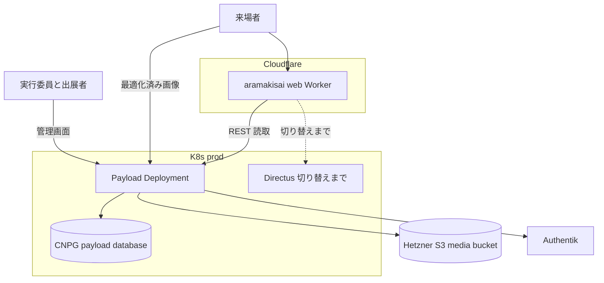
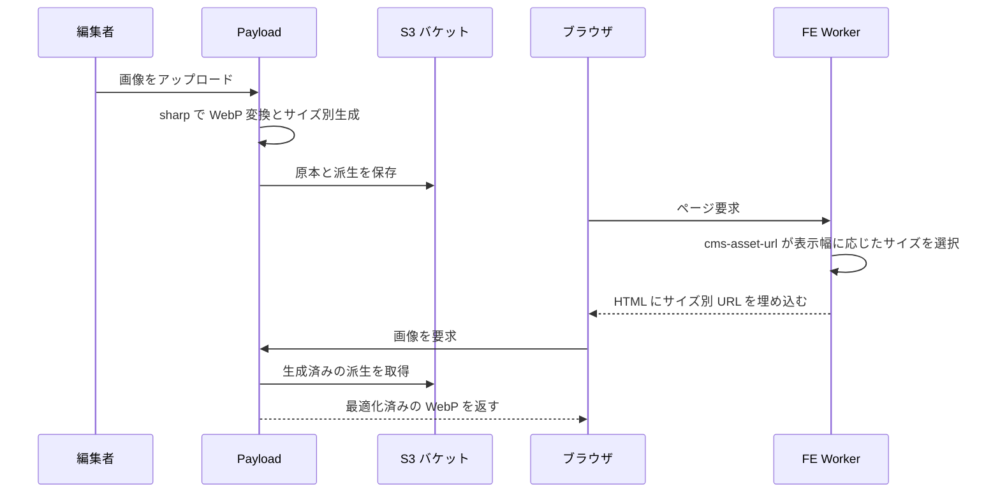
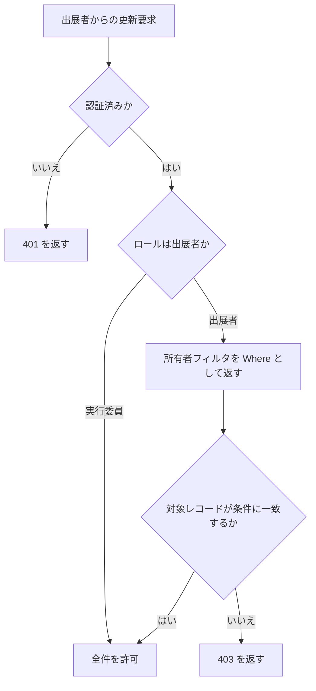
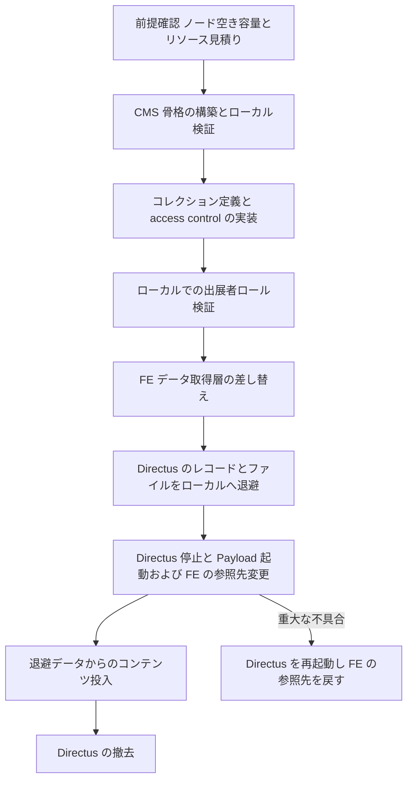

# Technical Design: payload-cms-migration

## Overview

**Purpose**: 荒牧祭サイトのヘッドレス CMS を Directus 12 から Payload 3 へ移行し、
出展者が自分の企画レコードだけを編集できる行レベル access control を、有償ライセンスなしで成立させる。

**Users**: 学生模擬店の担当者 (自企画の自己編集)、実行委員会メンバー (全コンテンツの管理)、
開発者 (コンテンツモデルの変更とデプロイ)、一般来場者 (公開サイトの閲覧)。

**Impact**: CMS は K8s 上に留まり、Directus の Deployment を Payload の Deployment が置き換える。
コンテンツモデルは YAML スナップショットから TypeScript 定義になり、
権限定義は knex マイグレーションから access control 関数になる。
画像はアップロード時に最適化して保存する方式を維持する。
フロントエンドの変更は `frontend/src/lib/` に閉じ、`src/components/` と `src/app/` は無改修とする。

### Goals

- 出展者ロールが自分の `student_exhibitions` レコードのみを編集できること (移行の主目的)
- 現行 16 コレクション / 100 フィールド / 22 リレーションを Payload 上に再現すること
- 公開サイトの表示内容と画像 URL の互換を維持し、停止時間を分単位に抑えること
- コンテンツモデルの変更を Git 管理下のレビュー可能な経路で本番へ反映できること
- Directus 稼働に伴う RBAC マイグレーション群を撤去すること
- 追加の月額課金を発生させずに上記を成立させること

### Non-Goals

- サイトの情報設計・デザイン・ページ追加といったコンテンツ側の変更
- Cloudflare Workers 上のフロントエンド配信構成そのものの変更
- 新規コレクション・新規フィールドの追加
- Directus 側の SSO ライセンス猶予切れへの対処 (本 spec の外で扱う)
- GraphQL API の提供。フロントエンドは REST しか使わないため、公開する API を REST に限定する
- リアルタイム更新機能そのものの実装 (`aramakisai-web#53` 駐車場空き情報 / `#54` デジタルサイネージ)。
  本 spec は移行のみを扱う。ただし移行先の選定がこれらの実現手段を塞がないことは
  Platform Constraints で検証する

## Boundary Commitments

### This Spec Owns

- `cms/` 配下の Payload アプリケーション定義一式 (コレクション定義、access control、認証、ストレージ設定)
- Payload が使用する Postgres データベース `payload` のスキーマとマイグレーション
- `frontend/src/lib/` 配下のデータ取得層と、CMS レスポンスからドメイン型への変換
- 画像 URL の組み立て規約 (`frontend/src/lib/` 内のアセット URL ビルダー)
- CMS のデプロイパイプラインと、コンテンツモデル変更の破壊的変更検出
- Directus 撤去の手順と、撤去に伴う `directus/` 配下および steering の更新
- **`aramakisai-infra` 側の CMS 稼働に必要な定義一式**。本 spec は `aramakisai-web` と
  `aramakisai-infra` の 2 リポジトリにまたがり、移行を一気通貫で完了させる責務を持つ
  - `gitops/manifests/prod/cms/` (Deployment / Service / ExternalSecret /
    マイグレーション適用 Job / CNPG のデータベース追加) と `gitops/apps/prod/cms.yaml`
  - `terraform/authentik_apps.tf` の Payload 用アプリケーション / プロバイダ定義と CMS 用グループ
  - `terraform/dns.tf` / `terraform/tunnel.tf` の `cms.aramakisai.com`、および
    `terraform/cloudflare_directus_assets.tf` に相当するメディア配信の Cache Rule と旧 URL リダイレクト規則
  - 監視・Falco 許可リストの Directus から Payload への差し替え
  - 撤去フェーズにおける上記 Directus 側定義の削除

### Out of Boundary

- `frontend/src/components/` および `frontend/src/app/` の表示ロジック
  (`home-page-expansion` / `page-home-friendly-editing` の所有領域。本 spec はドメイン型を不変に保つことで無改修とする)
- Cloudflare Workers 上のフロントエンド配信構成そのもの (`frontend-scaffold` / `cicd-pipeline` の所有領域)
- Cloudflare zone の Cache Rule のうち、メディア配信を対象としない既存ルール
  (ダッシュボードで作成済みの `Bypass AppFlowy APIs` 等)
- Authentik のフロー・ブランド・LDAP・登録導線など、Payload 用プロバイダ以外の既存定義
- `aramakisai-infra` のうち CMS と無関係なワークロード (mailserver / vaultwarden / room-presence 等)
- Directus の SSO ライセンス猶予、および `LOG_LEVEL` / `NODE_DEBUG` の調査用設定の解除
- `additive-schema-check.yml` の停止解除判断 (本 spec と独立に扱う)

### Allowed Dependencies

- 既存 CNPG クラスタ `directus-db-1` — 新規データベース `payload` の作成先として利用してよい
- 既存の ArgoCD / K8s マニフェスト構成 — Payload 用の Application とマニフェスト群を
  同じ規約 (`gitops/apps/<env>/<name>.yaml` → `gitops/manifests/<env>/<name>/`) で追加する。
  既存ワークロードの定義は変更しない
- 既存の Cloudflare zone と cloudflared トンネル — CMS のホスト名とキャッシュ規則の追加先として利用してよい
- Infisical `prod` 環境 — シークレットの供給元。`.env` の作成は禁止
- 既存 Hetzner S3 バケット — メディアの保存先として再利用してよい。
  ただし CNPG の WAL アーカイブと restic バックアップを兼ねる非公開バケットであり、公開してはならない
- 既存のコンテナレジストリ — Payload のイメージ push 先として利用してよい
- 既存の Authentik — 出展者アカウントの払い出しとパスワード設定フローが実装済み。そのまま利用する。
  Payload 用の OIDC プロバイダとグループの追加は本 spec が行う

**依存してはならないもの**: 新たな月額課金を伴うサービスおよびプラン
(Cloudflare Workers Paid、Hyperdrive、Payload Cloud、Images Paid を含む)。

依存の向きは **Types → CollectionConfig → AccessPolicy → CmsApp → HTTP → CmsClient → UI** の一方向とする。
UI から CMS の内部型を直接参照してはならない。

### Revalidation Triggers

- `frontend/src/lib/home-page-types.ts` のドメイン型が変わったとき
  → `home-page-expansion` / `page-home-friendly-editing` / `sitemap-schema-review` は表示側の追従を再確認する
- 画像 URL の組み立て規約が変わったとき → 画像を描画する全コンポーネントと Cache Rule を再確認する
- Payload のコレクション名・フィールド名が変わったとき → データ取得層と CI の破壊的変更検出を再確認する
- CMS のホスト名 (`cms.aramakisai.com`) が変わったとき → `src/env.ts` の環境変数と Cloudflare の Cache Rule を再確認する
- 稼働先が K8s から変わったとき → `aramakisai-infra` のマニフェストと監視対象を再確認する
- Directus の撤去を実行したとき → `directus-schema-sync.yml` / `additive-schema-check.yml` を所有する
  `cicd-pipeline` / `additive-only-schema-check` は自 spec の前提が消えたことを再確認する

## Architecture

### Existing Architecture Analysis

現行は Next.js を Cloudflare Workers に載せ、K8s 上の Directus を REST で参照する構成である。
本移行にあたり以下の既存構造を前提とする。

- **維持する境界**: `frontend/src/lib/home-page-types.ts` のドメイン型が CMS と UI の境界になっている。
  各 `lib/*.ts` が CMS の生レスポンスをドメイン型へ変換するため、UI 層は CMS のレスポンス形状を知らない。
  この境界を維持することで Requirement 7.2 / 7.7 を構造的に満たす。
- **維持する統合点**: 環境変数は `src/env.ts` の zod スキーマ経由のみ。デプロイは `@opennextjs/cloudflare`。
  シークレットは Infisical。テストは対象と同階層の `*.test.ts(x)`。
- **解消する技術的負債**: `directus/migrations/` の 14 本中 12 本を占める RBAC マイグレーション群。
  Directus 12 の無償ライセンスがこれらを無言で無効化しており、機能していない設定が Git 上に残っている。
- **回避する制約**: prod-node-1 のメモリ実測 81% (空き 1.2Gi)。Payload を Workers に載せることで
  K8s の常駐プロセスを増やさず、この制約を迂回する。
- **現行の実態**: 画像は S3 (非公開) に原本のまま保存され、
  Directus が `/assets/<uuid>?format=webp&width=N` のリクエストごとに変換して返している。
  Cloudflare の Cache Rule が 30 日キャッシュしているが、変換の負荷は単一 pod の Directus が負っている。
- **切り替える方式**: アップロード時に最適化して保存し、配信時の変換をなくす。
  CMS が K8s 上の Node ランタイムで動くため `sharp` が使える。
  配信時変換をやめる方針は `aramakisai-infra` 側にも記録されている。

### Architecture Pattern & Boundary Map



**Architecture Integration**:

- **Selected pattern**: レイヤード + アダプタ。Payload のコレクション定義を単一の権威とし、
  access control とストレージをアダプタとして差し替え可能に保つ。
  詳細な選定経緯と却下した 3 案は `research.md` の Architecture Pattern Evaluation を参照。
- **Domain boundaries**: CMS の内部型は Worker 境界を越えない。FE 側は `lib/*.ts` の変換関数で
  ドメイン型に落としてから UI に渡す。UI 層とコンテンツモデルの間に直接依存を作らない。
- **Existing patterns preserved**: `src/env.ts` 経由の環境変数参照、`@opennextjs/cloudflare` によるデプロイ、
  Infisical によるシークレット注入、同階層テスト配置、`*.workflow.test.ts` による CI 構造テスト。
- **New components rationale**: `cms/` は Next のバージョンが FE と独立に決まる (Payload 3.88.0 の
  公式テンプレートは Next 16.3.0、FE の実インストールは 15.5.19) ため、`frontend/` と同居できず独立させる。
  稼働先は K8s とする。Cloudflare Workers 上の Payload は Workers Paid プランを必須とし、
  「追加の有償プランを契約しない」という制約に反するため採用しない (詳細は Platform Constraints)。
  `AssetUrlBuilder` は変換の主体が CMS から配信層へ移ることで、URL 組み立て規約が新しい契約になるため独立させる。
- **Steering compliance**: `.env` を作らず Infisical を使う。コンテンツモデルは Git 管理下に置く。
  K8s 上のマニフェストは `aramakisai-infra` が所有し、ArgoCD が適用する既存経路に載せる。
  Edge Runtime 制約は FE 側にのみ適用され、CMS は Node ランタイムで動く。

### Technology Stack

| Layer | Choice / Version | Role in Feature | Notes |
|-------|------------------|-----------------|-------|
| Frontend | Next.js 15.5.19 + React 19 | 公開サイト。改修は `src/lib/` に限定 | バージョン変更なし |
| CMS | Payload 3.88.0 + Next.js 16.3.0 | 管理画面と REST API | Payload 3.88.0 の公式テンプレートが持つ組み合わせを固定する。FE とは別バージョンになる |
| Backend Runtime | Node.js 20.9+ / K8s Deployment | CMS の実行環境 | Directus の Deployment を置き換える。追加課金なし |
| Data | Postgres 16 (CNPG) データベース `payload` | Payload のスキーマとコンテンツ | 既存 Directus のテーブルには触れない |
| Data Access | `@payloadcms/db-postgres` | クラスタ内から Postgres への直接接続 | 同一 namespace 内のためトンネルもプロキシも不要 |
| Media Storage | Hetzner S3 (`@payloadcms/storage-s3`) | 原本と最適化済み派生の保存 | 既存バケットを再利用する |
| Image Processing | `sharp` (Payload の `imageSizes`) | アップロード時の WebP 変換とリサイズ | K8s の Node ランタイムで動く。配信時変換は行わない |
| Auth | Payload Custom Strategy + Authentik OIDC | 実行委員と出展者の認証 | OSS 版で完結。既存の Authentik 資産をそのまま使う |
| Secrets | Infisical `prod` | 接続情報と鍵の供給 | `.env` は guard stub のまま |
| CI/CD | GitHub Actions + `@opennextjs/cloudflare` | ビルド・マイグレーション・デプロイ | ArgoCD は CMS では使わない |

### Platform Constraints

移行のために新たな月額課金を発生させないことが制約である。
この制約が稼働先の選定を決定づける。

#### Cloudflare Workers を CMS の稼働先としない理由

| 項目 | 無料プラン | 有料プラン | 判定 |
|------|-----------|-----------|------|
| Worker バンドルサイズ | 3 MiB (gzip 後) | 10 MiB | Payload は公式に有料プラン必須と表明しており、無料枠に収まる保証がない |
| Startup CPU time | 1 秒 | 1 秒 | 差はない |
| CPU time / リクエスト | 10 ミリ秒 | 既定 30 秒 | CMS の書き込み処理には無料枠では足りない |

Payload の公式ドキュメントは Cloudflare Workers へのデプロイについて
「サイズ制限のため現時点では Workers Paid でのみデプロイできる」と明記している。
無料枠の 3 MiB に収まるかは実測しなければ分からず、外れた場合は稼働先ごと作り直しになる。
**確実に成立する K8s 構成を採る。**

これにより Hyperdrive と Cloudflare Tunnel を経由する DB 接続も不要になる。
Payload は Directus と同じ namespace 内から CNPG へ直接接続する。

#### K8s 側の制約 (実測値)

- `prod-node-1` は単一ノード。allocatable は CPU 3800m / メモリ 6958Mi
- 実測 CPU 36% / **メモリ 81% (5686Mi)**。空きは約 1.2 Gi
- Directus 本体の実測消費は 208Mi。撤去すれば戻る
- Payload (Next.js + sharp) の常駐は 512Mi〜1Gi 規模と見込まれる

**空き容量から、Directus と Payload の並行稼働は成立しない。**
Requirement 9 の段階移行は採らず、一括で切り替える。
移行対象が 5 行 + 9 ファイルと極小であるため、事前にコンテンツを再投入しておけば
切り替え時の停止時間は FE のデプロイ時間のみに収まる。

#### 画像の配信時変換を採らない理由

Cloudflare の Image Transformations は月 5,000 unique transformations まで無料で利用でき、
任意幅の要求を配信時に満たせる。それでもこの方式を採らない。

配信時変換はキャッシュに乗るまで毎回変換のラウンドトリップが発生し、
キャッシュミス時の転送量と読み込み時間が増える。
本サイトの画像は 9 件で用途別のサイズも限られるため、
アップロード時に必要なサイズを生成しておくほうが配信経路が単純で速い。
CMS が K8s 上の Node ランタイムで動くため `sharp` が使え、この方式を選べる。

#### 無料枠のまま使える Cloudflare 機能

- **Durable Objects** — SQLite バックエンドのものが無料プランで利用でき、ストレージ課金も発生しない。
  将来のリアルタイム要求 (下記) に対する余地がこれで確保される

#### 将来のリアルタイム要求に対する余地

`aramakisai-web#53` は「Cloudflare Workers はリアルタイム更新に対応してないかも」という懸念を挙げているが、
実際には Workers はこの用途を標準機能で持ち、しかも無料枠で使える。
移行先の選定がこれらの要求を塞がないことを以下で確認する。

- **Durable Objects + WebSocket** が Cloudflare におけるリアルタイムの標準解であり、
  SQLite バックエンドのものは無料プランで利用できる
- **WebSocket Hibernation API** により、接続を維持したままオブジェクトを休止させられる。
  デジタルサイネージのように「常時接続・低頻度更新」の用途に向く
- 想定される結線は、Payload の `afterChange` フックから FE 側 Worker の Durable Object を呼び出し、
  接続中のクライアントへ配信する形になる。CMS が K8s 上にあっても成立する
- ただし **更新頻度が分単位であれば定期取得で十分**であり、最初から WebSocket を導入する必要はない。
  Durable Objects は要求が実際に定期取得で賄えなくなった時点で追加する

いずれも本 spec のスコープ外だが、**稼働先の選定がこれらの実現を妨げないことは確認済み**である。

## File Structure Plan

### Directory Structure

```
cms/
├── src/
│   ├── payload.config.ts       Payload 本体設定。DB/ストレージ/認証/コレクションの結線
│   ├── collections/            コレクション定義。1 コレクション 1 ファイル
│   │   ├── student-exhibitions.ts
│   │   ├── announcements.ts
│   │   └── ...                 残り 13 コレクションも同一パターン
│   ├── globals/                シングルトン定義
│   │   ├── festival-meta.ts
│   │   └── page-home.ts
│   ├── access/                 access control 関数群
│   │   ├── roles.ts            ロール判定の述語
│   │   └── own-record.ts       所有者フィルタを返す Where ビルダー
│   ├── auth/
│   │   └── strategy.ts         Authentik OIDC の Custom Strategy
│   ├── hooks/
│   │   └── constraints.ts      CHECK 制約と複合 UNIQUE の代替バリデーション
│   └── migrations/             Payload が生成する DB マイグレーション
├── next.config.ts
├── Dockerfile                  K8s へ載せるコンテナイメージ
└── package.json                Next は Payload 対応レンジに固定する

frontend/src/lib/
├── cms.ts                      Payload REST クライアント。directus.ts を置換
├── cms-asset-url.ts            サイズ別 URL の選択。directus-asset-url.ts を置換
└── home-page-types.ts          ドメイン型。変更しない
```

`aramakisai-infra` 側に新規追加するもの (既存 `directus/` の構成をパターンの基準とする):

```
gitops/
├── apps/
│   └── prod/cms.yaml           ArgoCD Application。path は gitops/manifests/prod/cms
└── manifests/
    └── prod/cms/
        ├── deployment.yaml     Payload コンテナ。イメージは GHCR から取得
        ├── service.yaml
        ├── external-secret.yaml    Infisical → Secret。ESO が生成
        ├── db-init-job.yaml    payload データベースを作る一度きりの Job (PreSync)。
        │                        CNPG 1.23.3 には Database CRD が無く、既存クラスタへの
        │                        データベース追加を宣言的に書けないため psql で作る
        └── migrate-job.yaml    PreSync フック。Deployment 更新前に payload migrate を実行

terraform/
├── authentik_apps.tf           Payload 用 OIDC プロバイダ / アプリケーションと CMS 用グループを追加
├── dns.tf                      cms.aramakisai.com のレコードを追加
├── tunnel.tf                   ingress 規則に CMS の Service を追加
└── cloudflare_cms_assets.tf    メディア配信の Cache Rule と旧 asset URL のリダイレクト規則
```

マイグレーションは Directus の PostSync とは逆に **PreSync** で適用する。
Payload は起動時にスキーマの存在を前提とするため、Deployment 更新より前に適用しなければならない。

コレクション定義は 1 ファイル 1 コレクションで揃え、`student-exhibitions.ts` をパターンの基準とする。
`*_files` 中間テーブルは Payload の `upload` フィールドの hasMany で表現するため、独立したファイルを作らない。

### Modified Files

- `frontend/src/lib/announcements.ts` / `topics.ts` / `home-page.ts` / `festival-meta.ts` / `sns-links.ts` / `static-page.ts`
  — 取得先を Payload REST へ変更。ドメイン型への変換関数のシグネチャは維持する
- `frontend/src/env.ts` — `NEXT_PUBLIC_DIRECTUS_URL` を `NEXT_PUBLIC_CMS_URL` へ置換
- `frontend/package.json` — `@directus/sdk` を削除
- `.github/workflows/` — `cms-ci.yml` を追加、`directus-schema-sync.yml` を撤去
- `directus/` — Directus 撤去時に削除
- `.kiro/steering/product.md` / `tech.md` / `structure.md` — Directus 記述を Payload 構成へ更新
- `aramakisai-infra` の `gitops/helm-values/prod/falco.yaml` — 許可リストに Payload のイメージリポジトリを追加
- `aramakisai-infra` の `terraform/uptimerobot.tf` / `healthchecksio.tf` — 監視対象を Payload の URL へ差し替え

### 削除されるもの

- `directus/migrations/` の RBAC マイグレーション 12 本 (`*-rbac-*.js`)
- `frontend/src/lib/directus.ts` / `directus-asset-url.ts`
- `.github/workflows/directus-schema-sync.yml` / `additive-schema-check.yml` および対応する `*.workflow.test.ts`
- `frontend/scripts/check-additive-schema.ts`
- `aramakisai-infra` の `gitops/apps/{prod,staging}/directus.yaml` /
  `gitops/apps/staging/directus-schema-preview-appset.yaml` /
  `gitops/manifests/{prod,staging}/directus/` 一式
- `aramakisai-infra` の `terraform/cloudflare_directus_assets.tf` と、
  Directus 専用のホスト名 / トンネル ingress 規則 / Authentik プロバイダ定義

## Local Development Environment

Requirement 1.2 の検証と認証連携の試行はローカルで行う。
CMS は K8s 上の Node ランタイムで動くため、ローカルでも Node で動かせば挙動が一致する。
Workers 構成を採らないことで、ランタイムの差異を気にする必要がなくなった。

| 要素 | ローカルでの扱い | 本番との差 |
|------|------------------|-----------|
| ランタイム | Node.js 20.9+ で `next dev` または本番相当のビルド | 差はない |
| Postgres | `docker compose` でローカル Postgres 16 | 差はない。既存 `directus/docker-compose.yaml` と同じ方式 |
| メディア | S3 互換のローカルバケット、または本番バケットの読取 | 差はない |
| 画像変換 | `sharp` がローカルでも動く | 差はない |
| 認証 | 既存 Authentik にローカル用リダイレクト URI を追加登録 | 差はない |
| Cloudflare Access | 動作しない | 管理画面の前段保護はローカルでは検証できない |

**Authentik 連携の検証**: 既存の `idp.aramakisai.com` に、ローカルのリダイレクト URI を追加登録する方式を採る。
ローカルに Authentik を立てる方式は server / worker / redis / postgres の 4 コンポーネントを要し、
プロバイダ設定を本番と一致させる手間が実 IdP を使う場合より大きい。
リダイレクト URI の追加は `aramakisai-infra` の Terraform 側の変更になる。

**シークレットの扱い**: 接続情報は Infisical から取得し、シェルの環境変数として渡す。
`.env` は guard stub であり、上書きしてはならない。

## System Flows

### 画像配信



最適化はアップロード時に一度だけ行い、配信時には変換を挟まない。
配信経路にキャッシュミス時の変換ラウンドトリップが発生しないため、転送量と読み込み時間を抑えられる。
生成に失敗した画像は原本のまま保存し、警告を記録してアップロード自体は完了させる (Requirement 6.4)。
画像の公開ホストは CMS 用に新設する。S3 バケットは CNPG の WAL アーカイブと restic バックアップを
兼ねる非公開バケットであり、直接公開しない。配信は CMS を経由し、Cloudflare の Cache Rule で長期キャッシュする。

移行前に生成された `api.aramakisai.com/assets/<uuid>` 形式の URL は、
Cloudflare の Redirect Rule で新 URL へ 301 リダイレクトする。
この URL を組み立てているのはフロントエンドのアセット URL ビルダーのみで、
データベースに保存された値ではない。フロントエンドを差し替えた時点で新規の生成は止まるため、
リダイレクトが必要なのは外部にキャッシュまたは共有された URL に限られる。

### 出展者による自企画編集の認可



一覧取得の場合、`Where` はクエリにマージされ、条件に一致しないレコードはそもそも結果に含まれない。
単一レコードの更新の場合は条件不一致が 403 になる。両者は同じ `Where` ビルダーから導出する。

## Requirements Traceability

| Requirement | Summary | Components | Interfaces | Flows |
|-------------|---------|------------|------------|-------|
| 1.1-1.5 | 移行方式の選定と記録 | 本 design.md / `research.md` | — | — |
| 1.6-1.7 | 稼働先のリソース判定 | Platform Constraints | — | Migration Strategy |
| 1.8 | 期限内完了の判定 | Migration Strategy | — | Migration Strategy |
| 2.1-2.4 | 出展者の自企画のみ編集 | AccessPolicy | `AccessPolicy` | 認可フロー |
| 2.5 | 有償ライセンス不要 | AccessPolicy | — | — |
| 2.6 | 挙動の自動テスト | AccessPolicy | — | Testing Strategy |
| 3.1 | 実行委員の全権限 | AccessPolicy | `AccessPolicy` | 認可フロー |
| 3.2-3.3 | 外部 IdP 連携 | AuthStrategy | `AuthStrategy` | — |
| 3.4-3.5 | 未認証時の挙動 | AccessPolicy | `AccessPolicy` | 認可フロー |
| 3.6 | ロール定義のコード管理 | CollectionConfig / AccessPolicy | — | — |
| 4.1-4.4 | コンテンツモデルの移植 | CollectionConfig | `CollectionRegistry` | — |
| 4.5 | CHECK と複合 UNIQUE の維持 | ConstraintHooks | `ConstraintHook` | — |
| 4.6 | 定義の Git 管理と型の共有 | CollectionConfig | `CollectionRegistry` | — |
| 5.1-5.6 | 既存データの移行 | Migration Strategy | — | Migration Strategy |
| 6.1, 6.6 | メディアの移送と検証 | MediaStorage | `MediaStorage` | Migration Strategy |
| 6.2 | 旧 URL の互換 | AssetUrlBuilder | `AssetUrlBuilder` | 画像配信 |
| 6.3-6.4 | アップロード時の最適化と失敗時の扱い | MediaStorage | `MediaStorage` | 画像配信 |
| 6.5 | 表示幅に応じた画像 | AssetUrlBuilder | `AssetUrlBuilder` | 画像配信 |
| 7.1, 7.3-7.4, 7.6 | データ取得層の差し替え | CmsClient | `CmsClient` | — |
| 7.2, 7.5, 7.7 | 表示内容とエラー処理の維持 | CmsClient | `CmsClient` | Error Handling |
| 8.1-8.2, 8.5 | 2 環境稼働とシークレット | DeployPipeline | — | — |
| 8.3-8.4 | 破壊的変更の検出 | SchemaChangeGate | `SchemaChangeGate` | — |
| 8.6 | 監視 | DeployPipeline | — | Error Handling |
| 8.7-8.8 | 旧 CI の撤去と運用手順 | DeployPipeline | — | — |
| 9.1-9.3 | Directus から Payload への切り替え | Migration Strategy | — | Migration Strategy |
| 10.1-10.5 | Directus の廃止 | Migration Strategy | — | Migration Strategy |

## Components and Interfaces

| Component | Domain/Layer | Intent | Req Coverage | Key Dependencies | Contracts |
|-----------|--------------|--------|--------------|------------------|-----------|
| CmsApp | CMS Runtime | Payload 本体の結線と Worker としての起動 | 1.6, 1.7, 8.1 | CollectionConfig (P0), MediaStorage (P0) | Service |
| CollectionConfig | CMS Domain | 16 コレクションとグローバルの定義 | 4.1-4.4, 4.6, 3.6 | — | State |
| AccessPolicy | CMS Domain | ロール判定と行レベルフィルタ | 2.1-2.6, 3.1, 3.4-3.6 | CollectionConfig (P0) | Service |
| ConstraintHooks | CMS Domain | CHECK と複合 UNIQUE の代替検証 | 4.5 | CollectionConfig (P0) | Service |
| AuthStrategy | CMS Domain | Authentik OIDC を認証の一次経路とする | 3.2, 3.3 | Authentik (P0) | Service |
| MediaStorage | CMS Adapter | アップロード時の最適化と保存 | 6.1, 6.3, 6.4, 6.6 | S3 バケット (P0) | Service |
| CmsClient | Frontend | Payload REST 参照とドメイン型への変換 | 7.1-7.7 | CmsApp (P0) | Service |
| AssetUrlBuilder | Frontend | サイズ別 URL の選択と旧 URL 互換 | 6.2, 6.5 | MediaStorage (P0) | Service |
| SchemaChangeGate | CI | コンテンツモデルの破壊的変更検出 | 8.3, 8.4 | CollectionConfig (P0) | Batch |
| DeployPipeline | CI | ビルド・マイグレーション・デプロイ | 8.1, 8.2, 8.5-8.8 | CmsApp (P0) | Batch |

### CMS Domain

#### AccessPolicy

| Field | Detail |
|-------|--------|
| Intent | ロールに応じて真偽値または行レベルの絞り込み条件を返す |
| Requirements | 2.1, 2.2, 2.3, 2.4, 2.5, 2.6, 3.1, 3.4, 3.5, 3.6 |

**Responsibilities & Constraints**

- コレクション単位・操作単位の可否判定を単一の場所に集約する
- 出展者ロールに対しては `student_exhibitions` でのみ所有者フィルタを返し、
  他のコレクションへの書き込みは拒否する。実行委員ロールに対しては無条件許可を返す
- 未認証のリクエストに対しては、公開状態による絞り込みを返して公開済みのレコードのみを見せる。
  現行はこの絞り込みをフロントエンド側のクエリで行っているため、
  CMS 側で絞るのは移行で新たに増える挙動である
- ロールの定義は TypeScript の判別可能な文字列ユニオンとして持ち、管理画面での手動設定に依存しない
- 不変条件: 出展者ロールが自分以外のレコードへ到達する経路を作らない。
  一覧取得と単一レコード操作は同一の条件ビルダーから導出する
- 既定は拒否とし、明示的に許可した組み合わせのみを通す

**Dependencies**

- Inbound: CmsApp — コレクション定義への結線 (P0)
- Outbound: CollectionConfig — 所有者フィールドを持つコレクションの定義 (P0)

**Contracts**: Service [x]

##### Service Interface

```typescript
type CmsRole = 'executive' | 'student_exhibitor';

interface CmsUser {
  readonly id: string;
  readonly role: CmsRole;
}

/** 所有者フィールドを持つコレクション。現時点では 1 つだけ。 */
type OwnedCollection = 'student_exhibitions';

/** 公開状態フィールドを持つコレクション。未認証の読取をここで絞る。 */
type PublishableCollection =
  | 'announcements'
  | 'topics'
  | 'student_exhibitions'
  | 'sponsors'
  | 'pages';

type OwnerFilter = { readonly owner: { readonly equals: string } };
type PublishedFilter = { readonly publishedAt: { readonly lessThanEqual: string } };

/** 書き込み系: 所有者による絞り込みは所有者フィールドを持つコレクションだけが返せる。 */
type WriteAccess<K> = K extends OwnedCollection ? boolean | OwnerFilter : boolean;

/** 読取系: 公開状態による絞り込みも返せる。 */
type ReadAccess<K> =
  | WriteAccess<K>
  | (K extends PublishableCollection ? PublishedFilter : never);

interface AccessPolicy {
  canRead<K extends keyof CmsCollections>(user: CmsUser | null, collection: K): ReadAccess<K>;
  canCreate<K extends keyof CmsCollections>(user: CmsUser | null, collection: K): boolean;
  canUpdate<K extends keyof CmsCollections>(user: CmsUser | null, collection: K): WriteAccess<K>;
  canDelete<K extends keyof CmsCollections>(user: CmsUser | null, collection: K): WriteAccess<K>;
}
```

読取と書き込みで返せる絞り込みの種類を分ける。
所有者による絞り込みは所有者フィールドを持つコレクションだけが返せ、
公開状態による絞り込みは公開状態フィールドを持つコレクションだけが返せる。
将来ほかのコレクションを出展者に開放する場合は `OwnedCollection` に追加し、
そのコレクションへ所有者フィールドを足す。

- Preconditions: `user` は認証済みセッションから復元されたものであり、`role` は必ず既知の値をとる
- Postconditions: 出展者ロールかつ `student_exhibitions` に対する更新・削除は必ず `OwnerFilter` を返す。
  それ以外のコレクションに対する書き込みは `false` を返す
- Invariants: 同一の `user` と `collection` に対して同じ結果を返す。外部 I/O を行わない

**Implementation Notes**

- Integration: Payload のコレクション定義の `access` に各メソッドを結線する
- Validation: `OwnerFilter` を返しうるのは `student_exhibitions` に対する操作のみ。
  所有者フィールドを持たないコレクションへ適用されないことを型で保証する
- Validation: `PublishedFilter` を返しうるのは公開状態フィールドを持つコレクションのみ。
  公開状態を持たないマスタ系へ適用されないことを型で保証する
- Risks: Access Operation 経由の評価では `Where` が実行されず権限なしとして扱われるため、
  管理画面の一覧表示可否が意図と異なる可能性がある。実機で確認する

#### CollectionConfig

| Field | Detail |
|-------|--------|
| Intent | 現行スキーマ相当のコンテンツモデルを TypeScript として定義する |
| Requirements | 3.6, 4.1, 4.2, 4.3, 4.4, 4.6 |

**Responsibilities & Constraints**

- 14 コレクション + 2 グローバルを定義する。現行の `*_files` 中間テーブル 4 件は
  `upload` フィールドの hasMany として表現し、独立したコレクションを作らない
- シングルトン (`festival_meta`, `page_home`) は Payload の global として定義する
- 必須・選択肢・既定値は Payload のフィールド設定で表現する
- 所有者フィールドを持つのは、学生団体が編集しうる `student_exhibitions` のみとする。
  他のコレクションは実行委員だけが編集するため所有者を持たない
- 生成された型をフロントエンドから参照可能な形で公開する

**Dependencies**

- Inbound: CmsApp (P0), AccessPolicy (P0), ConstraintHooks (P0), SchemaChangeGate (P0)

**Contracts**: State [x]

##### State Management

- State model: コレクション定義は静的な宣言であり、実行時に変化しない
- Persistence & consistency: 定義の変更は Payload のマイグレーションとして生成され、Git 管理下に置く
- Concurrency strategy: 該当なし

**Implementation Notes**

- Integration: 1 コレクション 1 ファイルとし、`payload.config.ts` で集約する
- Validation: 現行 `snapshot.yaml` の 16 コレクション / 100 フィールド / 22 リレーションとの対応表を
  移行時のチェックリストとして残す
- Risks: `student_exhibitions` の `category` は現行で `json` + 複数選択ドロップダウンとして定義されており、
  Payload の対応するフィールド型を実装時に確認する必要がある

#### ConstraintHooks

| Field | Detail |
|-------|--------|
| Intent | Payload に対応概念のない CHECK 制約と複合 UNIQUE を代替手段で維持する |
| Requirements | 4.5 |

**Responsibilities & Constraints**

- 現行 `20260701A-performance-slots-check.js` の CHECK 制約と
  `20260701B-composite-unique-constraints.js` の複合 UNIQUE に相当する検証を提供する
- 検証は書き込み前に実行し、違反時は保存を中断する
- DB レベルの制約が必要な場合は Payload のマイグレーション内で直接定義する

**Dependencies**

- Inbound: CollectionConfig (P0)

**Contracts**: Service [x]

##### Service Interface

```typescript
type ConstraintViolation = {
  readonly field: string;
  readonly message: string;
};

interface ConstraintHook<TDoc> {
  validate(doc: TDoc): readonly ConstraintViolation[];
}
```

- Preconditions: `doc` は Payload のフィールドバリデーション通過後の値である
- Postconditions: 違反が空配列でない場合、呼び出し側は保存を中断する
- Invariants: 副作用を持たない

**Implementation Notes**

- Integration: Payload の `beforeValidate` フックに結線する
- Validation: 現行 migration が表現している条件を移植し、同じ入力で同じ判定になることをテストで確認する
- Risks: アプリケーション層の検証は直接 DB を書き換えた場合に迂回される。
  Directus 撤去までの期間に直接 DB を触る作業がある場合は注意が必要

#### AuthStrategy

| Field | Detail |
|-------|--------|
| Intent | Authentik を認証の一次経路とし、IdP の識別情報をロール付きセッションへ写像する |
| Requirements | 3.2, 3.3 |

**Responsibilities & Constraints**

- Authentik の OIDC を認証の既定経路とする。ローカル認証は実行委員の緊急用としてのみ残す
- 外部 IdP から受け取った識別情報を `CmsUser` へ写像する
- IdP のグループとロールの対応をコードとして持つ
- 出展者アカウントの払い出しとパスワード設定は Authentik 側の既存フローが担う。
  CMS はアカウントを発行せず、メール送信の責務も持たない

**Dependencies**

- Outbound: AccessPolicy — 確立したセッションのロールを渡す (P0)
- External: Authentik — OIDC プロバイダ (P0)

**Contracts**: Service [x]

##### Service Interface

```typescript
type ExternalIdentity = {
  readonly subject: string;
  readonly email: string;
  readonly groups: readonly string[];
};

interface AuthStrategy {
  resolveUser(identity: ExternalIdentity): CmsUser | null;
}
```

- Preconditions: `identity` は IdP の検証済みトークンから抽出されたものである
- Postconditions: 既知のグループに一致しない場合は `null` を返し、セッションを確立しない
- Invariants: グループとロールの対応はコード上の静的な写像であり、実行時に変更されない

**Implementation Notes**

- Integration: Payload の Custom Strategy として登録する
- Integration: `aramakisai-infra` には出展者ユーザーの自動払い出し、パスワード設定フロー、
  リカバリ用サービスアカウントが Authentik 上に実装済みである。CMS はこれを前提とし、
  独自のアカウント発行やメール送信を実装しない
- Validation: グループ名の対応表は現行の `AUTH_AUTHENTIK_ROLE_MAPPING` を出発点とする
- Risks: コミュニティの OIDC プラグインを使う場合、保守状況を実装直前に再確認する。
  保守が滞っている場合は Custom Strategy を自前で実装する

### CMS Adapter

#### MediaStorage

| Field | Detail |
|-------|--------|
| Intent | アップロード時に画像を最適化し、原本と派生を外部ストレージへ保存する |
| Requirements | 6.1, 6.3, 6.4, 6.6 |

**Responsibilities & Constraints**

- アップロード時に WebP へ変換し、`imageSizes` に定義した用途別サイズを生成する
- 生成に失敗した場合は原本を保持したままアップロードを完了させ、警告を記録する
- 既存の Hetzner S3 バケットを再利用し、Directus が保存したファイルと同居させる
- ファイル件数と合計サイズを移行前後で比較できる形で保持する
- 配信時の変換は行わない。生成済みの派生をそのまま配信する

**Dependencies**

- External: Hetzner S3 — 原本と派生の保存先 (P0)
- External: `sharp` — 変換とリサイズの実体 (P0)

**Contracts**: Service [x]

**Implementation Notes**

- Integration: `@payloadcms/storage-s3` を使い、接続情報は Infisical から注入する。
  `sharp` を Payload の設定に渡して `imageSizes` を有効にする
- Validation: 移行後に原本 9 件・合計 56MB との一致を確認する。派生はこの件数に含めない
- Risks: Directus が使うキー空間と衝突しないよう、Payload 側は別プレフィックスを使う
- Risks: 変換は CMS の CPU とメモリを使う。アップロードは低頻度だが、
  大きな画像の連続投入時にリソース requests を超えないことを確認する

### Frontend

#### CmsClient

| Field | Detail |
|-------|--------|
| Intent | Payload の REST API を参照し、ドメイン型へ変換する |
| Requirements | 7.1, 7.2, 7.3, 7.4, 7.5, 7.6, 7.7 |

**Responsibilities & Constraints**

- `frontend/src/lib/` の既存関数のシグネチャと戻り値の型を維持する
- CMS のレスポンス型は Payload が生成する型 (`Config`) から導出し、`any` を使わない。
  コレクション名からフィールド名と戻り値の型が導かれるため、取り違えが型検査で捕まる
- エンドポイントは `src/env.ts` の zod スキーマ経由で参照する
- FE は Workers 上で動くため、Node 専用 API に依存せず `fetch` のみで実装する
- 参照失敗時のふるまい (エラーページ表示・部分的な描画継続) を現行と揃える

**Dependencies**

- Inbound: `src/app/` 配下のページ (P0)
- Outbound: CmsApp — REST 参照 (P0)

**Contracts**: Service [x]

##### Service Interface

```typescript
import type { Config } from '@/cms-types';

type CmsCollections = Config['collections'];
type CmsGlobals = Config['globals'];

type CmsListResponse<T> = {
  readonly docs: readonly T[];
  readonly totalDocs: number;
};

type CmsFetchError =
  | { readonly kind: 'not_found' }
  | { readonly kind: 'unauthorized' }
  | { readonly kind: 'network'; readonly status: number };

type CmsResult<T> =
  | { readonly ok: true; readonly value: T }
  | { readonly ok: false; readonly error: CmsFetchError };

type CmsQuery<K extends keyof CmsCollections> = {
  readonly where?: CmsWhere<CmsCollections[K]>;
  readonly sort?: readonly `${'-' | ''}${Extract<keyof CmsCollections[K], string>}`[];
  readonly limit?: number;
  readonly depth?: number;
};

interface CmsClient {
  findMany<K extends keyof CmsCollections>(
    collection: K,
    query: CmsQuery<K>,
  ): Promise<CmsResult<CmsListResponse<CmsCollections[K]>>>;

  findById<K extends keyof CmsCollections>(
    collection: K,
    id: CmsCollections[K]['id'],
  ): Promise<CmsResult<CmsCollections[K]>>;

  findGlobal<K extends keyof CmsGlobals>(slug: K): Promise<CmsResult<CmsGlobals[K]>>;
}
```

`CmsWhere<T>` は対象コレクションのフィールド名と演算子に限定した条件式の型とする。
定義が長くなるため詳細は実装時に `frontend/src/lib/cms.ts` へ置き、
ここでは「コレクション名からフィールド名が導出される」という契約のみを固定する。

- Preconditions: エンドポイント URL は `env` の検証を通過している
- Postconditions: 呼び出し側はドメイン型に変換してから UI へ渡す。CMS の生の型を UI へ漏らさない
- Invariants: 未認証で到達できるのは公開済みコンテンツの読取のみ
- Invariants: コレクション名と戻り値の型が型レベルで対応する。
  呼び出し側が型引数で対応を指定できてはならない

**Implementation Notes**

- Integration: 既存の変換関数 (`mapAnnouncement` 等) を再利用し、入力側の型だけ差し替える
- Validation: 既存の `src/lib/*.test.ts` と `src/components/*.test.tsx` を無改修で通すことを合格条件とする
- Risks: 現行の deep-fields 指定は Directus の記法に依存しており、`any` キャストが 1 箇所残っている
  (`announcements.ts` の `ANNOUNCEMENT_FIELDS`)。Payload の `depth` パラメータで置き換えることで解消する
- Integration: Payload の型生成物を FE から参照できるよう、`cms/` の生成型を
  `frontend/src/cms-types.ts` として取り込む経路を用意する。生成のタイミングは CI で担保する

#### AssetUrlBuilder

| Field | Detail |
|-------|--------|
| Intent | 表示幅に応じて生成済みサイズを選び、移行前 URL との互換を保つ |
| Requirements | 6.2, 6.5 |

**Responsibilities & Constraints**

- 指定された表示幅を満たす最小の生成済みサイズを選ぶ。どのサイズも満たさない場合は最大サイズを返す
- 幅の指定がない場合は既定サイズを返す
- 現行 `toAssetUrl` と同じシグネチャを保ち、呼び出し側 4 ファイルを無改修にする
- 移行前に発行された `/assets/<uuid>` 形式の URL を新 URL へ 301 で誘導する

**Dependencies**

- Outbound: MediaStorage — 生成済みサイズの一覧 (P0)

**Contracts**: Service [x]

##### Service Interface

```typescript
interface AssetUrlBuilder {
  toAssetUrl(fileId: string | null, width?: number): string | null;
}
```

- Preconditions: `fileId` が `null` の場合は `null` を返す
- Postconditions: 返す URL は生成済みの派生を指す。原本の URL を直接露出しない
- Invariants: 同じ入力に対して同じ URL を返す

**Implementation Notes**

- Integration: `frontend/src/lib/cms-asset-url.ts` として `directus-asset-url.ts` を置換する
- Integration: 旧 URL の 301 は Cloudflare の Redirect Rule に置く。
  FE Worker には旧ホスト宛のリクエストが到達しないため、FE 側のルートでは実現できない
- Validation: 既存の `directus-asset-url.test.ts` を移植し、幅あり・幅なし・`null` の 3 ケースを維持する。
  加えて「どのサイズも満たさない幅」のケースを追加する
- Risks: 旧 URL のリダイレクトには Directus のファイル UUID と Payload のファイル識別子の対応表が必要。
  対象は 9 件のため静的な対応表で足りる
- Risks: `imageSizes` に定義しない幅を FE が要求すると、意図より大きい画像が配信される。
  FE が現在使っている幅を洗い出してから `imageSizes` を決める

### CI

#### SchemaChangeGate

| Field | Detail |
|-------|--------|
| Intent | コンテンツモデル定義の破壊的変更を PR 上で機械検出する |
| Requirements | 8.3, 8.4 |

**Responsibilities & Constraints**

- base と head のコレクション定義を比較し、フィールド削除・型変更・必須化を検出する
- 検出時はフロントエンド側の対応がデプロイ済みであることの確認を要求する
- 検出ロジックは `frontend/scripts/` の既存パターンに倣い TypeScript として実装し、テストを持つ

**Dependencies**

- Inbound: DeployPipeline (P0)
- Outbound: CollectionConfig — 比較対象 (P0)

**Contracts**: Batch [x]

##### Batch / Job Contract

- Trigger: `cms/src/collections/**` または `cms/src/globals/**` を変更した PR
- Input / validation: base と head の 2 つのコレクション定義集合
- Output / destination: 検出結果を PR のステータスチェックとして報告する
- Idempotency & recovery: 同じ入力に対して同じ結果を返す。再実行で副作用を持たない

**Implementation Notes**

- Integration: 現行 `check-additive-schema.ts` は YAML を比較しているため、TypeScript 定義の比較へ作り直す
- Validation: 対応する `*.workflow.test.ts` を追加する
- Risks: 現行の `additive-schema-check.yml` は `if: false` で停止したままであり、
  「既存の仕組みを引き継ぐ」のではなく実質的な新規実装になる

#### DeployPipeline

| Field | Detail |
|-------|--------|
| Intent | CMS のビルド・マイグレーション適用・デプロイを prod に対して行う |
| Requirements | 8.1, 8.2, 8.5, 8.6, 8.7, 8.8 |

**Responsibilities & Constraints**

- prod の 1 環境で CMS を稼働させる。staging は設けない
- `main` へのマージでマイグレーションを適用してからデプロイする
- シークレットは Infisical から注入し、`.env` を作らない
- CMS の異常を既存の監視経路で検知できるようにする

**Dependencies**

- Outbound: CmsApp — デプロイ対象 (P0)

**Contracts**: Batch [x]

##### Batch / Job Contract

- Trigger: `cms/**` を変更した PR (検証のみ) と `main` への push (適用とデプロイ)
- Input / validation: ビルド成果物と Payload のマイグレーションファイル
- Output / destination: prod 名前空間の `cms` Deployment (K8s)
- Idempotency & recovery: マイグレーションは適用済みのものを再適用しない。デプロイは同一成果物の再実行で結果が変わらない

**Implementation Notes**

- Integration: Directus と同じ GitOps 経路に載せる。コンテナイメージをビルドして
  `aramakisai-infra` のマニフェストを更新し、ArgoCD が適用する
- Integration: データベースは `payload` の 1 つ。環境の分岐を持たない
- Integration: staging と PR ごとのプレビュー環境は作らない。ノードの空きメモリが
  2 つ目の CMS を常駐させられず、CMS はデータベースを共有するためプレビュー単位の分離もできない。
  デプロイ前の検証はローカルの Postgres と `docker build` した本番同等イメージで行う
- Validation: `cms-ci.workflow.test.ts` でワークフロー構造を検証する
- Risks: Directus のスキーマ適用は ArgoCD の PostSync Job が担っていた。
  Payload では同じ経路にマイグレーション適用を載せ替える。Requirement 8.8 の文書化とセットで扱う

## Data Models

### Domain Model

ドメインの集約は現行 Directus のコレクション構成をそのまま引き継ぐ。

- `student_exhibitions` — 出展者が所有する唯一の集約。所有者フィールドを持つのはこの集約だけ
- `festival_meta` / `page_home` — 単一レコードのグローバル
- `announcements` / `topics` / `pages` / `sponsors` / `faq_items` — 実行委員が管理する独立した集約
- `stages` / `time_slots` / `map_areas` — マスタ。`performance_slots` が両者を参照する

不変条件:

- `student_exhibitions` のレコードは必ず 1 人の所有者を持つ。他の集約は所有者を持たない
- `performance_slots` は現行 CHECK 制約と同じ条件を満たす
- 現行の複合 UNIQUE に相当する組み合わせの重複を許さない

### Logical Data Model

- 中間テーブル 4 件 (`announcements_files` / `topics_files` / `page_home_files` / `student_exhibitions_files`) は
  Payload の `upload` フィールドの hasMany として表現し、リレーションの管理を Payload に委ねる
- リレーションの参照整合は Payload のリレーションフィールドが担う
- 所有者フィールドは `student_exhibitions` にのみ持たせる。
  他のコレクションに追加しないことで、現行スキーマとのモデル等価性を保つ
- 公開状態は、現行スキーマが公開日時フィールドを持つコレクションでそれを引き継ぐ。
  現行はフロントエンドが公開日時でクエリを絞っており、CMS 側の権限では絞っていない。
  移行後は CMS 側で絞るため、公開状態の判定基準をコレクションごとに定める

### Physical Data Model

- 配置先: 既存 CNPG クラスタ上の新規データベース `payload`
- テーブル定義は Payload のマイグレーションが生成する。手書きの DDL は CHECK 制約など
  Payload が表現できないものに限る
- Directus のデータベース `directus` には一切変更を加えない。撤去まで戻せる状態が保たれる

### Data Contracts & Integration

- FE と CMS の間は REST + JSON。FE 側は `CmsClient` の型で受け、ドメイン型へ変換してから UI へ渡す
- CMS の内部型を FE の UI 層へ漏らさないことを契約とする
- 画像は URL のみが契約であり、バイナリは Cloudflare の変換層を経由する

## Error Handling

### Error Strategy

CMS 参照の失敗は FE 側で吸収し、ページ全体の描画を止めないことを原則とする。
現行の挙動 (エラーページ表示・部分的な描画継続) を維持する。

### Error Categories and Responses

- **User Errors (4xx)**: 未認証は 401 を返し管理画面のログインへ誘導する。
  権限不足は 403。存在しないレコードは 404 とし、FE 側は `null` を返して該当セクションを非表示にする
- **System Errors (5xx)**: CMS への到達失敗は FE 側でエラーページに落とす。
  一覧取得の失敗は空配列として扱い、他セクションの描画を継続する
- **Business Logic Errors (422)**: `ConstraintHooks` の違反はフィールド単位のメッセージとして返す

### Monitoring

- CMS は K8s 上で動くため、Directus と同じ監視経路 (netdata / falco) が適用される
- falco のルールはイメージリポジトリ単位の許可リストになっているため、Payload 用のエントリ追加が必要
- Directus は upstream の公開イメージを使っていたが、Payload は自前ビルドしたイメージを
  コンテナレジストリへ push する構成になる。脆弱性の追随責任が自分たちに移る
- 監視対象の Deployment 名の差し替え先は `error-monitoring` spec の所有領域と調整する

## Testing Strategy

### Unit Tests

- `AccessPolicy` — 出展者ロールが自分のレコードにのみ到達すること、他者のレコードで拒否されること
- `AccessPolicy` — 未認証で公開済みコンテンツのみ読めること
- `ConstraintHooks` — 現行 CHECK 制約と同じ入力で同じ判定になること
- `AssetUrlBuilder` — 幅あり・幅なし・値なし・どのサイズも満たさない幅の 4 ケース
- `AuthStrategy` — 既知のグループがロールへ写像されること、未知のグループでセッションを確立しないこと
- `CmsClient` の変換関数 — 既存の `src/lib/*.test.ts` を無改修で通すこと

### Integration Tests

- 出展者ロールでの一覧取得・更新・他者レコードへの更新試行の一連 (Requirement 2.6 に対応)
- Authentik 経由のログインからレコード保存までの往復
- 画像アップロード時の最適化と、フロントエンドが選ぶサイズ別 URL からの取得まで
- マイグレーション適用後にコレクション定義と DB スキーマが一致すること

### E2E/UI Tests

- トップページの表示が移行前と同一であること
- お知らせ一覧と詳細の表示
- 静的ページの表示
- 移行前 URL でのアクセスが新 URL へリダイレクトされること

## Security Considerations

- 出展者ロールは `student_exhibitions` 以外への書き込みを一切持たない。
  これは AccessPolicy の既定を「拒否」とし、明示的に許可した組み合わせのみを通すことで担保する
- DB は外部公開しない。CMS は同一 namespace 内から接続し、クラスタ外への経路を新設しない
- 管理画面の保護は Payload の認証で担保する。Requirement 3.4 が求めるのはこの一層である。
  現行の `api.aramakisai.com` は Cloudflare Access の対象外であり、
  CMS の新ホストへ Access を被せる場合は出展者を Access 側でも通す設計が別途必要になる。
  本 spec ではこれを前提にしない
- シークレットは Infisical から注入し、リポジトリに `.env` を作らない
- Directus を撤去するまでは両者の認証情報が並存する。
  Directus 撤去時に不要になった認証情報の扱いを Requirement 10.3 として決定する
- 出展者と実行委員の認証はいずれも Authentik に集約する。
  CMS 側でパスワードを保持するのは実行委員の緊急用アカウントに限る

## Performance & Scalability

- CMS はクラスタ内から Postgres へ直接接続する。接続プールは通常どおり利用できる
- 画像はアップロード時に一度だけ変換し、配信時には変換を挟まない。
  Cache Rule で長期キャッシュし、配信経路にラウンドトリップを増やさない
- Payload の常駐メモリは 512Mi〜1Gi を見込む。ノードの空きは Directus 撤去後で約 1.4Gi。
  リソース requests / limits を設定し、他のワークロードを圧迫しないようにする
- `sharp` の変換はアップロード時のみ CPU を使う。アップロードは低頻度であり定常負荷にはならない。
  大きな画像の連続投入時にリソース limits を超えないことを確認する
- 派生サイズの生成によりストレージ使用量が増える。現状 9 件・56MB に対し、
  サイズ定義の数だけ倍数で増える。S3 の従量課金への影響は小さい

## Migration Strategy



**一括で切り替える**: ノードの空きメモリが約 1.2 Gi しかなく、
Directus と Payload を同時に常駐させられない。Requirement 9 の段階移行は採らない。

**切り替えの手順**: 切り替え前に Directus のレコードとファイルをローカルへ退避しておき、
P5 で Directus の Deployment をスケールダウンし、Payload の Deployment をスケールアップしてから
FE をデプロイする。コンテンツは切り替え後の P6 で、退避データを見ながら管理画面へ投入する。
対象はファイル 9 件・56MB と、レコード (お知らせ 1・固定ページ 3) およびシングルトン 2 件。
FAQ・会場区画・ステージ・時間枠・パフォーマンス枠・学生企画はレコードが無いため対象外。
退避先は `cms/seed/` で git 管理外とする。

**停止時間**: Directus 停止から FE デプロイ完了までの数分。
本番サイトは custom domain 未接続であり、停止による外部影響は実質ない。

**戻し方**: Directus の Deployment をスケールアップし直し、FE の参照先を戻すデプロイを行う。
Directus の資産を削除するのは P7 であり、それ以前であればこの手段が使える。
Payload 用のデータベースは別に作るため、Directus 側のデータは移行作業中も一切変化しない。

**検証チェックポイント**:

- P1 — ローカルで管理画面と REST が動作し、Postgres への接続が確立すること
- P3 — 出展者ロールで他者レコードに到達できないことを統合テストで確認する
- PX — 退避したファイルが 9 件・56MB 揃っていることを確認する
- P5 — 主要ページの表示を確認する
- P6 — 退避データと投入結果の一致、および旧 URL のリダイレクトを確認する

**リソースの前提**: P0 で Payload の実メモリ消費を見積もり、
Directus 撤去後の空き (約 1.4 Gi) に収まることを確認する。
収まらない場合は、他のワークロードの整理かノードの増強が先行タスクになる。

## Open Questions / Risks

- Payload の実メモリ消費が未実測。Directus 撤去後の空き 1.4 Gi に収まるかを P0 で確認する。
  収まらない場合はノードの増強か他ワークロードの整理が先行する
- 管理画面の一覧表示で `Where` を返す access control がどう扱われるかを実機で確認する
- Authentik の Payload 用プロバイダ定義と、CMS 用グループの追加が `aramakisai-infra` 側の変更として必要
- メディア配信の新ホスト、Cache Rule の書き換え、旧 URL の Redirect Rule はいずれも
  `aramakisai-infra` 側の Terraform 変更になる
- `imageSizes` に定義するサイズは、FE の実測から `1920` / `960` / 無指定の 3 種で足りる
  (`app/page.tsx` が 1920、`about-section.tsx` が 960、`topic-card.tsx` と `attachment-gallery.tsx` は無指定)
- ローカル開発用の Authentik リダイレクト URI 追加も `aramakisai-infra` 側の Terraform 変更になる
- 画像は `/api/media/serve/:id/:size` の 302 を経て Payload 本体が配信するため、
  切り替え直後から Cache Rule (5.4) を入れるまでの間、全画像のバイトが単一 pod を通る。
  対象は 9 件・56MB で来場者数も限られるが、Cache Rule の投入は早いほうがよい
- 一括で切り替えるため、Directus 停止中は編集操作を受け付けられない。
  本番は custom domain 未接続であり影響は小さいが、実施タイミングは実行委員に周知する
