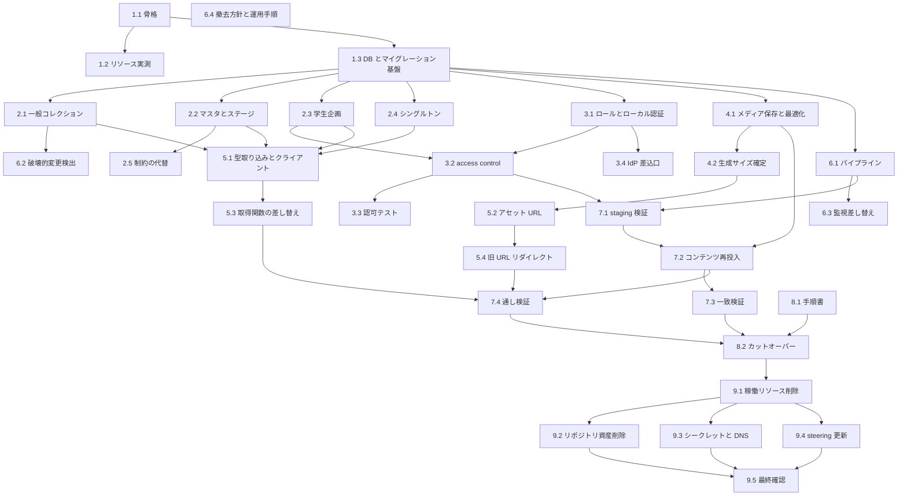

# Implementation Plan

## design フェーズで充足済みの要件

以下は成果物が `design.md` / `research.md` として既に存在するため、実装タスクを設けない。

- **1.1 / 1.3 / 1.5** — ホスティング・DB・メディア・認証・移行方式の選定結果と却下案は
  `design.md` の Architecture / Platform Constraints、および `research.md` の Design Decisions に記録済み。
  ダウンタイム見積りは Migration Strategy に記載済み。
- **1.2 / 1.4** — Cloudflare Workers 上での動作は実機検証せず、
  「Payload 公式が Workers Paid プランを必須と表明しており、無償プラン制約と両立しない」という理由と
  代替の判断根拠を Platform Constraints に明示した。1.4 の条件節に従った処理である。
- **1.8** — 作業項目と所要期間の見積りは Migration Strategy の段階分割と、
  本タスク一覧の粒度をもって満たす。

---

## 並行実装計画

タスクを並行実行する場合の実行単位を波として示す。同じ波のタスクは同時に着手してよい。
波をまたぐ場合は前の波の完了を待つ。`(P)` は「直前の同僚タスクと同時に走れる」ことを示すが、
実際にどこまで同時に走れるかは下表の波が正である。

### 依存グラフ

### 実行波

| 波 | 同時実行するタスク | 同時数 | 待ち合わせの理由 |
|----|-------------------|--------|------------------|
| 0 | 1.1 | 1 | すべての土台。ここだけは単独で終わらせる |
| 1 | 1.2, 1.3 | 2 | どちらも骨格の上で動く。互いに独立 |
| 2 | 2.1, 2.2, 2.3, 2.4, 3.1, 4.1 | 6 | **最も広がる波**。コレクション定義・ユーザー定義・メディア設定が並行する |
| 3 | 2.5, 3.2, 3.4, 4.2, 5.1, 6.1, 6.2 | 7 | 波 2 の成果それぞれに乗る。相互依存はない |
| 4 | 3.3, 5.2, 5.3, 6.3, 7.1 | 5 | 同上 |
| 5 | 5.4, 7.2 | 2 | 7.2 は staging 検証 (7.1) の後 |
| 6 | 7.3, 7.4 | 2 | どちらも再投入済みのデータを検証する |
| 7 | 8.2 | 1 | 本番の切り替え。単独で実行する |
| 8 | 9.1 | 1 | 稼働リソースの削除 |
| 9 | 9.2, 9.3, 9.4 | 3 | 撤去作業。リポジトリ・インフラ・steering で境界が分かれる |
| 10 | 9.5 | 1 | 撤去の最終確認 |

**波に属さないタスク**: 6.4 (撤去方針と運用手順) と 8.1 (カットオーバー手順書) は
他のタスクに依存しない。波 2 以降の任意のタイミングで進めてよい。
ただし 8.1 は波 7 の着手条件であり、それまでに完了している必要がある。

### 共有ファイルの競合と回避策

並行実装で唯一の実質的な競合点は **Payload の設定ファイル**である。
波 2 の 6 タスクすべてが、自分の定義を設定ファイルへ登録しようとして同じ行付近を編集する。

- **回避策**: 1.1 の時点で、コレクション定義とグローバル定義の登録口を空の状態で用意しておく。
  各タスクは自分の定義ファイルを新規作成し、登録口へ 1 行追加するだけにとどめる
- 各定義は 1 ファイル 1 コレクションとし、既存ファイルを書き換えない
- それでも登録口の行が競合しうるため、波 2 のマージは 1 タスクずつ順に行う

その他の共有点:

- `frontend/src/lib/` — 5.1 と 5.2 は別ファイル。5.3 のみ既存 6 ファイルを書き換えるため、
  5.1 の完了を待って単独で進める
- `.github/workflows/` — 6.1 と 6.2 は別ファイルを追加するため競合しない
- インフラ側リポジトリ — 3.4 (Authentik プロバイダ)、5.4 (DNS とリダイレクト規則)、
  6.1 (マニフェスト)、6.3 (監視とイメージ許可リスト)、9.3 (シークレットと DNS) が触る。
  3.4 と 6.1 は同じ波 3 に入るが、Authentik 定義と K8s マニフェストで対象ファイルが分かれる

### 並行実行時の運用

- 波 2 と波 3 のように 6 タスクが同時に走る場合、タスクごとに独立した作業ツリーを用意すると
  設定ファイルの競合を検出しやすい
- 各タスクは着手前に `_Depends:_` に挙がったタスクの完了を確認する
- 波の途中で 1.2 の判定が「収まらない」となった場合、波 2 以降を止めて
  ノードの容量確保を先行させる

---

- [ ] 1. 基盤構築
- [ ] 1.1 CMS アプリの骨格を構築しローカルで起動できるようにする
  - Payload が対応する Next バージョンを固定した独立アプリとして構成する
  - ローカル用の Postgres をコンテナで起動し、接続情報を Infisical 経由の環境変数として渡す
  - `.env` ファイルを作らずに起動できることを確認する
  - 後続の並行実装に備え、コレクション定義とグローバル定義の登録口を空の状態で用意しておく
  - ローカルで管理画面が開き、Postgres への接続が確立している
  - _Requirements: 8.5_

- [ ] 1.2 (P) Payload の常駐リソースを見積もりノード空き容量との適合を判定する
  - 骨格を起動した状態で、管理画面の操作時とアイドル時のメモリ / CPU を実測する
  - Directus 撤去後の空き容量 (約 1.4 Gi) に収まるかを判定する
  - 収まらない場合に取りうる選択肢 (他ワークロードの整理 / ノード増強) を洗い出す
  - 実測値と判定結果が記録され、後続タスクの着手可否が決まっている
  - _Requirements: 1.6, 1.7_
  - _Boundary: CmsApp_

- [ ] 1.3 (P) Payload 用データベースとマイグレーション基盤を用意する
  - 既存 CNPG クラスタ上に Payload 専用のデータベースを作成する
  - Directus 側のデータベースには一切変更を加えない
  - マイグレーションの生成と適用が繰り返し実行でき、適用済みのものが再適用されない
  - _Requirements: 8.2_
  - _Boundary: CmsApp のマイグレーション基盤_

- [ ] 2. コンテンツモデルの移植
- [ ] 2.1 (P) 実行委員が管理する一般コレクションを定義する
  - お知らせ・トピック・固定ページ・協賛企業・FAQ の 5 コレクションを定義する
  - 現行スキーマの必須・選択肢・既定値と同等の制約を適用する
  - 現行スキーマが持つ公開日時フィールドをそのまま引き継ぐ
  - 添付ファイルの関連は中間テーブルではなくアップロードフィールドの複数指定で表現する
  - 管理画面から 5 コレクションすべてのレコードを作成・編集できる
  - _Requirements: 4.1, 4.3, 4.4, 4.6_
  - _Boundary: CollectionConfig_

- [ ] 2.2 (P) 会場マスタとステージ系コレクションを定義する
  - ステージ・時間枠・会場区画のマスタと、それらを参照するパフォーマンス枠を定義する
  - 現行スキーマのリレーションの向きと多重度を再現する
  - パフォーマンス枠からステージと時間枠を参照して保存できる
  - _Requirements: 4.1, 4.3, 4.4, 4.6_
  - _Boundary: CollectionConfig_

- [ ] 2.3 (P) 学生企画コレクションを所有者フィールド付きで定義する
  - 現行スキーマの 16 フィールドと画像の複数指定を再現する
  - 所有者を保持するフィールドを追加する。他のコレクションには追加しない
  - レコード作成時に作成者が所有者として自動的に設定される
  - _Requirements: 4.1, 4.3, 4.4, 4.6_
  - _Boundary: CollectionConfig_

- [ ] 2.4 (P) シングルトンを定義する
  - 祭全体メタ情報とトップページの 2 つを単一レコードとして扱う構造で定義する
  - 現行の 14 フィールドと 3 フィールドを再現する
  - 管理画面から単一レコードとして編集でき、複数レコードが作られない
  - _Requirements: 4.2, 4.6_
  - _Boundary: CollectionConfig_

- [ ] 2.5 スナップショットで表現できない制約を代替手段で再現する
  - 現行 custom migration が持つパフォーマンス枠の条件検証を移植する
  - 現行の複合一意制約に相当する重複禁止を再現する
  - 現行 migration と同じ入力に対して同じ判定になることをテストで確認する
  - 制約違反の保存が中断され、違反フィールドが特定できるメッセージが返る
  - _Depends: 2.2_
  - _Requirements: 4.5_

- [ ] 3. 認証と認可
- [ ] 3.1 ロール定義とローカル認証を設定する
  - 実行委員ロールと出展者ロールをコード上の定義として持たせる
  - 管理画面上の手作業設定に依存せず、ロールがコードから決まることを確認する
  - ローカル認証は実行委員の緊急用としてのみ有効にする
  - ローカル認証でログインし、割り当てたロールがセッションに反映されている
  - _Requirements: 3.1, 3.6_

- [ ] 3.2 コレクション単位・操作単位の access control を実装する
  - 既定を拒否とし、明示的に許可した組み合わせのみを通す
  - 出展者ロールに対しては学生企画でのみ所有者による絞り込み条件を返す
  - 出展者ロールが他のコレクションへ書き込もうとした場合は拒否する
  - 未認証のリクエストには公開状態による絞り込みを返し、公開済みのレコードのみを見せる
  - 公開済みと見なす判定基準をコレクションごとに定める。
    現行はこの絞り込みをフロントエンド側のクエリで行っており、CMS 側で絞るのは新たに増える挙動である
  - 実行委員ロールで全コレクションの作成・読取・更新・削除ができる
  - _Depends: 2.3, 3.1_
  - _Requirements: 2.1, 2.2, 2.3, 2.4, 2.5, 3.1, 3.4, 3.5_
  - _Boundary: AccessPolicy_

- [ ] 3.3 access control の挙動を自動テストで検証する
  - 出展者ロールが自分のレコードを更新できることを検証する
  - 出展者ロールが他者のレコードを更新しようとして拒否されることを検証する
  - 出展者ロールの一覧取得に自分のレコードのみが含まれることを検証する
  - 許可されていないコレクションへの書き込みが権限エラーになることを検証する
  - 上記 4 ケースがテストとして実行でき、すべて成功する
  - _Requirements: 2.6_
  - _Boundary: AccessPolicy_

- [ ] 3.4 (P) Authentik OIDC を認証の一次経路として実装する
  - IdP から受け取った識別情報をユーザーとロールへ写像する経路を実装する
  - IdP のグループとロールの対応をコード上の静的な写像として持たせる
  - 既知のグループに一致しない場合はセッションを確立しない
  - 出展者アカウントの払い出しとパスワード設定は Authentik 側の既存フローに委ね、
    CMS 側でアカウント発行やメール送信を実装しない
  - Authentik 側に必要な Payload 用プロバイダ定義と CMS 用グループを洗い出す
  - 有償プランや追加契約なしに Authentik 経由でログインでき、対応するロールが付与される
  - _Depends: 3.1_
  - _Requirements: 3.2, 3.3_
  - _Boundary: AuthStrategy_

- [ ] 4. メディアの保存と最適化
- [ ] 4.1 アップロード時の画像最適化とストレージ保存を設定する
  - 既存の外部ストレージバケットを保存先とし、接続情報を Infisical から注入する
  - アップロード時に WebP へ変換し、用途別サイズを生成する
  - 生成に失敗した場合は原本を保持したままアップロードを完了させ、警告を記録する
  - Directus が使うキー空間と衝突しないプレフィックスを使う
  - 画像をアップロードすると原本と用途別サイズがバケットに保存される
  - _Requirements: 6.1, 6.3, 6.4_
  - _Boundary: MediaStorage_

- [ ] 4.2 生成する画像サイズを確定し設定に反映する
  - フロントエンドが指定している幅は実測済みで 1920 / 960 / 無指定の 3 種
  - この 3 種を賄う用途別サイズを設定に反映する
  - 定義した各サイズが実際に生成されることを確認する
  - _Depends: 4.1_
  - _Requirements: 6.3, 6.5_
  - _Boundary: MediaStorage_

- [ ] 5. フロントエンドのデータ取得層の差し替え
- [ ] 5.1 (P) 型定義の取り込みと CMS クライアントを実装する
  - CMS が生成する型をフロントエンドから参照できる経路を用意し、生成を CI で担保する
  - コレクション名から戻り値の型が導出されるクライアントを実装する
  - エンドポイントは環境変数スキーマ経由で参照し、`process.env` を直接参照しない
  - Node 専用 API に依存せず動作する
  - コレクション名を取り違えた呼び出しが型検査で検出される
  - _Depends: 2.1, 2.2, 2.3, 2.4_
  - _Requirements: 7.1, 7.3, 7.4, 7.6_
  - _Boundary: CmsClient_

- [ ] 5.2 (P) 表示幅に応じたアセット URL の組み立てを実装する
  - 指定された表示幅を満たす最小の生成済みサイズを選ぶ
  - どのサイズも満たさない場合は最大サイズを返す
  - 幅の指定がない場合は既定サイズを返す
  - 現行の呼び出しシグネチャを保ち、呼び出し側 4 ファイルを無改修にする
  - 幅あり・幅なし・値なし・どのサイズも満たさない幅の 4 ケースがテストで検証される
  - _Depends: 4.2_
  - _Requirements: 6.2, 6.5_
  - _Boundary: AssetUrlBuilder_

- [ ] 5.3 データ取得関数の参照先を差し替える
  - 既存 6 ファイルの取得先を CMS へ変更し、ドメイン型への変換関数のシグネチャを維持する
  - 現行の deep-fields 指定に残る型キャストを解消する
  - 取得失敗時のエラーページ表示と部分的な描画継続を現行と同等に保つ
  - Directus SDK への依存を削除する
  - 既存のコンポーネントテストとロジックテストが無改修で通る
  - _Depends: 5.1_
  - _Requirements: 7.1, 7.2, 7.5, 7.7_
  - _Boundary: CmsClient_

- [ ] 5.4 移行前の画像 URL からのリダイレクトを設定する
  - 移行前のファイル識別子と移行後の識別子の対応表を作る。対象は 9 件
  - 旧ホストの旧パスへのアクセスを恒久リダイレクトで新 URL へ誘導する。
    設置場所はフロントエンドではなく配信基盤側のリダイレクト規則とする
  - 移行前の URL でアクセスすると同じ画像に到達する
  - _Depends: 5.2_
  - _Requirements: 6.2_
  - _Boundary: メディア配信のリダイレクト規則_

- [ ] 6. 運用基盤の整備
- [ ] 6.1 (P) CMS のビルドとマイグレーション適用のパイプラインを構築する
  - CMS の変更を含む PR で検証のみを行い、既定ブランチへのマージで適用とデプロイを行う
  - マイグレーションを適用してからデプロイする順序を保証する
  - シークレットを Infisical から注入し、`.env` を作らない
  - prod と staging の 2 環境それぞれに対して適用できる
  - ワークフローの構造がテストで検証される
  - _Depends: 1.3_
  - _Requirements: 8.1, 8.2, 8.5_
  - _Boundary: DeployPipeline_

- [ ] 6.2 (P) コンテンツモデルの破壊的変更を検出する仕組みを実装する
  - 変更前後のコレクション定義を比較し、フィールド削除・型変更・必須化を検出する
  - 検出時にフロントエンド側の対応がデプロイ済みであることの確認を要求する
  - 検出ロジックが単体テストを持ち、同じ入力に対して同じ結果を返す
  - 破壊的変更を含む PR でステータスチェックが失敗する
  - _Depends: 2.1_
  - _Requirements: 8.3, 8.4_
  - _Boundary: SchemaChangeGate_

- [ ] 6.3 監視対象を Payload へ差し替える
  - 既存の監視経路の対象を Directus の Deployment から Payload の Deployment へ変更する
  - イメージリポジトリ単位の許可リストに Payload 用のエントリを追加する
  - 自前ビルドしたイメージをレジストリへ push する経路と、更新の運用方針を決める
  - CMS の異常が既存の監視経路で検知できることを確認する
  - _Depends: 6.1_
  - _Requirements: 8.6_

- [ ] 6.4 旧ワークフローの扱いと非開発者向けの変更手順を定める
  - Directus 向けのスキーマ同期ワークフローと破壊的変更検出ワークフローの撤去時期を決める
  - 非開発者がコンテンツモデルの変更を要求してから本番へ反映されるまでの手順を文書化する
  - 現行 Directus では管理画面で完結していた操作のうち、開発者の介在が必要になるものを列挙する
  - 撤去対象と後継の対応関係が一覧として残っている
  - _Requirements: 8.7, 8.8_

- [ ] 7. staging 検証とコンテンツの再投入
- [ ] 7.1 staging へデプロイし出展者ロールを実機で検証する
  - staging 環境に CMS をデプロイする
  - 出展者ロールのアカウントで他者のレコードに到達できないことを実機で確認する
  - 管理画面の一覧表示で絞り込み条件がどう扱われるかを確認する
  - staging の管理画面にログインでき、ロールごとの見え方が期待どおりである
  - _Depends: 3.2, 6.1_
  - _Requirements: 2.1, 2.2, 2.3, 2.4, 8.1_

- [ ] 7.2 本番相当のコンテンツとメディアを再投入する
  - 再投入の前提として本番データベースのバックアップ取得を手順に明記する
  - 既存のレコード 5 件と画像 9 件を Payload 側へ投入する
  - 投入処理を繰り返し実行しても重複が生じないようにする
  - 投入中に変換失敗が発生した場合、対象を特定できる形で記録して中断する
  - Payload 側に本番相当のコンテンツが揃っている
  - _Depends: 4.1, 7.1_
  - _Requirements: 5.1, 5.4, 5.5, 5.6, 6.1_

- [ ] 7.3 移行元と移行先の一致を検証する
  - コレクション単位のレコード件数を比較する
  - リレーション参照が移行先で解決できることを確認する
  - ファイル件数と合計サイズを比較し、欠落がないことを確認する
  - 件数・リレーション・ファイルの 3 点について一致が確認できている
  - _Depends: 7.2_
  - _Requirements: 5.2, 5.3, 6.6_

- [ ] 7.4 主要な閲覧経路を通しで検証する
  - トップページ・お知らせ一覧と詳細・トピック・固定ページの表示を確認する
  - 移行前の画像 URL からのリダイレクトが機能することを確認する
  - 移行前と同一の表示内容が生成されることを確認する
  - 通しの検証がテストとして実行でき、すべて成功する
  - _Depends: 5.3, 5.4, 7.2_
  - _Requirements: 7.2_

- [ ] 8. カットオーバー
- [ ] 8.1 カットオーバー手順とロールバック手順を作成する
  - 実行順序・所要時間・担当・確認項目を含む手順を作る
  - Directus 停止から Payload 起動、フロントエンドのデプロイまでの順序を明記する
  - 不具合発覚時に Directus 構成へ復帰する手順を用意する
  - ロールバック可能な期間中は Directus のデータベースとメディアを削除しないことを明記する
  - 段階移行を採らない判断と、その場合の整合性の扱いを明記する
  - 手順書だけを見て第三者が実行と切り戻しの両方をたどれる
  - _Requirements: 9.1, 9.4, 9.5, 9.6_

- [ ] 8.2 カットオーバーを実行し稼働を確認する
  - 手順に従って Directus を停止し Payload を起動してフロントエンドを切り替える
  - 停止時間が事前の見積り範囲に収まることを確認する
  - 主要ページの表示と CMS の書き込みが正常であることを確認する
  - 本番のフロントエンドが Payload を参照して稼働している
  - _Depends: 7.3, 7.4, 8.1_
  - _Requirements: 9.2, 9.3_

- [ ] 9. Directus の撤去
- [ ] 9.1 稼働中の Directus 関連リソースを削除する
  - Deployment・スキーマ適用ジョブ・関連する設定リソースを削除する
  - 削除後もサイトと CMS が正常に稼働することを確認する
  - _Depends: 8.2_
  - _Requirements: 10.1_

- [ ] 9.2 (P) リポジトリ内の Directus 資産を削除する
  - スキーマスナップショットと custom migration のうち不要になったものを削除する
  - Directus 向けのスキーマ同期ワークフローと破壊的変更検出ワークフロー、および対応するテストを削除する
  - 削除後に既存のテストとビルドが通る
  - _Depends: 9.1_
  - _Requirements: 10.2, 8.7_
  - _Boundary: SchemaChangeGate, DeployPipeline_

- [ ] 9.3 (P) 不要になったシークレットと DNS レコードの扱いを決める
  - Directus 向けのシークレットのうち Payload で使わないものを特定する
  - Directus 用のホスト名の扱いを決めて反映する
  - 撤去対象と保持対象の一覧が残っている
  - _Depends: 9.1_
  - _Requirements: 10.3_
  - _Boundary: aramakisai-infra のシークレットと DNS 定義_

- [ ] 9.4 (P) steering の記述を Payload 構成へ更新する
  - プロダクト概要のドメインモデルと権限モデルの記述を更新する
  - 技術スタックの CMS・スキーマ運用・CI の記述を更新する
  - プロジェクト構造のディレクトリパターンと命名規則を更新する
  - steering の記述と実際の構成に差分がない
  - _Depends: 9.1_
  - _Requirements: 10.4_
  - _Boundary: steering_

- [ ] 9.5 撤去可否を最終確認する
  - Directus 側にしか存在しないデータまたは設定が残っていないかを確認する
  - 残存項目がある場合は撤去を保留し、内容を記録する
  - 撤去の完了、または保留と残存項目の記録のいずれかが確定している
  - _Depends: 9.2, 9.3, 9.4_
  - _Requirements: 10.5_
