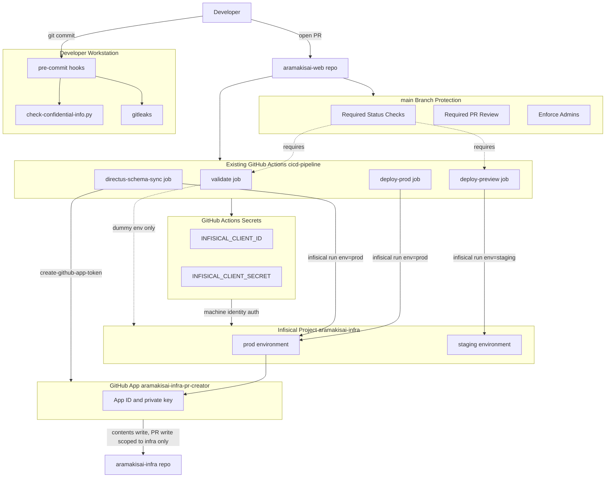

# Design Document — repo-governance

## Overview

**Purpose**: 本設計は `aramakisai-web` リポジトリの GitHub 設定（branch protection・Actions secrets）・Infisical シークレット登録・pre-commit フックを整備し、壊れたコードの main マージとシークレット未設定によるデプロイ失敗を防ぐ。
**Users**: `aramakisai-web` の開発者（PR マージ・pre-commit の恩恵を受ける）とインフラ管理者（GitHub App・Infisical secrets を登録・運用する）。
**Impact**: 現状 branch protection は PR レビューのみ強制され、ステータスチェックは未設定・admin bypass 可能。GitHub Actions secrets は未使用の `INFRA_GITHUB_TOKEN` のみで、`cicd-pipeline` が前提とする `INFISICAL_CLIENT_ID`/`INFISICAL_CLIENT_SECRET` は未登録（CI は secret 不足で失敗する状態）。Infisical `staging` 環境はシークレット 0 件（`deploy-preview` は確実に失敗する）。本設計はこれらのギャップを埋め、`cicd-pipeline` で実装済みの CI/CD が実際に動作する状態に到達させる。

### Goals
- `main` の branch protection を強化し、実装済み CI ジョブの合格と PR 経由のマージを admin 含め強制する。
- `cicd-pipeline` が前提とする GitHub Actions secrets（`INFISICAL_CLIENT_ID`/`INFISICAL_CLIENT_SECRET`）を登録し、不要になった `INFRA_GITHUB_TOKEN` を削除する。
- GitHub App（`aramakisai-infra` への PR 作成用）を最小権限で作成し、認証情報を Infisical に登録する。
- Infisical に不足しているシークレット（Cloudflare Account ID、frontend `NEXT_PUBLIC_*`、GitHub App 認証情報）を staging/prod 双方に登録し、CI/CD を実際に動作させる。
- Directus staging 用シークレットの Infisical 登録状態を検証し、`aramakisai-infra` の steering ドキュメントの記載漏れを修正する。
- `aramakisai-infra` と同等の pre-commit 保護（`check-confidential-info.py`）を `aramakisai-web` に導入する。

### Non-Goals
- `.github/workflows/*.yml` の trigger・ジョブ定義の変更（`cicd-pipeline` spec が所有）。ただし Risks & Revalidation Triggers に記載する前提条件を除く。
- GitHub チームメンバー管理・リポジトリ権限（ロール）設定。
- `aramakisai-infra` 側のインフラ設定（ClusterSecretStore・ExternalSecret 自体の変更）。既存の値の検証のみ行う。
- Terraform GitHub provider の導入。

## Boundary Commitments

### This Spec Owns
- `aramakisai-web` の `main` ブランチ branch protection 設定（`gh api` 経由）。
- `aramakisai-web` の GitHub Actions Secrets（`INFISICAL_CLIENT_ID`/`INFISICAL_CLIENT_SECRET` の登録、`INFRA_GITHUB_TOKEN` の削除）。
- GitHub App（`aramakisai-infra-pr-creator` 相当）の作成・インストール・Infisical への認証情報登録。
- Infisical 上のシークレット登録内容（staging/prod 双方の `NEXT_PUBLIC_*`・`CLOUDFLARE_ACCOUNT_ID`・GitHub App 認証情報、および Directus staging シークレットの登録状態検証）。
- `aramakisai-web/.pre-commit-config.yaml` の `check-confidential-info` local hook 追加、`aramakisai-web/scripts/check-confidential-info.py` の新規配置、`aramakisai-web/.devcontainer/Dockerfile` への `python3` 追加。
- `aramakisai-infra/.kiro/steering/tech.md` のシークレット一覧への `DIRECTUS_STAGING_*` 追記（ドキュメントのみ、infra 側の実体設定は変更しない）。

### Out of Boundary
- `aramakisai-web/.github/workflows/*.yml` の trigger・ジョブ実装（`cicd-pipeline` 所有）。ただし path filter に起因するブロッキング前提条件は本 spec の Revalidation Triggers に記録する。
- `aramakisai-infra` の ClusterSecretStore・ExternalSecret マニフェスト自体の変更（既に存在し、Infisical 側の値登録のみが本 spec のスコープ）。
- GitHub Organization 全体のメンバー・チーム権限設定。
- Directus staging 基盤（DB/Pod/Service）の構築・変更。

### Allowed Dependencies
- `cicd-pipeline` が実装済みの `.github/workflows/frontend-ci.yml` / `directus-schema-sync.yml` / `additive-schema-check.yml`（変更せず、ジョブ名・secret 参照を前提として読む）。
- 既存 Infisical プロジェクト（slug `aramakisai-infra`、`aramakisai-web`/`aramakisai-infra` 共有）と既存 `prod`/`staging` 環境。
- `aramakisai-infra/scripts/check-confidential-info.py`（コピー元）、`aramakisai-infra/.gitleaks.toml`（既に `aramakisai-web` に同等版が存在、rev 一致のみ確認）。
- GitHub REST API（`gh api` / `gh secret` / `gh api /orgs/.../apps` 相当の App 作成 UI）。

### Revalidation Triggers
- **`frontend-ci.yml` の `paths: frontend/**` trigger 変更**: 本 spec が必須ステータスチェックとして指定する `type-check / lint / test / build` と `deploy preview (Workers)` は、現状の path filter のままだと `frontend/**` を触らない PR で完了しない（research.md 参照）。`cicd-pipeline` 側でこの trigger が変更された場合、本 spec の branch protection 設定を再検証する。
- **`cicd-pipeline` のジョブ名変更**: `validate`/`deploy-preview`/`deploy-prod` の `name:` フィールドが変わると、branch protection の `required_status_checks.contexts` を追随修正する必要がある。
- **GitHub App の権限スコープ変更**: `aramakisai-infra` 以外のリポジトリへのアクセスが必要になった場合、App のインストール設定を見直す。
- **Infisical プロジェクト構成変更**: `aramakisai-web`/`aramakisai-infra` が別プロジェクトに分離された場合、`.infisical.json` の `workspaceId` と本設計のシークレット配置前提を再確認する。

## Architecture

### Existing Architecture Analysis

- **branch protection**: `required_pull_request_reviews`（`required_approving_review_count: 1`, `dismiss_stale_reviews: true`）が既に有効。`required_status_checks.contexts` は空、`enforce_admins.enabled` は `false`。→ 本設計は差分（ステータスチェック追加 + admin enforcement）のみを適用する。
- **GitHub Actions Secrets**: `INFRA_GITHUB_TOKEN` のみ登録済みだがどの workflow からも未参照（旧 PAT 方式の残骸）。3 つの workflow は全て `INFISICAL_CLIENT_ID`/`INFISICAL_CLIENT_SECRET` を前提に実装済み。→ 本設計は不足 secret の登録と不要 secret の削除を行う。
- **Infisical**: `aramakisai-web`/`aramakisai-infra` は単一プロジェクト（slug `aramakisai-infra`）を共有。`prod` 環境には Directus staging 用シークレット 4 種が既に登録済みだが GitHub App 認証情報・`CLOUDFLARE_ACCOUNT_ID`・frontend `NEXT_PUBLIC_*` は未登録。`staging` 環境はシークレット 0 件。→ 本設計は不足分のみを登録する（既存の値は変更しない）。
- **pre-commit**: `pre-commit-hooks`・`yamllint`・`gitleaks v8.23.0` は既に導入済み。`check-confidential-info` local hook のみ未導入。→ 本設計は local hook の追加とスクリプト配置に限定する。

### Architecture Pattern & Boundary Map

**Architecture Integration**:
- **Selected pattern**: 「既存設定への差分適用」— 新規アーキテクチャパターンの選定は不要。GitHub リポジトリ設定・Infisical シークレットストア・ローカル pre-commit フックの 3 系統に対する宣言的設定の追加・修正。
- **Domain/feature boundaries**: GitHub 設定（branch protection・Secrets・App）と Infisical シークレット登録は「CI/CD が参照する外部状態」として分離。pre-commit はリポジトリ内の開発者ローカル実行に閉じる。
- **Existing patterns preserved**: `gh` CLI ベースの手動/半自動設定（Terraform 不使用）、Infisical 単一プロジェクト SSoT、`aramakisai-infra` の pre-commit 構成パターン。
- **New components rationale**: GitHub App は `cicd-pipeline` が前提とする GitHub App 認証（`actions/create-github-app-token`）を実際に機能させるために新規作成が必要。
- **Steering compliance**: `aramakisai-web` に `.kiro/steering/` が存在しないため、CLAUDE.md の原則（Infisical SSoT、`.env` 不使用、additive-only スキーマルール）を参照点とする。



**Key Decisions**（図に表れない補足）:
- `ReqChecks` は `Validate`（`type-check / lint / test / build`）と `DeployPreview`（`deploy preview (Workers)`）の 2 つのみを要求する。`DeployProd`（`push:main` のみで発火）は PR ゲートに使えないため対象外（research.md #2）。
- `SchemaSync` は `push:main` でのみ発火し PR ゲートの対象ではないため `ReqChecks` からは意図的に除外している。

### Technology Stack

| Layer | Choice / Version | Role in Feature | Notes |
|-------|------------------|-----------------|-------|
| Repository Governance | GitHub REST API via `gh api` / `gh secret` / `gh api graphql` | branch protection・Actions secrets 設定 | Terraform 不使用（Adjacent expectations） |
| Cross-repo Auth | GitHub App + `actions/create-github-app-token@v1` | `aramakisai-infra` への最小権限書き込み | 既に `directus-schema-sync.yml` が前提として実装済み |
| Secret Store | Infisical（プロジェクト slug `aramakisai-infra`） | 全 secret/env の SSoT | `aramakisai-web`/`aramakisai-infra` 共有プロジェクト |
| Local Hooks | pre-commit v5.0.0 hooks + gitleaks v8.23.0 + Python 3（標準ライブラリのみ） | commit 前の機密情報検知 | `aramakisai-infra` と同一 gitleaks version、`check-confidential-info.py` は無変更コピー |

## File Structure Plan

### New Files
```
aramakisai-web/
├── scripts/
│   └── check-confidential-info.py   # aramakisai-infra/scripts/ から無変更コピー
```

### Modified Files
- `.pre-commit-config.yaml` — `repo: local` セクションに `check-confidential-info` hook を追加（既存の `pre-commit-hooks`/`yamllint`/`gitleaks` セクションは変更しない）。
- `.devcontainer/Dockerfile` — `python3` パッケージ追加（`uv` は追加しない。research.md「Design Decisions」参照）。
- （`aramakisai-infra` リポジトリ）`.kiro/steering/tech.md` — 「Infisical で管理するシークレット一覧」の Directus 箇条書きに `DIRECTUS_STAGING_*` 4 キーを追記。

> GitHub 側（branch protection・Actions secrets・GitHub App）と Infisical 側の変更はリポジトリにコミットされるファイルを伴わない外部状態変更であり、上記のファイル変更とは別に `gh api` / Infisical CLI 経由で適用する（tasks フェーズで具体化）。

## Requirements Traceability

| Requirement | Summary | Components | Interfaces | Flows |
|-------------|---------|------------|------------|-------|
| 1.1, 1.2, 1.4 | 必須ステータスチェック設定 | Branch Protection Configuration | GitHub REST API `PUT /repos/{owner}/{repo}/branches/main/protection` | — |
| 1.3, 1.5 | admin enforcement・PR 必須 | Branch Protection Configuration | 同上（`enforce_admins`, `required_pull_request_reviews`） | — |
| 2.1 | GitHub App 作成・Infisical 登録 | GitHub App Provisioning, Infisical Secret Registration | GitHub App 作成（手動）+ Infisical `POST /secrets` | GitHub App 発行 → Infisical 登録 |
| 2.2 | Actions secrets を 2 つに限定 | GitHub Actions Secrets Configuration | `gh secret set` / `gh secret delete` | — |
| 2.3 | 資格情報ローテーション | GitHub Actions Secrets Configuration | 同上（運用手順） | — |
| 2.4 | secret 値をコミットしない | 全コンポーネント共通制約 | — | — |
| 3.1–3.4 | Directus staging シークレット登録確認 | Infisical Secret Registration | Infisical CLI 参照確認（登録済み） | — |
| 3.5 | tech.md 記載更新 | Steering Documentation Update | Markdown 追記 | — |
| 3.6 | ExternalSecret Ready 検証 | Infisical Secret Registration | `kubectl get externalsecret` | — |
| 4.1–4.3, 4.5 | pre-commit 基本フック | Pre-commit Hook Suite | 既存 `.pre-commit-config.yaml`（変更不要、確認のみ） | — |
| 4.4, 4.6–4.9 | check-confidential-info local hook | Pre-commit Hook Suite | pre-commit local hook（`language: python`） | commit → hook 実行 → block/allow |

## Components and Interfaces

| Component | Domain/Layer | Intent | Req Coverage | Key Dependencies (P0/P1) | Contracts |
|-----------|--------------|--------|--------------|--------------------------|-----------|
| Branch Protection Configuration | GitHub Repo Settings | `main` の必須チェック・admin enforcement 設定 | 1.1–1.5 | `cicd-pipeline` ジョブ名 (P0) | API |
| GitHub Actions Secrets Configuration | GitHub Repo Settings | Infisical machine identity secret の登録・不要 secret 削除 | 2.2, 2.3, 2.4 | Infisical machine identity (P0) | API |
| GitHub App Provisioning | Cross-repo Auth | `aramakisai-infra` 限定の最小権限 App 作成 | 2.1 | GitHub Organization 設定 (P0) | API |
| Infisical Secret Registration | Secret Store | Cloudflare/GitHub App/frontend/Directus staging シークレットの登録・検証 | 2.1, 2.2, 3.1–3.4, 3.6 | Infisical Project (P0), ESO/ClusterSecretStore (P1) | API |
| Steering Documentation Update | Docs (`aramakisai-infra`) | シークレット一覧の記載同期 | 3.5 | Infisical Secret Registration (P1) | — |
| Pre-commit Hook Suite | Local Dev Tooling | commit 前の機密情報検知 | 4.1–4.9 | devcontainer Python3 (P0) | Batch |

### GitHub Repo Settings

#### Branch Protection Configuration

| Field | Detail |
|-------|--------|
| Intent | `main` ブランチで必須ステータスチェックと admin enforcement を有効化する |
| Requirements | 1.1, 1.2, 1.3, 1.4, 1.5 |

**Responsibilities & Constraints**
- `required_status_checks.contexts` に `type-check / lint / test / build` と `deploy preview (Workers)` の 2 件のみを設定する（`deploy prod (Workers)` は PR イベント非対象のため含めない）。
- `enforce_admins.enabled` を `true` に変更する。
- `required_pull_request_reviews` は既存設定（`required_approving_review_count: 1`, `dismiss_stale_reviews: true`）を維持する。
- `allow_force_pushes` / `allow_deletions` は既存の `false` を維持する（direct push 禁止の一部）。

**Dependencies**
- Inbound: なし（リポジトリ管理者が `gh api` で直接適用）
- Outbound: `cicd-pipeline` の `validate` / `deploy-preview` ジョブ名（P0、ジョブ名変更で追随修正が必要）
- External: GitHub REST API（P0）

**Contracts**: Service [ ] / API [x] / Event [ ] / Batch [ ] / State [ ]

##### API Contract
| Method | Endpoint | Request | Response | Errors |
|--------|----------|---------|----------|--------|
| PUT | `/repos/aramakisai/aramakisai-web/branches/main/protection` | `required_status_checks: {strict: false, contexts: ["type-check / lint / test / build", "deploy preview (Workers)"]}`, `enforce_admins: true`, `required_pull_request_reviews: {required_approving_review_count: 1, dismiss_stale_reviews: true}`, `restrictions: null` | 更新後の protection オブジェクト | 403 (権限不足), 422 (存在しない context 名を指定した場合) |

**Implementation Notes**
- Integration: `strict: false`（"Require branches to be up to date" 無効）を維持し、既存の運用（feature branch が古くてもチェックさえ通ればマージ可）を変えない。値を変える場合は別途合意が必要。
- Validation: 適用後に `gh api .../protection` で `contexts` と `enforce_admins.enabled` を再取得し反映確認する。
- Risks: Revalidation Triggers に記載の path filter 問題が解消される前に `enforce_admins: true` を適用すると、`frontend/**` 非依存 PR が admin でもマージ不能になる。適用順序は tasks.md で明示する。

#### GitHub Actions Secrets Configuration

| Field | Detail |
|-------|--------|
| Intent | `INFISICAL_CLIENT_ID`/`INFISICAL_CLIENT_SECRET` を登録し、未使用の `INFRA_GITHUB_TOKEN` を削除する |
| Requirements | 2.2, 2.3, 2.4 |

**Responsibilities & Constraints**
- 登録後、リポジトリの GitHub Actions secret は `INFISICAL_CLIENT_ID` と `INFISICAL_CLIENT_SECRET` の 2 件のみとする。
- 値はコマンドライン引数ではなく標準入力/ファイル経由で `gh secret set` に渡し、シェル履歴に残さない。
- Infisical machine identity のローテーション時は 24 時間以内に本 secret を更新する（2.3、運用手順としてドキュメント化）。

**Dependencies**
- Inbound: 3 つの既存 workflow（`frontend-ci.yml`, `directus-schema-sync.yml`）が `secrets.INFISICAL_CLIENT_ID`/`secrets.INFISICAL_CLIENT_SECRET` を参照（P0）
- Outbound: Infisical machine identity（Universal Auth）の client ID/secret（P0）
- External: なし

**Contracts**: Service [ ] / API [x] / Event [ ] / Batch [ ] / State [ ]

##### API Contract
| Method | Endpoint (gh CLI 相当) | Request | Response | Errors |
|--------|----------|---------|----------|--------|
| PUT | `gh secret set INFISICAL_CLIENT_ID` / `INFISICAL_CLIENT_SECRET` | secret 値（標準入力） | 204 | 403 (権限不足) |
| DELETE | `gh secret delete INFRA_GITHUB_TOKEN` | — | 204 | 404 (既に存在しない場合、冪等に無視) |

**Implementation Notes**
- Integration: 削除前に `grep -rn "INFRA_GITHUB_TOKEN" .github/` で未参照であることを再確認する（research.md #4 で確認済みだが、実施タイミングで再検証）。
- Validation: `gh secret list` で登録後の secret が 2 件ちょうどであることを確認する。
- Risks: 削除順序を誤ると（新 secret 登録前に旧 secret を消す）、既存 workflow が secret 不足で失敗する期間が生じる可能性があるが、`INFRA_GITHUB_TOKEN` は現在未参照のため実害はない。

#### GitHub App Provisioning

| Field | Detail |
|-------|--------|
| Intent | `aramakisai-infra` への PR 作成専用の最小権限 GitHub App を作成する |
| Requirements | 2.1 |

**Responsibilities & Constraints**
- App 名は `aramakisai-infra-pr-creator`（またはそれに準ずる名前）。
- 権限は `contents: write` と `pull-requests: write` のみ。
- インストール先リポジトリは `aramakisai-infra` のみに限定する。
- App ID・private key は GitHub Actions secret ではなく Infisical に `GH_APP_ID` / `GH_APP_PRIVATE_KEY` として登録する（`directus-schema-sync.yml` が `infisical run --env=prod` 経由でこの 2 キーを読む実装済み前提と一致させる）。

**Dependencies**
- Inbound: `directus-schema-sync.yml` の `Fetch GitHub App credentials from Infisical` ステップ（P0、既存実装が `GH_APP_ID`/`GH_APP_PRIVATE_KEY` という変数名を前提）
- Outbound: GitHub Organization の App 作成権限（P0）
- External: `actions/create-github-app-token@v1`（P1、workflow 側で使用、変更不要）

**Contracts**: Service [ ] / API [ ] / Event [ ] / Batch [ ] / State [ ]

**Implementation Notes**
- Integration: App 作成は GitHub Web UI での手動作業（Organization Settings → Developer settings → GitHub Apps）。作成後、秘密鍵をダウンロードし即座に Infisical へ登録、ローカルコピーは残さない。
- Validation: `directus/schema/snapshot.yaml` を変更するテスト PR を main にマージし、`directus-schema-sync` workflow が `aramakisai-infra` へ PR を正常に作成できることを確認する。
- Risks: 権限を Organization 全体に付与すると最小権限原則に反する。インストール時に必ずリポジトリを `aramakisai-infra` のみに限定する。

### Secret Store

#### Infisical Secret Registration

| Field | Detail |
|-------|--------|
| Intent | CI/CD が参照する不足シークレットを登録し、Directus staging シークレットの登録状態を検証する |
| Requirements | 2.1, 2.2, 3.1, 3.2, 3.3, 3.4, 3.6 |

**Responsibilities & Constraints**
- `staging` 環境に `NEXT_PUBLIC_DIRECTUS_URL`（`https://stg-api.aramakisai.com`）、`NEXT_PUBLIC_SITE_URL`（staging サイト URL）、`CLOUDFLARE_API_TOKEN`、`CLOUDFLARE_ACCOUNT_ID` を登録する（research.md #5: 現在 0 件）。
- `prod` 環境に `NEXT_PUBLIC_DIRECTUS_URL`（`https://api.aramakisai.com`）、`NEXT_PUBLIC_SITE_URL`（本番サイト URL）、`CLOUDFLARE_ACCOUNT_ID`、`GH_APP_ID`、`GH_APP_PRIVATE_KEY` を登録する（`CLOUDFLARE_API_TOKEN` は登録済み）。
- `DIRECTUS_STAGING_SECRET` / `DIRECTUS_STAGING_ADMIN_EMAIL` / `DIRECTUS_STAGING_ADMIN_PASSWORD` / `DIRECTUS_STAGING_DB_PASSWORD` は既に `prod` 環境に登録済みであることを確認済み（3.1–3.4 は登録作業不要、検証のみ）。
- `kubectl get externalsecret directus-staging-secrets -n staging` で `Ready` を確認する（3.6）。`Ready` でない場合、Infisical 側の値を再確認する。

**Dependencies**
- Inbound: `deploy-preview`/`deploy-prod` job（`NEXT_PUBLIC_*`, `CLOUDFLARE_*`）、`directus-schema-sync` job（`GH_APP_ID`/`GH_APP_PRIVATE_KEY`）、`aramakisai-infra` ClusterSecretStore（`DIRECTUS_STAGING_*`）— 全て P0
- Outbound: なし
- External: Infisical API（P0）

**Contracts**: Service [ ] / API [x] / Event [ ] / Batch [ ] / State [ ]

##### API Contract
| Method | Endpoint (Infisical CLI 相当) | Request | Response | Errors |
|--------|----------|---------|----------|--------|
| POST | `infisical secrets set <KEY>=<VALUE> --env=staging\|prod` | key/value | 作成/更新確認 | 401 (認証エラー), 409 (既存キーの扱いは上書き確認) |
| GET | `infisical secrets --env=staging\|prod` | — | 登録済みキー一覧（値は別途 `--plain` 等で取得） | — |

**Implementation Notes**
- Integration: 既存の `DIRECTUS_STAGING_*` 4 キーは値を変更せず、キー存在の確認のみ行う（誤って値を再生成しないよう注意）。
- Validation: 登録後 `deploy-preview` job を伴うテスト PR を作成し、build/preview デプロイが成功することを確認する。
- Risks: `staging`/`prod` 環境を取り違えて登録すると、staging ビルドに本番 Directus URL が混入するなどの事故につながる。登録前に environment 名を必ず確認する。

### Docs

#### Steering Documentation Update

| Field | Detail |
|-------|--------|
| Intent | `aramakisai-infra/.kiro/steering/tech.md` のシークレット一覧の記載漏れを修正する |
| Requirements | 3.5 |

**Responsibilities & Constraints**
- 「Infisical で管理するシークレット一覧」の Directus 箇条書きに `DIRECTUS_STAGING_SECRET`, `DIRECTUS_STAGING_ADMIN_EMAIL`, `DIRECTUS_STAGING_ADMIN_PASSWORD`, `DIRECTUS_STAGING_DB_PASSWORD` を追記する。
- この変更は `aramakisai-infra` リポジトリの PR として行う（`aramakisai-web` 側の変更ではない）。

**Implementation Notes**
- Integration: 既存の記載フォーマット（キー名のカンマ区切り列挙）に合わせる。
- Validation: 追記後、`aramakisai-infra` の該当箇所を diff で確認する。

### Local Dev Tooling

#### Pre-commit Hook Suite

| Field | Detail |
|-------|--------|
| Intent | commit 前に機密情報（絶対パス・非許可メールアドレス）を検知しブロックする |
| Requirements | 4.1, 4.2, 4.3, 4.4, 4.5, 4.6, 4.7, 4.8, 4.9 |

**Responsibilities & Constraints**
- `scripts/check-confidential-info.py` は `aramakisai-infra/scripts/check-confidential-info.py` から無変更でコピーする（4.9 の同期要件）。
- `.pre-commit-config.yaml` の `repo: local` セクションに以下の hook を追加する（既存の `pre-commit-hooks`/`yamllint`/`gitleaks` セクションは変更しない）:
  ```yaml
  - repo: local
    hooks:
      - id: check-confidential-info
        name: Check Confidential Info
        entry: python scripts/check-confidential-info.py
        language: python
        files: \.(ts|tsx|js|json|md|yaml|yml)$
        pass_filenames: true
  ```
- `.devcontainer/Dockerfile` に `python3` パッケージインストールを追加する（`uv` は追加しない。research.md「Design Decisions」参照）。
- `# confidential:allow`（コード）/ `<!-- confidential:allow -->`（Markdown）によるインライン bypass はスクリプト側で既に実装済みのため変更不要。

**Dependencies**
- Inbound: 開発者の `git commit` 操作（P0）
- Outbound: devcontainer の `python3` インタプリタ（P0、Dockerfile 変更が前提）
- External: なし（スクリプトは標準ライブラリのみ）

**Contracts**: Service [ ] / API [ ] / Event [ ] / Batch [x] / State [ ]

##### Batch / Job Contract
- **Trigger**: `git commit`（pre-commit フレームワークが `files` 正規表現に一致するステージ済みファイルに対して実行）
- **Input / validation**: ステージ済みファイルパスのリスト。各行を走査し、ホームディレクトリの絶対パス・非許可メールアドレスの正規表現マッチを検査。
- **Output / destination**: 検知時は非ゼロ終了 + 該当行・理由を標準出力に表示し commit を中断。未検知時はゼロ終了。
- **Idempotency & recovery**: 副作用のない読み取り専用チェックのため再実行は常に安全。`# confidential:allow` 付与後に `git commit` を再実行すれば通過する。

**Implementation Notes**
- Integration: `language: python` は pre-commit が専用 venv を自動作成するため、`requirements` 指定は不要（標準ライブラリのみ使用のため）。
- Validation: 意図的にホームディレクトリの絶対パスを含むテストファイルをステージし、`pre-commit run check-confidential-info --files <test-file>` がブロックすることを確認する。
- Risks: devcontainer 再ビルドが必要になる（`python3` 追加）。既存コンテナを使い続ける開発者は手動で `apt-get install python3` するか devcontainer を rebuild する必要がある旨を周知する。

## Error Handling

### Error Categories and Responses
- **Branch protection 設定ミス**（存在しない context 名指定）: `gh api` が 422 を返し即座に失敗するため、適用前に `cicd-pipeline` の実際のジョブ名を再確認する運用で防止する。
- **Secret 登録漏れによる CI 失敗**: `deploy-preview`/`deploy-prod` は `infisical run` が該当キー欠如時に非ゼロ終了するため、workflow 実行ログで即座に検知できる（追加の監視実装は不要）。
- **pre-commit hook の誤検知**: `# confidential:allow` によるインライン bypass で開発者側が対応（4.8、既存スクリプトの機能）。

### Monitoring
- 本 spec はアプリケーションではないため専用の監視は追加しない。CI 失敗は GitHub Actions の実行結果、ESO 同期状態は `kubectl get externalsecret` で確認する（3.6 として明記済み）。

## Testing Strategy

- **Configuration Validation（Unit 相当）**:
  1. `gh api repos/aramakisai/aramakisai-web/branches/main/protection` で `contexts` に 2 件のみ・`enforce_admins.enabled: true` が反映されていることを確認する。
  2. `gh secret list` で登録 secret がちょうど 2 件（`INFISICAL_CLIENT_ID`, `INFISICAL_CLIENT_SECRET`）であることを確認する。
  3. `infisical secrets --env=staging` / `--env=prod` で本設計が定めるキーが揃っていることを確認する（値は表示しない）。
- **Integration Tests**:
  1. `frontend/**` を変更するテスト PR を作成し、`type-check / lint / test / build` と `deploy preview (Workers)` が必須チェックとして表示され合格すること、PR コメントに preview URL が投稿されることを確認する。
  2. `directus/schema/snapshot.yaml` を変更するテスト PR を main にマージし、`directus-schema-sync` が GitHub App 認証で `aramakisai-infra` へ PR を作成できることを確認する。
  3. `kubectl get externalsecret directus-staging-secrets -n staging` で `Ready` を確認する（3.6）。
- **Local Hook Tests**:
  1. ホームディレクトリの絶対パスを含むテストファイルで `pre-commit run check-confidential-info` がブロックすることを確認する。
  2. `# confidential:allow` 付与後に同じファイルが通過することを確認する。
  3. devcontainer を rebuild し、`python3 --version` が利用可能であることを確認する。
- **Blocking-dependency Check**: `frontend-ci.yml` の path filter 修正（Revalidation Trigger）が `cicd-pipeline` 側でマージされてから `enforce_admins: true` を適用する順序をタスクの実行順で担保する。`.kiro/**` のみを変更するテスト PR を作成し、admin enforcement 適用後もマージ可能であることを確認する。

## Security Considerations

- **GitHub App 最小権限**: `contents:write`/`pull-requests:write` を `aramakisai-infra` のみにスコープし、Organization 全体へのインストールを行わない（2.1）。
- **Secret 値の非コミット**: GitHub Actions secret・Infisical secret の値はいずれもリポジトリにコミットされるファイルに含めない（2.4）。`gh secret set` は標準入力経由で値を渡し、シェル履歴・CI ログに値を残さない。
- **PAT 不使用**: cross-repo 自動化に Personal Access Token を使用せず GitHub App の短命 installation token に統一する（2.1、既存実装と整合）。
- **ローテーション運用**: Infisical machine identity のローテーション後 24 時間以内に GitHub Actions secret を更新する運用を明文化する（2.3）。
- **pre-commit によるシフトレフト**: `gitleaks` + `check-confidential-info.py` により、機密情報のコミットをローカルで検知しリポジトリへの混入を未然に防ぐ（4.3, 4.4）。

## Supporting References
- 必須ステータスチェック名の実装根拠、path-filter と必須チェックの相互作用、Infisical 登録状況の詳細な調査ログは `research.md` を参照。
