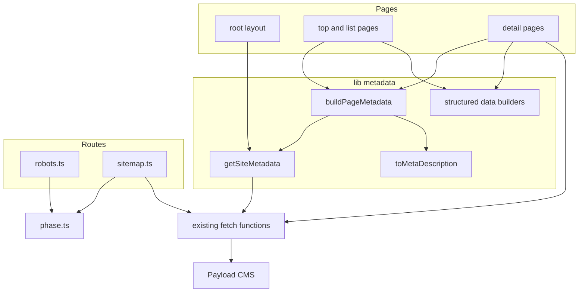
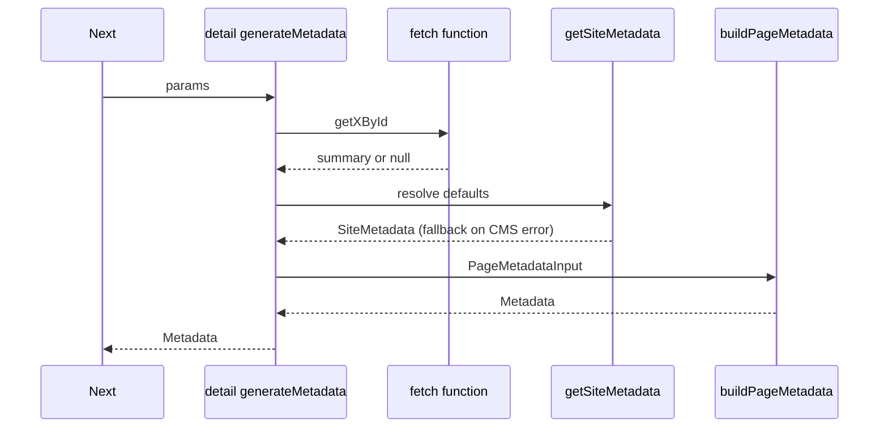
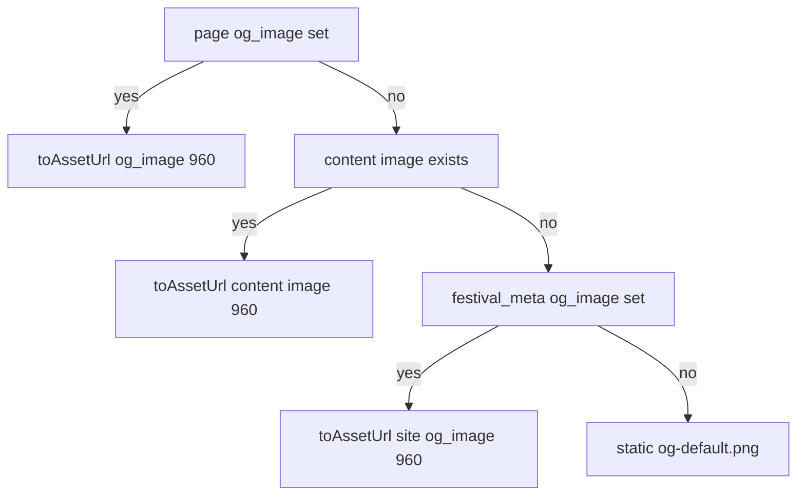
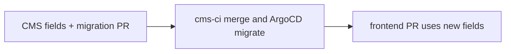

# 設計書: seo-metadata

## Overview

**Purpose**: 荒牧祭公式サイトの全公開ページが、固有の `title` / `description`、完全な OGP / Twitter Card、正規 URL、構造化データを持ち、クローラには公開範囲に一致した `robots.txt` と sitemap を返すようにする。
**Users**: SNS で URL を共有する来場者、検索エンジン経由の流入者、CMS で説明文と共有画像を調整する実行委員会の編集者。
**Impact**: root layout の既定メタデータを CMS (`festival_meta`) 駆動に変え、各ページの `generateMetadata` を共通ビルダー経由に統一する。CMS に任意の SEO フィールドを追加し、`robots.ts` を新設する。CMS に OG 画像が無いページはリポジトリ同梱の静的既定画像を使う。

### Goals
- 公開ページ全てが固有の title / description / canonical / openGraph / twitter を出力する
- `robots.txt` と sitemap が `BUILD_PHASE` の公開範囲と実在ページだけを申告する
- 画像を持たないページでも荒牧祭の既定 OG 画像が表示される
- CMS 障害時もメタデータ生成が例外を出さず既定値で描画される

### Non-Goals
- 公開フェーズの判定ロジック・公開パス一覧の変更 (`frontend/src/lib/phase.ts` は参照のみ)
- 下書き/公開の状態フィールド (`status`) の追加。公開判定は既存の `published_at` で足りる
- CMS 取得のキャッシュ / 再検証方針の変更
- `/sponsors/ad` `/sponsors/local` ルートの実装
- 既定 OG 画像ファイル (`frontend/public/images/og-default.png`) のデザイン・制作
- PWA manifest、hreflang、Search Console 登録

## Boundary Commitments

### This Spec Owns
- root layout とページ群の `generateMetadata` / `metadata` の内容
- メタデータ合成規則 (description の導出・切り詰め、OG 画像の優先順位、canonical の決め方)
- `/robots.txt`、`/sitemap.xml` の出力内容
- 静的既定 OG 画像の参照パス (`/images/og-default.png`) と宣言寸法
- JSON-LD (Event / Organization / BreadcrumbList) の出力
- CMS の追加フィールド: `festival_meta.meta_description` / `og_image` / `venue_address`、`announcements` / `topics` / `pages` の `meta_description`、`announcements` / `pages` の `og_image`

### Out of Boundary
- `isPublicPath` / `BUILD_PHASE` / `PRE_EVENT_PUBLIC_PATHS` の定義 (読み取りのみ)
- middleware の matcher とゲートの挙動
- ページ本文・レイアウト・ビジュアル
- CMS メディアの派生サイズ定義 (`cms/src/collections/media.ts` の `IMAGE_SIZES`)

### Allowed Dependencies
- `frontend/src/lib/phase.ts` の `isPublicPath` / `resolvePhase` / `PRE_EVENT_PUBLIC_PATHS` / `PRE_EVENT_PUBLIC_PREFIXES`
- 既存取得関数 (`getFestivalMeta`, `getAnnouncementById`, `getAnnouncements`, `getTopicById`, `getTopics`, `getPageBySlug`, `getExhibitionDetail`) と `toAssetUrl`

### Revalidation Triggers
- `PRE_EVENT_PUBLIC_PATHS` / `PRE_EVENT_PUBLIC_PREFIXES` / `BUILD_PHASE` の変更 → robots / sitemap の出力が変わる
- middleware matcher の拡張子除外の変更 → `/images/og-default.png` がゲートされる
- 取得関数の戻り値型の変更 (`AnnouncementSummary` 等)

## Architecture

### Existing Architecture Analysis
- root `generateMetadata` (`frontend/src/app/layout.tsx:64-89`) は `getFestivalMeta()` の `name` のみ参照。`site_title` は CMS に存在するが未使用。
- 詳細 4 ページは `generateMetadata` と page 本体で同じ取得関数を呼ぶ (request memoization で 1 往復)。このパターンを維持する (要件 8.3)。
- 一覧取得は `publishedFilter()` (`frontend/src/lib/announcements.ts:16-20`、`topics.ts` も import して再利用) で公開済みに絞るが、`getAnnouncementById` (`announcements.ts:33-38`) と `getTopicById` (`topics.ts:27-30`) は `cms.findById` を使い公開日時を見ない。未公開レコードでも詳細ページとメタデータにタイトルが出る。本 spec で詳細取得にも同じ条件を適用する (要件 8.8 / 8.9)。
- middleware は拡張子付きパスをゲートしない (`frontend/src/middleware.ts:33-35`)。
- Next.js のメタデータは浅いマージ。子で `openGraph` を返すと root の `openGraph` は丸ごと置き換わる (research.md 参照)。

### Architecture Pattern & Boundary Map



**Architecture Integration**:
- Selected pattern: 純関数のメタデータビルダー + 既存取得関数の再利用。ページは「自分の title / description / パス / 画像候補」を渡すだけにする。
- 既存パターンの維持: 取得関数の二重呼び出し (memoization 前提)、`env` 経由の URL 解決、`toAssetUrl` による画像 URL。
- 新規コンポーネントの理由: Builder は浅いマージによる siteName / 画像欠落を構造的に防ぐため。
- 既定画像に `app/opengraph-image.*` のファイル規約を使わない理由: ファイル規約は `generateMetadata` の `openGraph.images` より優先され、CMS 画像優先 (7.3) を崩すため。`public/` に置き、Builder が URL を組み立てる。

### Technology Stack

| Layer | Choice / Version | Role in Feature | Notes |
|-------|------------------|-----------------|-------|
| Frontend | Next.js 15.5.19 App Router | Metadata API, `MetadataRoute.Robots` / `Sitemap` | 新規依存なし |
| Runtime | Cloudflare Workers via `@opennextjs/cloudflare` 1.20.1 | 全ルートの実行 | Node 専用 API 不可 |
| Backend | Payload 3 | SEO フィールドの保存 | 任意フィールドの追加のみ |

## File Structure Plan

### Directory Structure
```
frontend/src/
├── lib/
│   ├── site-metadata.ts         # サイト既定値 (title/description/OG画像) の解決と CMS 障害時の退避
│   ├── page-metadata.ts         # buildPageMetadata: ページ固有値 + 既定値 → Metadata
│   ├── meta-description.ts      # HTML 除去・空白正規化・切り詰め
│   ├── route-metadata.ts        # コード定義ルート (/, /announcements, /exhibitions, /topics, /map) の title/description 定数
│   ├── structured-data.ts       # Event / Organization / BreadcrumbList の組み立て
│   └── crawl-targets.ts         # robots/sitemap 共通: 実効フェーズと候補ルート
├── components/
│   └── json-ld.tsx              # <script type="application/ld+json"> の安全な出力
└── app/
    └── robots.ts                # 新設
frontend/public/images/
└── og-default.png               # 静的既定 OG 画像 (配置は別タスク。未配置でもビルド・描画は通る)
cms/src/
├── globals/festival-meta.ts     # meta_description / og_image / venue_address 追加
├── collections/announcements.ts # meta_description / og_image 追加
├── collections/topics.ts        # meta_description 追加 (OG 画像は既存 image を使う)
├── collections/pages.ts         # meta_description / og_image 追加
└── migrations/<timestamp>_seo_fields.ts  # pnpm migrate:create で生成
```
各新規 lib ファイルは同階層に `*.test.ts` を置く (steering の規約)。

### Modified Files
- `frontend/src/lib/festival-meta.ts` — `getFestivalMeta()` の戻り値に `siteTitle` / `metaDescription` / `ogImageId` / `venueName` / `venueAddress` / `snsLinks` を追加 (取得は既存の 1 回のまま)
- `frontend/src/lib/home-page-types.ts` — `AnnouncementSummary` / `TopicSummary` に `metaDescription` / `ogImageId` (announcement のみ) / `updatedAt` を追加
- `frontend/src/lib/announcements.ts` / `topics.ts` — マッパーで上記フィールドを詰める。`getAnnouncementById` / `getTopicById` を `findById` から「`id` 一致 AND `publishedFilter()`」の `findMany` (`limit: 1`) へ置き換え、未公開・不在・取得失敗はいずれも `null` を返す
- `frontend/src/lib/static-page.ts` — `StaticPageContent` に `metaDescription` / `ogImageId` / `updatedAt` 追加、sitemap 用に `getPageSlugsUpdatedAt(slugs)` 追加
- `frontend/src/lib/exhibitions.ts` — sitemap 用 `getExhibitionSitemapEntries()` 追加 (公開済み企画 × 選択カテゴリ、企画名空は除外。結合用の追加取得はしない)
- `frontend/src/lib/campus-map.ts` — sitemap 用 `getCampusMapLastModified()` 追加 (`/map` を構成するコレクションの最大 `updatedAt`)
- `frontend/src/app/layout.tsx` — `generateMetadata` を `getSiteMetadata()` + `buildPageMetadata()` に置換 (canonical は出さない)
- `frontend/src/app/(site)/page.tsx` — metadata + Event/Organization JSON-LD
- `frontend/src/app/(site)/{announcements,exhibitions,topics}/page.tsx`, `(fullscreen)/map/page.tsx` — metadata 追加
- `frontend/src/app/(site)/{announcements/[id],topics/[id],[slug],exhibitions/[id]/[category]}/page.tsx` — `buildPageMetadata()` 経由に置換 + BreadcrumbList
- `frontend/src/app/sitemap.ts` — `crawl-targets.ts` 経由に書き換え
- `frontend/src/cms-types.ts` — `pnpm generate:types` の生成物

## System Flows

### メタデータ生成 (詳細ページ)


- 取得結果が `null` (不在・障害) の場合は `{}` ではなく既定値ベースのメタデータを返す (要件 2.10 / 8.1)。本体側は従来どおり `notFound()`。

### OG 画像の優先順位


- 「content image」は topics の `image`、企画の先頭画像 (`thumbnail`)。
- `festival_meta.og_image` は CMS で差し替えられるサイト既定画像。設定されていれば同梱の静的既定画像より優先する (編集者の明示指定を尊重する)。
- 静的既定画像は `/images/og-default.png` 固定、`width: 1200` / `height: 630` を宣言する。

## Requirements Traceability

| Requirement | Summary | Components | Interfaces | Flows |
|-------------|---------|------------|------------|-------|
| 1.1, 1.2 | root の openGraph / twitter | SiteMetadata, PageMetadataBuilder | `buildPageMetadata` | — |
| 1.3 | robots メタ | PageMetadataBuilder | `PageMetadataInput.robots` | — |
| 1.4-1.6 | site_title → name → 荒牧祭 | SiteMetadata | `getSiteMetadata` | — |
| 1.7 | 既定 description | SiteMetadata, MetaDescription | `toMetaDescription` | — |
| 1.8, 1.9 | template・開発環境前置の維持 | SiteMetadata | `SiteMetadata.siteTitle` | — |
| 1.10, 2.9 | canonical | PageMetadataBuilder | `PageMetadataInput.path` | — |
| 1.11 | 絶対 URL は env から | PageMetadataBuilder, CrawlTargets | `metadataBase` | — |
| 2.1-2.5 | コード定義ルートの title/description | RouteMetadata | `ROUTE_METADATA` | — |
| 2.6-2.8 | 詳細の description / openGraph | PageMetadataBuilder | `buildPageMetadata` | メタデータ生成 |
| 2.10, 8.1, 8.2 | CMS 障害時の退避 | SiteMetadata, 各 generateMetadata | `FALLBACK_SITE_METADATA` | メタデータ生成 |
| 2.11 | description 長 | MetaDescription | `META_DESCRIPTION_MAX_LENGTH` | — |
| 3.1-3.6 | robots.txt | RobotsRoute, CrawlTargets | `buildRobots` | — |
| 4.1-4.9 | sitemap | SitemapRoute, CrawlTargets | `buildSitemap` | — |
| 5.1-5.6, 5.8 | Event / Organization | StructuredData | `buildEventJsonLd`, `buildOrganizationJsonLd` | — |
| 5.7 | BreadcrumbList | StructuredData | `buildBreadcrumbJsonLd` | — |
| 5.9 | 必須プロパティ | StructuredData | — | — |
| 5.10 | スクリプト閉じ無害化 | JsonLd | `serializeJsonLd` | — |
| 6.1-6.8, 6.12, 6.13 | CMS フィールド・migration・型生成 | CmsSeoFields | Payload field 定義 | — |
| 6.9-6.11 | ページ固有値の優先・画像 URL | PageMetadataBuilder | `PageMetadataInput` | OG 画像の優先順位 |
| 7.1, 7.2, 7.5 | 静的既定 OG 画像 | PageMetadataBuilder | `DEFAULT_OG_IMAGE` | OG 画像の優先順位 |
| 7.3, 7.4 | CMS 画像優先 | PageMetadataBuilder | `buildPageMetadata` | OG 画像の優先順位 |
| 7.6 | プレビューでの確認 | (タスク) | — | — |
| 8.3 | 追加往復なし | 各 generateMetadata | 既存取得関数 | — |
| 8.8, 8.9 | 未公開記事の詳細を出さない | PublishedDetailFetch | `getAnnouncementById`, `getTopicById`, `publishedFilter` | メタデータ生成 |
| 8.4-8.7 | テスト・CI | 各 `*.test.ts` | — | — |

## Components and Interfaces

| Component | Layer | Intent | Req Coverage | Key Dependencies | Contracts |
|-----------|-------|--------|--------------|------------------|-----------|
| SiteMetadata | lib | サイト既定値の解決 | 1.1-1.9, 8.1 | getFestivalMeta (P0) | Service |
| PageMetadataBuilder | lib | Metadata の一括合成 | 1.1-1.3, 1.10, 1.11, 2.6-2.10, 6.9-6.11, 7.1-7.5 | SiteMetadata (P0) | Service |
| MetaDescription | lib | description 正規化 | 1.7, 2.11, 6.10 | — | Service |
| RouteMetadata | lib | コード定義ルートの定数 | 2.1-2.5 | — | State |
| CrawlTargets | lib | 実効フェーズと候補ルート | 3.3-3.6, 4.1, 4.4-4.9 | phase.ts (P0) | Service |
| RobotsRoute / SitemapRoute | app | robots.txt / sitemap.xml | 3, 4 | CrawlTargets (P0) | API |
| StructuredData / JsonLd | lib / components | JSON-LD 組み立てと出力 | 5.1-5.10 | SiteMetadata (P1) | Service |
| CmsSeoFields | cms | 任意 SEO フィールド | 6.1-6.8, 6.12, 6.13 | Payload (P0) | State |
| PublishedDetailFetch | lib | 詳細取得の公開済み判定 | 8.8, 8.9 | publishedFilter (P0) | Service |

### lib

#### SiteMetadata

| Field | Detail |
|-------|--------|
| Intent | `festival_meta` からサイト既定値を解決し、失敗時は固定値へ退避する |
| Requirements | 1.4-1.9, 8.1 |

**Responsibilities & Constraints**
- title の優先順位: `site_title` → `name` → `'荒牧祭'`。`NODE_ENV === 'development'` で `【開発環境】 ` を前置。
- description の優先順位: `meta_description` → `overview_html` を `toMetaDescription` で正規化 → `'荒牧祭公式サイト'`。
- 例外を外へ出さない。

##### Service Interface
```typescript
interface SiteMetadata {
  readonly siteTitle: string;
  readonly description: string;
  readonly ogImageUrl: string | null; // festival_meta.og_image を toAssetUrl(id, 960) で解決
  readonly festival: FestivalMeta | null; // JSON-LD 用。取得失敗時 null
}

declare function getSiteMetadata(): Promise<SiteMetadata>;
declare const FALLBACK_SITE_TITLE: '荒牧祭';
declare const FALLBACK_SITE_DESCRIPTION: '荒牧祭公式サイト';
```
- Postconditions: `siteTitle` / `description` は常に非空。

`FestivalMeta` は `getFestivalMeta()` の拡張後の戻り値:
```typescript
interface FestivalMeta extends FestivalOverview {
  readonly siteTitle: string | null;
  readonly metaDescription: string | null;
  readonly ogImageId: string | null;
  readonly venueName: string | null;
  readonly venueAddress: string | null;
  readonly snsLinks: readonly SnsLink[];
}
```
`FestivalOverview` を返している既存呼び出し側は構造的部分型のため変更不要。

#### PageMetadataBuilder

| Field | Detail |
|-------|--------|
| Intent | ページ固有値とサイト既定値から `Metadata` を完全な形で返す |
| Requirements | 1.1-1.3, 1.10, 1.11, 2.6-2.10, 6.9-6.11, 7.1-7.5 |

**Responsibilities & Constraints**
- `openGraph` は毎回 `siteName` / `locale: 'ja_JP'` / `type` / `url` / `title` / `description` / `images` を全て含める (浅いマージ対策)。
- `twitter.card` は常に `summary_large_image`。
- `alternates.canonical` は `path` (クエリ無しの相対パス) を設定。`path` が `null` (root layout) の場合は出さない。
- `robots` は `{ index: true, follow: true }` を既定とし、root layout でのみ設定する (子は継承)。
- 画像の優先順位は「OG 画像の優先順位」フロー。いずれも無ければ `DEFAULT_OG_IMAGE`。
- 静的既定画像の実在はビルド時・実行時とも検査しない。未配置の間は `og:image` が 404 を指すだけで、ページのビルド・描画には影響しない (7.5)。

##### Service Interface
```typescript
type OgImageCandidate = string | null; // CMS media ID

interface PageMetadataInput {
  readonly site: SiteMetadata;
  /** null は root layout (title.default/template を出す) */
  readonly title: string | null;
  readonly description: string | null;
  /** クエリ無しの正規パス。null なら canonical を出さない */
  readonly path: string | null;
  readonly ogType: 'website' | 'article';
  /** 優先度順。先頭から最初の非 null を採用 */
  readonly imageCandidates: readonly OgImageCandidate[];
}

declare const DEFAULT_OG_IMAGE: { readonly url: '/images/og-default.png'; readonly width: 1200; readonly height: 630 };
declare function buildPageMetadata(input: PageMetadataInput): Metadata;
```
- Preconditions: `path` は `/` で始まり `?` / `#` を含まない。
- Postconditions: `openGraph.images` と `twitter.images` は常に 1 件。

#### PublishedDetailFetch

| Field | Detail |
|-------|--------|
| Intent | お知らせ・トピックの詳細取得を一覧と同じ公開済み条件に揃える |
| Requirements | 8.8, 8.9 |

- 条件は既存の `publishedFilter()` をそのまま使い、`id` 一致と AND で結合する。公開済み判定を別に書かない。
- シグネチャは変えない (`(id: number) => Promise<Summary | null>`)。未公開・不在・取得失敗を区別せず `null` を返すため、呼び出し側 (詳細ページの `notFound()`、`generateMetadata` の既定値退避、sitemap) は変更不要。
- 1 往復のまま (`findById` → `findMany limit: 1` の置き換え)。

#### MetaDescription

```typescript
declare const META_DESCRIPTION_MAX_LENGTH: 120;
/** 先頭から最初の非空値を採り、HTML タグ除去・実体参照の最小デコード・空白正規化の上で
 *  120 文字を超える場合は 119 文字 + '…' に切り詰める。全て空なら fallback。 */
declare function toMetaDescription(
  sources: readonly (string | null | undefined)[],
  fallback: string,
): string;
```
- 120 文字は日本語の検索結果スニペットで切り詰められにくい上限として採用。

#### RouteMetadata

```typescript
type CodeRoutePath = '/' | '/announcements' | '/exhibitions' | '/topics' | '/map';
interface RouteMetadataEntry {
  readonly title: string | null; // '/' は null (サイトタイトルそのもの)
  readonly description: string;
}
declare const ROUTE_METADATA: Readonly<Record<CodeRoutePath, RouteMetadataEntry>>;
```
- `/` の description はサイト既定値を使うため、ここでは一覧・マップの文言のみ実質的に意味を持つ。文言は実装時にページ見出しと揃えて決める。

#### CrawlTargets

```typescript
/** クローラは Cookie を持たないため常に BUILD_PHASE */
declare function crawlPhase(): FestivalPhase;

interface RobotsPlan {
  readonly allow: readonly string[];
  readonly disallow: readonly string[];
}
/** live: allow ['/'], disallow ['/gated', '/gated-fullscreen']
 *  pre_event: disallow ['/', '/gated', '/gated-fullscreen'],
 *             allow = PRE_EVENT_PUBLIC_PATHS を `$` 終端化 + PRE_EVENT_PUBLIC_PREFIXES
 *                     + 描画資産 ['/_next/', '/images/'] */
declare function buildRobotsPlan(phase: FestivalPhase): RobotsPlan;

/** sitemap 候補のコード定義ルート。PRE_EVENT_PUBLIC_PATHS のうちルート実体を持つものと
 *  /exhibitions /topics /map の和。isPublicPath で絞るのは呼び出し側 */
declare const SITEMAP_CODE_ROUTES: readonly string[];
```
- `PRE_EVENT_PUBLIC_PATHS` のうち 1 セグメントで `CodeRoutePath` に無いものは `[slug]` 固定ページ候補として扱い、`pages` に slug が実在するものだけ sitemap に載せる。2 セグメント以上でルート実体が無いもの (`/sponsors/*`) は載せない。

### app

#### RobotsRoute (`app/robots.ts`)
- `MetadataRoute.Robots` を返す。`rules: { userAgent: '*', allow, disallow }`、`sitemap: new URL('/sitemap.xml', NEXT_PUBLIC_SITE_URL)`。
- CMS に依存しない (純粋に phase から決まる)。

#### SitemapRoute (`app/sitemap.ts`)

| エントリ | 列挙条件 | lastModified |
|----------|----------|--------------|
| `/` | 常に | `festival_meta.updatedAt` |
| `/announcements` | 公開判定 | 公開済みお知らせの最大 `updatedAt` |
| `/announcements/{id}` | 公開判定 (前方一致) かつ `published_at` 済み | 当該 `updatedAt` |
| `/topics`, `/topics/{id}` | 公開判定 | 同上 (topics) |
| `/exhibitions`, `/exhibitions/{id}/{category}` | 公開判定 | 企画の `updatedAt` |
| `/map` | 公開判定 | `map_areas` / `stages` / `performance_slots` / 公開済み `student_exhibitions` の最大 `updatedAt` |
| 固定ページ `/{slug}` | 公開判定かつ `pages` に実在 | 当該 `updatedAt` |

- 各 CMS 取得は独立に失敗を握り、取得できた分で応答 (要件 4.8)。取得失敗時は該当の候補 (固定ページ含む) を載せない。
- `/map` の `lastModified` は、ページを構成する上記コレクションを各 `sort: ['-updatedAt'], limit: 1, depth: 0` で取得した最大値。Payload の自動 `updatedAt` を使うため CMS へのフィールド追加は不要。全取得が失敗した場合のみ `lastModified` を省略してエントリは残す。

### components

#### JsonLd (`components/json-ld.tsx`)
```typescript
type JsonLdValue = string | number | boolean | null | JsonLdObject | readonly JsonLdValue[];
interface JsonLdObject { readonly [key: string]: JsonLdValue | undefined }

/** JSON.stringify 後に '<' を '<' へ置換 (要件 5.10) */
declare function serializeJsonLd(data: JsonLdObject): string;
interface JsonLdProps { readonly data: JsonLdObject }
```

#### StructuredData (`lib/structured-data.ts`)
```typescript
interface BreadcrumbItem { readonly name: string; readonly path: string }

/** 開催日程が空なら null (Event は startDate 必須のため出力しない) */
declare function buildEventJsonLd(input: {
  readonly site: SiteMetadata;
  readonly siteUrl: string;
}): JsonLdObject | null;
declare function buildOrganizationJsonLd(input: {
  readonly site: SiteMetadata;
  readonly siteUrl: string;
}): JsonLdObject;
declare function buildBreadcrumbJsonLd(items: readonly BreadcrumbItem[], siteUrl: string): JsonLdObject;
```
- Event: `name`, `description`, `startDate` (最初の `start_at`)、`endDate` (最後の `end_at`)、`eventStatus: EventScheduled`、`eventAttendanceMode: OfflineEventAttendanceMode`、`location: Place { name: venue_name, address: venue_address }` (未設定プロパティは省略)、`image`、`url`、`organizer` (Organization を参照)。
- Organization: `name: '荒牧祭実行委員会'`、`url`、`logo` (favicon)、`sameAs` (`sns_links` の `url`、要件 5.6)。
- トップページで Event と Organization を `@graph` にまとめて 1 つの script で出す。
- BreadcrumbList: 詳細 4 種。例 お知らせ詳細 = トップ › お知らせ › {タイトル}。固定ページ = トップ › {タイトル}。企画詳細 = トップ › 企画一覧 › {企画名}。

### cms

#### CmsSeoFields

既存コレクションの流儀 (インライン定義、日本語 `label`、`admin.description`) に合わせ、共通 helper は作らない。

| 対象 | name | type | 備考 |
|------|------|------|------|
| `festival_meta` | `meta_description` | `textarea`, `maxLength: 200` | 「検索結果・SNS 共有時のサイト説明文。未入力時は祭概要から自動生成」 |
| `festival_meta` | `og_image` | `upload` → `media` | 「SNS 共有時の既定画像。未設定時はサイト同梱の既定画像を使用」 |
| `festival_meta` | `venue_address` | `text`, `maxLength: 255` | 「構造化データ用の会場住所 (郵便番号から)」。値はコード・マイグレーションに埋め込まず CMS で入力する (要件 6.13) |
| `announcements` / `topics` / `pages` | `meta_description` | `textarea`, `maxLength: 200` | 「未入力時は本文冒頭から自動生成」 |
| `announcements` / `pages` | `og_image` | `upload` → `media` | 「未設定時はサイトの既定画像を使用」 |

- 全て `required` なし (要件 6.5)。`cms-schema-check` の検出対象外 (research.md)。
- `pnpm migrate:create seo_fields` → `cms/src/migrations/index.ts` 登録 → `pnpm generate:types` で `frontend/src/cms-types.ts` を同期 (要件 6.7 / 6.8)。
- `maxLength: 200` は編集者の入力余地。FE 側で 120 文字へ切り詰める。

## Error Handling

### Error Strategy
- **メタデータ生成**: 取得関数が `null` / 例外 → `getSiteMetadata()` の既定値で `buildPageMetadata()` を呼ぶ。`generateMetadata` から例外を出さない。
- **sitemap**: 取得ごとに `try/catch`、失敗した取得に依存するエントリのみ欠落。
- **robots**: CMS 非依存のため失敗経路なし。
- **既定 OG 画像**: 静的パスの参照のみで失敗経路なし。ファイル未配置は画像 404 に留まる (要件 7.5)。
- **JSON-LD**: 値の欠落はプロパティ省略。Event は `startDate` が得られない場合のみ出力しない (要件 5.8 の「全体中止しない」は Organization / Breadcrumb 側で担保)。

### Monitoring
- 既存どおり Workers のログに委ねる。

## Testing Strategy

### Unit Tests
- `toMetaDescription`: HTML 除去、実体参照、空白正規化、120 文字境界、全空時の fallback
- `getSiteMetadata`: `site_title` / `name` / 両方欠落 / 取得例外、`NODE_ENV=development` の前置
- `buildPageMetadata`: openGraph の全キー存在、画像優先順位 4 段 (最終段が `DEFAULT_OG_IMAGE`、幅高さ宣言付き)、canonical の有無
- `buildRobotsPlan`: `pre_event` / `live` の allow/disallow、`PRE_EVENT_PUBLIC_PATHS` から導出されていること
- `serializeJsonLd`: `</script>` を含む文字列が閉じタグにならない
- `buildEventJsonLd`: 日程空で null、住所未設定で address 省略
- `getAnnouncementById` / `getTopicById`: 公開済みは返す、`published_at` 未設定・未来日時は `null`、CMS の `where` に `id` 条件と公開済み条件が両方渡ること

### Integration Tests (route / page 単位, vitest)
- `sitemap.ts`: `pre_event` で企画・トピックが出ない、`live` で出る、CMS 失敗時に 500 にならない、`/sponsors/*` が出ない、`lastModified` の源 (`/map` は構成コレクションの最大 `updatedAt`、全失敗時は省略)
- `robots.ts`: sitemap URL の絶対化
- 各ページ `generateMetadata`: 期待 title / description / openGraph、CMS 取得失敗時の既定値退避

### Preview Verification (要件 7.6)
- PR プレビュー URL で各ページの `og:image` / `twitter:image` が CMS 画像または `/images/og-default.png` の絶対 URL を指すことを確認
- 各ページの `<head>` を取得し og:* / twitter:* / canonical / ld+json の存在を確認
- Rich Results Test (または Schema Markup Validator) で トップの Event と詳細の BreadcrumbList を検証

## Migration Strategy


- CMS を先にデプロイし、FE は新フィールドが未反映 (値なし) でも既定値へ退避する作りのため順序依存は弱い。ただし `cms-types.ts` の同期は CMS PR で行う。
- `venue_address` の値投入は CMS デプロイ後のデータ入力作業。

## Security Considerations
- JSON-LD は `<` エスケープで script 閉じを無害化 (要件 5.10)。
