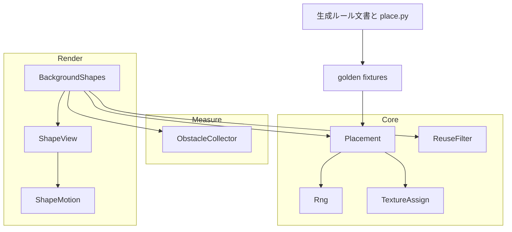
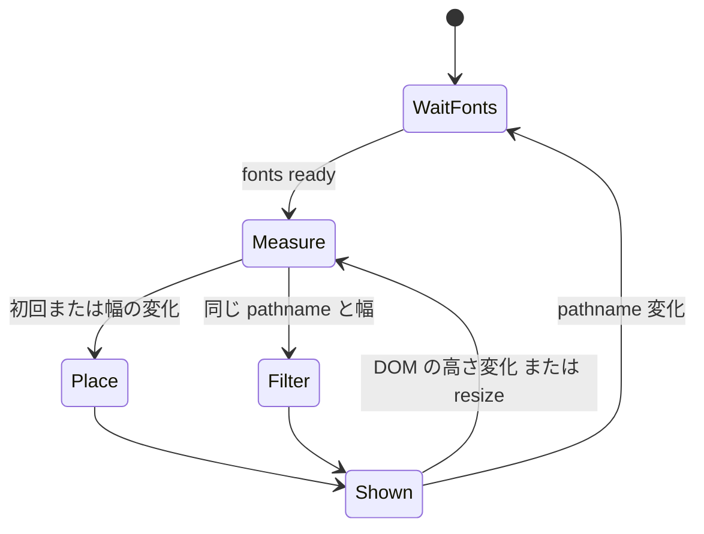

# Design Document

## Overview

**Purpose**: 公式サイトの見た目を洗練版へ差し替える。書体・文字色・地色・ヒーローの主題語・企画カードと「会場で使う」ボタンの質感・背景図形の生成ルールが対象。

**Users**: 来場者が閲覧時に受け取る。開発者は背景図形の生成ルールと実装の一致をテストで確かめる。

**Impact**: `full-site-design` で実装した画面のスタイルと、背景図形の配置関数・障害物収集・描画・動きの定数を置き換える。ページの情報構造・データ取得・CMS には触れない。

### Goals
- 要件 1〜11 を満たす。
- 背景図形の配置が参照実装 `place.py` と同じ入力で同じ結果になることをテストで保証する。

### Non-Goals
- Figma の画面ごとの配置の再現 (Figma は叩き台)。
- カラーパレットのトークン値の変更。
- 構内マップ (`(fullscreen)/map`) への背景図形。

## Boundary Commitments

### This Spec Owns
- 書体の読み込みと、見出し・本文・補助文字のタイポグラフィ規則 (`globals.css`, `tailwind.config.ts`)。
- 文字色としての `text-primary` / `text-gray-500` の廃止。
- 背景図形の生成ルール文書・参照実装・質感画像のリポジトリ内の置き場所。
- 背景図形の配置関数・障害物収集・描画・動きの定数。
- 企画カード・「会場で使う」ボタン・ヒーロー・トピックカードの見た目。

### Out of Boundary
- 各ページのデータ取得・ルーティング・フェーズの出し分け。
- `MotionToggle` とモーションの抑制設定の仕組み (`use-motion-preference.ts`)。値を参照するだけ。
- FAQ ページの実装 (`faq-page`)。共通部品と `data-bg-opaque` の規約を受け取る側。

### Allowed Dependencies
- `@fontsource/line-seed-jp` (新規)。
- 既存の `use-motion-preference.ts`、`breakpoints.ts`、Tailwind の色トークン。

### Revalidation Triggers
- `data-bg-opaque` の規約や障害物の分類を変えたとき → `faq-page` など共通部品を使う画面。
- 生成ルール文書または `place.py` を変えたとき → golden を再生成し TS 実装を追随させる。

## Architecture

### Existing Architecture Analysis
- `components/background-shapes.tsx` がマウント後に DOM を計測し (`collectExcludeRects`)、純関数 `computeBackgroundShapePlacement` で配置してレイヤーに描く。ヘッダー内にも portal で描いている。
- 再計算の契機は pathname・resize・`document.body` の ResizeObserver。検索条件の変化 (searchParams のみ) でも件数による高さ変化で全面再配置される。
- 企画カードは `lib/exhibition-color.ts` の `getExhibitionGradient` (FNV-1a → mulberry32) で 2 色グラデーションを決め、CSS 変数経由で描画している。

### Architecture Pattern & Boundary Map



- **Dependency direction**: `types` → `rng` → `geometry` → `placement` / `reuse` → `obstacles` (DOM) → `components`。Core は DOM に依存しない。
- **既存パターンの維持**: クライアント描画・`aria-hidden`・絶対配置・決定的乱数・単一 rAF ループ。
- **削除**: ヘッダー内の図形 (portal スロット、`splitShapesByHeaderHeight`)。ヘッダーは全階層の除外領域になったため。

### Technology Stack

| Layer | Choice / Version | Role in Feature | Notes |
|-------|------------------|-----------------|-------|
| Frontend | Next.js 15 / React 19 / Tailwind (既存) | スタイル・描画 | 変更なし |
| Font | `@fontsource/line-seed-jp` (新規) | LINE Seed JP 100/400/700/800 を unicode-range 分割で自己ホスト | 導入済み Next の `next/font/google` に未収録 |
| Assets | WebP (`public/images/textures/`) | 質感画像 | 網目は可逆。背景図形の質感は表示最大寸法の 2 倍 (L 800px・S 240px) で `gentex3.py` から作り直す (既存の PNG は L 640px・S 192px で不足) |
| Reference | Python 3 (`docs/background-shapes/place.py`) | golden 生成用の参照実装 | CI では実行しない |

## File Structure Plan

### Directory Structure
```
docs/background-shapes/
├── rules.md                 # 生成ルール (bgshape-rules.md を移す。正)
├── place.py                 # 参照実装。golden の再生成に使う
└── README.md                # golden の再生成手順
frontend/public/images/textures/
├── bg/L1〜L8, S1〜S6.webp   # 背景図形の質感
├── card/{gradient,watercolor,grainy,halftone}.webp  # 企画カードに重ねる質感 (無彩色)
└── nav/{exhibitions,map,timetable,parking}.webp      # 「会場で使う」ボタンの地
frontend/src/lib/background-shapes/
├── types.ts                 # Obstacles, PlacedShape 等
├── rng.ts                   # FNV-1a / mulberry32 (exhibition-color.ts と共用)
├── geometry.ts              # 回転外接円・図形マスク・可視率・ガター判定
├── placement.ts             # ∞ → L → S の配置と緩和段、質感割当
├── reuse.ts                 # 流用モード (制約違反の図形を落とす)
├── obstacles.ts             # DOM から 4 分類の障害物を集める (exclude-rects.ts を置換)
├── motion-params.ts         # 階層別の動きの定数 (background-shapes-motion.ts の定数を置換)
└── __fixtures__/            # place.py の入力と golden 出力
```

### Modified Files
- `frontend/src/app/layout.tsx` — Zen Old Mincho を削除し、`@fontsource/line-seed-jp` の 4 ウェイトを読み込む。
- `frontend/tailwind.config.ts` — `fontFamily.sans` を LINE Seed JP に、`mincho` を削除。色トークンは変更しない。
- `frontend/src/app/globals.css` — 見出し・本文のタイポグラフィ、見出しの `text-primary` 廃止、本文領域の光彩、`.exhibition-gradient-bg` の質感差し替え。
- `frontend/src/app/(site)/layout.tsx` — ページの地を白にする (`bg-white`。`background` トークンはフッター等が使うため値を変えない)。
- `frontend/src/components/header.tsx` — 背景図形の portal スロットを削除。
- `frontend/src/components/background-shapes.tsx` — 新しい配置・流用・描画・計測タイミングへ。
- `frontend/src/lib/background-shapes-motion.ts` — 階層別パラメータ、∞ の水平合流。
- `frontend/src/lib/exhibition-color.ts` — `rng.ts` を使い、質感の選択を追加。
- `frontend/src/components/exhibition-card.tsx`, `primary-nav-card.tsx`, `hero-section.tsx`, `topics-list.tsx` ほか — 見た目の差し替え。
- `text-primary` を文字色に使う 17 か所・`text-gray-500` の 23 か所 — `text-text` / `text-gray-600` へ。
- 不透明な面を持つ部品 (カード・写真・地図・協賛枠) — `data-bg-opaque` を付与。
- 削除: `frontend/src/lib/exclude-rects.ts` (→ `obstacles.ts`)、`frontend/src/lib/background-shapes.ts` (→ ディレクトリ)。

## System Flows



- **幅**: ビューポート幅が 1px でも変わったら計算し直す (要件 9.3)。検索・絞り込みでは幅は変わらないため、Filter だけが走る。
- **Filter**: 保持した配置を、最新の障害物に対して参照実装の流用モードと同じ判定にかけ、違反する図形を非表示にする (要件 9.1、9.2)。
- **Place の入力の高さ**: ページ高・装飾範囲は計測時点の値。

## Requirements Traceability

| Requirement | Summary | Components | Interfaces | Flows |
|-------------|---------|------------|------------|-------|
| 1.1–1.4, 1.7 | 書体・見出し・本文 | Typography (globals.css, layout.tsx) | — | — |
| 1.5, 1.6 | 詳細タイトルの大きさと折り返し | DetailTitle スタイル | — | — |
| 2.1–2.4 | 文字色・地色・選択状態 | Typography, 各部品 | — | — |
| 3.1, 3.2 | ヒーロー | HeroSection | — | — |
| 4.1, 4.2 | 企画カード | ExhibitionCard, exhibition-color | `getExhibitionAppearance` | — |
| 4.3–4.5 | 会場で使うボタン | PrimaryNavCard | — | — |
| 4.6 | トピックカード | TopicsList | — | — |
| 5.1–5.3 | 光彩 | Typography (globals.css) | — | — |
| 6.1–6.8 | 図形の構成 | placement, TextureAssign, ShapeView | `placeBackgroundShapes` | Place |
| 7.1–7.11 | 配置の制約 | placement, geometry, obstacles | `placeBackgroundShapes`, `collectObstacles` | Measure, Place |
| 8.1–8.5 | 個数の保証 | placement | `placeBackgroundShapes` | Place |
| 9.1–9.3 | 状態違いでの維持 | reuse, BackgroundShapes | `filterForObstacles` | Filter |
| 10.1–10.5 | 動き | motion-params, ShapeMotion | `motionParamsFor` | — |
| 11.1, 11.2 | ルールとの一致 | golden テスト, docs/background-shapes | — | — |

## Components and Interfaces

| Component | Layer | Intent | Req Coverage | Key Dependencies | Contracts |
|-----------|-------|--------|--------------|------------------|-----------|
| placement | Core | ルールどおりの配置 | 6, 7, 8 | rng, geometry (P0) | Service |
| reuse | Core | 保持した配置の間引き | 9.1, 9.2 | geometry (P0) | Service |
| obstacles | Measure | DOM から障害物を 4 分類で集める | 7.3–7.8 | DOM (P0) | Service |
| BackgroundShapes | Render | 計測タイミングと配置の保持 | 7.1, 9, 10.5 | placement, reuse, obstacles (P0) | State |
| ShapeView / ShapeMotion | Render | 図形の描画・入場・揺れ | 6.2, 6.3, 10 | motion-params (P1) | — |
| Typography | Style | 書体・文字色・光彩 | 1, 2, 5 | @fontsource (P0) | — |
| ExhibitionCard / PrimaryNavCard / HeroSection / TopicsList | UI | 部品の見た目 | 3, 4 | exhibition-color (P1) | — |

### Core

#### placement

| Field | Detail |
|-------|--------|
| Intent | pathname と障害物から、∞ → L → S の配置と質感を決定的に返す |
| Requirements | 6.1–6.8, 7.1–7.11, 8.1–8.5 |

**Responsibilities & Constraints**
- `docs/background-shapes/rules.md` と `place.py` を正とし、乱数の引く順序まで一致させる。
- 純関数。DOM・時刻・`Math.random` に依存しない。
- 目標数に届かなかった階層は `deficit` に記録する (例外にしない)。

**Contracts**: Service [x]

##### Service Interface
```typescript
type Platform = 'pc' | 'sp';
type Tier = 'Inf' | 'L' | 'S';
type ShapeKind = 'circle' | 'triangle' | 'square' | 'roundedSquare' | 'quarterCircle' | 'semicircle';
type TextureFamily = 'gradient' | 'watercolor' | 'grainy' | 'halftone';
type TextureId = `L${1 | 2 | 3 | 4 | 5 | 6 | 7 | 8}` | `S${1 | 2 | 3 | 4 | 5 | 6}`;
// 乱数で選ぶ候補配列が place.py と同じ並び・同じ値である必要があるため、接頭辞なしの名前を使う。
// Tailwind の bansai-* への対応は描画側で行う
type RingColor = 'ochre' | 'olive' | 'sage' | 'salmon' | 'rose' | 'wisteria' | 'aqua';

interface Rect { x: number; y: number; w: number; h: number }

// place.py の入力 JSON (fixture) と同じ平坦な形。fixture をそのまま読み込めるようにする
interface PlacementInput {
  pathname: string;
  platform: Platform;
  width: number;
  height: number;
  decorTop: number;     // ヘッダー (ヒーローがあればその) 下端
  decorBottom: number;  // フッター (SP は下部タブナビ) 上端
  text: readonly Rect[];       // 黒文字の外接矩形
  noOverlap: readonly Rect[];  // 文字リンク・白文字・ロゴ
  opaque: readonly Rect[];     // 不透明な面
}

// place.py の出力 (shapes.json の shapes) と同じ形。golden と直接比較する。
// Inf の size は直径 D、rot は度。座標は小数第 2 位に丸める
type PlacedShape =
  | { tier: 'Inf'; kind: 'ring'; size: number; cx: number; cy: number; rot: number; texture: null; colors: readonly [RingColor, RingColor] }
  | { tier: 'L' | 'S'; kind: ShapeKind; size: number; cx: number; cy: number; rot: number; texture: TextureId; colors: null };

interface PlacementResult {
  shapes: readonly PlacedShape[];
  target: Readonly<Record<Tier, number>>;
  deficit: Readonly<Record<Tier, number>>;
}

declare function placeBackgroundShapes(input: PlacementInput): PlacementResult;
```
- Preconditions: `width > 0`, `decorTop <= decorBottom <= height`。矩形はページ座標 (左上原点)。
- Postconditions: 同じ入力に同じ結果 (8.5)。`deficit` がすべて 0 なら要件 6.4・6.5・6.7 を満たす。
- Invariants: 図形同士の回転外接円は 24px 以上離れる (S の緩和段では 12px)。
- 幾何判定 (形の内外・文字との重なり面積比・可視率・ガター) は、place.py と同じく図形の局所座標を 40×40 の格子で標本化する近似 (`GRID_N = 40`) をそのまま移植する。閉形式の幾何計算に置き換えない。配置は乱数で候補を引いては棄却する逐次試行なので、1 つの候補で判定が食い違うとそれ以降の乱数の消費がずれ、結果全体が変わるため。
- place.py にだけある定数・分岐 (試行回数、縮小率、緩和段の順序、`bbox_radius`、`inf_radius` など) は design に書き写さず、place.py を仕様として読む。

#### reuse

```typescript
interface ReuseResult { visible: readonly PlacedShape[]; dropped: readonly PlacedShape[] }
declare function filterForObstacles(base: readonly PlacedShape[], input: PlacementInput): ReuseResult;
```
- 位置・サイズ・質感を変えず、最新の障害物・装飾範囲に反する図形だけを `dropped` に移す。∞ の下限と 4 質感は検査しない (9.2)。
- L の可視率は、配置時にどの緩和段で置かれたかに関わらず 0.6 で判定する (place.py の `reuse_place` と同じ)。

#### rng
- `fnv1a(s: string): number` と `mulberry32(seed: number): () => number` を export する。`exhibition-color.ts` と背景図形で共用する (現在は複製)。文字列は UTF-16 コード単位で処理し、`place.py` と同じ値を返す。

### Measure

#### obstacles

```typescript
interface MeasuredPage { width: number; height: number; decorTop: number; decorBottom: number; obstacles: Obstacles }
declare function collectObstacles(root: HTMLElement): Omit<PlacementInput, 'pathname' | 'platform'>;
```
- **輝度**: 0〜1 に正規化した sRGB 値の単純な加重和 `0.2126R + 0.7152G + 0.0722B` (ガンマ補正なし)。閾値 0.5・0.85 は Figma 版の障害物抽出 (`extract_obstacles.js`) と同じ式で決めた値のため、WCAG の相対輝度は使わない。
- **黒文字**: 直下にテキストを持つ要素のうち、文字色の輝度が 0.5 未満で、`a` の子孫でないもの。矩形は `Range.getClientRects()` の和 (グリフの範囲。要素の幅いっぱいではない)。jsdom は `Range.getClientRects` を持たないため、`vitest.setup.ts` で feature-detect 付きの polyfill を入れる。
- **重ねない要素**: 地を持たない `a`・テキストボタンは、rules.md の「文字リンク」が文字の範囲を指すため、要素自身の矩形ではなく中の文字のグリフ範囲 (`Range.getClientRects()`。黒文字と同じ取り方) と中のアイコン (Material Symbols もフォントの文字なので同じ扱い) を集める。子孫に不透明な面 (`img` 等) があれば要素自身の矩形ではなくそちらへ個別に分類する (裏に L が回り込めるようにするため)。ほかに文字色の輝度が 0.85 超の文字、`[data-bg-logo]`。
- **不透明な面**: `[data-bg-opaque]`、`img`、`input,textarea,select`、地を持つ `button`・`a`。
- **装飾範囲**: `decorTop` はヘッダー下端、`[data-bg-hero]` があればその下端。`decorBottom` はフッター上端と、`文書の高さ − 下部タブナビの高さ` の小さい方。下部タブナビは `position: fixed` でビューポート下端に固定され、その `getBoundingClientRect().top` はスクロール量に応じて変わるだけで文書座標として使えないため、タブナビ自身の高さを文書の高さから引いた値を使う。
- `aria-hidden="true"`・`inert` の部分木、非表示要素は無視する (既存と同じ)。
- 幅 2px 以下の罫線は無視する。

### Render

#### BackgroundShapes

**Contracts**: State [x]

##### State Management
- 保持する状態: `{ key: { pathname, width }, base: PlacedShape[], visible: PlacedShape[], deficit }`。`width` はビューポート幅。
- 初回計測は `document.fonts.ready` の後 (1.7 の切替後に配置が動かないようにする)。
- `key` が変わったら (pathname の変化、またはリサイズによる幅の変化) `placeBackgroundShapes` で計算し直す (9.3)。同じ `key` の間の DOM 変化 (ResizeObserver による高さの変化。検索・絞り込みで件数が変わった場合など) では `filterForObstacles` だけを行う (9.1)。モバイルのスクロールで変わるのは高さだけなので、幅は変わらない。
- 装飾レイヤーのルート要素に、配置結果の不足数を `data-bg-deficit="Inf,L,S"` として常に出す (本番ビルドを含む)。e2e がこれを読んで検証する。
- レイヤーは本文コンテナ内の 1 枚だけ。ヘッダーには描かない。

**Implementation Notes**
- 描画 (L・S): `clip-path` で形を切り抜いた要素に質感画像を `background-size: cover` で敷く。回転は要素中心まわり (7.11)。
- 描画 (∞): 外側の要素は 1.74D × D の矩形で、中心 (cx, cy) まわりに `rot` 度回転する。その中に直径 D・線幅 0.1D の輪を 2 つ置き、中心は矩形中心から局所 x 軸方向に −0.37D と +0.37D (place.py の `inf_bbox` と同じ)。色はそれぞれ `colors[0]`・`colors[1]`。
- 動きの単位: 揺れは図形の外側要素に 1 つの transform で掛ける (∞ も外側要素に掛ける)。入場は L・S は外側要素、∞ は 2 つの輪の要素それぞれに掛け、輪ごとに方向と遅延を持つ。
- 画像は描画する図形の分だけ読み込み、`loading` に相当する遅延のため CSS 背景として付与する。
- Risks: 初回はフォント読み込み完了まで図形が出ない。入場アニメーションの起点から描き始めるため、表示の遅れは入場の一部として見える。

#### ShapeView / ShapeMotion
- `motionParamsFor(tier, rng)` が入場距離・所要時間・揺れの変位上限・反発半径を返す (10.1、10.3)。∞ は L の値を使う。
- ∞ の入場は 2 つの輪を左右の水平方向 (∞ の局所 x 軸方向) から寄せ、2 つ目を 150ms 遅らせる (10.2)。入場の起点は、1 つ目の輪が −x 側、2 つ目が +x 側。L・S の起点は既存どおりセクション中心と反対方向。
- ヘッダー portal を使う既存テスト 3 件 (`background-shapes.test.tsx`, `background-shapes-motion-runtime.test.tsx`, `motion-toggle-background-shapes.test.tsx`) は新しい描画に合わせて書き換える。
- 既存の rAF ループ・ばね・スクロール慣性・画面外の省略・モーション無効時の静止 (10.4) を流用する。

### Style / UI

#### Typography (`globals.css`, `tailwind.config.ts`, `layout.tsx`)
- `body`: LINE Seed JP 400、`line-height: 1.8`、`letter-spacing: 0.02em`、文字色 `text`。
- `h1`〜`h4`: 800、`letter-spacing: 0.02em`、文字色 `text`。h1 のサイズと行の高さは現行値を保つ (1.3)。
- 詳細ページのタイトル (お知らせ・トピック・企画): PC 32px / SP 28px。本文 (RichText) の h2 は 25px (1.5)。
- 見出し・タイトル: `text-wrap: balance` と `word-break: auto-phrase` (未対応ブラウザは balance のみ) (1.6)。
- `@fontsource` の `font-display: swap` で代替書体から切り替える (1.7)。`@fontsource` の CSS が参照する woff2 が、OpenNext のビルドで静的アセットとして出力され、プレビュー URL で 200 を返すことを導入時に確かめる (リポジトリに前例がない)。
- 光彩: `text-shadow` は継承されるので、`#main-content` に `text-shadow: 0 0 4px rgb(255 255 255 / 0.4)` を 1 回指定する。白文字のクラス (`text-gray-50`・`text-white` など) と `[data-bg-hero]` の部分木には `text-shadow: none` を指定して打ち消す。黒アイコン (Material Symbols はフォントの文字) も同じ指定で付く。ヘッダー・フッター・下部タブナビは `#main-content` の外にある (5.1–5.3)。部品側で個別に `text-shadow` を足さない。
- h1〜h4 の ExtraBold は全体の既定。トピックカードのタイトル (h4) は部品側で Bold を指定して上書きする (4.6)。
- `.rich-text-body h2` は現行 32px を 25px に下げる。詳細タイトルは現行 `text-[24px] lg:text-[32px]` の SP を 28px にする。折り返し制御は見出しの既定スタイルに入れる (企画詳細のタイトルには現在 `text-balance` が無い)。
- 文字色: `text-primary` を文字色に使う箇所は `text-text` に、`text-gray-500` は `text-gray-600` に置き換える。選択状態・現在地の `bg-primary` / `border-primary` は変えない (2.4)。

#### ExhibitionCard / exhibition-color
```typescript
interface ExhibitionAppearance { from: GradientColorToken; to: GradientColorToken; angle: number; texture: TextureFamily }
declare function getExhibitionAppearance(name: string): ExhibitionAppearance;
```
- 既存の `getExhibitionGradient` の乱数列の続きから質感を 1 つ引く (既存の色・角度は変えない)。
- 描画は既存の OKLCH グラデーションに、無彩色の質感画像を重ねる。現行の白 30% とノイズの `::before` は質感に置き換える。タイトル・所在地の光彩は本文領域の指定で付く。
- 無彩色の質感画像の作り方 (Figma 見本の完成画像は色が焼き込まれていて使えない): gradient は重ねる画像なし。watercolor は `gencard.py` の `water_tex` の出力 (既に単チャンネル)。grainy は `grain_tex` の出力から輝度だけを取り出したもの。halftone は位置だけで決まる固定の網点 (`rgbht.py` の `mono_ht`)。見本の網目は色ごとに網点の大きさが変わるカラーハーフトーンで、固定の網点では再現しきれない。この差は許容する。

#### PrimaryNavCard
- PC: 160×160px、間隔 40px、中央揃え。SP: 171×171px、2 列 2 行。角丸 12px、枠線なし、地は用途ごとの質感画像。アイコン PC 56px / SP 48px、ラベル 18px Bold、光彩付き (4.3–4.5)。
- 地の画像は Figma 見本と同じもの (`cardtex/nav_*`、PC 320px / SP 342px の 2 倍解像度) を WebP にして静的に置く。色と質感の割り当てロジックは TS に移植しない。
- 見本の割り当てでは駐車場が「1 色 + gradient」になり、1 色なので質感が見えない。4.3 を満たすため、会場で使うボタンでは gradient を使わず、駐車場には残り 3 質感のうち他の 3 つと重ならない色で別の質感を割り当てて画像を作り直す。

#### HeroSection
- テーマ語「万彩」: LINE Seed JP 100、PC 120px / SP 72px。`font-mincho` を削除 (3.1、3.2)。ルート要素に `data-bg-hero`。

#### TopicsList
- タイトルのみ 20px Bold。そのほかは現行どおり (4.6)。

## Error Handling
- 配置の `deficit` が 0 でない場合も描画は続ける。不足数は `data-bg-deficit` に出し、開発ビルドでは `console.warn` も出す。
- `document.fonts` が無い環境 (テストの jsdom) では即時に計測する。
- 質感画像の読み込みに失敗した図形は描かない (地が透けるだけで本文に影響しない)。

## Testing Strategy

### Unit
- `placement`: `__fixtures__/*.json` (place.py の入力) に対する出力を golden (place.py の出力) と比較する。個数・種類・質感・色は完全一致、座標・回転・寸法は 0.01 の誤差 (golden は小数第 2 位に丸め済み)。fixture は Figma から抽出済みの実測入力 (`aramakisai-refine-assets/work/*/obstacles.json`) から選ぶ: トップ PC `107:3`・SP `141:23`、カード列の SP 一覧 `382:834`、文字が画面を埋める SP 一覧 `400-954`、短いページ `401-1056`、お知らせ詳細 SP `439-5379`。お知らせ詳細 PC は place.py の selftest の合成入力を使う (11.1)。
- `reuse`: `400-954` の配置を `401-1056` の障害物で間引いた結果を golden と比較する (同じ pathname・platform の実測の組)。
- `placement`: place.py の selftest と同じ性質 (図形間隔、4 質感、∞ 個数式、S 個数式、∞ のはみ出し 0) を性質テストとして複数の pathname で検査する。
- `reuse`: 元配置の図形を落とすだけで、位置・質感を変えないこと。
- `rng`: 日本語を含む文字列で place.py と同じ値。
- `obstacles`: 黒文字・リンク・白文字・`data-bg-opaque`・`img`・罫線・aria-hidden の分類。

### Integration (Testing Library)
- `BackgroundShapes`: 同じ pathname・同じ幅で DOM の高さが変わっても `placeBackgroundShapes` を再度呼ばず、違反する図形だけが消える。幅が変わると計算し直す。ヘッダー内に図形を描かない。

### E2E (Playwright、既存の `e2e/` とプレビュー URL)
- トップ・お知らせ一覧/詳細・トピック一覧/詳細・企画一覧/詳細を、PC (1440px) と SP (390px、`page.setViewportSize`) で開き、`data-bg-deficit` が `0,0,0` であることを確かめる (6.4、6.5、6.7、8)。
- 企画一覧で検索語を入れる前後で、表示中の図形の位置が変わらないことを確かめる (9.1)。
- モーション無効時は入場・揺れを行わない (既存テストを階層別の値へ更新)。

### Static guard
- `frontend/src` に文字色としての `text-primary` と `text-gray-500` が無いことを検査するテスト (2.1、2.2)。
- `font-mincho` / Zen Old Mincho の参照が無いこと (1.1)。
