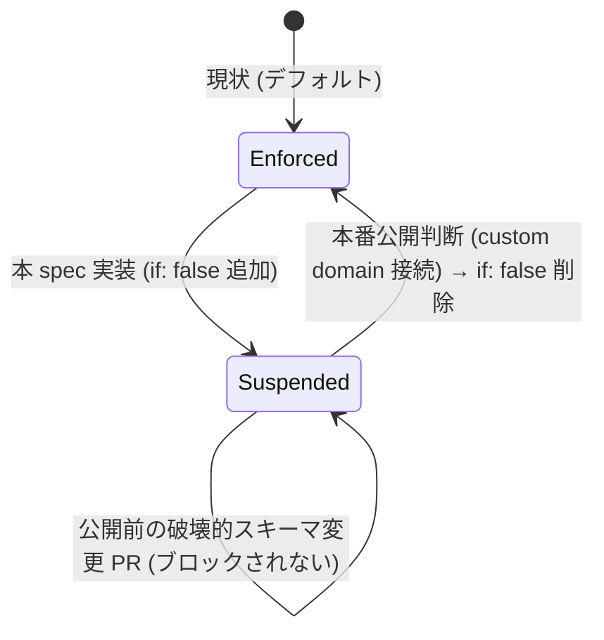
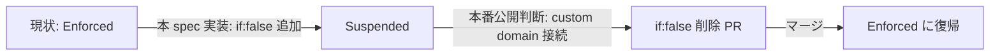

# Technical Design: sitemap-schema-review

## Overview

**Purpose**: 荒牧祭公式サイトの現行サイトマップ (実装済みルート) と Directus スキーマ (`snapshot.yaml` / `product.md` ドメインモデル) を棚卸しし、両者のギャップを特定した上で情報アーキテクチャ・スキーマの再設計方針を明文化する。あわせて、本番未公開期間に限り additive-only 制約を機械強制する `additive-schema-check.yml` を一時停止する。

**Users**: 開発者 (フロントエンド/Directus スキーマ両方を担当) がこの分析結果を参照し、後続 spec の起票・実装優先度判断に利用する。

**Impact**: 本 spec はドキュメント成果物 (本 design.md) に加え、CI 一時停止・既存 6 collection のフィールド削除・統合・`page_home_live` 廃止の実装 (`snapshot.yaml` 編集・migration 作成含む) までを範囲とする (design-review 指摘への回答として、`home-page-expansion` spec 側の改訂に先行して本 spec の実装を優先する方針が確定した)。新設ページ (会場マップ・タイムテーブル・出展一覧・FAQ) の実装は引き続き後続 spec に切り出す。

### Goals
- 実装済みルートと参照 Directus collection の対応関係を一覧化する
- `product.md` ドメインモデルのうち、対応する表示面がフロントエンドに存在しない collection を特定する
- 未実装領域ごとにページ新設要否・URL・ナビゲーション方針を決定する
- 新設ページ方針を実現する上でのスキーマ拡張要否 (additive 範囲か否か) を判定する
- 本番未公開期間限定で additive-only 制約強制 CI を一時停止する設計・実装方針を確定する
- 既存 6 collection (`student_exhibitions`/`sponsors`/`topics`/`festival_meta`/`page_home`/`page_home_live`) のフィールド削除・統合・日本語表示化・画像配信方式の方針を決定する
- `page_home_live` 廃止 + `festival_meta.home_active_variant` フェーズ切替ロジック廃止による `page_home` 一本化方針を決定する
- `page_home.hero_image` (単一) を M2M junction による複数画像対応へ拡張する方針を決定する

### Non-Goals
- 新設ページ (会場マップ・タイムテーブル・出展一覧・FAQ) の実装コード・UI コンポーネント・ビジュアルデザインの確定 (判定結果に基づき別 spec を起票する)
- 新設ページ実現のためのスキーマ追加フィールド/collection の実装 (要否判定のみ、実施は後続 spec)
- RBAC ロール・権限定義の新規設計 (`page_home_live` 廃止に伴う既存 RBAC migration の無効化は本 spec に含むが、新設ページ向け RBAC 設計は含まない)
- `additive-schema-check.yml` の破壊的変更検出ロジック (`frontend/scripts/check-additive-schema.ts`) 自体の変更
- ラベル/コメント等によるトグル式の自動バイパス機構の新設 (`additive-only-schema-check` spec の既存 Non-Goal を継承)
- `page_home` と `festival_meta` の統合 (ヒアリング結果、役割分離を維持する)
- `hero_image` の動画 (MP4/YouTube) 対応 (ヒアリング結果、将来検討事項として本 spec の対象外。複数画像化は Goals に含める)

## Boundary Commitments

### This Spec Owns
- サイトマップ×スキーマの棚卸し・ギャップ分析・再設計方針ドキュメント (本 design.md の Data Models セクション)
- `additive-schema-check.yml` の一時停止条件 (トリガー/ゲーティングへの `if` 条件追加) とその再開手順の定義
- `CLAUDE.md` の additive-only ルール節への一時停止注記
- 既存 6 collection のフィールド削除・統合・命名改善・`page_home_live` 廃止の方針決定と実装 (`snapshot.yaml` 編集・関連 migration 作成を含む)

### Out of Boundary
- `additive-schema-check.yml` の破壊的変更検出ロジック本体、`frontend/scripts/check-additive-schema.ts` — `additive-only-schema-check` spec の所有物のまま変更しない
- `directus-schema-sync.yml` (push-to-main 同期フロー) — 無関係、変更しない
- branch protection の required status checks 設定変更 — 必要になれば repo admin の一次作業として本 spec の外で実施する (`additive-only-schema-check` spec の前例に倣う)
- 新設ページ (会場マップ・タイムテーブル・出展一覧・FAQ) の実装・そのためのスキーマ追加 — 後続 spec に切り出す (既存 6 collection のフィールド削除・統合・`page_home_live` 廃止の実装は本 spec に含む)
- `page_home` と `festival_meta` の統合、`hero_image` の複数化・動画対応 — 本 spec の対象外 (Non-Goals 参照)
- `page-home-friendly-editing`/`home-page-expansion` 両 spec の requirements/design 自体の書き換え — 本 spec は影響を指摘するのみで、実際の改訂は各 spec 側で行う
- `home-page-expansion` spec が対象とする About ページの表示ロジック・レイアウト変更全般 — ただし `festival_meta.admission_fee`/`payment_note` 削除に伴う `festival-overview.tsx` の追従修正 (該当 UI・型参照の除去) のみ例外として本 spec に含む (gap-analysis.md Option A 採用、削除しなければビルドが壊れるための必然的対応)

### Allowed Dependencies
- `directus/schema/snapshot.yaml`, `.kiro/steering/product.md` (読み取りのみ、棚卸しの入力)
- `.github/workflows/additive-schema-check.yml` (一時停止条件のみ変更、検出ロジックには触れない)
- `CLAUDE.md` (additive-only ルール節への注記追加のみ)
- `page-home-friendly-editing`/`home-page-expansion` 両 spec の既存ドキュメント (読み取りのみ、影響分析の入力)

### Revalidation Triggers
- 本番公開判断 (custom domain 接続等) がなされた場合、`additive-schema-check.yml` の一時停止解除タスクを起票する
- 本 spec の再設計方針に基づき新規ページ実装 spec を起票した場合、その spec は本 design.md の Data Models セクションの判定結果を入力として参照する
- `additive-only-schema-check` spec 側でバイパス機構に関する Non-Goal の決定が変更された場合、本 spec の一時停止方式の妥当性を再確認する
- `page_home_live` 廃止方針が承認された場合、`page-home-friendly-editing` spec (実装完了済み) は該当箇所を「廃止済み」として改訂し、`home-page-expansion` spec (tasks-generated) は 2 バリアント運用継続を前提とした Out of Scope 記述を再検証する
- **実行順序**: 本 spec (`page_home_live` 廃止・`snapshot.yaml` 編集等) の実装を優先する。`home-page-expansion` spec のタスク再検証・改訂は本 spec 完了後に行い、本 spec の実装着手をブロックしない

## Architecture

### Existing Architecture Analysis
現行フロントエンドは `frontend/src/lib/*.ts` に Directus アクセスを集約し、各ページはそれを介して collection を参照する。棚卸し結果は Data Models セクション参照。`additive-schema-check.yml` は `directus/schema/snapshot.yaml` 変更 PR に対してのみ発火し、`check` という単一 job (表示名 `Detect breaking snapshot.yaml changes`) が branch protection の required status check として登録されている。

### CI 一時停止の状態遷移

- **停止方法**: `additive-schema-check.yml` の `check` job 直下に `if: false` をコメント付きで追加する。GitHub Actions 上 job は `skipped` conclusion となり、required status check としては充足 (pass) 扱いになる (`frontend-ci-dummy.yml` が依拠するのと同じ GitHub Actions の仕様)。
- **非該当確認**: これはラベル/コメント/リポジトリ変数等による動的トグルではなく、コミットとして Git 履歴に残る明示的な条件変更である。`additive-only-schema-check` spec の Non-Goal 「ラベル/コメントでの自動バイパス機構は設けない」には抵触しない。
- **再開方法**: 同じ行 (`if: false`) を削除する PR を作成する。再開条件は本番公開判断 (aramakisai.com への custom domain 接続、CLAUDE.md 記載の現状「workers.dev サブドメインのみ」からの移行) を基準とする。

## File Structure Plan

### Modified Files
- `.github/workflows/additive-schema-check.yml` — `check` job に `if: false` と、停止理由・再開条件・参照 spec を記したコメントを追加
- `CLAUDE.md` — additive-only ルール節に「本番未公開期間中は `additive-schema-check.yml` を一時停止している。再開条件は `sitemap-schema-review` spec の design.md を参照」の一文を追記
- `frontend/additive-schema-check.workflow.test.ts` — 既存テストが `check` job の `if` フィールドを未検証の場合は変更不要、検証している場合は `if: false` を許容するようアサーションを更新
- `directus/schema/snapshot.yaml` — Data Models セクションの判定に基づき、`student_exhibitions`/`sponsors`/`topics`/`festival_meta`/`page_home` の該当フィールド削除・型変更・追加、`page_home_files` junction 新設、`page_home_live` collection 削除、`meta.translations`/`meta.conditions` 追加を反映
- `directus/migrations/` — `page_home_live` 用 RBAC 付与 migration を無効化する新規 migration ファイル (`{YYYYMMDD}{suffix}-remove-rbac-page-home-live.js`) を追加
- `frontend/src/lib/home-page.ts` / `home-page-types.ts` — `page_home_live`/`home_active_variant` 参照・`HomeActiveVariant` 型を除去し `page_home` 単体参照、`hero_images` (M2M) 取得に変更
- `frontend/src/lib/directus.ts` — `Schema` 型定義から `page_home_live`・削除フィールドを除去、`page_home_files`/`hero_images`・新規 `festival_meta` フィールドを追加
- `frontend/src/lib/festival-meta.ts` — `admission_fee`/`payment_note` の取得・`FestivalOverview` へのマッピングを除去
- `frontend/src/components/festival-overview.tsx` (+ `festival-overview.test.tsx`) — `admissionFee`/`paymentNote` の分割代入・条件付きレンダリングを除去 (gap-analysis.md Option A 採用に伴う追従修正)
- `frontend/src/lib/home-page-types.ts` — `FestivalOverview` から `admissionFee`/`paymentNote` を除去、`TopicSummary` から `linkUrl` を除去、`HomeActiveVariant`/`LiveHomeContent` を除去し `HomePageContent` に一本化
- `frontend/src/lib/topics.ts` (+ `frontend/src/components/topic-card.tsx`, 関連テスト) — `link_url`/`linkUrl` の取得・レンダリングを除去

新規ページファイル (会場マップ・タイムテーブル・出展一覧・FAQ) は本 spec では作成しない。

## System Flows

対象がドキュメント生成 + CI 設定の条件変更のみであり、複雑なランタイムフローを持たないため、CI 一時停止の状態遷移 (上記 Architecture 参照) 以外のフロー図は省略する。

## Data Models

### 現行ルート×Collection 対応表

| ルート | 参照 lib 関数 | Directus collection | 備考 |
|--------|---------------|----------------------|------|
| `/` | `getHomePage` (`lib/home-page.ts`) | `page_home` / `page_home_live` | `festival_meta.home_active_variant` でバリアント切替 (`page-home-friendly-editing` spec 所有) |
| `/about` | `getFestivalMeta` (`lib/festival-meta.ts`) | `festival_meta` | 開催概要 (home-page-expansion spec で新設) |
| `/announcements` | `getAnnouncements` (`lib/announcements.ts`) | `announcements` | 一覧、`readItems` |
| `/announcements/[id]` | `getAnnouncement` (`lib/announcements.ts`) | `announcements` | 個別、`readItem` |
| `/topics` | `lib/topics.ts` | `topics` | 一覧、`readItems` |
| `/topics/[id]` | `lib/topics.ts` | `topics` | 個別、`readItem` |
| `/[slug]` | `getPageBySlug` (`lib/static-page.ts`) | `pages` | 汎用固定ページ (旧 `page_access`/`page_contact`/`page_privacy`/`page_sponsor_guide` の統合先) |

### スキーマ×サイトマップ ギャップ一覧

`product.md` ドメインモデルに定義され、対応する表示面が存在しない collection:

| Collection | 想定利用シーン | 対応表示面 | 判定 |
|------------|----------------|------------|------|
| `student_exhibitions` | 一般来場者 (模擬店情報閲覧) / 学生模擬店担当者 (自己編集) | なし | 未実装 |
| `sponsors` | 一般来場者 (協賛企業紹介) | なし | 未実装 |
| `stages` / `performance_slots` | 一般来場者 (ステージ企画確認) | なし | 未実装 |
| `map_areas` | 一般来場者 (会場マップ) | なし | 未実装 |
| `time_slots` | 一般来場者 (タイムテーブル) | なし | 未実装 (`stages`/`performance_slots` と組み合わせて使用) |
| `faq_items` | 一般来場者 (FAQ) | なし | 未実装 |

参考事例 (五月祭 `/visitor/map`・`/visitor/project/`・`/visitor/timetable`、11月祭 `/faq`・`/kinds`) は上記いずれの collection にも対応ページを持つ。

### 再設計方針 (ページ新設要否)

| 領域 | 新設要否 | 想定 URL | ナビゲーション |
|------|----------|----------|----------------|
| 会場マップ (`map_areas`) | 要 | `/map` | 共通ヘッダーに追加 |
| タイムテーブル (`stages`/`performance_slots`/`time_slots`) | 要 | `/timetable` | 共通ヘッダーに追加 |
| 出展一覧・検索 (`student_exhibitions`/`sponsors`) | 要 | `/exhibitions` | 共通ヘッダーに追加、`map_areas.booth_number` で相互リンク |
| FAQ (`faq_items`) | 要 | `/faq` | フッター/ヘッダーいずれかに追加 (11月祭 `/faq` 前例) |

`home-page-expansion` spec の Boundary Context (`/about`, `/topics` 等) とは重複しない領域のみを対象とした。各領域の詳細設計・実装は本 spec 完了後に個別 spec として起票する。

### スキーマ拡張要否判定

| 領域 | 既存フィールドで充足可否 | 追加が必要な要素 | additive 適合 |
|------|---------------------------|-------------------|----------------|
| 会場マップ | 部分的 (`map_areas`/`booth_number` は既存) | マップ画像・座標フィールドの要否は個別 spec で精査 | 適合見込み (追加のみ) |
| タイムテーブル | 部分的 (`time_slots`/`performance_slots`/`stages` は既存) | フロントエンド表示ロジックのみ、スキーマ追加は現時点で不要見込み | 適合 (変更不要) |
| 出展一覧・検索 | 部分的 (`student_exhibitions`/`sponsors` は既存) | 検索・絞り込み用フィールド (カテゴリ等) の要否は個別 spec で精査 | 適合見込み (追加のみ) |
| FAQ | 充足 (`faq_items` は既存) | なし | 適合 (変更不要) |

いずれの領域も現時点で collection/field 削除・型変更を要する提案はなく、additive-only ルールの通常運用 (Requirement 4) の範囲で対応可能と判定する。Requirement 5 の一時停止は、個別 spec 進行中に想定外の破壊的変更が必要になった場合の保険的措置と位置づける。

### 既存 collection フィールド簡素化方針 (Requirement 6)

全 collection 共通方針:
- **日本語表示化**: 実カラム名は英語のまま維持し、Directus `meta.translations` (フィールド単位) および collection の `meta.translations`/`display_template` で日本語ラベルを付与する。additive 範囲 (meta 変更のみ) で対応可能。
- **条件付き表示**: `meta.conditions` (Directus interface 機能) で `type`/`category` 等の値に応じて無関係フィールドを非表示にする。スキーマ変更不要、フロントエンドにも影響なし。
- **画像 webp 配信**: Directus Asset Transformations (`?format=webp` 等のオンザフライ変換クエリパラメータ) を `frontend/src/lib/directus-asset-url.ts` (`toAssetUrl`) 側で付与する。スキーマ変更不要、additive 範囲外の変更も不要。

collection ごとの判定:

| Collection | フィールド | 判定 | 内容 | additive 適合 |
|------------|-----------|------|------|----------------|
| `student_exhibitions` | `content` | 削除 | 一覧用 `description` と役割重複、未使用 | 不適合 (削除) |
| `student_exhibitions` | `location` | 削除 | `area_id`/`booth_label` (エリア+ラベル) と役割重複 | 不適合 (削除) |
| `student_exhibitions` | `images` (json/files) | 型変更 | 単一画像で十分、`image` (uuid/file-image) に変更 | 不適合 (型変更) |
| `sponsors` | `type` choices | 表示名変更 | 「広告協賛(ad)」「地域協賛(旧 協賛/sponsor)」「出店協賛(旧 キッチンカー/food_truck)」「その他(other)」に整理。value は既存を維持し text のみ変更 | 適合 (meta のみ) |
| `topics` | `link_url` | 削除 | 用途不明・未使用と判定 | 不適合 (削除) |
| `topics` | `body` | interface 変更 | `input-multiline` → `input-rich-text-html` (WYSIWYG化)。`type: text` は変更なし | 適合見込み (data_type 変更なし、既存データの HTML エスケープ要確認) |
| `festival_meta` | `name` | 維持 + 新規追加 | 祭名として維持。新規フィールド (例: `site_title`) を追加し `<title>` タグ用途と分離 | 適合 (追加のみ) |
| `festival_meta` | `admission_fee` | 削除 | 不要 (運用上表示しない方針) | 不適合 (削除) |
| `festival_meta` | `payment_note` | 削除 | 不要 | 不適合 (削除) |
| `festival_meta` | `parking_capacity` | 削除 | 不要 (`parking_map` は維持) | 不適合 (削除) |
| `page_home` | `embed_url` | 削除 | 用途不明・未使用と判定 | 不適合 (削除) |

「不適合 (削除/型変更)」と判定した項目は additive-only ルールに反するため、Requirement 5 の CI 一時停止期間中の対応が前提となる。実際の `snapshot.yaml` 編集・データ移行 (`sponsors.type` 等の既存レコード値の整合確認を含む) は後続タスクで実施する。

### page_home / page_home_live 統合方針 (Requirement 7)

**結論**: `page_home_live` を廃止し `page_home` へ一本化する。`festival_meta.home_active_variant` によるフェーズ切替ロジックも廃止する (ヒアリング結果「開催前後でコンテンツをほとんど変えない」ため、切替自体が不要と判断)。

| 項目 | 現行 (`page-home-friendly-editing` spec) | 変更後 |
|------|---------------------------------------------|--------|
| Collection 構成 | `page_home` (pre_event 用) + `page_home_live` (直前〜開催後用) の 2-singleton | `page_home` 単体 |
| 切替ロジック | `festival_meta.home_active_variant` (select) で `HomePageService.getActiveVariant()` が参照先を分岐 | 廃止。`page_home` を常時参照 |
| フィールド構成 | `page_home`/`page_home_live` とも `hero_image` (単一, uuid/file-image)・`hero_message`・`embed_url` で同一 | `embed_url` 削除 + `hero_image` (単一) を `hero_images` (M2M, 複数画像) へ拡張した構成 |
| RBAC | `page_home_live` 用 CRUD 権限付与 migration (`{YYYYMMDD}{suffix}-rbac-page-home-live.js`) | `page_home_live` 廃止に伴い、当該 migration を無効化する新規 migration (削除 or ロールバック) が必要 |
| `festival_meta.home_active_variant` | フィールド定義あり (`select-dropdown`) | 削除 (不適合、CI 一時停止期間中の対応が前提) |

**影響**:
- `page-home-friendly-editing` spec (実装完了済み) の設計 (2-singleton・RBAC migration) は本方針により置き換えられる。同 spec 側で「廃止済み」の改訂が必要。
- `home-page-expansion` spec (未実装, tasks-generated) は Boundary Context の Out of Scope に「`page_home`/`page_home_live`/`home_active_variant` によるバリアント切替ロジック自体の変更 (既存のまま利用)」と明記しており、本方針はこの前提を覆す。同 spec は本 design.md 確定後にタスク・設計を再検証する必要がある。
- `frontend/src/lib/home-page.ts` の `getActiveVariant`/`page_home_live` 参照ロジック、`home-page-types.ts` の `HomeActiveVariant` 型は本方針の実施時に不要となる (実装は後続タスク)。

**`hero_image` 複数化 (`hero_images`) の設計方針**:

`home-page-expansion` spec が `topics`/`announcements` の複数添付ファイル化で採用した M2M junction パターンをそのまま踏襲する。

| 要素 | 内容 |
|------|------|
| 新規 junction collection | `page_home_files` (`topics_files`/`announcements_files` と同一命名パターン) |
| junction 構造 | `id` (PK), `page_home_id` (FK → `page_home`), `directus_files_id` (FK → `directus_files`), `sort` |
| `page_home` 側フィールド | `hero_images` (`type: alias`, `interface: list-m2m`) — `topics.attachments` と同じ形 |
| 廃止フィールド | `hero_image` (単一, uuid/file-image) を削除 |
| 参照整合性 | junction 行は `page_home` 削除時にカスケード削除 (`topics_files` の既存方針を踏襲) |
| additive 適合性 | junction collection・`hero_images` field の**追加**自体は additive。既存 `hero_image` の**削除**が不適合部分であり、Requirement 5 の一時停止期間中の対応が前提 |

フロントエンド側は `hero_images` を deep-fields (`hero_images.directus_files_id.*`) で取得し配列としてレンダリングする (`topics.attachments` の取得パターンに倣う)。動画 (MP4/YouTube) 対応は本方針に含めず、将来 `hero_images` とは別軸の検討事項として残す。

## Testing Strategy

- **CI 設定変更の検証**: `frontend/additive-schema-check.workflow.test.ts` を実行し、`if: false` 追加後もワークフロー YAML のパースおよび既存アサーションが通ることを確認する。アサーションが `if` フィールドの不在を前提にしている場合はテスト自体を更新する。
- **ドキュメント整合性の検証**: 本 design.md の対応表 (ルート×collection、ギャップ一覧、フィールド簡素化方針) が `frontend/src/app/` の実ファイル構成および `directus/schema/snapshot.yaml` の実フィールド定義と一致することを目視確認する (自動テスト対象外)。
- **後続タスクでの検証観点 (実施は本 spec 範囲外)**: `sponsors.type` の value 維持方針が既存レコードと整合するか、`topics.body` WYSIWYG 化で既存プレーンテキストデータの表示崩れがないか、`page_home_live` 廃止後に `frontend/src/lib/home-page.test.ts` 等の既存テストが `page_home` 単体を前提に更新されるか。

## Migration Strategy

破壊的変更検出 CI の一時停止・再開のみが対象であり、データ移行は発生しない。

ロールバックトリガー: 一時停止中に意図しない破壊的変更が誤マージされた場合は、`additive-only-schema-check` spec の既存運用 (branch protection admin override 前提) と同様、手動レビューで検知し revert する。自動ロールバック機構は設けない。
