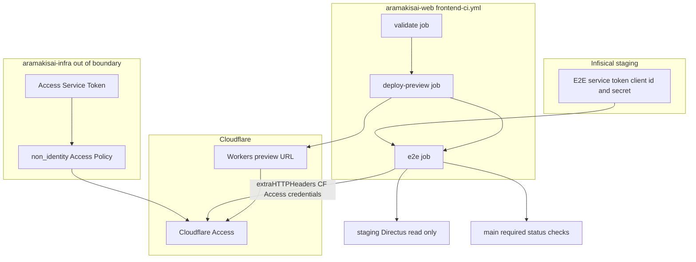
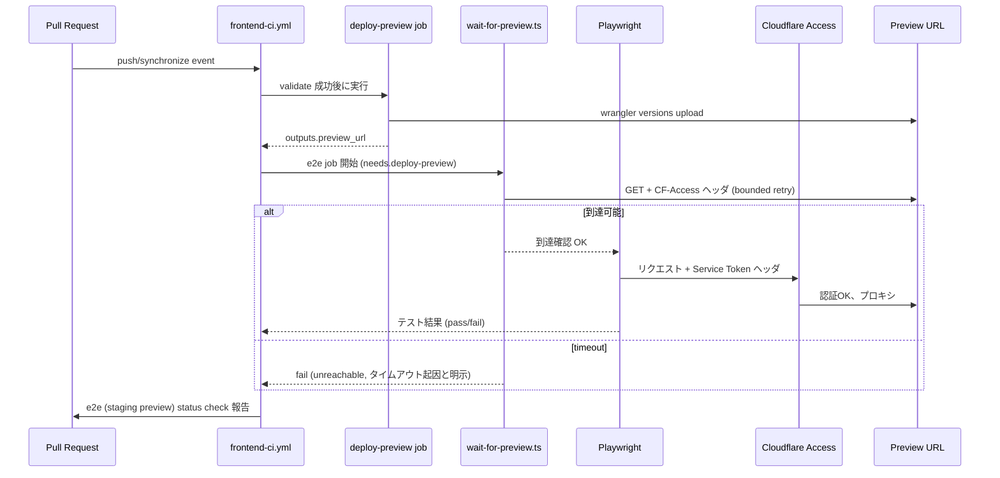

# Technical Design Document

## Overview

本機能は、PR ごとに `frontend-ci.yml` の `deploy-preview` job が払い出す Cloudflare Workers プレビュー URL に対し、Playwright による実ブラウザ E2E テストを自動実行し、その結果を `main` へのマージ前ゲート（required status check）とする CI コンポーネントを提供する。対象ユーザーはリポジトリの開発者・管理者であり、PR マージ前にビルド成果物が実際のブラウザで動作することを機械的に保証する。

プレビュー URL（`aramakisai-web.aramakisai.workers.dev`）は姉妹リポジトリ `aramakisai-infra` の Terraform で Cloudflare Access（Authentik OIDC）保護下にあるため、本機能は Playwright クライアントが Cloudflare Access の Service Token を用いて認証バイパスする仕組みも含む。この Service Token の発行自体は `aramakisai-infra` 側の変更に依存する（Boundary Commitments 参照）。

### Goals
- `frontend/` に Playwright ベースの E2E テスト基盤を導入し、local/CI 両方で任意の base URL を対象に実行できるようにする
- `deploy-preview` job のプレビュー URL に対して E2E job を自動連結し、Cloudflare Access を Service Token でバイパスして到達する
- E2E job の結果を `main` branch protection の required status check に組み込み、失敗 PR のマージを機械的にブロックする
- 失敗時の診断情報（trace/screenshot）を CI アーティファクトとして残す

### Non-Goals
- 個別ページの UI 機能実装（本機能は検証基盤のみ）
- 本番環境（`aramakisai.com`）に対する E2E 実行
- `aramakisai-infra` 側 Terraform（Service Token・Access Policy 追加）の実装そのもの — 本 spec は依存として明記するのみで、実装は別リポジトリの PR として扱う
- Directus 連携ページの実装（現状 `page.tsx` は静的表示のみ。連携ページ追加時のテスト拡張パターンのみ定義する）

## Boundary Commitments

### This Spec Owns
- `frontend/` 配下の Playwright 設定・E2E テストスイート（`playwright.config.ts`, `frontend/e2e/**`）
- プレビュー到達待ちユーティリティ（`frontend/scripts/wait-for-preview.ts`）とその単体テスト
- `.github/workflows/frontend-ci.yml` への `e2e` job 追加（`deploy-preview` の job-level output 追加を含む）
- `.github/workflows/frontend-ci-dummy.yml` への対応ミラー job 追加
- `main` branch protection `required_status_checks.contexts` への新規 context 追加
- CI 側での Cloudflare Access Service Token ヘッダ付与ロジック（Infisical から取得した値を Playwright に渡す部分）

### Out of Boundary
- `aramakisai-infra` リポジトリの Terraform 実装（`cloudflare_zero_trust_access_service_token` リソース、`non_identity` Access Policy の追加）。本 spec はこれを前提とする仕様のみ定義し、実装は infra 側の別 PR に委ねる
- Infisical staging 環境への Service Token client_id/secret の実際の投入（infra 側 Terraform apply 後の運用作業）
- Directus からデータを取得する画面自体の実装
- Authentik / Cloudflare Access の一般利用者向け認証フローの変更

### Allowed Dependencies
- `deploy-preview` job が出力するプレビュー URL（job-level `outputs.preview_url` として本 spec が追加）
- `aramakisai-infra` が発行する Cloudflare Access Service Token（Infisical `staging` 環境の secret として供給される前提）
- 既存の Infisical 認証パターン（`INFISICAL_CLIENT_ID`/`INFISICAL_CLIENT_SECRET`、fork PR では利用不可）
- `repo-governance` spec が確立した branch protection ベースライン、`ci-pipeline-audit` spec が確立した dummy workflow ミラーパターン

### Revalidation Triggers
- `deploy-preview` job の step id（`upload_preview`）や output 形式が変更された場合
- Cloudflare Access Service Token のローテーション・失効、または Access Policy 構成の変更
- `frontend-ci.yml` / `frontend-ci-dummy.yml` の job 名変更（branch protection contexts との同期が必要）
- Directus 連携ページが新規追加された場合（Requirement 4 のテスト拡張が必要になる）

## Architecture

### Existing Architecture Analysis
- `frontend-ci.yml` は `validate → deploy-preview`（PR）/ `validate → deploy-prod`（main push）の直列構成。`deploy-preview` は fork PR で secrets 非露出のためスキップされる（`ci-pipeline-audit` で監査済み）
- `frontend-ci-dummy.yml` は `frontend/**` 未変更 PR で `frontend-ci.yml` と同名の job を常に成功報告し、branch protection の path-filter 制約を回避する
- `main` branch protection は `required_status_checks.contexts` に3件（`type-check / lint / test / build`, `deploy preview (Workers)`, `Detect breaking snapshot.yaml changes`）を持つ

### Architecture Pattern & Boundary Map



**Architecture Integration**:
- Selected pattern: 既存 `frontend-ci.yml` に直列 job を追加する CI パイプライン拡張パターン（研究の結果、`workflow_run`/`repository_dispatch` より PR 紐付けが単純で `required_status_checks` との相性が良いため採用。詳細は `research.md` の Architecture Pattern Evaluation 参照）
- Domain/feature boundaries: `aramakisai-web` は CI ワークフローと E2E テストコードのみ所有。Cloudflare Access のポリシー・Service Token 発行は `aramakisai-infra` の責務のまま変更しない
- Existing patterns preserved: `validate`/`deploy-preview` の fork PR 除外方式、`frontend-ci-dummy.yml` によるミラーパターン、`frontend/scripts/*.ts` + `*.test.ts` によるロジックのテスト可能化
- New components rationale: `wait-for-preview.ts`（プレビュー到達待ちの再試行境界を明確化するため独立スクリプト化）、`e2e/` テストディレクトリ（画面追加に伴う拡張を局所化するため）
- Steering compliance: CI ロジックをワークフロー YAML に直書きせず `frontend/scripts/*.ts` に切り出す方針（[[tech]]）、Edge Runtime 制約は E2E 実行環境（Node CI）には適用されないことを明記

### Technology Stack

| Layer | Choice / Version | Role in Feature | Notes |
|-------|------------------|------------------|-------|
| E2E テストランナー | `@playwright/test` ^1.61 | ブラウザ自動化・アサーション・trace/screenshot 収集 | Next.js 15 / React 19 との既知の非互換なし（`research.md` 参照） |
| CI 実行基盤 | GitHub Actions（既存 `frontend-ci.yml` 拡張） | `deploy-preview` 完了後に E2E job を実行 | 新規ワークフローファイルは作成しない |
| 認証バイパス | Cloudflare Access Service Token（`CF-Access-Client-Id`/`CF-Access-Client-Secret` ヘッダ） | プレビュー URL への到達 | 発行元は `aramakisai-infra`（Out of Boundary） |
| Secret 管理 | Infisical（既存 `staging` 環境） | Service Token client_id/secret の CI への注入 | 既存 `deploy-preview` の `infisical run` パターンを再利用 |

## File Structure Plan

### Directory Structure
```
frontend/
├── playwright.config.ts        # baseURL/extraHTTPHeaders/retries/trace を環境変数駆動で設定
├── e2e/
│   └── top-page.spec.ts        # トップページ到達性テスト (3.1)。画面追加時はこのディレクトリに1画面1ファイルで追加 (3.2, 3.3)
├── scripts/
│   ├── wait-for-preview.ts      # プレビューURL到達待ち: bounded retry + timeout (2.2, 2.4, 7.3, 7.4)
│   └── wait-for-preview.test.ts # 単体テスト
├── package.json                 # "test:e2e" script 追加 (1.3)
└── frontend-ci.workflow.test.ts # 既存ファイルに e2e job 構造の検証ケースを追加
```

### Modified Files
- `.github/workflows/frontend-ci.yml` — `deploy-preview` job に `outputs.preview_url` を追加。新規 `e2e` job を `needs: deploy-preview` で追加
- `.github/workflows/frontend-ci-dummy.yml` — `e2e` job と同名のミラー job を追加（branch protection の path-filter 回避パターンを維持）
- `frontend/package.json` — `devDependencies` に `@playwright/test` を追加、`scripts.test:e2e` を追加

> `aramakisai-infra` 側の `terraform/access.tf` 変更（Service Token・Policy 追加）は Out of Boundary のため本ファイル構造には含めない。具体的なリソース定義例は Supporting References に記載する

## System Flows



**Key Decisions**:
- fork PR の場合 `deploy-preview` 自体がスキップされ、`needs: deploy-preview` を持つ `e2e` job は GitHub Actions のデフォルト `success()` 条件により自動スキップされる（追加の `if` 分岐不要）
- 到達待ち（`wait-for-preview.ts`）と実際のテスト実行（Playwright）を分離し、「Access/未デプロイに起因する失敗」と「フロントエンドのバグに起因する失敗」を診断メッセージ上で区別する（要件 2.4, 2.7, 4.3）

## Requirements Traceability

| Requirement | Summary | Components | Interfaces | Flows |
|-------------|---------|-------------|------------|-------|
| 1.1-1.5 | Playwright 基盤・独立 script・local 実行 | Playwright Test Suite | `playwright.config.ts` | - |
| 2.1-2.5 | deploy-preview 連結・fork skip・到達待ち | CI Workflow Integration, Wait-for-Preview Script | job outputs, CLI script | System Flows |
| 2.6, 2.7, 8.1-8.5 | Cloudflare Access Service Token バイパス | Wait-for-Preview Script, Playwright Test Suite, (Out of Boundary) Infra Service Token | extraHTTPHeaders, Infisical secrets | System Flows |
| 3.1-3.4 | 画面遷移カバレッジ | Playwright Test Suite (`e2e/*.spec.ts`) | Test spec ファイル規約 | - |
| 4.1-4.4 | Directus 連携データ検証（拡張可能） | Playwright Test Suite（将来追加分） | Directus-dependent test 規約 | - |
| 5.1-5.4 | branch protection 統合 | CI Workflow Integration, Branch Protection Config | `gh api` PUT | - |
| 6.1-6.3 | 失敗時診断情報 | CI Workflow Integration（artifact upload） | `actions/upload-artifact` | System Flows |
| 7.1-7.4 | 副作用抑制・耐障害性 | Playwright Test Suite, Wait-for-Preview Script | retries/timeout 設定 | System Flows |

## Components and Interfaces

| Component | Domain/Layer | Intent | Req Coverage | Key Dependencies (P0/P1) | Contracts |
|-----------|---------------|--------|---------------|--------------------------|-----------|
| Playwright Test Suite | Test | プレビュー URL 上の画面遷移・データ描画を検証 | 1, 2.6, 2.7, 3, 4, 7 | Wait-for-Preview Script (P0), Cloudflare Access (P0) | Batch |
| Wait-for-Preview Script | CI Utility | プレビュー URL の到達待ちを bounded retry で行う | 2.2, 2.4, 7.3, 7.4 | Cloudflare Access (P0) | Service |
| CI Workflow Integration | CI/CD | `deploy-preview` と E2E job を連結し、結果を status check として報告 | 2.1, 2.3, 2.5, 5, 6 | deploy-preview job (P0), GitHub branch protection (P0) | Batch |
| Branch Protection Config | Governance | E2E job の結果をマージ前ゲートとして強制 | 5 | CI Workflow Integration (P0) | API |
| Cloudflare Access Service Token (Out of Boundary) | External | Playwright からの Access バイパスを許可 | 8 | `aramakisai-infra` Terraform (External) | External |

### Test / CI Utility

#### Playwright Test Suite

| Field | Detail |
|-------|--------|
| Intent | プレビュー URL に対しトップページ到達性・（将来）Directus 連携データ描画を検証する |
| Requirements | 1.1, 1.2, 1.4, 1.5, 2.6, 2.7, 3.1, 3.2, 3.3, 3.4, 4.1, 4.2, 4.3, 4.4, 7.1, 7.2 |

**Responsibilities & Constraints**
- `playwright.config.ts` の `use.baseURL` を `process.env.E2E_BASE_URL` から取得し、local（`http://localhost:3000`）と CI（プレビュー URL）を切り替える
- `use.extraHTTPHeaders` に `CF-Access-Client-Id`/`CF-Access-Client-Secret` を設定（値が未設定の場合はヘッダを付与しない — local 実行時は Access 保護がないため不要）
- `e2e/*.spec.ts` は1ファイル1画面の規約。新規画面追加時はディレクトリへのファイル追加のみで CI 側の変更は不要（3.3）
- 書き込み系操作（フォーム送信等）を伴うテストは作成しない（7.1, 7.2）。Directus 連携テストは GET 相当の描画確認のみ

**Dependencies**
- Outbound: Wait-for-Preview Script — テスト実行前にプレビューが到達可能であることの前提 (P0)
- External: Cloudflare Access — Service Token ヘッダでの認証 (P0)
- External: staging Directus — 連携ページのデータ取得元 (P1, 現状は連携ページ未実装のため潜在的依存)

**Contracts**: Service [ ] / API [ ] / Event [ ] / Batch [x] / State [ ]

##### Batch / Job Contract
- Trigger: `pnpm test:e2e`（`e2e` job のステップ、または local 実行）
- Input / validation: `E2E_BASE_URL`（必須）、`CF_ACCESS_CLIENT_ID`/`CF_ACCESS_CLIENT_SECRET`（CI のみ必須、local では未設定可）
- Output / destination: JUnit/HTML レポート（CI アーティファクト）、失敗時 trace/screenshot
- Idempotency & recovery: 読み取り専用のため再実行は常に安全。`retries: process.env.CI ? 2 : 0` で一時的な flake を吸収

**Implementation Notes**
- Integration: `frontend/e2e/top-page.spec.ts` が最小実装。Directus 連携ページ追加時は同ディレクトリに追加し、テスト冒頭コメントで依存 collection を明記する規約とする（4.4）
- Validation: CI では `npx playwright install --with-deps chromium` を事前実行
- Risks: Cloudflare Access の Service Token が失効/未設定の場合、全テストが到達不能で失敗する — Wait-for-Preview Script 側で事前に検出し、Playwright 実行前に明確なエラーとして落とす

---

#### Wait-for-Preview Script

| Field | Detail |
|-------|--------|
| Intent | プレビュー URL が Cloudflare Access 経由で到達可能になるまで bounded retry で待機し、Access 拒否とネットワーク未到達を区別して報告する |
| Requirements | 2.2, 2.4, 2.7, 7.3, 7.4, 8.4, 8.5 |

**Responsibilities & Constraints**
- 入力: プレビュー URL、Service Token ヘッダ値、最大試行回数/全体タイムアウト（環境変数または CLI 引数）
- 出力: 到達確認成功 (exit 0) / タイムアウト (exit 1, "unreachable: timeout") / Access 拒否 (exit 1, "blocked by Cloudflare Access") を明確に区別する終了コード・メッセージ
- Service Token 未設定（fork PR で secrets が無い状況）ではそもそも呼び出されない（`e2e` job 自体がスキップされるため。8.4）

**Dependencies**
- External: Cloudflare Access 経由のプレビュー URL — 到達確認対象 (P0)

**Contracts**: Service [x] / API [ ] / Event [ ] / Batch [ ] / State [ ]

##### Service Interface
```typescript
interface WaitForPreviewOptions {
  url: string;
  headers: Record<string, string>;
  timeoutMs: number;
  maxAttempts: number;
}

type WaitForPreviewResult =
  | { status: "reachable" }
  | { status: "timeout"; attempts: number }
  | { status: "access-denied"; httpStatus: number };

declare function waitForPreview(
  options: WaitForPreviewOptions
): Promise<WaitForPreviewResult>;
```
- Preconditions: `url` は http(s) URL、`headers` に Service Token を含む（CI 実行時）
- Postconditions: `reachable` を返した場合のみ後続の Playwright 実行に進む
- Invariants: `maxAttempts` 到達前に `access-denied`（HTTP 403 等 Access 起因のステータス）を検出した場合は即座に打ち切り、無駄なリトライをしない

**Implementation Notes**
- Integration: `e2e` job 内で `pnpm exec tsx scripts/wait-for-preview.ts` として呼び出す。成功後に `pnpm test:e2e` を実行する2ステップ構成
- Validation: `wait-for-preview.test.ts` でモックレスポンス（200 / 403 / タイムアウト）ごとの分岐を単体テストする
- Risks: Cloudflare Access が返す拒否時のステータスコード・レスポンス形式が将来変更される可能性 — 判定ロジックは HTTP ステータスコードの範囲判定に留め、レスポンスボディの厳密パースには依存しない

---

### CI/CD

#### CI Workflow Integration

| Field | Detail |
|-------|--------|
| Intent | `deploy-preview` の出力を受け取り E2E job を実行し、結果を status check として報告する |
| Requirements | 2.1, 2.3, 2.5, 5.1, 5.2, 6.1, 6.2, 6.3 |

**Responsibilities & Constraints**
- `frontend-ci.yml` の `deploy-preview` job に `outputs: { preview_url: ${{ steps.upload_preview.outputs.url }} }` を追加
- 新規 `e2e` job: `needs: deploy-preview`、`env` に `E2E_BASE_URL: ${{ needs.deploy-preview.outputs.preview_url }}`。Infisical 経由で `CF_ACCESS_CLIENT_ID`/`CF_ACCESS_CLIENT_SECRET` を取得（`deploy-preview` と同じ `INFISICAL_CLIENT_ID`/`INFISICAL_CLIENT_SECRET` を用いて `infisical run --env=staging` 実行）
- 失敗時に `actions/upload-artifact` で `playwright-report/`（trace/screenshot 含む）をアップロードするステップを `if: failure()` で追加
- `frontend-ci-dummy.yml` に同名 job（`e2e`, ジョブ名文字列は `frontend-ci.yml` と完全一致させる）を追加し、`frontend/**` 未変更 PR で required status check が pending のまま残らないようにする

**Dependencies**
- Inbound: `deploy-preview` job — プレビュー URL の供給元 (P0)
- Outbound: `main` branch protection — status check 名の登録先 (P0)
- External: Infisical（staging 環境）— Service Token secret の供給元 (P0)

**Contracts**: Service [ ] / API [ ] / Event [ ] / Batch [x] / State [ ]

##### Batch / Job Contract
- Trigger: `deploy-preview` job の成功完了（`pull_request` イベントの非 fork PR のみ）
- Input / validation: `needs.deploy-preview.outputs.preview_url` が空でないこと
- Output / destination: GitHub Actions job status（`e2e (staging preview)` という job 名で status check に反映）、失敗時アーティファクト
- Idempotency & recovery: 同一 PR への再 push で新しい workflow run が実行され、古い run の状態は上書きされる（既存 `validate`/`deploy-preview` と同じ挙動）

**Implementation Notes**
- Integration: 既存 `frontend-ci.workflow.test.ts` に `e2e` job の存在・`needs`・job 名一致（`frontend-ci-dummy.yml` との比較）を検証するケースを追加する（[[tech]] の CI ロジックテスト方針に整合）
- Validation: 追加後に手動 PR で実際にステータスが `e2e (staging preview)` として表示されることを確認する
- Risks: `frontend-ci.yml` と `frontend-ci-dummy.yml` の job 名不一致は required status check の永久 pending を招く（`ci-pipeline-audit` で確認済みの既知の失敗モード）

---

#### Branch Protection Config

| Field | Detail |
|-------|--------|
| Intent | `e2e` job の結果を `main` へのマージ前提条件にする |
| Requirements | 5.1, 5.2, 5.3, 5.4 |

**Responsibilities & Constraints**
- `gh api -X PUT repos/aramakisai/aramakisai-web/branches/main/protection` の `required_status_checks.contexts` に新規 job 名（例: `e2e (staging preview)`）を追加する。既存3件（`type-check / lint / test / build`, `deploy preview (Workers)`, `Detect breaking snapshot.yaml changes`）は維持する
- 適用後に同エンドポイントを GET し、`contexts` に4件揃っていることを確認する（`ci-pipeline-audit` design.md で確立した検証手順を踏襲）

**Contracts**: Service [ ] / API [x] / Event [ ] / Batch [ ] / State [ ]

##### API Contract
| Method | Endpoint | Request | Response | Errors |
|--------|----------|---------|----------|--------|
| PUT | `/repos/aramakisai/aramakisai-web/branches/main/protection` | `required_status_checks.contexts` に4件目を追加した完全な protection 設定 | 更新後の protection 設定 | 403（権限不足）, 422（不正なペイロード） |

**Implementation Notes**
- Integration: 既存3件の設定内容（`enforce_admins`, `required_pull_request_reviews` 等）を GET で取得した上で `contexts` のみ追記し、他フィールドを保持したまま PUT する（部分更新ではなく全体を送る API 仕様のため）
- Validation: GET で4件になっていることを再確認
- Risks: fork PR では `e2e` job 自体がスキップされる（`deploy-preview` 同様）。`required_status_checks` は「スキップされた場合そのまま扱う」設定であるため、fork PR がこの理由だけで永久ブロックされないことを実際の fork PR（または dummy 相当の仕組み）で確認する（5.3）

## Error Handling

### Error Strategy
E2E パイプラインの失敗は3種類に分類し、それぞれ異なる診断メッセージ・アーティファクトを残す。

### Error Categories and Responses
- **到達不可（Access/ネットワーク起因）**: `wait-for-preview.ts` が bounded retry の末にタイムアウトした場合、または Access 拒否ステータスを検出した場合 → "unreachable: timeout" / "blocked by Cloudflare Access" を明示し、後続の Playwright 実行はスキップする（2.4, 2.7, 8.5）
- **フロントエンドのバグ**: 到達は成功したがテストアサーションが失敗（クライアント側例外・想定要素の欠如）→ Playwright の trace/screenshot をアーティファクト化し、失敗テスト名・対象ルートを job summary に出力する（3.4, 6.1, 6.2）
- **staging Directus 起因**: Directus 連携テストが Directus 側のエラー・タイムアウトで失敗した場合、フロントエンド不具合と区別できるようテストコード内でレスポンスステータスを検査し、専用のエラーメッセージ（例: "directus dependency error"）を投げる（4.3）

### Monitoring
CI job のログと `actions/upload-artifact` によるアーティファクトが一次情報源。恒常的な監視ダッシュボードは本 spec のスコープ外（Non-Goals）。

## Testing Strategy

- **Unit Tests**: `wait-for-preview.test.ts`（到達成功/タイムアウト/Access拒否の3分岐）、既存 `frontend-ci.workflow.test.ts` への `e2e` job 構造・`frontend-ci-dummy.yml` ミラー整合ケースの追加
- **E2E Tests**: `e2e/top-page.spec.ts`（トップページ到達性）。今後の画面追加時は同パターンで追加
- **Integration Tests**: 実際に PR を作成し `deploy-preview` → `e2e` job が連結して実行され、`e2e (staging preview)` ステータスが表示されることを手動確認する（初回導入時の検証手順として tasks.md 側で扱う）

## Security Considerations

- Cloudflare Access Service Token の client_id/secret は Infisical 経由でのみ CI に注入し、リポジトリに平文でコミットしない（8.3）
- fork PR では `deploy-preview` がスキップされるため secrets を要求する `e2e` job も同様にスキップされ、fork からのワークフロー実行に Service Token が渡ることはない（8.4、既存 `ci-pipeline-audit` の fork 非露出方針と整合）
- Service Token はテスト専用の非対話的アクセスに限定され（`non_identity` policy）、既存の人間向け Authentik ログインポリシーとは独立して失効・ローテーション可能（8.5 の fail-closed 挙動は `wait-for-preview.ts` の Access 拒否検出に依拠する）

## Supporting References

### `aramakisai-infra` 側で追加が必要な Terraform（参考、本 spec の実装範囲外）
```terraform
resource "cloudflare_zero_trust_access_service_token" "e2e" {
  account_id = var.cloudflare_account_id
  name       = "aramakisai-web E2E CI"
}

resource "cloudflare_zero_trust_access_policy" "allow_e2e_service_token" {
  account_id     = var.cloudflare_account_id
  application_id = cloudflare_zero_trust_access_application.aramakisai_web_workers_dev.id
  name           = "Allow via E2E Service Token"
  precedence     = 2
  decision       = "non_identity"

  include {
    service_token = [cloudflare_zero_trust_access_service_token.e2e.id]
  }
}
```
`client_id`/`client_secret` は作成時にしか取得できないため、`terraform apply` 直後に Infisical `staging` 環境へ手動投入する運用手順が別途必要（本 spec の Out of Boundary）。
