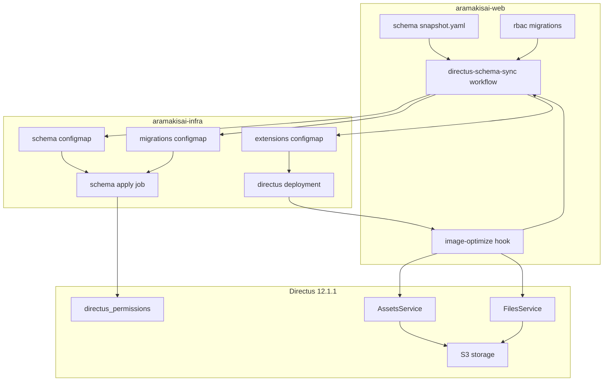
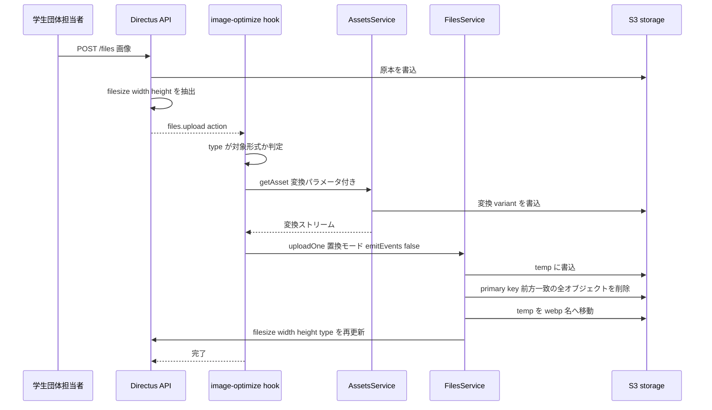
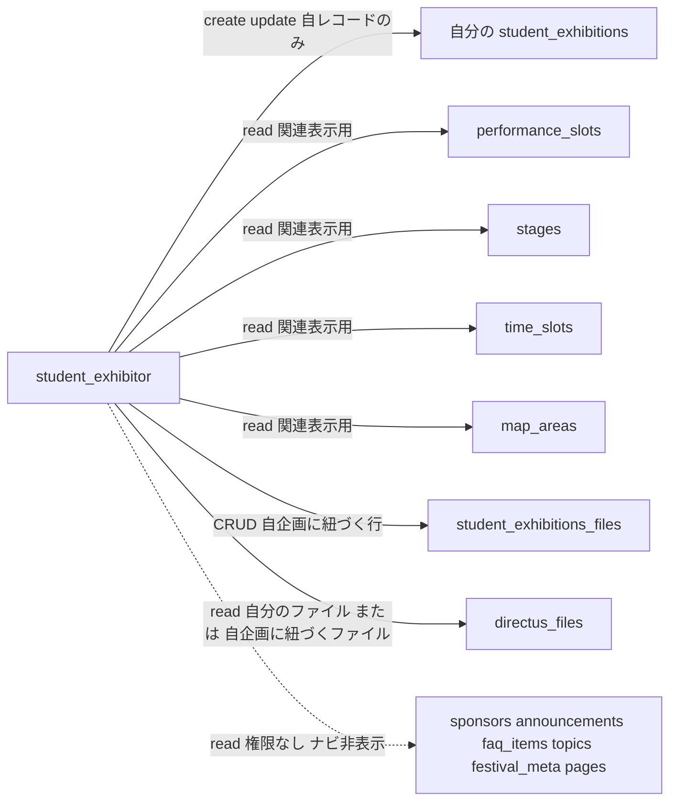
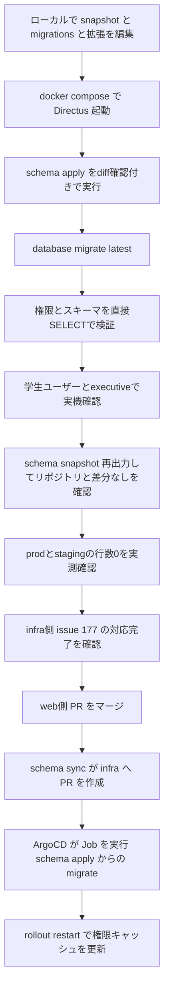

# Technical Design Document

## Overview

`student_exhibitions` (学生企画) コレクションのフィールド構成と、`student_exhibitor` ロールの権限を実運用に合わせて是正する。あわせて、アップロードされた画像を 1 回だけ縮小・WebP 化する Directus hook 拡張を新設する。

**Purpose**: 学生団体担当者が自企画の情報を過不足なく自己編集でき、実行委員が代理対応した内容も同じ画面で見られる状態を作る。同時に、掲載画像の配信サイズを担当者の手作業に依存せず抑える。

**Users**: `student_exhibitor` ロールの学生団体担当者が自企画の編集に、`executive` ロールの実行委員が全企画の管理と代理入力に利用する。

**Impact**: `student_exhibitions` は破壊的変更 (`slug` / `image` の削除、`category` の型変更) を伴う。フロントエンドは本コレクションを未参照、実データも 0 件のため、参照側への影響はない。Directus の管理画面は、学生団体担当者から見たときにナビゲーションが自企画の編集導線だけに絞られる。

### Goals

- `student_exhibitions` のフィールドを実運用の入力項目 (団体名 / 企画名 / 複数カテゴリ / リンク / 複数画像 / ステージ出演枠) に一致させる。
- `student_exhibitor` の権限を、編集可能フィールド・ファイル可視範囲・コレクション可視範囲の 3 面で新スキーマに合わせる。
- アップロード時に 1 回だけ画像を最適化し、配信のたびの変換を発生させない。
- 上記を `directus/schema/snapshot.yaml`・`directus/migrations/**`・`directus/extensions/**` の変更で完結させ、infra 側には env の調整と拡張マウントパスの変更のみを依頼する。

### Non-Goals

- フロントエンド実装 (本コレクションの参照、画像 URL の組み立て)。
- Cloudflare 側の設定 (Image Transformations、`/assets/*` の Cache Rule)。Cache Rule は infra 側の `terraform/cloudflare_directus_assets.tf` で適用済み、Image Transformations はダッシュボードで手動有効化済み。
- フロントエンドの画像取得規約 (`?v=<modified_on>` の付与)。本スペックはその必要性を記録するに留め、実装はフロントエンド側で行う。`next/image` のローダーはフロントエンド側の作業。
- Directus の配信時変換 (Storage Asset Presets) の利用。
- コレクション名・テーブル名 `student_exhibitions` のリネーム。
- 画像枚数上限 (5 枚) の機械的強制。Directus 標準 UI では強制できないため note 記載に留める。

## スコープ変更 (2026-08-27)

RBAC に関する部分 (Requirement 9 / 10 / 12) は本スペックの対象外とし、`payload-cms-migration` スペックの Requirement 2 / 3 へ委譲した。

理由は Directus 12.1.1 の無償ライセンス (`CORE_LICENSE`) にある。`custom_permission_rules_enabled: false` のため、行レベルフィルタ・フィールド制限・`validation` を持つ `directus_permissions` 行が権限評価から無言で除外される。`student_exhibitor` ロールに求める「自企画のみ編集可」は Directus 上では実現できない。調査結果は research.md の「スパイク結果: Directus 12 の custom permission rule はライセンス機能」および「判断: RBAC は本スペックのスコープから外す」を参照。

Requirement 11 (画像の自動最適化) とその配信経路は実装と単体テストを完了しているが、リポジトリへのマージは保留している。拡張を動作させるには `aramakisai-infra` 側の Deployment 変更が必要で、Payload へ移行すれば不要になる配管のため、移行方針が確定するまで投入しない。実装は `payload-cms-migration` の Requirement 6 で同等機能を実現する際の参照とする。

マージしたのは Requirement 1〜8 および 13 に対応するスキーマ定義 (`directus/schema/snapshot.yaml`) のみで、2026-08-27 に prod / staging へ適用済み。

## Boundary Commitments

### This Spec Owns

- `student_exhibitions` および新設 junction `student_exhibitions_files` のスキーマ定義。
- `executive` / `student_exhibitor` policy の `directus_permissions` 行 (対象コレクション、フィールド、フィルタ、validation)。
- アップロード時に画像を最適化する hook 拡張のロジックと、その配置ディレクトリ構造。
- ローカル Directus (`docker-compose.yaml`) における拡張の実行環境。

### Out of Boundary

- Directus コンテナイメージ、K8s マニフェスト、環境変数の設計 (`aramakisai-infra` 所有)。
- Cloudflare zone の設定。
- `announcements` / `topics` / `page_*` など他コレクションのスキーマと権限 (Requirement 12 による read 権限の削除を除く)。
- `public` policy の権限。フロントエンドの匿名アクセス経路は本スペックで変更しない。

### Allowed Dependencies

- Directus 12.1.1 の内部サービス (`FilesService` / `AssetsService` / `ItemsService`) と hook context。
- 既存 migration が確定させた固定 UUID (`EXECUTIVE_POLICY_ID` = `5001c2e1-...`、`STUDENT_EXHIBITOR_POLICY_ID` = `40bfc0da-...`)。
- 既存の伝播経路 `directus-schema-sync.yml` → `aramakisai-infra` の PR → ArgoCD。
- infra 側の `FILES_MAX_UPLOAD_SIZE` (適用済み) / `ASSETS_TRANSFORM_*` (未設定) と `/directus/extensions` マウント (パス変更が必要)。追跡は aramakisai/aramakisai-infra#179。

> **フロントエンドへの申し送り**: 画像 URL は `/assets/<id>?v=<modified_on>` の形で組み立てる。実体の差し替えで URL が変わらないため、`?v=` なしのキャッシュエントリは最適化前の原本を最大 30 日返しうる。

### Revalidation Triggers

- `student_exhibitions` のフィールド追加・削除、および `student_exhibitions_files` の構造変更。
- `student_exhibitor` policy の read 対象コレクション一覧の変更。
- Directus のメジャーバージョン更新 (`FilesService.uploadOne` / `AssetsService.getAsset` のシグネチャ、pnpm レイアウト、`directus:extension` の宣言形式に依存するため)。
- 拡張の配信方式の変更 (ConfigMap → イメージ同梱など)。

## Architecture

### Existing Architecture Analysis

- スキーマは `directus/schema/snapshot.yaml` の 1 ファイルで管理し、`directus schema apply` で適用する。CHECK 制約・RBAC は snapshot で表現できないため knex ベースの custom migration に置く ([[structure]])。
- RBAC migration は `directus_permissions` を対象 policy・対象コレクションで delete-then-insert する形で冪等性を確保している (`20260701C` / `20260712C` / `20260713A`)。本スペックもこの形を踏襲する。
- 添付ファイルの m2m は `topics_files` / `announcements_files` / `page_home_files` が同一パターン (`id` / `<collection>_id` / `directus_files_id` / `sort`、`on_delete: CASCADE`) で存在する。`student_exhibitions_files` はこれに合わせる。
- prod / staging の Deployment には ConfigMap `directus-extensions` (`optional: true`) が `/directus/extensions/hooks` にマウント済み (infra `0fca31d`)。ただし `resolveFsExtensions` は `EXTENSIONS_PATH` 直下のフォルダを列挙して `<folder>/package.json` を読むため、この位置では拡張名が `hooks` となり、かつ ConfigMap 1 個あたり拡張 1 個が上限になる。マウントパスを `/directus/extensions` に変更し `items[].path` でサブディレクトリを作る形へ改める。
- migrations は ConfigMap 経由で schema-apply Job にのみマウントされている。Deployment 側とはマウント先が分かれるため、拡張のマウントと衝突しない。
- 本番の custom migration は Job 内の独立スクリプトが実行する。`*.js` を `.mjs` にコピーし、内蔵 knex を絶対パスで require して `up()` を直接呼び、実行済みの名前を `directus_custom_migrations` に記録する。`down()` は呼ばれない。
- 本番 Directus 本体は拡張をロードできる状態にある (pod ログに `Extensions loaded`)。schema-apply Job のコメントにある "Skipping CLI extensions initialization" は CLI 経路のみの事象。
- `student_exhibitions` の既存 `image` は単一 uuid、`category` は単一 select、`slug` は未使用のまま残っている。`performance_slots.exhibition_id` の m2o は張られているが `one_field` が未設定で逆参照がない。

### Architecture Pattern & Boundary Map

選定パターン: **既存サービスへの委譲を最大化した後処理フック (post-write delegation)**。拡張は変換も置換も自前実装せず、Directus 内部サービスに委譲する薄いオーケストレーションに徹する。



**Architecture Integration**:

- **Domain/feature boundaries**: スキーマ定義 (snapshot) / 権限データ (migrations) / 実行時の画像処理 (hook) の 3 つに分離する。3 者は互いを import せず、共有するのはコレクション名とフィールド名だけ。
- **Existing patterns preserved**: delete-then-insert による migration 冪等性、junction コレクションの 4 フィールド構成、固定 policy UUID の参照。
- **New components rationale**: hook 拡張は「保存される実体そのものを最適化する」ための唯一の実行点であり、既存のどのレイヤーにも属さないため新設する。
- **Dependency direction**: `hook → Directus 内部サービス → storage / DB` の一方向。hook は migration にもスキーマにも依存しない (コレクション名の文字列一致のみ)。migration はスキーマ適用後に実行される前提を持つ。

### Technology Stack

| Layer | Choice / Version | Role in Feature | Notes |
|-------|------------------|-----------------|-------|
| Backend / Services | Directus 12.1.1 | スキーマ・権限・ファイル管理の実行基盤 | `FilesService` / `AssetsService` を拡張から利用する |
| Backend / Services | Directus hook extension (API extension, 素の ESM) | アップロード時の画像最適化 | バンドル不要。`directus:extension` で `path` / `source` に `index.js` を指定 |
| Data / Storage | PostgreSQL 16 (CNPG) | `student_exhibitions` / `student_exhibitions_files` / `directus_permissions` | DDL は `schema apply`、権限は knex migration |
| Data / Storage | S3 (Hetzner Object Storage) | 画像実体 | `STORAGE_LOCATIONS=s3`、キーは `<uuid><ext>` |
| Messaging / Events | Directus emitter (`files.upload` action) | 最適化のトリガ | filter は存在しない。`emitAction` は handler を await しない fire-and-forget。置換時は `emitEvents: false` で再帰を止める |
| Infrastructure / Runtime | K8s Deployment (`replicas: 1`, `512Mi`) + ConfigMap `directus-extensions` | 拡張の配信と実行 | マウントパスの変更が必要 (infra #177) |

## File Structure Plan

### Directory Structure

```
directus/
├── schema/
│   └── snapshot.yaml                 # student_exhibitions のフィールド定義と junction 追加
├── migrations/
│   ├── 20260826A-rbac-student-exhibitions-fields.js   # fields 更新 + 自分の下書きの read
│   ├── 20260826B-rbac-files-restrict.js
│   ├── 20260826C-rbac-student-exhibitions-files-junction.js
│   └── 20260826D-rbac-student-exhibitor-collection-scope.js
├── extensions/
│   └── image-optimize/               # EXTENSIONS_PATH 直下のフォルダであること (ネスト不可)
│       ├── package.json              # directus:extension 宣言 (type: hook, path/source: index.js)
│       └── index.js                  # files.upload action ハンドラ
└── docker-compose.yaml               # 拡張のマウント追加
```

> migration のファイル名は既存の `YYYYMMDD{A,B,C...}-説明.js` 規約に従い、既存の最終 migration (`20260814A`) より後になる日付を用いる。
>
> 拡張は `directus/extensions/<name>/` の 1 階層に置く。`resolveFsExtensions` は `EXTENSIONS_PATH` 直下のフォルダを列挙し `<folder>/package.json` を読むだけで、`hooks/<name>/` のようなネストは検出しない (Directus 9 系のレイアウトは廃止済み)。

### Modified Files

- `directus/schema/snapshot.yaml` — `student_exhibitions` のフィールド差し替え、`student_exhibitions_files` の追加、`performance_slots.exhibition_id` relation の `one_field` 設定、collection 表示名の変更。
- `directus/docker-compose.yaml` — `./extensions/image-optimize` を `/directus/extensions/image-optimize` にマウント。`MIGRATIONS_PATH=/directus/extensions/migrations` とはパスが分かれるため衝突しない。
- `.github/workflows/directus-schema-sync.yml` — `paths` / 差分判定の grep / ConfigMap 生成 / `git add` 対象パスの 4 箇所すべてに `directus/extensions/**` を追加する。PR 本文の適用順序の記述 (`migrate:latest` → `schema apply`) が実際の Job (`schema apply --yes` → `migrate:latest` → custom migrations) と逆になっているため、あわせて修正する。
- `directus/extensions/hooks/sentry-error-tracking/` — `node_modules` のみが残る幽霊ディレクトリ。`extensions/**` を CI 対象にする前に削除する。

## System Flows

### 画像アップロード時の最適化



**Key Decisions**:

- 変換は**保存後**にしか行えない (`files.upload` は action のみで、`directus_files` は upload 時に create/update イベントを発火しない)。原本が一度 S3 に書かれることは避けられない。
- `AssetsService` が生成する variant と元の拡張子違いのオブジェクトは、`uploadOne` 置換モードの「primary key 前方一致削除」で同時に回収される。拡張側で削除処理を書かない。
- 置換時に `emitEvents: false` を渡さないと `files.upload` が再発火して無限ループになる。

### 学生団体担当者から見た可視範囲



## Requirements Traceability

| Requirement | Summary | Components | Interfaces | Flows |
|-------------|---------|------------|------------|-------|
| 1.1–1.3 | 団体名フィールドの新設 | Schema Definition | `student_exhibitions.organization_name` | — |
| 2.1–2.3 | `slug` の削除 | Schema Definition, RBAC Field Policy | — | — |
| 3.1–3.5 | カテゴリの複数選択化 | Schema Definition | `student_exhibitions.category` | — |
| 4.1–4.3 | リンク・SNS の登録 | Schema Definition, RBAC Field Policy | `student_exhibitions.links` | — |
| 5.1–5.4 | ステージ出演枠の逆参照 (閲覧のみ) | Schema Definition, RBAC Collection Scope | `performance_slots` alias + relation `one_field` | 可視範囲 |
| 6.1–6.2 | 会場情報の常時表示 | Schema Definition | `area_id` / `booth_number` / `booth_label` | — |
| 7.1–7.5 | 複数画像対応 | Schema Definition | `student_exhibitions_files` junction | — |
| 8.1–8.2 | コレクション表示名 | Schema Definition | `meta.translations` | — |
| 9.1–9.3 | 編集可能フィールドの是正 | RBAC Field Policy | `directus_permissions.fields` | — |
| 9.4–9.5 | 自分の下書きの read | RBAC Field Policy | `directus_permissions.permissions` の `_or` | 可視範囲 |
| 10.1–10.2 | MIME 制限 | RBAC File Policy | `directus_permissions.validation` | — |
| 10.3–10.6 | サイズ上限 | Infra Handoff | `FILES_MAX_UPLOAD_SIZE` | — |
| 11.13–11.14 | 変換の同時実行数と最大寸法 | Infra Handoff | `ASSETS_TRANSFORM_*` | — |
| 10.7–10.8 | ファイル可視範囲 | RBAC File Policy | `$FOLLOW` フィルタ | 可視範囲 |
| 10.9–10.10 | junction の権限 | RBAC Junction Policy | `directus_permissions.permissions` | 可視範囲 |
| 11.1–11.9 | アップロード時最適化 | Image Optimize Hook | `files.upload` action | 最適化 |
| 11.10 | 配信時変換の不使用 | Image Optimize Hook | — | — |
| 11.11 | 配信キャッシュの分離 | Image Optimize Hook | `?v=modified_on` の申し送り | 最適化 |
| 11.12 | メモリ制約下での動作 | Image Optimize Hook, Infra Handoff | — | 最適化 |
| 11.15–11.16 | 12.1.1 対応 / 依存追加なし | Image Optimize Hook | `AssetsService` | 最適化 |
| 11.17–11.19 | 配置契約と sync workflow | Extension Delivery | ConfigMap `items[].path` / volumeMount | — |
| 11.20 | ローカル環境 | Extension Delivery | docker-compose mount | — |
| 12.1–12.5 | 不要コレクションの非表示 | RBAC Collection Scope | `directus_permissions` の削除 | 可視範囲 |
| 13.1–13.3, 13.5–13.10 | 適用と検証 | Migration Strategy | — | — |
| 13.4 | 本番のロールバック手段 | Migration Strategy | 打ち消し migration | — |

## Components and Interfaces

| Component | Domain/Layer | Intent | Req Coverage | Key Dependencies (P0/P1) | Contracts |
|-----------|--------------|--------|--------------|--------------------------|-----------|
| Schema Definition | Data | コレクション構造の定義 | 1, 2, 3, 4, 5, 6, 7, 8 | `schema apply` (P0) | State |
| RBAC Field Policy | Security | 編集可能フィールドと read 範囲の限定 | 2.3, 4.3, 9 | Schema Definition (P0) | Batch |
| RBAC File Policy | Security | ファイルの種別と可視範囲の限定 | 10.1, 10.2, 10.7, 10.8 | Schema Definition (P0) | Batch |
| RBAC Junction Policy | Security | junction の CRUD 範囲 | 10.9, 10.10 | Schema Definition (P0) | Batch |
| RBAC Collection Scope | Security | ナビゲーションの絞り込み | 12 | 既存 read 権限 (P0) | Batch |
| Image Optimize Hook | Runtime | アップロード画像の最適化 | 11.1–11.12, 11.15, 11.16 | AssetsService (P0), FilesService (P0) | Event |
| Extension Delivery | Infrastructure | 拡張の配置 | 11.17–11.20 | infra #177 (P0) | Batch |
| Infra Handoff | Infrastructure | env とマウントの依頼 | 10.3–10.6, 11.12–11.14, 13.9, 13.10 | infra #177 (P0) | — |

### Data / Schema

#### Schema Definition

| Field | Detail |
|-------|--------|
| Intent | `student_exhibitions` と `student_exhibitions_files` の構造を定義する |
| Requirements | 1.1, 1.2, 1.3, 2.1, 2.2, 3.1, 3.2, 3.3, 3.4, 3.5, 4.1, 4.2, 5.1, 5.2, 5.3, 6.1, 6.2, 7.1, 7.2, 7.3, 7.4, 7.5, 8.1, 8.2 |

**Responsibilities & Constraints**

- `directus/schema/snapshot.yaml` の単一ファイルで完結させ、DDL 用の custom migration を作らない。
- 破壊的変更 (`slug` / `image` の削除、`category` の型変更) を含む。実データ 0 件の確認を前提とする。
- collection 名・テーブル名は変更しない。表示名のみ `meta.translations` で「学生企画」に変更する。

**Dependencies**

- Outbound: `directus schema apply` — DDL の適用 (P0)
- Outbound: RBAC migrations — フィールド名の一致が前提 (P0)

**Contracts**: State [x]

##### State Management

- **State model**: 下記「Data Models」を参照。
- **Persistence & consistency**: junction の 2 本の relation は `on_delete: CASCADE`。学生企画レコードの削除で紐づけ行が連鎖削除される。
- **Concurrency strategy**: 該当なし (スキーマ定義)。

**Implementation Notes**

- Integration: `category` は `type: json` / `special: [cast-json]` / `interface: select-multiple-dropdown` / `default_value: '["other"]'`。選択肢 value は `stage` / `exhibit` / `vendor` / `other` を維持し、表示テキストのみ「展示」「出店」に変更する。
- Validation: 「最大 2 つ」「画像は最大 5 枚」は DB・スキーマレベルで強制せず note に記載する。
- Risks: `type: string` → `json` の適用が in-place ALTER か drop/recreate かは未検証。行数 0 の確認を適用の前提条件とする。
- 注記: `performance_slots` の逆参照は閲覧専用。student_exhibitor には `performance_slots` の create / update を付与せず、出演枠の割当は executive が行う (5.4)。

### Security / RBAC

#### RBAC Field Policy

| Field | Detail |
|-------|--------|
| Intent | `student_exhibitor` が編集できるフィールドと、読めるレコードの範囲を新スキーマに一致させる |
| Requirements | 2.3, 4.3, 9.1, 9.2, 9.3, 9.4, 9.5 |

**Responsibilities & Constraints**

- `STUDENT_EXHIBITOR_POLICY_ID` の `student_exhibitions` create / update の `fields` を `name,organization_name,category,description,links,images,status` に更新する。
- update の `permissions` は `{ user_created: { _eq: "$CURRENT_USER" } }` を維持する。
- read の `permissions` を `{ _or: [{ status: { _eq: "published" } }, { user_created: { _eq: "$CURRENT_USER" } }] }` に更新する。現行の `20260701C` は `status = published` のみを許可しており、下書きを作成した本人が自レコードを読めない状態になっている。
- 現行スキーマに存在しない `slug` / `content` を除去する。

**Contracts**: Batch [x]

##### Batch / Job Contract

- **Trigger**: `directus database migrate:latest` (schema apply の後段)
- **Input / validation**: 対象は `policy = STUDENT_EXHIBITOR_POLICY_ID` かつ `collection = student_exhibitions` の行 (`create` / `update` / `read`)。
- **Output / destination**: `directus_permissions`
- **Idempotency & recovery**: 対象条件で delete してから insert する。`down` は同じ条件で delete する。

**Implementation Notes**

- Integration: `fields` は text 型のカンマ区切り文字列で、配列は不可 (`20260701C` のコメント参照)。
- Risks: 権限キャッシュが更新されず 403 が続く既知事象がある。infra 側の rollout restart フローに乗せる。

#### RBAC File Policy

| Field | Detail |
|-------|--------|
| Intent | アップロード可能な種別と、閲覧・更新できるファイルの範囲を限定する |
| Requirements | 10.1, 10.2, 10.7, 10.8 |

**Responsibilities & Constraints**

- create の `validation` を `{ type: { _in: ["image/jpeg", "image/png", "image/webp"] } }` とする。`image/gif` は含めない。
- read の `permissions` を 2 条件の `_or` とする。
  1. `{ uploaded_by: { _eq: "$CURRENT_USER" } }`
  2. `{ "$FOLLOW(student_exhibitions_files,directus_files_id)": { student_exhibitions_id: { user_created: { _eq: "$CURRENT_USER" } } } }`
- update / delete の `permissions` は `{ uploaded_by: { _eq: "$CURRENT_USER" } }` のみとする。
- ファイルサイズは `validation` で強制しない。権限評価の時点で `filesize` が未確定のため機能しない。

**Dependencies**

- Outbound: `student_exhibitions_files` — read フィルタが junction を参照する (P0)
- External: `FILES_MAX_UPLOAD_SIZE` — サイズ上限の実効的な唯一の強制点 (P0)

**Contracts**: Batch [x]

##### Batch / Job Contract

- **Trigger**: `directus database migrate:latest`
- **Input / validation**: 対象は `policy = STUDENT_EXHIBITOR_POLICY_ID` かつ `collection = directus_files` の行。`executive` の `directus_files` 権限は変更しない。
- **Output / destination**: `directus_permissions`
- **Idempotency & recovery**: delete-then-insert。

**Implementation Notes**

- Integration: `public` policy の `directus_files` read (`20260713B` で付与) は変更しない。匿名の画像表示経路を壊さないため。
- Validation: 学生ユーザーで「他団体の画像が見えない」「自企画に紐づく executive アップロード分が見える」の両方を実機確認する。
- Risks: `$FOLLOW` を含むフィルタは権限評価のクエリが 1 段深くなる。ファイル一覧の表示が遅い場合は junction 側にインデックスを検討する。

#### RBAC Junction Policy

| Field | Detail |
|-------|--------|
| Intent | `student_exhibitions_files` の CRUD 範囲を定義する |
| Requirements | 10.9, 10.10 |

**Responsibilities & Constraints**

- `executive` に全 CRUD を付与する (`permissions: {}` / `fields: "*"`)。
- `student_exhibitor` は `{ student_exhibitions_id: { user_created: { _eq: "$CURRENT_USER" } } }` の条件で CRUD を許可する。

**Contracts**: Batch [x]

##### Batch / Job Contract

- **Trigger**: `directus database migrate:latest` (対象 collection が存在している必要があるため、`schema apply` の後に実行される前提)
- **Input / validation**: 対象は `collection = student_exhibitions_files` の行のみ。
- **Output / destination**: `directus_permissions`
- **Idempotency & recovery**: delete-then-insert。`20260713A` の同型実装に倣う。

**Implementation Notes**

- Integration: prod の schema-apply Job は `schema apply --yes` → `database migrate:latest` → custom migration の順に実行するため、junction が作られてから権限が入る。ローカル検証でも同じ順序を踏む。

#### RBAC Collection Scope

| Field | Detail |
|-------|--------|
| Intent | 学生団体担当者の管理画面ナビゲーションを自企画の編集導線に絞る |
| Requirements | 12.1, 12.2, 12.3, 12.4, 12.5 |

**Responsibilities & Constraints**

- `student_exhibitor` policy から、以下の read 権限を削除する: `sponsors` / `announcements` / `faq_items` / `topics` / `festival_meta` / `pages` / `page_home` / `page_access` / `page_contact` / `page_privacy` およびそれらの junction。
- 以下の read 権限は維持する: `student_exhibitions` / `performance_slots` / `stages` / `time_slots` / `map_areas` / `directus_files` / `directus_folders` / `student_exhibitions_files`。
- `public` policy と `executive` policy の権限は変更しない。

**Contracts**: Batch [x]

##### Batch / Job Contract

- **Trigger**: `directus database migrate:latest`
- **Input / validation**: 削除対象は「`policy = STUDENT_EXHIBITOR_POLICY_ID` かつ `action = read` かつ `collection` が維持リストに含まれない行」。維持リストをホワイトリストとして持ち、削除対象を列挙しない。
- **Output / destination**: `directus_permissions`
- **Idempotency & recovery**: ホワイトリスト外の read 行を毎回 delete するため、再実行しても同じ最終状態になる。`down` は `20260701C` の `PUBLIC_COLLECTIONS` 相当の read 権限を復元する。

**Implementation Notes**

- Integration: Directus 管理画面のナビゲーションはコレクション単位の read 権限で決まるため、非表示化は read 権限の剥奪で実現する。
- Validation: 権限剥奪後も `performance_slots` / `area_id` / `images` の関連フィールドが編集画面で解決できることを確認する。
- Risks: 将来 read が必要なコレクションを追加した際、ホワイトリストの更新漏れで表示されなくなる。migration 冒頭のコメントで維持リストの意味を明示する。

### Runtime

#### Image Optimize Hook

| Field | Detail |
|-------|--------|
| Intent | アップロードされた画像を 1 回だけ縮小・WebP 化して実体を置き換える |
| Requirements | 11.1, 11.2, 11.3, 11.4, 11.5, 11.6, 11.7, 11.8, 11.9, 11.10, 11.11, 11.12, 11.15, 11.16 |

**Responsibilities & Constraints**

- `files.upload` action のみを購読する。filter は存在しない。
- 変換は `AssetsService` に、置換は `FilesService` に委譲する。`sharp` を直接 import しない。
- 対象は `image/jpeg` / `image/png` / `image/webp`。それ以外の MIME は何もしない。
- 変換の成否に関わらずアップロード自体は成功させる。失敗時は原本を残し `logger.warn` に記録する。
- ロールに依らず全アップロードに適用する。

**Dependencies**

- Inbound: Directus emitter (`files.upload`) — 起動トリガ (P0)
- Outbound: `AssetsService.getAsset` — 変換ストリームの生成 (P0)
- Outbound: `FilesService.uploadOne` — 実体の置換とメタデータ更新 (P0)
- External: S3 storage — 読み書き先 (P0)

**Contracts**: Event [x]

##### Event Contract

- **Subscribed events**: `files.upload` — payload は `{ payload: Partial<DirectusFile>, key: string, collection: "directus_files" }`
- **Published events**: なし。置換時は `{ emitEvents: false }` を渡し `files.upload` の再発火を抑止する。
- **Ordering / delivery guarantees**: action はアップロード完了後に 1 回発火する。`emitAction` は handler を await せず `.catch()` でログするだけの fire-and-forget であるため、ハンドラの成否はアップロード応答に影響しない。これは Requirement 11.6 を構造的に保証すると同時に、hook からアップロードを拒否できないことも意味する。

##### Service Interface

hook のロジックは以下の契約を満たす関数として表現される。実装は JSDoc で型を明示する (バンドルしない素の ESM のため TypeScript コンパイルは行わない)。

```typescript
/** files.upload action の payload */
interface FileUploadEvent {
  readonly key: string;
  readonly payload: { readonly type?: string | null };
  readonly collection: 'directus_files';
}

/** AssetsService.getAsset に渡す変換指定 */
interface TransformationParams {
  readonly format: 'webp';
  readonly quality: number;
  readonly width: number;
  readonly height: number;
  readonly fit: 'inside';
  readonly withoutEnlargement: true;
}

type OptimizeOutcome =
  | { readonly status: 'optimized'; readonly key: string }
  | { readonly status: 'skipped'; readonly key: string; readonly reason: 'unsupported-type' }
  | { readonly status: 'failed'; readonly key: string; readonly error: Error };

interface ImageOptimizer {
  optimize(event: FileUploadEvent): Promise<OptimizeOutcome>;
}
```

- **Preconditions**: `directus_files` の該当行に `width` / `height` / `type` が設定済みであること (`files.upload` は `extractMetadata` の後に発火するため成立する)。
- **Postconditions**: `optimized` の場合、`filename_disk` が `<key>.webp`、`type` が `image/webp`、`filesize` / `width` / `height` が置換後の実体と一致する。ストレージ上に `<key>` 前方一致のオブジェクトは 1 つだけ残る。
- **Invariants**: どの分岐でもアップロード自体は失敗しない。`files.upload` を再発火しない。

**Implementation Notes**

- Integration:
  - `AssetsService.getAsset(key, { transformationParams })` は変換結果を `<basename><suffix>.webp` として storage に書いてからストリームを返す。この variant は後段の `uploadOne` が消すため、拡張側で削除しない。
  - `FilesService.uploadOne(stream, { type: 'image/webp', filename_download: <元の basename>.webp }, key, { emitEvents: false })` を呼ぶ。置換モードでは `filename_disk` の拡張子が `filename_download` に合わせて `<key>.webp` へ付け替えられ、`<key>` 前方一致の旧オブジェクトが削除されたうえで一時ファイルが移動される。
  - 両サービスは `accountability: null` (sudo) で生成する。学生ユーザーの権限で変換・置換を行わないため、read フィルタの影響を受けない。
  - `getSchema()` は context から取得する。
- Validation: 対象 MIME 判定は `payload.type` を用いる。すでに `image/webp` かつ長辺が上限以内の画像も、判定を単純に保つため変換に通す (`withoutEnlargement: true` により拡大は起きない)。
- Risks:
  - `AssetsService` は `width` / `height` が未取得、または `ASSETS_TRANSFORM_IMAGE_MAX_DIMENSION` (既定 `6000`) を超える画像に対して例外を投げる。catch して原本を保持するが、その画像は最適化されないまま配信される。`10mb` 程度の上限でも 8000×6000 の JPEG は通過しうるため、この分岐は実際に発生する。ログで検知できるようにする。
  - 同時変換が `ASSETS_TRANSFORM_MAX_CONCURRENT` (既定 `25`) を超えると `ServiceUnavailableError`。同じく catch 対象。既定値のままでは単一 pod で 25 並列の sharp 変換が走りうるため、infra 側で 2〜4 に絞る (11.13)。
  - `replicas: 1` / `512Mi` のため、大きな画像の変換でメモリがスパイクする。OOM は api 全断を意味する。実機計測を検証項目に含める。
  - `/assets/*` のエッジキャッシュは `edge_ttl` が `override_origin` の 30 日で設定済み (実測で `MISS` → `HIT` を確認)。置換モードは同じ primary key の実体を差し替えるため URL が変わらず、アップロードから置換完了までの窓に GET が入ると最適化前の原本が最大 30 日エッジに残る。管理画面のプレビューが使う `?key=system-*` も同様に別エントリとして汚染されうる。
  - 対策として、フロントエンドは画像取得時に `?v=<modified_on>` を付与する。Cloudflare の既定キャッシュキーはクエリ文字列を含むため、置換後の URL は汚染されたエントリと分離される。Cloudflare API トークンを Directus に渡す purge 実装は行わない。

#### Extension Delivery

| Field | Detail |
|-------|--------|
| Intent | 拡張をローカルと本番の双方で Directus に読み込ませる |
| Requirements | 11.17, 11.18, 11.19, 11.20 |

**Responsibilities & Constraints**

- 拡張はバンドルせず、`package.json` と `index.js` の 2 ファイルで構成する。`directus:extension` に `{ type: "hook", path: "index.js", source: "index.js", host: "^12.0.0" }` を宣言する。
- 拡張は `EXTENSIONS_PATH` (`/directus/extensions`) 直下のフォルダとして配置する。`resolveFsExtensions` は直下のフォルダを列挙して `<folder>/package.json` を読むだけで、ネストしたディレクトリは走査しない。`package.json` が見つからないフォルダは黙って無視されるため、配置を誤ると無言で機能しない。
- ローカルは `docker-compose.yaml` で `./extensions/image-optimize` を `/directus/extensions/image-optimize` にマウントする。`MIGRATIONS_PATH=/directus/extensions/migrations` とはパスが分かれる。`migrations` フォルダには `package.json` がないため拡張として解決されず、無視される。
- 本番は ConfigMap `directus-extensions` を `/directus/extensions` にマウントし、`items[].path` に `image-optimize/package.json` と `image-optimize/index.js` を指定してサブディレクトリを構成する。現在の infra 実装はマウント先が `/directus/extensions/hooks` で、拡張名が `hooks` になり複数拡張を置けないため変更を依頼する。

**Contracts**: Batch [x]

##### Batch / Job Contract

- **Trigger**: `directus/extensions/**` の変更を含む main へのマージ
- **Input / validation**: 追跡対象のファイルのみを ConfigMap 化する。`node_modules` などの未追跡ディレクトリを含めない。
- **Output / destination**: `aramakisai-infra` への PR (既存の schema / migrations ConfigMap と同じ経路)
- **Idempotency & recovery**: 同一内容なら PR に差分が出ない。

**Implementation Notes**

- Integration: 既存の未追跡ディレクトリ `directus/extensions/hooks/sentry-error-tracking/node_modules` は、`extensions/**` を CI の対象に加える前に削除する。
- Risks:
  - ConfigMap の上限は 1 MiB。素の ESM 1 ファイルであれば桁違いに小さいが、将来バンドルを持ち込む場合は再評価が必要。
  - `/directus/extensions` を ConfigMap でマウントするとイメージ内の同ディレクトリの内容が覆われる。`readOnly: true` のため Marketplace 経由のインストールはできなくなるが、本プロジェクトでは使用しない。
  - ConfigMap が存在しない場合に pod が起動しないことを避けるため、`optional: true` を維持する。

#### Infra Handoff

| Field | Detail |
|-------|--------|
| Intent | infra 側の前提条件を受け入れ条件として管理する |
| Requirements | 10.3, 10.4, 10.5, 10.6, 11.12, 11.13, 11.14, 13.9, 13.10 |

**Responsibilities & Constraints**

infra `0fca31d` で一部着地済み。残る依頼は以下。

- 拡張の `mountPath` を `/directus/extensions/hooks` から `/directus/extensions` へ変更し、ConfigMap の `items[].path` で `image-optimize/` 配下に配置する。
- `ASSETS_TRANSFORM_MAX_CONCURRENT` を 2〜4 に設定する (既定 25 のままでは単一 pod で並列変換が走り 512Mi を超える)。
- `ASSETS_TRANSFORM_IMAGE_MAX_DIMENSION` を明示的に設定する (既定 6000)。
- 破壊的スキーマ変更を含む PR であることの周知。

着地済み:

- `FILES_MAX_UPLOAD_SIZE=50mb` (prod / staging、`55b3ea0`)。全ロール・全 Content-Type 共通。画像側は MIME 制限と最適化で保存サイズを抑えるため個別の数値上限は設けない。
- ConfigMap `directus-extensions` の作成とマウント (`0fca31d`)。マウントパスのみ要変更。
- `/assets/*` の Cache Rule (`terraform/cloudflare_directus_assets.tf`)。Image Transformations 本体は provider の既知制約により Terraform 管理外で、ダッシュボードから手動で有効化済み (`55fde37`)。

**Implementation Notes**

- Integration: aramakisai/aramakisai-infra#177 で追跡する。web 側 PR のマージ条件に含める。

## Data Models

### Logical Data Model

`student_exhibitions` の変更後フィールド構成:

| sort | field | type | 変更 | 備考 |
|------|-------|------|------|------|
| 1–6 | `id` / `user_created` / `date_created` / `user_updated` / `date_updated` / `status` | 既存 | 変更なし | |
| 7 | `name` | string | note 修正 | 企画名。note に「団体名は organization_name を参照」 |
| 8 | `organization_name` | string | 新規 | 必須。表示名「団体名」。旧 `slug` の位置を置き換える |
| — | `slug` | — | 削除 | schema・DB 双方から削除 |
| 9 | `category` | json | 型変更 | `special: [cast-json]` / `select-multiple-dropdown` / `default_value: '["other"]'` |
| 10 | `performance_slots` | alias | 新規 | `special: [o2m]` / `interface: list-o2m` |
| 11–13 | `area_id` / `booth_number` / `booth_label` | 既存 | `conditions: null` | 常時表示。note に用途ヒント |
| 14 | `description` | 既存 | 変更なし | |
| 15 | `links` | json | 新規 | `{label, url}` の繰り返し。`interface: list` |
| 16 | `images` | alias | 置換 | 旧 `image` (uuid) を削除。`special: [files]` / `interface: files` |

新設 junction `student_exhibitions_files`:

| field | type | 備考 |
|-------|------|------|
| `id` | integer | 主キー (auto increment) |
| `student_exhibitions_id` | integer | FK → `student_exhibitions.id`、`on_delete: CASCADE` |
| `directus_files_id` | uuid | FK → `directus_files.id`、`on_delete: CASCADE` |
| `sort` | integer | 並び順 |

**Consistency & Integrity**

- 学生企画レコードの削除で junction 行が連鎖削除される。ファイル実体は `directus_files` 側に残る。
- `performance_slots.exhibition_id` の relation に `one_field: performance_slots` を設定し、逆参照を成立させる。
- collection `meta.hidden: true` を junction に設定し、ナビゲーションに出さない (`topics_files` と同じ)。

### Data Contracts & Integration

- `directus_permissions` の 1 行は `{ policy, collection, action, permissions, validation, presets, fields }`。`fields` はカンマ区切りの text で配列不可。
- read フィルタで用いる `$FOLLOW(<collection>,<field>)` は、逆参照フィールドが未定義の関係をたどるための Directus のフィルタ構文。

## Error Handling

### Error Strategy

画像最適化は「補助的な処理」であり、失敗してもアップロードという主目的を損なわない。すべての例外を hook 内で捕捉し、原本を保持したまま警告ログを残す。権限まわりは Directus 標準のエラー応答をそのまま用いる。

### Error Categories and Responses

**User Errors (4xx)**

- 許可外 MIME のアップロード → `directus_permissions.validation` により Directus が validation エラーを返す。
- `FILES_MAX_UPLOAD_SIZE` 超過 → ストリームが truncate され `ContentTooLargeError` (413)。
- 他人のファイルへの update / delete → 権限フィルタにより対象が 0 件となり `ForbiddenError`。

**System Errors (5xx)**

- 変換の同時実行数超過 (`ServiceUnavailableError`) → hook 内で捕捉し原本を保持。
- 変換タイムアウト (`ASSETS_TRANSFORM_TIMEOUT`) → 同上。
- ストレージ書込失敗 → `uploadOne` が内部で一時ファイルを掃除する。hook は捕捉してログに記録する。

**Business Logic Errors**

- 長辺が `ASSETS_TRANSFORM_IMAGE_MAX_DIMENSION` (既定 6000) を超える、または `width` / `height` が未取得 → `IllegalAssetTransformationError`。hook で捕捉し原本を保持する。運用上その画像だけ最適化されない状態になるため、ログで検知できるようにする。

### Monitoring

- hook は `logger` (pino) に対し、最適化の成否と対象ファイル ID を記録する。失敗は `warn` 以上で出す。
- 権限 migration の適用結果は `directus_permissions` を直接 SELECT して検証する。

## Testing Strategy

### Unit Tests

- MIME 判定: `image/jpeg` / `image/png` / `image/webp` は変換対象、`application/pdf` / `image/gif` は素通り。
- 変換パラメータ生成: 長辺上限・品質・`fit` / `withoutEnlargement` が期待どおりに組まれる。
- 失敗時の分岐: `AssetsService` が例外を投げた場合に `failed` を返し、置換を呼ばない。
- 再帰防止: `uploadOne` の呼び出しに `emitEvents: false` が渡る。

### Integration Tests

- **`$FOLLOW` の実証 (最優先)**: `directus_permissions.permissions` に `$FOLLOW(student_exhibitions_files,directus_files_id)` を含めた状態で、学生ユーザーが自企画に紐づく executive アップロード画像を read できることを確認する。permission filter として機能しない場合は「自分のファイルのみ read」に縮退させ、executive の代理アップロード分は編集画面に出ない前提へ Requirement 10.6 を改める。実装着手前に決着させる。
- **拡張の検出**: `/directus/extensions/image-optimize/package.json` が読まれ、起動ログに拡張がロードされたことが出る。フォルダをネストさせた場合に無言で無視されることも併せて確認する。
- **自分の下書きの read**: 学生ユーザーが `status: draft` の自レコードを一覧・詳細で開ける。他人の下書きは見えない。
- ローカル Directus に拡張を配置し、2000px 超の JPEG をアップロード → `filename_disk` が `.webp`、`type` が `image/webp`、`width` が 2000 以下、`<key>` 前方一致のオブジェクトが 1 つだけ残る。
- 上限以内の PNG をアップロード → WebP に変換され、メタデータが実体と一致する。
- 非画像 (PDF) をアップロード → 変換されず、`type` と拡張子が保たれる。
- 学生ユーザーで `image/gif` と許可外 MIME のアップロードが拒否される。
- 学生ユーザーで、自分のファイルと自企画に紐づく executive アップロード分が read でき、他団体のファイルが read できない。
- 学生ユーザーのナビゲーションに、read 権限を削除したコレクションが出ない。かつ自企画の編集画面で `performance_slots` / `area_id` / `images` が解決される。`performance_slots` は閲覧のみで、新規作成・編集の導線が出ない。

### Performance / Load

- `FILES_MAX_UPLOAD_SIZE` 上限に近い画像の変換時に、Directus pod のメモリ使用量が `512Mi` を超えないことを計測する。
- 長辺が `ASSETS_TRANSFORM_IMAGE_MAX_DIMENSION` を超える画像を投入し、例外時に原本が保持されること、そのファイルが最適化されないまま配信されることをログで検知できることを確認する。
- 複数ファイルの同時アップロードで `ASSETS_TRANSFORM_MAX_CONCURRENT` の設定値どおりに変換が直列化され、pod のメモリが上限を超えないことを確認する。

## Migration Strategy



**Phase 詳細**

- 適用順序は prod の schema-apply Job と同じく `schema apply --yes` → `database migrate:latest` → custom migration。junction コレクションが作られてから権限が入る前提を崩さない。
- ローカル検証では `--yes` を付けずに diff をプレビューし、`slug` / `image` の削除と `category` の型変更が意図どおりかを目視する。
- **Rollback triggers**: `schema apply` の diff に想定外のテーブル再作成が現れた場合、`student_exhibitions` に 1 件でも行が存在した場合、`snapshot` のラウンドトリップに差分が出た場合。
- **本番のロールバック手段**: prod の custom migration ランナーは `up()` のみを実行し、実行済みの名前を `directus_custom_migrations` に記録して再実行しない。`down()` はローカル検証専用であり、本番で巻き戻すには打ち消す新規 migration を追加する。適用済み migration ファイルを後から編集しても本番には反映されない。
- **ローカルと本番でランナーが異なる**: ローカルは `npx directus database migrate:latest`、本番は Job 内の独立スクリプト (`*.js` を `.mjs` にコピー → 内蔵 knex を絶対パスで require → `up()` を直接呼ぶ)。ローカルでの成功は本番の適用順序を保証しない。
- **Validation checkpoints**: `\d student_exhibitions` / `\d student_exhibitions_files` による実カラムと FK・CASCADE の確認、`directus_permissions` の全行確認、実機での権限とアップロード挙動の確認。

## Security Considerations

- 学生団体担当者は自分がアップロードしたファイルと、自企画に紐づくファイルのみを read できる。update / delete は自分のファイルに限る。他団体の画像を閲覧・流用できない状態を保つ。
- アップロード可能な MIME を画像 3 種に限定する。ただし `directus_permissions.validation` が見るのはクライアントが申告した Content-Type であり、マジックバイト検査は行われない。任意のバイト列を `image/png` と申告して投入することは防げない。この場合、変換は失敗し (Requirement 11.6 により) 原本が `image/png` として保存されたまま残る。本設計は MIME 制限を「誤操作の抑止」として扱い、悪意ある投入に対する防御とは位置づけない。
- 上記を踏まえ、`student_exhibitor` ロールは信頼済みの学生団体担当者にのみ付与する運用を前提とする。
- hook は sudo (`accountability: null`) で内部サービスを呼ぶ。これは変換対象のファイルを確実に読むためであり、外部入力をそのまま権限判定に流さない。変換対象は `files.upload` で渡された primary key のみに限定する。
- `FILES_MAX_UPLOAD_SIZE` は全ロール・全 Content-Type 共通で、種別ごとの上限は設定できない。また action hook はアップロードを拒否できないため、画像だけを対象とした数値上限は実装手段が存在しない。学生の投入は MIME 制限で画像に限り、保存サイズは最適化で抑える方針とする。
