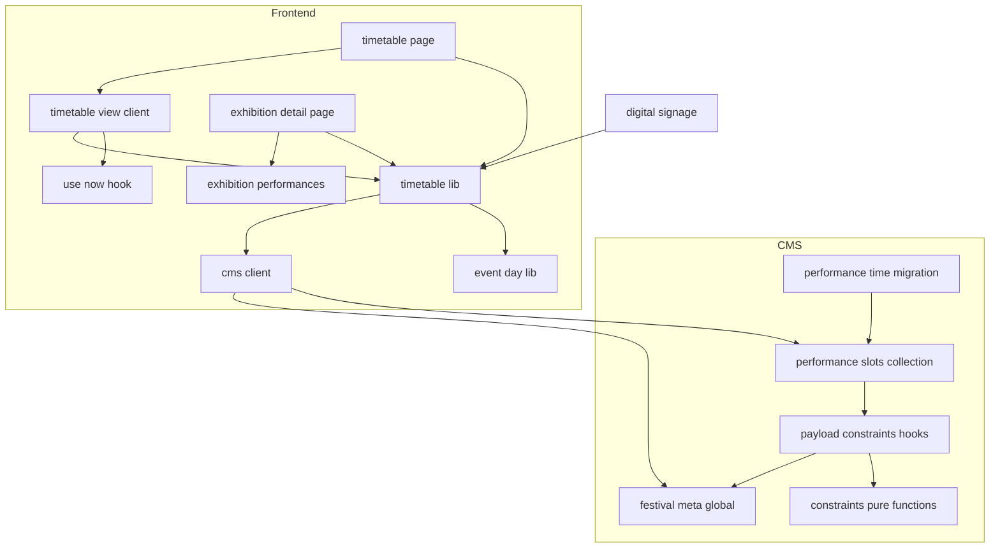
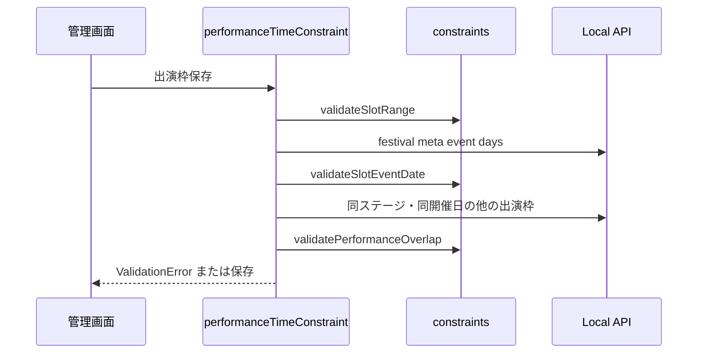
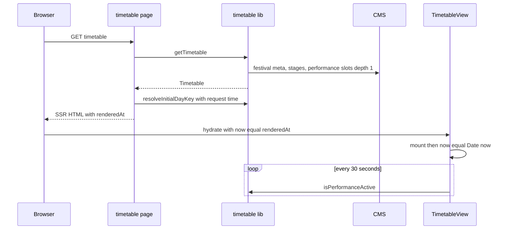
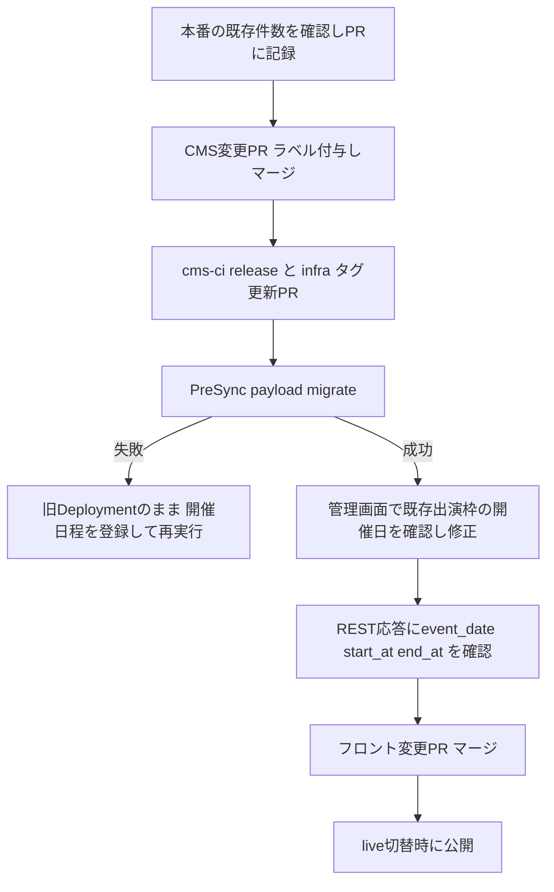

# Design Document

## Overview

**Purpose**: 来場者がステージ企画の出演予定を開催日ごとに確認し、いま行われている出演を見つけられるタイムテーブルページ(`/timetable`)を提供する。
**Users**: 来場者は会場や事前にタイムテーブルと企画詳細の出演時間を閲覧する。実行委員はCMS管理画面で開催日と時刻つきの出演枠を登録する。
**Impact**: `performance_slots`が開催日`event_date`・開始時刻`start_at`・終了時刻`end_at`を直接持つ形に改め、`time_slots`コレクションと`time_slot_id`を廃止する。同一ステージ・同一開催日の時間重なりと開催日程外の開催日を保存時検証で拒否する。フロントエンドに`/timetable`ページとデータ取得層`lib/timetable.ts`を新設し、企画詳細(カテゴリ`stage`)に出演時間の欄を加える。

### Goals
- 開催日×ステージでの出演予定の表示(PCは時刻を縦軸にした時間軸グリッド、SPはステージタブ+縦リスト)
- 開催日とJST時刻から枠の絶対時刻を求め、現在出演中の枠を1分以内の遅れで強調する
- 既存の出演枠に参照先スロットの時刻と開催日を移した状態で、`time_slots`を廃止するスキーマ変更を本番へ反映する
- 取得・現在枠判定を`digital-signage`が呼べる関数として公開する

### Non-Goals
- 公開フェーズの切替機構、ナビ・ヘッダー・トップページの導線(実装済み)
- サイネージの画面、構内マップへの導線、CMS障害時のエラーページの新設
- 日跨ぎ(24:00以降に終わる)枠の表現、URLによる開催日指定
- 出演枠の刻み・長さ・ステージ間の区切りの制約

## Boundary Commitments

### This Spec Owns
- `performance_slots`の`event_date`/`start_at`/`end_at`と、`time_slots`コレクション・`time_slot_id`の廃止(既存行の移行を含むマイグレーション)
- 出演枠の保存時検証(1.3/1.4/1.7)
- `frontend/src/lib/timetable.ts`の型・取得関数・現在枠判定(`digital-signage`が依存する契約)
- `/timetable`ページと、企画詳細(カテゴリ`stage`)の出演時間欄

### Out of Boundary
- `/timetable`の公開・非公開の判定(`lib/phase.ts`とmiddlewareの既存機構に従い、変更しない)
- ナビゲーション定義(`lib/navigation.ts`等)の変更
- `festival_meta`のスキーマ変更。`event_days`は読むだけ
- 企画一覧・企画カードの変更(8.5は現状維持で満たす)

### Allowed Dependencies
- CMS: Payload 3.88の`CollectionBeforeValidateHook`、`ValidationError`、Local API(`req.payload.find`/`findByID`/`findGlobal`)
- Frontend: `lib/cms.ts`、`lib/event-day.ts`、`lib/festival-meta.ts`のJST処理・開催日変換、`components/`の既存部品、Tailwindトークン
- 新規npm依存は追加しない

### Revalidation Triggers
- `Timetable`/`TimetablePerformance`の型、`findActivePerformances`の意味が変わる場合(`digital-signage`へ影響)
- `event_date`の保存形式(JSTの暦日のUTC正午)、`start_at`/`end_at`の意味(JSTの時・分だけを読む)を変える場合
- `/timetable`のフェーズ公開区分を変える場合

## Architecture

### Existing Architecture Analysis
- CMSの制約は「純粋関数`validate*`(`cms/src/hooks/constraints.ts`)+DBを引く`beforeValidate`フック(`cms/src/hooks/payload-constraints.ts`)」の2層。本specも同じ形で追加する
- 既存の`performanceSlotConstraint`(団体も表示名も無い出演枠の拒否。DBの`performance_slots_exhibition_or_title_required`と対応)と`stageAssignmentConstraint`(ステージ未選択の企画の割り当て拒否)は変更しない
- `stages`/`performance_slots`は未認証で全件読める。`student_exhibitions`は`PUBLISHED_FILTER`で`status=published`に絞られ、非公開の団体は`depth=1`のpopulateでもIDのまま返る
- 全ページはルートレイアウトの`cookies()`によりリクエスト時SSRで、キャッシュされない
- フロントのJST処理は`lib/event-day.ts`の`toJstParts`(UTC+9hをUTC getterで読む)に集約済み

### Architecture Pattern & Boundary Map



**Architecture Integration**:
- Selected pattern: 既存のレイヤー構成(CMS: 純粋関数+フック、Frontend: lib→components→app)への追加
- Domain/feature boundaries: 時刻の合成・現在枠判定は`lib/timetable.ts`だけが持つ。UIは`Timetable`モデルと`now`を受け取って描画するだけ
- Existing patterns preserved: `CmsResult`による取得、一覧系取得失敗時の例外→`error.tsx`、`aria-pressed`チップ、CSSによるPC/SP出し分け
- New components rationale: `lib/timetable.ts`(サイネージと共有する取得・判定)、`use-now.ts`(hydration安全な現在時刻)、`TimetableView`(開催日・ステージの選択状態)、`ExhibitionPerformances`(詳細ページの欄)
- Steering compliance: Edge Runtime(Node専用API不使用、`Intl`/`Date`のみ)、`any`不使用、型は`cms-types.ts`から導出

**Dependency Direction**: `cms-types` → `lib/cms` → `lib/event-day` → `lib/timetable` → `lib/use-now` → `components/timetable-*`/`components/exhibition-performances` → `app/(site)/timetable/page.tsx`・`app/(site)/exhibitions/[id]/[category]/page.tsx`。左の層は右の層をimportしない。CMS側は`constraints.ts` → `payload-constraints.ts` → `collections/*.ts`。

### Technology Stack

| Layer | Choice / Version | Role in Feature | Notes |
|-------|------------------|-----------------|-------|
| Frontend | Next.js 15 App Router / React 19 | `/timetable`のSSRとクライアントでの切替・強調更新 | 新規依存なし |
| Frontend | `Date`・`lib/event-day.ts` | JSTの暦日・時刻の算出と表示整形 | 日付ライブラリは導入しない |
| Backend | Payload 3.88 | 出演枠の`event_date`/`start_at`/`end_at`フィールド、`beforeValidate`検証 | 既存フックパターン |
| Data | Postgres 16(`@payloadcms/db-postgres` 3.88) | `performance_slots.event_date`/`start_at`/`end_at`(`timestamptz NOT NULL`) | 手書き補正付きマイグレーション |
| Infrastructure | `cms-ci.yml`/ArgoCD PreSync | マイグレーション適用 | 既存経路のまま |

## File Structure Plan

### Directory Structure
```
frontend/src/
├── lib/
│   ├── timetable.ts                # 取得・結合・時刻合成・初期開催日・現在枠判定(サイネージと共有)
│   ├── timetable.test.ts
│   ├── use-now.ts                  # サーバー描画時刻で初期化し一定間隔で更新する現在時刻フック
│   └── use-now.test.ts
├── components/
│   ├── timetable-view.tsx          # 'use client'。開催日切替・PC時間軸グリッド・SPタブとリスト・空表示
│   ├── timetable-view.test.tsx
│   ├── exhibition-performances.tsx # 企画詳細の出演時間欄とタイムテーブルへのリンク
│   └── exhibition-performances.test.tsx
└── app/(site)/timetable/
    ├── page.tsx                    # メタデータ・パンくず・取得・初期開催日の決定
    └── page.test.tsx
```

### Modified Files
- `cms/src/collections/time-slots.ts` — 削除
- `cms/src/collections/index.ts` — `TimeSlots`を除去
- `cms/src/components/EventDaySelect.tsx`、`cms/src/components/EventDayCell.tsx` — 出演枠の開催日を開催日程の「1日目(10/29)」形式で選ぶ・表示する管理画面部品(新規)
- `cms/src/collections/performance-slots.ts` — フィールドを`stage_id`、`event_date`、`start_at`、`end_at`、`exhibition_id`、`title`の順にし、`time_slot_id`を除去。`hooks.beforeValidate`に`performanceTimeConstraint`を追加
- `cms/src/hooks/constraints.ts` — `toJstMinuteOfDay`/`toSlotWindow`/`validateSlotRange`/`validateSlotEventDate`/`validatePerformanceOverlap`を追加
- `cms/src/hooks/payload-constraints.ts` — `performanceTimeConstraint`を追加
- `cms/src/migrations/<timestamp>_performance_slots_inline_time.ts`(+`.json`、`index.ts`登録) — `pnpm migrate:create performance_slots_inline_time`で生成し、既存行の値の移行とNOT NULL化を手で加える
- `cms/src/payload-types.ts`、`frontend/src/cms-types.ts` — `pnpm generate:types`で再生成
- `cms/scripts/seed-dev-exhibitions.ts` — 出演枠に開催日・時刻を直接設定する。開催日は`festival_meta.event_days`から読み、開催日程が無ければ中断する
- `cms/src/hooks/payload-constraints.int.test.ts`、`cms/src/db-constraints.int.test.ts` — フィクスチャを出演枠の`event_date`/`start_at`/`end_at`に更新し、期待する制約名のリストから`performance_slots_stage_time_slot_unique`を外す
- `frontend/src/lib/exhibitions.test.ts`、`frontend/src/lib/campus-map.test.ts` — 型再生成で壊れる出演枠フィクスチャを更新
- `docs/cms-operations.md` — ステージ出演枠の登録手順を、開催日・開始時刻・終了時刻を直接入力する形に更新
- `.kiro/steering/product.md` — `time_slots`の記述を除く
- `frontend/src/lib/event-day.ts` — `toJstDateKey(iso): string`(JSTの`YYYY-MM-DD`)を追加
- `frontend/src/app/layout.tsx`、`frontend/src/components/icons.tsx` — Material Symbolsの読み込み対象と`MaterialIcon`に`play_circle`を追加
- `frontend/src/app/(site)/exhibitions/[id]/[category]/page.tsx` — カテゴリ`stage`のとき`getExhibitionPerformances`を並行取得し`ExhibitionPerformances`を描画
- `frontend/src/lib/route-metadata.ts` — `'/timetable'`のタイトル・説明を追加
- `frontend/src/lib/route-classification.test.ts` — `'/timetable'`を`INTENTIONALLY_PRIVATE_ROUTES`へ追加
- `frontend/src/lib/crawl-targets.ts`、`frontend/src/app/sitemap.ts` — `'/timetable'`を`LIVE_ONLY_CODE_ROUTES`と`OWN_HANDLING_ROUTES`に追加し、公開フェーズではsitemapに載せる

## System Flows

### 保存時検証(CMS)



- 更新時は`{...originalDoc, ...data}`を検証対象にする(REST PATCHで一部フィールドだけが送られても判定できるように)
- 判定は1.3→1.4→1.7の順。前段に違反があれば以降は行わない(不正な範囲や開催日で重なりを判定しない)

### タイムテーブルの描画と強調更新



- 初期開催日はサーバーのリクエスト時刻で決め、クライアントでは再計算しない(日付境界付近でも初期表示が揺れない)
- 強調の判定は常にクライアントの`now`で行う。初回描画は`renderedAt`で計算するためSSRとhydrationの結果が一致する

## Requirements Traceability

| Requirement | Summary | Components | Interfaces | Flows |
|-------------|---------|------------|------------|-------|
| 1.1 | 開催日・開始/終了時刻を出演枠の必須フィールドで保持 | PerformanceSlotsCollection | `event_date`/`start_at`/`end_at` | — |
| 1.2 | 日付のみ・時刻のみの入力 | PerformanceSlotsCollection | `pickerAppearance` | — |
| 1.3 | 終了≤開始の拒否 | ConstraintFunctions, PerformanceTimeConstraint | `validateSlotRange` | 保存時検証 |
| 1.4 | 開催日程外の拒否 | ConstraintFunctions, PerformanceTimeConstraint | `validateSlotEventDate` | 保存時検証 |
| 1.5 | 既存行への時刻・開催日の設定 | PerformanceTimeMigration | migration `up` | Migration Strategy |
| 1.6 | `time_slots`廃止と破壊的変更検出の手続き | PerformanceTimeMigration | `cms-schema-check` | Migration Strategy |
| 1.7 | 同ステージ・同開催日の重なり拒否 | ConstraintFunctions, PerformanceTimeConstraint | `validatePerformanceOverlap` | 保存時検証 |
| 2.1, 2.6 | 開催日の切替項目とラベル | TimetableLib, TimetableView | `TimetableDay` | — |
| 2.2 | 選択中の開催日だけ表示 | TimetableView | `TimetableSlot.dateKey` | — |
| 2.3 | 再読込なしの切替 | TimetableView | state | — |
| 2.4, 2.5 | 初期表示の開催日 | TimetableLib, TimetablePage | `resolveInitialDayKey` | 描画 |
| 3.1–3.4 | PCの時間軸グリッド | TimetableView | `Timetable` | — |
| 4.1–4.5 | SPのタブとリスト | TimetableView | state | — |
| 5.1–5.4 | 団体名・表示名・遷移 | TimetableLib, TimetableView | `TimetablePerformance.href` | — |
| 5.5 | 非公開団体を出さない | TimetableLib | `toTimetable` | — |
| 6.1, 6.2 | 現在枠の強調 | TimetableLib, TimetableView | `isPerformanceActive` | 描画 |
| 6.3 | 1分以内の更新 | UseNow | `useNow` | 描画 |
| 6.4 | 色以外での判別 | TimetableView | 「出演中」ラベル | — |
| 7.1–7.3 | 空表示 | TimetableView | — | — |
| 8.1–8.4 | 企画詳細の出演時間とリンク | TimetableLib, ExhibitionPerformances | `getExhibitionPerformances` | — |
| 8.5 | 企画一覧に導線なし | (変更なし) | — | — |
| 9.1 | `/timetable`で提供 | TimetablePage | — | — |
| 9.2 | フェーズゲート | 既存middleware | `isPublicPath` | — |
| 9.3 | 公開データのみ | TimetableLib | 未認証REST | — |

## Components and Interfaces

| Component | Domain/Layer | Intent | Req Coverage | Key Dependencies (P0/P1) | Contracts |
|-----------|--------------|--------|--------------|--------------------------|-----------|
| PerformanceSlotsCollection | CMS collection | 開催日・時刻フィールドと検証フックの結線 | 1.1, 1.2 | PerformanceTimeConstraint (P0) | State |
| PerformanceTimeMigration | CMS migration | 列追加・既存行の移行・`time_slots`廃止 | 1.1, 1.5, 1.6 | festival_meta_event_days (P0), time_slots (P0) | Batch |
| ConstraintFunctions | CMS pure | JST分への正規化と各検証の純粋関数 | 1.3, 1.4, 1.7 | — | Service |
| PerformanceTimeConstraint | CMS hook | 出演枠保存時の検証(範囲・開催日・重なり) | 1.3, 1.4, 1.7 | ConstraintFunctions (P0), Local API (P0) | Service |
| TimetableLib | Frontend lib | 取得・結合・時刻合成・現在枠判定 | 2.1, 2.4–2.6, 5.1–5.5, 6.1, 6.2, 8.1, 8.2, 9.3 | cms client (P0), event-day (P0) | Service |
| UseNow | Frontend lib | hydration安全な現在時刻 | 6.3 | — | State |
| TimetablePage | Frontend app | SSR・メタデータ・初期開催日 | 2.4, 2.5, 9.1 | TimetableLib (P0) | — |
| TimetableView | Frontend UI | 開催日切替・PCグリッド・SPリスト・強調・空表示 | 2.1–2.3, 3.1–3.4, 4.1–4.5, 5.1–5.4, 6.1–6.4, 7.1–7.3 | TimetableLib (P0), UseNow (P0) | State |
| ExhibitionPerformances | Frontend UI | 詳細ページの出演時間欄とリンク | 8.1–8.4 | TimetableLib (P0) | — |

### CMS

#### PerformanceSlotsCollection

| Field | Detail |
|-------|--------|
| Intent | 出演枠に開催日と時刻を持たせ、保存時検証を結線する |
| Requirements | 1.1, 1.2 |

**Responsibilities & Constraints**
- フィールド順: `stage_id`、`event_date`、`start_at`、`end_at`、`exhibition_id`、`title`。`time_slot_id`は持たない
- `event_date`: `type: 'date'`、`required: true`、ラベル「開催日」。日付ピッカーは使わず、`admin.components.Field`に`EventDaySelect`、`admin.components.Cell`に`EventDayCell`を指定する
  - `EventDaySelect`: 祭基本情報の`event_days`を読み、各開催日を「`label`(`M/D`)」(例:「1日目(10/29)」、`label`が空なら「`M/D`」)の選択肢として開催日順に並べる。選ぶと、その開催日のJST暦日のUTC正午を`event_date`に書く。現在値が開催日程のどれとも一致しない場合は「`M/D`(開催日程外)」として選択肢に残す(保存時は1.4の検証で拒否される)。開催日程が空なら選択肢を出さず「祭基本情報で開催日程を登録してください」と表示する
  - `EventDayCell`: 一覧の開催日列を`EventDaySelect`と同じ文言で表示する
- `start_at`/`end_at`: `type: 'date'`、`required: true`、ラベル「開始時刻」「終了時刻」、`pickerAppearance: 'timeOnly'`、`displayFormat: 'HH:mm'`、説明文に「日本時間で入力」
- `hooks.beforeValidate`: `performanceSlotConstraint`、`stageAssignmentConstraint`、`performanceTimeConstraint`
- 管理画面での出演枠の名前(一覧の先頭列・編集画面の見出し・関連の選択肢): 団体があれば団体名、無ければ`title`。`admin.useAsTitle`にこの名前を持つ読み取り専用の仮想フィールド(編集フォームには出さない)を指定する。フロントエンドの名前の優先順位(公開団体の団体名→`title`)と同じ

**Contracts**: State [x]

##### State Management
- 保存形式: `event_date`は選んだ日付のUTC正午(`YYYY-MM-DDT12:00:00.000Z`)。JSTの暦日へ変換すると選んだ日付になる
- `start_at`/`end_at`の日付部分は意味を持たない。利用側はJSTの時・分だけを読む

#### PerformanceTimeMigration

| Field | Detail |
|-------|--------|
| Intent | 出演枠へ開催日・時刻を移して`time_slots`を廃止する |
| Requirements | 1.1, 1.5, 1.6 |

**Contracts**: Batch [x]

##### Batch / Job Contract
- Trigger: ArgoCD PreSync Jobの`payload migrate`
- Input / validation: `up`は1トランザクションで次を行う。生成されたSQLを手で次の順に補正する
  1. `performance_slots`に`event_date`・`start_at`・`end_at`をNULL可で追加
  2. 既存行の`start_at`/`end_at`を参照先`time_slots`からコピーし、`event_date`に「`festival_meta_event_days`の`start_at`最小値のJST暦日のUTC正午」を設定
  3. NULLが残っていれば(既存行があり開催日程が未登録)例外で失敗させ、残っていなければ3列を`SET NOT NULL`
  4. `performance_slots_stage_time_slot_unique`・`time_slot_id_id`のFK・インデックスと`time_slot_id_id`列を削除。`payload_locked_documents_rels.time_slots_id`の列・FK・インデックスを削除。`DROP TABLE time_slots`
- Output / destination: `performance_slots`の3列
- `down`: `time_slots`を再作成し、出演枠1件につき1スロット(`label`は`HH:mm〜HH:mm`)を作って`time_slot_id_id`を張り直す。UNIQUE・FKを戻して3列を削除する(開催日の情報は失われる)
- Idempotency & recovery: Payloadのマイグレーション管理で1回だけ適用される。失敗時はトランザクションが巻き戻りPreSyncが失敗し、Deploymentは旧イメージのまま残る

**Implementation Notes**
- Integration: ファイルは`pnpm migrate:create performance_slots_inline_time`で生成し、生成直後のSQLを手で補正する(生成物は既存行を考慮しない)。`.json`スナップショットは生成物のまま
- Validation: 既存行0件、既存行あり・開催日程あり、既存行あり・開催日程なし(失敗)の3通りと`down`をローカルDBで確認する
- Risks: 既存行はすべて初日になる。適用後に管理画面で確認する(Migration Strategy参照)

#### ConstraintFunctions

| Field | Detail |
|-------|--------|
| Intent | DBに依存しない時刻正規化と検証ロジック |
| Requirements | 1.3, 1.4, 1.7 |

**Contracts**: Service [x]

##### Service Interface
```typescript
/** JSTの暦日'YYYY-MM-DD'と、その日の0時からの分(0〜1439)で表した枠 */
type SlotWindow = {
  readonly dateKey: string;
  readonly startMinute: number;
  readonly endMinute: number;
};

type PerformanceWindow = SlotWindow & {
  readonly performanceId: string | number;
  /** 理由表示に使う名前。団体名か表示名 */
  readonly name: string;
};

type PerformanceTimeDoc = {
  readonly event_date?: unknown;
  readonly start_at?: unknown;
  readonly end_at?: unknown;
};

/** ISO文字列をJSTの暦日'YYYY-MM-DD'にする。解釈できなければnull */
declare function toJstDateKey(value: unknown): string | null;
/** ISO文字列をJSTの0時からの分にする。解釈できなければnull */
declare function toJstMinuteOfDay(value: unknown): number | null;
/** event_date/start_at/end_atの3つが解釈できればSlotWindowを返す */
declare function toSlotWindow(doc: PerformanceTimeDoc): SlotWindow | null;

/** 1.3: JSTの分でend <= startを拒否する(field: 'end_at') */
declare function validateSlotRange(doc: PerformanceTimeDoc): readonly ConstraintViolation[];

/** 1.4: event_dateの暦日が開催日程の暦日のいずれとも一致しなければ拒否(field: 'event_date') */
declare function validateSlotEventDate(
  doc: PerformanceTimeDoc,
  context: { readonly eventDayKeys: readonly string[] },
): readonly ConstraintViolation[];

/**
 * 1.7: targetと同じdateKeyかつ区間[start, end)が交差するothersを拒否理由にする(field: 'start_at')。
 * othersは呼び出し側が「同じステージ・自分以外の出演枠」に絞って渡す。
 */
declare function validatePerformanceOverlap(
  target: SlotWindow | null,
  context: { readonly others: readonly PerformanceWindow[] },
): readonly ConstraintViolation[];
```
- Preconditions: `ConstraintViolation`は既存型を使う
- Postconditions: 違反なしは空配列。重なりの理由には重なる出演枠の名前とJST時刻(`HH:mm〜HH:mm`)を列挙する
- Invariants: 区間は半開区間。終了時刻と次の開始時刻が同じ枠は重ならない。別の開催日の同時刻は重ならない

#### PerformanceTimeConstraint

| Field | Detail |
|-------|--------|
| Intent | DBを引いて純粋関数に渡し、違反を`ValidationError`で返す |
| Requirements | 1.3, 1.4, 1.7 |

**Dependencies**
- Outbound: `req.payload.findGlobal('festival_meta')` — 開催日程(P0)
- Outbound: `req.payload.find('performance_slots', depth 1)` — 同ステージ・同開催日の他の出演枠と、その団体(P0)

**Contracts**: Service [x]

##### Service Interface
```typescript
import type { CollectionBeforeValidateHook } from 'payload';

/** performance_slots.hooks.beforeValidate: 1.3 → 1.4 → 1.7の順に判定する */
declare const performanceTimeConstraint: CollectionBeforeValidateHook;
```
- 検証対象は`{...originalDoc, ...data}`
- 重なり判定の対象は、同じ`stage_id`かつ同じ開催日で自分以外(`id not_equals originalDoc.id`)の出演枠を`req.payload.find('performance_slots')`で集めたもの
- 名前は`exhibition_id.organization_name`、無ければ`title`
- すべての`req.payload`呼び出しに`req`を渡し、保存と同じトランザクションで読む(既存フックと同じ)

**Implementation Notes**
- Risks: 重なりの検証はDB制約にせず、読んでから書くため同時保存では競合しうる。管理者の同時編集は想定しない

### Frontend

#### TimetableLib

| Field | Detail |
|-------|--------|
| Intent | タイムテーブルの取得・結合・時刻合成・現在枠判定。`digital-signage`と共有する |
| Requirements | 2.1, 2.4, 2.5, 2.6, 5.1–5.5, 6.1, 6.2, 8.1, 8.2, 9.3 |

**Dependencies**
- Outbound: `cms.findGlobal('festival_meta')`、`cms.findMany('stages' | 'performance_slots')`(P0)
- Outbound: `lib/event-day.ts`の`toJstParts`/`toJstDateKey`/`formatEventDayLabel`/`formatEventDayTime`/`toEventDays`(P0)

**Contracts**: Service [x]

##### Service Interface
```typescript
export interface TimetableDay {
  /** JSTの暦日'YYYY-MM-DD'(event_days.start_atから算出) */
  readonly key: string;
  /** event_days.label、未入力ならformatEventDayLabel(start_at) */
  readonly label: string;
}

export interface TimetableStage {
  readonly id: number;
  readonly name: string;
}

export interface TimetableSlot {
  readonly dateKey: string;
  /** 出演枠の開催日とJST時刻を合成した絶対時刻(ISO) */
  readonly startAt: string;
  readonly endAt: string;
}

export interface TimetablePerformance {
  readonly id: number;
  readonly stageId: number;
  readonly slot: TimetableSlot;
  /** 公開団体の団体名、団体なしはtitle */
  readonly name: string;
  /** 公開団体なら'/exhibitions/{id}/stage'、それ以外はnull */
  readonly href: string | null;
}

export interface Timetable {
  /** 開催日順 */
  readonly days: readonly TimetableDay[];
  /** sort昇順(同値はid昇順) */
  readonly stages: readonly TimetableStage[];
  /** 開始時刻昇順 */
  readonly performances: readonly TimetablePerformance[];
}

export interface ExhibitionPerformance {
  readonly stageName: string;
  readonly dayLabel: string;
  readonly startAt: string;
  readonly endAt: string;
}

export type ExhibitionPerformancesResult =
  | { readonly kind: 'loaded'; readonly value: readonly ExhibitionPerformance[] }
  | { readonly kind: 'error'; readonly error: CmsFetchError };

/** 取得失敗時は例外を投げる(一覧系の既存規約) */
export declare function getTimetable(): Promise<Timetable>;

/** 取得結果の結合。純粋関数 */
export declare function toTimetable(sources: {
  readonly eventDays: FestivalMeta['event_days'];
  readonly stages: readonly Stage[];
  readonly performanceSlots: readonly PerformanceSlot[];
}): Timetable;

/** JSTの暦日と、JST時刻を持つISO文字列から絶対時刻(ISO)を作る */
export declare function combineJstDateTime(dateKey: string, timeIso: string): string;

/** nowのJST暦日がdaysにあればそのkey、無ければ先頭のkey、daysが空ならnull */
export declare function resolveInitialDayKey(
  days: readonly TimetableDay[],
  now: Date,
): string | null;

/** startAt <= now < endAt */
export declare function isPerformanceActive(slot: TimetableSlot, now: Date): boolean;

/** 現在出演中の出演枠(サイネージ向け)。stagesの順 */
export declare function findActivePerformances(
  timetable: Timetable,
  now: Date,
): readonly TimetablePerformance[];

/** 企画詳細用。開催日・開始時刻の昇順 */
export declare function getExhibitionPerformances(
  exhibitionId: number,
): Promise<ExhibitionPerformancesResult>;
```
- Preconditions: `performance_slots`は`depth: 1`・`limit: 0`で`stage_id`/`exhibition_id`をpopulateして取得する。`stages`は`depth: 0`・`limit: 0`。`time_slots`は取得しない
- Postconditions:
  - `exhibition_id`がオブジェクトかつ`status === 'published'`のときだけ団体名と`href`を持つ。IDのまま(非公開)なら`title`があれば団体なしと同じ扱い、無ければその出演枠を除く(5.5)
  - `TimetableSlot`は出演枠自身の`event_date`/`start_at`/`end_at`から作る。3つのいずれかが無い、または解釈できない出演枠は表示から除く
  - `Timetable.slots`は持たない。PCグリッドの表示範囲は選択日の出演枠の開始・終了時刻から求める
  - `ExhibitionPerformance.dayLabel`は開催日程のラベル(未入力時は`formatEventDayLabel`)。開催日程に無い日付は`formatEventDayLabel`で表す
- Invariants: 時刻・日付の算出はすべてJST。実行環境のタイムゾーンに依存しない(`toJstParts`と同じくUTC getterのみを使う)

#### UseNow

| Field | Detail |
|-------|--------|
| Intent | SSRとhydrationで一致する現在時刻を提供し、一定間隔で更新する |
| Requirements | 6.3 |

**Contracts**: State [x]

##### State Management
```typescript
/** 初回描画はinitialIso、マウント直後にDate.now()、以後intervalMsごとに更新 */
export declare function useNow(initialIso: string, intervalMs?: number): Date;
```
- 既定の`intervalMs`は30000(6.3の1分以内を満たす)。アンマウント時に`clearInterval`する

#### TimetablePage

| Field | Detail |
|-------|--------|
| Intent | `/timetable`のSSR。取得、初期開催日の決定、メタデータとパンくず |
| Requirements | 2.4, 2.5, 9.1 |

**Implementation Notes**
- `getTimetable()`の失敗は例外のまま`(site)/error.tsx`に委ねる
- `renderedAt = new Date().toISOString()`と`resolveInitialDayKey(days, new Date(renderedAt))`を`TimetableView`へ渡す
- 見出しは`SectionHeading`(h1「タイムテーブル」)、メタデータは`ROUTE_METADATA['/timetable']`、ページ外枠は既存ページの`max-w-[1440px] px-4 lg:px-20`に合わせる

#### TimetableView

| Field | Detail |
|-------|--------|
| Intent | 開催日・ステージの選択状態を持ち、PC表とSPリストを描画する |
| Requirements | 2.1–2.3, 3.1–3.4, 4.1–4.5, 5.1–5.4, 6.1–6.4, 7.1–7.3 |

**Contracts**: State [x]

##### State Management
```typescript
export interface TimetableViewProps {
  readonly timetable: Timetable;
  readonly initialDayKey: string | null;
  readonly renderedAt: string;
}
```
- State: `dayKey`(初期値`initialDayKey`)、`stageId`(初期値は先頭ステージ)。開催日を変えても`stageId`は保持する(4.5)
- 永続化しない(URLに載せない)

**Implementation Notes**
Figma: ファイル`0kWDqHsLr6xE8b4FFgR1Zx`、ページ「タイムテーブルページ」(`760:2`)の「タイムテーブル / PC (1440)」(`760:3`)と「タイムテーブル / SP (390)」(`760:4`)。ヘッダー・フッター・背景図形は共通部品に従い、フレームには含めない。部品はページ「コンポーネント」の`コンテンツ/タイムテーブル`(`790:4539`)にある。

- `TimetableSlot`(`783:605`、variant `State`=default/active × `Link`=true/false × `Size`=regular/compact): PCの出演枠
- `TimetableStageHeader`(`782:561`): PCの列見出し。帯の色をステージ色に差し替えて使う
- `TimetableNowIndicator`(`782:564`): PCの現在時刻の線とラベル
- `StageTab`(`783:611`、variant `State`=default/selected): SPのステージタブ
- `TimetableRow`(`784:592`、variant `State`=default/active × `Link`=true/false): SPの出演枠の行

- 見出し「タイムテーブル」と開催日切替の配置は企画一覧と同じ(見出しは中央揃え、切替は左揃え)。開催日切替は`exhibition-filters.tsx`と同じ`aria-pressed`付き丸型チップ(`border-primary bg-primary`/`border-gray-200 bg-background`)。`days`が空なら切替を出さず「出演予定はありません」(7.2)
- ステージ色: ステージを表示順に`bansai-ochre`→`bansai-sage`→`bansai-salmon`→`bansai-wisteria`→`bansai-olive`→`bansai-rose`の順で割り当て、7つ目以降は先頭から繰り返す。`bansai-aqua`は出演中の`info`と色相が近いため使わない。色は識別用の帯にだけ使い、文字色にはしない
- PC(`hidden lg:block`): 時刻を縦軸、ステージを列とする時間軸グリッド。出演枠の区切りがステージ間で揃わない場合でも、同時刻の出演が同じ高さに並ぶ(3.1)
  - 左端に時刻列(68px)、残りをステージ数で等分する。列の境界は`gray-200`の1px線。列が狭くなりすぎる場合はグリッドの容器を横スクロールさせる
  - 列見出しは高さ48px。上端に高さ4pxのステージ色の帯、その下にステージ名(14px Bold)
  - 縦の尺度は1分=4px。表示範囲は選択日の最も早い開始時刻を正時に切り下げた時刻から、最も遅い終了時刻を正時に切り上げた時刻まで。正時に`gray-200`の実線、30分に`gray-200`の破線を全列に引き、時刻列に正時と30分の`HH:mm`(12px、`gray-600`)を置く
  - 出演枠は開始・終了の位置に絶対配置し、列内で左右4px・上下2pxの余白を取る。塗り`gray-100`、枠線`gray-200`1px、角丸4px。中身は1行目`HH:mm〜HH:mm`(12px、`gray-600`)、2行目に名前(14px Bold)。15分未満の枠は時刻と名前を1行に並べ、収まらない分は切り詰める
  - 空欄は何も描かない(3.4)。選択日に出演枠が1件も無ければグリッドの代わりに空表示(7.1)
  - 各ステージ列はステージ名の見出しと、出演枠を開始時刻順に並べたリストとしてマークアップし、読み上げ順はステージごと・時刻順とする。時刻の目盛りと現在時刻の線は`aria-hidden`
- SP(`lg:hidden`): 開催日切替の下24pxにステージタブ、その下に選択ステージ×選択日の出演枠リスト。0件なら空表示(7.1/7.3)
  - ステージタブは`aria-pressed`付きの下線型ボタンを横スクロールで並べる。先頭タブの文字をコンテンツ左端に揃える。非選択は14px Regular・`gray-600`、選択中は14px Bold・`text`で、下端に高さ4pxのステージ色の帯。タブ行の下端に全幅の`gray-200`1px線
  - 各行は上下16px、区切りは`gray-200`1px。左の時刻列(64px)に開始`HH:mm`(16px Bold)と`〜HH:mm`(12px、`gray-600`)、右に名前(16px Regular)
- 出演枠: `href`があれば枠(SPは行)全体を`next/link`にし、右端に`chevron_right`(20px、`text`)を置く。PCでは名前の行と縦中央を揃える。`href`が無ければ非リンクでアイコンも出さない(5.3/5.4)。サイト内遷移のため`open_in_new`は使わない
- 強調(6.1/6.2/6.4): `isPerformanceActive(performance.slot, now)`が真の枠を`bg-info`で塗り(PCは枠線なし、SPは行を画面の横幅いっぱいまで塗り、文字の位置は他の行と揃える)、`MaterialIcon`(`play_circle`)と「出演中」(12px Bold)を表示し、`aria-current="true"`を付ける。絶対時刻で判定するため、選択日が今日でなければ自然に強調されない
- 現在時刻の線(PCのみ): 選択日が現在の日本時間の日付で、`now`が表示範囲内にあるとき、その位置にステージ列の全幅を横断する`text`色2pxの線を出演枠より前面に引く。時刻列の同じ高さに`HH:mm`の角丸ラベル(塗り`text`、文字`background`、12px)を置く。`now`の更新(強調と同じ周期)に合わせて動く
- 時刻の数字は`tabular-nums`で桁幅を揃える
- 空表示の文言は1種類「出演予定はありません」(`text-gray-600`)

#### ExhibitionPerformances

| Field | Detail |
|-------|--------|
| Intent | 企画詳細(カテゴリ`stage`)の出演時間欄とタイムテーブルへのリンク |
| Requirements | 8.1–8.4 |

**Implementation Notes**
- Props: `{ readonly performances: readonly ExhibitionPerformance[] }`。0件なら何も描画しない(8.3)
- 見出し「出演時間」(詳細ページの「紹介」と同じh2スタイル)、各行に開催日ラベル・`HH:mm〜HH:mm`・ステージ名、末尾に`/timetable`へのリンクを1本
- 詳細ページは`category === 'stage'`のときだけ`getExhibitionPerformances`を呼び、`kind: 'error'`なら欄ごと出さない(既存の区画取得失敗と同じ縮退)
- 企画一覧(`exhibition-card.tsx`等)は変更しない(8.5)

## Data Models

### Domain Model
- 出演枠: ステージ×開催日(暦日)×開始・終了時刻(JSTの時・分)(+団体または表示名)
- 不変条件: 開始<終了(同日内)、開催日∈開催日程、同一ステージで同じ開催日の出演枠どうしは時間が交差しない

### Physical Data Model
- `performance_slots`に`event_date`・`start_at`・`end_at`(各`timestamp(3) with time zone NOT NULL`)を持たせ、`time_slot_id_id`列と`time_slots`テーブル、`performance_slots_stage_time_slot_unique`を廃止する。インデックスは追加しない(件数が数十件規模で、検証はステージ・開催日条件の`find`で足りる)
- 既存の`performance_slots_exhibition_or_title_required`は維持

### Data Contracts & Integration
- REST応答の`PerformanceSlot`に`event_date`/`start_at`/`end_at`(いずれも`string`)が加わり、`time_slot_id`は無くなる(`pnpm generate:types`で`frontend/src/cms-types.ts`へ反映)
- フロントは`performance_slots?depth=1&limit=0`で`stage_id`/`exhibition_id`をpopulateして受け取る

## Error Handling

### Error Strategy
- CMS: 検証違反は`ValidationError`(フィールドパス付き)で保存を拒否し、管理画面に理由を表示する。メッセージは既存と同じ簡潔な日本語
  - 1.3「終了時刻は開始時刻より後にしてください」(`end_at`)
  - 1.4「開催日は祭基本情報の開催日程から選んでください」(`event_date`)
  - 1.7「同じステージの出演枠と時間が重なっています: {名前} {HH:mm〜HH:mm}」(`start_at`)
- Frontend: `/timetable`の取得失敗は例外として既存の`error.tsx`に委ねる。企画詳細の出演時間の取得失敗は欄を出さずに縮退する
- データ欠損(出演枠の`event_date`/`start_at`/`end_at`無し・不正、非公開団体でtitle無し)は該当枠を表示から除き、ページ全体は落とさない

### Monitoring
- 追加しない。マイグレーション失敗はPreSync Jobの失敗としてArgoCDで確認する

## Testing Strategy

- Unit(CMS `constraints.test.ts`): `toJstMinuteOfDay`が日付部分の異なる`start_at`/`end_at`でも時刻だけで比較されること、`toSlotWindow`の3項目そろい・欠損、`validateSlotRange`の等値・逆転、`validateSlotEventDate`の開催日程内外・開催日程空、`validatePerformanceOverlap`の半開区間境界(接する枠は通す)と別日の同時刻は通すこと、理由に名前と`HH:mm〜HH:mm`が入ること
- Integration(CMS `payload-constraints.int.test.ts`): 出演枠作成・更新時の重なり拒否(1.7)、終了≤開始の拒否(1.3)、開催日程外の開催日の拒否(1.4)、別ステージ・別日は保存できること
- Integration(CMS `db-constraints.int.test.ts`): 期待する制約名から`performance_slots_stage_time_slot_unique`を外して通ること
- Migration: ローカルDBで既存行0件/既存行あり・開催日程あり/既存行あり・開催日程なし(失敗)と`down`を確認
- Unit(Frontend `timetable.test.ts`): `combineJstDateTime`(UTC実行環境でJSTの合成が正しい)、`resolveInitialDayKey`(当日・期間外・JSTの0時直前直後)、`toTimetable`の公開団体の`href`・非公開団体の除外・`title`表示・並び順・`event_date`/時刻が欠けた出演枠の除外、`isPerformanceActive`の境界(開始ちょうど真、終了ちょうど偽)、`getExhibitionPerformances`の並び順
- Component(`timetable-view.test.tsx`、`exhibition-performances.test.tsx`): 開催日切替で表示が替わりステージ選択が保持される、空表示3種、強調枠に「出演中」テキストと`aria-current`、`useNow`をフェイクタイマーで進めて強調が移る、PCで出演枠の上端・高さが表示範囲の開始からの分×4pxになる、現在時刻の線が選択日が今日のときだけ出る、出演枠0件で欄が出ない
- Route: `route-classification.test.ts`で`/timetable`が非公開分類に入り、開催前はゲートされること

## Migration Strategy



- **検出の扱い(1.6)**: `cms-schema-check.yml`は`time_slots`コレクションの削除と`time_slot_id`フィールドの削除を破壊的変更として検出する。現行の`frontend/src`の非テストコードに`time_slots`・`time_slot_id`の参照が無い(`cms-types.ts`と型再生成で更新するテストフィクスチャのみ)ことと、本番のフロントエンドが参照していないことを確認したうえで、PRに`breaking-change-acknowledged`ラベルを付ける
- **既存件数の確認**: マージ前に`make kubectl`経由で本番DBの`performance_slots`・`time_slots`・`festival_meta_event_days`の件数を確認し、PR本文に記録する
- **既存行がない場合**: 値の移行は空振りし、そのままNOT NULL化される
- **既存行がある場合**: 全行が初日になる。PreSync成功後、live切替前に実行委員が管理画面で2日目以降の出演枠の開催日を修正する(1.5)。修正時は1.4/1.7の検証が働く
- **開催日程が未登録で既存行がある場合**: マイグレーションが失敗しDeploymentは切り替わらない。祭基本情報に開催日程を登録してからJobを再実行する
- **反映順**: CMSを先に本番反映し、REST応答に`event_date`/`start_at`/`end_at`が含まれることを確認してからフロントのPRをマージする。`/timetable`と企画詳細は開催前フェーズでは非公開のため、順序が前後しても来場者への影響は無い
- **Rollback**: `down`(`time_slots`を出演枠1件につき1スロットで再作成し、開催日の情報は失われる)
